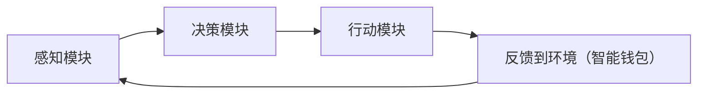

# AI Agent在智能钱包中的个人财务管理

> 关键词：AI Agent、智能钱包、个人财务管理、自动化、数据驱动决策

> 摘要：本文聚焦于AI Agent在智能钱包个人财务管理领域的应用。详细阐述了AI Agent的核心概念、与智能钱包的联系，深入解析其核心算法原理及具体操作步骤，借助数学模型和公式进行理论支撑，并结合实际案例展示了在智能钱包中运用AI Agent实现个人财务管理的过程。同时探讨了实际应用场景，推荐了相关的学习资源、开发工具和论文著作，最后对未来发展趋势与挑战进行了总结，并提供常见问题解答和扩展阅读参考资料，旨在为读者全面呈现AI Agent在个人财务管理中的重要作用和应用前景。

## 1. 背景介绍 
### 1.1 目的和范围
在当今数字化时代，个人财务管理的复杂性日益增加，人们需要更加高效、智能的工具来管理自己的财务。智能钱包作为一种集成了多种金融功能的应用程序，已经成为人们日常生活中不可或缺的一部分。而AI Agent（人工智能代理）的出现，为智能钱包的个人财务管理带来了新的机遇和挑战。本文的目的是探讨AI Agent在智能钱包中个人财务管理的应用，包括其核心概念、算法原理、实际应用场景等方面，旨在为相关领域的研究和实践提供参考。

本文的范围主要涵盖AI Agent在智能钱包个人财务管理中的基本原理、技术实现和应用案例。不涉及过于深入的底层技术细节，而是侧重于从宏观和应用的角度进行分析和探讨。

### 1.2 预期读者
本文的预期读者包括对人工智能、金融科技和个人财务管理感兴趣的技术人员、研究人员、金融从业者以及普通用户。对于技术人员，本文可以提供AI Agent在智能钱包中的具体实现思路和方法；对于研究人员，本文可以为相关领域的研究提供参考；对于金融从业者，本文可以帮助他们了解AI Agent在个人财务管理中的应用前景和潜在价值；对于普通用户，本文可以让他们更好地理解智能钱包中AI Agent的功能和作用，从而更好地管理自己的财务。

### 1.3 文档结构概述
本文将按照以下结构进行组织：
- 核心概念与联系：介绍AI Agent和智能钱包的核心概念，以及它们之间的联系。
- 核心算法原理 & 具体操作步骤：详细阐述AI Agent在智能钱包个人财务管理中所使用的核心算法原理，并给出具体的操作步骤。
- 数学模型和公式 & 详细讲解 & 举例说明：运用数学模型和公式对AI Agent的决策过程进行描述和分析，并通过具体例子进行说明。
- 项目实战：代码实际案例和详细解释说明：通过一个实际的项目案例，展示AI Agent在智能钱包个人财务管理中的具体实现过程，并对代码进行详细解释。
- 实际应用场景：探讨AI Agent在智能钱包个人财务管理中的实际应用场景。
- 工具和资源推荐：推荐一些学习和开发AI Agent在智能钱包个人财务管理方面的工具和资源。
- 总结：未来发展趋势与挑战：对AI Agent在智能钱包个人财务管理中的未来发展趋势进行总结，并分析可能面临的挑战。
- 附录：常见问题与解答：提供一些常见问题的解答，帮助读者更好地理解本文的内容。
- 扩展阅读 & 参考资料：提供一些扩展阅读的资料和参考文献，方便读者进一步深入研究。

### 1.4 术语表
#### 1.4.1 核心术语定义
- **AI Agent（人工智能代理）**：是一种能够感知环境、自主决策并采取行动以实现特定目标的人工智能实体。在智能钱包个人财务管理中，AI Agent可以根据用户的财务数据和偏好，提供个性化的财务管理建议和决策支持。
- **智能钱包**：是一种集成了多种金融功能的应用程序，如支付、转账、理财等。智能钱包可以通过与银行、支付机构等金融机构的接口，实现用户财务数据的实时获取和管理。
- **个人财务管理**：是指个人对自己的收入、支出、资产、负债等财务状况进行管理和规划的过程。个人财务管理的目标是实现财务的健康和稳定，提高生活质量。

#### 1.4.2 相关概念解释
- **自动化决策**：AI Agent可以根据预设的规则和算法，自动对用户的财务数据进行分析和处理，并做出决策。例如，当用户的支出超过预算时，AI Agent可以自动提醒用户并提供相应的建议。
- **数据驱动决策**：AI Agent的决策过程是基于用户的财务数据和历史记录进行的。通过对大量数据的分析和挖掘，AI Agent可以发现用户的消费模式和偏好，从而提供更加个性化的财务管理建议。
- **个性化推荐**：AI Agent可以根据用户的财务状况、风险偏好、消费习惯等因素，为用户提供个性化的理财产品推荐、投资建议等。

#### 1.4.3 缩略词列表
- **AI**：Artificial Intelligence（人工智能）
- **ML**：Machine Learning（机器学习）
- **DL**：Deep Learning（深度学习）
- **API**：Application Programming Interface（应用程序编程接口）

## 2. 核心概念与联系 

### 2.1 AI Agent核心概念
AI Agent是一种具有自主能力的软件实体，它能够感知周围环境的信息，根据自身的目标和规则进行推理和决策，并采取相应的行动。在个人财务管理的智能钱包场景中，AI Agent可以看作是一个智能的财务助手，它通过与智能钱包系统进行交互，获取用户的财务数据，如收入、支出、资产、负债等信息，然后基于这些数据进行分析和处理。

从架构上来说，一个典型的AI Agent包含以下几个主要部分：
- **感知模块**：负责从智能钱包中收集各种财务数据，例如通过API接口获取银行交易记录、信用卡消费信息等。
- **决策模块**：这是AI Agent的核心部分，它运用各种算法和模型对感知到的数据进行分析，根据预设的目标和规则做出决策。例如，判断用户是否超支、是否需要调整投资组合等。
- **行动模块**：根据决策模块的结果，AI Agent可以采取相应的行动。比如，向用户发送提醒消息、自动执行转账操作等。

下面是一个简单的Mermaid流程图，展示了AI Agent的基本工作流程：


### 2.2 智能钱包核心概念
智能钱包是一种集成了多种金融功能的数字化钱包，它不仅可以实现传统的支付功能，还具备财务管理、理财规划等高级功能。智能钱包通常与银行、支付机构等金融系统进行连接，以实现资金的安全存储和便捷交易。

智能钱包的主要功能包括：
- **支付功能**：支持线上线下的各种支付方式，如扫码支付、NFC支付等。
- **账户管理**：用户可以在智能钱包中管理自己的多个银行账户、信用卡账户等，实时查看账户余额和交易记录。
- **理财功能**：提供各种理财产品的推荐和购买服务，帮助用户实现资产的增值。

### 2.3 AI Agent与智能钱包的联系
AI Agent与智能钱包之间存在着紧密的联系。AI Agent可以增强智能钱包的功能，使其更加智能化和个性化。具体体现在以下几个方面：
- **数据利用**：智能钱包为AI Agent提供了丰富的财务数据，这些数据是AI Agent进行决策的基础。AI Agent通过对这些数据的分析和挖掘，可以深入了解用户的财务状况和消费习惯。
- **个性化服务**：基于对用户数据的分析，AI Agent可以为智能钱包用户提供个性化的财务管理建议和服务。例如，根据用户的收入和支出情况，为用户制定合理的预算计划；根据用户的风险偏好，推荐适合的理财产品。
- **自动化操作**：AI Agent可以在智能钱包中实现自动化的财务管理操作。例如，当用户的信用卡账单到期时，AI Agent可以自动提醒用户还款；当用户的账户余额达到一定阈值时，AI Agent可以自动将多余的资金转入理财产品中。

## 3. 核心算法原理 & 具体操作步骤 

### 3.1 核心算法原理

#### 3.1.1 基于规则的算法
基于规则的算法是一种简单而有效的决策算法，它通过预设的规则来判断和决策。在智能钱包的个人财务管理中，基于规则的算法可以用于实现一些基本的财务管理功能，如预算控制、账单提醒等。

以下是一个基于规则的预算控制算法的Python示例代码：
```python
class BudgetController:
    def __init__(self, budget):
        self.budget = budget
        self.expenses = 0

    def add_expense(self, amount):
        self.expenses += amount
        if self.expenses > self.budget:
            print("警告：您已超出预算！")
        return self.expenses

# 使用示例
budget = 1000
controller = BudgetController(budget)
controller.add_expense(800)
controller.add_expense(300)
```
在这个代码中，`BudgetController`类表示一个预算控制器，它包含一个预算金额和当前的支出金额。`add_expense`方法用于添加新的支出，并检查是否超出预算。如果超出预算，则输出警告信息。

#### 3.1.2 机器学习算法
机器学习算法可以通过对大量历史数据的学习，发现数据中的模式和规律，从而进行预测和决策。在智能钱包的个人财务管理中，机器学习算法可以用于预测用户的消费趋势、识别异常交易等。

以下是一个使用简单线性回归模型预测用户消费的Python示例代码：
```python
import numpy as np
from sklearn.linear_model import LinearRegression

# 模拟历史消费数据
months = np.array([1, 2, 3, 4, 5, 6]).reshape(-1, 1)
expenses = np.array([100, 120, 130, 150, 160, 180])

# 创建线性回归模型
model = LinearRegression()
model.fit(months, expenses)

# 预测第7个月的消费
next_month = np.array([7]).reshape(-1, 1)
predicted_expense = model.predict(next_month)
print(f"预测第7个月的消费为：{predicted_expense[0]}")
```
在这个代码中，我们使用`sklearn`库中的`LinearRegression`类创建了一个线性回归模型，并使用历史消费数据进行训练。然后，我们使用训练好的模型预测第7个月的消费。

### 3.2 具体操作步骤

#### 3.2.1 数据收集
AI Agent首先需要从智能钱包中收集用户的财务数据。这可以通过与智能钱包的API接口进行交互来实现。例如，使用Python的`requests`库发送HTTP请求获取用户的交易记录。
```python
import requests

# 假设智能钱包提供了一个API接口来获取交易记录
api_url = "https://example.com/api/transactions"
headers = {
    "Authorization": "Bearer <your_token>"
}
response = requests.get(api_url, headers=headers)
if response.status_code == 200:
    transactions = response.json()
    print(transactions)
else:
    print("获取交易记录失败！")
```

#### 3.2.2 数据预处理
收集到的数据可能存在噪声、缺失值等问题，需要进行预处理。例如，对数据进行清洗、归一化等操作。
```python
import pandas as pd

# 假设transactions是一个包含交易记录的列表
df = pd.DataFrame(transactions)
# 处理缺失值
df = df.fillna(0)
# 数据归一化
df['amount'] = (df['amount'] - df['amount'].min()) / (df['amount'].max() - df['amount'].min())
```

#### 3.2.3 算法选择和训练
根据具体的业务需求，选择合适的算法进行训练。例如，如果需要进行消费预测，可以选择使用线性回归、决策树等算法。
```python
from sklearn.model_selection import train_test_split
from sklearn.tree import DecisionTreeRegressor

# 假设我们使用交易日期和交易金额进行预测
X = df[['date']]
y = df['amount']
X_train, X_test, y_train, y_test = train_test_split(X, y, test_size=0.2, random_state=42)

# 创建决策树回归模型
model = DecisionTreeRegressor()
model.fit(X_train, y_train)
```

#### 3.2.4 决策和行动
使用训练好的模型进行决策，并根据决策结果采取相应的行动。例如，如果预测到用户下个月的消费将超出预算，可以向用户发送提醒消息。
```python
# 预测下个月的消费
next_month_date = pd.DataFrame([[7]], columns=['date'])
predicted_amount = model.predict(next_month_date)

if predicted_amount > budget:
    print("警告：预计下个月您将超出预算，请合理安排支出！")
```

## 4. 数学模型和公式 & 详细讲解 & 举例说明 

### 4.1 线性回归模型
线性回归是一种常用的机器学习算法，用于建立自变量和因变量之间的线性关系。在智能钱包的个人财务管理中，线性回归可以用于预测用户的消费趋势。

#### 4.1.1 数学公式
线性回归模型的基本形式为：
$$y = \beta_0 + \beta_1x_1 + \beta_2x_2 + \cdots + \beta_nx_n + \epsilon$$
其中，$y$ 是因变量（如消费金额），$x_1, x_2, \cdots, x_n$ 是自变量（如时间、收入等），$\beta_0, \beta_1, \cdots, \beta_n$ 是模型的参数，$\epsilon$ 是误差项。

在简单线性回归中，只有一个自变量，公式可以简化为：
$$y = \beta_0 + \beta_1x + \epsilon$$

#### 4.1.2 详细讲解
线性回归的目标是找到一组最优的参数 $\beta_0$ 和 $\beta_1$，使得预测值 $\hat{y}$ 与真实值 $y$ 之间的误差最小。通常使用最小二乘法来求解参数，即最小化误差平方和：
$$S(\beta_0, \beta_1) = \sum_{i=1}^{m}(y_i - \hat{y}_i)^2 = \sum_{i=1}^{m}(y_i - (\beta_0 + \beta_1x_i))^2$$
通过对 $S(\beta_0, \beta_1)$ 分别求关于 $\beta_0$ 和 $\beta_1$ 的偏导数，并令其等于0，可以得到参数的估计值：
$$\hat{\beta}_1 = \frac{\sum_{i=1}^{m}(x_i - \bar{x})(y_i - \bar{y})}{\sum_{i=1}^{m}(x_i - \bar{x})^2}$$
$$\hat{\beta}_0 = \bar{y} - \hat{\beta}_1\bar{x}$$
其中，$\bar{x}$ 和 $\bar{y}$ 分别是 $x$ 和 $y$ 的均值。

#### 4.1.3 举例说明
假设我们有以下历史消费数据：
| 月份 | 消费金额 |
| ---- | ---- |
| 1 | 100 |
| 2 | 120 |
| 3 | 130 |
| 4 | 150 |
| 5 | 160 |
| 6 | 180 |

我们可以使用线性回归模型预测第7个月的消费金额。首先，计算均值：
$$\bar{x} = \frac{1 + 2 + 3 + 4 + 5 + 6}{6} = 3.5$$
$$\bar{y} = \frac{100 + 120 + 130 + 150 + 160 + 180}{6} = 140$$
然后，计算 $\hat{\beta}_1$ 和 $\hat{\beta}_0$：
$$\sum_{i=1}^{6}(x_i - \bar{x})(y_i - \bar{y}) = (1 - 3.5)(100 - 140) + (2 - 3.5)(120 - 140) + \cdots + (6 - 3.5)(180 - 140) = 175$$
$$\sum_{i=1}^{6}(x_i - \bar{x})^2 = (1 - 3.5)^2 + (2 - 3.5)^2 + \cdots + (6 - 3.5)^2 = 17.5$$
$$\hat{\beta}_1 = \frac{175}{17.5} = 10$$
$$\hat{\beta}_0 = 140 - 10 \times 3.5 = 105$$
所以，线性回归模型为：
$$y = 105 + 10x$$
预测第7个月的消费金额为：
$$y = 105 + 10 \times 7 = 175$$

### 4.2 决策树模型
决策树是一种基于树结构进行决策的机器学习算法。在智能钱包的个人财务管理中，决策树可以用于识别异常交易。

#### 4.2.1 数学公式
决策树的基本思想是通过对特征空间进行划分，将样本分为不同的类别。每个内部节点表示一个特征上的测试，每个分支表示一个测试输出，每个叶节点表示一个类别或值。

决策树的构建过程通常使用信息增益、基尼指数等指标来选择最优的划分特征。以信息增益为例，信息增益的计算公式为：
$$IG(D, A) = H(D) - H(D|A)$$
其中，$D$ 是数据集，$A$ 是特征，$H(D)$ 是数据集 $D$ 的信息熵，$H(D|A)$ 是在特征 $A$ 条件下数据集 $D$ 的条件熵。

信息熵的计算公式为：
$$H(D) = -\sum_{k=1}^{K}p_k\log_2p_k$$
其中，$K$ 是类别数，$p_k$ 是第 $k$ 类样本在数据集 $D$ 中所占的比例。

条件熵的计算公式为：
$$H(D|A) = \sum_{v=1}^{V}\frac{|D^v|}{|D|}H(D^v)$$
其中，$V$ 是特征 $A$ 的取值数，$D^v$ 是特征 $A$ 取值为 $v$ 的样本子集。

#### 4.2.2 详细讲解
决策树的构建过程如下：
1. 选择一个最优的划分特征，使得信息增益最大。
2. 根据该特征的取值将数据集划分为不同的子集。
3. 对每个子集递归地重复步骤1和步骤2，直到满足终止条件（如子集样本数小于某个阈值、所有样本属于同一类别等）。

#### 4.2.3 举例说明
假设我们有以下交易数据：
| 交易金额 | 交易时间 | 是否异常 |
| ---- | ---- | ---- |
| 100 | 上午 | 否 |
| 200 | 下午 | 否 |
| 1000 | 晚上 | 是 |
| 500 | 上午 | 否 |

我们可以使用决策树模型来识别异常交易。首先，计算数据集的信息熵：
$$H(D) = -\frac{3}{4}\log_2\frac{3}{4} - \frac{1}{4}\log_2\frac{1}{4} = 0.811$$
然后，分别计算交易金额和交易时间的信息增益：
- 对于交易金额：
    - 划分后子集的信息熵：
        - 交易金额小于等于500的子集：$H(D_1) = -\frac{3}{3}\log_2\frac{3}{3} = 0$
        - 交易金额大于500的子集：$H(D_2) = -\frac{1}{1}\log_2\frac{1}{1} = 0$
    - 条件熵：
        $$H(D|交易金额) = \frac{3}{4} \times 0 + \frac{1}{4} \times 0 = 0$$
    - 信息增益：
        $$IG(D, 交易金额) = 0.811 - 0 = 0.811$$
- 对于交易时间：
    - 划分后子集的信息熵：
        - 上午的子集：$H(D_3) = -\frac{2}{2}\log_2\frac{2}{2} = 0$
        - 下午的子集：$H(D_4) = -\frac{1}{1}\log_2\frac{1}{1} = 0$
        - 晚上的子集：$H(D_5) = -\frac{1}{1}\log_2\frac{1}{1} = 0$
    - 条件熵：
        $$H(D|交易时间) = \frac{2}{4} \times 0 + \frac{1}{4} \times 0 + \frac{1}{4} \times 0 = 0$$
    - 信息增益：
        $$IG(D, 交易时间) = 0.811 - 0 = 0.811$$

由于交易金额和交易时间的信息增益相同，我们可以任选一个作为根节点进行划分。假设我们选择交易金额，划分后的决策树如下：
```
        交易金额
      /        \
<=500        >500
  否           是
```

## 5. 项目实战：代码实际案例和详细解释说明 

### 5.1  开发环境搭建
为了实现AI Agent在智能钱包中的个人财务管理，我们需要搭建一个合适的开发环境。以下是具体的步骤：

#### 5.1.1 安装Python
Python是一种广泛使用的编程语言，拥有丰富的机器学习和数据处理库。我们可以从Python官方网站（https://www.python.org/downloads/）下载并安装最新版本的Python。

#### 5.1.2 创建虚拟环境
为了避免不同项目之间的依赖冲突，我们建议使用虚拟环境。可以使用`venv`模块来创建虚拟环境：
```bash
python -m venv myenv
```
激活虚拟环境：
- 在Windows上：
```bash
myenv\Scripts\activate
```
- 在Linux/Mac上：
```bash
source myenv/bin/activate
```

#### 5.1.3 安装必要的库
在虚拟环境中，我们需要安装一些必要的库，如`pandas`、`numpy`、`scikit-learn`等。可以使用`pip`来安装：
```bash
pip install pandas numpy scikit-learn
```

### 5.2  源代码详细实现和代码解读
以下是一个完整的项目代码示例，实现了使用AI Agent进行个人财务管理的功能，包括数据收集、数据预处理、模型训练和预测等步骤。

```python
import pandas as pd
import numpy as np
from sklearn.model_selection import train_test_split
from sklearn.linear_model import LinearRegression

# 模拟数据收集
def collect_data():
    data = {
        'month': [1, 2, 3, 4, 5, 6],
        'expense': [100, 120, 130, 150, 160, 180]
    }
    df = pd.DataFrame(data)
    return df

# 数据预处理
def preprocess_data(df):
    # 处理缺失值
    df = df.fillna(0)
    # 数据归一化
    df['expense'] = (df['expense'] - df['expense'].min()) / (df['expense'].max() - df['expense'].min())
    return df

# 模型训练
def train_model(df):
    X = df[['month']]
    y = df['expense']
    X_train, X_test, y_train, y_test = train_test_split(X, y, test_size=0.2, random_state=42)
    model = LinearRegression()
    model.fit(X_train, y_train)
    return model

# 预测
def predict(model, next_month):
    next_month_df = pd.DataFrame([[next_month]], columns=['month'])
    predicted_expense = model.predict(next_month_df)
    return predicted_expense[0]

# 主函数
def main():
    # 数据收集
    df = collect_data()
    # 数据预处理
    df = preprocess_data(df)
    # 模型训练
    model = train_model(df)
    # 预测第7个月的消费
    next_month = 7
    predicted_expense = predict(model, next_month)
    print(f"预测第{next_month}个月的消费为：{predicted_expense}")

if __name__ == "__main__":
    main()
```

### 5.3  代码解读与分析
- **数据收集**：`collect_data`函数模拟了从智能钱包中收集用户的历史消费数据，并将其存储在一个`pandas`的`DataFrame`中。
- **数据预处理**：`preprocess_data`函数对收集到的数据进行预处理，包括处理缺失值和数据归一化。数据归一化可以将数据缩放到一个特定的范围，有助于提高模型的训练效果。
- **模型训练**：`train_model`函数使用`train_test_split`函数将数据集分为训练集和测试集，然后使用`LinearRegression`模型进行训练。
- **预测**：`predict`函数使用训练好的模型对下一个月的消费进行预测。
- **主函数**：`main`函数调用上述函数，完成数据收集、预处理、模型训练和预测的整个流程，并输出预测结果。

## 6. 实际应用场景 
### 6.1 预算管理
AI Agent可以根据用户的收入和支出历史数据，为用户制定合理的预算计划。例如，分析用户过去几个月的消费情况，确定每个月在不同消费类别（如餐饮、购物、娱乐等）上的合理支出范围。当用户的支出接近或超过预算时，AI Agent会及时向用户发送提醒，帮助用户控制支出，避免超支。

### 6.2 理财规划
基于用户的财务状况和风险偏好，AI Agent可以为用户提供个性化的理财规划建议。例如，对于风险承受能力较低的用户，推荐一些稳健型的理财产品，如债券基金、定期存款等；对于风险承受能力较高的用户，推荐一些股票型基金、股票等理财产品。同时，AI Agent可以实时监控市场动态，根据市场变化调整理财规划。

### 6.3 异常交易识别
AI Agent可以通过分析用户的交易模式和历史数据，识别异常交易。例如，当用户在短时间内进行了一笔大额交易，或者在不常消费的地点进行了交易时，AI Agent会及时向用户发送警报，提醒用户可能存在的风险。这有助于保障用户的资金安全。

### 6.4 消费趋势预测
AI Agent可以对用户的消费趋势进行预测，帮助用户提前做好财务规划。例如，预测用户在下个月的消费金额，或者预测用户在某个特定时间段内的消费高峰。用户可以根据这些预测结果，合理安排自己的收入和支出。

## 7. 工具和资源推荐
### 7.1 学习资源推荐
#### 7.1.1 书籍推荐
- 《Python机器学习》：这本书详细介绍了Python在机器学习领域的应用，包括各种机器学习算法的原理和实现。
- 《人工智能：一种现代的方法》：这是一本经典的人工智能教材，涵盖了人工智能的各个方面，包括搜索算法、知识表示、机器学习等。
- 《数据挖掘：概念与技术》：这本书介绍了数据挖掘的基本概念、算法和应用，对于理解AI Agent在个人财务管理中如何处理和分析数据非常有帮助。

#### 7.1.2 在线课程
- Coursera上的“机器学习”课程：由斯坦福大学的Andrew Ng教授授课，是一门非常经典的机器学习入门课程。
- edX上的“人工智能基础”课程：该课程涵盖了人工智能的基本概念、算法和应用，适合初学者学习。
- Udemy上的“Python数据科学和机器学习实战”课程：该课程结合了Python编程和机器学习算法，通过实际案例帮助学员掌握数据科学和机器学习的技能。

#### 7.1.3 技术博客和网站
- Medium：上面有很多关于人工智能、机器学习和金融科技的技术博客文章，作者来自世界各地的专业人士。
- Towards Data Science：专注于数据科学和机器学习领域的技术博客，提供了很多高质量的文章和教程。
- Hacker News：是一个技术社区，上面有很多关于最新技术动态和研究成果的讨论。

### 7.2 开发工具框架推荐
#### 7.2.1 IDE和编辑器
- PyCharm：是一款专门为Python开发设计的集成开发环境，具有代码自动补全、调试、版本控制等功能，非常适合Python项目的开发。
- Jupyter Notebook：是一个交互式的开发环境，支持Python、R等多种编程语言。可以方便地进行数据探索、模型训练和结果展示。
- Visual Studio Code：是一款轻量级的代码编辑器，支持多种编程语言和插件扩展。可以通过安装Python相关的插件，实现Python代码的开发和调试。

#### 7.2.2 调试和性能分析工具
- Py-Spy：是一个用于Python代码性能分析的工具，可以帮助开发者找出代码中的性能瓶颈。
- pdb：是Python自带的调试器，可以在代码中设置断点，逐步执行代码，查看变量的值和程序的执行流程。
- cProfile：是Python的性能分析模块，可以统计代码中各个函数的执行时间和调用次数，帮助开发者优化代码性能。

#### 7.2.3 相关框架和库
- Scikit-learn：是一个广泛使用的机器学习库，提供了各种机器学习算法的实现，如分类、回归、聚类等。
- TensorFlow：是一个开源的深度学习框架，由Google开发。可以用于构建和训练各种深度学习模型，如神经网络、卷积神经网络等。
- PyTorch：是另一个流行的深度学习框架，具有动态图和易于使用的特点，受到很多研究者和开发者的喜爱。

### 7.3 相关论文著作推荐
#### 7.3.1 经典论文
- “A Logical Calculus of the Ideas Immanent in Nervous Activity”：这篇论文由Warren McCulloch和Walter Pitts在1943年发表，提出了人工神经网络的基本概念，是人工智能领域的经典论文之一。
- “Pattern Recognition and Machine Learning”：这是Christopher Bishop的经典著作，全面介绍了模式识别和机器学习的基本概念、算法和应用。
- “Reinforcement Learning: An Introduction”：由Richard S. Sutton和Andrew G. Barto所著，是强化学习领域的经典教材，详细介绍了强化学习的基本原理和算法。

#### 7.3.2 最新研究成果
- 可以关注顶级学术会议和期刊上的最新研究成果，如NeurIPS（神经信息处理系统大会）、ICML（国际机器学习会议）、Journal of Artificial Intelligence Research（人工智能研究杂志）等。这些会议和期刊上发表的论文代表了人工智能领域的最新研究动态。

#### 7.3.3 应用案例分析
- 可以参考一些金融科技公司的官方博客和研究报告，了解AI Agent在智能钱包个人财务管理中的实际应用案例。例如，蚂蚁金服、腾讯金融科技等公司在人工智能和金融科技领域有很多实践经验和研究成果。

## 8. 总结：未来发展趋势与挑战
### 8.1 未来发展趋势
#### 8.1.1 更强大的智能决策能力
随着人工智能技术的不断发展，AI Agent在智能钱包中的个人财务管理将具备更强大的智能决策能力。例如，通过深度学习和强化学习算法，AI Agent可以更好地理解用户的财务需求和偏好，提供更加精准和个性化的财务管理建议。

#### 8.1.2 与其他技术的融合
AI Agent将与区块链、物联网等技术进行更深入的融合。例如，结合区块链技术可以提高财务数据的安全性和透明度；结合物联网技术可以实现对用户消费场景的实时感知，从而提供更加智能化的财务管理服务。

#### 8.1.3 多领域的应用拓展
除了个人财务管理，AI Agent在智能钱包中的应用将拓展到更多领域。例如，在保险、投资等领域，AI Agent可以为用户提供风险评估、投资组合优化等服务。

### 8.2 挑战
#### 8.2.1 数据隐私和安全问题
AI Agent在个人财务管理中需要收集和处理大量的用户财务数据，这涉及到用户的隐私和安全问题。如何确保数据的安全存储和传输，防止数据泄露和滥用，是一个亟待解决的问题。

#### 8.2.2 算法的可解释性
一些复杂的机器学习和深度学习算法，如神经网络，往往具有较高的黑盒性，难以解释其决策过程和结果。在个人财务管理中，用户需要了解AI Agent的决策依据，以便做出合理的决策。因此，提高算法的可解释性是一个重要的挑战。

#### 8.2.3 法律法规和监管问题
AI Agent在金融领域的应用需要遵守相关的法律法规和监管要求。如何确保AI Agent的开发和使用符合法律法规，避免潜在的法律风险，是一个需要关注的问题。

## 9. 附录：常见问题与解答
### 9.1 AI Agent在智能钱包中的个人财务管理是否安全可靠？
AI Agent在设计和开发过程中会采取一系列的安全措施来保障用户的财务数据安全。例如，使用加密技术对数据进行加密存储和传输，采用安全的身份验证机制等。同时，开发团队也会不断进行安全漏洞检测和修复，以确保系统的安全性。然而，由于技术的不断发展和黑客攻击手段的不断更新，仍然存在一定的安全风险。用户在使用过程中也需要注意保护自己的账户信息和密码，避免泄露。

### 9.2 AI Agent提供的财务管理建议是否准确？
AI Agent提供的财务管理建议是基于用户的历史数据和预设的算法模型进行分析和预测的。虽然算法模型会不断学习和优化，但由于金融市场的不确定性和用户行为的复杂性，建议的准确性并不能完全保证。用户在参考AI Agent的建议时，还需要结合自己的实际情况和专业的金融知识进行判断。

### 9.3 如何选择适合自己的AI Agent智能钱包？
在选择AI Agent智能钱包时，可以考虑以下几个方面：
- **功能**：了解智能钱包提供的功能是否满足自己的需求，如预算管理、理财规划、异常交易识别等。
- **安全性**：查看智能钱包的安全措施，如数据加密、身份验证等，确保自己的财务数据安全。
- **用户体验**：选择界面友好、操作方便的智能钱包，提高使用的便捷性。
- **口碑和评价**：参考其他用户的评价和口碑，了解智能钱包的优缺点。

### 9.4 AI Agent是否会取代人类财务顾问？
虽然AI Agent在个人财务管理中可以提供很多有价值的建议和服务，但目前还不能完全取代人类财务顾问。人类财务顾问具有丰富的经验和专业知识，可以根据用户的具体情况进行深入的分析和沟通，提供更加个性化和全面的财务规划。AI Agent可以作为人类财务顾问的辅助工具，提高工作效率和服务质量。

## 10. 扩展阅读 & 参考资料
### 10.1 扩展阅读
- 《智能时代》：这本书介绍了人工智能在各个领域的应用和影响，对于理解AI Agent在智能钱包中的应用背景和发展趋势有很大帮助。
- 《大数据时代》：阐述了大数据的概念、技术和应用，对于了解AI Agent如何处理和分析大量的财务数据具有重要意义。
- 《未来简史：从智人到智神》：探讨了人类社会在未来的发展趋势，其中涉及到人工智能对人类生活的影响，为读者提供了一个更宏观的视角。

### 10.2 参考资料
- 相关的学术论文和研究报告，可以通过学术数据库（如IEEE Xplore、ACM Digital Library等）进行查找。
- 金融科技公司的官方网站和博客，如蚂蚁金服、腾讯金融科技等，提供了很多关于AI Agent在金融领域应用的案例和技术分享。
- 人工智能和机器学习的开源项目和社区，如GitHub上的相关项目，可以了解最新的技术实现和代码示例。

作者：AI天才研究院/AI Genius Institute & 禅与计算机程序设计艺术 /Zen And The Art of Computer Programming