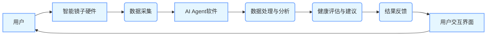

# AI Agent在智能镜子中的每日健康检查系统

> 关键词：AI Agent、智能镜子、每日健康检查、健康监测、人工智能

> 摘要：本文深入探讨了AI Agent在智能镜子的每日健康检查系统中的应用。首先介绍了该系统提出的背景、目的和适用读者群体等内容。接着详细阐述了核心概念，包括AI Agent和智能镜子健康检查系统的原理及联系，并通过文本示意图和Mermaid流程图进行展示。随后讲解了核心算法原理及具体操作步骤，使用Python代码进行详细说明，同时给出了相关数学模型和公式。通过项目实战部分，展示了系统开发环境搭建、源代码实现及代码解读。还介绍了该系统的实际应用场景、相关工具和资源，最后对系统的未来发展趋势与挑战进行了总结，并给出常见问题解答和扩展阅读参考资料，旨在为相关领域的研究和开发提供全面的技术指导。

## 1. 背景介绍 
### 1.1 目的和范围
随着人们对健康管理的重视程度不断提高，日常健康监测成为了热门需求。传统的健康检查往往需要前往医疗机构，不仅耗时费力，还不能实现实时、便捷的监测。智能镜子作为智能家居设备的一种，具有与人们日常生活紧密结合的特点，能够在人们日常洗漱等活动时进行健康检查。本系统的目的就是将AI Agent引入智能镜子，构建一个每日健康检查系统，实现对用户健康状况的实时、便捷监测，包括但不限于面部气色分析、心率监测、体脂率估算等。系统的范围主要涵盖了从数据采集、处理到结果反馈的整个流程，涉及到硬件设备（智能镜子）、软件算法（AI Agent）以及用户交互界面等方面。

### 1.2 预期读者
本文预期读者包括但不限于以下几类人群：
- 人工智能领域的研究人员和开发者，他们可以从本文中获取AI Agent在健康监测领域的应用思路和技术实现细节。
- 智能家居行业的从业者，了解如何将AI技术与智能镜子相结合，开发出更具创新性的产品。
- 医疗健康领域的相关人员，探索利用智能家居设备进行日常健康监测的新途径。
- 对科技和健康管理感兴趣的普通大众，了解智能镜子每日健康检查系统的原理和优势。

### 1.3 文档结构概述
本文将按照以下结构进行详细阐述：
- 核心概念与联系：介绍AI Agent和智能镜子每日健康检查系统的核心概念，以及它们之间的联系，并通过文本示意图和Mermaid流程图进行展示。
- 核心算法原理 & 具体操作步骤：讲解系统所涉及的核心算法原理，并用Python代码详细阐述具体操作步骤。
- 数学模型和公式 & 详细讲解 & 举例说明：给出系统中的数学模型和公式，并进行详细讲解和举例说明。
- 项目实战：代码实际案例和详细解释说明，包括开发环境搭建、源代码详细实现和代码解读。
- 实际应用场景：介绍该系统在实际生活中的应用场景。
- 工具和资源推荐：推荐相关的学习资源、开发工具框架和论文著作。
- 总结：未来发展趋势与挑战：对系统的未来发展趋势进行展望，并分析可能面临的挑战。
- 附录：常见问题与解答：解答读者可能遇到的常见问题。
- 扩展阅读 & 参考资料：提供相关的扩展阅读内容和参考资料。

### 1.4 术语表
#### 1.4.1 核心术语定义
- **AI Agent**：人工智能代理，是一种能够感知环境、根据自身的目标和规则进行决策并采取行动的智能实体。在本系统中，AI Agent负责处理智能镜子采集到的健康数据，进行分析和判断，并给出相应的健康建议。
- **智能镜子**：一种集成了多种传感器和显示设备的镜子，能够采集用户的生理数据，并将处理结果显示在镜子表面。
- **每日健康检查**：指系统每天对用户的健康状况进行全面检查，包括但不限于身体各项指标的监测和分析。

#### 1.4.2 相关概念解释
- **健康监测**：通过各种技术手段对人体的生理指标进行实时或定期的监测，以便及时发现健康问题。
- **机器学习**：是一门多领域交叉学科，涉及概率论、统计学、逼近论、凸分析、算法复杂度理论等多门学科。它专门研究计算机怎样模拟或实现人类的学习行为，以获取新的知识或技能，重新组织已有的知识结构使之不断改善自身的性能。在本系统中，机器学习算法用于对采集到的健康数据进行分析和预测。

#### 1.4.3 缩略词列表
- **AI**：Artificial Intelligence，人工智能
- **ML**：Machine Learning，机器学习

## 2. 核心概念与联系 

### 核心概念原理
#### AI Agent原理
AI Agent可以看作是一个具有感知、决策和行动能力的智能体。它通过传感器感知环境信息，将这些信息输入到内部的决策模块。决策模块根据预设的规则、模型或学习到的知识进行分析和判断，然后生成相应的行动指令。在智能镜子的每日健康检查系统中，AI Agent的传感器就是智能镜子上集成的各种生理数据采集设备，如摄像头、心率传感器等。它感知到用户的面部图像、心率等数据后，运用机器学习算法对这些数据进行处理和分析，判断用户的健康状况，并生成相应的健康建议。

#### 智能镜子健康检查系统原理
智能镜子健康检查系统主要由硬件和软件两部分组成。硬件部分包括镜子本体、传感器（如摄像头、心率传感器、体脂传感器等）和显示设备。传感器负责采集用户的生理数据，如面部气色、心率、体脂率等。软件部分主要是AI Agent和用户交互界面。AI Agent对采集到的数据进行处理和分析，用户交互界面则将分析结果和健康建议展示给用户。

### 架构的文本示意图
```plaintext
智能镜子每日健康检查系统架构

用户 <----> 智能镜子（硬件）
           |
           | 数据采集（面部图像、心率、体脂率等）
           v
       AI Agent（软件）
           |
           | 数据处理与分析（机器学习算法）
           v
       健康评估与建议
           |
           | 结果反馈
           v
用户交互界面（镜子显示、语音提示等）
```

### Mermaid流程图


## 3. 核心算法原理 & 具体操作步骤 

### 核心算法原理
本系统主要涉及到以下几种核心算法：
- **面部气色分析算法**：使用卷积神经网络（Convolutional Neural Network, CNN）对用户的面部图像进行分析。CNN是一种专门用于处理具有网格结构数据（如图像）的深度学习模型，它通过卷积层、池化层和全连接层等组件，自动提取图像的特征。在面部气色分析中，CNN可以学习到不同健康状态下面部颜色、纹理等特征的差异，从而判断用户的健康状况，如是否存在贫血、肝脏问题等。
- **心率监测算法**：采用光电容积脉搏波描记法（Photoplethysmography, PPG）结合信号处理算法来监测心率。PPG是一种基于血液对光的吸收特性来测量心率的方法。通过在智能镜子上集成PPG传感器，发射特定波长的光到皮肤表面，然后检测反射光的强度变化。由于心脏跳动会引起血液容积的周期性变化，从而导致反射光强度的周期性变化，通过对这种变化信号进行处理和分析，就可以计算出心率。

### 具体操作步骤及Python代码实现

#### 面部气色分析步骤及代码
```python
import tensorflow as tf
from tensorflow.keras.preprocessing import image
from tensorflow.keras.applications.resnet50 import ResNet50, preprocess_input, decode_predictions
import numpy as np

# 加载预训练的ResNet50模型
model = ResNet50(weights='imagenet')

def analyze_facial_color(image_path):
    # 加载图像并调整大小
    img = image.load_img(image_path, target_size=(224, 224))
    # 将图像转换为数组
    x = image.img_to_array(img)
    # 添加一个维度，使其成为批量数据
    x = np.expand_dims(x, axis=0)
    # 对图像进行预处理
    x = preprocess_input(x)

    # 进行预测
    preds = model.predict(x)
    # 解码预测结果
    decoded_preds = decode_predictions(preds, top=3)[0]

    return decoded_preds

# 示例使用
image_path = 'face_image.jpg'
result = analyze_facial_color(image_path)
print("面部气色分析结果：", result)
```
代码解释：
1. 首先，我们使用`tensorflow.keras`库加载预训练的ResNet50模型，该模型在ImageNet数据集上进行了训练，具有很强的图像特征提取能力。
2. 定义`analyze_facial_color`函数，该函数接受一个图像文件路径作为输入。
3. 在函数内部，使用`image.load_img`加载图像并调整大小为224x224，这是ResNet50模型要求的输入尺寸。
4. 将图像转换为数组，并添加一个维度使其成为批量数据。
5. 对图像进行预处理，使其符合ResNet50模型的输入要求。
6. 使用`model.predict`进行预测，并使用`decode_predictions`解码预测结果。
7. 最后返回解码后的预测结果。

#### 心率监测步骤及代码
```python
import numpy as np
import matplotlib.pyplot as plt

# 模拟PPG信号
def generate_ppg_signal(duration=10, sampling_rate=100):
    t = np.linspace(0, duration, duration * sampling_rate)
    # 模拟心率为60次/分钟的PPG信号
    signal = np.sin(2 * np.pi * (60 / 60) * t) + np.random.normal(0, 0.1, len(t))
    return t, signal

# 心率计算函数
def calculate_heart_rate(signal, sampling_rate):
    # 进行快速傅里叶变换
    fft_signal = np.fft.fft(signal)
    frequencies = np.fft.fftfreq(len(signal), 1 / sampling_rate)
    # 取正频率部分
    positive_frequencies = frequencies[:len(frequencies) // 2]
    positive_fft_signal = np.abs(fft_signal[:len(fft_signal) // 2])
    # 找到最大频率对应的索引
    max_index = np.argmax(positive_fft_signal)
    # 计算心率
    heart_rate = positive_frequencies[max_index] * 60

    return heart_rate

# 示例使用
t, ppg_signal = generate_ppg_signal()
heart_rate = calculate_heart_rate(ppg_signal, sampling_rate=100)
print("心率：", heart_rate, "次/分钟")

# 绘制PPG信号图
plt.plot(t, ppg_signal)
plt.xlabel('时间 (秒)')
plt.ylabel('PPG信号强度')
plt.title('模拟PPG信号')
plt.show()
```
代码解释：
1. 定义`generate_ppg_signal`函数，用于模拟PPG信号。该函数接受信号持续时间和采样率作为参数，返回时间序列和模拟的PPG信号。
2. 定义`calculate_heart_rate`函数，用于计算心率。该函数接受PPG信号和采样率作为参数。
3. 在`calculate_heart_rate`函数内部，首先对PPG信号进行快速傅里叶变换（FFT），将信号从时域转换到频域。
4. 取正频率部分的频率和FFT信号幅值。
5. 找到最大频率对应的索引，根据该频率计算心率。
6. 最后返回计算得到的心率。
7. 示例使用中，调用`generate_ppg_signal`生成模拟PPG信号，调用`calculate_heart_rate`计算心率，并打印结果。同时，使用`matplotlib`库绘制PPG信号图。

## 4. 数学模型和公式 & 详细讲解 & 举例说明 

### 面部气色分析的数学模型
在面部气色分析中，使用的卷积神经网络（CNN）可以看作是一个复杂的非线性函数逼近器。假设输入的面部图像为 $X \in \mathbb{R}^{H \times W \times C}$，其中 $H$ 是图像的高度，$W$ 是图像的宽度，$C$ 是图像的通道数（对于RGB图像，$C = 3$）。CNN通过一系列的卷积层、池化层和全连接层将输入图像 $X$ 映射到输出向量 $Y \in \mathbb{R}^{K}$，其中 $K$ 是分类的类别数。

#### 卷积层
卷积层是CNN的核心组件之一，它通过卷积操作提取图像的局部特征。卷积操作可以表示为：
$$
y_{i,j}^l = \sum_{m=0}^{M-1} \sum_{n=0}^{N-1} \sum_{c=0}^{C^{l-1}-1} x_{i+m,j+n,c}^{l-1} \cdot w_{m,n,c}^l + b^l
$$
其中，$y_{i,j}^l$ 是第 $l$ 层卷积层输出特征图中位置 $(i, j)$ 处的值，$x_{i+m,j+n,c}^{l-1}$ 是第 $l-1$ 层输入特征图中位置 $(i+m, j+n)$ 处第 $c$ 个通道的值，$w_{m,n,c}^l$ 是第 $l$ 层卷积核中位置 $(m, n)$ 处第 $c$ 个通道的权重，$b^l$ 是第 $l$ 层的偏置，$M$ 和 $N$ 是卷积核的大小，$C^{l-1}$ 是第 $l-1$ 层输入特征图的通道数。

#### 池化层
池化层用于降低特征图的维度，减少计算量。常见的池化操作有最大池化和平均池化。以最大池化为例，池化操作可以表示为：
$$
y_{i,j}^l = \max_{m=0}^{M-1} \max_{n=0}^{N-1} x_{iM+m,jN+n}^l
$$
其中，$y_{i,j}^l$ 是第 $l$ 层池化层输出特征图中位置 $(i, j)$ 处的值，$x_{iM+m,jN+n}^l$ 是第 $l$ 层输入特征图中位置 $(iM+m, jN+n)$ 处的值，$M$ 和 $N$ 是池化窗口的大小。

#### 全连接层
全连接层将卷积层和池化层提取的特征进行整合，输出最终的分类结果。全连接层的输出可以表示为：
$$
y_k = \sum_{i=0}^{D-1} x_i \cdot w_{i,k} + b_k
$$
其中，$y_k$ 是输出向量 $Y$ 中第 $k$ 个元素的值，$x_i$ 是输入向量 $X$ 中第 $i$ 个元素的值，$w_{i,k}$ 是连接输入 $x_i$ 和输出 $y_k$ 的权重，$b_k$ 是偏置，$D$ 是输入向量的维度。

### 心率监测的数学模型
在心率监测中，使用的光电容积脉搏波描记法（PPG）信号处理主要基于傅里叶变换。假设采集到的PPG信号为 $s(t)$，其离散时间序列表示为 $s[n]$，其中 $n = 0, 1, \cdots, N-1$，$N$ 是信号的长度。

#### 快速傅里叶变换（FFT）
快速傅里叶变换是一种高效的计算离散傅里叶变换（DFT）的算法，其公式为：
$$
S[k] = \sum_{n=0}^{N-1} s[n] \cdot e^{-j \frac{2\pi}{N} kn}
$$
其中，$S[k]$ 是FFT变换后的频域信号，$k = 0, 1, \cdots, N-1$。

#### 心率计算
心率可以通过找到FFT变换后频域信号的最大幅值对应的频率来计算。假设最大幅值对应的频率为 $f_{max}$，则心率 $HR$ 可以表示为：
$$
HR = f_{max} \times 60
$$

### 举例说明
#### 面部气色分析举例
假设输入的面部图像大小为 $224 \times 224 \times 3$，第一个卷积层的卷积核大小为 $3 \times 3$，通道数为 64。则对于卷积层的每个输出特征图中的一个像素值 $y_{i,j}^l$，需要对输入特征图中 $3 \times 3$ 大小的局部区域进行卷积操作，涉及到 $3 \times 3 \times 3 = 27$ 个输入像素值和 64 个卷积核权重。经过多个卷积层、池化层和全连接层的处理后，最终输出一个长度为 1000 的向量，每个元素表示图像属于某个类别的概率。

#### 心率监测举例
假设采集到的PPG信号持续时间为 10 秒，采样率为 100 Hz，则信号长度 $N = 10 \times 100 = 1000$。对该信号进行FFT变换后，得到一个长度为 1000 的频域信号 $S[k]$。通过找到 $S[k]$ 中最大幅值对应的频率 $f_{max}$，假设 $f_{max} = 1$ Hz，则心率 $HR = 1 \times 60 = 60$ 次/分钟。

## 5. 项目实战：代码实际案例和详细解释说明 

### 5.1  开发环境搭建
#### 硬件环境
- **智能镜子**：选择具有高清显示屏和足够计算能力的智能镜子，可以考虑使用树莓派等单板计算机作为核心计算单元，并集成摄像头、心率传感器等设备。
- **传感器**：选择合适的摄像头用于采集面部图像，选择PPG心率传感器用于监测心率。确保传感器的精度和稳定性。

#### 软件环境
- **操作系统**：可以选择Linux系统，如Raspbian（适用于树莓派）或Ubuntu。
- **开发语言**：使用Python作为主要开发语言，因为Python具有丰富的科学计算和机器学习库。
- **深度学习框架**：使用TensorFlow或PyTorch作为深度学习框架，用于实现面部气色分析的卷积神经网络。
- **信号处理库**：使用NumPy和SciPy进行PPG信号处理和分析。

#### 安装依赖库
```bash
# 安装TensorFlow
pip install tensorflow

# 安装NumPy和SciPy
pip install numpy scipy

# 安装OpenCV（用于图像处理）
pip install opencv-python
```

### 5.2  源代码详细实现和代码解读
以下是一个完整的智能镜子每日健康检查系统的代码示例：

```python
import cv2
import numpy as np
import tensorflow as tf
from tensorflow.keras.applications.resnet50 import ResNet50, preprocess_input, decode_predictions

# 加载预训练的ResNet50模型
model = ResNet50(weights='imagenet')

# 面部气色分析函数
def analyze_facial_color(image):
    # 调整图像大小
    img = cv2.resize(image, (224, 224))
    # 将图像转换为数组
    x = np.expand_dims(img, axis=0)
    # 对图像进行预处理
    x = preprocess_input(x)

    # 进行预测
    preds = model.predict(x)
    # 解码预测结果
    decoded_preds = decode_predictions(preds, top=3)[0]

    return decoded_preds

# 模拟心率监测函数
def monitor_heart_rate():
    # 这里简单模拟心率为60次/分钟
    heart_rate = 60
    return heart_rate

# 主函数
def main():
    # 打开摄像头
    cap = cv2.VideoCapture(0)

    while True:
        # 读取一帧图像
        ret, frame = cap.read()
        if not ret:
            break

        # 进行面部气色分析
        facial_result = analyze_facial_color(frame)
        # 进行心率监测
        heart_rate = monitor_heart_rate()

        # 显示分析结果
        cv2.putText(frame, f"Facial Result: {facial_result}", (10, 30), cv2.FONT_HERSHEY_SIMPLEX, 0.7, (0, 255, 0), 2)
        cv2.putText(frame, f"Heart Rate: {heart_rate} bpm", (10, 60), cv2.FONT_HERSHEY_SIMPLEX, 0.7, (0, 255, 0), 2)

        # 显示图像
        cv2.imshow('Smart Mirror Health Check', frame)

        # 按 'q' 键退出
        if cv2.waitKey(1) & 0xFF == ord('q'):
            break

    # 释放摄像头并关闭窗口
    cap.release()
    cv2.destroyAllWindows()

if __name__ == "__main__":
    main()
```
代码解读：
1. **导入必要的库**：导入`cv2`用于图像处理和摄像头操作，`numpy`用于数值计算，`tensorflow`和`ResNet50`用于面部气色分析。
2. **加载预训练的ResNet50模型**：使用`ResNet50(weights='imagenet')`加载在ImageNet数据集上预训练的模型。
3. **定义面部气色分析函数`analyze_facial_color`**：该函数接受一个图像作为输入，调整图像大小为224x224，进行预处理后使用模型进行预测，并解码预测结果。
4. **定义模拟心率监测函数`monitor_heart_rate`**：这里简单模拟心率为60次/分钟，实际应用中需要使用PPG传感器采集真实数据。
5. **定义主函数`main`**：
    - 打开摄像头，使用`cv2.VideoCapture(0)`。
    - 在循环中不断读取摄像头的帧图像。
    - 对每一帧图像进行面部气色分析和心率监测。
    - 使用`cv2.putText`在图像上显示分析结果。
    - 显示图像，使用`cv2.imshow`。
    - 按 'q' 键退出循环。
6. **释放摄像头并关闭窗口**：使用`cap.release()`释放摄像头，使用`cv2.destroyAllWindows()`关闭所有窗口。

### 5.3  代码解读与分析
#### 优点
- **代码结构清晰**：将不同的功能封装成独立的函数，如面部气色分析函数和心率监测函数，提高了代码的可读性和可维护性。
- **使用预训练模型**：利用在ImageNet数据集上预训练的ResNet50模型，减少了模型训练的时间和工作量，同时提高了面部气色分析的准确性。
- **实时监测**：通过循环不断读取摄像头的帧图像，实现了实时的健康检查功能。

#### 缺点和改进方向
- **心率监测模拟**：代码中使用简单的模拟心率，实际应用中需要使用PPG传感器采集真实数据，并进行更复杂的信号处理和分析。
- **缺乏用户交互**：代码只是简单地在图像上显示分析结果，缺乏更丰富的用户交互功能，如语音提示、健康报告生成等。
- **模型局限性**：ResNet50模型是在ImageNet数据集上训练的，对于面部气色分析可能不是最优的，需要使用专门的面部气色数据集进行微调。

## 6. 实际应用场景 
### 家庭健康监测
在家庭环境中，智能镜子的每日健康检查系统可以为家庭成员提供便捷的健康监测服务。用户每天早上洗漱时，智能镜子可以自动采集面部图像和心率等数据，进行健康分析，并给出相应的健康建议。例如，如果检测到用户面部气色不佳，可能提示用户注意休息、补充营养；如果心率异常，可能提示用户及时就医。

### 健身场所
在健身场所，智能镜子可以作为一种辅助设备，帮助健身者实时监测自己的健康状况。健身者在锻炼前后可以使用智能镜子进行健康检查，了解自己的身体状态，合理调整锻炼计划。例如，如果心率过高，可能提示健身者适当降低运动强度；如果面部气色显示疲劳，可能提示健身者增加休息时间。

### 医疗机构
在医疗机构，智能镜子可以作为一种初步的健康检查设备，为医生提供更多的患者信息。患者在就诊前可以使用智能镜子进行健康检查，医生可以根据检查结果更快速地了解患者的健康状况，提高诊断效率。例如，医生可以根据面部气色分析结果初步判断患者是否存在贫血、肝脏问题等。

## 7. 工具和资源推荐
### 7.1 学习资源推荐
#### 7.1.1 书籍推荐
- 《深度学习》（Deep Learning）：由Ian Goodfellow、Yoshua Bengio和Aaron Courville所著，是深度学习领域的经典教材，涵盖了深度学习的基本原理、算法和应用。
- 《Python机器学习实战》（Python Machine Learning）：由Sebastian Raschka所著，介绍了如何使用Python进行机器学习项目的开发，包括数据预处理、模型选择和评估等内容。
- 《计算机视觉：算法与应用》（Computer Vision: Algorithms and Applications）：由Richard Szeliski所著，是计算机视觉领域的权威教材，详细介绍了计算机视觉的各种算法和应用，包括图像特征提取、目标检测等。

#### 7.1.2 在线课程
- Coursera上的“深度学习专项课程”（Deep Learning Specialization）：由Andrew Ng教授讲授，包括深度学习基础、卷积神经网络、循环神经网络等多个课程，是学习深度学习的优质课程。
- edX上的“计算机视觉基础”（Foundations of Computer Vision）：由UC Berkeley的教授讲授，介绍了计算机视觉的基本概念、算法和应用。
- Kaggle上的“机器学习微课程”（Machine Learning Micro-Courses）：提供了一系列简短的机器学习课程，适合初学者快速入门。

#### 7.1.3 技术博客和网站
- Medium：上面有很多人工智能和机器学习领域的优秀博客文章，涵盖了最新的研究成果和技术应用。
- Towards Data Science：专注于数据科学和机器学习领域的博客网站，提供了很多实用的教程和案例分析。
- AI Trends：关注人工智能领域的最新动态和趋势，提供了很多行业分析和专家观点。

### 7.2 开发工具框架推荐
#### 7.2.1 IDE和编辑器
- PyCharm：是一款专门为Python开发设计的集成开发环境（IDE），具有强大的代码编辑、调试和项目管理功能。
- Jupyter Notebook：是一个交互式的开发环境，适合进行数据分析和模型实验。可以在浏览器中编写和运行Python代码，并实时查看代码执行结果。
- Visual Studio Code：是一款轻量级的代码编辑器，支持多种编程语言，具有丰富的插件扩展功能，可以用于Python开发和机器学习项目。

#### 7.2.2 调试和性能分析工具
- TensorBoard：是TensorFlow提供的可视化工具，可以用于查看模型的训练过程、损失函数曲线、模型结构等信息，帮助开发者进行模型调试和优化。
- Py-Spy：是一个Python性能分析工具，可以实时监测Python程序的CPU使用率、函数调用时间等信息，帮助开发者找出性能瓶颈。
- cProfile：是Python标准库中的性能分析模块，可以用于分析Python程序的函数调用时间和调用次数，帮助开发者优化代码性能。

#### 7.2.3 相关框架和库
- TensorFlow：是一个开源的深度学习框架，由Google开发，具有强大的计算能力和丰富的工具集，支持多种深度学习模型的开发和训练。
- PyTorch：是另一个流行的深度学习框架，由Facebook开发，具有动态图的特点，适合快速开发和实验。
- OpenCV：是一个开源的计算机视觉库，提供了丰富的图像处理和计算机视觉算法，如图像滤波、特征提取、目标检测等。

### 7.3 相关论文著作推荐
#### 7.3.1 经典论文
- “ImageNet Classification with Deep Convolutional Neural Networks”：由Alex Krizhevsky、Ilya Sutskever和Geoffrey E. Hinton发表于NIPS 2012，介绍了AlexNet卷积神经网络，开启了深度学习在计算机视觉领域的革命。
- “Long Short-Term Memory”：由Sepp Hochreiter和Jürgen Schmidhuber发表于Neural Computation 1997，提出了长短期记忆网络（LSTM），解决了循环神经网络中的梯度消失问题。
- “Generative Adversarial Networks”：由Ian J. Goodfellow等人发表于NIPS 2014，提出了生成对抗网络（GAN），是一种强大的生成模型。

#### 7.3.2 最新研究成果
- 关注顶级学术会议如CVPR（Computer Vision and Pattern Recognition）、ICML（International Conference on Machine Learning）、NeurIPS（Neural Information Processing Systems）等的最新论文，了解人工智能和机器学习领域的最新研究进展。
- 可以通过arXiv.org等预印本平台获取最新的研究论文，这些论文往往反映了该领域的前沿技术和研究热点。

#### 7.3.3 应用案例分析
- 《AI Superpowers: China, Silicon Valley, and the New World Order》：由李开复所著，介绍了人工智能在各个领域的应用案例，包括医疗、金融、交通等，分析了人工智能对未来社会的影响。
- 一些知名科技公司的官方博客和技术报告，如Google AI Blog、Microsoft Research等，会分享他们在人工智能领域的应用案例和技术经验。

## 8. 总结：未来发展趋势与挑战
### 未来发展趋势
- **多模态数据融合**：未来的智能镜子每日健康检查系统将不仅仅依赖于面部图像和心率等单一数据，而是会融合更多的生理数据，如体温、血压、血氧饱和度等，实现更全面、准确的健康监测。
- **个性化健康管理**：系统将根据用户的个人健康数据、生活习惯和遗传信息等，为用户提供个性化的健康建议和管理方案。例如，根据用户的运动习惯和目标，制定个性化的健身计划；根据用户的饮食偏好和营养需求，提供个性化的饮食建议。
- **与医疗系统的集成**：智能镜子健康检查系统将与医疗机构的信息系统进行集成，实现数据的共享和交互。医生可以通过医疗机构的信息系统查看用户的健康检查数据，及时为用户提供诊断和治疗建议。
- **增强现实（AR）和虚拟现实（VR）技术的应用**：利用AR和VR技术，为用户提供更加直观、沉浸式的健康检查体验。例如，通过AR技术在镜子上显示用户的身体内部结构和健康指标，帮助用户更好地理解自己的健康状况。

### 挑战
- **数据隐私和安全**：智能镜子健康检查系统会采集用户大量的个人健康数据，这些数据的隐私和安全问题至关重要。如何确保数据不被泄露、篡改和滥用，是系统开发和应用过程中需要解决的重要问题。
- **算法准确性和可靠性**：目前的健康监测算法还存在一定的局限性，如面部气色分析的准确性还不够高，心率监测在复杂环境下可能存在误差。如何提高算法的准确性和可靠性，是系统进一步发展的关键。
- **用户接受度**：智能镜子健康检查系统作为一种新兴的健康监测设备，用户对其接受度还需要进一步提高。如何让用户信任系统的检查结果，并愿意长期使用该系统，是推广应用过程中需要面对的挑战。
- **标准和规范**：目前智能镜子健康检查系统还缺乏统一的标准和规范，不同厂家的产品在功能、性能和数据格式等方面存在差异。如何制定统一的标准和规范，促进系统的标准化和规范化发展，是行业面临的重要问题。

## 9. 附录：常见问题与解答
### 问题1：智能镜子的健康检查结果准确吗？
解答：智能镜子的健康检查结果的准确性受到多种因素的影响，如传感器的精度、算法的准确性等。目前的技术还存在一定的局限性，不能完全替代专业的医疗检查。但是，随着技术的不断发展和完善，系统的准确性会逐渐提高。智能镜子的健康检查结果可以作为一种初步的参考，帮助用户及时发现潜在的健康问题。

### 问题2：智能镜子采集的健康数据安全吗？
解答：系统开发方会采取多种措施来保障数据的安全，如数据加密、访问控制等。但是，数据安全仍然是一个需要重视的问题。用户在使用智能镜子时，应该选择正规厂家生产的产品，并注意保护自己的个人信息。同时，用户可以了解系统的数据安全政策和措施，确保自己的数据得到妥善的保护。

### 问题3：智能镜子可以监测哪些健康指标？
解答：目前智能镜子可以监测的健康指标主要包括面部气色、心率等。未来随着技术的发展，还可以监测更多的健康指标，如体温、血压、血氧饱和度等。

### 问题4：智能镜子的价格贵吗？
解答：智能镜子的价格因品牌、功能和配置等因素而异。目前市场上的智能镜子价格范围较广，从几百元到数千元不等。随着技术的普及和成本的降低，智能镜子的价格有望逐渐下降，变得更加亲民。

## 10. 扩展阅读 & 参考资料
### 扩展阅读
- 《人工智能时代的医疗革命》：介绍了人工智能在医疗领域的应用现状和未来发展趋势，包括智能诊断、个性化医疗等方面的内容。
- 《智能家居：未来生活新图景》：探讨了智能家居的发展历程、技术原理和应用场景，包括智能镜子等智能家居设备的介绍。
- 《健康大数据：开启精准医疗新时代》：讲述了健康大数据的概念、采集和分析方法，以及在医疗健康领域的应用案例。

### 参考资料
- 相关的学术论文和研究报告，如IEEE Transactions on Biomedical Engineering、ACM Transactions on Intelligent Systems and Technology等期刊上的论文。
- 智能镜子和健康监测相关的行业标准和规范，如ISO、IEC等国际标准组织发布的标准。
- 智能镜子和人工智能相关的技术文档和开源项目，如TensorFlow、PyTorch等框架的官方文档。

作者：AI天才研究院/AI Genius Institute & 禅与计算机程序设计艺术 /Zen And The Art of Computer Programming