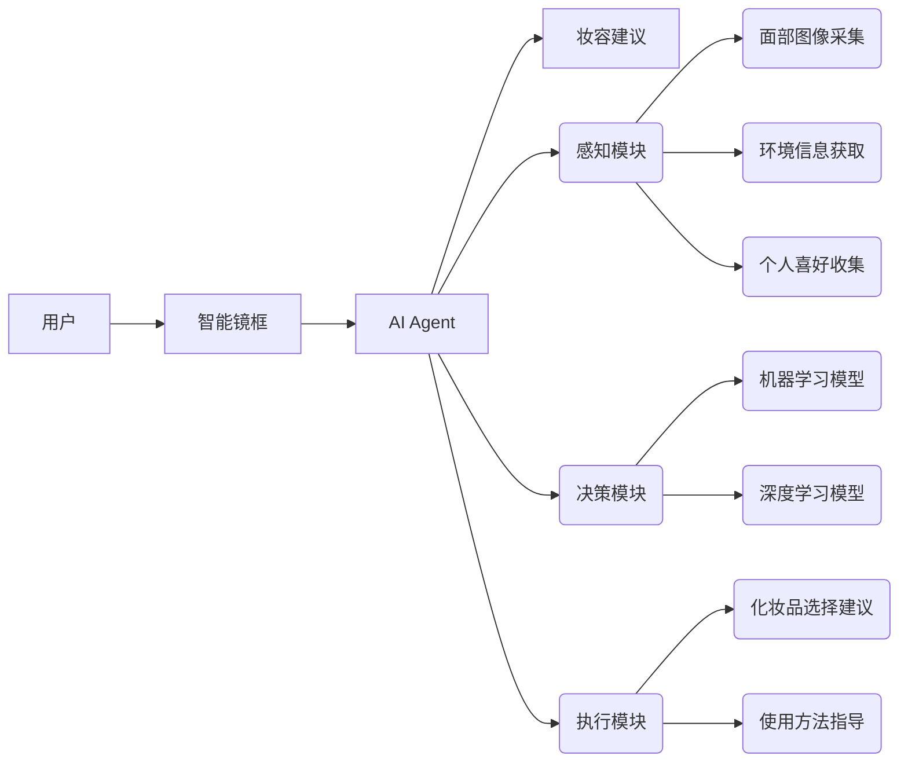

# AI Agent在智能镜框中的妆容建议

> 关键词：AI Agent、智能镜框、妆容建议、计算机视觉、机器学习

> 摘要：本文深入探讨了AI Agent在智能镜框中提供妆容建议的相关技术和应用。首先介绍了该研究的背景、目的、预期读者和文档结构等信息，接着阐述了核心概念与联系，包括AI Agent、智能镜框和妆容建议的原理及架构，并给出了相应的示意图和流程图。详细讲解了核心算法原理，通过Python源代码进行说明，同时介绍了相关的数学模型和公式。通过项目实战，展示了代码的实际案例并进行详细解释。分析了该技术的实际应用场景，推荐了学习资源、开发工具框架和相关论文著作。最后总结了未来发展趋势与挑战，并给出常见问题与解答以及扩展阅读和参考资料。

## 1. 背景介绍 
### 1.1 目的和范围
随着科技的不断发展，智能设备在人们的生活中扮演着越来越重要的角色。智能镜框作为一种新兴的智能设备，具有广阔的应用前景。AI Agent（人工智能代理）技术的出现，为智能镜框赋予了更强大的功能。本研究的目的是探讨如何利用AI Agent在智能镜框中为用户提供个性化的妆容建议。范围涵盖了从AI Agent的核心算法原理到实际应用场景的各个方面，包括计算机视觉技术、机器学习算法、智能镜框的硬件设计等。

### 1.2 预期读者
本文预期读者包括对人工智能、智能硬件、计算机视觉和美妆行业感兴趣的技术人员、研究人员、开发者以及相关行业的从业者。同时，也适合对智能设备和个性化服务有需求的普通消费者了解相关技术原理和应用。

### 1.3 文档结构概述
本文共分为十个部分。第一部分为背景介绍，阐述了研究的目的、范围、预期读者和文档结构。第二部分介绍核心概念与联系，包括AI Agent、智能镜框和妆容建议的原理及架构，并给出示意图和流程图。第三部分详细讲解核心算法原理，使用Python源代码进行说明。第四部分介绍相关的数学模型和公式，并举例说明。第五部分通过项目实战，展示代码的实际案例并进行详细解释。第六部分分析该技术的实际应用场景。第七部分推荐学习资源、开发工具框架和相关论文著作。第八部分总结未来发展趋势与挑战。第九部分为附录，给出常见问题与解答。第十部分提供扩展阅读和参考资料。

### 1.4 术语表
#### 1.4.1 核心术语定义
- **AI Agent（人工智能代理）**：是一种能够感知环境、自主决策并采取行动以实现特定目标的人工智能实体。在本文中，AI Agent用于分析用户的面部特征和环境信息，为用户提供妆容建议。
- **智能镜框**：是一种集成了计算机视觉、传感器和通信技术的智能眼镜，能够实时采集用户的面部图像和环境数据，并与AI Agent进行交互。
- **妆容建议**：根据用户的面部特征、肤色、发型、个人喜好和当前环境等因素，为用户提供适合的妆容方案，包括眼影、口红、粉底等化妆品的选择和使用方法。

#### 1.4.2 相关概念解释
- **计算机视觉**：是一门研究如何使计算机“看”的科学，即通过图像和视频数据来理解和解释场景。在智能镜框中，计算机视觉技术用于采集和分析用户的面部图像，提取面部特征和表情信息。
- **机器学习**：是一门多领域交叉学科，涉及概率论、统计学、逼近论、凸分析、算法复杂度理论等多门学科。它专门研究计算机怎样模拟或实现人类的学习行为，以获取新的知识或技能，重新组织已有的知识结构使之不断改善自身的性能。在妆容建议中，机器学习算法用于训练模型，根据用户的面部特征和历史数据预测适合的妆容方案。
- **深度学习**：是机器学习的一个分支领域，它是一种基于对数据进行表征学习的方法。深度学习通过构建具有多个层次的神经网络，自动从大量数据中学习特征和模式。在计算机视觉和妆容建议中，深度学习模型如卷积神经网络（CNN）被广泛应用于面部特征提取和妆容分类。

#### 1.4.3 缩略词列表
- **CNN（Convolutional Neural Network）**：卷积神经网络
- **RGB（Red, Green, Blue）**：红绿蓝，是一种颜色表示方法
- **API（Application Programming Interface）**：应用程序编程接口

## 2. 核心概念与联系 

### 核心概念原理
#### AI Agent
AI Agent是整个系统的核心，它通过感知模块获取用户的面部图像、环境信息和个人喜好等数据，然后利用决策模块对这些数据进行分析和处理，最后通过执行模块为用户提供妆容建议。AI Agent的决策过程基于机器学习和深度学习算法，通过训练大量的数据集来学习不同面部特征和妆容之间的关系。

#### 智能镜框
智能镜框是AI Agent的硬件载体，它集成了摄像头、传感器和通信模块。摄像头用于采集用户的面部图像，传感器用于获取环境信息，如光线强度、温度等。通信模块用于与AI Agent进行数据传输和交互，将采集到的数据发送给AI Agent，并接收AI Agent提供的妆容建议。

#### 妆容建议
妆容建议是根据用户的面部特征、肤色、发型、个人喜好和当前环境等因素，为用户提供适合的妆容方案。妆容建议包括化妆品的选择和使用方法，如眼影的颜色和涂抹方式、口红的颜色和质地、粉底的色号和遮瑕度等。

### 架构的文本示意图
```plaintext
+-------------------+
|      用户        |
| （面部特征、喜好） |
+-------------------+
        |
        v
+-------------------+
|    智能镜框      |
| （摄像头、传感器） |
+-------------------+
        |
        v
+-------------------+
|      AI Agent     |
| （感知、决策、执行） |
+-------------------+
        |
        v
+-------------------+
|    妆容建议       |
| （化妆品选择、方法） |
+-------------------+
```

### Mermaid流程图


## 3. 核心算法原理 & 具体操作步骤 

### 核心算法原理
#### 面部特征提取
使用卷积神经网络（CNN）来提取用户面部的特征。CNN是一种专门用于处理具有网格结构数据（如图像）的深度学习模型，它通过卷积层、池化层和全连接层来自动学习图像的特征。以下是一个简单的Python代码示例，使用`torchvision`库中的预训练ResNet模型来提取面部特征：

```python
import torch
import torchvision.models as models
from torchvision import transforms
from PIL import Image

# 加载预训练的ResNet模型
model = models.resnet18(pretrained=True)
# 去掉最后一层全连接层
feature_extractor = torch.nn.Sequential(*list(model.children())[:-1])
# 设置模型为评估模式
feature_extractor.eval()

# 定义图像预处理函数
preprocess = transforms.Compose([
    transforms.Resize(256),
    transforms.CenterCrop(224),
    transforms.ToTensor(),
    transforms.Normalize(mean=[0.485, 0.456, 0.406], std=[0.229, 0.224, 0.225])
])

def extract_facial_features(image_path):
    # 打开图像
    image = Image.open(image_path)
    # 预处理图像
    input_tensor = preprocess(image)
    input_batch = input_tensor.unsqueeze(0)

    # 如果有GPU，将数据移动到GPU上
    if torch.cuda.is_available():
        input_batch = input_batch.to('cuda')
        feature_extractor.to('cuda')

    # 提取特征
    with torch.no_grad():
        features = feature_extractor(input_batch)
    # 将特征展平
    features = features.squeeze().cpu().numpy()
    return features

# 示例使用
image_path = 'path/to/your/image.jpg'
features = extract_facial_features(image_path)
print(features.shape)
```

#### 妆容分类
使用支持向量机（SVM）或神经网络来对妆容进行分类。首先，收集大量的面部图像和对应的妆容标签，然后使用这些数据来训练分类模型。以下是一个使用`scikit-learn`库中的SVM进行妆容分类的简单示例：

```python
from sklearn import svm
from sklearn.model_selection import train_test_split
import numpy as np

# 假设我们有一些面部特征数据和对应的妆容标签
X = np.random.rand(100, 512)  # 100个样本，每个样本有512个特征
y = np.random.randint(0, 5, 100)  # 5种不同的妆容标签

# 划分训练集和测试集
X_train, X_test, y_train, y_test = train_test_split(X, y, test_size=0.2, random_state=42)

# 创建SVM分类器
clf = svm.SVC()
# 训练模型
clf.fit(X_train, y_train)

# 预测测试集
y_pred = clf.predict(X_test)

# 计算准确率
accuracy = np.mean(y_pred == y_test)
print(f"Accuracy: {accuracy}")
```

### 具体操作步骤
1. **数据收集**：收集大量的面部图像和对应的妆容标签，同时记录用户的个人喜好和环境信息。
2. **数据预处理**：对收集到的图像进行预处理，包括图像裁剪、缩放、归一化等操作，以提高模型的训练效果。
3. **模型训练**：使用预处理后的数据来训练面部特征提取模型和妆容分类模型。
4. **部署到智能镜框**：将训练好的模型部署到智能镜框中，使其能够实时采集用户的面部图像并进行分析。
5. **提供妆容建议**：根据分析结果，为用户提供适合的妆容方案，并通过智能镜框的显示屏或语音提示告知用户。

## 4. 数学模型和公式 & 详细讲解 & 举例说明 

### 卷积神经网络（CNN）
#### 卷积层
卷积层是CNN的核心层，它通过卷积操作来提取图像的特征。卷积操作可以用以下公式表示：

$$y_{i,j}^k = \sum_{m=0}^{M-1} \sum_{n=0}^{N-1} x_{i+m,j+n}^l \cdot w_{m,n}^{k,l} + b^k$$

其中，$x_{i,j}^l$ 是第 $l$ 层的输入特征图在位置 $(i,j)$ 处的值，$w_{m,n}^{k,l}$ 是第 $k$ 个卷积核在位置 $(m,n)$ 处的权重，$b^k$ 是第 $k$ 个卷积核的偏置，$y_{i,j}^k$ 是第 $k$ 个输出特征图在位置 $(i,j)$ 处的值，$M$ 和 $N$ 是卷积核的大小。

例如，假设我们有一个输入特征图 $x$ 大小为 $5\times5$，卷积核 $w$ 大小为 $3\times3$，那么卷积操作的过程如下：

```plaintext
输入特征图 x:
[
    [1, 2, 3, 4, 5],
    [6, 7, 8, 9, 10],
    [11, 12, 13, 14, 15],
    [16, 17, 18, 19, 20],
    [21, 22, 23, 24, 25]
]

卷积核 w:
[
    [1, 0, -1],
    [2, 0, -2],
    [1, 0, -1]
]

输出特征图 y:
[
    [1*1 + 2*0 + 3*(-1) + 6*2 + 7*0 + 8*(-2) + 11*1 + 12*0 + 13*(-1),...],
   ...
]
```

#### 池化层
池化层用于减少特征图的尺寸，同时保留重要的特征信息。常见的池化操作有最大池化和平均池化。最大池化的公式表示为：

$$y_{i,j}^k = \max_{m=0}^{M-1} \max_{n=0}^{N-1} x_{iM+m,jN+n}^k$$

其中，$x_{i,j}^k$ 是第 $k$ 个输入特征图在位置 $(i,j)$ 处的值，$y_{i,j}^k$ 是第 $k$ 个输出特征图在位置 $(i,j)$ 处的值，$M$ 和 $N$ 是池化窗口的大小。

例如，假设我们有一个输入特征图 $x$ 大小为 $4\times4$，池化窗口大小为 $2\times2$，那么最大池化的过程如下：

```plaintext
输入特征图 x:
[
    [1, 2, 3, 4],
    [5, 6, 7, 8],
    [9, 10, 11, 12],
    [13, 14, 15, 16]
]

输出特征图 y:
[
    [max(1, 2, 5, 6), max(3, 4, 7, 8)],
    [max(9, 10, 13, 14), max(11, 12, 15, 16)]
]
```

### 支持向量机（SVM）
SVM的目标是找到一个最优的超平面，使得不同类别的样本能够被最大程度地分开。对于线性可分的数据集，SVM的优化问题可以表示为：

$$\min_{\mathbf{w},b} \frac{1}{2} \|\mathbf{w}\|^2$$

$$\text{s.t. } y_i(\mathbf{w}^T \mathbf{x}_i + b) \geq 1, i = 1,2,\cdots,n$$

其中，$\mathbf{w}$ 是超平面的法向量，$b$ 是偏置，$\mathbf{x}_i$ 是第 $i$ 个样本，$y_i$ 是第 $i$ 个样本的标签（$y_i \in \{-1, 1\}$），$n$ 是样本的数量。

为了解决线性不可分的问题，SVM引入了核函数，将输入空间映射到高维特征空间，使得数据在高维空间中线性可分。常见的核函数有线性核、多项式核和高斯核等。

例如，对于高斯核函数，其定义为：

$$K(\mathbf{x}_i, \mathbf{x}_j) = \exp\left(-\frac{\|\mathbf{x}_i - \mathbf{x}_j\|^2}{2\sigma^2}\right)$$

其中，$\sigma$ 是高斯核的带宽参数。

## 5. 项目实战：代码实际案例和详细解释说明 

### 5.1  开发环境搭建
#### 硬件环境
- 智能镜框：选择一款支持摄像头和通信功能的智能镜框，如Google Glass等。
- 开发计算机：具备一定的计算能力和存储空间，建议使用配备NVIDIA GPU的计算机，以加速深度学习模型的训练和推理。

#### 软件环境
- 操作系统：Windows、Linux或macOS。
- Python：建议使用Python 3.7及以上版本。
- 深度学习框架：PyTorch或TensorFlow。
- 其他库：`torchvision`、`scikit-learn`、`opencv-python`等。

以下是安装所需库的命令：

```bash
pip install torch torchvision scikit-learn opencv-python
```

### 5.2  源代码详细实现和代码解读
#### 面部图像采集
使用OpenCV库来采集用户的面部图像。以下是一个简单的示例代码：

```python
import cv2

# 打开摄像头
cap = cv2.VideoCapture(0)

while True:
    # 读取一帧图像
    ret, frame = cap.read()
    if not ret:
        break

    # 显示图像
    cv2.imshow('Face Capture', frame)

    # 按 'q' 键退出
    if cv2.waitKey(1) & 0xFF == ord('q'):
        break

# 释放摄像头并关闭窗口
cap.release()
cv2.destroyAllWindows()
```

代码解读：
- `cv2.VideoCapture(0)`：打开默认的摄像头。
- `cap.read()`：读取一帧图像，返回一个布尔值`ret`表示是否成功读取，以及图像数据`frame`。
- `cv2.imshow()`：显示图像。
- `cv2.waitKey(1)`：等待1毫秒，按`q`键退出。
- `cap.release()`：释放摄像头。
- `cv2.destroyAllWindows()`：关闭所有窗口。

#### 面部特征提取和妆容分类
结合前面介绍的面部特征提取和妆容分类代码，实现一个完整的妆容建议系统。以下是一个示例代码：

```python
import torch
import torchvision.models as models
from torchvision import transforms
from sklearn import svm
import cv2
import numpy as np

# 加载预训练的ResNet模型
model = models.resnet18(pretrained=True)
feature_extractor = torch.nn.Sequential(*list(model.children())[:-1])
feature_extractor.eval()

# 定义图像预处理函数
preprocess = transforms.Compose([
    transforms.ToPILImage(),
    transforms.Resize(256),
    transforms.CenterCrop(224),
    transforms.ToTensor(),
    transforms.Normalize(mean=[0.485, 0.456, 0.406], std=[0.229, 0.224, 0.225])
])

# 假设我们已经训练好的SVM分类器
clf = svm.SVC()
# 这里简单模拟训练数据
X = np.random.rand(100, 512)
y = np.random.randint(0, 5, 100)
clf.fit(X, y)

# 打开摄像头
cap = cv2.VideoCapture(0)

while True:
    # 读取一帧图像
    ret, frame = cap.read()
    if not ret:
        break

    # 预处理图像
    input_tensor = preprocess(frame)
    input_batch = input_tensor.unsqueeze(0)

    # 如果有GPU，将数据移动到GPU上
    if torch.cuda.is_available():
        input_batch = input_batch.to('cuda')
        feature_extractor.to('cuda')

    # 提取特征
    with torch.no_grad():
        features = feature_extractor(input_batch)
    features = features.squeeze().cpu().numpy()

    # 妆容分类
    makeup_type = clf.predict([features])[0]

    # 在图像上显示妆容建议
    cv2.putText(frame, f"Makeup Type: {makeup_type}", (10, 30), cv2.FONT_HERSHEY_SIMPLEX, 1, (0, 255, 0), 2)

    # 显示图像
    cv2.imshow('Makeup Suggestion', frame)

    # 按 'q' 键退出
    if cv2.waitKey(1) & 0xFF == ord('q'):
        break

# 释放摄像头并关闭窗口
cap.release()
cv2.destroyAllWindows()
```

代码解读：
- 加载预训练的ResNet模型用于面部特征提取。
- 定义图像预处理函数，将摄像头采集的图像转换为模型输入所需的格式。
- 模拟训练一个SVM分类器用于妆容分类。
- 打开摄像头，循环读取图像。
- 对图像进行预处理，提取特征。
- 使用SVM分类器对特征进行分类，得到妆容类型。
- 在图像上显示妆容建议。
- 按`q`键退出循环，释放摄像头并关闭窗口。

### 5.3  代码解读与分析
#### 优点
- **模块化设计**：代码将面部图像采集、特征提取和妆容分类等功能模块化，便于扩展和维护。
- **实时性**：使用OpenCV库可以实时采集和处理图像，实现实时的妆容建议。
- **可扩展性**：可以根据需要替换不同的特征提取模型和妆容分类模型，以提高系统的性能。

#### 缺点
- **数据模拟**：示例代码中使用了模拟的训练数据，实际应用中需要收集大量的真实数据进行训练。
- **模型精度**：使用的模型可能不是最优的，需要进一步优化模型结构和参数，以提高妆容分类的精度。

## 6. 实际应用场景 
### 美妆试妆
用户可以通过智能镜框实时看到不同妆容在自己脸上的效果，无需实际涂抹化妆品。这对于购买化妆品时的试妆非常方便，用户可以快速尝试不同的眼影、口红、粉底等组合，选择最适合自己的妆容。

### 美容咨询
美容师可以使用智能镜框为客户提供更专业的妆容建议。通过分析客户的面部特征和肤色，智能镜框可以给出个性化的妆容方案，帮助美容师更好地满足客户的需求。

### 时尚摄影
在时尚摄影中，摄影师可以使用智能镜框为模特提供妆容建议，根据拍摄场景和风格选择合适的妆容，提高拍摄效果。

### 虚拟社交
在虚拟社交平台上，用户可以使用智能镜框为自己的虚拟形象提供妆容建议，使虚拟形象更加个性化和时尚。

## 7. 工具和资源推荐
### 7.1 学习资源推荐
#### 7.1.1 书籍推荐
- 《深度学习》（Deep Learning）：由Ian Goodfellow、Yoshua Bengio和Aaron Courville撰写，是深度学习领域的经典教材，介绍了深度学习的基本概念、算法和应用。
- 《Python机器学习》（Python Machine Learning）：由Sebastian Raschka和Vahid Mirjalili撰写，详细介绍了使用Python进行机器学习的方法和技术，包括数据预处理、模型选择、评估和优化等。
- 《计算机视觉：算法与应用》（Computer Vision: Algorithms and Applications）：由Richard Szeliski撰写，全面介绍了计算机视觉的基本算法和应用，包括图像滤波、特征提取、目标检测和识别等。

#### 7.1.2 在线课程
- Coursera上的“深度学习专项课程”（Deep Learning Specialization）：由Andrew Ng教授授课，包括五门课程，涵盖了深度学习的各个方面，如神经网络、卷积神经网络、循环神经网络等。
- edX上的“计算机视觉基础”（Introduction to Computer Vision）：由华盛顿大学的教授授课，介绍了计算机视觉的基本概念、算法和应用。
- Udemy上的“Python for Data Science and Machine Learning Bootcamp”：通过实际案例介绍了使用Python进行数据科学和机器学习的方法和技术。

#### 7.1.3 技术博客和网站
- Medium：是一个技术博客平台，上面有很多关于人工智能、机器学习和计算机视觉的文章和教程。
- Towards Data Science：是一个专注于数据科学和机器学习的博客网站，提供了很多高质量的技术文章和案例分析。
- OpenCV官方文档：提供了OpenCV库的详细文档和教程，对于学习计算机视觉非常有帮助。

### 7.2 开发工具框架推荐
#### 7.2.1 IDE和编辑器
- PyCharm：是一款专门为Python开发设计的集成开发环境（IDE），提供了丰富的代码编辑、调试和项目管理功能。
- Jupyter Notebook：是一个交互式的开发环境，适合进行数据探索、模型训练和可视化等工作。
- Visual Studio Code：是一款轻量级的代码编辑器，支持多种编程语言和插件，非常适合快速开发和调试代码。

#### 7.2.2 调试和性能分析工具
- PyTorch Profiler：是PyTorch框架自带的性能分析工具，可以帮助开发者分析模型的运行时间、内存使用等情况。
- TensorBoard：是TensorFlow框架的可视化工具，可以用于可视化模型的训练过程、评估指标等。
- cProfile：是Python标准库中的性能分析工具，可以帮助开发者分析代码的运行时间和函数调用情况。

#### 7.2.3 相关框架和库
- PyTorch：是一个开源的深度学习框架，提供了丰富的神经网络模块和工具，易于使用和扩展。
- TensorFlow：是另一个广泛使用的深度学习框架，具有强大的分布式训练和部署能力。
- OpenCV：是一个开源的计算机视觉库，提供了各种图像处理和计算机视觉算法，如特征提取、目标检测、图像分割等。

### 7.3 相关论文著作推荐
#### 7.3.1 经典论文
- 《ImageNet Classification with Deep Convolutional Neural Networks》：Alex Krizhevsky、Ilya Sutskever和Geoffrey E. Hinton在2012年发表的论文，介绍了AlexNet模型，开启了深度学习在计算机视觉领域的热潮。
- 《Gradient-Based Learning Applied to Document Recognition》：Yann LeCun、Léon Bottou、Yoshua Bengio和Patrick Haffner在1998年发表的论文，介绍了LeNet模型，是卷积神经网络的经典之作。
- 《Support-Vector Networks》：Corinna Cortes和Vladimir Vapnik在1995年发表的论文，介绍了支持向量机（SVM）的基本原理和算法。

#### 7.3.2 最新研究成果
- 关注顶级学术会议如CVPR（Computer Vision and Pattern Recognition）、ICCV（International Conference on Computer Vision）和NeurIPS（Neural Information Processing Systems）上的最新研究成果，了解AI Agent在智能镜框和妆容建议领域的最新进展。
- 查阅相关的学术期刊如IEEE Transactions on Pattern Analysis and Machine Intelligence、Journal of Artificial Intelligence Research等，获取高质量的研究论文。

#### 7.3.3 应用案例分析
- 分析一些知名公司或研究机构在智能镜框和妆容建议领域的应用案例，了解他们的技术方案、商业模式和市场策略。例如，苹果公司的Face ID技术和丝芙兰的虚拟试妆应用等。

## 8. 总结：未来发展趋势与挑战
### 未来发展趋势
#### 个性化定制
随着用户对个性化服务的需求不断增加，AI Agent在智能镜框中的妆容建议将更加注重个性化定制。通过深入分析用户的面部特征、肤色、发型、个人喜好和历史数据，为用户提供更加精准和个性化的妆容方案。

#### 多模态融合
未来的智能镜框将不仅仅依赖于面部图像，还会融合更多的传感器数据，如声音、触觉、环境信息等，实现多模态的交互和妆容建议。例如，根据用户的语音指令和情绪状态提供不同的妆容方案。

#### 与虚拟现实和增强现实技术结合
将AI Agent在智能镜框中的妆容建议与虚拟现实（VR）和增强现实（AR）技术相结合，为用户提供更加沉浸式的试妆体验。用户可以在虚拟环境中看到自己化上不同妆容后的效果，并且可以与虚拟角色进行互动。

#### 社交化应用
智能镜框的妆容建议功能将与社交平台相结合，用户可以将自己的妆容效果分享到社交平台上，与朋友和粉丝进行互动和交流。同时，还可以根据社交平台上的流行趋势和用户反馈，实时调整妆容建议。

### 挑战
#### 数据隐私和安全
智能镜框需要采集用户的面部图像和个人信息，这些数据的隐私和安全问题是一个重要的挑战。需要采取有效的数据加密和保护措施，确保用户的数据不被泄露和滥用。

#### 模型精度和泛化能力
目前的妆容建议模型在精度和泛化能力方面还存在一定的不足。需要进一步优化模型结构和算法，提高模型对不同面部特征、肤色和妆容风格的适应能力。

#### 硬件性能和功耗
智能镜框的硬件性能和功耗是限制其发展的重要因素。需要开发更加高效的硬件芯片和低功耗的传感器，以提高智能镜框的计算能力和续航时间。

#### 市场接受度
智能镜框作为一种新兴的智能设备，市场接受度还需要进一步提高。需要加强市场推广和宣传，提高用户对智能镜框和妆容建议功能的认知度和使用意愿。

## 9. 附录：常见问题与解答
### 1. AI Agent在智能镜框中的妆容建议准确吗？
AI Agent的妆容建议准确性取决于多个因素，包括训练数据的质量和数量、模型的结构和算法、面部特征提取的精度等。目前的技术已经可以提供比较准确的妆容建议，但在某些特殊情况下，如面部表情变化较大、光线条件不佳等，可能会影响建议的准确性。

### 2. 智能镜框采集的用户数据会被泄露吗？
为了保障用户的数据隐私和安全，开发智能镜框的公司通常会采取一系列的数据加密和保护措施。例如，对用户的面部图像和个人信息进行加密存储，只在必要的情况下使用和共享数据，并遵守相关的法律法规和隐私政策。

### 3. 智能镜框的续航时间如何？
智能镜框的续航时间取决于其硬件设计和功耗管理。一般来说，目前的智能镜框续航时间在数小时到一天不等。未来，随着电池技术和低功耗芯片的发展，智能镜框的续航时间有望得到进一步提高。

### 4. 可以自己训练妆容建议模型吗？
可以。如果您有一定的机器学习和深度学习基础，并且拥有足够的训练数据，可以自己训练妆容建议模型。可以使用开源的深度学习框架如PyTorch或TensorFlow，按照前面介绍的算法和步骤进行模型训练。

### 5. 智能镜框的妆容建议功能支持哪些妆容风格？
智能镜框的妆容建议功能支持的妆容风格取决于训练数据中包含的妆容类型。一般来说，可以支持日常妆容、晚宴妆容、舞台妆容等多种常见的妆容风格。未来，随着训练数据的不断丰富，支持的妆容风格也会越来越多。

## 10. 扩展阅读 & 参考资料
### 扩展阅读
- 《人工智能时代的美妆科技》
- 《智能硬件的未来发展趋势》
- 《计算机视觉技术在时尚领域的应用》

### 参考资料
- Goodfellow, I., Bengio, Y., & Courville, A. (2016). Deep Learning. MIT Press.
- Raschka, S., & Mirjalili, V. (2017). Python Machine Learning. Packt Publishing.
- Szeliski, R. (2010). Computer Vision: Algorithms and Applications. Springer.

作者：AI天才研究院/AI Genius Institute & 禅与计算机程序设计艺术 /Zen And The Art of Computer Programming