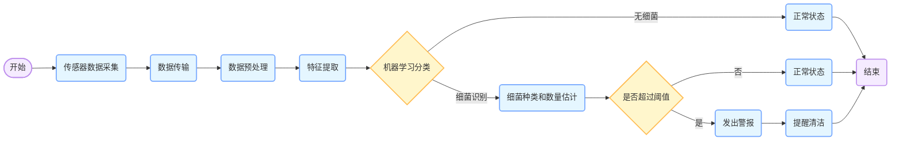

# AI Agent在智能门把手中的细菌检测

> 关键词：AI Agent、智能门把手、细菌检测、传感器技术、机器学习

> 摘要：本文聚焦于AI Agent在智能门把手中的细菌检测应用。详细阐述了相关核心概念、算法原理、数学模型，通过项目实战展示具体代码实现及解读。探讨了其实际应用场景，推荐了学习资源、开发工具和相关论文著作。最后总结未来发展趋势与挑战，并对常见问题进行解答。旨在全面介绍AI Agent在智能门把手细菌检测领域的技术应用与发展。

## 1. 背景介绍 
### 1.1 目的和范围
随着人们对公共卫生和个人健康的关注度不断提高，对公共场所和家居环境中的卫生状况监测变得尤为重要。智能门把手作为人们日常频繁接触的物体，其表面的细菌滋生情况直接关系到使用者的健康。本文章的目的在于深入探讨如何利用AI Agent技术实现智能门把手中的细菌检测，通过详细介绍相关技术原理、算法和实际应用案例，为该领域的研究和开发提供全面的技术参考。范围涵盖从核心概念的解释到项目实战的具体操作，以及未来发展趋势的分析。

### 1.2 预期读者
本文预期读者包括计算机科学、人工智能、物联网等领域的专业技术人员，如程序员、软件架构师、研究员等，他们希望深入了解AI Agent在智能设备中的应用原理和实现方法。同时，也适合对智能硬件和健康监测感兴趣的爱好者，帮助他们理解相关技术的工作机制和潜在价值。

### 1.3 文档结构概述
本文首先介绍了相关的背景信息，包括目的、预期读者和文档结构。接着详细阐述了核心概念与联系，通过文本示意图和Mermaid流程图展示其架构。然后讲解了核心算法原理，并使用Python源代码进行详细说明，同时给出了数学模型和公式。在项目实战部分，展示了开发环境搭建、源代码实现和代码解读。之后探讨了实际应用场景，推荐了相关的工具和资源。最后总结了未来发展趋势与挑战，解答了常见问题，并提供了扩展阅读和参考资料。

### 1.4 术语表
#### 1.4.1 核心术语定义
- **AI Agent（人工智能代理）**：是一种能够感知环境、根据感知信息做出决策并采取行动以实现特定目标的智能实体。在本文中，AI Agent用于处理智能门把手上传感器收集的细菌检测数据，并做出相应的判断和决策。
- **智能门把手**：集成了各种传感器和智能处理单元的门把手，能够实时监测门把手表面的物理和化学参数，如细菌数量、湿度、温度等，并将数据传输到AI Agent进行分析。
- **细菌检测**：通过特定的传感器或检测方法，识别和量化门把手上的细菌种类和数量，以评估门把手的卫生状况。

#### 1.4.2 相关概念解释
- **传感器技术**：是指用于检测各种物理和化学量的设备，如光学传感器、电化学传感器等。在智能门把手中，传感器用于收集与细菌相关的信息，如细菌代谢产物、生物电信号等。
- **机器学习**：是一门多领域交叉学科，涉及概率论、统计学、逼近论、凸分析、算法复杂度理论等多门学科。它专门研究计算机怎样模拟或实现人类的学习行为，以获取新的知识或技能，重新组织已有的知识结构使之不断改善自身的性能。在本文中，机器学习算法用于对传感器收集的数据进行分析和处理，以实现细菌的识别和数量估计。

#### 1.4.3 缩略词列表
- **AI**：Artificial Intelligence，人工智能
- **ML**：Machine Learning，机器学习
- **IoT**：Internet of Things，物联网

## 2. 核心概念与联系 
### 核心概念原理
AI Agent在智能门把手中的细菌检测系统主要由传感器模块、数据处理模块和决策执行模块组成。传感器模块负责收集门把手上的细菌相关数据，如细菌代谢产物的浓度、生物电信号等。数据处理模块将传感器收集到的原始数据进行预处理，如滤波、特征提取等，然后使用机器学习算法对数据进行分析和分类，以确定门把手上的细菌种类和数量。决策执行模块根据数据处理模块的结果，做出相应的决策，如发出警报、提醒清洁等。

### 架构的文本示意图
```plaintext
+---------------------+
|  智能门把手         |
| +-----------------+ |
| |  传感器模块      | |
| +-----------------+ |
| |  数据采集单元    | |
| |  信号调理电路    | |
| +-----------------+ |
+---------------------+
          |
          v
+---------------------+
|  数据传输模块       |
| +-----------------+ |
| |  有线/无线通信   | |
| +-----------------+ |
+---------------------+
          |
          v
+---------------------+
|  AI Agent服务器     |
| +-----------------+ |
| |  数据处理模块    | |
| |  - 数据预处理    | |
| |  - 特征提取      | |
| |  - 机器学习算法 | |
| +-----------------+ |
| +-----------------+ |
| |  决策执行模块    | |
| |  - 规则引擎      | |
| |  - 决策输出      | |
| +-----------------+ |
+---------------------+
          |
          v
+---------------------+
|  反馈与执行模块     |
| +-----------------+ |
| |  警报系统        | |
| |  清洁提醒        | |
| |  远程控制接口    | |
| +-----------------+ |
+---------------------+
```

### Mermaid流程图


## 3. 核心算法原理 & 具体操作步骤 
### 核心算法原理
在智能门把手中的细菌检测中，常用的机器学习算法包括支持向量机（SVM）、神经网络（如卷积神经网络CNN、循环神经网络RNN）等。这里以支持向量机为例进行详细讲解。

支持向量机的基本思想是在特征空间中找到一个最优的超平面，将不同类别的样本分开，并且使得不同类别样本到超平面的间隔最大。对于线性可分的数据集，存在一个超平面 $w^T x + b = 0$，其中 $w$ 是超平面的法向量，$b$ 是偏置项。对于训练样本 $(x_i, y_i)$，其中 $x_i$ 是特征向量，$y_i \in \{-1, 1\}$ 是类别标签，支持向量机的目标是求解以下优化问题：

$$
\begin{aligned}
\min_{w, b} &\quad \frac{1}{2} \| w \|^2 \\
\text{s.t.} &\quad y_i (w^T x_i + b) \geq 1, \quad i = 1, 2, \cdots, n
\end{aligned}
$$

对于线性不可分的数据集，可以引入松弛变量 $\xi_i \geq 0$，将优化问题修改为：

$$
\begin{aligned}
\min_{w, b, \xi} &\quad \frac{1}{2} \| w \|^2 + C \sum_{i=1}^{n} \xi_i \\
\text{s.t.} &\quad y_i (w^T x_i + b) \geq 1 - \xi_i, \quad \xi_i \geq 0, \quad i = 1, 2, \cdots, n
\end{aligned}
$$

其中 $C$ 是惩罚参数，用于平衡间隔最大化和误分类样本的惩罚。

### 具体操作步骤
1. **数据收集**：使用传感器收集门把手上的细菌相关数据，如细菌代谢产物的浓度、生物电信号等。
2. **数据预处理**：对收集到的原始数据进行清洗、滤波、归一化等操作，以提高数据的质量和可用性。
3. **特征提取**：从预处理后的数据中提取能够反映细菌特征的信息，如均值、方差、频谱特征等。
4. **数据集划分**：将提取的特征数据划分为训练集和测试集，一般按照70% - 30%或80% - 20%的比例进行划分。
5. **模型训练**：使用训练集数据对支持向量机模型进行训练，求解优化问题得到最优的 $w$ 和 $b$。
6. **模型评估**：使用测试集数据对训练好的模型进行评估，计算准确率、召回率、F1值等指标，评估模型的性能。
7. **预测与决策**：将新的传感器数据输入到训练好的模型中，得到细菌的分类结果，并根据结果做出相应的决策。

### Python源代码实现
```python
import numpy as np
from sklearn.svm import SVC
from sklearn.model_selection import train_test_split
from sklearn.metrics import accuracy_score

# 模拟数据生成
np.random.seed(42)
X = np.random.randn(100, 10)  # 100个样本，每个样本10个特征
y = np.random.randint(0, 2, 100)  # 随机生成类别标签

# 数据集划分
X_train, X_test, y_train, y_test = train_test_split(X, y, test_size=0.3, random_state=42)

# 创建支持向量机模型
model = SVC(kernel='linear')

# 模型训练
model.fit(X_train, y_train)

# 模型预测
y_pred = model.predict(X_test)

# 模型评估
accuracy = accuracy_score(y_test, y_pred)
print(f"模型准确率: {accuracy}")
```

## 4. 数学模型和公式 & 详细讲解 & 举例说明 
### 支持向量机的数学模型
支持向量机的优化问题可以通过拉格朗日乘子法进行求解。引入拉格朗日乘子 $\alpha_i \geq 0$ 和 $\mu_i \geq 0$，构造拉格朗日函数：

$$
L(w, b, \xi, \alpha, \mu) = \frac{1}{2} \| w \|^2 + C \sum_{i=1}^{n} \xi_i - \sum_{i=1}^{n} \alpha_i (y_i (w^T x_i + b) - 1 + \xi_i) - \sum_{i=1}^{n} \mu_i \xi_i
$$

其中 $\alpha_i$ 和 $\mu_i$ 分别是不等式约束 $y_i (w^T x_i + b) \geq 1 - \xi_i$ 和 $\xi_i \geq 0$ 的拉格朗日乘子。

对 $w$、$b$ 和 $\xi_i$ 求偏导数并令其为零：

$$
\begin{aligned}
\frac{\partial L}{\partial w} &= w - \sum_{i=1}^{n} \alpha_i y_i x_i = 0 \quad \Rightarrow \quad w = \sum_{i=1}^{n} \alpha_i y_i x_i \\
\frac{\partial L}{\partial b} &= - \sum_{i=1}^{n} \alpha_i y_i = 0 \\
\frac{\partial L}{\partial \xi_i} &= C - \alpha_i - \mu_i = 0
\end{aligned}
$$

将上述结果代入拉格朗日函数，得到对偶问题：

$$
\begin{aligned}
\max_{\alpha} &\quad \sum_{i=1}^{n} \alpha_i - \frac{1}{2} \sum_{i=1}^{n} \sum_{j=1}^{n} \alpha_i \alpha_j y_i y_j x_i^T x_j \\
\text{s.t.} &\quad \sum_{i=1}^{n} \alpha_i y_i = 0 \\
&\quad 0 \leq \alpha_i \leq C, \quad i = 1, 2, \cdots, n
\end{aligned}
$$

求解对偶问题得到最优的 $\alpha^*$，然后可以计算出最优的 $w^*$ 和 $b^*$：

$$
w^* = \sum_{i=1}^{n} \alpha_i^* y_i x_i
$$

对于 $b^*$，可以选择一个支持向量（即 $\alpha_i^* > 0$ 的样本），根据 $y_i (w^{*T} x_i + b^*) = 1$ 求解：

$$
b^* = y_j - w^{*T} x_j
$$

### 详细讲解
支持向量机的核心思想是通过寻找一个最优的超平面来划分不同类别的样本。在求解优化问题时，引入拉格朗日乘子法将原问题转化为对偶问题，对偶问题的求解更加方便，并且可以利用核函数处理非线性可分的数据集。

核函数是支持向量机中的一个重要概念，它可以将低维空间中的非线性问题映射到高维空间中，使得在高维空间中数据变得线性可分。常用的核函数包括线性核、多项式核、高斯核等。

### 举例说明
假设有一个二维数据集，包含两个类别的样本：正类（$y = 1$）和负类（$y = -1$）。我们可以使用支持向量机来找到一个最优的超平面将这两个类别分开。

```python
import numpy as np
import matplotlib.pyplot as plt
from sklearn.svm import SVC

# 生成二维数据集
np.random.seed(42)
X_pos = np.random.randn(50, 2) + [2, 2]
X_neg = np.random.randn(50, 2) - [2, 2]
X = np.vstack((X_pos, X_neg))
y = np.hstack((np.ones(50), -np.ones(50)))

# 创建支持向量机模型
model = SVC(kernel='linear')

# 模型训练
model.fit(X, y)

# 绘制数据集和超平面
plt.scatter(X[:, 0], X[:, 1], c=y, cmap=plt.cm.Paired)
ax = plt.gca()
xlim = ax.get_xlim()
ylim = ax.get_ylim()

# 创建网格点
xx = np.linspace(xlim[0], xlim[1], 30)
yy = np.linspace(ylim[0], ylim[1], 30)
YY, XX = np.meshgrid(yy, xx)
xy = np.vstack([XX.ravel(), YY.ravel()]).T
Z = model.decision_function(xy).reshape(XX.shape)

# 绘制超平面和间隔边界
ax.contour(XX, YY, Z, colors='k', levels=[-1, 0, 1], alpha=0.5, linestyles=['--', '-', '--'])

# 绘制支持向量
ax.scatter(model.support_vectors_[:, 0], model.support_vectors_[:, 1], s=100, facecolors='none', edgecolors='k')
plt.show()
```

在上述代码中，我们生成了一个二维数据集，并使用支持向量机模型进行训练。最后，我们绘制了数据集、超平面和间隔边界，以及支持向量。

## 5. 项目实战：代码实际案例和详细解释说明 
### 5.1  开发环境搭建
#### 硬件环境
- **智能门把手**：选择集成了细菌检测传感器的智能门把手，如光学传感器、电化学传感器等。
- **开发板**：可以选择树莓派（Raspberry Pi）、Arduino等开发板，用于收集传感器数据并进行初步处理。
- **服务器**：选择一台性能稳定的服务器，如阿里云服务器、腾讯云服务器等，用于运行AI Agent和机器学习模型。

#### 软件环境
- **操作系统**：在开发板上安装Raspbian、Arduino IDE等操作系统，在服务器上安装Ubuntu、CentOS等Linux操作系统。
- **编程语言**：使用Python作为主要的编程语言，安装Python 3.x版本。
- **开发工具**：安装PyCharm、Jupyter Notebook等开发工具，方便代码的编写和调试。
- **机器学习库**：安装Scikit-learn、TensorFlow、PyTorch等机器学习库，用于实现机器学习算法。

### 5.2  源代码详细实现和代码解读
#### 数据收集模块
```python
import serial

# 打开串口
ser = serial.Serial('/dev/ttyUSB0', 9600)

def collect_data():
    try:
        # 读取传感器数据
        data = ser.readline().decode('utf-8').strip()
        return data
    except Exception as e:
        print(f"数据收集错误: {e}")
        return None

# 测试数据收集
data = collect_data()
if data:
    print(f"收集到的数据: {data}")
```
**代码解读**：这段代码使用Python的`serial`库打开串口，从传感器读取数据。`collect_data`函数用于读取一行传感器数据，并将其解码为字符串。如果读取过程中出现错误，将打印错误信息。

#### 数据处理模块
```python
import numpy as np
from sklearn.preprocessing import StandardScaler

def preprocess_data(data):
    # 将数据转换为数值类型
    data = np.array([float(x) for x in data.split(',')])
    
    # 数据归一化
    scaler = StandardScaler()
    data = scaler.fit_transform(data.reshape(-1, 1)).flatten()
    
    return data

# 测试数据处理
processed_data = preprocess_data(data)
print(f"处理后的数据: {processed_data}")
```
**代码解读**：这段代码定义了一个`preprocess_data`函数，用于对收集到的数据进行预处理。首先将数据转换为数值类型，然后使用`StandardScaler`进行数据归一化，将数据的均值调整为0，标准差调整为1。

#### 机器学习模型模块
```python
from sklearn.svm import SVC
import joblib

# 加载训练好的模型
model = joblib.load('svm_model.pkl')

def predict_bacteria(data):
    # 进行预测
    prediction = model.predict(data.reshape(1, -1))
    return prediction

# 测试模型预测
prediction = predict_bacteria(processed_data)
print(f"预测结果: {prediction}")
```
**代码解读**：这段代码使用`joblib`库加载训练好的支持向量机模型。`predict_bacteria`函数用于对处理后的数据进行预测，将数据转换为二维数组并输入到模型中，得到预测结果。

### 5.3  代码解读与分析
- **数据收集模块**：通过串口通信从传感器读取数据，确保数据的实时性和准确性。
- **数据处理模块**：对收集到的数据进行预处理，包括数据类型转换和归一化，提高数据的质量和可用性，有助于机器学习模型的训练和预测。
- **机器学习模型模块**：加载训练好的模型，对处理后的数据进行预测，根据预测结果判断门把手上是否存在细菌。

## 6. 实际应用场景 
### 公共场所
在医院、学校、商场、机场等公共场所，智能门把手的细菌检测功能可以实时监测门把手的卫生状况。当检测到细菌数量超过阈值时，系统可以及时发出警报，提醒清洁人员进行清洁和消毒，有效预防疾病的传播。

### 家居环境
在家居环境中，智能门把手可以为家庭成员提供健康保障。例如，当家中有老人、小孩或免疫力较弱的人群时，通过实时监测门把手的细菌情况，及时提醒家庭成员注意卫生，避免感染疾病。

### 食品加工和餐饮行业
在食品加工和餐饮行业，智能门把手的细菌检测功能可以确保员工在操作过程中的卫生规范。员工在接触门把手后，系统可以检测到细菌的传播情况，及时提醒员工进行洗手和消毒，保障食品的安全和卫生。

## 7. 工具和资源推荐
### 7.1 学习资源推荐
#### 7.1.1 书籍推荐
- 《机器学习》（周志华）：全面介绍了机器学习的基本概念、算法和应用，是机器学习领域的经典教材。
- 《深度学习》（Ian Goodfellow、Yoshua Bengio、Aaron Courville）：详细介绍了深度学习的理论和实践，适合有一定机器学习基础的读者深入学习。
- 《Python机器学习实战》（Sebastian Raschka）：通过实际案例介绍了如何使用Python实现机器学习算法，是一本实践性很强的书籍。

#### 7.1.2 在线课程
- Coursera上的“机器学习”课程（Andrew Ng教授）：是一门非常经典的机器学习入门课程，系统地介绍了机器学习的基本概念和算法。
- edX上的“深度学习”课程（MIT）：由麻省理工学院的教授授课，深入介绍了深度学习的理论和应用。
- 中国大学MOOC上的“人工智能基础”课程：适合初学者了解人工智能的基本概念和技术。

#### 7.1.3 技术博客和网站
- Medium：是一个技术博客平台，上面有很多关于人工智能、机器学习的优质文章。
- Kaggle：是一个数据科学竞赛平台，上面有很多开源的数据集和代码，可以学习到很多实际的应用案例。
- 机器之心：是一个专注于人工智能领域的媒体平台，提供最新的技术动态和研究成果。

### 7.2 开发工具框架推荐
#### 7.2.1 IDE和编辑器
- PyCharm：是一款专业的Python集成开发环境，提供了丰富的代码编辑、调试和项目管理功能。
- Jupyter Notebook：是一个交互式的开发环境，适合进行数据探索、模型训练和可视化。
- Visual Studio Code：是一款轻量级的代码编辑器，支持多种编程语言，安装相应的插件后可以进行Python开发。

#### 7.2.2 调试和性能分析工具
- PDB：是Python自带的调试工具，可以在代码中设置断点，逐步执行代码，查看变量的值。
- TensorBoard：是TensorFlow提供的可视化工具，可以用于查看模型的训练过程、损失函数的变化等。
- Py-Spy：是一个性能分析工具，可以分析Python代码的性能瓶颈。

#### 7.2.3 相关框架和库
- Scikit-learn：是一个简单易用的机器学习库，提供了各种机器学习算法的实现，如分类、回归、聚类等。
- TensorFlow：是一个开源的深度学习框架，由Google开发，广泛应用于图像识别、自然语言处理等领域。
- PyTorch：是另一个开源的深度学习框架，具有动态图的特点，易于使用和调试。

### 7.3 相关论文著作推荐
#### 7.3.1 经典论文
- “Support-Vector Networks”（Cortes和Vapnik）：介绍了支持向量机的基本原理和算法，是支持向量机领域的经典论文。
- “ImageNet Classification with Deep Convolutional Neural Networks”（Krizhevsky、Sutskever和Hinton）：提出了AlexNet模型，开启了深度学习在图像识别领域的热潮。
- “Long Short-Term Memory”（Hochreiter和Schmidhuber）：介绍了长短期记忆网络（LSTM）的基本原理和算法，是循环神经网络领域的经典论文。

#### 7.3.2 最新研究成果
- 在IEEE Xplore、ACM Digital Library等学术数据库中，可以搜索到关于AI Agent、智能传感器、细菌检测等领域的最新研究成果。
- 关注顶级学术会议，如NeurIPS、ICML、CVPR等，这些会议上会发布很多最新的研究成果。

#### 7.3.3 应用案例分析
- 可以在学术期刊和会议论文中找到关于AI Agent在智能设备中应用的案例分析，了解实际应用中的技术挑战和解决方案。
- 一些企业和研究机构的官方网站也会发布相关的应用案例和技术报告。

## 8. 总结：未来发展趋势与挑战
### 未来发展趋势
- **多传感器融合**：未来的智能门把手将集成更多类型的传感器，如光学传感器、电化学传感器、生物传感器等，实现多传感器融合，提高细菌检测的准确性和可靠性。
- **边缘计算**：将AI Agent和机器学习模型部署到边缘设备上，如智能门把手本身，实现实时数据处理和决策，减少数据传输延迟，提高系统的响应速度。
- **智能化管理**：与智能家居系统、物业管理系统等进行集成，实现智能化的管理和控制。例如，当检测到门把手上的细菌数量超过阈值时，自动启动清洁机器人进行清洁。

### 挑战
- **传感器精度和可靠性**：目前的传感器在细菌检测的精度和可靠性方面还存在一定的局限性，需要进一步提高传感器的性能。
- **数据隐私和安全**：智能门把手收集的细菌检测数据涉及到用户的隐私和安全问题，需要采取有效的措施保护数据的隐私和安全。
- **算法复杂度和计算资源**：机器学习算法的复杂度较高，需要大量的计算资源进行训练和预测。如何在资源有限的情况下提高算法的效率是一个挑战。

## 9. 附录：常见问题与解答
### 问题1：智能门把手的细菌检测原理是什么？
智能门把手的细菌检测主要通过传感器收集与细菌相关的物理和化学信息，如细菌代谢产物的浓度、生物电信号等。然后使用机器学习算法对收集到的数据进行分析和处理，以确定门把手上的细菌种类和数量。

### 问题2：支持向量机模型的训练时间长吗？
支持向量机模型的训练时间取决于数据集的大小和复杂度。对于小规模的数据集，训练时间通常较短；对于大规模的数据集，训练时间可能会较长。可以通过选择合适的核函数、调整参数等方法来提高训练效率。

### 问题3：如何保证智能门把手的细菌检测数据的准确性？
可以通过以下方法保证数据的准确性：
- 选择高精度、可靠性好的传感器。
- 对传感器进行定期校准和维护。
- 对收集到的数据进行预处理，如滤波、特征提取等，提高数据的质量。
- 使用多个传感器进行数据融合，综合判断细菌的情况。

### 问题4：智能门把手的细菌检测功能可以检测所有类型的细菌吗？
目前的智能门把手细菌检测功能还不能检测所有类型的细菌。不同的传感器对不同类型的细菌有不同的检测灵敏度和特异性。未来随着传感器技术和机器学习算法的不断发展，检测的细菌种类会不断增加。

## 10. 扩展阅读 & 参考资料
### 扩展阅读
- 《物联网：技术、应用与标准》：介绍了物联网的基本概念、技术架构和应用场景，有助于深入了解智能门把手在物联网中的地位和作用。
- 《人工智能：现代方法》：全面介绍了人工智能的各个领域，包括搜索算法、知识表示、机器学习、自然语言处理等，对理解AI Agent的工作原理有很大帮助。

### 参考资料
- 相关学术论文和研究报告：在IEEE Xplore、ACM Digital Library、ScienceDirect等学术数据库中搜索关于AI Agent、智能传感器、细菌检测等领域的论文和报告。
- 开源代码库：在GitHub等开源代码平台上搜索相关的代码库，学习和借鉴他人的实现方法。

作者：AI天才研究院/AI Genius Institute & 禅与计算机程序设计艺术 /Zen And The Art of Computer Programming