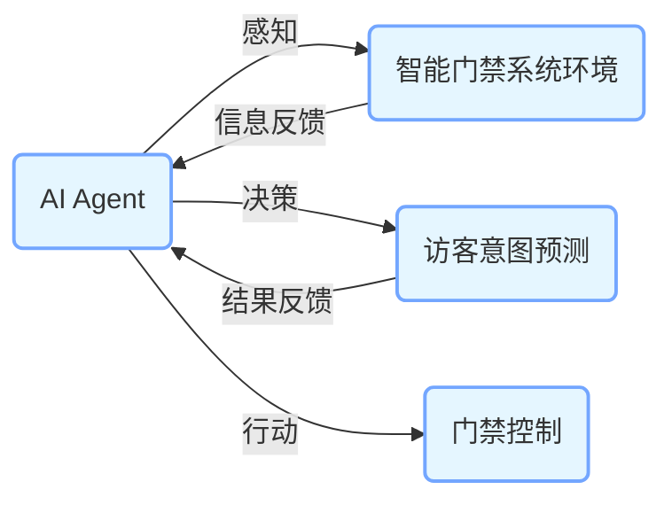

# AI Agent在智能门禁系统中的访客意图预测

> 关键词：AI Agent、智能门禁系统、访客意图预测、机器学习、计算机视觉

> 摘要：本文深入探讨了AI Agent在智能门禁系统中对访客意图进行预测的相关技术和应用。首先介绍了研究的背景、目的、预期读者和文档结构等内容。接着阐述了核心概念及联系，包括AI Agent、智能门禁系统和访客意图预测的原理与架构。详细讲解了核心算法原理和具体操作步骤，通过Python代码进行示例。分析了相关的数学模型和公式，并举例说明。通过项目实战展示了代码的实际案例和详细解释。探讨了该技术在实际场景中的应用，推荐了学习、开发所需的工具和资源。最后总结了未来发展趋势与挑战，还提供了常见问题解答和扩展阅读参考资料。

## 1. 背景介绍 
### 1.1 目的和范围
随着科技的不断进步，智能门禁系统在各个领域得到了广泛的应用。传统的门禁系统主要基于身份验证，如刷卡、指纹识别等，但对于访客的意图缺乏有效的预测和处理能力。本研究的目的是将AI Agent引入智能门禁系统，实现对访客意图的准确预测，从而提高门禁系统的安全性和智能化水平。

研究范围涵盖了AI Agent的基本原理、智能门禁系统的架构、访客意图预测的算法和模型，以及实际应用中的开发和部署。

### 1.2 预期读者
本文的预期读者包括智能门禁系统的开发者、研究人员、技术爱好者，以及对人工智能在安防领域应用感兴趣的相关人士。

### 1.3 文档结构概述
本文共分为十个部分。第一部分为背景介绍，阐述研究的目的、范围、预期读者和文档结构。第二部分介绍核心概念与联系，包括AI Agent、智能门禁系统和访客意图预测的原理和架构。第三部分讲解核心算法原理和具体操作步骤，通过Python代码进行详细阐述。第四部分分析数学模型和公式，并举例说明。第五部分通过项目实战展示代码的实际案例和详细解释。第六部分探讨实际应用场景。第七部分推荐学习和开发所需的工具和资源。第八部分总结未来发展趋势与挑战。第九部分为附录，提供常见问题解答。第十部分为扩展阅读和参考资料。

### 1.4 术语表
#### 1.4.1 核心术语定义
- **AI Agent**：人工智能代理，是一种能够感知环境、自主决策并采取行动的智能实体。
- **智能门禁系统**：基于现代电子与信息技术，在建筑物内外的出入口安装智能卡识别设备，通过对人（或物）的进出实施放行、拒绝、记录等操作的智能化管理系统。
- **访客意图预测**：通过分析访客的行为、表情、语言等信息，预测其访问的目的和意图。

#### 1.4.2 相关概念解释
- **机器学习**：一门多领域交叉学科，涉及概率论、统计学、逼近论、凸分析、算法复杂度理论等多门学科。它专门研究计算机怎样模拟或实现人类的学习行为，以获取新的知识或技能，重新组织已有的知识结构使之不断改善自身的性能。
- **计算机视觉**：是一门研究如何使机器“看”的科学，更进一步的说，就是指用摄影机和电脑代替人眼对目标进行识别、跟踪和测量等机器视觉，并进一步做图形处理，使电脑处理成为更适合人眼观察或传送给仪器检测的图像。

#### 1.4.3 缩略词列表
- **AI**：Artificial Intelligence，人工智能
- **ML**：Machine Learning，机器学习
- **CV**：Computer Vision，计算机视觉

## 2. 核心概念与联系 

### 核心概念原理
#### AI Agent
AI Agent是一种能够感知环境、自主决策并采取行动的智能实体。它由感知模块、决策模块和行动模块组成。感知模块负责收集环境信息，决策模块根据感知到的信息进行分析和决策，行动模块根据决策结果执行相应的动作。

#### 智能门禁系统
智能门禁系统基于现代电子与信息技术，在建筑物内外的出入口安装智能卡识别设备、通过对人（或物）的进出实施放行、拒绝、记录等操作的智能化管理系统。它通常包括门禁控制器、读卡器、门锁、电源等硬件设备，以及门禁管理软件等。

#### 访客意图预测
访客意图预测是通过分析访客的行为、表情、语言等信息，预测其访问的目的和意图。常用的方法包括机器学习、深度学习等。

### 架构示意图


### 联系说明
AI Agent作为核心，通过感知智能门禁系统的环境信息，包括访客的行为、身份信息等。然后根据这些信息进行决策，预测访客的意图。根据预测结果，AI Agent采取相应的行动，如控制门禁的开关。访客意图预测的结果又会反馈给AI Agent，用于调整后续的决策和行动。

## 3. 核心算法原理 & 具体操作步骤 

### 算法原理
在访客意图预测中，我们可以使用机器学习中的分类算法，如支持向量机（SVM）。支持向量机的基本思想是在特征空间中找到一个最优的超平面，将不同类别的样本分开。

### Python源代码实现
```python
import numpy as np
from sklearn import svm
from sklearn.model_selection import train_test_split
from sklearn.metrics import accuracy_score

# 生成示例数据
# 假设我们有一些访客的特征数据，如年龄、停留时间、表情等
X = np.array([[25, 10, 0.8], [30, 15, 0.6], [20, 5, 0.9], [35, 20, 0.5]])
# 对应的访客意图标签，0表示正常访问，1表示可疑访问
y = np.array([0, 0, 0, 1])

# 划分训练集和测试集
X_train, X_test, y_train, y_test = train_test_split(X, y, test_size=0.2, random_state=42)

# 创建SVM分类器
clf = svm.SVC(kernel='linear')

# 训练模型
clf.fit(X_train, y_train)

# 预测
y_pred = clf.predict(X_test)

# 计算准确率
accuracy = accuracy_score(y_test, y_pred)
print(f"Accuracy: {accuracy}")
```

### 具体操作步骤
1. **数据收集**：收集访客的相关特征数据，如年龄、停留时间、表情等，并为每个样本标注对应的意图标签。
2. **数据预处理**：对收集到的数据进行清洗、归一化等处理，以提高模型的性能。
3. **模型选择**：选择合适的机器学习算法，如支持向量机、决策树等。
4. **模型训练**：使用训练集数据对模型进行训练。
5. **模型评估**：使用测试集数据对训练好的模型进行评估，计算准确率、召回率等指标。
6. **模型部署**：将训练好的模型部署到智能门禁系统中，实时预测访客的意图。

## 4. 数学模型和公式 & 详细讲解 & 举例说明 

### 支持向量机的数学模型
支持向量机的目标是找到一个超平面 $w^T x + b = 0$，使得不同类别的样本到该超平面的间隔最大。间隔可以表示为 $\frac{2}{\|w\|}$，其中 $w$ 是超平面的法向量，$b$ 是偏置项。

为了找到最优的超平面，我们需要解决以下优化问题：
$$
\begin{aligned}
\min_{w,b} &\quad \frac{1}{2}\|w\|^2 \\
\text{s.t.} &\quad y_i(w^T x_i + b) \geq 1, \quad i = 1,2,\cdots,n
\end{aligned}
$$
其中 $x_i$ 是第 $i$ 个样本的特征向量，$y_i$ 是对应的标签（$y_i \in \{-1, 1\}$），$n$ 是样本的数量。

### 详细讲解
上述优化问题是一个凸二次规划问题，可以通过拉格朗日乘子法求解。引入拉格朗日乘子 $\alpha_i \geq 0$，构造拉格朗日函数：
$$
L(w,b,\alpha) = \frac{1}{2}\|w\|^2 - \sum_{i=1}^{n} \alpha_i (y_i(w^T x_i + b) - 1)
$$
对 $w$ 和 $b$ 求偏导数并令其为0，得到：
$$
\begin{aligned}
\frac{\partial L}{\partial w} &= w - \sum_{i=1}^{n} \alpha_i y_i x_i = 0 \\
\frac{\partial L}{\partial b} &= -\sum_{i=1}^{n} \alpha_i y_i = 0
\end{aligned}
$$
将上述结果代入拉格朗日函数，得到对偶问题：
$$
\begin{aligned}
\max_{\alpha} &\quad \sum_{i=1}^{n} \alpha_i - \frac{1}{2} \sum_{i=1}^{n} \sum_{j=1}^{n} \alpha_i \alpha_j y_i y_j x_i^T x_j \\
\text{s.t.} &\quad \sum_{i=1}^{n} \alpha_i y_i = 0 \\
&\quad \alpha_i \geq 0, \quad i = 1,2,\cdots,n
\end{aligned}
$$
求解对偶问题得到最优的拉格朗日乘子 $\alpha^*$，然后可以计算出最优的 $w^*$ 和 $b^*$：
$$
w^* = \sum_{i=1}^{n} \alpha_i^* y_i x_i
$$
$$
b^* = y_j - w^{*T} x_j, \quad \text{其中} \alpha_j^* > 0
$$

### 举例说明
假设我们有两个样本：$x_1 = [1, 2]$，$y_1 = 1$；$x_2 = [2, 1]$，$y_2 = -1$。我们的目标是找到一个超平面将这两个样本分开。

首先，构造对偶问题：
$$
\begin{aligned}
\max_{\alpha_1, \alpha_2} &\quad \alpha_1 + \alpha_2 - \frac{1}{2} (\alpha_1^2 + \alpha_2^2 - 2\alpha_1 \alpha_2 x_1^T x_2) \\
\text{s.t.} &\quad \alpha_1 - \alpha_2 = 0 \\
&\quad \alpha_1 \geq 0, \quad \alpha_2 \geq 0
\end{aligned}
$$
求解对偶问题得到 $\alpha_1^* = \alpha_2^* = 1$。

然后，计算 $w^*$ 和 $b^*$：
$$
w^* = \alpha_1^* y_1 x_1 + \alpha_2^* y_2 x_2 = [1, 2] - [2, 1] = [-1, 1]
$$
$$
b^* = y_1 - w^{*T} x_1 = 1 - (-1\times1 + 1\times2) = 0
$$

所以，最优的超平面为 $-x_1 + x_2 = 0$。

## 5. 项目实战：代码实际案例和详细解释说明 

### 5.1  开发环境搭建
#### 操作系统
可以选择Windows、Linux或macOS等操作系统。

#### 编程语言和库
- **Python**：选择Python 3.x版本。
- **机器学习库**：安装`scikit-learn`库，用于实现机器学习算法。
- **计算机视觉库**：安装`OpenCV`库，用于处理访客的图像和视频数据。

#### 安装命令
```bash
pip install scikit-learn opencv-python
```

### 5.2  源代码详细实现和代码解读
```python
import cv2
import numpy as np
from sklearn import svm
from sklearn.model_selection import train_test_split
from sklearn.metrics import accuracy_score

# 模拟数据收集
def collect_data():
    # 假设我们有一些访客的图像数据
    images = []
    labels = []
    # 这里简单模拟收集了一些图像和对应的标签
    for i in range(10):
        image = np.random.rand(100, 100, 3).astype(np.uint8)
        images.append(image)
        label = np.random.randint(0, 2)
        labels.append(label)
    return images, labels

# 特征提取
def extract_features(images):
    features = []
    for image in images:
        # 这里简单使用图像的均值作为特征
        feature = np.mean(image)
        features.append(feature)
    return np.array(features).reshape(-1, 1)

# 主函数
def main():
    # 数据收集
    images, labels = collect_data()
    # 特征提取
    features = extract_features(images)
    # 划分训练集和测试集
    X_train, X_test, y_train, y_test = train_test_split(features, labels, test_size=0.2, random_state=42)
    # 创建SVM分类器
    clf = svm.SVC(kernel='linear')
    # 训练模型
    clf.fit(X_train, y_train)
    # 预测
    y_pred = clf.predict(X_test)
    # 计算准确率
    accuracy = accuracy_score(y_test, y_pred)
    print(f"Accuracy: {accuracy}")

if __name__ == "__main__":
    main()
```

### 代码解读与分析
1. **数据收集**：`collect_data`函数模拟了数据收集的过程，生成了一些随机的图像数据和对应的标签。
2. **特征提取**：`extract_features`函数对图像数据进行特征提取，这里简单地使用图像的均值作为特征。
3. **数据划分**：使用`train_test_split`函数将数据划分为训练集和测试集。
4. **模型训练**：创建SVM分类器并使用训练集数据进行训练。
5. **模型预测**：使用训练好的模型对测试集数据进行预测。
6. **模型评估**：使用`accuracy_score`函数计算模型的准确率。

## 6. 实际应用场景 
### 住宅小区
在住宅小区的门禁系统中，AI Agent可以通过分析访客的行为和表情，预测其意图。例如，如果访客在门口徘徊、频繁张望，可能存在可疑意图，系统可以及时发出警报并通知安保人员。

### 商业办公楼
在商业办公楼的门禁系统中，AI Agent可以根据访客的身份和预约信息，预测其访问的目的。如果访客没有预约却试图进入敏感区域，系统可以拒绝其进入并记录相关信息。

### 学校
在学校的门禁系统中，AI Agent可以识别访客的身份和意图。例如，如果是家长来访，系统可以引导其前往指定区域；如果是陌生人且意图不明，系统可以限制其进入校园。

## 7. 工具和资源推荐
### 7.1 学习资源推荐
#### 7.1.1 书籍推荐
- 《机器学习》（周志华）：全面介绍了机器学习的基本概念、算法和应用。
- 《Python机器学习实战》（Sebastian Raschka）：通过实际案例介绍了如何使用Python进行机器学习开发。
- 《计算机视觉：算法与应用》（Richard Szeliski）：深入讲解了计算机视觉的算法和应用。

#### 7.1.2 在线课程
- Coursera上的“机器学习”课程（Andrew Ng教授）：经典的机器学习课程，适合初学者。
- edX上的“计算机视觉基础”课程：系统介绍了计算机视觉的基础知识和算法。

#### 7.1.3 技术博客和网站
- 博客园：有很多关于机器学习和计算机视觉的技术文章。
- 机器之心：专注于人工智能领域的资讯和技术分享。
- Kaggle：提供了大量的机器学习和数据科学竞赛，以及相关的教程和代码。

### 7.2 开发工具框架推荐
#### 7.2.1 IDE和编辑器
- PyCharm：功能强大的Python集成开发环境，适合机器学习和数据分析项目。
- Jupyter Notebook：交互式的开发环境，方便进行代码调试和数据分析。

#### 7.2.2 调试和性能分析工具
- TensorBoard：用于可视化深度学习模型的训练过程和性能指标。
- Scikit-learn的`GridSearchCV`：用于模型调优和参数搜索。

#### 7.2.3 相关框架和库
- TensorFlow：开源的深度学习框架，广泛应用于图像识别、自然语言处理等领域。
- PyTorch：另一个流行的深度学习框架，具有动态图和易于使用的特点。
- OpenCV：计算机视觉领域的开源库，提供了丰富的图像处理和分析算法。

### 7.3 相关论文著作推荐
#### 7.3.1 经典论文
- “Support-Vector Networks”（Cortes和Vapnik）：介绍了支持向量机的基本原理和算法。
- “ImageNet Classification with Deep Convolutional Neural Networks”（Krizhevsky等人）：开启了深度学习在图像识别领域的热潮。

#### 7.3.2 最新研究成果
- 关注顶级学术会议，如CVPR、ICCV、NeurIPS等，了解最新的研究进展。
- 相关学术期刊，如《Journal of Artificial Intelligence Research》《IEEE Transactions on Pattern Analysis and Machine Intelligence》等。

#### 7.3.3 应用案例分析
- 一些企业和研究机构会发布智能门禁系统的应用案例，可以通过他们的官方网站或技术博客获取相关信息。

## 8. 总结：未来发展趋势与挑战
### 未来发展趋势
- **多模态融合**：结合图像、语音、行为等多种模态的信息，提高访客意图预测的准确性。
- **深度学习的应用**：随着深度学习技术的不断发展，将有更多更强大的模型应用于访客意图预测。
- **与物联网的结合**：智能门禁系统将与其他物联网设备进行深度融合，实现更加智能化的管理。

### 挑战
- **数据隐私和安全**：访客的个人信息和行为数据需要得到妥善的保护，防止数据泄露和滥用。
- **复杂环境的适应性**：在复杂的环境中，如光线变化、人群拥挤等，访客意图预测的准确性可能会受到影响。
- **模型的可解释性**：深度学习模型往往是黑盒模型，其决策过程难以解释，需要提高模型的可解释性。

## 9. 附录：常见问题与解答
### 问题1：AI Agent在访客意图预测中的准确率如何提高？
答：可以通过以下方法提高准确率：收集更多的高质量数据、选择合适的机器学习算法、进行特征工程、对模型进行调优和评估等。

### 问题2：智能门禁系统与传统门禁系统相比有哪些优势？
答：智能门禁系统具有更高的安全性和智能化水平。它可以通过AI Agent对访客的意图进行预测，及时发现可疑人员并采取相应的措施。同时，智能门禁系统还可以实现远程控制、记录和管理等功能。

### 问题3：在实际应用中，如何处理访客意图预测的误判问题？
答：可以设置多级预警机制，当预测结果为可疑意图时，先进行二次确认，如通过人工干预或其他辅助手段进行判断。同时，不断优化模型，提高预测的准确性。

## 10. 扩展阅读 & 参考资料
### 扩展阅读
- 《人工智能：现代方法》（Stuart Russell和Peter Norvig）：全面介绍了人工智能的理论和方法。
- 《深度学习》（Ian Goodfellow等人）：深度学习领域的经典著作。

### 参考资料
- 相关学术论文和研究报告。
- 智能门禁系统的产品文档和技术资料。
- 开源项目和代码库。

作者：AI天才研究院/AI Genius Institute & 禅与计算机程序设计艺术 /Zen And The Art of Computer Programming