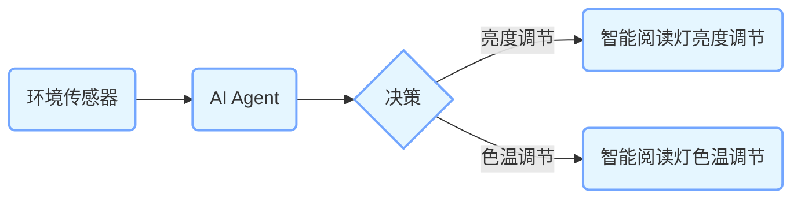

# AI Agent在智能阅读灯中的护眼模式调节

> 关键词：AI Agent、智能阅读灯、护眼模式调节、环境感知、个性化调节

> 摘要：本文深入探讨了AI Agent在智能阅读灯护眼模式调节中的应用。首先介绍了研究背景、目的、预期读者和文档结构等信息。接着阐述了AI Agent、智能阅读灯及护眼模式调节的核心概念与联系，给出了相应的文本示意图和Mermaid流程图。详细讲解了核心算法原理，并用Python代码进行了说明，同时介绍了相关的数学模型和公式。通过项目实战，展示了开发环境搭建、源代码实现和代码解读。分析了AI Agent在智能阅读灯护眼模式调节的实际应用场景，推荐了学习资源、开发工具框架和相关论文著作。最后总结了未来发展趋势与挑战，提供了常见问题解答和扩展阅读参考资料。

## 1. 背景介绍 
### 1.1 目的和范围
在当今数字化时代，人们长时间进行阅读等近距离用眼活动，眼睛健康问题日益受到关注。智能阅读灯作为保护眼睛的重要工具，其护眼模式的调节效果至关重要。本文章的目的在于深入研究AI Agent如何应用于智能阅读灯的护眼模式调节，以实现更精准、个性化的灯光调节，从而有效减轻眼睛疲劳，保护用户视力。

本文的范围涵盖了AI Agent和智能阅读灯护眼模式调节的核心概念、算法原理、数学模型、项目实战、实际应用场景等方面。通过对这些内容的详细阐述，为相关领域的研究和开发提供全面的技术参考。

### 1.2 预期读者
本文预期读者包括计算机科学、人工智能、照明工程等领域的科研人员和工程师，他们可以从本文中获取AI Agent在智能阅读灯应用的技术细节和创新思路，为进一步的研究和开发提供参考。同时，对智能硬件、智能家居感兴趣的爱好者也可以通过本文了解AI Agent在实际产品中的应用原理和优势。此外，智能阅读灯生产企业的产品设计师和研发人员能够从本文中得到产品优化和升级的灵感，提升产品的竞争力。

### 1.3 文档结构概述
本文将按照以下结构进行阐述：首先介绍相关的核心概念与联系，通过文本示意图和Mermaid流程图清晰展示其架构；接着详细讲解核心算法原理，并给出Python源代码进行说明；然后介绍数学模型和公式，并通过具体例子进行解释；之后通过项目实战，展示开发环境搭建、源代码实现和代码解读；分析实际应用场景；推荐学习资源、开发工具框架和相关论文著作；最后总结未来发展趋势与挑战，提供常见问题解答和扩展阅读参考资料。

### 1.4 术语表
#### 1.4.1 核心术语定义
- **AI Agent（人工智能代理）**：是一种能够感知环境、根据环境信息进行决策，并采取行动以实现特定目标的智能实体。在本文中，AI Agent用于感知智能阅读灯周围的环境信息，并根据这些信息调节阅读灯的护眼模式。
- **智能阅读灯**：具备智能控制功能的阅读灯，能够根据不同的环境条件和用户需求，自动调节灯光的亮度、色温等参数，以提供舒适的阅读照明环境。
- **护眼模式调节**：根据用户的阅读环境、用眼习惯等因素，对智能阅读灯的灯光参数进行优化调节，以减少眼睛疲劳，保护视力。

#### 1.4.2 相关概念解释
- **环境感知**：AI Agent通过各种传感器（如光线传感器、人体传感器等）获取智能阅读灯周围的环境信息，包括光照强度、颜色温度、用户位置等。
- **个性化调节**：根据不同用户的用眼习惯、视力状况等因素，为每个用户提供定制化的护眼模式调节方案。

#### 1.4.3 缩略词列表
- **AI（Artificial Intelligence）**：人工智能
- **LED（Light Emitting Diode）**：发光二极管

## 2. 核心概念与联系 

### 核心概念原理
AI Agent在智能阅读灯的护眼模式调节中扮演着核心角色。其工作原理基于环境感知、决策和执行三个主要步骤。

环境感知阶段，AI Agent通过安装在智能阅读灯上的各种传感器收集环境信息。例如，光线传感器可以测量周围环境的光照强度和颜色温度，人体传感器可以检测用户的位置和活动状态。这些传感器将收集到的数据实时传输给AI Agent。

决策阶段，AI Agent根据接收到的环境信息，运用预设的算法和模型进行分析和决策。它会考虑多种因素，如当前环境的光照是否充足、是否存在频闪等问题，以及用户的个性化需求。通过对这些因素的综合评估，AI Agent确定最适合当前环境和用户的护眼模式调节方案。

执行阶段，AI Agent将决策结果转化为具体的控制指令，发送给智能阅读灯的驱动模块。驱动模块根据指令调整阅读灯的灯光参数，如亮度、色温等，以实现护眼模式的调节。

### 架构的文本示意图
```plaintext
|------------------|          |------------------|          |------------------|
|   环境传感器    |  ---->   |      AI Agent    |  ---->   |    智能阅读灯    |
| （光线、人体等） |          | （环境感知、决策） |          | （亮度、色温调节） |
|------------------|          |------------------|          |------------------|
```

### Mermaid流程图


## 3. 核心算法原理 & 具体操作步骤 

### 核心算法原理
在智能阅读灯的护眼模式调节中，我们可以采用基于规则的算法和机器学习算法相结合的方式。基于规则的算法可以根据一些基本的照明标准和经验规则，对灯光参数进行初步的调节。例如，当环境光照强度较低时，增加阅读灯的亮度；当环境色温偏冷时，将阅读灯的色温调节为暖色调。

机器学习算法可以进一步提高调节的准确性和个性化程度。我们可以使用深度学习模型，如卷积神经网络（CNN）或循环神经网络（RNN），对大量的环境数据和用户反馈进行训练。通过训练，模型可以学习到不同环境条件下和不同用户需求下的最佳灯光参数设置。

### 具体操作步骤
1. **数据收集**：使用传感器收集环境信息，包括光照强度、色温、用户位置等，并记录用户对灯光调节的反馈信息。
2. **数据预处理**：对收集到的数据进行清洗、归一化等预处理操作，以提高数据的质量和可用性。
3. **模型训练**：使用预处理后的数据对机器学习模型进行训练，调整模型的参数，使其能够准确地预测最佳灯光参数。
4. **实时决策**：在实际使用中，AI Agent实时获取环境信息，将其输入到训练好的模型中，得到最佳灯光参数的预测结果。
5. **灯光调节**：根据预测结果，AI Agent向智能阅读灯的驱动模块发送控制指令，调节灯光的亮度、色温等参数。

### Python源代码示例
```python
import numpy as np
from sklearn.neural_network import MLPRegressor

# 模拟数据收集
# 假设环境光照强度、色温、用户位置作为输入特征
# 灯光亮度、色温作为输出目标
X_train = np.random.rand(100, 3)  # 输入特征
y_train = np.random.rand(100, 2)  # 输出目标

# 模型训练
model = MLPRegressor(hidden_layer_sizes=(10, 10), max_iter=1000)
model.fit(X_train, y_train)

# 实时决策
def real_time_decision(environment_info):
    """
    根据环境信息进行实时决策，返回最佳灯光参数
    :param environment_info: 环境信息，形状为 (1, 3) 的数组
    :return: 最佳灯光参数，形状为 (1, 2) 的数组
    """
    prediction = model.predict(environment_info.reshape(1, -1))
    return prediction

# 示例环境信息
environment_info = np.array([0.2, 0.3, 0.4])
optimal_light_params = real_time_decision(environment_info)
print("最佳灯光参数:", optimal_light_params)
```

## 4. 数学模型和公式 & 详细讲解 & 举例说明 

### 数学模型
在智能阅读灯的护眼模式调节中，我们可以使用线性回归模型和神经网络模型。

线性回归模型的基本形式为：

$$y = w_0 + w_1x_1 + w_2x_2 + \cdots + w_nx_n$$

其中，$y$ 是预测的灯光参数（如亮度、色温），$x_1, x_2, \cdots, x_n$ 是环境特征（如光照强度、色温、用户位置等），$w_0, w_1, w_2, \cdots, w_n$ 是模型的参数。

神经网络模型是一种更为复杂的非线性模型，它由多个神经元组成的层次结构。每个神经元接收输入信号，经过加权求和和非线性激活函数处理后，输出一个新的信号。神经网络模型可以自动学习输入和输出之间的复杂关系。

### 详细讲解
线性回归模型的优点是简单易懂，计算效率高。它可以通过最小化预测值和真实值之间的误差平方和来求解模型参数。具体来说，我们可以使用最小二乘法来估计参数 $w_0, w_1, w_2, \cdots, w_n$。

神经网络模型则具有更强的表达能力，可以处理非线性问题。在训练神经网络模型时，我们通常使用反向传播算法来更新模型的参数，以最小化损失函数。损失函数可以选择均方误差（MSE）等。

### 举例说明
假设我们使用线性回归模型来预测阅读灯的亮度。我们收集了一些环境光照强度 $x$ 和对应的阅读灯亮度 $y$ 的数据。通过最小二乘法，我们可以得到线性回归模型的参数 $w_0$ 和 $w_1$。

例如，我们得到的线性回归方程为：

$$y = 10 + 2x$$

这意味着当环境光照强度 $x$ 增加 1 个单位时，阅读灯的亮度 $y$ 会增加 2 个单位。如果当前环境光照强度为 5，则预测的阅读灯亮度为：

$$y = 10 + 2 \times 5 = 20$$

## 5. 项目实战：代码实际案例和详细解释说明 

### 5.1  开发环境搭建
#### 硬件准备
- 智能阅读灯：选择支持远程控制和参数调节的智能阅读灯，如基于LED技术的智能阅读灯。
- 传感器模块：包括光线传感器、人体传感器等，用于收集环境信息。
- 开发板：如Arduino、Raspberry Pi等，用于连接传感器和智能阅读灯，并运行AI Agent程序。

#### 软件准备
- 操作系统：根据开发板的类型选择合适的操作系统，如Raspberry Pi可以使用Raspbian系统。
- 编程语言：Python是一种常用的编程语言，具有丰富的机器学习和物联网开发库，适合用于开发AI Agent程序。
- 开发工具：选择合适的开发工具，如PyCharm、VS Code等，用于编写和调试Python代码。

### 5.2  源代码详细实现和代码解读
```python
import time
import board
import busio
import adafruit_tsl2591
import RPi.GPIO as GPIO
from sklearn.neural_network import MLPRegressor

# 初始化光线传感器
i2c = busio.I2C(board.SCL, board.SDA)
sensor = adafruit_tsl2591.TSL2591(i2c)

# 初始化智能阅读灯控制引脚
GPIO.setmode(GPIO.BCM)
LED_PIN = 18
GPIO.setup(LED_PIN, GPIO.OUT)
pwm = GPIO.PWM(LED_PIN, 100)
pwm.start(0)

# 模拟数据收集和模型训练
X_train = []
y_train = []
for i in range(100):
    light_intensity = sensor.lux
    # 模拟不同的环境光照强度和对应的最佳灯光亮度
    if light_intensity < 100:
        optimal_brightness = 80
    elif light_intensity < 200:
        optimal_brightness = 60
    else:
        optimal_brightness = 40
    X_train.append([light_intensity])
    y_train.append([optimal_brightness])

# 模型训练
model = MLPRegressor(hidden_layer_sizes=(10, 10), max_iter=1000)
model.fit(X_train, y_train)

# 实时调节灯光亮度
while True:
    light_intensity = sensor.lux
    environment_info = np.array([light_intensity])
    optimal_brightness = model.predict(environment_info.reshape(1, -1))[0][0]
    pwm.ChangeDutyCycle(optimal_brightness)
    time.sleep(1)
```

### 代码解读与分析
1. **传感器初始化**：使用 `adafruit_tsl2591` 库初始化光线传感器，用于实时获取环境光照强度。
2. **智能阅读灯控制引脚初始化**：使用 `RPi.GPIO` 库初始化智能阅读灯的控制引脚，并使用PWM（脉冲宽度调制）技术控制灯光的亮度。
3. **数据收集和模型训练**：模拟收集100组环境光照强度和对应的最佳灯光亮度数据，使用 `MLPRegressor` 训练一个神经网络模型。
4. **实时调节灯光亮度**：在一个无限循环中，实时获取环境光照强度，将其输入到训练好的模型中，得到最佳灯光亮度的预测结果，然后使用PWM技术调节灯光的亮度。

## 6. 实际应用场景 
### 家庭阅读场景
在家庭阅读环境中，AI Agent可以根据不同的时间段和环境光照条件，自动调节智能阅读灯的亮度和色温。例如，在晚上或光线较暗的环境中，AI Agent会增加阅读灯的亮度，并将色温调节为暖色调，以提供舒适的阅读照明。同时，它还可以根据用户的阅读姿势和位置，调整灯光的照射角度，避免产生阴影。

### 学校图书馆场景
在学校图书馆中，智能阅读灯可以为学生提供个性化的阅读照明。AI Agent可以根据每个学生的视力状况和用眼习惯，为他们定制不同的护眼模式。例如，对于近视的学生，AI Agent可以适当提高灯光的亮度，减少眼睛的疲劳。此外，当学生离开座位时，智能阅读灯可以自动关闭，以节约能源。

### 办公室场景
在办公室环境中，AI Agent可以根据员工的工作任务和环境光照条件，调节智能阅读灯的参数。例如，在进行文字处理工作时，AI Agent可以提供适中的亮度和色温，以提高工作效率。当员工休息时，智能阅读灯可以自动调节为柔和的灯光，帮助员工放松眼睛。

## 7. 工具和资源推荐
### 7.1 学习资源推荐
#### 7.1.1 书籍推荐
- 《人工智能：一种现代的方法》：这本书是人工智能领域的经典教材，全面介绍了人工智能的基本概念、算法和应用。
- 《Python机器学习》：详细介绍了Python在机器学习中的应用，包括数据处理、模型训练和评估等方面的内容。
- 《深度学习》：由深度学习领域的三位先驱所著，系统地介绍了深度学习的理论和实践。

#### 7.1.2 在线课程
- Coursera上的“机器学习”课程：由斯坦福大学的Andrew Ng教授授课，是机器学习领域的经典课程。
- edX上的“人工智能基础”课程：全面介绍了人工智能的基本概念和算法。
- 中国大学MOOC上的“Python数据分析与应用”课程：讲解了Python在数据分析和机器学习中的应用。

#### 7.1.3 技术博客和网站
- Medium：是一个技术博客平台，上面有很多关于人工智能和机器学习的优秀文章。
- Towards Data Science：专注于数据科学和机器学习领域的技术博客，提供了很多实用的教程和案例。
- 开源中国：是国内知名的开源技术社区，上面有很多关于人工智能和物联网的技术文章和项目分享。

### 7.2 开发工具框架推荐
#### 7.2.1 IDE和编辑器
- PyCharm：是一款专门为Python开发设计的集成开发环境，具有强大的代码编辑、调试和项目管理功能。
- VS Code：是一款轻量级的代码编辑器，支持多种编程语言和插件扩展，适合快速开发和调试。
- Jupyter Notebook：是一个交互式的开发环境，适合进行数据探索、模型训练和可视化等工作。

#### 7.2.2 调试和性能分析工具
- TensorBoard：是TensorFlow提供的可视化工具，可以用于监控模型训练过程中的各种指标，如损失函数、准确率等。
- Py-Spy：是一个Python性能分析工具，可以用于分析Python程序的性能瓶颈。
- Debugpy：是一个Python调试器，可以在VS Code等编辑器中使用，方便进行代码调试。

#### 7.2.3 相关框架和库
- TensorFlow：是Google开发的开源机器学习框架，提供了丰富的工具和库，用于构建和训练深度学习模型。
- PyTorch：是Facebook开发的开源深度学习框架，具有动态图和易于使用的特点，受到了很多研究者和开发者的喜爱。
- Scikit-learn：是一个简单易用的机器学习库，提供了各种机器学习算法和工具，适合初学者和快速开发。

### 7.3 相关论文著作推荐
#### 7.3.1 经典论文
- “ImageNet Classification with Deep Convolutional Neural Networks”：这篇论文介绍了AlexNet卷积神经网络，开启了深度学习在计算机视觉领域的热潮。
- “Long Short-Term Memory”：提出了长短期记忆网络（LSTM），解决了传统循环神经网络的梯度消失问题。
- “Attention Is All You Need”：介绍了Transformer模型，为自然语言处理领域带来了革命性的变化。

#### 7.3.2 最新研究成果
- 在顶级学术会议如NeurIPS、ICML、CVPR等上发表的关于人工智能和机器学习的最新研究成果。
- 在知名学术期刊如Journal of Artificial Intelligence Research（JAIR）、Artificial Intelligence等上发表的相关论文。

#### 7.3.3 应用案例分析
- 一些关于智能照明系统的应用案例分析报告，可以在相关的行业网站和研究机构的官方网站上找到。

## 8. 总结：未来发展趋势与挑战
### 未来发展趋势
- **更加个性化的调节**：未来，AI Agent将能够根据用户的生理特征（如视力、眼疲劳程度等）和心理状态（如情绪、注意力等），提供更加个性化的护眼模式调节方案。
- **与其他智能设备的集成**：智能阅读灯将与其他智能设备（如智能手表、智能眼镜等）进行集成，实现数据共享和协同工作。例如，智能手表可以实时监测用户的心率、运动状态等信息，AI Agent可以根据这些信息调节阅读灯的灯光参数。
- **智能化的交互方式**：用户可以通过语音、手势等更加自然的交互方式与智能阅读灯进行互动。例如，用户可以通过语音指令调节灯光的亮度、色温等参数。

### 挑战
- **数据隐私和安全问题**：AI Agent在运行过程中需要收集大量的用户数据，如环境信息、用户反馈等。如何保护这些数据的隐私和安全，是一个需要解决的重要问题。
- **模型的准确性和鲁棒性**：AI Agent的决策结果直接影响到智能阅读灯的护眼效果。因此，需要提高模型的准确性和鲁棒性，以应对各种复杂的环境和用户需求。
- **成本和普及问题**：目前，智能阅读灯和相关传感器的成本较高，限制了其大规模普及。如何降低成本，提高产品的性价比，是推动AI Agent在智能阅读灯中广泛应用的关键。

## 9. 附录：常见问题与解答
### 1. AI Agent在智能阅读灯中的护眼模式调节效果如何？
AI Agent通过实时感知环境信息和用户反馈，运用先进的算法和模型进行决策，可以实现更精准、个性化的灯光调节，有效减轻眼睛疲劳，保护用户视力。其调节效果优于传统的固定模式调节。

### 2. 智能阅读灯的传感器容易受到干扰吗？
一般来说，高质量的传感器具有较好的抗干扰能力。但在一些特殊环境下，如强电磁干扰、强光直射等，传感器可能会受到一定的影响。可以通过合理的传感器布局和信号处理算法来降低干扰的影响。

### 3. 如何保证AI Agent的决策结果的准确性？
可以通过收集大量的高质量数据进行模型训练，不断优化模型的参数和结构。同时，采用多种算法和模型进行融合，提高决策的准确性和鲁棒性。此外，还可以引入用户反馈机制，对决策结果进行实时调整。

### 4. 智能阅读灯的成本高吗？
目前，智能阅读灯的成本相对较高，主要是由于其包含了智能控制模块和传感器等组件。随着技术的不断发展和规模的扩大，成本有望逐渐降低。

## 10. 扩展阅读 & 参考资料
### 扩展阅读
- 《智能照明技术与应用》：深入介绍了智能照明的技术原理和应用案例。
- 《物联网：从基础到实践》：对物联网的概念、技术和应用进行了全面的介绍，有助于了解智能阅读灯在物联网中的地位和作用。

### 参考资料
- 相关的学术论文和研究报告，可以在IEEE Xplore、ACM Digital Library等学术数据库中查找。
- 智能阅读灯和传感器的产品说明书和技术文档，可以从制造商的官方网站上获取。

作者：AI天才研究院/AI Genius Institute & 禅与计算机程序设计艺术 /Zen And The Art of Computer Programming