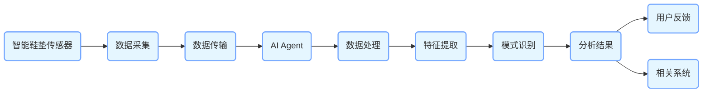

# AI Agent在智能鞋垫中的步态分析

> 关键词：AI Agent、智能鞋垫、步态分析、机器学习、传感器技术、健康监测、运动科学

> 摘要：本文聚焦于AI Agent在智能鞋垫步态分析中的应用。详细阐述了相关核心概念，包括AI Agent和智能鞋垫的工作原理及联系；深入探讨了核心算法原理，通过Python代码进行示例讲解；介绍了相关数学模型和公式；结合实际案例展示了在智能鞋垫中实现步态分析的具体开发过程和代码解读；探讨了其在健康监测、运动训练等实际应用场景；推荐了学习、开发所需的工具和资源；最后对未来发展趋势与挑战进行了总结，并解答常见问题。旨在为读者全面呈现AI Agent在智能鞋垫步态分析领域的技术全貌和应用前景。

## 1. 背景介绍 
### 1.1 目的和范围
随着科技的不断进步，智能穿戴设备在人们的生活中越来越普及。智能鞋垫作为一种新型的可穿戴设备，能够实时收集人体运动时的相关数据。而AI Agent（人工智能代理）具有强大的数据分析和决策能力。本文章的目的在于探讨如何将AI Agent应用于智能鞋垫的步态分析中，以实现更精准、高效的步态数据处理和分析。范围涵盖了从核心概念的介绍、算法原理的讲解、数学模型的分析，到实际项目开发案例以及应用场景的探讨等多个方面。

### 1.2 预期读者
本文预期读者包括对人工智能、智能穿戴设备、运动科学等领域感兴趣的技术爱好者、研究人员、开发人员。对于想要了解AI Agent在智能鞋垫步态分析中具体应用和实现方法的人员具有较高的参考价值。

### 1.3 文档结构概述
本文首先介绍背景信息，让读者了解研究的目的和范围。接着阐述核心概念与联系，使读者对AI Agent和智能鞋垫的相关原理有清晰的认识。然后详细讲解核心算法原理和具体操作步骤，通过Python代码示例进行说明。再介绍相关数学模型和公式，并举例解释。之后通过项目实战展示代码实现和详细解读。接着探讨实际应用场景。随后推荐学习和开发所需的工具和资源。最后总结未来发展趋势与挑战，解答常见问题，并提供扩展阅读和参考资料。

### 1.4 术语表
#### 1.4.1 核心术语定义
- **AI Agent（人工智能代理）**：是一种能够感知环境、进行推理和决策，并采取行动以实现特定目标的智能实体。在智能鞋垫的步态分析中，AI Agent可以对鞋垫收集的步态数据进行分析和处理。
- **智能鞋垫**：集成了多种传感器（如压力传感器、加速度传感器等）的鞋垫，能够实时收集人体运动时的相关数据，如压力分布、加速度变化等。
- **步态分析**：对人体行走或跑步时的运动模式进行分析和评估的过程，包括步长、步频、步态周期等参数的测量和分析。

#### 1.4.2 相关概念解释
- **传感器技术**：用于收集物理量信息的技术，智能鞋垫中使用的传感器能够将压力、加速度等物理量转换为电信号，以便后续处理。
- **机器学习**：人工智能的一个分支，通过对大量数据的学习和分析，让计算机自动发现数据中的模式和规律，从而实现预测和决策。在步态分析中，机器学习算法可以用于对步态数据进行分类和识别。

#### 1.4.3 缩略词列表
- **AI**：Artificial Intelligence（人工智能）
- **MEMS**：Micro-Electro-Mechanical Systems（微机电系统），常用于制造智能鞋垫中的传感器。

## 2. 核心概念与联系 
### 2.1 AI Agent原理
AI Agent通常由感知模块、决策模块和行动模块组成。感知模块负责收集环境信息，决策模块根据感知到的信息进行推理和决策，行动模块则根据决策结果采取相应的行动。在智能鞋垫的步态分析中，感知模块可以接收鞋垫传感器收集的步态数据，决策模块对这些数据进行分析和处理，行动模块可以将分析结果反馈给用户或相关系统。

### 2.2 智能鞋垫原理
智能鞋垫集成了多种传感器，如压力传感器、加速度传感器等。压力传感器可以测量脚底不同部位的压力分布，加速度传感器可以测量鞋垫在运动过程中的加速度变化。这些传感器将测量到的物理量转换为电信号，通过数据采集电路进行采集和处理，然后将数据传输到外部设备进行进一步分析。

### 2.3 两者联系
AI Agent与智能鞋垫的联系在于，智能鞋垫为AI Agent提供了丰富的步态数据，而AI Agent则利用这些数据进行深入的分析和处理。通过AI Agent的智能分析，可以从鞋垫收集的大量数据中提取有价值的信息，如步态特征、运动模式等，从而实现对用户步态的精准分析和评估。

### 2.4 文本示意图
AI Agent和智能鞋垫在步态分析中的联系可以用以下文本描述：智能鞋垫通过传感器收集步态数据，将数据传输给AI Agent。AI Agent对数据进行处理和分析，提取步态特征和运动模式，然后将分析结果反馈给用户或相关系统。

### 2.5 Mermaid流程图


## 3. 核心算法原理 & 具体操作步骤 
### 3.1 核心算法原理
在智能鞋垫的步态分析中，常用的算法包括机器学习算法（如决策树、支持向量机、神经网络等）和信号处理算法（如滤波、特征提取等）。下面以决策树算法为例进行详细讲解。

决策树是一种基于树结构进行决策的算法。它通过对数据的特征进行划分，将数据集划分为不同的子集，每个子集对应一个决策结果。在步态分析中，决策树可以根据鞋垫传感器收集的步态数据（如压力分布、加速度变化等），对用户的步态模式进行分类和识别。

### 3.2 具体操作步骤
1. **数据收集**：使用智能鞋垫的传感器收集用户的步态数据，包括压力数据、加速度数据等。
2. **数据预处理**：对收集到的数据进行预处理，包括滤波、归一化等操作，以去除噪声和干扰，提高数据的质量。
3. **特征提取**：从预处理后的数据中提取有用的特征，如步长、步频、步态周期等。
4. **数据集划分**：将提取的特征数据划分为训练集和测试集，训练集用于训练决策树模型，测试集用于评估模型的性能。
5. **模型训练**：使用训练集数据对决策树模型进行训练，通过不断调整模型的参数，使模型的性能达到最优。
6. **模型评估**：使用测试集数据对训练好的决策树模型进行评估，计算模型的准确率、召回率等指标，评估模型的性能。
7. **步态分析**：将新的步态数据输入到训练好的决策树模型中，模型根据数据的特征进行分类和识别，输出用户的步态模式。

### 3.3 Python源代码示例
```python
import numpy as np
from sklearn.tree import DecisionTreeClassifier
from sklearn.model_selection import train_test_split
from sklearn.metrics import accuracy_score

# 模拟收集的步态数据
# 假设每个样本有10个特征
X = np.random.rand(100, 10)
# 模拟步态模式标签，有3种不同的步态模式
y = np.random.randint(0, 3, 100)

# 数据集划分
X_train, X_test, y_train, y_test = train_test_split(X, y, test_size=0.2, random_state=42)

# 创建决策树模型
clf = DecisionTreeClassifier()

# 模型训练
clf.fit(X_train, y_train)

# 模型预测
y_pred = clf.predict(X_test)

# 模型评估
accuracy = accuracy_score(y_test, y_pred)
print(f"模型准确率: {accuracy}")
```

## 4. 数学模型和公式 & 详细讲解 & 举例说明 
### 4.1 信号处理数学模型
在智能鞋垫的步态分析中，信号处理是非常重要的环节。常用的信号处理方法包括滤波和特征提取。

#### 4.1.1 滤波
滤波的目的是去除信号中的噪声和干扰，常用的滤波方法包括均值滤波、中值滤波、低通滤波等。以均值滤波为例，其数学模型可以表示为：

$$y[n] = \frac{1}{N} \sum_{i=0}^{N-1} x[n + i]$$

其中，$x[n]$ 是原始信号，$y[n]$ 是滤波后的信号，$N$ 是滤波窗口的大小。

**举例说明**：假设原始信号为 $x = [1, 2, 3, 4, 5]$，滤波窗口大小 $N = 3$。则滤波后的信号 $y$ 计算如下：

- 当 $n = 0$ 时，$y[0] = \frac{1}{3} (1 + 2 + 3) = 2$
- 当 $n = 1$ 时，$y[1] = \frac{1}{3} (2 + 3 + 4) = 3$
- 当 $n = 2$ 时，$y[2] = \frac{1}{3} (3 + 4 + 5) = 4$

#### 4.1.2 特征提取
特征提取的目的是从信号中提取有用的特征，常用的特征包括均值、方差、峰值等。以均值特征为例，其数学模型可以表示为：

$$\bar{x} = \frac{1}{N} \sum_{i=0}^{N-1} x[i]$$

其中，$x[i]$ 是信号的第 $i$ 个样本，$N$ 是信号的长度。

**举例说明**：假设信号为 $x = [1, 2, 3, 4, 5]$，则其均值为：

$$\bar{x} = \frac{1}{5} (1 + 2 + 3 + 4 + 5) = 3$$

### 4.2 机器学习数学模型
在机器学习中，决策树算法的数学模型基于信息熵和信息增益。

#### 4.2.1 信息熵
信息熵是衡量数据不确定性的指标，其数学模型可以表示为：

$$H(X) = - \sum_{i=1}^{n} p(x_i) \log_2 p(x_i)$$

其中，$X$ 是数据集，$p(x_i)$ 是数据集中第 $i$ 类样本的概率。

#### 4.2.2 信息增益
信息增益是衡量特征对分类结果影响程度的指标，其数学模型可以表示为：

$$IG(X, A) = H(X) - \sum_{v \in Values(A)} \frac{|X_v|}{|X|} H(X_v)$$

其中，$X$ 是数据集，$A$ 是特征，$Values(A)$ 是特征 $A$ 的取值集合，$X_v$ 是特征 $A$ 取值为 $v$ 的样本子集。

**举例说明**：假设有一个数据集 $X$，包含 10 个样本，其中 6 个样本属于类别 1，4 个样本属于类别 2。则数据集 $X$ 的信息熵为：

$$H(X) = - \frac{6}{10} \log_2 \frac{6}{10} - \frac{4}{10} \log_2 \frac{4}{10} \approx 0.971$$

假设特征 $A$ 有两个取值 $v_1$ 和 $v_2$，$X_{v_1}$ 包含 4 个样本，其中 3 个属于类别 1，1 个属于类别 2；$X_{v_2}$ 包含 6 个样本，其中 3 个属于类别 1，3 个属于类别 2。则特征 $A$ 的信息增益为：

$$IG(X, A) = H(X) - \frac{4}{10} H(X_{v_1}) - \frac{6}{10} H(X_{v_2})$$

$$H(X_{v_1}) = - \frac{3}{4} \log_2 \frac{3}{4} - \frac{1}{4} \log_2 \frac{1}{4} \approx 0.811$$

$$H(X_{v_2}) = - \frac{3}{6} \log_2 \frac{3}{6} - \frac{3}{6} \log_2 \frac{3}{6} = 1$$

$$IG(X, A) = 0.971 - \frac{4}{10} \times 0.811 - \frac{6}{10} \times 1 \approx 0.13$$

## 5. 项目实战：代码实际案例和详细解释说明 
### 5.1  开发环境搭建
#### 5.1.1 硬件环境
- 智能鞋垫：选择集成了压力传感器和加速度传感器的智能鞋垫。
- 开发板：如 Arduino、Raspberry Pi 等，用于接收和处理鞋垫传感器的数据。
- 计算机：用于开发和运行代码。

#### 5.1.2 软件环境
- Python 环境：安装 Python 3.x 版本。
- 相关库：安装 numpy、pandas、scikit-learn 等库，用于数据处理和机器学习。

### 5.2  源代码详细实现和代码解读
```python
import numpy as np
import pandas as pd
from sklearn.tree import DecisionTreeClassifier
from sklearn.model_selection import train_test_split
from sklearn.metrics import accuracy_score

# 读取步态数据文件
data = pd.read_csv('gait_data.csv')

# 提取特征和标签
X = data.iloc[:, :-1].values
y = data.iloc[:, -1].values

# 数据集划分
X_train, X_test, y_train, y_test = train_test_split(X, y, test_size=0.2, random_state=42)

# 创建决策树模型
clf = DecisionTreeClassifier()

# 模型训练
clf.fit(X_train, y_train)

# 模型预测
y_pred = clf.predict(X_test)

# 模型评估
accuracy = accuracy_score(y_test, y_pred)
print(f"模型准确率: {accuracy}")

# 保存模型
import joblib
joblib.dump(clf, 'gait_model.pkl')
```

### 5.3  代码解读与分析
1. **数据读取**：使用 `pandas` 库的 `read_csv` 函数读取步态数据文件。
2. **特征和标签提取**：使用 `iloc` 方法提取数据集中的特征和标签。
3. **数据集划分**：使用 `train_test_split` 函数将数据集划分为训练集和测试集。
4. **模型创建**：使用 `DecisionTreeClassifier` 类创建决策树模型。
5. **模型训练**：使用 `fit` 方法对模型进行训练。
6. **模型预测**：使用 `predict` 方法对测试集进行预测。
7. **模型评估**：使用 `accuracy_score` 函数计算模型的准确率。
8. **模型保存**：使用 `joblib` 库的 `dump` 函数将训练好的模型保存到文件中。

## 6. 实际应用场景 
### 6.1 健康监测
智能鞋垫结合AI Agent的步态分析可以用于健康监测。通过对用户步态的长期监测和分析，可以及时发现用户步态的异常变化，如步态不稳、步幅减小等，这些变化可能是某些疾病的早期症状，如帕金森病、脑卒中等。医生可以根据步态分析结果，对患者进行早期诊断和治疗。

### 6.2 运动训练
在运动训练中，智能鞋垫的步态分析可以帮助运动员优化训练方案。通过分析运动员的步态特征，如步长、步频、着地方式等，可以发现运动员在运动过程中存在的问题，如姿势不正确、用力不均衡等。教练可以根据分析结果，为运动员制定个性化的训练方案，提高运动员的运动成绩，减少运动损伤的风险。

### 6.3 康复治疗
对于康复患者，智能鞋垫的步态分析可以用于评估康复效果。在康复治疗过程中，通过定期对患者的步态进行分析，可以了解患者的康复进展情况，如步态是否逐渐恢复正常、运动功能是否逐渐改善等。医生可以根据分析结果，调整康复治疗方案，提高康复治疗的效果。

## 7. 工具和资源推荐
### 7.1 学习资源推荐
#### 7.1.1 书籍推荐
- 《Python机器学习》：详细介绍了Python在机器学习中的应用，包括各种机器学习算法的原理和实现。
- 《传感器技术》：全面介绍了传感器的原理、分类和应用，对于理解智能鞋垫中的传感器技术有很大帮助。
- 《运动生物力学》：讲解了人体运动的力学原理，对于理解步态分析的原理和应用有重要的参考价值。

#### 7.1.2 在线课程
- Coursera上的“机器学习”课程：由斯坦福大学的Andrew Ng教授授课，是机器学习领域的经典课程。
- edX上的“人工智能基础”课程：介绍了人工智能的基本概念、算法和应用。
- Udemy上的“Python数据科学实战”课程：