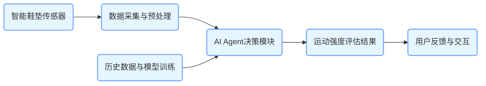

# AI Agent在智能鞋垫中的运动强度分析

> 关键词：AI Agent、智能鞋垫、运动强度分析、传感器数据、机器学习

> 摘要：本文深入探讨了AI Agent在智能鞋垫中进行运动强度分析的相关技术。首先介绍了研究的背景、目的、预期读者以及文档结构，对涉及的术语进行了清晰定义。接着阐述了核心概念及其联系，包括AI Agent和智能鞋垫的工作原理和架构，并通过Mermaid流程图进行直观展示。详细讲解了核心算法原理及具体操作步骤，用Python代码进行了实现。同时给出了数学模型和公式，并举例说明。通过项目实战，介绍了开发环境搭建、源代码实现和解读。分析了实际应用场景，推荐了相关的学习资源、开发工具框架以及论文著作。最后总结了未来发展趋势与挑战，并对常见问题进行了解答，为AI Agent在智能鞋垫运动强度分析领域的研究和应用提供了全面的参考。

## 1. 背景介绍 
### 1.1 目的和范围
本研究的目的是探索如何利用AI Agent技术对智能鞋垫采集的数据进行分析，以准确评估运动强度。随着人们对健康和运动的关注度不断提高，智能穿戴设备市场蓬勃发展，智能鞋垫作为其中的一种新兴产品，能够实时监测脚部的运动信息。然而，如何从这些大量的数据中提取有价值的信息，准确判断运动强度，是当前面临的一个重要问题。本文将重点研究AI Agent在智能鞋垫运动强度分析中的应用，包括核心算法、数学模型以及实际项目实现等方面。

### 1.2 预期读者
本文预期读者包括对人工智能、智能穿戴设备、运动健康监测等领域感兴趣的科研人员、工程师、开发者，以及相关专业的学生。对于希望深入了解AI Agent技术在智能鞋垫中应用的人士，本文将提供系统的知识和实践指导。

### 1.3 文档结构概述
本文将按照以下结构进行阐述：首先介绍相关背景知识，包括目的、读者和文档结构等；接着详细讲解核心概念，包括AI Agent和智能鞋垫的原理及联系；然后介绍核心算法原理和具体操作步骤，并用Python代码实现；之后给出数学模型和公式，并举例说明；通过项目实战展示代码的实际应用和解读；分析实际应用场景；推荐相关的学习资源、开发工具框架和论文著作；最后总结未来发展趋势与挑战，解答常见问题，并提供扩展阅读和参考资料。

### 1.4 术语表
#### 1.4.1 核心术语定义
- **AI Agent（人工智能代理）**：是一种能够感知环境、根据感知信息做出决策并执行相应动作的智能实体。在本文中，AI Agent用于对智能鞋垫采集的运动数据进行分析和处理。
- **智能鞋垫**：是一种集成了多种传感器（如加速度计、压力传感器等）的鞋垫，能够实时采集脚部的运动信息，如步数、运动轨迹、压力分布等。
- **运动强度**：指人体在运动过程中所承受的生理负荷程度，通常用心率、运动速度、运动时间等指标来衡量。在本文中，主要通过智能鞋垫采集的数据来间接评估运动强度。

#### 1.4.2 相关概念解释
- **传感器数据融合**：将多个传感器采集的数据进行综合处理，以获得更准确、更全面的信息。在智能鞋垫中，加速度计和压力传感器采集的数据可以通过数据融合技术进行处理，提高运动强度分析的准确性。
- **机器学习算法**：是一类让计算机自动从数据中学习模式和规律的算法。在本文中，将使用机器学习算法对智能鞋垫采集的数据进行训练和分析，以实现运动强度的准确评估。

#### 1.4.3 缩略词列表
- **IMU（Inertial Measurement Unit）**：惯性测量单元，通常包括加速度计和陀螺仪，用于测量物体的加速度和角速度。
- **ML（Machine Learning）**：机器学习，是人工智能的一个重要分支。

## 2. 核心概念与联系 
### 核心概念原理
#### AI Agent原理
AI Agent是一种基于感知 - 决策 - 行动循环的智能系统。它通过传感器感知环境信息，将这些信息输入到决策模块中，决策模块根据预设的规则或学习到的模型做出决策，最后通过执行器执行相应的动作。在智能鞋垫的运动强度分析中，AI Agent的传感器就是智能鞋垫上的各种传感器，用于采集运动数据；决策模块则使用机器学习算法对采集的数据进行分析和处理，判断运动强度；执行器可以是与智能鞋垫相连的手机应用程序，将分析结果反馈给用户。

#### 智能鞋垫原理
智能鞋垫主要由传感器、数据处理模块和通信模块组成。传感器用于采集脚部的运动信息，如加速度计可以测量脚部的加速度，压力传感器可以测量脚部的压力分布。数据处理模块对传感器采集的数据进行初步处理，如滤波、特征提取等。通信模块将处理后的数据传输到外部设备，如手机或电脑，以便进行进一步的分析和处理。

### 架构示意图


这个流程图展示了AI Agent在智能鞋垫运动强度分析中的整体架构。智能鞋垫传感器采集数据后，经过数据采集与预处理模块进行初步处理，然后将数据输入到AI Agent决策模块中。决策模块结合历史数据和训练好的模型对数据进行分析，得出运动强度评估结果。最后，评估结果通过用户反馈与交互模块反馈给用户。

## 3. 核心算法原理 & 具体操作步骤 
### 核心算法原理
在智能鞋垫的运动强度分析中，我们可以使用机器学习中的分类算法，如支持向量机（SVM）或决策树。以支持向量机为例，其基本原理是在特征空间中找到一个最优的超平面，将不同类别的数据分开。在运动强度分析中，我们将不同运动强度的数据作为不同的类别，通过训练支持向量机模型，使其能够根据智能鞋垫采集的数据准确判断运动强度。

### 具体操作步骤
#### 数据采集
使用智能鞋垫上的加速度计和压力传感器采集运动数据，采样频率可以设置为100Hz。采集的数据包括加速度的三个分量（x、y、z）和压力值。

#### 数据预处理
- **滤波**：使用低通滤波器去除数据中的高频噪声，如巴特沃斯滤波器。
- **特征提取**：从采集的数据中提取有用的特征，如加速度的均值、标准差、最大值、最小值等，以及压力的平均值、峰值等。

#### 模型训练
将预处理后的数据划分为训练集和测试集，使用训练集对支持向量机模型进行训练。训练过程中，需要调整模型的参数，如核函数、惩罚因子等，以获得最优的分类效果。

#### 运动强度评估
使用训练好的模型对新采集的数据进行预测，判断运动强度。

### Python代码实现
```python
import numpy as np
from sklearn.svm import SVC
from sklearn.model_selection import train_test_split
from sklearn.preprocessing import StandardScaler
from scipy.signal import butter, filtfilt

# 数据采集模拟
def generate_data():
    # 模拟采集1000个样本，每个样本有6个特征（加速度x、y、z，压力x、y、z）
    data = np.random.rand(1000, 6)
    # 模拟运动强度标签，分为3类
    labels = np.random.randint(0, 3, 1000)
    return data, labels

# 数据预处理 - 滤波
def butter_lowpass(cutoff, fs, order=5):
    nyq = 0.5 * fs
    normal_cutoff = cutoff / nyq
    b, a = butter(order, normal_cutoff, btype='low', analog=False)
    return b, a

def butter_lowpass_filter(data, cutoff, fs, order=5):
    b, a = butter_lowpass(cutoff, fs, order=order)
    y = filtfilt(b, a, data)
    return y

# 数据预处理 - 特征提取
def extract_features(data):
    # 计算每个特征的均值和标准差
    mean_features = np.mean(data, axis=0)
    std_features = np.std(data, axis=0)
    features = np.concatenate((mean_features, std_features))
    return features

# 主函数
def main():
    # 数据采集
    data, labels = generate_data()
    
    # 数据预处理 - 滤波
    fs = 100  # 采样频率
    cutoff = 10  # 截止频率
    filtered_data = butter_lowpass_filter(data, cutoff, fs)
    
    # 数据预处理 - 特征提取
    extracted_features = []
    for sample in filtered_data:
        features = extract_features(sample.reshape(1, -1))
        extracted_features.append(features)
    extracted_features = np.array(extracted_features)
    
    # 数据标准化
    scaler = StandardScaler()
    scaled_features = scaler.fit_transform(extracted_features)
    
    # 划分训练集和测试集
    X_train, X_test, y_train, y_test = train_test_split(scaled_features, labels, test_size=0.2, random_state=42)
    
    # 模型训练
    model = SVC(kernel='rbf', C=10)
    model.fit(X_train, y_train)
    
    # 模型评估
    accuracy = model.score(X_test, y_test)
    print(f"模型准确率: {accuracy}")

if __name__ == "__main__":
    main()
```

## 4. 数学模型和公式 & 详细讲解 & 举例说明 
### 支持向量机数学模型
支持向量机的目标是在特征空间中找到一个最优的超平面，使得不同类别的数据能够被最大程度地分开。对于线性可分的情况，超平面的方程可以表示为：

$$w^T x + b = 0$$

其中，$w$ 是超平面的法向量，$x$ 是输入数据，$b$ 是偏置项。对于一个样本 $(x_i, y_i)$，如果 $y_i = +1$，则 $w^T x_i + b \geq 1$；如果 $y_i = -1$，则 $w^T x_i + b \leq -1$。支持向量机的目标是最大化间隔 $\frac{2}{\|w\|}$，即最小化 $\frac{1}{2}\|w\|^2$，同时满足约束条件 $y_i(w^T x_i + b) \geq 1$，$i = 1, 2, \cdots, n$。

为了解决这个优化问题，我们可以使用拉格朗日乘子法，引入拉格朗日乘子 $\alpha_i \geq 0$，得到拉格朗日函数：

$$L(w, b, \alpha) = \frac{1}{2}\|w\|^2 - \sum_{i=1}^{n} \alpha_i (y_i(w^T x_i + b) - 1)$$

对 $w$ 和 $b$ 求偏导数并令其为0，得到：

$$\frac{\partial L}{\partial w} = w - \sum_{i=1}^{n} \alpha_i y_i x_i = 0$$

$$\frac{\partial L}{\partial b} = -\sum_{i=1}^{n} \alpha_i y_i = 0$$

将上述结果代入拉格朗日函数，得到对偶问题：

$$\max_{\alpha} \sum_{i=1}^{n} \alpha_i - \frac{1}{2} \sum_{i=1}^{n} \sum_{j=1}^{n} \alpha_i \alpha_j y_i y_j x_i^T x_j$$

$$\text{s.t.} \quad \sum_{i=1}^{n} \alpha_i y_i = 0, \quad \alpha_i \geq 0, \quad i = 1, 2, \cdots, n$$

### 举例说明
假设我们有两个二维数据点 $(1, 2)$ 和 $(3, 4)$，分别属于类别 $+1$ 和 $-1$。我们可以使用支持向量机来找到一个最优的超平面将这两个点分开。首先，我们将数据点表示为向量 $x_1 = [1, 2]^T$ 和 $x_2 = [3, 4]^T$，标签 $y_1 = +1$ 和 $y_2 = -1$。然后，我们可以根据上述对偶问题的公式来求解拉格朗日乘子 $\alpha_1$ 和 $\alpha_2$。最后，根据求解得到的 $\alpha$ 值计算 $w$ 和 $b$，从而得到超平面的方程。

## 5. 项目实战：代码实际案例和详细解释说明 
### 5.1  开发环境搭建
#### 硬件环境
- **智能鞋垫**：选择一款集成了加速度计和压力传感器的智能鞋垫，如[具体品牌型号]。
- **开发板**：可以使用Arduino或Raspberry Pi等开发板，用于采集和处理智能鞋垫的数据。
- **计算机**：用于运行开发环境和进行数据分析。

#### 软件环境
- **Python**：安装Python 3.7及以上版本。
- **开发库**：安装NumPy、SciPy、Scikit-learn等必要的Python库，可以使用pip命令进行安装：
```bash
pip install numpy scipy scikit-learn
```

### 5.2  源代码详细实现和代码解读
```python
import serial
import numpy as np
from sklearn.svm import SVC
from sklearn.preprocessing import StandardScaler
from scipy.signal import butter, filtfilt

# 串口通信设置
ser = serial.Serial('COM3', 9600)  # 根据实际情况修改串口号和波特率

# 数据预处理 - 滤波
def butter_lowpass(cutoff, fs, order=5):
    nyq = 0.5 * fs
    normal_cutoff = cutoff / nyq
    b, a = butter(order, normal_cutoff, btype='low', analog=False)
    return b, a

def butter_lowpass_filter(data, cutoff, fs, order=5):
    b, a = butter_lowpass(cutoff, fs, order=order)
    y = filtfilt(b, a, data)
    return y

# 数据预处理 - 特征提取
def extract_features(data):
    # 计算每个特征的均值和标准差
    mean_features = np.mean(data, axis=0)
    std_features = np.std(data, axis=0)
    features = np.concatenate((mean_features, std_features))
    return features

# 模型加载
model = SVC(kernel='rbf', C=10)
# 这里假设已经有训练好的模型数据
# 实际应用中需要使用训练好的模型进行预测
# model.fit(X_train, y_train)

# 数据标准化
scaler = StandardScaler()

# 主循环
while True:
    try:
        # 读取串口数据
        line = ser.readline().decode('utf-8').strip()
        data = np.array([float(x) for x in line.split(',')]).reshape(1, -1)
        
        # 数据预处理 - 滤波
        fs = 100  # 采样频率
        cutoff = 10  # 截止频率
        filtered_data = butter_lowpass_filter(data, cutoff, fs)
        
        # 数据预处理 - 特征提取
        features = extract_features(filtered_data)
        scaled_features = scaler.transform(features.reshape(1, -1))
        
        # 运动强度预测
        prediction = model.predict(scaled_features)
        print(f"运动强度预测结果: {prediction[0]}")
    except (ValueError, IndexError):
        continue
    except KeyboardInterrupt:
        ser.close()
        break
```

### 5.3  代码解读与分析
- **串口通信**：使用`serial.Serial`函数打开串口，读取智能鞋垫发送的数据。
- **数据预处理**：包括滤波和特征提取两个步骤。滤波使用巴特沃斯低通滤波器去除高频噪声，特征提取计算数据的均值和标准差。
- **模型加载**：使用`SVC`类加载支持向量机模型，实际应用中需要使用训练好的模型进行预测。
- **数据标准化**：使用`StandardScaler`类对特征进行标准化处理，提高模型的预测准确率。
- **主循环**：不断读取串口数据，进行预处理和特征提取，然后使用模型进行运动强度预测，并将结果打印输出。

## 6. 实际应用场景 
### 运动健康监测
智能鞋垫结合AI Agent的运动强度分析技术可以用于个人运动健康监测。用户在运动过程中，智能鞋垫实时采集运动数据，AI Agent对数据进行分析，评估运动强度。通过手机应用程序，用户可以了解自己的运动强度是否适中，避免过度运动或运动不足，从而更好地制定运动计划，提高运动效果和健康水平。

### 运动训练辅助
在专业的运动训练中，教练可以使用智能鞋垫和AI Agent技术对运动员的运动强度进行实时监测和分析。根据运动员的运动强度数据，教练可以及时调整训练计划，合理安排训练强度和时间，提高训练效果，减少运动损伤的风险。

### 康复治疗监测
对于康复患者，智能鞋垫可以帮助医生和康复师监测患者的运动强度。在康复治疗过程中，患者需要进行适当的运动训练，以促进身体的恢复。通过智能鞋垫采集的数据，医生可以准确了解患者的运动强度，及时调整康复方案，确保康复治疗的有效性和安全性。

## 7. 工具和资源推荐
### 7.1 学习资源推荐
#### 7.1.1 书籍推荐
- 《Python机器学习》：详细介绍了Python在机器学习中的应用，包括各种机器学习算法的原理和实现。
- 《人工智能：一种现代的方法》：是人工智能领域的经典教材，全面介绍了人工智能的各个方面，包括AI Agent的原理和应用。
- 《传感器技术与应用》：介绍了各种传感器的原理、特点和应用，对于理解智能鞋垫中的传感器技术有很大帮助。

#### 7.1.2 在线课程
- Coursera上的“机器学习”课程：由斯坦福大学的Andrew Ng教授授课，是机器学习领域的经典课程。
- edX上的“人工智能基础”课程：介绍了人工智能的基本概念、算法和应用。
- 中国大学MOOC上的“传感器原理与应用”课程：系统介绍了传感器的原理和应用，适合初学者学习。

#### 7.1.3 技术博客和网站
- Medium：有很多关于人工智能、机器学习和智能穿戴设备的技术文章和博客。
- GitHub：可以找到很多与智能鞋垫和运动强度分析相关的开源项目和代码。
- 知乎：有很多关于人工智能和智能穿戴设备的讨论和分享，可以从中获取很多有用的信息。

### 7.2 开发工具框架推荐
#### 7.2.1 IDE和编辑器
- PyCharm：是一款专业的Python集成开发环境，具有强大的代码编辑、调试和分析功能。
- Jupyter Notebook：是一个交互式的开发环境，适合进行数据分析和模型训练。
- Visual Studio Code：是一款轻量级的代码编辑器，支持多种编程语言和插件，使用方便。

#### 7.2.2 调试和性能分析工具
- Py-Spy：是一个用于Python代码性能分析的工具，可以帮助开发者找出代码中的性能瓶颈。
- PDB：是Python自带的调试工具，可以帮助开发者调试代码，查找错误。
- TensorBoard：是TensorFlow的可视化工具，可以用于可视化模型训练过程和结果。

#### 7.2.3 相关框架和库
- NumPy：是Python中用于科学计算的基础库，提供了高效的数组操作和数学函数。
- SciPy：是Python中用于科学计算和工程计算的库，提供了各种数值计算和优化算法。
- Scikit-learn：是Python中用于机器学习的库，提供了各种机器学习算法的实现和工具。

### 7.3 相关论文著作推荐
#### 7.3.1 经典论文
- “Support-Vector Networks”：是支持向量机领域的经典论文，详细介绍了支持向量机的原理和算法。
- “A New Approach to Linear Filtering and Prediction Problems”：是卡尔曼滤波领域的经典论文，对于传感器数据融合有重要的参考价值。

#### 7.3.2 最新研究成果
- 在IEEE Transactions on Biomedical Engineering、ACM Transactions on Sensor Networks等期刊上可以找到关于智能鞋垫和运动强度分析的最新研究成果。

#### 7.3.3 应用案例分析
- 可以在ACM SIGKDD、IEEE ICML等会议的论文集中找到关于智能鞋垫在运动健康监测、运动训练辅助等领域的应用案例分析。

## 8. 总结：未来发展趋势与挑战
### 未来发展趋势
- **多传感器融合**：未来的智能鞋垫可能会集成更多类型的传感器，如心率传感器、温度传感器等，通过多传感器融合技术，获取更全面、更准确的运动信息，提高运动强度分析的准确性和可靠性。
- **深度学习应用**：深度学习在图像识别、语音识别等领域取得了巨大的成功，未来可以将深度学习技术应用于智能鞋垫的运动强度分析中，通过构建更复杂的神经网络模型，提高运动强度分析的精度和智能水平。
- **个性化服务**：根据用户的个人信息、运动习惯和健康状况，为用户提供个性化的运动强度分析和建议，实现更加精准的运动健康管理。

### 挑战
- **数据隐私和安全**：智能鞋垫采集的运动数据包含了用户的个人隐私信息，如何保证数据的隐私和安全是一个重要的挑战。需要采用加密技术、访问控制等手段，确保数据不被泄露和滥用。
- **算法复杂度和计算资源**：随着传感器数量的增加和数据量的增大，运动强度分析算法的复杂度也会相应增加，对计算资源的要求也会提高。如何在有限的计算资源下实现高效的算法是一个需要解决的问题。
- **标准和规范**：目前智能鞋垫市场缺乏统一的标准和规范，不同品牌和型号的智能鞋垫采集的数据格式和精度可能存在差异，这给运动强度分析的准确性和可比性带来了挑战。需要制定统一的标准和规范，促进智能鞋垫市场的健康发展。

## 9. 附录：常见问题与解答
### 问题1：智能鞋垫采集的数据准确吗？
答：智能鞋垫采集的数据准确性受到多种因素的影响，如传感器的精度、安装位置、运动环境等。一般来说，优质的智能鞋垫采用高精度的传感器，并经过严格的校准和测试，可以提供较为准确的运动数据。但是，在实际使用中，仍然可能存在一定的误差。为了提高数据的准确性，可以定期对智能鞋垫进行校准，选择合适的安装位置，并在稳定的运动环境中使用。

### 问题2：AI Agent在运动强度分析中的准确率如何？
答：AI Agent在运动强度分析中的准确率取决于多个因素，如训练数据的质量和数量、选择的算法、特征提取的方法等。一般来说，通过合理选择算法和特征提取方法，并使用大量的高质量训练数据进行训练，可以获得较高的准确率。但是，由于运动强度的评估是一个复杂的问题，受到多种因素的影响，因此很难达到100%的准确率。

### 问题3：如何选择适合的智能鞋垫？
答：选择适合的智能鞋垫可以从以下几个方面考虑：
- **功能需求**：根据自己的需求选择具备相应功能的智能鞋垫，如是否需要心率监测、运动轨迹记录等。
- **传感器精度**：选择采用高精度传感器的智能鞋垫，以保证采集的数据准确可靠。
- **舒适度**：智能鞋垫的舒适度直接影响使用体验，选择材质柔软、透气性好的智能鞋垫。
- **品牌和口碑**：选择知名品牌和口碑好的智能鞋垫，质量和售后服务更有保障。

## 10. 扩展阅读 & 参考资料
### 扩展阅读
- 《智能穿戴设备设计与开发》
- 《人工智能算法与应用》
- 《运动生理学》

### 参考资料
- [具体智能鞋垫产品说明书]
- [相关机器学习算法文档]
- [IEEE相关会议论文集]

作者：AI天才研究院/AI Genius Institute & 禅与计算机程序设计艺术 /Zen And The Art of Computer Programming