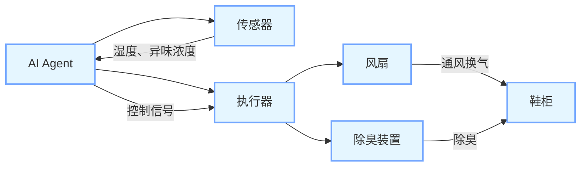

# AI Agent在智能鞋柜中的除臭除湿控制

> 关键词：AI Agent、智能鞋柜、除臭除湿控制、传感器、智能决策

> 摘要：本文深入探讨了AI Agent在智能鞋柜除臭除湿控制中的应用。首先介绍了研究的背景、目的、预期读者等内容。接着详细阐述了AI Agent、智能鞋柜除臭除湿等核心概念及其联系，并给出了相应的原理和架构示意图与流程图。然后讲解了核心算法原理，使用Python代码进行详细说明，同时给出了相关的数学模型和公式并举例。通过项目实战，展示了开发环境搭建、源代码实现及解读。还探讨了实际应用场景，推荐了学习资源、开发工具框架以及相关论文著作。最后总结了未来发展趋势与挑战，提供了常见问题解答和扩展阅读参考资料，旨在为AI Agent在智能鞋柜除臭除湿控制领域的应用提供全面的技术指导。

## 1. 背景介绍 
### 1.1 目的和范围
随着人们生活品质的提高，对家居用品的智能化需求也日益增长。智能鞋柜作为智能家居的一部分，不仅要具备基本的收纳功能，还需要解决鞋子产生的异味和潮湿问题。本研究的目的是将AI Agent技术应用于智能鞋柜的除臭除湿控制中，实现更智能、高效、精准的控制。范围涵盖了AI Agent的原理、智能鞋柜除臭除湿的控制策略、相关算法的实现以及实际项目的开发与应用。

### 1.2 预期读者
本文预期读者包括智能家居领域的开发者、研究人员，对AI Agent技术和智能鞋柜感兴趣的技术爱好者，以及相关专业的学生等。希望通过本文，读者能够深入了解AI Agent在智能鞋柜除臭除湿控制中的应用原理和实现方法，并从中获得启发，用于自己的研究和开发工作。

### 1.3 文档结构概述
本文将按照以下结构进行阐述：首先介绍核心概念与联系，包括AI Agent、智能鞋柜除臭除湿等概念的原理和架构；接着讲解核心算法原理及具体操作步骤，使用Python代码进行详细说明；然后给出相关的数学模型和公式，并举例说明；通过项目实战展示开发环境搭建、源代码实现及解读；探讨实际应用场景；推荐学习资源、开发工具框架以及相关论文著作；最后总结未来发展趋势与挑战，提供常见问题解答和扩展阅读参考资料。

### 1.4 术语表
#### 1.4.1 核心术语定义
- **AI Agent**：人工智能代理，是一种能够感知环境、进行决策并采取行动以实现特定目标的软件实体。在智能鞋柜中，AI Agent可以根据鞋柜内的环境信息（如湿度、异味浓度等）做出除臭除湿的决策。
- **智能鞋柜**：具备智能化功能的鞋柜，能够自动感知鞋柜内的环境状态，并通过相应的设备进行除臭、除湿等操作。
- **除臭除湿控制**：通过一定的技术手段，对鞋柜内的异味和湿度进行调节，使其保持在适宜的范围内。

#### 1.4.2 相关概念解释
- **传感器**：用于感知鞋柜内的环境信息，如湿度传感器可以测量鞋柜内的湿度，异味传感器可以检测异味浓度。
- **执行器**：根据AI Agent的决策执行相应的操作，如风扇用于除湿，除臭装置用于去除异味。

#### 1.4.3 缩略词列表
- **AI**：Artificial Intelligence，人工智能
- **PID**：Proportional - Integral - Derivative，比例 - 积分 - 微分，一种常用的控制算法

## 2. 核心概念与联系 
### 核心概念原理
#### AI Agent原理
AI Agent是一个具有自主性、反应性、社会性和主动性的实体。它通过传感器感知环境信息，然后根据内置的知识库和决策算法进行推理和决策，最后通过执行器对环境进行干预。在智能鞋柜中，AI Agent的工作流程如下：
1. **感知**：通过湿度传感器和异味传感器获取鞋柜内的湿度和异味浓度信息。
2. **决策**：根据感知到的信息，结合预设的规则或机器学习模型，判断是否需要进行除臭除湿操作，以及确定操作的强度。
3. **行动**：如果需要进行除臭除湿操作，AI Agent会向风扇、除臭装置等执行器发送控制信号，启动相应的设备。

#### 智能鞋柜除臭除湿原理
智能鞋柜的除臭除湿主要通过物理和化学方法实现。物理方法如通风换气，通过风扇将鞋柜内的潮湿空气排出，引入新鲜空气，降低湿度；化学方法如使用活性炭、光触媒等除臭剂，吸附或分解异味分子。

### 架构示意图

该示意图展示了AI Agent在智能鞋柜除臭除湿控制中的架构。AI Agent通过传感器获取鞋柜内的环境信息，然后根据这些信息做出决策，向执行器发送控制信号，执行器控制风扇和除臭装置对鞋柜进行除臭除湿操作。

## 3. 核心算法原理 & 具体操作步骤 
### 核心算法原理
在智能鞋柜的除臭除湿控制中，我们可以使用PID控制算法。PID控制算法是一种经典的反馈控制算法，通过比例（P）、积分（I）和微分（D）三个环节对系统进行控制，使系统的输出能够快速、稳定地跟踪设定值。

PID控制算法的公式为：
$$u(t) = K_p e(t) + K_i \int_{0}^{t} e(\tau) d\tau + K_d \frac{de(t)}{dt}$$
其中，$u(t)$ 是控制器的输出，$e(t)$ 是设定值与实际值的误差，$K_p$ 是比例系数，$K_i$ 是积分系数，$K_d$ 是微分系数。

### 具体操作步骤
1. **设定目标值**：根据用户的需求，设定鞋柜内的湿度和异味浓度的目标值。
2. **获取实际值**：通过湿度传感器和异味传感器获取鞋柜内的实际湿度和异味浓度。
3. **计算误差**：将目标值与实际值相减，得到误差值。
4. **计算PID输出**：根据PID控制算法的公式，计算控制器的输出。
5. **控制执行器**：根据PID输出，控制风扇和除臭装置的运行状态和强度。

### Python源代码实现
```python
class PIDController:
    def __init__(self, Kp, Ki, Kd):
        self.Kp = Kp
        self.Ki = Ki
        self.Kd = Kd
        self.prev_error = 0
        self.integral = 0

    def update(self, setpoint, current_value):
        error = setpoint - current_value
        self.integral += error
        derivative = error - self.prev_error
        output = self.Kp * error + self.Ki * self.integral + self.Kd * derivative
        self.prev_error = error
        return output

# 示例使用
if __name__ == "__main__":
    # 初始化PID控制器
    pid = PIDController(Kp=0.5, Ki=0.1, Kd=0.2)
    # 设定目标湿度
    setpoint_humidity = 40
    # 模拟当前湿度
    current_humidity = 60
    # 计算PID输出
    output = pid.update(setpoint_humidity, current_humidity)
    print(f"PID输出: {output}")
```
在上述代码中，我们定义了一个 `PIDController` 类，用于实现PID控制算法。`__init__` 方法用于初始化PID控制器的参数，`update` 方法用于根据设定值和当前值计算PID输出。最后，我们进行了一个简单的示例，设定了目标湿度和当前湿度，计算并输出了PID控制器的输出。

## 4. 数学模型和公式 & 详细讲解 & 举例说明 
### 数学模型和公式
#### PID控制算法公式
$$u(t) = K_p e(t) + K_i \int_{0}^{t} e(\tau) d\tau + K_d \frac{de(t)}{dt}$$
其中：
- $u(t)$：控制器的输出，用于控制执行器的运行状态和强度。
- $K_p$：比例系数，用于放大误差信号，使系统能够快速响应误差的变化。
- $e(t)$：设定值与实际值的误差，即 $e(t) = r(t) - y(t)$，其中 $r(t)$ 是设定值，$y(t)$ 是实际值。
- $K_i$：积分系数，用于消除系统的稳态误差，通过对误差的积分来累积误差信息。
- $\int_{0}^{t} e(\tau) d\tau$：误差的积分，表示误差在时间上的累积。
- $K_d$：微分系数，用于预测误差的变化趋势，通过对误差的微分来提前调整控制器的输出。
- $\frac{de(t)}{dt}$：误差的微分，表示误差的变化率。

### 详细讲解
- **比例环节（P）**：比例环节的作用是根据误差的大小直接调整控制器的输出。当误差较大时，比例环节会输出较大的控制信号，使系统快速响应误差的变化；当误差较小时，比例环节的输出也会相应减小。但是，比例环节只能减小误差，不能完全消除误差，可能会导致系统出现稳态误差。
- **积分环节（I）**：积分环节的作用是消除系统的稳态误差。通过对误差的积分，积分环节会不断累积误差信息，当误差存在时，积分项会不断增大，从而使控制器的输出也不断增大，直到误差被消除。但是，积分环节可能会导致系统的响应速度变慢，甚至出现积分饱和现象。
- **微分环节（D）**：微分环节的作用是预测误差的变化趋势，提前调整控制器的输出。当误差的变化率较大时，微分环节会输出较大的控制信号，使系统能够快速响应误差的变化；当误差的变化率较小时，微分环节的输出也会相应减小。微分环节可以提高系统的稳定性和响应速度，但对噪声比较敏感。

### 举例说明
假设我们要控制智能鞋柜内的湿度，设定目标湿度为 $40\%$，当前湿度为 $60\%$，误差 $e(t) = 40 - 60 = -20$。设定 $K_p = 0.5$，$K_i = 0.1$，$K_d = 0.2$，初始积分值为 $0$，上一次的误差为 $0$。

- **比例项**：$K_p e(t) = 0.5 \times (-20) = -10$
- **积分项**：$K_i \int_{0}^{t} e(\tau) d\tau = 0.1 \times (-20) = -2$
- **微分项**：$K_d \frac{de(t)}{dt} = 0.2 \times (-20 - 0) = -4$

PID输出 $u(t) = -10 - 2 - 4 = -16$。这个输出可以用于控制风扇的转速，使鞋柜内的湿度逐渐降低到目标值。

## 5. 项目实战：代码实际案例和详细解释说明 
### 5.1  开发环境搭建
#### 硬件环境
- **开发板**：选择一款适合的开发板，如树莓派（Raspberry Pi），它具有丰富的接口和强大的计算能力。
- **传感器**：湿度传感器（如DHT11）用于测量鞋柜内的湿度，异味传感器（如MQ - 135）用于检测异味浓度。
- **执行器**：风扇用于通风换气，除臭装置（如活性炭滤网、紫外线灯等）用于去除异味。

#### 软件环境
- **操作系统**：在开发板上安装Raspbian操作系统，它是基于Debian的Linux发行版，非常适合树莓派。
- **编程语言**：使用Python进行开发，Python具有简洁易读的语法和丰富的库，适合快速开发。
- **开发工具**：使用Thonny或PyCharm等开发工具进行代码编写和调试。

### 5.2  源代码详细实现和代码解读
```python
import RPi.GPIO as GPIO
import time
import Adafruit_DHT

# 定义引脚
DHT_PIN = 4
FAN_PIN = 17
DEODORIZER_PIN = 27

# 初始化GPIO
GPIO.setmode(GPIO.BCM)
GPIO.setup(FAN_PIN, GPIO.OUT)
GPIO.setup(DEODORIZER_PIN, GPIO.OUT)

# 初始化PID控制器
class PIDController:
    def __init__(self, Kp, Ki, Kd):
        self.Kp = Kp
        self.Ki = Ki
        self.Kd = Kd
        self.prev_error = 0
        self.integral = 0

    def update(self, setpoint, current_value):
        error = setpoint - current_value
        self.integral += error
        derivative = error - self.prev_error
        output = self.Kp * error + self.Ki * self.integral + self.Kd * derivative
        self.prev_error = error
        return output

# 主程序
if __name__ == "__main__":
    try:
        # 设定目标湿度
        setpoint_humidity = 40
        # 初始化PID控制器
        pid = PIDController(Kp=0.5, Ki=0.1, Kd=0.2)
        while True:
            # 读取湿度数据
            humidity, temperature = Adafruit_DHT.read_retry(Adafruit_DHT.DHT11, DHT_PIN)
            if humidity is not None:
                # 计算PID输出
                output = pid.update(setpoint_humidity, humidity)
                # 根据PID输出控制风扇和除臭装置
                if output > 0:
                    GPIO.output(FAN_PIN, GPIO.HIGH)
                    GPIO.output(DEODORIZER_PIN, GPIO.HIGH)
                else:
                    GPIO.output(FAN_PIN, GPIO.LOW)
                    GPIO.output(DEODORIZER_PIN, GPIO.LOW)
            time.sleep(1)
    except KeyboardInterrupt:
        print("程序终止")
    finally:
        GPIO.cleanup()
```
### 代码解读与分析
1. **引脚定义和GPIO初始化**：定义了湿度传感器、风扇和除臭装置的引脚，并使用 `RPi.GPIO` 库对GPIO进行初始化。
2. **PID控制器类**：定义了一个 `PIDController` 类，用于实现PID控制算法。该类包含 `__init__` 方法和 `update` 方法，分别用于初始化PID控制器的参数和计算PID输出。
3. **主程序**：在主程序中，首先设定了目标湿度，初始化了PID控制器。然后进入一个无限循环，不断读取湿度数据，计算PID输出，并根据PID输出控制风扇和除臭装置的运行状态。如果用户按下 `Ctrl + C`，程序将终止，并清理GPIO资源。

## 6. 实际应用场景 
### 家庭场景
在家庭中，智能鞋柜可以放置在玄关等位置，为家庭成员的鞋子提供除臭除湿功能。通过AI Agent的智能控制，鞋柜可以根据不同季节、不同天气条件自动调整除臭除湿的强度，保持鞋柜内的空气清新和干燥，延长鞋子的使用寿命。

### 商业场景
在商业场所，如健身房、游泳馆等，人们会在这些地方更换鞋子，鞋子容易产生异味和潮湿。智能鞋柜可以安装在这些场所的更衣室，为顾客提供舒适的使用体验。同时，通过AI Agent的数据分析功能，商家可以了解顾客的使用习惯和需求，优化鞋柜的管理和维护。

### 公共场景
在公共建筑，如学校、图书馆等，智能鞋柜可以放置在入口处，为师生和读者提供方便。通过AI Agent的远程监控和管理功能，管理员可以实时了解鞋柜的运行状态，及时进行维护和管理。

## 7. 工具和资源推荐
### 7.1 学习资源推荐
#### 7.1.1 书籍推荐
- 《人工智能：一种现代的方法》：这本书是人工智能领域的经典教材，涵盖了AI Agent、机器学习、知识表示等多个方面的内容，适合初学者和专业人士阅读。
- 《Python数据分析实战》：介绍了Python在数据分析领域的应用，包括数据处理、可视化等内容，对于理解和实现智能鞋柜中的数据分析功能有很大帮助。

#### 7.1.2 在线课程
- Coursera上的“人工智能基础”课程：由知名教授授课，系统地介绍了人工智能的基本概念和方法。
- 中国大学MOOC上的“Python编程基础”课程：适合初学者快速掌握Python编程。

#### 7.1.3 技术博客和网站
- Medium：上面有很多关于人工智能和智能家居的技术文章，作者来自世界各地，内容丰富多样。
- 开源中国：提供了大量的开源项目和技术文章，对于学习和实践有很大的帮助。

### 7.2 开发工具框架推荐
#### 7.2.1 IDE和编辑器
- PyCharm：一款专业的Python集成开发环境，具有代码自动补全、调试等功能，适合大型项目的开发。
- Thonny：一款简单易用的Python编辑器，适合初学者使用。

#### 7.2.2 调试和性能分析工具
- pdb：Python自带的调试工具，可以帮助开发者快速定位和解决代码中的问题。
- cProfile：用于分析Python代码的性能，找出代码中的瓶颈。

#### 7.2.3 相关框架和库
- Adafruit_DHT：用于读取DHT系列湿度传感器的数据。
- RPi.GPIO：用于控制树莓派的GPIO引脚。

### 7.3 相关论文著作推荐
#### 7.3.1 经典论文
- “Artificial Intelligence: A Modern Approach”：这本书的同名论文，系统地介绍了人工智能的理论和方法。
- “PID Control Theory and Applications”：详细介绍了PID控制算法的原理和应用。

#### 7.3.2 最新研究成果
- 关注IEEE、ACM等学术会议和期刊上的最新研究成果，了解AI Agent在智能家居领域的最新应用和发展趋势。

#### 7.3.3 应用案例分析
- 一些知名企业的智能家居产品白皮书，如小米、华为等，里面包含了很多实际应用案例和技术细节。

## 8. 总结：未来发展趋势与挑战
### 未来发展趋势
- **智能化程度不断提高**：随着人工智能技术的不断发展，AI Agent在智能鞋柜中的应用将更加智能化。例如，AI Agent可以通过学习用户的使用习惯和偏好，自动调整除臭除湿的策略，提供个性化的服务。
- **与其他智能家居设备的联动**：智能鞋柜将与其他智能家居设备，如智能门锁、智能灯光等进行联动，实现更便捷的家居控制。例如，当用户打开家门时，智能鞋柜可以自动开启除臭除湿功能。
- **数据分析和预测功能增强**：AI Agent可以对鞋柜内的环境数据进行分析和预测，提前发现潜在的问题，并及时采取措施。例如，预测鞋子的使用寿命，提醒用户更换鞋子。

### 挑战
- **数据安全和隐私问题**：智能鞋柜中收集的用户数据，如使用习惯、鞋子信息等，涉及到用户的隐私。如何保障数据的安全和隐私是一个重要的挑战。
- **算法的优化和适应性**：不同的环境条件和用户需求对除臭除湿控制算法的性能提出了更高的要求。需要不断优化算法，提高算法的适应性和准确性。
- **硬件成本和可靠性**：智能鞋柜中的传感器、执行器等硬件设备的成本和可靠性是影响产品推广的重要因素。需要降低硬件成本，提高硬件的可靠性和稳定性。

## 9. 附录：常见问题与解答
### 问题1：智能鞋柜的除臭除湿效果如何？
答：智能鞋柜的除臭除湿效果取决于多个因素，如传感器的精度、执行器的性能、控制算法的合理性等。通过使用高精度的传感器和优化的控制算法，智能鞋柜可以有效地降低鞋柜内的湿度和异味浓度，保持鞋柜内的空气清新和干燥。

### 问题2：如何设置智能鞋柜的目标湿度和异味浓度？
答：可以通过智能鞋柜的控制面板或手机APP进行设置。不同的产品可能有不同的设置方法，具体可以参考产品的使用说明书。

### 问题3：智能鞋柜的能耗高吗？
答：智能鞋柜的能耗主要取决于风扇、除臭装置等执行器的功率和运行时间。通过使用节能型的执行器和优化的控制算法，可以降低智能鞋柜的能耗。

### 问题4：智能鞋柜出现故障怎么办？
答：如果智能鞋柜出现故障，可以先检查电源、传感器和执行器的连接是否正常。如果问题仍然存在，可以联系产品的售后服务人员进行维修。

## 10. 扩展阅读 & 参考资料
### 扩展阅读
- 《智能家居系统设计与实现》：深入介绍了智能家居系统的设计原理和实现方法，对于进一步了解智能鞋柜在智能家居中的应用有很大帮助。
- 《传感器技术基础》：详细介绍了各种传感器的工作原理和应用，对于理解智能鞋柜中传感器的作用有重要意义。

### 参考资料
- 相关产品的官方文档和使用说明书。
- 国内外学术期刊和会议上发表的相关论文。

作者：AI天才研究院/AI Genius Institute & 禅与计算机程序设计艺术 /Zen And The Art of Computer Programming