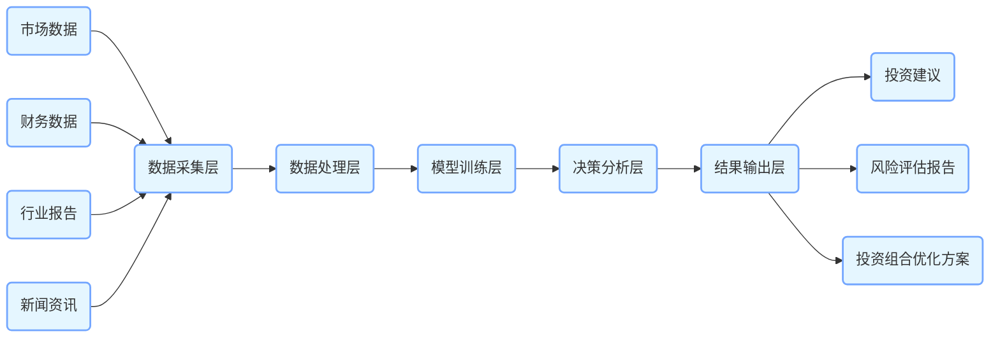

# AI Agent在智能风险投资分析中的应用

> 关键词：AI Agent、智能风险投资分析、投资决策、数据处理、算法模型

> 摘要：本文聚焦于AI Agent在智能风险投资分析中的应用。首先介绍了相关背景，包括目的、预期读者等内容。接着阐述了AI Agent及智能风险投资分析的核心概念与联系，并给出相应的原理和架构示意图。详细讲解了核心算法原理，通过Python代码进行示例。探讨了相关的数学模型和公式，并举例说明。通过项目实战展示了代码实际案例及详细解释。分析了AI Agent在智能风险投资分析中的实际应用场景。推荐了相关的工具和资源，包括学习资源、开发工具框架以及论文著作等。最后总结了未来发展趋势与挑战，解答了常见问题并提供了扩展阅读和参考资料，旨在为相关领域的研究者和从业者提供全面深入的技术知识和实践指导。

## 1. 背景介绍 
### 1.1 目的和范围
随着金融市场的不断发展和复杂化，风险投资领域面临着越来越多的挑战和机遇。传统的风险投资分析方法往往依赖于人工经验和有限的数据，难以满足快速、准确决策的需求。AI Agent作为一种智能化的技术手段，能够处理大量的数据、进行复杂的分析和推理，为风险投资分析带来了新的思路和方法。

本文的目的是深入探讨AI Agent在智能风险投资分析中的应用，包括其核心概念、算法原理、实际案例以及未来发展趋势等方面。范围涵盖了从基础理论到实际应用的各个环节，旨在为风险投资从业者、技术开发者以及相关研究人员提供全面的参考。

### 1.2 预期读者
本文预期读者包括但不限于以下几类人群：
- 风险投资行业从业者，如投资经理、分析师等，希望了解AI Agent如何提升风险投资分析的效率和准确性。
- 计算机科学和人工智能领域的技术开发者，对将AI Agent应用于金融领域感兴趣，寻求相关的技术实现和实践经验。
- 金融科技研究人员，关注金融领域的新技术应用和发展趋势，希望深入研究AI Agent在风险投资分析中的理论和实践。
- 高校相关专业的学生，如金融、计算机等专业，希望通过本文了解跨学科领域的知识和应用。

### 1.3 文档结构概述
本文的文档结构如下：
- 核心概念与联系：介绍AI Agent和智能风险投资分析的核心概念，以及它们之间的联系，并给出相应的原理和架构示意图。
- 核心算法原理 & 具体操作步骤：详细讲解AI Agent在风险投资分析中使用的核心算法原理，并通过Python代码进行示例。
- 数学模型和公式 & 详细讲解 & 举例说明：阐述相关的数学模型和公式，并结合实际例子进行详细讲解。
- 项目实战：代码实际案例和详细解释说明：通过一个实际的项目案例，展示AI Agent在风险投资分析中的具体应用，包括开发环境搭建、源代码实现和代码解读。
- 实际应用场景：分析AI Agent在智能风险投资分析中的实际应用场景，如项目筛选、风险评估、投资组合优化等。
- 工具和资源推荐：推荐相关的学习资源、开发工具框架以及论文著作等，帮助读者进一步深入学习和研究。
- 总结：未来发展趋势与挑战：总结AI Agent在智能风险投资分析中的应用现状，分析未来的发展趋势和面临的挑战。
- 附录：常见问题与解答：解答读者在阅读过程中可能遇到的常见问题。
- 扩展阅读 & 参考资料：提供相关的扩展阅读材料和参考资料，方便读者进一步深入研究。

### 1.4 术语表
#### 1.4.1 核心术语定义
- **AI Agent（人工智能代理）**：是一种能够感知环境、进行决策并采取行动以实现特定目标的智能实体。在风险投资分析中，AI Agent可以自动收集、处理和分析各种数据，为投资决策提供支持。
- **智能风险投资分析**：利用人工智能技术，对风险投资项目进行全面、深入的分析，包括项目的市场前景、技术可行性、团队能力、财务状况等方面，以评估项目的投资价值和风险。
- **投资组合优化**：根据投资者的风险偏好和投资目标，通过合理配置资产，构建最优的投资组合，以实现收益最大化和风险最小化。

#### 1.4.2 相关概念解释
- **机器学习**：是人工智能的一个重要分支，通过让计算机从数据中学习模式和规律，从而实现预测和决策。在风险投资分析中，机器学习算法可以用于预测项目的成功率、评估风险等。
- **自然语言处理**：是研究如何让计算机理解和处理人类语言的技术。在风险投资分析中，自然语言处理可以用于分析新闻报道、行业研究报告等文本信息，提取有价值的信息。
- **深度学习**：是机器学习的一种特殊形式，通过构建多层神经网络，自动学习数据中的复杂特征和模式。在风险投资分析中，深度学习可以用于处理图像、视频等非结构化数据，提高分析的准确性。

#### 1.4.3 缩略词列表
- **AI**：Artificial Intelligence，人工智能
- **ML**：Machine Learning，机器学习
- **NLP**：Natural Language Processing，自然语言处理
- **DL**：Deep Learning，深度学习

## 2. 核心概念与联系 
### 核心概念原理
#### AI Agent原理
AI Agent的基本原理是基于感知、决策和行动的循环过程。它通过传感器感知环境中的信息，然后根据内部的知识和算法进行决策，最后通过执行器采取相应的行动。在智能风险投资分析中，AI Agent的传感器可以是各种数据采集工具，如网络爬虫、数据库接口等，用于收集与投资项目相关的各种数据，包括市场数据、财务数据、行业报告等。决策过程则是利用机器学习、深度学习等算法对收集到的数据进行分析和处理，评估项目的投资价值和风险。执行器可以是向投资者提供投资建议、生成投资报告等。

#### 智能风险投资分析原理
智能风险投资分析的核心原理是综合考虑多个因素，对投资项目进行全面评估。这些因素包括项目的市场前景、技术创新性、团队能力、财务状况等。通过对这些因素的量化分析和建模，可以计算出项目的投资价值和风险指数。例如，通过分析市场规模、增长率等数据，可以评估项目的市场前景；通过分析技术专利、研发投入等数据，可以评估项目的技术创新性。

### 架构示意图
以下是AI Agent在智能风险投资分析中的架构示意图：



该架构主要包括以下几个层次：
- **数据采集层**：负责收集与投资项目相关的各种数据，包括市场数据、财务数据、行业报告、新闻资讯等。
- **数据处理层**：对采集到的数据进行清洗、预处理和特征提取，将原始数据转换为适合模型训练的格式。
- **模型训练层**：利用机器学习、深度学习等算法对处理后的数据进行训练，构建投资价值评估模型和风险评估模型。
- **决策分析层**：根据训练好的模型，对新的投资项目进行分析和评估，做出投资决策。
- **结果输出层**：将决策分析的结果以投资建议、风险评估报告、投资组合优化方案等形式输出给投资者。

### 核心概念联系
AI Agent与智能风险投资分析密切相关。AI Agent作为一种智能化的工具，可以为智能风险投资分析提供强大的支持。具体表现在以下几个方面：
- **数据处理能力**：AI Agent可以自动收集、处理和分析大量的数据，大大提高了风险投资分析的效率和准确性。例如，通过网络爬虫技术，AI Agent可以快速收集全球范围内的市场数据和行业信息；通过自然语言处理技术，AI Agent可以对新闻报道和行业研究报告进行自动分析，提取有价值的信息。
- **模型构建和优化**：AI Agent可以利用机器学习和深度学习算法，构建和优化投资价值评估模型和风险评估模型。通过不断学习和更新模型，AI Agent可以适应市场的变化，提高投资决策的准确性。
- **决策支持**：AI Agent可以根据模型分析的结果，为投资者提供投资建议和决策支持。例如，AI Agent可以根据项目的投资价值和风险指数，推荐适合的投资项目；可以根据投资者的风险偏好和投资目标，优化投资组合。

## 3. 核心算法原理 & 具体操作步骤 
### 核心算法原理
在智能风险投资分析中，常用的核心算法包括机器学习算法和深度学习算法。以下是几种常见算法的原理介绍：

#### 逻辑回归算法
逻辑回归是一种常用的分类算法，用于预测事件发生的概率。在风险投资分析中，逻辑回归可以用于预测投资项目的成功率。其基本原理是通过构建一个逻辑函数，将输入特征与输出概率之间建立联系。逻辑函数的表达式为：

$$P(y=1|x)=\frac{1}{1 + e^{-(w_0 + w_1x_1 + w_2x_2 + \cdots + w_nx_n)}}$$

其中，$P(y=1|x)$ 表示在输入特征 $x=(x_1,x_2,\cdots,x_n)$ 的条件下，事件 $y=1$ 发生的概率；$w_0,w_1,\cdots,w_n$ 是模型的参数。

#### 决策树算法
决策树是一种基于树结构进行决策的算法。在风险投资分析中，决策树可以用于对投资项目进行分类和评估。其基本原理是通过对特征空间进行划分，构建一棵决策树。每个内部节点表示一个特征上的测试，每个分支表示一个测试输出，每个叶节点表示一个类别或值。决策树的构建过程是一个递归的过程，通过选择最优的特征进行划分，直到满足停止条件。

#### 神经网络算法
神经网络是一种模仿人类神经系统的计算模型，由大量的神经元组成。在风险投资分析中，神经网络可以用于处理复杂的非线性关系，提高投资价值评估的准确性。其基本原理是通过多层神经元的连接和信息传递，实现对输入数据的特征提取和模式识别。神经网络的训练过程是通过反向传播算法，不断调整神经元之间的连接权重，使得网络的输出与期望输出之间的误差最小化。

### 具体操作步骤及Python代码示例
以下是使用Python实现逻辑回归算法进行投资项目成功率预测的具体步骤和代码示例：

#### 步骤1：数据准备
首先，需要准备投资项目的数据集，包括特征数据和标签数据。特征数据可以是项目的市场前景、技术创新性、团队能力等方面的指标，标签数据表示项目是否成功。

```python
import pandas as pd
from sklearn.model_selection import train_test_split
from sklearn.linear_model import LogisticRegression
from sklearn.metrics import accuracy_score

# 读取数据集
data = pd.read_csv('investment_data.csv')

# 分离特征和标签
X = data.drop('success', axis=1)
y = data['success']

# 划分训练集和测试集
X_train, X_test, y_train, y_test = train_test_split(X, y, test_size=0.2, random_state=42)
```

#### 步骤2：模型训练
使用逻辑回归算法对训练集进行训练。

```python
# 创建逻辑回归模型
model = LogisticRegression()

# 训练模型
model.fit(X_train, y_train)
```

#### 步骤3：模型预测
使用训练好的模型对测试集进行预测。

```python
# 预测测试集
y_pred = model.predict(X_test)
```

#### 步骤4：模型评估
使用准确率等指标对模型的性能进行评估。

```python
# 计算准确率
accuracy = accuracy_score(y_test, y_pred)
print(f"模型准确率: {accuracy}")
```

## 4. 数学模型和公式 & 详细讲解 & 举例说明 
### 逻辑回归模型
#### 数学公式
逻辑回归模型的核心公式是逻辑函数，如前面所述：

$$P(y=1|x)=\frac{1}{1 + e^{-(w_0 + w_1x_1 + w_2x_2 + \cdots + w_nx_n)}}$$

其中，$w_0,w_1,\cdots,w_n$ 是模型的参数，需要通过训练数据进行估计。

#### 详细讲解
逻辑回归模型的目标是找到一组最优的参数 $w=(w_0,w_1,\cdots,w_n)$，使得模型对训练数据的拟合效果最好。通常使用最大似然估计方法来估计参数。最大似然估计的基本思想是找到一组参数，使得在这组参数下，训练数据出现的概率最大。

对于逻辑回归模型，似然函数可以表示为：

$$L(w)=\prod_{i=1}^{m}[P(y^{(i)}=1|x^{(i)})]^{y^{(i)}}[1 - P(y^{(i)}=1|x^{(i)})]^{1 - y^{(i)}}$$

其中，$m$ 是训练数据的样本数量，$x^{(i)}$ 和 $y^{(i)}$ 分别是第 $i$ 个样本的特征和标签。

为了方便计算，通常对似然函数取对数，得到对数似然函数：

$$\ln L(w)=\sum_{i=1}^{m}[y^{(i)}\ln P(y^{(i)}=1|x^{(i)})+(1 - y^{(i)})\ln(1 - P(y^{(i)}=1|x^{(i)}))]$$

通过最大化对数似然函数，可以得到最优的参数 $w$。通常使用梯度下降等优化算法来求解。

#### 举例说明
假设我们有一个简单的投资项目数据集，包含两个特征：市场规模（$x_1$）和增长率（$x_2$），标签表示项目是否成功（$y$）。我们可以使用逻辑回归模型来预测项目的成功率。

假设经过训练得到的模型参数为 $w_0=-1$，$w_1=0.5$，$w_2=0.3$。对于一个新的项目，其市场规模为 100，增长率为 0.2，则该项目成功的概率为：

$$P(y=1|x)=\frac{1}{1 + e^{-(-1 + 0.5\times100 + 0.3\times0.2)}}$$

```python
import numpy as np

w0 = -1
w1 = 0.5
w2 = 0.3
x1 = 100
x2 = 0.2

z = w0 + w1 * x1 + w2 * x2
probability = 1 / (1 + np.exp(-z))
print(f"项目成功的概率: {probability}")
```

### 决策树模型
#### 数学公式
决策树模型的核心是信息增益或基尼指数等指标，用于选择最优的特征进行划分。

信息增益的计算公式为：

$$IG(D,A)=H(D)-H(D|A)$$

其中，$IG(D,A)$ 表示在数据集 $D$ 上使用特征 $A$ 进行划分所获得的信息增益；$H(D)$ 表示数据集 $D$ 的熵，计算公式为：

$$H(D)=-\sum_{k=1}^{K}p_k\log_2p_k$$

其中，$K$ 是数据集 $D$ 中类别的数量，$p_k$ 是第 $k$ 个类别的样本占总样本的比例。

$H(D|A)$ 表示在特征 $A$ 给定的条件下，数据集 $D$ 的条件熵，计算公式为：

$$H(D|A)=\sum_{v\in Values(A)}\frac{|D^v|}{|D|}H(D^v)$$

其中，$Values(A)$ 是特征 $A$ 的取值集合，$D^v$ 是数据集 $D$ 中特征 $A$ 取值为 $v$ 的样本子集。

#### 详细讲解
决策树的构建过程是一个递归的过程，通过选择信息增益最大的特征进行划分，直到满足停止条件。停止条件可以是节点中的样本数量小于某个阈值、所有样本属于同一类别等。

在每个节点上，计算所有特征的信息增益，选择信息增益最大的特征作为划分特征。然后根据该特征的取值将数据集划分为多个子集，对每个子集递归地构建决策树。

#### 举例说明
假设我们有一个投资项目数据集，包含三个特征：市场前景（好、中、差）、技术创新性（高、中、低）和团队能力（强、中、弱），标签表示项目是否成功（是、否）。

首先计算数据集的熵 $H(D)$：

假设数据集中共有 10 个样本，其中成功的样本有 6 个，失败的样本有 4 个，则：

$$p_1=\frac{6}{10}=0.6$$
$$p_2=\frac{4}{10}=0.4$$

$$H(D)=-0.6\log_20.6 - 0.4\log_20.4\approx0.971$$

然后计算每个特征的信息增益，选择信息增益最大的特征进行划分。例如，计算市场前景特征的信息增益：

假设市场前景为好的样本有 4 个，其中成功的有 3 个，失败的有 1 个；市场前景为中的样本有 3 个，其中成功的有 2 个，失败的有 1 个；市场前景为差的样本有 3 个，其中成功的有 1 个，失败的有 2 个。

计算条件熵 $H(D|市场前景)$：

$$H(D^{好})=- \frac{3}{4}\log_2\frac{3}{4}-\frac{1}{4}\log_2\frac{1}{4}\approx0.811$$
$$H(D^{中})=- \frac{2}{3}\log_2\frac{2}{3}-\frac{1}{3}\log_2\frac{1}{3}\approx0.918$$
$$H(D^{差})=- \frac{1}{3}\log_2\frac{1}{3}-\frac{2}{3}\log_2\frac{2}{3}\approx0.918$$

$$H(D|市场前景)=\frac{4}{10}H(D^{好})+\frac{3}{10}H(D^{中})+\frac{3}{10}H(D^{差})\approx0.873$$

信息增益 $IG(D,市场前景)=H(D)-H(D|市场前景)\approx0.971 - 0.873 = 0.098$

同理，可以计算其他特征的信息增益，选择信息增益最大的特征进行划分。

## 5. 项目实战：代码实际案例和详细解释说明 
### 5.1  开发环境搭建
#### 安装Python
首先需要安装Python，建议使用Python 3.7及以上版本。可以从Python官方网站（https://www.python.org/downloads/）下载适合自己操作系统的安装包，按照安装向导进行安装。

#### 安装必要的库
在智能风险投资分析项目中，需要使用一些常用的Python库，如Pandas、Numpy、Scikit-learn等。可以使用pip命令进行安装：

```sh
pip install pandas numpy scikit-learn
```

### 5.2  源代码详细实现和代码解读
以下是一个完整的项目实战代码示例，使用逻辑回归算法对投资项目进行成功率预测：

```python
import pandas as pd
from sklearn.model_selection import train_test_split
from sklearn.linear_model import LogisticRegression
from sklearn.metrics import accuracy_score

# 步骤1：数据准备
# 读取数据集
data = pd.read_csv('investment_data.csv')

# 分离特征和标签
X = data.drop('success', axis=1)
y = data['success']

# 划分训练集和测试集
X_train, X_test, y_train, y_test = train_test_split(X, y, test_size=0.2, random_state=42)

# 步骤2：模型训练
# 创建逻辑回归模型
model = LogisticRegression()

# 训练模型
model.fit(X_train, y_train)

# 步骤3：模型预测
# 预测测试集
y_pred = model.predict(X_test)

# 步骤4：模型评估
# 计算准确率
accuracy = accuracy_score(y_test, y_pred)
print(f"模型准确率: {accuracy}")
```

#### 代码解读
- **数据准备部分**：
  - 使用 `pandas` 库的 `read_csv` 函数读取投资项目数据集。
  - 使用 `drop` 方法分离特征和标签，将 `success` 列作为标签，其余列作为特征。
  - 使用 `train_test_split` 函数将数据集划分为训练集和测试集，测试集占总数据集的 20%。

- **模型训练部分**：
  - 创建 `LogisticRegression` 类的实例，即逻辑回归模型。
  - 使用 `fit` 方法对训练集进行训练，学习特征和标签之间的关系。

- **模型预测部分**：
  - 使用训练好的模型对测试集进行预测，得到预测结果 `y_pred`。

- **模型评估部分**：
  - 使用 `accuracy_score` 函数计算模型的准确率，即预测正确的样本数占总样本数的比例。

### 5.3  代码解读与分析
#### 优点
- **简单易用**：逻辑回归算法是一种简单易懂的分类算法，实现起来相对容易。
- **计算效率高**：逻辑回归模型的训练和预测速度较快，适合处理大规模数据集。
- **可解释性强**：逻辑回归模型的参数具有明确的含义，可以解释每个特征对预测结果的影响。

#### 缺点
- **线性假设**：逻辑回归模型假设特征和标签之间存在线性关系，对于复杂的非线性关系可能无法很好地拟合。
- **对异常值敏感**：逻辑回归模型对异常值比较敏感，可能会影响模型的性能。

#### 改进建议
- **特征工程**：可以通过对特征进行预处理、提取和选择，提高模型的性能。例如，对特征进行标准化、归一化处理，去除异常值等。
- **模型融合**：可以将逻辑回归模型与其他模型进行融合，如决策树、神经网络等，提高预测的准确性。

## 6. 实际应用场景 
### 项目筛选
在风险投资领域，每天都会有大量的投资项目涌现。AI Agent可以通过对项目的各种信息进行分析，快速筛选出具有潜力的项目。例如，AI Agent可以分析项目的市场前景、技术创新性、团队能力等方面的信息，根据预设的规则和模型，对项目进行评分和排序，为投资者提供项目筛选的建议。

### 风险评估
风险评估是风险投资分析的重要环节。AI Agent可以利用机器学习和深度学习算法，对投资项目的风险进行量化评估。例如，通过分析项目的财务数据、市场数据、行业竞争情况等信息，预测项目可能面临的风险，如市场风险、技术风险、管理风险等，并给出相应的风险指数和应对建议。

### 投资组合优化
投资者通常会将资金分散投资于多个项目，以降低风险。AI Agent可以根据投资者的风险偏好和投资目标，利用优化算法对投资组合进行优化。例如，通过分析不同项目的预期收益和风险，计算出最优的投资比例，使得投资组合在风险可控的前提下实现收益最大化。

### 市场趋势预测
AI Agent可以通过对市场数据、新闻资讯、社交媒体等信息的分析，预测市场的发展趋势。例如，通过分析行业报告、宏观经济数据等信息，预测某个行业的增长率、市场规模等指标；通过分析新闻报道、社交媒体上的舆情信息，预测市场的情绪和热点。投资者可以根据这些预测结果，调整投资策略，把握市场机会。

## 7. 工具和资源推荐
### 7.1 学习资源推荐
#### 7.1.1 书籍推荐
- 《机器学习》（周志华）：这本书是机器学习领域的经典教材，全面介绍了机器学习的基本概念、算法和应用。书中包含了丰富的案例和代码示例，适合初学者和有一定基础的读者阅读。
- 《深度学习》（Ian Goodfellow、Yoshua Bengio、Aaron Courville）：这本书是深度学习领域的权威著作，详细介绍了深度学习的基本原理、模型和算法。书中包含了大量的数学推导和实际应用案例，适合有一定数学基础和编程能力的读者阅读。
- 《Python机器学习实战》（Sebastian Raschka）：这本书结合Python编程语言，介绍了机器学习的各种算法和应用。书中包含了丰富的代码示例和实际案例，适合想要通过实践学习机器学习的读者阅读。

#### 7.1.2 在线课程
- Coursera上的《机器学习》课程（Andrew Ng）：这是一门非常经典的机器学习课程，由斯坦福大学的Andrew Ng教授主讲。课程内容涵盖了机器学习的基本概念、算法和应用，通过大量的案例和编程作业，帮助学生掌握机器学习的实际应用技能。
- edX上的《深度学习》课程（MIT）：这是一门由麻省理工学院开设的深度学习课程，介绍了深度学习的基本原理、模型和算法。课程内容深入详细，适合有一定机器学习基础的读者学习。
- 中国大学MOOC上的《人工智能基础》课程：这门课程是国内多所高校联合开设的人工智能基础课程，介绍了人工智能的基本概念、技术和应用。课程内容通俗易懂，适合初学者学习。

#### 7.1.3 技术博客和网站
- Medium：这是一个技术博客平台，上面有很多关于人工智能、机器学习、风险投资等领域的优秀文章。读者可以通过关注相关的作者和主题，获取最新的技术动态和研究成果。
- Towards Data Science：这是一个专注于数据科学和机器学习的博客网站，上面有很多高质量的技术文章和教程。读者可以通过阅读这些文章，学习到最新的技术和方法。
- Kaggle：这是一个数据科学竞赛平台，上面有很多关于机器学习、深度学习等领域的竞赛和数据集。读者可以通过参加竞赛和分析数据集，提高自己的实践能力和技术水平。

### 7.2 开发工具框架推荐
#### 7.2.1 IDE和编辑器
- PyCharm：这是一款专门为Python开发设计的集成开发环境（IDE），具有代码编辑、调试、自动完成等功能。PyCharm提供了丰富的插件和工具，方便开发者进行项目管理和开发。
- Jupyter Notebook：这是一个交互式的开发环境，适合进行数据探索、模型训练和可视化等工作。Jupyter Notebook支持多种编程语言，如Python、R等，通过Markdown和代码块的组合，方便开发者记录和分享自己的工作过程。
- Visual Studio Code：这是一款轻量级的代码编辑器，支持多种编程语言和插件。Visual Studio Code具有丰富的扩展功能，如代码调试、版本控制等，适合开发者进行快速开发和调试。

#### 7.2.2 调试和性能分析工具
- PDB：这是Python自带的调试工具，可以在代码中设置断点，逐步执行代码，查看变量的值和程序的执行流程。PDB对于调试Python代码非常有用。
- TensorBoard：这是TensorFlow提供的可视化工具，可以用于查看模型的训练过程、损失函数的变化、模型的结构等信息。TensorBoard对于分析深度学习模型的性能和调试非常有帮助。
- Scikit-learn的交叉验证和网格搜索功能：Scikit-learn是一个常用的机器学习库，提供了交叉验证和网格搜索等功能。通过交叉验证可以评估模型的性能，通过网格搜索可以寻找最优的模型参数。

#### 7.2.3 相关框架和库
- Scikit-learn：这是一个常用的机器学习库，提供了丰富的机器学习算法和工具，如分类、回归、聚类等算法，以及数据预处理、模型评估等工具。Scikit-learn的接口简单易用，适合初学者和快速开发。
- TensorFlow：这是一个开源的深度学习框架，由Google开发。TensorFlow提供了丰富的深度学习模型和工具，如神经网络、卷积神经网络、循环神经网络等，支持GPU加速和分布式训练。
- PyTorch：这是一个开源的深度学习框架，由Facebook开发。PyTorch具有动态图的特点，易于使用和调试，适合研究人员和开发者进行深度学习模型的开发和实验。

### 7.3 相关论文著作推荐
#### 7.3.1 经典论文
- 《A Logical Calculus of the Ideas Immanent in Nervous Activity》（Warren S. McCulloch、Walter Pitts）：这篇论文是神经网络领域的经典论文，提出了人工神经元的数学模型，为神经网络的发展奠定了基础。
- 《Gradient-Based Learning Applied to Document Recognition》（Yann LeCun、Léon Bottou、Yoshua Bengio、Patrick Haffner）：这篇论文介绍了卷积神经网络（CNN）在手写数字识别中的应用，是CNN领域的经典论文之一。
- 《Long Short-Term Memory》（Sepp Hochreiter、Jürgen Schmidhuber）：这篇论文提出了长短期记忆网络（LSTM），解决了传统循环神经网络（RNN）在处理长序列时的梯度消失问题，是RNN领域的重要突破。

#### 7.3.2 最新研究成果
- 《Attention Is All You Need》（Ashish Vaswani、Noam Shazeer、Niki Parmar等）：这篇论文提出了Transformer模型，是自然语言处理领域的重要突破。Transformer模型通过注意力机制，能够更好地处理长序列数据，在机器翻译、文本生成等任务中取得了很好的效果。
- 《Generative Adversarial Networks》（Ian Goodfellow、Jean Pouget-Abadie、Mehdi Mirza等）：这篇论文提出了生成对抗网络（GAN），是深度学习领域的重要成果之一。GAN通过生成器和判别器的对抗训练，能够生成逼真的图像、文本等数据。
- 《BERT: Pre-training of Deep Bidirectional Transformers for Language Understanding》（Jacob Devlin、Ming-Wei Chang、Kenton Lee等）：这篇论文提出了BERT模型，是自然语言处理领域的重要进展。BERT模型通过预训练和微调的方式，在多个自然语言处理任务中取得了很好的效果。

#### 7.3.3 应用案例分析
- 《AI in Finance: The New Opportunity》（Antoine Savine）：这本书介绍了人工智能在金融领域的应用，包括风险投资、量化交易、信贷评估等方面。书中通过实际案例分析，展示了人工智能如何改变金融行业的格局。
- 《Machine Learning for Algorithmic Trading》（Stefan Jansen）：这本书介绍了机器学习在算法交易中的应用，包括股票交易、期货交易等方面。书中通过实际案例和代码示例，展示了如何使用机器学习算法进行交易策略的开发和优化。

## 8. 总结：未来发展趋势与挑战
### 未来发展趋势
#### 智能化程度不断提高
随着人工智能技术的不断发展，AI Agent在智能风险投资分析中的智能化程度将不断提高。未来的AI Agent将能够更加准确地理解和处理自然语言，自动识别和分析复杂的投资项目信息，提供更加个性化的投资建议和决策支持。

#### 多模态数据融合
未来的AI Agent将不仅仅依赖于结构化数据，还将能够处理图像、视频、音频等多模态数据。通过多模态数据融合，AI Agent可以获取更全面、更准确的投资项目信息，提高风险投资分析的准确性和可靠性。

#### 与区块链技术结合
区块链技术具有去中心化、不可篡改、安全可靠等特点，与AI Agent在智能风险投资分析中的应用相结合，可以提高数据的安全性和可信度。例如，通过区块链技术可以实现投资项目信息的共享和追溯，防止数据造假和信息泄露。

#### 自动化投资决策
未来的AI Agent将能够实现自动化投资决策，根据预设的规则和模型，自动完成投资项目的筛选、评估和投资组合的优化等过程。投资者只需要设置投资目标和风险偏好，AI Agent就可以自动进行投资决策，提高投资效率和准确性。

### 挑战
#### 数据质量和隐私问题
AI Agent在智能风险投资分析中需要大量的数据支持，数据的质量和隐私问题是一个重要的挑战。一方面，数据可能存在噪声、缺失值等问题，影响模型的训练和预测效果；另一方面，投资项目的信息往往涉及到商业机密和个人隐私，如何保护数据的隐私和安全是一个亟待解决的问题。

#### 模型可解释性问题
虽然机器学习和深度学习算法在风险投资分析中取得了很好的效果，但这些模型往往是黑盒模型，缺乏可解释性。投资者很难理解模型的决策过程和依据，这在一定程度上限制了AI Agent在风险投资分析中的应用。如何提高模型的可解释性，是未来需要解决的一个重要问题。

#### 法律法规和监管问题
随着AI Agent在智能风险投资分析中的应用越来越广泛，相关的法律法规和监管问题也日益突出。例如，如何规范AI Agent的开发和使用，如何保障投资者的权益，如何防范金融风险等。需要建立健全相关的法律法规和监管体系，确保AI Agent在风险投资分析中的合法、合规应用。

## 9. 附录：常见问题与解答
### 问题1：AI Agent在智能风险投资分析中的应用是否会取代人类投资者？
解答：不会。虽然AI Agent可以处理大量的数据、进行复杂的分析和推理，为投资决策提供支持，但它仍然无法完全取代人类投资者。人类投资者具有丰富的经验、判断力和创造力，能够考虑到一些无法量化的因素，如市场情绪、人际关系等。AI Agent和人类投资者可以相互补充，共同提高风险投资分析的效率和准确性。

### 问题2：如何评估AI Agent在智能风险投资分析中的性能？
解答：可以从以下几个方面评估AI Agent的性能：
- **准确性**：通过比较AI Agent的预测结果与实际情况，计算准确率、召回率、F1值等指标，评估其预测的准确性。
- **稳定性**：观察AI Agent在不同数据集和不同环境下的性能表现，评估其稳定性。
- **可解释性**：评估AI Agent的决策过程和依据是否可解释，能否为投资者提供合理的解释和建议。
- **效率**：评估AI Agent的处理速度和计算资源消耗，确保其能够在合理的时间内完成分析任务。

### 问题3：AI Agent在智能风险投资分析中面临的最大挑战是什么？
解答：AI Agent在智能风险投资分析中面临的最大挑战之一是数据质量和隐私问题。数据的质量直接影响模型的训练和预测效果，而投资项目的信息往往涉及到商业机密和个人隐私，如何保护数据的隐私和安全是一个亟待解决的问题。此外，模型的可解释性问题和法律法规和监管问题也是AI Agent面临的重要挑战。

## 10. 扩展阅读 & 参考资料
### 扩展阅读
- 《金融科技前沿：人工智能在金融领域的应用》
- 《智能投资：AI时代的投资新思维》
- 《机器学习实战：基于Scikit-learn、Keras和TensorFlow》

### 参考资料
- 《Python数据分析实战》（作者：刘顺祥）
- 《深度学习入门：基于Python的理论与实现》（作者：斋藤康毅）
- 《机器学习算法原理与编程实践》（作者：郑捷）

作者：AI天才研究院/AI Genius Institute & 禅与计算机程序设计艺术 /Zen And The Art of Computer Programming