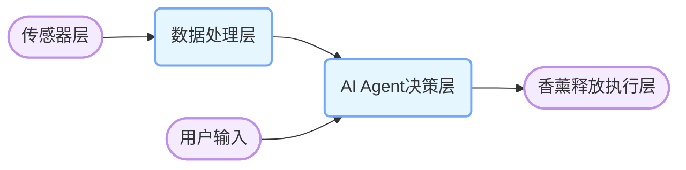

# AI Agent在智能香薰系统中的工作效率提升

> 关键词：AI Agent、智能香薰系统、工作效率提升、传感器融合、自动化控制

> 摘要：本文聚焦于AI Agent在智能香薰系统中的应用，旨在探讨如何通过AI Agent提升智能香薰系统的工作效率。首先介绍了智能香薰系统的背景和AI Agent的基本概念，阐述了两者结合的目的和预期读者。接着详细剖析了AI Agent与智能香薰系统的核心概念及联系，包括系统架构和工作流程。通过Python代码详细讲解了核心算法原理和具体操作步骤，同时给出了相关的数学模型和公式。在项目实战部分，提供了开发环境搭建、源代码实现和解读。还探讨了实际应用场景，推荐了学习资源、开发工具框架和相关论文著作。最后总结了未来发展趋势与挑战，并给出常见问题解答和扩展阅读参考资料。

## 1. 背景介绍 
### 1.1 目的和范围
智能香薰系统近年来在市场上越来越受欢迎，它能够为用户提供舒适的香气环境，改善室内空气质量，缓解压力等。然而，传统的智能香薰系统往往缺乏智能性和自主性，无法根据环境变化和用户需求进行实时、精准的调节。AI Agent作为一种具有自主决策和学习能力的智能实体，能够感知环境信息，做出决策并采取行动。本文章的目的就是研究如何将AI Agent应用于智能香薰系统，提升其工作效率，使其能够更加智能、高效地运行。范围涵盖了AI Agent的基本原理、与智能香薰系统的结合方式、核心算法、实际应用案例以及相关的工具和资源。

### 1.2 预期读者
本文预期读者包括智能香薰系统的开发者、AI领域的研究人员、对智能家居感兴趣的技术爱好者以及相关行业的从业者。对于开发者来说，本文可以提供技术实现的思路和方法；对于研究人员，可作为进一步研究的参考；对于技术爱好者，能帮助他们了解智能香薰系统背后的技术原理；对于行业从业者，有助于把握行业发展趋势。

### 1.3 文档结构概述
本文将按照以下结构进行阐述：首先介绍背景知识，包括目的、预期读者和文档结构；接着深入探讨AI Agent和智能香薰系统的核心概念及联系；然后详细讲解核心算法原理和具体操作步骤，并给出相关的数学模型和公式；通过项目实战展示代码实现和解读；探讨实际应用场景；推荐学习资源、开发工具框架和相关论文著作；最后总结未来发展趋势与挑战，提供常见问题解答和扩展阅读参考资料。

### 1.4 术语表
#### 1.4.1 核心术语定义
- **AI Agent**：是一种能够感知环境、做出决策并采取行动以实现特定目标的智能实体。它可以根据预先设定的规则或通过学习来适应环境变化。
- **智能香薰系统**：是一种能够自动调节香薰释放量和香气种类的系统，通常由传感器、控制器和香薰释放装置组成。
- **工作效率**：在智能香薰系统中，工作效率指的是系统能够准确、及时地根据环境变化和用户需求调节香薰释放，同时降低能耗和资源浪费的能力。

#### 1.4.2 相关概念解释
- **传感器融合**：将多种传感器的数据进行整合和处理，以获得更准确、全面的环境信息。在智能香薰系统中，可能会使用温度传感器、湿度传感器、空气质量传感器等，通过传感器融合可以更好地了解室内环境状况。
- **自动化控制**：利用AI Agent的决策能力，实现智能香薰系统的自动调节。例如，根据环境信息自动调整香薰的释放量和释放时间。

#### 1.4.3 缩略词列表
- **AI**：Artificial Intelligence，人工智能
- **IoT**：Internet of Things，物联网

## 2. 核心概念与联系 
### 2.1 AI Agent原理
AI Agent的基本原理是基于感知 - 决策 - 行动的循环。它通过传感器感知环境信息，然后根据内部的知识库和算法进行决策，最后通过执行器采取相应的行动。AI Agent可以分为反应式Agent、基于模型的Agent、基于目标的Agent和基于效用的Agent等不同类型。在智能香薰系统中，我们可以使用基于目标的Agent，其目标是根据环境变化和用户需求，优化香薰的释放，提高用户的舒适度。

### 2.2 智能香薰系统架构
智能香薰系统主要由以下几个部分组成：
- **传感器层**：包括温度传感器、湿度传感器、空气质量传感器、人体感应传感器等，用于感知室内环境信息和用户活动情况。
- **数据处理层**：对传感器采集的数据进行处理和分析，提取有用的信息。
- **决策层**：AI Agent根据数据处理层提供的信息，结合预设的规则和目标，做出决策，确定香薰的释放量、释放时间和香气种类。
- **执行层**：香薰释放装置根据决策层的指令，释放相应的香薰。

### 2.3 核心概念联系示意图


该流程图展示了智能香薰系统中各个部分的联系。传感器层采集环境信息，数据处理层对数据进行处理，AI Agent决策层根据处理后的数据和用户输入做出决策，最后香薰释放执行层执行决策。

## 3. 核心算法原理 & 具体操作步骤 
### 3.1 核心算法原理
在智能香薰系统中，我们可以使用基于规则的算法和机器学习算法相结合的方法。基于规则的算法可以根据预设的规则对香薰释放进行初步调节，例如在空气质量较差时增加香薰释放量。机器学习算法可以通过学习历史数据，预测用户的需求和环境变化，进一步优化香薰释放策略。

以下是一个简单的基于规则的算法示例：

```python
# 定义规则函数
def rule_based_control(temperature, humidity, air_quality):
    if air_quality < 50:
        fragrance_release = 10  # 空气质量差，增加香薰释放量
    elif air_quality < 100:
        fragrance_release = 5  # 空气质量一般，正常释放
    else:
        fragrance_release = 2  # 空气质量好，减少释放量

    if temperature > 30 and humidity > 70:
        fragrance_release += 3  # 高温高湿环境，适当增加释放量

    return fragrance_release

# 模拟传感器数据
temperature = 25
humidity = 60
air_quality = 80

# 调用规则函数进行控制
release_amount = rule_based_control(temperature, humidity, air_quality)
print(f"香薰释放量: {release_amount}")
```

### 3.2 具体操作步骤
1. **数据采集**：通过传感器实时采集室内环境信息，包括温度、湿度、空气质量等。
2. **数据预处理**：对采集到的数据进行清洗、滤波等处理，去除噪声和异常值。
3. **规则判断**：根据预设的规则，对环境信息进行判断，确定香薰的初步释放量。
4. **机器学习预测**：使用机器学习模型对用户需求和环境变化进行预测，进一步调整香薰释放量。
5. **执行控制**：将最终的香薰释放量指令发送给香薰释放装置，实现香薰的释放。

## 4. 数学模型和公式 & 详细讲解 & 举例说明 
### 4.1 基于规则的数学模型
假设我们有三个环境参数：温度 $T$、湿度 $H$ 和空气质量 $A$，香薰释放量 $R$ 可以表示为：

$$
R = f(T, H, A)
$$

其中 $f$ 是一个分段函数，根据不同的环境条件有不同的取值。例如：

当 $A < 50$ 时，$R = 10$；

当 $50 \leq A < 100$ 时，$R = 5$；

当 $A \geq 100$ 时，$R = 2$。

如果同时满足 $T > 30$ 且 $H > 70$，则 $R = R + 3$。

### 4.2 机器学习模型
对于机器学习模型，我们可以使用线性回归模型来预测香薰释放量。假设我们有 $n$ 个样本，每个样本有 $m$ 个特征（如温度、湿度、空气质量等），可以表示为：

$$
\mathbf{X} = \begin{bmatrix}
x_{11} & x_{12} & \cdots & x_{1m} \\
x_{21} & x_{22} & \cdots & x_{2m} \\
\vdots & \vdots & \ddots & \vdots \\
x_{n1} & x_{n2} & \cdots & x_{nm}
\end{bmatrix}
$$

对应的香薰释放量为 $\mathbf{y} = [y_1, y_2, \cdots, y_n]^T$。

线性回归模型的目标是找到一组权重 $\mathbf{w} = [w_0, w_1, \cdots, w_m]^T$，使得预测值 $\hat{y}_i$ 与真实值 $y_i$ 的误差最小。预测值可以表示为：

$$
\hat{y}_i = w_0 + w_1x_{i1} + w_2x_{i2} + \cdots + w_mx_{im}
$$

误差可以使用均方误差（MSE）来衡量：

$$
MSE = \frac{1}{n} \sum_{i=1}^{n} (y_i - \hat{y}_i)^2
$$

通过最小化 MSE，可以得到最优的权重 $\mathbf{w}$。

### 4.3 举例说明
假设我们有以下样本数据：

| 温度 ($T$) | 湿度 ($H$) | 空气质量 ($A$) | 香薰释放量 ($R$) |
| --- | --- | --- | --- |
| 25 | 60 | 80 | 5 |
| 32 | 75 | 40 | 13 |
| 20 | 50 | 120 | 2 |

使用线性回归模型进行训练，得到权重 $\mathbf{w} = [w_0, w_1, w_2, w_3]$。当新的环境参数为 $T = 28$，$H = 65$，$A = 90$ 时，预测的香薰释放量为：

$$
\hat{R} = w_0 + w_1 \times 28 + w_2 \times 65 + w_3 \times 90
$$

## 5. 项目实战：代码实际案例和详细解释说明 
### 5.1  开发环境搭建
#### 5.1.1 硬件环境
- **传感器模块**：选择合适的温度传感器（如DHT11）、湿度传感器（如DHT11）、空气质量传感器（如MQ-135）等。
- **控制器**：可以使用Arduino、Raspberry Pi等开发板作为控制器。
- **香薰释放装置**：可以使用继电器控制香薰机的开关。

#### 5.1.2 软件环境
- **编程语言**：Python，用于实现核心算法和控制逻辑。
- **开发工具**：PyCharm、Visual Studio Code等。
- **相关库**：`numpy`、`pandas`、`scikit-learn`等，用于数据处理和机器学习。

### 5.2  源代码详细实现和代码解读
```python
import numpy as np
from sklearn.linear_model import LinearRegression

# 模拟历史数据
X_train = np.array([[25, 60, 80], [32, 75, 40], [20, 50, 120]])
y_train = np.array([5, 13, 2])

# 创建线性回归模型
model = LinearRegression()

# 训练模型
model.fit(X_train, y_train)

# 模拟新的环境数据
new_data = np.array([[28, 65, 90]])

# 预测香薰释放量
predicted_release = model.predict(new_data)

print(f"预测的香薰释放量: {predicted_release[0]}")
```

### 5.3  代码解读与分析
1. **数据准备**：使用 `numpy` 数组模拟历史数据，包括环境参数（温度、湿度、空气质量）和对应的香薰释放量。
2. **模型创建**：使用 `sklearn` 库中的 `LinearRegression` 类创建线性回归模型。
3. **模型训练**：调用 `fit` 方法对模型进行训练，将历史数据作为输入。
4. **预测**：使用 `predict` 方法对新的环境数据进行预测，得到预测的香薰释放量。

通过这种方式，我们可以根据环境变化实时调整香薰释放量，提高智能香薰系统的工作效率。

## 6. 实际应用场景 
### 6.1 家庭环境
在家庭环境中，智能香薰系统可以根据不同的时间段和家庭成员的需求进行调节。例如，在晚上睡觉时，释放有助于睡眠的薰衣草香气；在白天，根据室内空气质量和人员活动情况调整香薰释放量，营造舒适的居住环境。

### 6.2 商业场所
在商业场所，如酒店、美容院、办公室等，智能香薰系统可以提升场所的品质和用户体验。酒店可以根据不同的客房类型和客人需求，释放不同的香气；美容院可以在美容过程中释放舒缓的香气，帮助顾客放松；办公室可以在员工工作时释放提神的香气，提高工作效率。

### 6.3 医疗场所
在医疗场所，智能香薰系统可以辅助治疗和缓解患者的压力。例如，在康复中心，释放具有放松和止痛作用的香气，帮助患者恢复；在心理咨询室，释放有助于舒缓情绪的香气，改善患者的心理状态。

## 7. 工具和资源推荐
### 7.1 学习资源推荐
#### 7.1.1 书籍推荐
- 《人工智能：一种现代的方法》：全面介绍了人工智能的基本概念、算法和应用，是学习AI的经典教材。
- 《Python机器学习》：详细讲解了Python在机器学习中的应用，包括数据处理、模型训练和评估等。
- 《智能家居技术与应用》：介绍了智能家居系统的架构、技术和应用案例，对智能香薰系统的开发有一定的参考价值。

#### 7.1.2 在线课程
- Coursera上的“人工智能基础”课程：由知名高校教授授课，系统地介绍了人工智能的基础知识。
- edX上的“Python数据分析与机器学习”课程：通过实际案例讲解Python在数据分析和机器学习中的应用。
- 网易云课堂上的“智能家居开发实战”课程：结合实际项目，介绍智能家居系统的开发流程和技术。

#### 7.1.3 技术博客和网站
- Medium：有很多关于AI和智能家居的技术文章和案例分享。
- 开源中国：提供了丰富的开源项目和技术资料，对智能香薰系统的开发有一定的帮助。
- 知乎：可以在上面找到很多关于AI和智能家居的讨论和经验分享。

### 7.2 开发工具框架推荐
#### 7.2.1 IDE和编辑器
- PyCharm：功能强大的Python集成开发环境，提供了代码编辑、调试、版本控制等功能。
- Visual Studio Code：轻量级的代码编辑器，支持多种编程语言和插件扩展，适合快速开发。
- Arduino IDE：专门用于Arduino开发板的集成开发环境，简单易用。

#### 7.2.2 调试和性能分析工具
- `pdb`：Python自带的调试工具，可以帮助开发者定位代码中的问题。
- `cProfile`：Python的性能分析工具，可以分析代码的运行时间和资源消耗。
- `Wireshark`：网络协议分析工具，可以用于调试物联网设备之间的通信。

#### 7.2.3 相关框架和库
- `TensorFlow`：开源的机器学习框架，提供了丰富的深度学习模型和工具。
- `Keras`：基于 `TensorFlow` 的高级神经网络API，简单易用，适合快速开发。
- `Flask`：轻量级的Python Web框架，可以用于开发智能香薰系统的Web界面和API。

### 7.3 相关论文著作推荐
#### 7.3.1 经典论文
- “Artificial Intelligence: A New Synthesis”：介绍了人工智能的新方法和技术，对AI Agent的研究有重要的参考价值。
- “Machine Learning: A Probabilistic Perspective”：从概率的角度介绍了机器学习的基本原理和算法。
- “Internet of Things: A Survey”：对物联网的概念、架构和应用进行了全面的综述。

#### 7.3.2 最新研究成果
- 关注顶级学术会议如AAAI、IJCAI、NeurIPS等，这些会议上会发表很多关于AI和智能家居的最新研究成果。
- 查阅相关学术期刊如《Artificial Intelligence》、《Journal of Artificial Intelligence Research》等，获取最新的研究论文。

#### 7.3.3 应用案例分析
- 可以在IEEE Xplore、ACM Digital Library等数据库中搜索关于智能香薰系统和AI Agent应用的案例分析，学习他人的经验和方法。

## 8. 总结：未来发展趋势与挑战
### 8.1 未来发展趋势
- **个性化定制**：未来的智能香薰系统将能够根据用户的个人喜好、生理特征和情绪状态，提供个性化的香气体验。例如，通过分析用户的睡眠质量和情绪变化，自动调整香薰的种类和释放量。
- **多模态融合**：将融合更多的传感器数据，如声音、图像、手势等，实现更加智能的交互和控制。例如，用户可以通过语音指令或手势控制香薰系统的开关和调节。
- **与其他智能家居系统的集成**：智能香薰系统将与其他智能家居设备，如智能灯光、智能空调等进行集成，实现更加协同的工作。例如，当智能灯光调节到夜间模式时，香薰系统自动释放有助于睡眠的香气。

### 8.2 挑战
- **数据隐私和安全**：智能香薰系统需要收集用户的环境信息和个人偏好等数据，如何保障这些数据的隐私和安全是一个重要的挑战。
- **算法的准确性和可靠性**：AI Agent的决策和控制依赖于算法的准确性和可靠性。如何提高算法的性能，使其能够适应不同的环境和用户需求，是需要解决的问题。
- **硬件成本和能耗**：为了实现更加智能的功能，智能香薰系统需要配备更多的传感器和处理器，这会增加硬件成本和能耗。如何在保证性能的前提下，降低成本和能耗，是未来发展的关键。

## 9. 附录：常见问题与解答
### 9.1 如何选择合适的传感器？
选择传感器时需要考虑传感器的精度、可靠性、成本和适用范围等因素。例如，对于温度和湿度传感器，DHT11价格便宜，适合一般应用；而SHT31精度更高，但价格也相对较高。对于空气质量传感器，MQ-135可以检测多种有害气体，适用于家庭和办公室环境。

### 9.2 如何提高机器学习模型的准确性？
可以通过以下方法提高机器学习模型的准确性：
- **增加数据量**：收集更多的历史数据，让模型学习更多的样本特征。
- **特征工程**：对原始数据进行处理和转换，提取更有价值的特征。
- **模型选择和调优**：尝试不同的机器学习模型，并对模型的参数进行调优。

### 9.3 如何保障智能香薰系统的数据安全？
可以采取以下措施保障数据安全：
- **数据加密**：对采集到的数据进行加密处理，防止数据在传输和存储过程中被窃取。
- **访问控制**：设置严格的访问权限，只有授权人员才能访问系统的数据和控制接口。
- **定期更新和维护**：及时更新系统的软件和固件，修复安全漏洞。

## 10. 扩展阅读 & 参考资料
### 10.1 扩展阅读
- 《智能传感器技术》：深入介绍了智能传感器的原理、设计和应用，对智能香薰系统中的传感器应用有进一步的指导作用。
- 《深度学习实战》：详细讲解了深度学习的算法和实践案例，对于使用深度学习技术优化智能香薰系统有一定的帮助。

### 10.2 参考资料
- [1] Stuart Russell, Peter Norvig. Artificial Intelligence: A Modern Approach. Prentice Hall, 2009.
- [2] Sebastian Raschka. Python Machine Learning. Packt Publishing, 2015.
- [3] IEEE Internet of Things Journal. Various issues related to smart home and IoT technologies.

作者：AI天才研究院/AI Genius Institute & 禅与计算机程序设计艺术 /Zen And The Art of Computer Programming