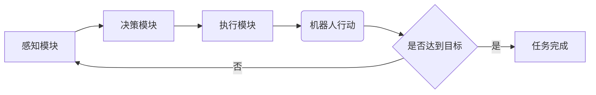

# AI Agent在机器人控制中的应用：自主导航与任务执行

> 关键词：AI Agent、机器人控制、自主导航、任务执行、人工智能

> 摘要：本文深入探讨了AI Agent在机器人控制中的应用，特别是在自主导航和任务执行方面。首先介绍了相关背景知识，包括目的范围、预期读者等。接着详细阐述了核心概念，如AI Agent的原理和架构，并通过文本示意图和Mermaid流程图进行直观展示。对核心算法原理进行了深入分析，给出Python源代码进行说明。同时讲解了相关的数学模型和公式，并举例说明。通过项目实战，展示了代码实际案例及详细解释。探讨了AI Agent在机器人控制中的实际应用场景，推荐了相关的学习资源、开发工具框架和论文著作。最后总结了未来发展趋势与挑战，并提供了常见问题解答和扩展阅读参考资料。

## 1. 背景介绍 
### 1.1 目的和范围
随着人工智能技术的飞速发展，AI Agent在各个领域的应用越来越广泛，尤其是在机器人控制方面。本文章的目的是详细阐述AI Agent在机器人自主导航和任务执行中的应用原理、算法和实际案例。范围涵盖了AI Agent的基本概念、核心算法、数学模型、实际应用场景以及相关的工具和资源。通过本文，读者能够全面了解AI Agent在机器人控制中的工作机制和应用方法。

### 1.2 预期读者
本文预期读者包括对人工智能、机器人技术感兴趣的科研人员、工程师、学生以及相关领域的从业者。对于希望深入了解AI Agent在机器人控制中应用的专业人士，本文将提供系统的知识和技术指导；对于初学者，也可以作为入门学习的参考资料，帮助他们建立起相关的知识体系。

### 1.3 文档结构概述
本文共分为十个部分。第一部分是背景介绍，包括目的范围、预期读者、文档结构概述和术语表。第二部分阐述核心概念与联系，通过文本示意图和Mermaid流程图展示AI Agent的原理和架构。第三部分详细讲解核心算法原理，并给出Python源代码。第四部分介绍数学模型和公式，并举例说明。第五部分是项目实战，包括开发环境搭建、源代码实现和代码解读。第六部分探讨实际应用场景。第七部分推荐相关的工具和资源，包括学习资源、开发工具框架和论文著作。第八部分总结未来发展趋势与挑战。第九部分是附录，提供常见问题与解答。第十部分是扩展阅读与参考资料。

### 1.4 术语表
#### 1.4.1 核心术语定义
- **AI Agent**：人工智能代理，是一种能够感知环境、进行决策并采取行动以实现特定目标的智能实体。
- **机器人控制**：对机器人的运动、操作等行为进行管理和调节的过程。
- **自主导航**：机器人在没有人工干预的情况下，能够根据自身的传感器信息和环境模型，规划路径并移动到目标位置的能力。
- **任务执行**：机器人按照预定的任务要求，完成一系列操作和动作的过程。

#### 1.4.2 相关概念解释
- **传感器融合**：将多个传感器的数据进行综合处理，以获得更准确、更全面的环境信息。
- **路径规划**：根据机器人的起始位置、目标位置和环境信息，寻找一条最优或次优的运动路径。
- **决策模型**：AI Agent根据感知到的环境信息和目标要求，进行决策和选择行动的模型。

#### 1.4.3 缩略词列表
- **ROS**：Robot Operating System，机器人操作系统。
- **SLAM**：Simultaneous Localization and Mapping，同时定位与地图构建。

## 2. 核心概念与联系 

### AI Agent的原理和架构
AI Agent的基本原理是通过传感器感知环境信息，将其输入到决策模型中进行分析和处理，然后根据决策结果通过执行器采取相应的行动。其架构通常包括感知模块、决策模块和执行模块。

感知模块负责收集机器人周围的环境信息，如距离、图像、声音等。这些信息可以来自各种传感器，如激光雷达、摄像头、麦克风等。

决策模块是AI Agent的核心，它根据感知模块提供的环境信息和预设的目标，进行推理和决策。决策模块可以采用各种算法和模型，如强化学习、深度学习、规则引擎等。

执行模块根据决策模块的输出，控制机器人的执行器，如电机、舵机等，实现机器人的运动和操作。

以下是AI Agent原理和架构的文本示意图：

```plaintext
+-------------------+
|     感知模块      |
| (激光雷达、摄像头等)|
+-------------------+
        |
        v
+-------------------+
|     决策模块      |
| (强化学习、规则引擎等)|
+-------------------+
        |
        v
+-------------------+
|     执行模块      |
| (电机、舵机等)    |
+-------------------+
```

### Mermaid流程图


这个流程图展示了AI Agent的工作流程。首先，感知模块收集环境信息并传递给决策模块。决策模块根据信息进行决策，将结果发送给执行模块。执行模块控制机器人行动。机器人行动后，判断是否达到目标，如果没有达到目标，则继续循环执行感知、决策和行动的过程；如果达到目标，则任务完成。

## 3. 核心算法原理 & 具体操作步骤 

### 基于强化学习的路径规划算法原理
强化学习是一种通过智能体与环境进行交互，不断尝试不同的行动以最大化累积奖励的学习方法。在机器人自主导航中，可以将机器人看作智能体，环境看作包含障碍物和目标位置的地图。机器人的行动是选择不同的运动方向，奖励则根据机器人是否接近目标、是否碰撞障碍物等因素来确定。

以下是一个简单的基于Q - learning算法的路径规划Python代码示例：

```python
import numpy as np

# 定义环境
grid_size = 5
goal = (4, 4)
obstacles = [(2, 2), (3, 2)]

# 初始化Q表
Q = np.zeros((grid_size, grid_size, 4))  # 4个行动方向：上、下、左、右

# 定义行动函数
def get_actions(state):
    actions = []
    x, y = state
    if x > 0:
        actions.append(0)  # 上
    if x < grid_size - 1:
        actions.append(1)  # 下
    if y > 0:
        actions.append(2)  # 左
    if y < grid_size - 1:
        actions.append(3)  # 右
    return actions

# 定义奖励函数
def get_reward(state, action):
    x, y = state
    if action == 0:
        new_state = (x - 1, y)
    elif action == 1:
        new_state = (x + 1, y)
    elif action == 2:
        new_state = (x, y - 1)
    else:
        new_state = (x, y + 1)
    if new_state in obstacles:
        return -100
    elif new_state == goal:
        return 100
    else:
        return -1

# 定义Q - learning算法
def q_learning(alpha=0.1, gamma=0.9, episodes=1000):
    for episode in range(episodes):
        state = (0, 0)
        done = False
        while not done:
            actions = get_actions(state)
            action = np.random.choice(actions)
            reward = get_reward(state, action)
            x, y = state
            if action == 0:
                new_state = (x - 1, y)
            elif action == 1:
                new_state = (x + 1, y)
            elif action == 2:
                new_state = (x, y - 1)
            else:
                new_state = (x, y + 1)
            new_actions = get_actions(new_state)
            max_q = np.max(Q[new_state[0], new_state[1], new_actions])
            Q[x, y, action] = (1 - alpha) * Q[x, y, action] + alpha * (reward + gamma * max_q)
            if new_state == goal:
                done = True
            state = new_state
    return Q

# 训练Q表
Q = q_learning()

# 测试路径规划
state = (0, 0)
path = [state]
done = False
while not done:
    x, y = state
    actions = get_actions(state)
    action = np.argmax(Q[x, y, actions])
    if action == 0:
        new_state = (x - 1, y)
    elif action == 1:
        new_state = (x + 1, y)
    elif action == 2:
        new_state = (x, y - 1)
    else:
        new_state = (x, y + 1)
    path.append(new_state)
    if new_state == goal:
        done = True
    state = new_state

print("规划路径:", path)
```

### 具体操作步骤
1. **环境定义**：定义地图的大小、目标位置和障碍物位置。
2. **Q表初始化**：初始化Q表，用于存储每个状态 - 行动对的价值。
3. **行动函数**：根据当前状态确定可行的行动。
4. **奖励函数**：根据当前状态和行动计算奖励。
5. **Q - learning算法训练**：通过多次迭代，不断更新Q表，使机器人学习到最优的行动策略。
6. **路径规划测试**：使用训练好的Q表，从起始位置开始，根据Q值选择最优行动，直到到达目标位置。

## 4. 数学模型和公式 & 详细讲解 & 举例说明 

### Q - learning算法的数学模型
Q - learning算法的核心是Q值的更新公式，如下所示：

$$Q(s_t, a_t) \leftarrow (1 - \alpha)Q(s_t, a_t) + \alpha\left[r_{t + 1}+\gamma\max_{a}Q(s_{t + 1}, a)\right]$$

其中：
- $s_t$ 表示在时间步 $t$ 的状态。
- $a_t$ 表示在时间步 $t$ 采取的行动。
- $\alpha$ 是学习率，控制新的经验对旧的Q值的更新程度。$\alpha$ 取值范围在 $(0, 1)$ 之间，$\alpha$ 越大，新的经验对Q值的影响越大。
- $r_{t + 1}$ 是在时间步 $t + 1$ 获得的奖励。
- $\gamma$ 是折扣因子，用于权衡当前奖励和未来奖励的重要性。$\gamma$ 取值范围在 $[0, 1]$ 之间，$\gamma$ 越接近1，越重视未来的奖励；$\gamma$ 越接近0，越重视当前的奖励。
- $s_{t + 1}$ 表示在时间步 $t + 1$ 的状态。

### 详细讲解
Q - learning算法的基本思想是通过不断地与环境交互，更新Q表中的Q值，使得智能体能够学习到最优的行动策略。在每一次迭代中，智能体根据当前状态 $s_t$ 选择一个行动 $a_t$，执行该行动后获得奖励 $r_{t + 1}$ 并转移到新的状态 $s_{t + 1}$。然后，根据Q值更新公式更新 $Q(s_t, a_t)$。

### 举例说明
假设在一个 $3\times3$ 的网格地图中，智能体初始位置在 $(0, 0)$，目标位置在 $(2, 2)$。初始时，Q表中的所有Q值都为0。学习率 $\alpha = 0.1$，折扣因子 $\gamma = 0.9$。

在某一次迭代中，智能体处于状态 $s_t=(0, 0)$，选择行动 $a_t = 1$（向下移动），到达新状态 $s_{t + 1}=(1, 0)$，获得奖励 $r_{t + 1}=-1$。此时，新状态 $(1, 0)$ 的所有可行行动的Q值分别为 $Q(1, 0, 0)=0$，$Q(1, 0, 1)=0$，$Q(1, 0, 2)=0$，$Q(1, 0, 3)=0$，则 $\max_{a}Q(s_{t + 1}, a)=0$。

根据Q值更新公式：

$$Q(0, 0, 1)=(1 - 0.1)\times0+0.1\times(-1 + 0.9\times0)=-0.1$$

通过多次迭代，Q表中的Q值会不断更新，最终智能体能够学习到从起始位置到目标位置的最优路径。

## 5. 项目实战：代码实际案例和详细解释说明 

### 5.1  开发环境搭建
#### 安装Python
首先需要安装Python，建议使用Python 3.6及以上版本。可以从Python官方网站（https://www.python.org/downloads/）下载安装包，按照安装向导进行安装。

#### 安装必要的库
在本项目中，主要使用了NumPy库进行数值计算。可以使用以下命令安装NumPy：

```sh
pip install numpy
```

### 5.2  源代码详细实现和代码解读
以下是完整的代码：

```python
import numpy as np

# 定义环境
grid_size = 5
goal = (4, 4)
obstacles = [(2, 2), (3, 2)]

# 初始化Q表
Q = np.zeros((grid_size, grid_size, 4))  # 4个行动方向：上、下、左、右

# 定义行动函数
def get_actions(state):
    actions = []
    x, y = state
    if x > 0:
        actions.append(0)  # 上
    if x < grid_size - 1:
        actions.append(1)  # 下
    if y > 0:
        actions.append(2)  # 左
    if y < grid_size - 1:
        actions.append(3)  # 右
    return actions

# 定义奖励函数
def get_reward(state, action):
    x, y = state
    if action == 0:
        new_state = (x - 1, y)
    elif action == 1:
        new_state = (x + 1, y)
    elif action == 2:
        new_state = (x, y - 1)
    else:
        new_state = (x, y + 1)
    if new_state in obstacles:
        return -100
    elif new_state == goal:
        return 100
    else:
        return -1

# 定义Q - learning算法
def q_learning(alpha=0.1, gamma=0.9, episodes=1000):
    for episode in range(episodes):
        state = (0, 0)
        done = False
        while not done:
            actions = get_actions(state)
            action = np.random.choice(actions)
            reward = get_reward(state, action)
            x, y = state
            if action == 0:
                new_state = (x - 1, y)
            elif action == 1:
                new_state = (x + 1, y)
            elif action == 2:
                new_state = (x, y - 1)
            else:
                new_state = (x, y + 1)
            new_actions = get_actions(new_state)
            max_q = np.max(Q[new_state[0], new_state[1], new_actions])
            Q[x, y, action] = (1 - alpha) * Q[x, y, action] + alpha * (reward + gamma * max_q)
            if new_state == goal:
                done = True
            state = new_state
    return Q

# 训练Q表
Q = q_learning()

# 测试路径规划
state = (0, 0)
path = [state]
done = False
while not done:
    x, y = state
    actions = get_actions(state)
    action = np.argmax(Q[x, y, actions])
    if action == 0:
        new_state = (x - 1, y)
    elif action == 1:
        new_state = (x + 1, y)
    elif action == 2:
        new_state = (x, y - 1)
    else:
        new_state = (x, y + 1)
    path.append(new_state)
    if new_state == goal:
        done = True
    state = new_state

print("规划路径:", path)
```

### 代码解读与分析
1. **环境定义**：`grid_size` 定义了地图的大小，`goal` 定义了目标位置，`obstacles` 定义了障碍物位置。
2. **Q表初始化**：`Q` 是一个三维数组，用于存储每个状态 - 行动对的Q值。
3. **行动函数 `get_actions`**：根据当前状态返回可行的行动列表。
4. **奖励函数 `get_reward`**：根据当前状态和行动计算奖励，如果撞到障碍物则奖励为 - 100，如果到达目标则奖励为100，否则奖励为 - 1。
5. **Q - learning算法 `q_learning`**：通过多次迭代，不断更新Q表。在每次迭代中，智能体随机选择一个行动，执行该行动后更新Q值。
6. **路径规划测试**：使用训练好的Q表，从起始位置开始，根据Q值选择最优行动，直到到达目标位置。最后打印出规划的路径。

## 6. 实际应用场景 
### 仓储物流
在仓储物流场景中，机器人可以使用AI Agent进行自主导航和任务执行。例如，自动导引车（AGV）可以根据仓库的地图和货物的位置信息，自主规划路径，将货物从一个地点运输到另一个地点。通过AI Agent的决策和控制，AGV可以避开障碍物，高效地完成货物搬运任务，提高仓储物流的效率。

### 服务机器人
服务机器人广泛应用于酒店、餐厅、商场等场所。这些机器人可以通过AI Agent实现自主导航，在复杂的环境中为顾客提供引导、送餐等服务。例如，酒店服务机器人可以根据顾客的需求，自主规划路径，将物品送到指定的房间。同时，机器人还可以根据环境的变化实时调整行动，如避开人群、处理突发情况等。

### 智能巡检
在工业生产、电力系统、安防等领域，智能巡检机器人可以使用AI Agent进行自主导航和任务执行。机器人可以按照预设的巡检路线，自主移动到各个巡检点，使用各种传感器对设备进行检测和监测。例如，电力巡检机器人可以检测输电线路的温度、电压等参数，及时发现潜在的安全隐患。通过AI Agent的智能决策，机器人可以根据检测结果采取相应的措施，如报警、记录数据等。

### 农业机器人
农业机器人在农业生产中的应用越来越广泛。例如，除草机器人可以使用AI Agent进行自主导航，在农田中识别杂草并进行除草作业。机器人可以根据农田的地形和作物分布，规划最优的除草路径，提高除草效率。同时，机器人还可以根据杂草的生长情况和分布密度，调整除草策略，实现精准除草。

## 7. 工具和资源推荐
### 7.1 学习资源推荐
#### 7.1.1 书籍推荐
- 《人工智能：一种现代的方法》（Artificial Intelligence: A Modern Approach）：这是一本经典的人工智能教材，涵盖了人工智能的各个领域，包括搜索算法、知识表示、机器学习、自然语言处理等。对于理解AI Agent的基本原理和方法有很大的帮助。
- 《强化学习：原理与Python实现》（Reinforcement Learning: An Introduction）：这本书详细介绍了强化学习的理论和算法，是学习强化学习的权威书籍。通过学习强化学习，读者可以深入理解AI Agent在机器人控制中的决策机制。
- 《机器人学导论》（Introduction to Robotics: Mechanics and Control）：这本书介绍了机器人的运动学、动力学、控制理论等基础知识，对于理解机器人的控制原理和方法非常有帮助。

#### 7.1.2 在线课程
- Coursera上的“人工智能基础”（Foundations of Artificial Intelligence）课程：该课程由斯坦福大学的教授授课，系统地介绍了人工智能的基本概念、算法和应用。
- edX上的“强化学习”（Reinforcement Learning）课程：由伯克利大学的教授授课，深入讲解了强化学习的理论和实践。
- Udemy上的“机器人编程基础”（Robotics Programming Basics）课程：该课程通过实际案例，介绍了机器人编程的基本方法和技巧。

#### 7.1.3 技术博客和网站
- Towards Data Science：这是一个专注于数据科学和人工智能的技术博客，上面有很多关于AI Agent、机器人控制等方面的文章和教程。
- Medium上的AI板块：Medium上有很多人工智能领域的专家和爱好者分享他们的经验和见解，读者可以从中获取最新的技术动态和研究成果。
- OpenAI的官方网站：OpenAI是人工智能领域的领先研究机构，其官方网站上有很多关于人工智能的研究论文和开源项目。

### 7.2 开发工具框架推荐
#### 7.2.1 IDE和编辑器
- PyCharm：这是一款专门为Python开发设计的集成开发环境（IDE），具有强大的代码编辑、调试和项目管理功能。对于开发基于Python的AI Agent和机器人控制程序非常方便。
- Visual Studio Code：这是一款轻量级的代码编辑器，支持多种编程语言和插件扩展。它具有丰富的代码提示和调试功能，适合快速开发和测试。
- Jupyter Notebook：这是一个交互式的开发环境，非常适合进行数据探索、算法实验和代码演示。在学习和研究AI Agent和机器人控制时，可以使用Jupyter Notebook进行代码的编写和调试。

#### 7.2.2 调试和性能分析工具
- pdb：Python自带的调试器，可以帮助开发者逐行调试代码，查找和解决问题。
- cProfile：Python的性能分析工具，可以分析代码的运行时间和函数调用次数，帮助开发者优化代码性能。
- TensorBoard：这是TensorFlow的可视化工具，可以用于可视化训练过程、模型结构和性能指标。在使用深度学习算法开发AI Agent时，TensorBoard可以帮助开发者更好地理解和优化模型。

#### 7.2.3 相关框架和库
- NumPy：这是Python中用于科学计算的基础库，提供了高效的数组操作和数学函数。在开发AI Agent和机器人控制程序时，NumPy可以用于数据处理和数值计算。
- OpenCV：这是一个开源的计算机视觉库，提供了丰富的图像处理和计算机视觉算法。在机器人的感知模块中，OpenCV可以用于图像识别、目标检测等任务。
- ROS（Robot Operating System）：这是一个广泛应用于机器人开发的操作系统，提供了丰富的工具和库，用于机器人的运动控制、传感器数据处理、通信等。通过ROS，可以方便地开发和集成AI Agent到机器人系统中。

### 7.3 相关论文著作推荐
#### 7.3.1 经典论文
- “Q - learning” by Watkins and Dayan：这是Q - learning算法的经典论文，详细介绍了Q - learning算法的原理和应用。
- “A Unified Approach to Integrating Task and Motion Planning” by Kaelbling and Lozano - Pérez：该论文提出了一种将任务规划和运动规划相结合的统一方法，对于机器人的任务执行和路径规划具有重要的指导意义。
- “Simultaneous Localization and Mapping (SLAM): Part I” by Durrant - Whyte and Bailey：这是SLAM技术的经典综述论文，介绍了SLAM的基本概念、算法和应用。

#### 7.3.2 最新研究成果
- 在IEEE Robotics and Automation Letters、Journal of Artificial Intelligence Research等期刊上可以找到关于AI Agent在机器人控制中的最新研究成果。这些研究成果涵盖了新的算法、模型和应用场景。
- 每年的国际机器人与自动化会议（ICRA）、人工智能促进协会会议（AAAI）等学术会议上也会有很多关于AI Agent和机器人控制的最新研究报告。

#### 7.3.3 应用案例分析
- 《机器人应用案例集》：这本书收集了各种机器人在不同领域的应用案例，包括工业机器人、服务机器人、医疗机器人等。通过分析这些案例，可以了解AI Agent在实际应用中的具体实现方法和效果。
- 一些知名企业的技术博客和报告，如谷歌、亚马逊、特斯拉等公司，会分享他们在机器人技术和AI Agent应用方面的经验和案例。

## 8. 总结：未来发展趋势与挑战
### 未来发展趋势
#### 多智能体协作
未来，机器人将不再是孤立的个体，而是多个机器人组成的群体进行协作。多个AI Agent可以通过通信和协调，共同完成复杂的任务，如大规模的物流配送、灾难救援等。多智能体协作可以提高任务执行的效率和灵活性，同时也可以应对更复杂的环境和任务需求。

#### 与其他技术的融合
AI Agent将与物联网、大数据、云计算等技术深度融合。通过物联网，机器人可以获取更多的环境信息和数据；通过大数据和云计算，机器人可以进行更复杂的数据分析和决策。例如，在智能家居场景中，机器人可以与各种智能设备进行互联，实现更智能的家居控制和服务。

#### 智能化程度不断提高
随着人工智能技术的不断发展，AI Agent的智能化程度将不断提高。机器人将具备更强的感知能力、学习能力和决策能力，能够更好地适应复杂多变的环境。例如，机器人可以通过深度学习算法自动学习环境的特征和规律，从而实现更高效的自主导航和任务执行。

### 挑战
#### 算法复杂度和计算资源需求
一些先进的AI算法，如深度学习、强化学习等，具有较高的复杂度，需要大量的计算资源。在机器人上实现这些算法，需要解决计算资源受限的问题。同时，算法的训练时间也较长，需要优化算法和训练方法，提高训练效率。

#### 环境适应性和鲁棒性
机器人在实际应用中面临着复杂多变的环境，如光照变化、障碍物动态变化等。AI Agent需要具备良好的环境适应性和鲁棒性，能够在不同的环境条件下稳定地工作。这需要研究更有效的传感器融合技术和决策算法，提高机器人对环境的感知和应对能力。

#### 伦理和安全问题
随着机器人的智能化程度不断提高，伦理和安全问题也越来越受到关注。例如，机器人的决策可能会对人类产生影响，需要确保机器人的行为符合伦理和法律规范。同时，还需要加强机器人的安全防护，防止机器人被恶意攻击和滥用。

## 9. 附录：常见问题与解答
### 问题1：什么是AI Agent？
解答：AI Agent是一种能够感知环境、进行决策并采取行动以实现特定目标的智能实体。它可以是软件程序，也可以是机器人等物理实体。

### 问题2：Q - learning算法的收敛性如何保证？
解答：Q - learning算法在一定条件下可以保证收敛。主要条件包括学习率 $\alpha$ 随着时间逐渐减小，并且所有状态 - 行动对都有无限次的访问机会。在实际应用中，可以通过合理设置学习率和训练次数来提高算法的收敛性。

### 问题3：如何选择合适的传感器用于机器人的感知模块？
解答：选择合适的传感器需要考虑多个因素，如环境特点、任务需求、传感器的精度和成本等。例如，在室内环境中，激光雷达可以用于精确的距离测量和地图构建；摄像头可以用于图像识别和目标检测。在选择传感器时，还需要考虑传感器之间的兼容性和数据融合问题。

### 问题4：ROS在机器人开发中有什么优势？
解答：ROS提供了丰富的工具和库，用于机器人的运动控制、传感器数据处理、通信等。它具有良好的模块化设计和分布式架构，可以方便地开发和集成不同的功能模块。同时，ROS社区活跃，有大量的开源代码和文档可供参考，能够提高开发效率。

### 问题5：如何评估AI Agent在机器人控制中的性能？
解答：可以从多个方面评估AI Agent的性能，如任务完成时间、路径规划的最优性、能量消耗、成功率等。对于不同的应用场景，还可以根据具体的任务需求和指标进行评估。例如，在仓储物流场景中，可以评估机器人的货物搬运效率和准确率；在智能巡检场景中，可以评估机器人的检测精度和漏检率。

## 10. 扩展阅读 & 参考资料
### 扩展阅读
- 《智能机器人：原理、设计与应用》
- 《深度学习入门：基于Python的理论与实现》
- 《数据挖掘：概念与技术》

### 参考资料
- [1] Stuart Russell, Peter Norvig. Artificial Intelligence: A Modern Approach. Prentice Hall, 2009.
- [2] Richard S. Sutton, Andrew G. Barto. Reinforcement Learning: An Introduction. MIT Press, 2018.
- [3] John J. Craig. Introduction to Robotics: Mechanics and Control. Pearson, 2004.
- [4] Christopher J. C. H. Watkins, Peter Dayan. Q - learning. Machine Learning, 1992, 8(3 - 4): 279 - 292.
- [5] Leslie Pack Kaelbling, Tomas Lozano - Pérez. A Unified Approach to Integrating Task and Motion Planning. Journal of Artificial Intelligence Research, 2011, 40: 85 - 147.
- [6] Hugh Durrant - Whyte, Tim Bailey. Simultaneous Localization and Mapping (SLAM): Part I. IEEE Robotics & Automation Magazine, 2006, 13(2): 99 - 110.

作者：AI天才研究院/AI Genius Institute & 禅与计算机程序设计艺术 /Zen And The Art of Computer Programming