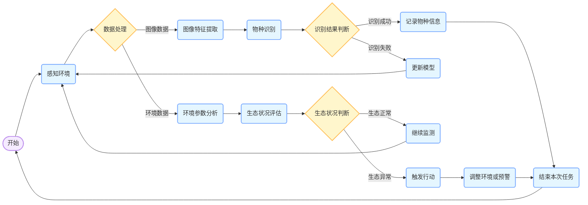

# AI Agent在植物学中的应用：物种识别与生态监测

> 关键词：AI Agent、植物学、物种识别、生态监测、机器学习

> 摘要：本文聚焦于AI Agent在植物学领域的应用，特别是在物种识别与生态监测方面的重要作用。详细介绍了AI Agent的核心概念、相关算法原理、数学模型，通过实际项目案例展示其具体实现过程。同时，探讨了AI Agent在植物学中的实际应用场景，推荐了相关的学习资源、开发工具和论文著作。最后，对AI Agent在植物学领域的未来发展趋势与挑战进行了总结，并提供了常见问题的解答和扩展阅读参考资料。

## 1. 背景介绍 
### 1.1 目的和范围
随着植物学研究的不断深入，传统的植物物种识别和生态监测方法面临着效率低、准确性有限等问题。AI Agent作为一种智能化的工具，能够利用先进的算法和技术，提高植物物种识别的准确性和生态监测的效率。本文的目的在于深入探讨AI Agent在植物学中物种识别与生态监测方面的应用，涵盖从核心概念到实际应用的各个方面，为相关研究和实践提供全面的参考。

### 1.2 预期读者
本文的预期读者包括植物学研究人员、计算机科学领域对人工智能应用感兴趣的学者、从事生态监测的工作人员以及相关专业的学生。通过阅读本文，读者可以了解AI Agent在植物学中的应用原理、技术实现和实际应用场景，为他们的研究和工作提供新的思路和方法。

### 1.3 文档结构概述
本文共分为十个部分。第一部分为背景介绍，阐述了文章的目的、预期读者和文档结构概述。第二部分介绍了AI Agent的核心概念与联系，包括其原理和架构，并通过文本示意图和Mermaid流程图进行说明。第三部分详细讲解了核心算法原理和具体操作步骤，同时给出Python源代码示例。第四部分介绍了相关的数学模型和公式，并进行详细讲解和举例说明。第五部分通过项目实战，展示了代码的实际案例和详细解释。第六部分探讨了AI Agent在植物学中的实际应用场景。第七部分推荐了学习资源、开发工具框架和相关论文著作。第八部分总结了未来发展趋势与挑战。第九部分为附录，提供了常见问题与解答。第十部分列出了扩展阅读和参考资料。

### 1.4 术语表
#### 1.4.1 核心术语定义
- **AI Agent**：人工智能代理，是一种能够感知环境、做出决策并采取行动以实现特定目标的智能实体。
- **植物物种识别**：通过对植物的形态特征、图像等信息进行分析，确定植物所属的物种。
- **生态监测**：对生态系统的结构、功能和动态变化进行长期、系统的观测和分析。
- **机器学习**：一门多领域交叉学科，涉及概率论、统计学、逼近论、凸分析、算法复杂度理论等多门学科。它专门研究计算机怎样模拟或实现人类的学习行为，以获取新的知识或技能，重新组织已有的知识结构使之不断改善自身的性能。
- **深度学习**：机器学习的一个分支领域，它是一种基于对数据进行表征学习的方法。深度学习通过构建具有很多层的神经网络模型，自动从大量数据中学习特征和模式。

#### 1.4.2 相关概念解释
- **图像识别**：是指利用计算机对图像进行处理、分析和理解，以识别各种不同模式的目标和对象的技术。在植物物种识别中，图像识别技术可以通过对植物的叶片、花朵、果实等图像进行分析，识别出植物的物种。
- **传感器网络**：由大量的、廉价的、微型的传感器节点组成，这些节点通过无线通信方式形成一个多跳的自组织网络系统，其目的是协作地感知、采集和处理网络覆盖区域中被感知对象的信息，并发送给观察者。在生态监测中，传感器网络可以用于监测植物生长环境的温度、湿度、光照等参数。

#### 1.4.3 缩略词列表
- **CNN**：Convolutional Neural Network，卷积神经网络，是一种专门为处理具有网格结构数据（如图像）而设计的深度学习模型。
- **RNN**：Recurrent Neural Network，循环神经网络，是一种具有循环结构的神经网络，适用于处理序列数据。
- **LSTM**：Long Short-Term Memory，长短期记忆网络，是一种特殊的RNN，能够解决传统RNN在处理长序列数据时的梯度消失或梯度爆炸问题。

## 2. 核心概念与联系 

### 核心概念原理
AI Agent在植物学中的应用主要基于其感知、决策和行动的能力。在物种识别方面，AI Agent通过图像传感器等设备获取植物的图像信息，然后利用机器学习和深度学习算法对图像进行分析，提取植物的特征，最后根据这些特征进行物种分类。在生态监测方面，AI Agent可以通过传感器网络收集植物生长环境的各种参数，如温度、湿度、光照等，对这些数据进行实时分析，判断生态系统的健康状况，并根据分析结果采取相应的行动，如调整灌溉系统、发出预警等。

### 架构的文本示意图
```plaintext
              +-------------------+
              |    AI Agent       |
              +-------------------+
              | 感知模块          |
              | - 图像传感器      |
              | - 环境传感器      |
              +-------------------+
              | 决策模块          |
              | - 机器学习模型    |
              | - 深度学习模型    |
              +-------------------+
              | 行动模块          |
              | - 灌溉系统控制    |
              | - 预警系统触发    |
              +-------------------+
```

### Mermaid流程图


## 3. 核心算法原理 & 具体操作步骤 

### 核心算法原理
在植物物种识别中，常用的算法是卷积神经网络（CNN）。CNN是一种专门为处理具有网格结构数据（如图像）而设计的深度学习模型。它通过卷积层、池化层和全连接层等组件，自动从图像中提取特征，并进行分类。

### Python源代码示例
```python
import tensorflow as tf
from tensorflow.keras import layers, models

# 构建CNN模型
def build_cnn_model():
    model = models.Sequential()
    # 第一个卷积层，32个滤波器，卷积核大小为3x3，激活函数为ReLU
    model.add(layers.Conv2D(32, (3, 3), activation='relu', input_shape=(150, 150, 3)))
    # 最大池化层，池化窗口大小为2x2
    model.add(layers.MaxPooling2D((2, 2)))
    # 第二个卷积层，64个滤波器，卷积核大小为3x3，激活函数为ReLU
    model.add(layers.Conv2D(64, (3, 3), activation='relu'))
    # 最大池化层，池化窗口大小为2x2
    model.add(layers.MaxPooling2D((2, 2)))
    # 第三个卷积层，128个滤波器，卷积核大小为3x3，激活函数为ReLU
    model.add(layers.Conv2D(128, (3, 3), activation='relu'))
    # 最大池化层，池化窗口大小为2x2
    model.add(layers.MaxPooling2D((2, 2)))
    # 将多维数据展平为一维
    model.add(layers.Flatten())
    # 全连接层，128个神经元，激活函数为ReLU
    model.add(layers.Dense(128, activation='relu'))
    # 输出层，假设有10个植物物种，使用softmax激活函数进行分类
    model.add(layers.Dense(10, activation='softmax'))

    # 编译模型，使用adam优化器，交叉熵损失函数，准确率作为评估指标
    model.compile(optimizer='adam',
                  loss='categorical_crossentropy',
                  metrics=['accuracy'])
    return model

# 创建模型实例
model = build_cnn_model()
# 打印模型结构
model.summary()
```

### 具体操作步骤
1. **数据收集**：收集大量的植物图像数据，确保数据的多样性和代表性。可以从公开数据集、野外拍摄等途径获取数据。
2. **数据预处理**：对收集到的图像数据进行预处理，包括调整图像大小、归一化、数据增强等操作，以提高模型的泛化能力。
3. **模型构建**：使用上述Python代码构建CNN模型。
4. **模型训练**：将预处理后的数据划分为训练集和验证集，使用训练集对模型进行训练，同时使用验证集进行模型评估和调优。
5. **模型评估**：使用测试集对训练好的模型进行评估，计算模型的准确率、召回率、F1值等指标，评估模型的性能。
6. **模型部署**：将训练好的模型部署到实际应用中，对新的植物图像进行物种识别。

## 4. 数学模型和公式 & 详细讲解 & 举例说明 

### 卷积操作
卷积操作是CNN的核心操作之一，它通过卷积核在输入图像上滑动，计算卷积核与输入图像对应区域的点积，从而提取图像的特征。

#### 数学公式
设输入图像为 $X$，卷积核为 $W$，输出特征图为 $Y$，则卷积操作可以表示为：

$$Y(i,j) = \sum_{m=0}^{M-1} \sum_{n=0}^{N-1} X(i+m,j+n) \cdot W(m,n)$$

其中，$M$ 和 $N$ 分别是卷积核的高度和宽度，$(i,j)$ 是输出特征图上的位置。

#### 详细讲解
卷积操作的本质是一种线性滤波，它通过卷积核的不同参数设置，可以提取图像的不同特征，如边缘、纹理等。卷积核的参数是在模型训练过程中自动学习得到的。

#### 举例说明
假设输入图像 $X$ 是一个 $3x3$ 的矩阵：

$$X = \begin{bmatrix}
1 & 2 & 3 \\
4 & 5 & 6 \\
7 & 8 & 9
\end{bmatrix}$$

卷积核 $W$ 是一个 $2x2$ 的矩阵：

$$W = \begin{bmatrix}
1 & 0 \\
0 & 1
\end{bmatrix}$$

则卷积操作的计算过程如下：

对于输出特征图的第一个位置 $(0,0)$：

$$Y(0,0) = X(0,0) \cdot W(0,0) + X(0,1) \cdot W(0,1) + X(1,0) \cdot W(1,0) + X(1,1) \cdot W(1,1) = 1 \cdot 1 + 2 \cdot 0 + 4 \cdot 0 + 5 \cdot 1 = 6$$

以此类推，可以计算出输出特征图的其他位置的值。

### 池化操作
池化操作是CNN中用于减少特征图维度的一种操作，常用的池化操作有最大池化和平均池化。

#### 数学公式
以最大池化为例，设输入特征图为 $X$，池化窗口大小为 $K$，步长为 $S$，输出特征图为 $Y$，则最大池化操作可以表示为：

$$Y(i,j) = \max_{m=0}^{K-1} \max_{n=0}^{K-1} X(iS+m,jS+n)$$

其中，$(i,j)$ 是输出特征图上的位置。

#### 详细讲解
池化操作的主要作用是降低特征图的维度，减少计算量，同时增强模型的鲁棒性。最大池化操作通过选择池化窗口内的最大值作为输出，保留了特征图中的重要信息。

#### 举例说明
假设输入特征图 $X$ 是一个 $4x4$ 的矩阵：

$$X = \begin{bmatrix}
1 & 2 & 3 & 4 \\
5 & 6 & 7 & 8 \\
9 & 10 & 11 & 12 \\
13 & 14 & 15 & 16
\end{bmatrix}$$

池化窗口大小 $K = 2$，步长 $S = 2$，则最大池化操作的计算过程如下：

对于输出特征图的第一个位置 $(0,0)$：

$$Y(0,0) = \max\{X(0,0), X(0,1), X(1,0), X(1,1)\} = \max\{1, 2, 5, 6\} = 6$$

以此类推，可以计算出输出特征图的其他位置的值。

### 全连接层
全连接层是CNN中用于将提取的特征进行分类的一层，它将上一层的所有神经元与当前层的每个神经元都进行连接。

#### 数学公式
设输入向量为 $x$，权重矩阵为 $W$，偏置向量为 $b$，输出向量为 $y$，则全连接层的计算可以表示为：

$$y = Wx + b$$

#### 详细讲解
全连接层的作用是将提取的特征进行非线性组合，从而实现分类的目的。权重矩阵 $W$ 和偏置向量 $b$ 是在模型训练过程中自动学习得到的。

#### 举例说明
假设输入向量 $x$ 是一个 $3$ 维向量：

$$x = \begin{bmatrix}
1 \\
2 \\
3
\end{bmatrix}$$

权重矩阵 $W$ 是一个 $2x3$ 的矩阵：

$$W = \begin{bmatrix}
1 & 2 & 3 \\
4 & 5 & 6
\end{bmatrix}$$

偏置向量 $b$ 是一个 $2$ 维向量：

$$b = \begin{bmatrix}
1 \\
2
\end{bmatrix}$$

则全连接层的输出向量 $y$ 为：

$$y = Wx + b = \begin{bmatrix}
1 & 2 & 3 \\
4 & 5 & 6
\end{bmatrix} \begin{bmatrix}
1 \\
2 \\
3
\end{bmatrix} + \begin{bmatrix}
1 \\
2
\end{bmatrix} = \begin{bmatrix}
1 \cdot 1 + 2 \cdot 2 + 3 \cdot 3 + 1 \\
4 \cdot 1 + 5 \cdot 2 + 6 \cdot 3 + 2
\end{bmatrix} = \begin{bmatrix}
15 \\
34
\end{bmatrix}$$

## 5. 项目实战：代码实际案例和详细解释说明 

### 5.1  开发环境搭建
#### 安装Python
首先需要安装Python，建议使用Python 3.7及以上版本。可以从Python官方网站（https://www.python.org/downloads/）下载安装包进行安装。

#### 安装深度学习框架
本文使用TensorFlow作为深度学习框架，可以使用以下命令进行安装：

```sh
pip install tensorflow
```

#### 安装其他依赖库
还需要安装一些其他的依赖库，如NumPy、Pandas、Matplotlib等，可以使用以下命令进行安装：

```sh
pip install numpy pandas matplotlib
```

### 5.2  源代码详细实现和代码解读
```python
import tensorflow as tf
from tensorflow.keras.preprocessing.image import ImageDataGenerator
from tensorflow.keras import layers, models
import matplotlib.pyplot as plt

# 数据预处理
# 训练集数据增强
train_datagen = ImageDataGenerator(
    rescale=1./255,  # 归一化
    rotation_range=40,  # 随机旋转角度范围
    width_shift_range=0.2,  # 随机水平平移范围
    height_shift_range=0.2,  # 随机垂直平移范围
    shear_range=0.2,  # 随机错切变换范围
    zoom_range=0.2,  # 随机缩放范围
    horizontal_flip=True,  # 随机水平翻转
    fill_mode='nearest'  # 填充模式
)

# 测试集不进行数据增强，仅进行归一化
test_datagen = ImageDataGenerator(rescale=1./255)

# 加载训练集数据
train_generator = train_datagen.flow_from_directory(
    'train_data_dir',  # 训练集数据目录
    target_size=(150, 150),  # 图像调整大小
    batch_size=32,  # 批次大小
    class_mode='categorical'  # 分类模式
)

# 加载测试集数据
test_generator = test_datagen.flow_from_directory(
    'test_data_dir',  # 测试集数据目录
    target_size=(150, 150),  # 图像调整大小
    batch_size=32,  # 批次大小
    class_mode='categorical'  # 分类模式
)

# 构建CNN模型
model = models.Sequential()
model.add(layers.Conv2D(32, (3, 3), activation='relu', input_shape=(150, 150, 3)))
model.add(layers.MaxPooling2D((2, 2)))
model.add(layers.Conv2D(64, (3, 3), activation='relu'))
model.add(layers.MaxPooling2D((2, 2)))
model.add(layers.Conv2D(128, (3, 3), activation='relu'))
model.add(layers.MaxPooling2D((2, 2)))
model.add(layers.Flatten())
model.add(layers.Dense(128, activation='relu'))
model.add(layers.Dense(10, activation='softmax'))

# 编译模型
model.compile(optimizer='adam',
              loss='categorical_crossentropy',
              metrics=['accuracy'])

# 训练模型
history = model.fit(
    train_generator,
    steps_per_epoch=train_generator.samples // train_generator.batch_size,
    epochs=10,
    validation_data=test_generator,
    validation_steps=test_generator.samples // test_generator.batch_size
)

# 保存模型
model.save('plant_species_recognition_model.h5')

# 绘制训练和验证准确率曲线
plt.plot(history.history['accuracy'])
plt.plot(history.history['val_accuracy'])
plt.title('Model accuracy')
plt.ylabel('Accuracy')
plt.xlabel('Epoch')
plt.legend(['Train', 'Test'], loc='upper left')
plt.show()

# 绘制训练和验证损失曲线
plt.plot(history.history['loss'])
plt.plot(history.history['val_loss'])
plt.title('Model loss')
plt.ylabel('Loss')
plt.xlabel('Epoch')
plt.legend(['Train', 'Test'], loc='upper left')
plt.show()
```

### 5.3  代码解读与分析
1. **数据预处理**：使用`ImageDataGenerator`对训练集和测试集数据进行预处理。训练集进行数据增强操作，包括随机旋转、平移、错切、缩放和翻转等，以增加数据的多样性，提高模型的泛化能力。测试集仅进行归一化操作。
2. **数据加载**：使用`flow_from_directory`方法从指定目录加载训练集和测试集数据，并将其转换为适合模型训练的格式。
3. **模型构建**：构建一个简单的CNN模型，包括卷积层、池化层、全连接层等。卷积层用于提取图像的特征，池化层用于降低特征图的维度，全连接层用于进行分类。
4. **模型编译**：使用`adam`优化器、交叉熵损失函数和准确率作为评估指标对模型进行编译。
5. **模型训练**：使用`fit`方法对模型进行训练，指定训练集、训练步数、训练轮数、验证集和验证步数等参数。
6. **模型保存**：使用`save`方法将训练好的模型保存为`.h5`文件，以便后续使用。
7. **结果可视化**：使用`matplotlib`库绘制训练和验证准确率曲线以及训练和验证损失曲线，直观地展示模型的训练效果。

## 6. 实际应用场景 
### 植物物种识别
- **野外考察**：在野外考察中，研究人员可以使用搭载AI Agent的移动设备，对发现的植物进行实时拍照识别，快速确定植物的物种，提高考察效率。
- **植物园导览**：在植物园中，游客可以通过手机应用程序扫描植物的二维码或图像，获取植物的详细信息，包括物种名称、生长习性、分布区域等，增强游览体验。
- **农业生产**：在农业生产中，农民可以使用AI Agent对农作物的病虫害进行识别，及时采取防治措施，减少损失。

### 生态监测
- **森林生态系统监测**：通过在森林中部署传感器网络和AI Agent，实时监测森林的温度、湿度、光照、土壤水分等环境参数，以及树木的生长状况、病虫害发生情况等，及时发现生态系统的异常变化，为森林保护和管理提供决策依据。
- **湿地生态系统监测**：对湿地的水质、水位、植被覆盖等参数进行监测，评估湿地生态系统的健康状况，为湿地保护和恢复提供支持。
- **城市绿化监测**：监测城市绿化植物的生长状况和健康状况，及时发现病虫害和营养不良等问题，为城市绿化管理提供科学依据。

## 7. 工具和资源推荐
### 7.1 学习资源推荐
#### 7.1.1 书籍推荐
- 《深度学习》（Deep Learning）：由Ian Goodfellow、Yoshua Bengio和Aaron Courville合著，是深度学习领域的经典教材，全面介绍了深度学习的基本概念、算法和应用。
- 《Python深度学习》（Deep Learning with Python）：由Francois Chollet著，他也是Keras深度学习框架的作者。本书通过大量的实例，详细介绍了如何使用Python和Keras进行深度学习模型的开发。
- 《机器学习》（Machine Learning）：由周志华著，是机器学习领域的经典教材，系统地介绍了机器学习的基本概念、算法和应用。

#### 7.1.2 在线课程
- Coursera上的“深度学习专项课程”（Deep Learning Specialization）：由Andrew Ng教授授课，包括深度学习基础、卷积神经网络、循环神经网络等多个课程，是学习深度学习的优质在线课程。
- edX上的“人工智能导论”（Introduction to Artificial Intelligence）：由麻省理工学院（MIT）的Patrick H. Winston教授授课，全面介绍了人工智能的基本概念、算法和应用。
- 中国大学MOOC上的“机器学习”课程：由北京大学的慕课团队授课，系统地介绍了机器学习的基本概念、算法和应用。

#### 7.1.3 技术博客和网站
- Medium：是一个技术博客平台，上面有很多关于人工智能、深度学习、机器学习等领域的优秀文章。
- arXiv：是一个预印本平台，上面有很多最新的学术研究论文，涵盖了人工智能、机器学习、计算机视觉等多个领域。
- 机器之心：是一个专注于人工智能领域的科技媒体，提供最新的技术资讯、研究成果和行业动态。

### 7.2 开发工具框架推荐
#### 7.2.1 IDE和编辑器
- PyCharm：是一款专门为Python开发设计的集成开发环境（IDE），具有代码编辑、调试、版本控制等功能，非常适合Python项目的开发。
- Jupyter Notebook：是一个交互式的笔记本环境，支持多种编程语言，特别适合数据科学和机器学习项目的开发。
- Visual Studio Code：是一款轻量级的代码编辑器，支持多种编程语言和插件扩展，具有强大的代码编辑和调试功能。

#### 7.2.2 调试和性能分析工具
- TensorBoard：是TensorFlow提供的一个可视化工具，可以用于可视化模型的训练过程、评估指标、网络结构等，帮助开发者更好地理解和调试模型。
- PyTorch Profiler：是PyTorch提供的一个性能分析工具，可以用于分析模型的运行时间、内存使用情况等，帮助开发者优化模型的性能。
- cProfile：是Python标准库中的一个性能分析工具，可以用于分析Python程序的运行时间和函数调用情况，帮助开发者找出程序中的性能瓶颈。

#### 7.2.3 相关框架和库
- TensorFlow：是一个开源的深度学习框架，由Google开发和维护，具有高效、灵活、可扩展等特点，支持多种深度学习模型的开发和训练。
- PyTorch：是一个开源的深度学习框架，由Facebook开发和维护，具有动态图、易于使用等特点，受到了很多研究者和开发者的喜爱。
- Scikit-learn：是一个开源的机器学习库，提供了丰富的机器学习算法和工具，包括分类、回归、聚类、降维等，适合初学者和快速原型开发。

### 7.3 相关论文著作推荐
#### 7.3.1 经典论文
- LeCun, Y., Bottou, L., Bengio, Y., & Haffner, P. (1998). Gradient-based learning applied to document recognition. Proceedings of the IEEE, 86(11), 2278-2324. 这篇论文介绍了卷积神经网络（CNN）的经典模型LeNet，为图像识别领域的发展奠定了基础。
- Krizhevsky, A., Sutskever, I., & Hinton, G. E. (2012). ImageNet classification with deep convolutional neural networks. Advances in neural information processing systems, 25. 这篇论文介绍了AlexNet模型，在2012年的ImageNet图像分类竞赛中取得了巨大成功，开启了深度学习在计算机视觉领域的热潮。

#### 7.3.2 最新研究成果
- 在arXiv等预印本平台上，可以搜索到很多关于AI Agent在植物学中应用的最新研究成果，如基于深度学习的植物病虫害识别算法、基于传感器网络的生态监测系统等。

#### 7.3.3 应用案例分析
- 一些学术期刊和会议上会发表关于AI Agent在植物学中应用的案例分析论文，如《Plant Physiology》、《Ecology》等期刊，以及ACM SIGKDD、IEEE ICML等会议。

## 8. 总结：未来发展趋势与挑战
### 未来发展趋势
- **多模态数据融合**：未来的AI Agent将不仅仅依赖于图像数据进行植物物种识别和生态监测，还将融合声音、气味、传感器数据等多模态信息，提高识别和监测的准确性和可靠性。
- **智能决策与自主行动**：AI Agent将具备更强的智能决策能力，能够根据监测到的信息自动做出决策，并采取相应的行动，如自动灌溉、自动施肥、自动防治病虫害等，实现植物种植和生态管理的智能化。
- **云边协同计算**：结合云计算和边缘计算的优势，将部分计算任务放在边缘设备上进行处理，减少数据传输延迟，提高系统的实时性和响应速度。同时，利用云计算的强大计算能力进行模型训练和数据分析，实现云边协同计算。
- **与其他技术的融合**：AI Agent将与物联网、大数据、区块链等技术深度融合，构建更加智能、高效、安全的植物学研究和生态监测系统。

### 挑战
- **数据质量和标注问题**：高质量的数据是AI Agent训练的基础，但植物学数据的收集和标注存在一定的困难，如数据的多样性、标注的准确性等问题，需要进一步解决。
- **模型的可解释性**：深度学习模型通常是黑盒模型，其决策过程难以解释。在植物学应用中，模型的可解释性非常重要，需要研究和开发可解释的深度学习模型。
- **隐私和安全问题**：在生态监测中，涉及到大量的环境数据和植物信息，这些数据的隐私和安全问题需要得到保障。同时，AI Agent的决策和行动可能会对生态系统产生影响，需要进行风险评估和管理。
- **技术成本和人才短缺**：AI Agent的开发和应用需要大量的技术投入和专业人才，技术成本较高，同时相关领域的专业人才短缺，这也限制了AI Agent在植物学中的广泛应用。

## 9. 附录：常见问题与解答
### 1. AI Agent在植物物种识别中的准确率如何提高？
可以通过以下方法提高AI Agent在植物物种识别中的准确率：
- 增加训练数据的数量和多样性，包括不同季节、不同环境下的植物图像。
- 进行数据增强，如旋转、平移、缩放、翻转等操作，增加数据的多样性。
- 选择合适的深度学习模型，如ResNet、Inception等，并进行模型调优。
- 采用多模态数据融合的方法，结合图像、声音、气味等信息进行识别。

### 2. AI Agent在生态监测中可以监测哪些参数？
AI Agent在生态监测中可以监测的参数包括但不限于：
- 环境参数：温度、湿度、光照、气压、风速、风向等。
- 土壤参数：土壤水分、土壤肥力、土壤酸碱度等。
- 植物生长参数：植物高度、叶片面积、叶绿素含量等。
- 生物参数：昆虫数量、鸟类数量、微生物群落等。

### 3. 如何部署AI Agent到实际应用中？
可以按照以下步骤部署AI Agent到实际应用中：
- 选择合适的硬件平台，如嵌入式设备、服务器等。
- 安装相应的操作系统和开发环境。
- 将训练好的模型移植到硬件平台上，并进行优化和调试。
- 开发相应的应用程序，实现数据采集、模型推理、决策和行动等功能。
- 进行系统测试和验证，确保系统的稳定性和可靠性。

### 4. AI Agent在植物学中的应用是否会对生态环境产生影响？
AI Agent在植物学中的应用本身不会对生态环境产生直接影响，但如果其决策和行动不当，可能会对生态环境产生间接影响。例如，过度灌溉可能会导致土壤水分过多，影响植物的生长；不合理的农药使用可能会对生态系统造成污染。因此，在应用AI Agent时，需要进行风险评估和管理，确保其决策和行动符合生态环境保护的要求。

## 10. 扩展阅读 & 参考资料
### 扩展阅读
- 《人工智能：现代方法》（Artificial Intelligence: A Modern Approach）：全面介绍了人工智能的基本概念、算法和应用，是人工智能领域的经典教材。
- 《计算机视觉：算法与应用》（Computer Vision: Algorithms and Applications）：系统地介绍了计算机视觉的基本概念、算法和应用，包括图像特征提取、目标检测、图像分割等。
- 《传感器网络：理论与应用》（Wireless Sensor Networks: Theory and Applications）：介绍了传感器网络的基本概念、拓扑结构、通信协议、数据处理等内容，适合从事生态监测和物联网应用的读者阅读。

### 参考资料
- Goodfellow, I., Bengio, Y., & Courville, A. (2016). Deep Learning. MIT Press.
- Chollet, F. (2018). Deep Learning with Python. Manning Publications.
- Zhou, Z. H. (2016). Machine Learning. Tsinghua University Press.

作者：AI天才研究院/AI Genius Institute & 禅与计算机程序设计艺术 /Zen And The Art of Computer Programming