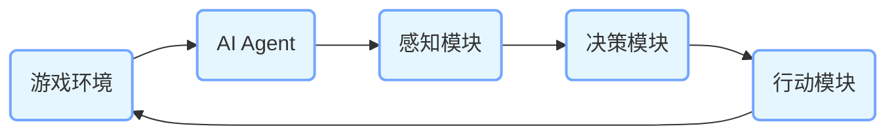

# AI Agent在游戏产业中的应用

> 关键词：AI Agent、游戏产业、人工智能、游戏开发、智能决策、游戏体验

> 摘要：本文深入探讨了AI Agent在游戏产业中的应用。首先介绍了相关背景，包括目的范围、预期读者等。接着阐述了AI Agent的核心概念与联系，给出了原理和架构的示意图与流程图。详细讲解了核心算法原理及具体操作步骤，并用Python代码进行说明。分析了相关的数学模型和公式，并举例说明。通过项目实战展示了代码实际案例及详细解释。探讨了AI Agent在游戏产业中的实际应用场景，推荐了学习资源、开发工具框架和相关论文著作。最后总结了未来发展趋势与挑战，提供了常见问题解答和扩展阅读参考资料，旨在为读者全面呈现AI Agent在游戏产业中的重要性和应用潜力。

## 1. 背景介绍 
### 1.1 目的和范围
本文章的目的在于全面且深入地探究AI Agent在游戏产业中的应用。随着人工智能技术的飞速发展，AI Agent在游戏领域展现出了巨大的潜力和价值。我们将研究AI Agent在游戏开发的各个环节，如游戏角色行为控制、游戏难度自适应调整、游戏剧情生成等方面的具体应用方式和效果。同时，也会探讨AI Agent在提升游戏玩家体验、推动游戏产业创新发展等方面的作用。范围涵盖了各类游戏类型，包括单机游戏、网络游戏、移动端游戏等，以及不同的游戏开发阶段，从概念设计到实际运营。

### 1.2 预期读者
本文预期读者主要包括游戏开发者、人工智能研究者、游戏行业从业者以及对游戏和人工智能结合感兴趣的技术爱好者。对于游戏开发者来说，文章可以为他们在游戏开发过程中引入AI Agent提供思路和技术参考；人工智能研究者能从游戏产业的应用场景中获得新的研究方向和灵感；游戏行业从业者可以了解行业的最新发展趋势，为公司的战略决策提供依据；而技术爱好者则可以通过本文了解到AI Agent在游戏中的神奇应用，拓宽自己的知识面。

### 1.3 文档结构概述
本文将按照以下结构展开：首先介绍AI Agent和游戏产业相关的核心概念以及它们之间的联系，并给出相应的示意图和流程图；接着详细讲解AI Agent的核心算法原理和具体操作步骤，同时用Python代码进行说明；然后分析与AI Agent相关的数学模型和公式，并举例说明其应用；通过一个项目实战展示AI Agent在游戏中的具体实现和代码解读；探讨AI Agent在游戏产业中的实际应用场景；推荐学习资源、开发工具框架和相关论文著作；最后总结AI Agent在游戏产业中的未来发展趋势与挑战，提供常见问题解答和扩展阅读参考资料。

### 1.4 术语表
#### 1.4.1 核心术语定义
- **AI Agent（人工智能代理）**：是一种能够感知环境、根据感知信息做出决策并采取行动以实现特定目标的智能实体。在游戏中，AI Agent可以是游戏角色、游戏系统等，它能够根据游戏中的各种情况自主地做出行为选择。
- **游戏产业**：指与游戏的开发、运营、销售等相关的一系列产业活动，包括游戏开发公司、游戏平台、游戏媒体等。
- **强化学习**：是一种机器学习方法，智能体通过与环境进行交互，根据环境反馈的奖励信号来学习最优的行为策略。在游戏中，AI Agent可以使用强化学习来学习如何在不同的游戏状态下做出最佳决策。

#### 1.4.2 相关概念解释
- **智能决策**：AI Agent根据游戏环境的状态和自身的目标，运用一定的算法和策略来选择最优的行动方案。例如，在策略游戏中，AI Agent需要根据敌我双方的兵力、资源等情况决定出兵的方向和时机。
- **游戏体验**：玩家在玩游戏过程中的感受和满意度，包括游戏的趣味性、挑战性、沉浸感等方面。AI Agent的应用可以通过调整游戏难度、生成个性化剧情等方式来提升玩家的游戏体验。

#### 1.4.3 缩略词列表
- **RL**：强化学习（Reinforcement Learning）
- **ML**：机器学习（Machine Learning）
- **NN**：神经网络（Neural Network）

## 2. 核心概念与联系 
### 核心概念原理
AI Agent的核心原理基于人工智能的相关技术，主要包括感知、决策和行动三个方面。感知模块负责收集游戏环境的信息，例如游戏中的地图布局、角色位置、资源分布等。决策模块根据感知到的信息，运用一定的算法和策略来选择合适的行动。行动模块则将决策结果转化为具体的游戏操作，如移动、攻击、使用技能等。

在游戏中，AI Agent可以是单个的游戏角色，也可以是整个游戏系统的一部分。例如，在角色扮演游戏中，非玩家角色（NPC）可以作为AI Agent，它们根据玩家的行为和游戏剧情做出相应的反应；在策略游戏中，游戏的AI系统可以作为一个大的AI Agent，负责管理游戏中的各种资源和制定战略。

### 架构的文本示意图
```plaintext
          +----------------+
          |   游戏环境    |
          +----------------+
                 |
                 v
+------------------------+
|      AI Agent         |
| +------------------+  |
| |    感知模块      |  |
| +------------------+  |
|         |             |
|         v             |
| +------------------+  |
| |    决策模块      |  |
| +------------------+  |
|         |             |
|         v             |
| +------------------+  |
| |    行动模块      |  |
| +------------------+  |
+------------------------+
                 |
                 v
          +----------------+
          |   游戏环境    |
          +----------------+
```

### Mermaid流程图


这个流程图清晰地展示了AI Agent与游戏环境之间的交互过程。AI Agent从游戏环境中获取信息，经过感知、决策和行动三个模块的处理后，再将行动结果反馈给游戏环境，形成一个闭环的交互系统。

## 3. 核心算法原理 & 具体操作步骤 
### 核心算法原理 - 强化学习
强化学习是AI Agent在游戏中常用的一种算法。强化学习的基本思想是智能体（AI Agent）通过与环境进行交互，根据环境反馈的奖励信号来学习最优的行为策略。在游戏中，智能体的目标是最大化长期累积奖励。

强化学习的核心要素包括状态（State）、动作（Action）、奖励（Reward）和策略（Policy）。状态表示游戏环境的当前情况，动作是智能体可以采取的操作，奖励是环境对智能体动作的反馈，策略是智能体根据状态选择动作的规则。

### Python代码详细阐述
以下是一个简单的基于强化学习的AI Agent在迷宫游戏中的示例代码：

```python
import numpy as np

# 迷宫环境定义
class MazeEnv:
    def __init__(self):
        # 迷宫地图，0表示通路，1表示墙壁
        self.maze = np.array([
            [0, 1, 0, 0],
            [0, 1, 0, 1],
            [0, 0, 0, 0],
            [0, 1, 1, 0]
        ])
        self.start_state = (0, 0)
        self.goal_state = (3, 3)
        self.current_state = self.start_state

    def reset(self):
        self.current_state = self.start_state
        return self.current_state

    def step(self, action):
        x, y = self.current_state
        if action == 0:  # 上
            new_x, new_y = x - 1, y
        elif action == 1:  # 下
            new_x, new_y = x + 1, y
        elif action == 2:  # 左
            new_x, new_y = x, y - 1
        elif action == 3:  # 右
            new_x, new_y = x, y + 1

        # 检查新位置是否合法
        if 0 <= new_x < self.maze.shape[0] and 0 <= new_y < self.maze.shape[1] and self.maze[new_x, new_y] == 0:
            self.current_state = (new_x, new_y)
        else:
            pass

        # 判断是否到达目标
        if self.current_state == self.goal_state:
            reward = 10
            done = True
        else:
            reward = -1
            done = False

        return self.current_state, reward, done

# Q学习算法实现
class QLearningAgent:
    def __init__(self, env, learning_rate=0.1, discount_factor=0.9, epsilon=0.1):
        self.env = env
        self.learning_rate = learning_rate
        self.discount_factor = discount_factor
        self.epsilon = epsilon
        # 初始化Q表
        self.q_table = np.zeros((env.maze.shape[0] * env.maze.shape[1], 4))

    def get_state_index(self, state):
        x, y = state
        return x * self.env.maze.shape[1] + y

    def choose_action(self, state):
        if np.random.uniform(0, 1) < self.epsilon:
            # 探索：随机选择动作
            action = np.random.choice(4)
        else:
            # 利用：选择Q值最大的动作
            state_index = self.get_state_index(state)
            action = np.argmax(self.q_table[state_index])
        return action

    def learn(self, state, action, reward, next_state, done):
        state_index = self.get_state_index(state)
        next_state_index = self.get_state_index(next_state)
        # Q学习更新公式
        if done:
            target = reward
        else:
            target = reward + self.discount_factor * np.max(self.q_table[next_state_index])
        self.q_table[state_index, action] += self.learning_rate * (target - self.q_table[state_index, action])

# 训练过程
env = MazeEnv()
agent = QLearningAgent(env)

num_episodes = 1000
for episode in range(num_episodes):
    state = env.reset()
    done = False
    while not done:
        action = agent.choose_action(state)
        next_state, reward, done = env.step(action)
        agent.learn(state, action, reward, next_state, done)
        state = next_state

# 测试过程
state = env.reset()
done = False
while not done:
    action = agent.choose_action(state)
    next_state, reward, done = env.step(action)
    print(f"State: {state}, Action: {action}")
    state = next_state
```

### 具体操作步骤
1. **环境定义**：定义游戏环境，包括游戏的状态空间、动作空间和奖励函数。在迷宫游戏中，状态是迷宫中智能体的位置，动作是上下左右移动，奖励根据是否到达目标和移动情况而定。
2. **智能体初始化**：初始化AI Agent，包括Q表、学习率、折扣因子和探索率等参数。
3. **训练过程**：在多个回合中，智能体与环境进行交互，根据当前状态选择动作，执行动作后得到新的状态和奖励，然后使用Q学习算法更新Q表。
4. **测试过程**：训练完成后，使用训练好的Q表进行测试，观察智能体在游戏中的表现。

## 4. 数学模型和公式 & 详细讲解 & 举例说明 
### Q学习算法的数学模型和公式
Q学习算法是一种基于值函数的强化学习算法，其核心是学习一个Q值函数 $Q(s, a)$，表示在状态 $s$ 下采取动作 $a$ 的期望累积奖励。

Q学习的更新公式为：
$$Q(s_t, a_t) \leftarrow Q(s_t, a_t) + \alpha [r_{t+1} + \gamma \max_{a} Q(s_{t+1}, a) - Q(s_t, a_t)]$$

其中：
- $s_t$ 是当前状态
- $a_t$ 是当前动作
- $r_{t+1}$ 是执行动作 $a_t$ 后得到的即时奖励
- $s_{t+1}$ 是执行动作 $a_t$ 后转移到的下一个状态
- $\alpha$ 是学习率，控制每次更新的步长
- $\gamma$ 是折扣因子，用于权衡即时奖励和未来奖励的重要性

### 详细讲解
Q学习的目标是找到一个最优的Q值函数 $Q^*(s, a)$，使得在任何状态下选择Q值最大的动作能够最大化长期累积奖励。在每次交互中，智能体根据当前的Q值函数选择动作，执行动作后得到奖励和新的状态，然后使用更新公式更新Q值。

学习率 $\alpha$ 决定了新的经验对Q值更新的影响程度。如果 $\alpha$ 较大，智能体更倾向于相信新的经验；如果 $\alpha$ 较小，智能体更依赖于过去的经验。折扣因子 $\gamma$ 表示未来奖励的重要性。如果 $\gamma$ 接近1，智能体更注重长期奖励；如果 $\gamma$ 接近0，智能体更关注即时奖励。

### 举例说明
假设在迷宫游戏中，智能体当前处于状态 $s_t$，选择动作 $a_t$ 后移动到状态 $s_{t+1}$，并得到奖励 $r_{t+1} = -1$。当前的Q值 $Q(s_t, a_t) = 5$，下一个状态的最大Q值 $\max_{a} Q(s_{t+1}, a) = 3$，学习率 $\alpha = 0.1$，折扣因子 $\gamma = 0.9$。

根据Q学习更新公式：
$$Q(s_t, a_t) \leftarrow 5 + 0.1 [-1 + 0.9 \times 3 - 5]$$
$$Q(s_t, a_t) \leftarrow 5 + 0.1 [-1 + 2.7 - 5]$$
$$Q(s_t, a_t) \leftarrow 5 + 0.1 [-3.3]$$
$$Q(s_t, a_t) \leftarrow 5 - 0.33 = 4.67$$

通过不断地交互和更新，Q值函数会逐渐收敛到最优值，智能体也会学习到最优的行为策略。

## 5. 项目实战：代码实际案例和详细解释说明 
### 5.1  开发环境搭建
本项目使用Python进行开发，需要安装以下库：
- **NumPy**：用于数值计算和数组操作。可以使用以下命令安装：
```sh
pip install numpy
```

### 5.2  源代码详细实现和代码解读
```python
import numpy as np

# 迷宫环境定义
class MazeEnv:
    def __init__(self):
        # 迷宫地图，0表示通路，1表示墙壁
        self.maze = np.array([
            [0, 1, 0, 0],
            [0, 1, 0, 1],
            [0, 0, 0, 0],
            [0, 1, 1, 0]
        ])
        self.start_state = (0, 0)
        self.goal_state = (3, 3)
        self.current_state = self.start_state

    def reset(self):
        self.current_state = self.start_state
        return self.current_state

    def step(self, action):
        x, y = self.current_state
        if action == 0:  # 上
            new_x, new_y = x - 1, y
        elif action == 1:  # 下
            new_x, new_y = x + 1, y
        elif action == 2:  # 左
            new_x, new_y = x, y - 1
        elif action == 3:  # 右
            new_x, new_y = x, y + 1

        # 检查新位置是否合法
        if 0 <= new_x < self.maze.shape[0] and 0 <= new_y < self.maze.shape[1] and self.maze[new_x, new_y] == 0:
            self.current_state = (new_x, new_y)
        else:
            pass

        # 判断是否到达目标
        if self.current_state == self.goal_state:
            reward = 10
            done = True
        else:
            reward = -1
            done = False

        return self.current_state, reward, done

# Q学习算法实现
class QLearningAgent:
    def __init__(self, env, learning_rate=0.1, discount_factor=0.9, epsilon=0.1):
        self.env = env
        self.learning_rate = learning_rate
        self.discount_factor = discount_factor
        self.epsilon = epsilon
        # 初始化Q表
        self.q_table = np.zeros((env.maze.shape[0] * env.maze.shape[1], 4))

    def get_state_index(self, state):
        x, y = state
        return x * self.env.maze.shape[1] + y

    def choose_action(self, state):
        if np.random.uniform(0, 1) < self.epsilon:
            # 探索：随机选择动作
            action = np.random.choice(4)
        else:
            # 利用：选择Q值最大的动作
            state_index = self.get_state_index(state)
            action = np.argmax(self.q_table[state_index])
        return action

    def learn(self, state, action, reward, next_state, done):
        state_index = self.get_state_index(state)
        next_state_index = self.get_state_index(next_state)
        # Q学习更新公式
        if done:
            target = reward
        else:
            target = reward + self.discount_factor * np.max(self.q_table[next_state_index])
        self.q_table[state_index, action] += self.learning_rate * (target - self.q_table[state_index, action])

# 训练过程
env = MazeEnv()
agent = QLearningAgent(env)

num_episodes = 1000
for episode in range(num_episodes):
    state = env.reset()
    done = False
    while not done:
        action = agent.choose_action(state)
        next_state, reward, done = env.step(action)
        agent.learn(state, action, reward, next_state, done)
        state = next_state

# 测试过程
state = env.reset()
done = False
while not done:
    action = agent.choose_action(state)
    next_state, reward, done = env.step(action)
    print(f"State: {state}, Action: {action}")
    state = next_state
```

### 代码解读与分析
#### 迷宫环境类 `MazeEnv`
- `__init__` 方法：初始化迷宫地图、起始状态、目标状态和当前状态。
- `reset` 方法：将当前状态重置为起始状态，并返回起始状态。
- `step` 方法：根据输入的动作更新当前状态，检查新位置是否合法，判断是否到达目标，返回新状态、奖励和是否结束的标志。

#### Q学习智能体类 `QLearningAgent`
- `__init__` 方法：初始化环境、学习率、折扣因子、探索率和Q表。
- `get_state_index` 方法：将状态转换为Q表中的索引。
- `choose_action` 方法：根据探索率选择动作，以一定概率进行随机探索，否则选择Q值最大的动作。
- `learn` 方法：根据Q学习更新公式更新Q表。

#### 训练和测试过程
- 训练过程：在多个回合中，智能体与环境进行交互，不断更新Q表。
- 测试过程：使用训练好的Q表进行测试，观察智能体在游戏中的表现。

通过这个项目实战，我们可以看到如何使用强化学习算法实现一个简单的AI Agent在迷宫游戏中的应用。

## 6. 实际应用场景 
### 游戏角色行为控制
在角色扮演游戏（RPG）中，非玩家角色（NPC）可以作为AI Agent。这些NPC可以根据玩家的行为和游戏剧情做出不同的反应。例如，在一个开放世界的RPG游戏中，NPC可以有自己的日常生活，如工作、休息、购物等。当玩家与NPC互动时，NPC可以根据玩家的身份、对话内容等因素做出相应的回应，从而增加游戏的真实感和趣味性。

### 游戏难度自适应调整
AI Agent可以根据玩家的游戏水平和表现动态调整游戏难度。在动作游戏中，如果玩家连续多次成功通关，AI Agent可以增加敌人的攻击力、速度等属性，提高游戏的挑战性；如果玩家频繁失败，AI Agent可以降低敌人的难度，让玩家更容易获得成就感。这种自适应调整可以使游戏保持适当的难度，提高玩家的游戏体验。

### 游戏剧情生成
AI Agent可以根据玩家的选择和游戏的进展生成个性化的剧情。在冒险游戏中，玩家的每一个决策都可能影响游戏的剧情走向。AI Agent可以根据玩家的决策，结合游戏的设定和规则，生成不同的剧情分支和结局。这样，每个玩家的游戏体验都是独一无二的，增加了游戏的重玩性。

### 游戏平衡性调整
在多人在线竞技游戏中，AI Agent可以用于游戏平衡性调整。通过分析玩家的游戏数据，如胜率、击杀数、死亡数等，AI Agent可以发现游戏中存在的不平衡问题，如某些英雄过于强大或弱小。然后，AI Agent可以提出调整建议，如修改英雄的技能属性、调整游戏地图等，以保证游戏的公平性和竞技性。

## 7. 工具和资源推荐
### 7.1 学习资源推荐
#### 7.1.1 书籍推荐
- 《强化学习：原理与Python实现》：本书详细介绍了强化学习的基本原理和算法，并提供了大量的Python代码示例，适合初学者学习强化学习。
- 《人工智能：一种现代的方法》：这是一本经典的人工智能教材，涵盖了人工智能的各个领域，包括机器学习、自然语言处理、计算机视觉等，对于深入理解AI Agent的原理和应用有很大帮助。

#### 7.1.2 在线课程
- Coursera上的“强化学习专项课程”：由知名教授授课，系统地介绍了强化学习的理论和实践，通过在线实验和作业帮助学习者掌握强化学习的核心知识。
- edX上的“人工智能基础”：该课程涵盖了人工智能的基本概念、算法和应用，为学习者提供了一个全面的人工智能入门学习路径。

#### 7.1.3 技术博客和网站
- OpenAI博客：OpenAI是人工智能领域的知名研究机构，其博客上发布了许多关于人工智能最新研究成果和应用案例的文章，对于了解AI Agent在游戏产业中的前沿动态非常有帮助。
- Medium上的人工智能相关文章：Medium上有许多人工智能领域的专家和爱好者分享他们的研究成果和经验，通过阅读这些文章可以拓宽自己的知识面。

### 7.2 开发工具框架推荐
#### 7.2.1 IDE和编辑器
- PyCharm：是一款专业的Python集成开发环境，提供了丰富的代码编辑、调试、版本控制等功能，非常适合Python开发。
- Visual Studio Code：是一款轻量级的代码编辑器，支持多种编程语言，通过安装Python扩展可以方便地进行Python开发。

#### 7.2.2 调试和性能分析工具
- PDB：是Python自带的调试器，可以帮助开发者定位代码中的问题。
- cProfile：是Python的性能分析工具，可以分析代码的运行时间和函数调用情况，帮助开发者优化代码性能。

#### 7.2.3 相关框架和库
- OpenAI Gym：是一个用于开发和比较强化学习算法的工具包，提供了许多经典的游戏环境，方便开发者进行强化学习实验。
- Stable Baselines3：是一个基于PyTorch的强化学习库，提供了多种预训练的强化学习算法和模型，方便开发者快速实现强化学习应用。

### 7.3 相关论文著作推荐
#### 7.3.1 经典论文
- “Playing Atari with Deep Reinforcement Learning”：这篇论文提出了深度Q网络（DQN）算法，首次将深度学习和强化学习结合起来，在Atari游戏上取得了很好的效果，开创了深度强化学习的先河。
- “Mastering the Game of Go with Deep Neural Networks and Tree Search”：该论文介绍了AlphaGo的实现原理，通过结合深度神经网络和蒙特卡罗树搜索算法，AlphaGo在围棋比赛中击败了人类世界冠军，展示了人工智能在复杂游戏中的强大能力。

#### 7.3.2 最新研究成果
- 关注NeurIPS、ICML、AAAI等人工智能顶级学术会议上的论文，这些会议上会发布许多关于AI Agent在游戏产业中的最新研究成果。

#### 7.3.3 应用案例分析
- 一些游戏开发公司会在其官方博客或学术会议上分享他们在游戏中应用AI Agent的案例和经验，通过阅读这些案例可以了解AI Agent在实际游戏开发中的应用方法和效果。

## 8. 总结：未来发展趋势与挑战
### 未来发展趋势
- **更加智能化和个性化**：未来的AI Agent将更加智能化，能够更好地理解玩家的意图和需求，提供更加个性化的游戏体验。例如，根据玩家的游戏习惯和偏好生成专属的游戏剧情和任务。
- **与虚拟现实和增强现实技术结合**：随着虚拟现实（VR）和增强现实（AR）技术的发展，AI Agent将与这些技术深度融合，为玩家带来更加沉浸式的游戏体验。例如，在VR游戏中，AI Agent可以根据玩家的身体动作和表情做出更加真实的反应。
- **多智能体协作与竞争**：在多人游戏中，多个AI Agent之间可以进行协作和竞争，模拟更加复杂的社交和战略场景。例如，在策略游戏中，多个AI Agent可以组成联盟共同对抗玩家或其他AI Agent联盟。

### 挑战
- **计算资源需求**：AI Agent的训练和运行需要大量的计算资源，尤其是深度强化学习算法。如何在有限的计算资源下提高AI Agent的性能是一个挑战。
- **伦理和安全问题**：随着AI Agent在游戏中的应用越来越广泛，伦理和安全问题也日益凸显。例如，AI Agent可能会产生不道德的行为或被恶意利用，如何确保AI Agent的行为符合伦理和安全标准是一个需要解决的问题。
- **数据隐私问题**：AI Agent的训练需要大量的数据，这些数据可能包含玩家的个人信息。如何保护玩家的数据隐私，防止数据泄露是一个重要的挑战。

## 9. 附录：常见问题与解答
### 问题1：AI Agent在游戏中一定比人类玩家更厉害吗？
解答：不一定。虽然AI Agent可以通过大量的训练和优化获得很高的游戏水平，但在某些情况下，人类玩家仍然具有优势。例如，在一些需要创造性和情感理解的游戏中，人类玩家的直觉和创造力可能会使他们表现得更好。此外，游戏的规则和环境也会影响AI Agent的表现，如果游戏规则复杂多变，AI Agent可能需要更多的时间和数据来学习和适应。

### 问题2：如何评估AI Agent在游戏中的性能？
解答：可以从多个方面评估AI Agent在游戏中的性能。常见的评估指标包括胜率、得分、完成任务的时间等。此外，还可以观察AI Agent的行为是否合理、是否具有策略性等。在一些复杂的游戏中，还可以使用人类玩家的表现作为参考，比较AI Agent和人类玩家的差距。

### 问题3：AI Agent的训练时间一般需要多久？
解答：AI Agent的训练时间取决于多种因素，如游戏的复杂度、算法的类型、训练数据的规模等。对于简单的游戏和算法，训练时间可能只需要几分钟或几小时；而对于复杂的游戏和深度强化学习算法，训练时间可能需要几天、几周甚至几个月。可以通过优化算法、增加计算资源等方式来缩短训练时间。

## 10. 扩展阅读 & 参考资料
### 扩展阅读
- 《游戏人工智能编程案例精粹》：本书通过大量的案例详细介绍了游戏人工智能的编程方法和技巧，对于深入了解AI Agent在游戏中的应用有很大帮助。
- 《深度学习》：这本书是深度学习领域的经典著作，对于理解AI Agent中使用的深度学习算法有重要的参考价值。

### 参考资料
- Sutton, R. S., & Barto, A. G. (2018). Reinforcement learning: An introduction. MIT press.
- Goodfellow, I. J., Bengio, Y., & Courville, A. (2016). Deep learning. MIT press.
- OpenAI官方文档和博客文章。

作者：AI天才研究院/AI Genius Institute & 禅与计算机程序设计艺术 /Zen And The Art of Computer Programming