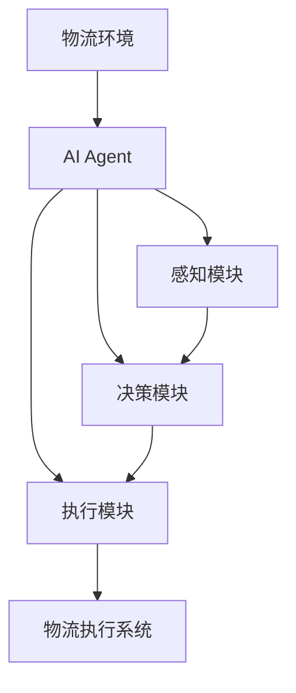

# AI Agent在物流管理中的应用：路线优化与库存预测

> 关键词：AI Agent、物流管理、路线优化、库存预测、智能决策

> 摘要：本文深入探讨了AI Agent在物流管理领域的重要应用，聚焦于路线优化和库存预测两个关键方面。详细阐述了AI Agent的核心概念、算法原理，结合数学模型和实际案例，展示了其在物流场景中的具体实现。同时分析了AI Agent在物流管理中的实际应用场景，推荐了相关的学习资源、开发工具和论文著作。最后对AI Agent在物流管理未来的发展趋势与挑战进行了总结，为物流行业的智能化转型提供了全面的技术参考。

## 1. 背景介绍 
### 1.1 目的和范围
随着全球经济的快速发展，物流行业作为连接生产与消费的重要环节，面临着越来越高的效率和成本控制要求。路线优化和库存预测是物流管理中的两个核心问题，直接影响着物流企业的运营成本和服务质量。本文章旨在深入探讨AI Agent技术在这两个关键领域的应用，通过详细的技术分析和实际案例展示，为物流企业提供可行的解决方案和技术指导。文章将涵盖AI Agent的基本概念、算法原理、数学模型、实际应用场景以及相关的工具和资源推荐等方面。

### 1.2 预期读者
本文预期读者包括物流行业的管理人员、技术人员，对物流智能化感兴趣的研究人员，以及计算机科学、人工智能等相关专业的学生和从业者。希望通过本文的介绍，能帮助读者了解AI Agent在物流管理中的应用原理和实践方法，为物流行业的智能化升级提供思路和技术支持。

### 1.3 文档结构概述
本文将按照以下结构进行组织：首先介绍背景信息，包括目的、预期读者和文档结构概述；接着阐述AI Agent的核心概念及其与物流管理的联系；然后详细讲解AI Agent在路线优化和库存预测中的核心算法原理和具体操作步骤，并给出相应的Python代码示例；随后介绍相关的数学模型和公式，并进行详细讲解和举例说明；通过项目实战部分展示代码的实际应用和详细解释；分析AI Agent在物流管理中的实际应用场景；推荐相关的学习资源、开发工具和论文著作；最后总结AI Agent在物流管理中的未来发展趋势与挑战，并提供常见问题解答和扩展阅读参考资料。

### 1.4 术语表
#### 1.4.1 核心术语定义
- **AI Agent（人工智能智能体）**：是一种能够感知环境、根据感知信息进行决策并执行相应动作的智能实体。在物流管理中，AI Agent可以通过收集物流数据，如订单信息、交通状况、库存水平等，进行分析和决策，以优化物流运营。
- **路线优化**：指在物流运输过程中，通过合理规划运输路线，减少运输距离、时间和成本，提高运输效率的过程。
- **库存预测**：根据历史销售数据、市场需求趋势等信息，预测未来一段时间内的库存需求，以便合理安排库存水平，避免库存积压或缺货现象的发生。

#### 1.4.2 相关概念解释
- **智能决策**：AI Agent根据感知到的环境信息和预设的目标，运用算法和模型进行分析和推理，做出最优决策的过程。
- **强化学习**：一种机器学习方法，智能体通过与环境进行交互，根据环境反馈的奖励信号来学习最优策略，以最大化长期累积奖励。在路线优化和库存预测中，强化学习可以用于训练AI Agent找到最优的运输路线和库存管理策略。

#### 1.4.3 缩略词列表
- **GPS（Global Positioning System）**：全球定位系统，用于获取车辆的位置信息，为路线优化提供基础数据。
- **RFID（Radio Frequency Identification）**：射频识别技术，可用于实时跟踪货物的位置和状态，提高库存管理的准确性。

## 2. 核心概念与联系 
### 核心概念原理
AI Agent是人工智能领域的一个重要概念，它具有自主性、反应性、社会性和主动性等特点。在物流管理中，AI Agent可以看作是一个智能的决策者，它通过传感器或数据接口感知物流环境中的各种信息，如订单信息、车辆位置、库存水平等，然后运用内置的算法和模型对这些信息进行分析和处理，做出最优的决策，如选择最佳的运输路线、确定合理的库存水平等。

AI Agent的工作原理可以分为三个主要步骤：感知、决策和执行。在感知阶段，AI Agent收集物流环境中的各种数据；在决策阶段，AI Agent根据预设的目标和规则，运用算法对感知到的数据进行分析，生成最优决策；在执行阶段，AI Agent将决策结果转化为具体的行动，如调度车辆、调整库存等。

### 架构的文本示意图
```plaintext
+----------------------+
|        物流环境       |
| (订单、交通、库存等)  |
+----------------------+
           |
           v
+----------------------+
|      AI Agent        |
|  +----------------+  |
|  |    感知模块    |  |
|  +----------------+  |
|  |    决策模块    |  |
|  +----------------+  |
|  |    执行模块    |  |
|  +----------------+  |
+----------------------+
           |
           v
+----------------------+
|    物流执行系统      |
| (车辆调度、库存管理) |
+----------------------+
```

### Mermaid流程图


### 与物流管理的联系
在物流管理中，路线优化和库存预测是两个关键的任务，而AI Agent可以为这两个任务提供强大的支持。在路线优化方面，AI Agent可以实时感知交通状况、车辆位置等信息，运用优化算法计算出最佳的运输路线，从而提高运输效率，降低运输成本。在库存预测方面，AI Agent可以分析历史销售数据、市场趋势等信息，预测未来的库存需求，帮助企业合理安排库存水平，减少库存积压和缺货现象的发生。

## 3. 核心算法原理 & 具体操作步骤 

### 路线优化算法原理及Python实现
#### 算法原理
路线优化问题可以抽象为一个组合优化问题，如旅行商问题（TSP）或车辆路径问题（VRP）。在实际应用中，通常采用启发式算法来求解这些问题，因为精确算法在大规模问题上的计算复杂度较高。其中，遗传算法是一种常用的启发式算法，它模拟了生物进化的过程，通过选择、交叉和变异等操作，不断优化解决方案。

#### 具体操作步骤
1. **编码**：将运输路线表示为一个染色体，每个基因表示一个运输节点的访问顺序。
2. **初始化种群**：随机生成一组初始染色体作为种群。
3. **适应度评估**：计算每个染色体的适应度值，通常用路线的总长度或总成本来表示。
4. **选择操作**：根据适应度值选择一部分染色体作为父代，用于生成下一代。
5. **交叉操作**：对选择的父代染色体进行交叉，生成新的子代染色体。
6. **变异操作**：对子代染色体进行变异，引入新的基因组合。
7. **更新种群**：用子代染色体替换部分父代染色体，更新种群。
8. **终止条件判断**：如果满足终止条件（如达到最大迭代次数或适应度值收敛），则停止迭代，输出最优解；否则，返回步骤3。

#### Python代码实现
```python
import random
import math

# 定义城市坐标
cities = [(0, 0), (1, 5), (2, 3), (5, 1), (6, 4)]

# 计算两个城市之间的距离
def distance(city1, city2):
    x1, y1 = city1
    x2, y2 = city2
    return math.sqrt((x1 - x2) ** 2 + (y1 - y2) ** 2)

# 计算路线的总长度
def total_distance(route):
    dist = 0
    for i in range(len(route) - 1):
        dist += distance(cities[route[i]], cities[route[i + 1]])
    dist += distance(cities[route[-1]], cities[route[0]])
    return dist

# 初始化种群
def initialize_population(pop_size, num_cities):
    population = []
    for _ in range(pop_size):
        route = list(range(num_cities))
        random.shuffle(route)
        population.append(route)
    return population

# 选择操作（轮盘赌选择）
def selection(population):
    fitness_values = [1 / total_distance(route) for route in population]
    total_fitness = sum(fitness_values)
    probabilities = [fitness / total_fitness for fitness in fitness_values]
    selected = []
    for _ in range(len(population)):
        r = random.random()
        cumulative_prob = 0
        for i, prob in enumerate(probabilities):
            cumulative_prob += prob
            if cumulative_prob >= r:
                selected.append(population[i])
                break
    return selected

# 交叉操作（顺序交叉）
def crossover(parent1, parent2):
    start, end = sorted(random.sample(range(len(parent1)), 2))
    child = [-1] * len(parent1)
    child[start:end] = parent1[start:end]
    remaining = [city for city in parent2 if city not in child[start:end]]
    index = 0
    for i in range(len(child)):
        if child[i] == -1:
            child[i] = remaining[index]
            index += 1
    return child

# 变异操作（交换变异）
def mutation(route):
    index1, index2 = random.sample(range(len(route)), 2)
    route[index1], route[index2] = route[index2], route[index1]
    return route

# 遗传算法主函数
def genetic_algorithm(pop_size, num_generations):
    num_cities = len(cities)
    population = initialize_population(pop_size, num_cities)
    for _ in range(num_generations):
        selected = selection(population)
        new_population = []
        for i in range(0, len(selected), 2):
            parent1 = selected[i]
            parent2 = selected[i + 1]
            child1 = crossover(parent1, parent2)
            child2 = crossover(parent2, parent1)
            child1 = mutation(child1)
            child2 = mutation(child2)
            new_population.extend([child1, child2])
        population = new_population
    best_route = min(population, key=lambda x: total_distance(x))
    return best_route

# 运行遗传算法
pop_size = 100
num_generations = 200
best_route = genetic_algorithm(pop_size, num_generations)
print("最佳路线:", best_route)
print("总距离:", total_distance(best_route))
```

### 库存预测算法原理及Python实现
#### 算法原理
库存预测可以采用时间序列分析方法，如ARIMA（Autoregressive Integrated Moving Average）模型。ARIMA模型是一种常用的时间序列预测模型，它结合了自回归（AR）、差分（I）和移动平均（MA）三个部分，能够对具有一定趋势和季节性的时间序列数据进行有效预测。

#### 具体操作步骤
1. **数据预处理**：对历史销售数据进行清洗、平滑处理，去除异常值和噪声。
2. **模型识别**：通过观察时间序列的自相关函数（ACF）和偏自相关函数（PACF），确定ARIMA模型的参数 $p$、$d$ 和 $q$。
3. **模型拟合**：使用确定的参数对ARIMA模型进行拟合，估计模型的系数。
4. **模型评估**：使用测试数据对拟合好的模型进行评估，计算预测误差，如均方误差（MSE）、平均绝对误差（MAE）等。
5. **预测**：使用拟合好的模型对未来的库存需求进行预测。

#### Python代码实现
```python
import pandas as pd
from statsmodels.tsa.arima.model import ARIMA
import numpy as np

# 生成示例数据
data = [10, 12, 15, 13, 16, 18, 20, 22, 25, 23]
index = pd.date_range(start='2023-01-01', periods=len(data), freq='M')
series = pd.Series(data, index=index)

# 数据预处理
# 这里可以进行更复杂的预处理操作，如平滑处理、去除异常值等

# 模型识别
# 这里简单假设已经确定了参数 p=1, d=0, q=1
p = 1
d = 0
q = 1

# 模型拟合
model = ARIMA(series, order=(p, d, q))
model_fit = model.fit()

# 模型评估
# 划分训练集和测试集
train_size = int(len(series) * 0.8)
train, test = series[:train_size], series[train_size:]
history = [x for x in train]
predictions = []
for t in range(len(test)):
    model = ARIMA(history, order=(p, d, q))
    model_fit = model.fit()
    output = model_fit.forecast()
    yhat = output[0]
    predictions.append(yhat)
    obs = test[t]
    history.append(obs)
# 计算均方误差
mse = np.mean((np.array(predictions) - np.array(test)) ** 2)
print("均方误差:", mse)

# 预测未来3个月的库存需求
forecast_steps = 3
forecast = model_fit.get_forecast(steps=forecast_steps)
forecast_mean = forecast.predicted_mean
print("未来3个月的库存需求预测:", forecast_mean)
```

## 4. 数学模型和公式 & 详细讲解 & 举例说明 

### 路线优化的数学模型
#### 旅行商问题（TSP）
旅行商问题是一个经典的组合优化问题，其目标是找到一条遍历所有城市且每个城市仅访问一次，最后回到起始城市的最短路径。设 $n$ 为城市的数量，$d_{ij}$ 表示城市 $i$ 到城市 $j$ 的距离，$x_{ij}$ 为二进制变量，当旅行商从城市 $i$ 直接前往城市 $j$ 时，$x_{ij}=1$，否则 $x_{ij}=0$。则TSP的数学模型可以表示为：

$$
\begin{align*}
\min &\sum_{i=1}^{n}\sum_{j=1,j\neq i}^{n}d_{ij}x_{ij}\\
\text{s.t.} &\sum_{j=1,j\neq i}^{n}x_{ij}=1, \quad i = 1,2,\cdots,n\\
&\sum_{i=1,i\neq j}^{n}x_{ij}=1, \quad j = 1,2,\cdots,n\\
&\sum_{i\in S}\sum_{j\in S}x_{ij}\leq |S|-1, \quad \forall S\subset\{1,2,\cdots,n\}, 2\leq |S|\leq n - 1\\
&x_{ij}\in\{0,1\}, \quad i,j = 1,2,\cdots,n
\end{align*}
$$

其中，第一个约束条件表示每个城市必须有且仅有一条出边，第二个约束条件表示每个城市必须有且仅有一条入边，第三个约束条件是子回路消除约束，用于避免出现子回路。

#### 举例说明
假设有3个城市 $A$、$B$、$C$，它们之间的距离矩阵为：

$$
D = \begin{bmatrix}
0 & 10 & 15\\
10 & 0 & 20\\
15 & 20 & 0
\end{bmatrix}
$$

设 $x_{12}$ 表示从城市 $A$ 到城市 $B$ 的路径选择，$x_{13}$ 表示从城市 $A$ 到城市 $C$ 的路径选择，以此类推。则目标函数为：

$$
\min 10x_{12} + 15x_{13} + 10x_{21} + 20x_{23} + 15x_{31} + 20x_{32}
$$

约束条件为：

$$
\begin{align*}
x_{12} + x_{13} &= 1\\
x_{21} + x_{23} &= 1\\
x_{31} + x_{32} &= 1\\
x_{12} + x_{21} &\leq 1\\
x_{13} + x_{31} &\leq 1\\
x_{23} + x_{32} &\leq 1\\
x_{ij} &\in \{0,1\}, \quad i,j = 1,2,3
\end{align*}
$$

### 库存预测的数学模型
#### ARIMA模型
ARIMA模型的一般形式为 $ARIMA(p, d, q)$，其中 $p$ 为自回归阶数，$d$ 为差分阶数，$q$ 为移动平均阶数。设 $y_t$ 为时间序列在时刻 $t$ 的值，$\epsilon_t$ 为白噪声序列，则ARIMA模型可以表示为：

$$
\phi(B)(1 - B)^d y_t = \theta(B)\epsilon_t
$$

其中，$B$ 为滞后算子，$B^k y_t = y_{t - k}$，$\phi(B) = 1 - \phi_1 B - \cdots - \phi_p B^p$ 为自回归多项式，$\theta(B) = 1 + \theta_1 B + \cdots + \theta_q B^q$ 为移动平均多项式。

#### 举例说明
假设我们有一个时间序列数据 $y_1, y_2, \cdots, y_n$，经过差分处理后得到平稳序列 $z_t = (1 - B)^d y_t$。如果我们选择 $p = 1$，$q = 1$，则ARIMA(1, d, 1)模型可以表示为：

$$
(1 - \phi_1 B)z_t = (1 + \theta_1 B)\epsilon_t
$$

展开后得到：

$$
z_t - \phi_1 z_{t - 1} = \epsilon_t + \theta_1 \epsilon_{t - 1}
$$

通过最小二乘法等方法可以估计出参数 $\phi_1$ 和 $\theta_1$，然后就可以使用该模型对未来的时间序列值进行预测。

## 5. 项目实战：代码实际案例和详细解释说明 

### 5.1  开发环境搭建
#### 安装Python
首先需要安装Python环境，建议使用Python 3.7及以上版本。可以从Python官方网站（https://www.python.org/downloads/）下载对应操作系统的安装包，按照安装向导进行安装。

#### 安装必要的库
在命令行中使用以下命令安装所需的Python库：
```sh
pip install numpy pandas statsmodels matplotlib
```
- `numpy`：用于数值计算和数组操作。
- `pandas`：用于数据处理和分析。
- `statsmodels`：提供了各种统计模型和工具，包括ARIMA模型。
- `matplotlib`：用于数据可视化。

### 5.2  源代码详细实现和代码解读
#### 路线优化项目实战
```python
import random
import math
import matplotlib.pyplot as plt

# 定义城市坐标
cities = [(0, 0), (1, 5), (2, 3), (5, 1), (6, 4)]

# 计算两个城市之间的距离
def distance(city1, city2):
    x1, y1 = city1
    x2, y2 = city2
    return math.sqrt((x1 - x2) ** 2 + (y1 - y2) ** 2)

# 计算路线的总长度
def total_distance(route):
    dist = 0
    for i in range(len(route) - 1):
        dist += distance(cities[route[i]], cities[route[i + 1]])
    dist += distance(cities[route[-1]], cities[route[0]])
    return dist

# 初始化种群
def initialize_population(pop_size, num_cities):
    population = []
    for _ in range(pop_size):
        route = list(range(num_cities))
        random.shuffle(route)
        population.append(route)
    return population

# 选择操作（轮盘赌选择）
def selection(population):
    fitness_values = [1 / total_distance(route) for route in population]
    total_fitness = sum(fitness_values)
    probabilities = [fitness / total_fitness for fitness in fitness_values]
    selected = []
    for _ in range(len(population)):
        r = random.random()
        cumulative_prob = 0
        for i, prob in enumerate(probabilities):
            cumulative_prob += prob
            if cumulative_prob >= r:
                selected.append(population[i])
                break
    return selected

# 交叉操作（顺序交叉）
def crossover(parent1, parent2):
    start, end = sorted(random.sample(range(len(parent1)), 2))
    child = [-1] * len(parent1)
    child[start:end] = parent1[start:end]
    remaining = [city for city in parent2 if city not in child[start:end]]
    index = 0
    for i in range(len(child)):
        if child[i] == -1:
            child[i] = remaining[index]
            index += 1
    return child

# 变异操作（交换变异）
def mutation(route):
    index1, index2 = random.sample(range(len(route)), 2)
    route[index1], route[index2] = route[index2], route[index1]
    return route

# 遗传算法主函数
def genetic_algorithm(pop_size, num_generations):
    num_cities = len(cities)
    population = initialize_population(pop_size, num_cities)
    best_distances = []
    for _ in range(num_generations):
        selected = selection(population)
        new_population = []
        for i in range(0, len(selected), 2):
            parent1 = selected[i]
            parent2 = selected[i + 1]
            child1 = crossover(parent1, parent2)
            child2 = crossover(parent2, parent1)
            child1 = mutation(child1)
            child2 = mutation(child2)
            new_population.extend([child1, child2])
        population = new_population
        best_route = min(population, key=lambda x: total_distance(x))
        best_distances.append(total_distance(best_route))
    return best_route, best_distances

# 运行遗传算法
pop_size = 100
num_generations = 200
best_route, best_distances = genetic_algorithm(pop_size, num_generations)

# 绘制最佳路线
plt.figure(figsize=(10, 5))
plt.subplot(1, 2, 1)
x = [cities[i][0] for i in best_route] + [cities[best_route[0]][0]]
y = [cities[i][1] for i in best_route] + [cities[best_route[0]][1]]
plt.plot(x, y, '-o')
plt.title('最佳路线')

# 绘制最佳距离随迭代次数的变化
plt.subplot(1, 2, 2)
plt.plot(best_distances)
plt.title('最佳距离随迭代次数的变化')
plt.xlabel('迭代次数')
plt.ylabel('最佳距离')

plt.show()

print("最佳路线:", best_route)
print("总距离:", total_distance(best_route))
```
#### 代码解读
- **城市坐标定义**：`cities` 列表存储了每个城市的坐标，用于计算城市之间的距离。
- **距离计算函数**：`distance` 函数计算两个城市之间的欧几里得距离，`total_distance` 函数计算一条路线的总长度。
- **初始化种群**：`initialize_population` 函数随机生成一组初始路线作为种群。
- **选择操作**：`selection` 函数采用轮盘赌选择方法，根据路线的适应度值（即总距离的倒数）选择父代。
- **交叉操作**：`crossover` 函数采用顺序交叉方法，生成新的子代路线。
- **变异操作**：`mutation` 函数采用交换变异方法，对子代路线进行变异。
- **遗传算法主函数**：`genetic_algorithm` 函数实现了遗传算法的主要流程，包括选择、交叉、变异和种群更新等操作，并记录每一代的最佳距离。
- **可视化**：使用 `matplotlib` 库绘制最佳路线和最佳距离随迭代次数的变化曲线。

#### 库存预测项目实战
```python
import pandas as pd
from statsmodels.tsa.arima.model import ARIMA
import numpy as np
import matplotlib.pyplot as plt

# 生成示例数据
data = [10, 12, 15, 13, 16, 18, 20, 22, 25, 23]
index = pd.date_range(start='2023-01-01', periods=len(data), freq='M')
series = pd.Series(data, index=index)

# 数据预处理
# 这里可以进行更复杂的预处理操作，如平滑处理、去除异常值等

# 模型识别
# 这里简单假设已经确定了参数 p=1, d=0, q=1
p = 1
d = 0
q = 1

# 模型拟合
model = ARIMA(series, order=(p, d, q))
model_fit = model.fit()

# 模型评估
# 划分训练集和测试集
train_size = int(len(series) * 0.8)
train, test = series[:train_size], series[train_size:]
history = [x for x in train]
predictions = []
for t in range(len(test)):
    model = ARIMA(history, order=(p, d, q))
    model_fit = model.fit()
    output = model_fit.forecast()
    yhat = output[0]
    predictions.append(yhat)
    obs = test[t]
    history.append(obs)

# 计算均方误差
mse = np.mean((np.array(predictions) - np.array(test)) ** 2)
print("均方误差:", mse)

# 预测未来3个月的库存需求
forecast_steps = 3
forecast = model_fit.get_forecast(steps=forecast_steps)
forecast_mean = forecast.predicted_mean

# 绘制原始数据、预测数据和未来预测数据
plt.figure(figsize=(10, 6))
plt.plot(series, label='原始数据')
plt.plot(test.index, predictions, label='预测数据', color='red')
plt.plot(pd.date_range(start=series.index[-1], periods=forecast_steps + 1, freq='M')[1:], forecast_mean, label='未来预测数据', color='green')
plt.title('库存需求预测')
plt.xlabel('时间')
plt.ylabel('库存需求')
plt.legend()
plt.show()

print("未来3个月的库存需求预测:", forecast_mean)
```
#### 代码解读
- **数据生成**：使用 `pandas` 库生成示例时间序列数据。
- **数据预处理**：这里可以进行更复杂的预处理操作，如平滑处理、去除异常值等。
- **模型识别**：简单假设已经确定了ARIMA模型的参数 $p$、$d$ 和 $q$。
- **模型拟合**：使用 `ARIMA` 类拟合模型，并调用 `fit` 方法估计模型的系数。
- **模型评估**：将数据划分为训练集和测试集，使用滚动预测的方法进行预测，并计算均方误差。
- **未来预测**：使用 `get_forecast` 方法预测未来3个月的库存需求。
- **可视化**：使用 `matplotlib` 库绘制原始数据、预测数据和未来预测数据的曲线。

### 5.3  代码解读与分析
#### 路线优化代码分析
- **遗传算法的优势**：遗传算法具有全局搜索能力，能够在大规模的解空间中找到较优的解决方案。通过不断迭代和进化，逐步逼近最优解。
- **参数选择的影响**：种群大小和迭代次数是影响遗传算法性能的重要参数。较大的种群大小可以增加搜索的多样性，但会增加计算复杂度；较多的迭代次数可以提高解的质量，但会延长计算时间。需要根据具体问题进行合理选择。
- **交叉和变异操作的作用**：交叉操作可以将父代的优良基因组合传递给子代，增加解的多样性；变异操作可以引入新的基因组合，避免算法陷入局部最优解。

#### 库存预测代码分析
- **ARIMA模型的适用性**：ARIMA模型适用于具有一定趋势和季节性的时间序列数据。通过差分处理可以将非平稳序列转化为平稳序列，从而提高模型的预测性能。
- **参数选择的重要性**：ARIMA模型的参数 $p$、$d$ 和 $q$ 的选择对模型的性能影响较大。可以通过观察自相关函数（ACF）和偏自相关函数（PACF）来确定参数，但在实际应用中，也可以使用网格搜索等方法进行参数优化。
- **模型评估的意义**：通过模型评估可以了解模型的预测性能，选择合适的模型和参数。均方误差（MSE）是常用的评估指标之一，它反映了预测值与真实值之间的平均误差。

## 6. 实际应用场景 
### 路线优化的实际应用场景
#### 快递配送
在快递配送中，每天需要处理大量的订单，需要将包裹从仓库送到各个收件地址。AI Agent可以实时感知交通状况、车辆位置和订单信息，运用路线优化算法为快递车辆规划最佳的配送路线，提高配送效率，减少配送时间和成本。例如，快递公司可以使用AI Agent根据当天的订单分布和交通情况，为每辆快递车规划一条经过多个收件地址的最优路线，避免车辆绕路和重复行驶。

#### 物流运输
在物流运输中，货物需要从供应商运输到各个仓库或客户手中。AI Agent可以考虑货物的重量、体积、运输时间要求等因素，结合交通状况和车辆的载重能力，为运输车辆规划最优的运输路线。同时，AI Agent还可以实时调整路线，以应对交通拥堵、道路施工等突发情况。例如，物流公司可以使用AI Agent为长途运输车辆规划最优的路线，选择合适的加油站和休息点，提高运输效率和安全性。

### 库存预测的实际应用场景
#### 零售行业
在零售行业，准确的库存预测可以帮助企业合理安排库存水平，避免库存积压或缺货现象的发生。AI Agent可以分析历史销售数据、季节因素、促销活动等信息，预测未来的商品需求，为企业的采购和补货决策提供依据。例如，超市可以使用AI Agent根据历史销售数据和即将到来的节假日，预测某种商品的需求量，提前安排采购计划，确保商品的供应充足。

#### 制造业
在制造业中，库存预测对于原材料采购和生产计划的安排至关重要。AI Agent可以根据生产计划、订单需求和原材料的供应情况，预测原材料的库存需求，帮助企业合理安排采购和生产进度。例如，汽车制造企业可以使用AI Agent根据生产计划和市场需求，预测钢材、轮胎等原材料的需求量，提前与供应商签订采购合同，确保生产的顺利进行。

## 7. 工具和资源推荐
### 7.1 学习资源推荐
#### 7.1.1 书籍推荐
- 《人工智能：一种现代的方法》（Artificial Intelligence: A Modern Approach）：这是一本经典的人工智能教材，全面介绍了人工智能的各个领域，包括智能体、搜索算法、机器学习等内容，对于理解AI Agent的基本概念和算法原理非常有帮助。
- 《Python数据分析实战》（Python for Data Analysis）：本书详细介绍了使用Python进行数据分析的方法和技巧，包括数据处理、数据可视化、统计分析等内容，对于处理物流数据和实现库存预测算法非常有用。
- 《遗传算法原理及应用》：系统地介绍了遗传算法的基本原理、操作方法和应用案例，对于理解和实现路线优化中的遗传算法有很大的帮助。

#### 7.1.2 在线课程
- Coursera上的“人工智能基础”（Foundations of Artificial Intelligence）课程：由知名高校的教授授课，内容涵盖人工智能的基本概念、算法和应用，通过视频讲解、作业和项目实践，帮助学习者深入理解人工智能的知识。
- edX上的“Python数据科学入门”（Introduction to Data Science in Python）课程：介绍了使用Python进行数据科学的基础知识和技能，包括数据处理、数据分析和数据可视化等内容，适合初学者学习。
- Udemy上的“物流管理与优化”（Logistics Management and Optimization）课程：专门针对物流管理领域，介绍了物流规划、路线优化、库存管理等方面的知识和方法，结合实际案例进行讲解，具有很强的实用性。

#### 7.1.3 技术博客和网站
- Medium：是一个技术博客平台，上面有很多关于人工智能、物流管理等领域的文章，作者来自不同的行业和背景，分享了他们的经验和见解。
- Towards Data Science：专注于数据科学和人工智能领域的技术博客，提供了很多关于算法实现、数据分析和机器学习的教程和案例。
- Logistics Management：是一个专门的物流管理网站，提供了物流行业的最新动态、技术应用和管理经验等内容，对于了解物流行业的发展趋势和应用场景非常有帮助。

### 7.2 开发工具框架推荐
#### 7.2.1 IDE和编辑器
- PyCharm：是一款专业的Python集成开发环境（IDE），提供了代码编辑、调试、代码分析等功能，支持多种Python库和框架，对于开发Python代码非常方便。
- Jupyter Notebook：是一个交互式的开发环境，支持Python、R等多种编程语言，适合进行数据分析和模型开发。可以在浏览器中编写和运行代码，同时还可以插入文本、图片和公式等内容，方便进行文档记录和分享。
- Visual Studio Code：是一款轻量级的代码编辑器，支持多种编程语言和插件扩展，具有丰富的代码编辑和调试功能，适合快速开发和测试代码。

#### 7.2.2 调试和性能分析工具
- pdb：是Python自带的调试器，可以在代码中设置断点，逐步执行代码，查看变量的值和程序的执行流程，帮助定位和解决代码中的问题。
- cProfile：是Python的性能分析工具，可以统计代码中各个函数的执行时间和调用次数，帮助找出代码中的性能瓶颈，进行优化。
- TensorBoard：是TensorFlow提供的可视化工具，也可以用于其他深度学习框架。可以可视化模型的训练过程、损失函数的变化、模型的结构等信息，帮助用户理解和优化模型。

#### 7.2.3 相关框架和库
- NumPy：是Python的数值计算库，提供了高效的数组操作和数学函数，是很多数据分析和机器学习库的基础。
- Pandas：是Python的数据处理和分析库，提供了数据结构（如DataFrame）和数据操作方法，方便进行数据清洗、整理和分析。
- Scikit-learn：是Python的机器学习库，提供了各种机器学习算法和工具，如分类、回归、聚类等算法，以及模型选择、评估和调优等功能。
- Statsmodels：是Python的统计建模库，提供了各种统计模型和工具，包括时间序列分析、线性回归、广义线性模型等，对于实现库存预测的ARIMA模型非常有用。

### 7.3 相关论文著作推荐
#### 7.3.1 经典论文
- “The Traveling Salesman Problem: A Guided Tour of Combinatorial Optimization”：这篇论文系统地介绍了旅行商问题的各种算法和解决方案，是路线优化领域的经典文献。
- “Time Series Analysis: Forecasting and Control”：由George E. P. Box和Gwilym M. Jenkins所著，是时间序列分析领域的经典著作，详细介绍了ARIMA模型的理论和应用。
- “Reinforcement Learning: An Introduction”：由Richard S. Sutton和Andrew G. Barto所著，是强化学习领域的经典教材，介绍了强化学习的基本概念、算法和应用，对于理解AI Agent的学习机制非常有帮助。

#### 7.3.2 最新研究成果
- 在IEEE Transactions on Intelligent Transportation Systems、Transportation Research Part C: Emerging Technologies等期刊上，经常发表关于物流管理中路线优化和库存预测的最新研究成果，涉及到新的算法、模型和应用案例。
- 在ACM SIGKDD Conference on Knowledge Discovery and Data Mining、Neural Information Processing Systems等会议上，也有很多关于人工智能和数据挖掘在物流领域应用的研究论文，展示了最新的技术和方法。

#### 7.3.3 应用案例分析
- 一些物流企业和研究机构会发布关于AI Agent在物流管理中应用的案例分析报告，介绍他们在路线优化、库存预测等方面的实践经验和取得的成果。可以通过企业官网、行业报告网站等渠道获取这些案例分析资料。

## 8. 总结：未来发展趋势与挑战
### 未来发展趋势
#### 智能化程度不断提高
随着人工智能技术的不断发展，AI Agent在物流管理中的智能化程度将不断提高。未来的AI Agent将能够更加准确地感知物流环境中的各种信息，运用更加复杂和高效的算法进行决策，实现物流运营的自动化和智能化。例如，AI Agent可以通过与物联网设备的结合，实时获取货物的位置、状态和环境信息，为物流决策提供更加全面和准确的数据支持。

#### 与其他技术的融合
AI Agent将与区块链、大数据、云计算等技术进行深度融合，为物流管理带来更多的创新和发展机遇。例如，区块链技术可以提供可信的物流数据共享平台，保证数据的真实性和不可篡改；大数据技术可以对海量的物流数据进行分析和挖掘，发现潜在的规律和价值；云计算技术可以提供强大的计算资源和存储能力，支持AI Agent的大规模应用和部署。

#### 多智能体协同合作
在复杂的物流系统中，单个AI Agent可能无法满足所有的需求。未来将出现多个AI Agent之间的协同合作，共同完成物流任务。例如，在物流配送中，不同的AI Agent可以分别负责订单分配、路线规划、车辆调度等任务，通过相互协作和信息共享，提高物流运营的效率和效益。

### 挑战
#### 数据质量和安全问题
AI Agent的决策依赖于大量的物流数据，数据的质量和安全直接影响到决策的准确性和可靠性。然而，目前物流数据存在着数据不完整、不准确、不一致等问题，同时数据安全也面临着威胁。如何保证数据的质量和安全，是AI Agent在物流管理中应用面临的一个重要挑战。

#### 算法复杂度和计算资源需求
路线优化和库存预测等问题通常是复杂的组合优化问题，需要使用高效的算法来求解。然而，随着问题规模的增大，算法的复杂度也会急剧增加，对计算资源的需求也会越来越高。如何在有限的计算资源下，实现高效的算法求解，是AI Agent在物流管理中应用需要解决的另一个挑战。

#### 人类与AI Agent的协作问题
在物流管理中，人类员工仍然扮演着重要的角色。如何实现人类与AI Agent的有效协作，充分发挥人类的经验和智慧以及AI Agent的计算和决策能力，是一个需要深入研究的问题。例如，如何设计合理的人机交互界面，让人类员工能够方便地与AI Agent进行沟通和协作；如何处理人类员工对AI Agent决策的信任和接受问题等。

## 9. 附录：常见问题与解答
### 1. AI Agent在物流管理中的应用是否会导致大量物流从业人员失业？
AI Agent在物流管理中的应用主要是为了提高物流运营的效率和效益，而不是完全取代人类员工。虽然一些重复性、规律性的工作可能会被AI Agent所取代，但同时也会创造出一些新的工作岗位，如AI Agent的开发、维护和管理，以及人机协作的相关工作等。因此，AI Agent的应用不会导致大量物流从业人员失业，而是会促使物流从业人员向更高技能、更具创造性的岗位转型。

### 2. 如何选择合适的路线优化算法？
选择合适的路线优化算法需要考虑多个因素，如问题的规模、问题的复杂度、算法的时间复杂度和空间复杂度、算法的可扩展性等。对于小规模的问题，可以使用精确算法，如动态规划、分支限界法等，以获得最优解；对于大规模的问题，通常采用启发式算法，如遗传算法、模拟退火算法、蚁群算法等，以在较短的时间内获得较优解。此外，还可以根据问题的特点和实际需求，对算法进行改进和优化。

### 3. ARIMA模型在库存预测中的局限性有哪些？
ARIMA模型虽然是一种常用的时间序列预测模型，但也存在一些局限性。首先，ARIMA模型假设时间序列是平稳的，如果数据存在明显的趋势和季节性，需要进行差分处理，但差分处理可能会导致信息丢失。其次，ARIMA模型只能处理线性关系，对于非线性的时间序列数据，预测效果可能不佳。此外，ARIMA模型的参数选择比较困难，需要一定的经验和技巧。

### 4. 如何评估AI Agent在物流管理中的应用效果？
可以从多个方面评估AI Agent在物流管理中的应用效果，如运输成本、运输时间、库存周转率、客户满意度等。具体来说，可以比较应用AI Agent前后的运输成本和运输时间，计算库存周转率的变化，通过客户反馈和调查了解客户满意度的提升情况等。此外，还可以使用一些量化的指标，如均方误差（MSE）、平均绝对误差（MAE）等，评估AI Agent在路线优化和库存预测中的预测准确性。

## 10. 扩展阅读 & 参考资料
### 扩展阅读
- 《物流系统规划与设计》：深入介绍了物流系统的规划和设计方法，包括物流网络规划、物流设施布局、物流流程优化等内容，对于理解物流管理的整体架构和流程非常有帮助。
- 《深度学习》（Deep Learning）：由Ian Goodfellow、Yoshua Bengio和Aaron Courville所著，是深度学习领域的经典教材，介绍了深度学习的基本原理、算法和应用，对于了解人工智能的前沿技术和发展趋势有很大的帮助。
- 《供应链管理》：系统地介绍了供应链管理的理论和方法，包括供应链战略、采购管理、生产计划、物流配送等内容，对于理解物流管理在供应链中的地位和作用非常有帮助。

### 参考资料
- 相关的学术期刊和会议论文，如IEEE Transactions on Intelligent Transportation Systems、Transportation Research Part C: Emerging Technologies、ACM SIGKDD Conference on Knowledge Discovery and Data Mining等。
- 物流企业和研究机构发布的报告和案例分析，如DHL、FedEx等物流企业的年度报告，以及一些物流研究机构的研究报告。
- 人工智能和数据科学相关的开源项目和代码库，如GitHub上的NumPy、Pandas、Scikit-learn等项目。

作者：AI天才研究院/AI Genius Institute & 禅与计算机程序设计艺术 /Zen And The Art of Computer Programming