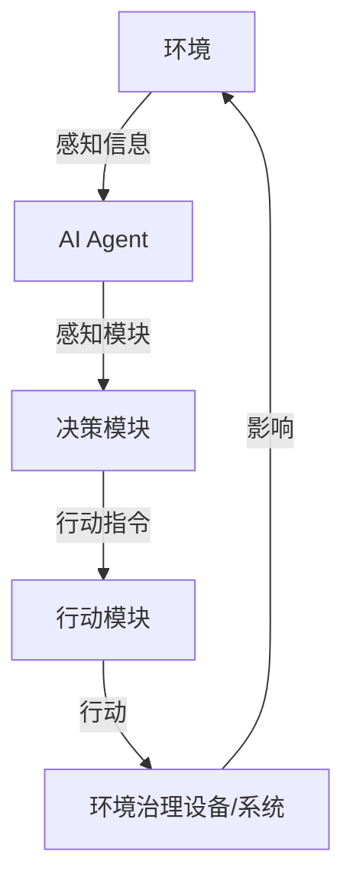

# AI Agent在环境保护中的应用

> 关键词：AI Agent、环境保护、智能监测、生态修复、决策支持

> 摘要：本文深入探讨了AI Agent在环境保护领域的应用。首先介绍了相关背景，包括目的范围、预期读者等内容。接着阐述了AI Agent的核心概念及其与环境保护的联系，并给出了原理和架构的示意图与流程图。详细讲解了核心算法原理，用Python代码进行了说明，同时介绍了相关数学模型和公式。通过项目实战，展示了代码实现和解读。分析了AI Agent在环境保护中的实际应用场景，推荐了学习资源、开发工具框架和相关论文著作。最后总结了未来发展趋势与挑战，并提供了常见问题解答和扩展阅读参考资料，旨在为AI Agent在环境保护中的进一步应用提供全面的技术指导和理论支持。

## 1. 背景介绍 
### 1.1 目的和范围
随着全球环境问题的日益严峻，如气候变化、生物多样性丧失、环境污染等，寻求高效、智能的环境保护解决方案变得刻不容缓。AI Agent作为一种具有自主决策和行动能力的智能实体，为环境保护提供了新的思路和方法。本文的目的在于全面探讨AI Agent在环境保护各个方面的应用，包括环境监测、污染治理、生态修复、资源管理等。我们将深入研究AI Agent的技术原理、算法实现以及在实际项目中的应用案例，旨在为环保领域的科研人员、工程师和决策者提供有价值的参考。

### 1.2 预期读者
本文的预期读者包括但不限于以下几类人群：
- **环保科研人员**：希望通过引入AI Agent技术来创新研究方法，提高环境保护研究的效率和准确性。
- **环保工程师**：在实际工程项目中应用AI Agent技术，解决环境监测、污染治理等方面的实际问题。
- **环保决策者**：了解AI Agent技术在环境保护中的应用潜力，为制定环保政策和规划提供科学依据。
- **计算机专业人士**：对AI Agent技术在跨领域应用感兴趣，希望探索其在环境保护领域的具体实现。

### 1.3 文档结构概述
本文将按照以下结构进行组织：
- **核心概念与联系**：介绍AI Agent的基本概念、工作原理以及与环境保护的关联，通过示意图和流程图进行直观展示。
- **核心算法原理 & 具体操作步骤**：详细讲解AI Agent所涉及的核心算法，并用Python代码进行实现和解释。
- **数学模型和公式 & 详细讲解 & 举例说明**：介绍相关的数学模型和公式，解释其在AI Agent中的应用，并通过具体例子进行说明。
- **项目实战：代码实际案例和详细解释说明**：通过一个实际的环保项目案例，展示AI Agent的代码实现过程，并对代码进行详细解读。
- **实际应用场景**：分析AI Agent在环境保护中的各种实际应用场景，如空气质量监测、水质监测、森林火灾预警等。
- **工具和资源推荐**：推荐学习AI Agent和环境保护相关知识的书籍、在线课程、技术博客和网站，以及开发工具、框架和相关论文著作。
- **总结：未来发展趋势与挑战**：总结AI Agent在环境保护中的应用现状，分析未来的发展趋势和面临的挑战。
- **附录：常见问题与解答**：解答读者在阅读过程中可能遇到的常见问题。
- **扩展阅读 & 参考资料**：提供相关的扩展阅读材料和参考资料，方便读者进一步深入学习。

### 1.4 术语表
#### 1.4.1 核心术语定义
- **AI Agent（人工智能智能体）**：是一种能够感知环境、进行决策并采取行动以实现特定目标的智能实体。它可以通过学习和适应不断优化自己的行为。
- **环境保护**：指人类为解决现实的或潜在的环境问题，协调人类与环境的关系，保障经济社会的持续发展而采取的各种行动的总称。
- **环境监测**：指通过对影响环境质量因素的代表值的测定，确定环境质量（或污染程度）及其变化趋势。
- **生态修复**：指对生态系统停止人为干扰，以减轻负荷压力，依靠生态系统的自我调节能力与自组织能力使其向有序的方向进行演化，或者利用生态系统的这种自我恢复能力，辅以人工措施，使遭到破坏的生态系统逐步恢复或使生态系统向良性循环方向发展。

#### 1.4.2 相关概念解释
- **多智能体系统（Multi - Agent System，MAS）**：由多个AI Agent组成的系统，这些智能体之间可以相互协作、竞争或通信，以实现共同的目标。在环境保护中，多智能体系统可以用于协调不同区域的环境监测和治理工作。
- **机器学习（Machine Learning）**：是一门多领域交叉学科，涉及概率论、统计学、逼近论、凸分析、算法复杂度理论等多门学科。它专门研究计算机怎样模拟或实现人类的学习行为，以获取新的知识或技能，重新组织已有的知识结构使之不断改善自身的性能。AI Agent通常会使用机器学习算法来进行决策和学习。

#### 1.4.3 缩略词列表
- **AI**：Artificial Intelligence，人工智能
- **MAS**：Multi - Agent System，多智能体系统
- **ML**：Machine Learning，机器学习

## 2. 核心概念与联系 

### 2.1 AI Agent的基本概念
AI Agent是一种能够感知其所处环境，并根据感知到的信息进行决策和行动的智能实体。它通常由以下几个部分组成：
- **感知模块**：用于获取环境信息，例如通过传感器收集空气质量、水质、温度等数据。
- **决策模块**：根据感知到的信息和预设的目标，使用算法进行决策，确定下一步的行动方案。
- **行动模块**：根据决策模块的结果，采取相应的行动，例如控制污染治理设备、调整资源分配等。

### 2.2 AI Agent与环境保护的联系
在环境保护领域，AI Agent可以发挥重要作用。通过感知模块，AI Agent可以实时监测环境数据，及时发现环境问题。决策模块可以根据监测数据进行分析和判断，制定出最优的环境保护策略。行动模块则可以执行这些策略，实现对环境的有效保护和治理。例如，在空气质量监测中，AI Agent可以通过传感器收集空气中污染物的浓度数据，根据这些数据判断空气质量是否达标。如果不达标，决策模块可以制定出相应的治理方案，如通知相关部门采取减排措施，行动模块则可以执行这些指令。

### 2.3 核心概念原理和架构的文本示意图
```plaintext
           +---------------------+
           |      环境           |
           +---------------------+
                     |
                     | 感知信息
                     v
           +---------------------+
           |    AI Agent         |
           | +-----------------+ |
           | |  感知模块       | |
           | +-----------------+ |
           | |  决策模块       | |
           | +-----------------+ |
           | |  行动模块       | |
           | +-----------------+ |
           +---------------------+
                     |
                     | 行动指令
                     v
           +---------------------+
           |  环境治理设备/系统  |
           +---------------------+
```

### 2.4 Mermaid流程图


## 3. 核心算法原理 & 具体操作步骤 

### 3.1 核心算法原理
在AI Agent中，常用的核心算法包括强化学习算法。强化学习是一种通过智能体与环境进行交互，不断尝试不同的行动，以最大化累积奖励的学习方法。智能体在每个时间步根据当前的状态选择一个行动，环境会根据这个行动给出一个奖励信号和下一个状态。智能体的目标是学习一个最优的策略，使得在长期内获得的累积奖励最大。

以Q - learning算法为例，它是一种无模型的强化学习算法，通过维护一个Q表来存储每个状态 - 行动对的价值。Q表中的每个元素 $Q(s,a)$ 表示在状态 $s$ 下采取行动 $a$ 的预期累积奖励。智能体在每个时间步根据当前状态 $s$ 从Q表中选择一个最优行动 $a$，并根据环境反馈的奖励 $r$ 和下一个状态 $s'$ 更新Q表。

### 3.2 Python代码实现
```python
import numpy as np

# 定义环境参数
num_states = 10
num_actions = 4
gamma = 0.9  # 折扣因子
alpha = 0.1  # 学习率

# 初始化Q表
Q = np.zeros((num_states, num_actions))

# 定义环境反馈函数（示例）
def get_reward(state, action):
    # 这里简单假设一个奖励规则
    if state == 5 and action == 2:
        return 1
    return 0

# 定义状态转移函数（示例）
def get_next_state(state, action):
    # 简单的状态转移规则
    next_state = (state + action) % num_states
    return next_state

# Q - learning算法实现
def q_learning(num_episodes):
    for episode in range(num_episodes):
        state = np.random.randint(0, num_states)  # 随机初始化状态
        done = False
        while not done:
            # 选择行动（这里使用贪心策略）
            if np.random.uniform(0, 1) < 0.1:  # 10%的概率随机选择行动
                action = np.random.randint(0, num_actions)
            else:
                action = np.argmax(Q[state, :])
            # 获取奖励和下一个状态
            reward = get_reward(state, action)
            next_state = get_next_state(state, action)
            # 更新Q表
            Q[state, action] = Q[state, action] + alpha * (reward + gamma * np.max(Q[next_state, :]) - Q[state, action])
            state = next_state
            # 简单假设达到某个状态结束本回合
            if state == 8:
                done = True

# 训练Q - learning算法
q_learning(num_episodes=1000)

# 输出最终的Q表
print("Final Q - table:")
print(Q)
```

### 3.3 具体操作步骤
1. **初始化**：初始化Q表为全零矩阵，设置折扣因子 $\gamma$ 和学习率 $\alpha$。
2. **选择行动**：在每个时间步，根据当前状态从Q表中选择一个行动。可以使用贪心策略，即有一定概率随机选择行动，以探索新的状态 - 行动对。
3. **获取奖励和下一个状态**：执行选择的行动，从环境中获取奖励和下一个状态。
4. **更新Q表**：根据Q - learning更新公式更新Q表中的值。
5. **重复步骤2 - 4**：直到达到终止条件，如达到最大时间步数或达到目标状态。

## 4. 数学模型和公式 & 详细讲解 & 举例说明 

### 4.1 Q - learning更新公式
Q - learning的更新公式为：
$$Q(s,a) \leftarrow Q(s,a) + \alpha [r + \gamma \max_{a'} Q(s',a') - Q(s,a)]$$
其中：
- $Q(s,a)$ 表示在状态 $s$ 下采取行动 $a$ 的Q值。
- $\alpha$ 是学习率，控制每次更新的步长。
- $r$ 是执行行动 $a$ 后从环境中获得的即时奖励。
- $\gamma$ 是折扣因子，用于权衡即时奖励和未来奖励的重要性。
- $s'$ 是执行行动 $a$ 后转移到的下一个状态。
- $\max_{a'} Q(s',a')$ 表示在下一个状态 $s'$ 下选择最优行动的Q值。

### 4.2 详细讲解
- **学习率 $\alpha$**：学习率 $\alpha$ 决定了每次更新Q值时的步长。如果 $\alpha$ 过大，Q值的更新会过于激进，可能导致算法无法收敛；如果 $\alpha$ 过小，Q值的更新会过于缓慢，算法的学习效率会降低。
- **折扣因子 $\gamma$**：折扣因子 $\gamma$ 用于权衡即时奖励和未来奖励的重要性。$\gamma$ 越接近1，表示更看重未来的奖励；$\gamma$ 越接近0，表示更看重即时奖励。

### 4.3 举例说明
假设我们有一个简单的环境，状态空间 $S = \{0, 1, 2\}$，行动空间 $A = \{0, 1\}$。初始Q表为：
$$
Q = 
\begin{bmatrix}
0 & 0 \\
0 & 0 \\
0 & 0
\end{bmatrix}
$$
当前状态 $s = 0$，选择行动 $a = 0$，获得奖励 $r = 1$，转移到下一个状态 $s' = 1$。假设 $\alpha = 0.1$，$\gamma = 0.9$。

首先计算 $\max_{a'} Q(s',a')$，在状态 $s' = 1$ 下，$Q(1,0) = 0$，$Q(1,1) = 0$，所以 $\max_{a'} Q(s',a') = 0$。

然后根据Q - learning更新公式更新 $Q(0,0)$：
$$
\begin{align*}
Q(0,0) &\leftarrow Q(0,0) + \alpha [r + \gamma \max_{a'} Q(s',a') - Q(0,0)] \\
&= 0 + 0.1 \times [1 + 0.9 \times 0 - 0] \\
&= 0.1
\end{align*}
$$
更新后的Q表为：
$$
Q = 
\begin{bmatrix}
0.1 & 0 \\
0 & 0 \\
0 & 0
\end{bmatrix}
$$

## 5. 项目实战：代码实际案例和详细解释说明 

### 5.1 开发环境搭建
#### 5.1.1 安装Python
首先需要安装Python，建议使用Python 3.7及以上版本。可以从Python官方网站（https://www.python.org/downloads/）下载安装包进行安装。

#### 5.1.2 安装必要的库
在项目中，我们需要使用一些Python库，如`numpy`。可以使用以下命令进行安装：
```sh
pip install numpy
```

### 5.2 源代码详细实现和代码解读
以下是一个基于AI Agent的水质监测与预警项目的代码实现：
```python
import numpy as np

# 定义水质状态空间和行动空间
num_water_states = 5  # 水质状态分为5级
num_actions = 3  # 行动：无操作、轻度处理、重度处理

# 初始化Q表
Q = np.zeros((num_water_states, num_actions))

# 定义奖励矩阵
reward_matrix = np.array([
    [0, -1, -2],  # 水质状态1
    [0, -1, -2],  # 水质状态2
    [0, 1, -1],   # 水质状态3
    [0, 2, 1],    # 水质状态4
    [0, 3, 2]     # 水质状态5
])

# 定义状态转移矩阵（示例）
transition_matrix = np.array([
    [[0.8, 0.1, 0.1], [0.6, 0.2, 0.2], [0.4, 0.3, 0.3]],  # 水质状态1
    [[0.7, 0.2, 0.1], [0.5, 0.3, 0.2], [0.3, 0.4, 0.3]],  # 水质状态2
    [[0.6, 0.3, 0.1], [0.4, 0.4, 0.2], [0.2, 0.5, 0.3]],  # 水质状态3
    [[0.5, 0.4, 0.1], [0.3, 0.5, 0.2], [0.1, 0.6, 0.3]],  # 水质状态4
    [[0.4, 0.5, 0.1], [0.2, 0.6, 0.2], [0.0, 0.7, 0.3]]   # 水质状态5
])

# 定义参数
gamma = 0.9  # 折扣因子
alpha = 0.1  # 学习率
num_episodes = 1000

# Q - learning算法实现
def q_learning():
    for episode in range(num_episodes):
        state = np.random.randint(0, num_water_states)  # 随机初始化水质状态
        done = False
        while not done:
            # 选择行动（贪心策略）
            if np.random.uniform(0, 1) < 0.1:  # 10%的概率随机选择行动
                action = np.random.randint(0, num_actions)
            else:
                action = np.argmax(Q[state, :])
            # 获取奖励
            reward = reward_matrix[state, action]
            # 转移到下一个状态
            next_state_probs = transition_matrix[state, action]
            next_state = np.random.choice(num_water_states, p=next_state_probs)
            # 更新Q表
            Q[state, action] = Q[state, action] + alpha * (reward + gamma * np.max(Q[next_state, :]) - Q[state, action])
            state = next_state
            # 简单假设达到某个状态结束本回合
            if state == 0:
                done = True

# 训练Q - learning算法
q_learning()

# 输出最终的Q表
print("Final Q - table:")
print(Q)

# 根据Q表进行决策
def make_decision(state):
    action = np.argmax(Q[state, :])
    if action == 0:
        return "无操作"
    elif action == 1:
        return "轻度处理"
    else:
        return "重度处理"

# 测试决策
test_state = 3
decision = make_decision(test_state)
print(f"当前水质状态为 {test_state}，建议采取的行动为：{decision}")
```

### 5.3 代码解读与分析
#### 5.3.1 状态空间和行动空间定义
```python
num_water_states = 5  # 水质状态分为5级
num_actions = 3  # 行动：无操作、轻度处理、重度处理
```
这里定义了水质状态空间为5级，行动空间为3种不同的处理方式。

#### 5.3.2 奖励矩阵和状态转移矩阵
```python
reward_matrix = np.array([
    [0, -1, -2],  # 水质状态1
    [0, -1, -2],  # 水质状态2
    [0, 1, -1],   # 水质状态3
    [0, 2, 1],    # 水质状态4
    [0, 3, 2]     # 水质状态5
])

transition_matrix = np.array([
    [[0.8, 0.1, 0.1], [0.6, 0.2, 0.2], [0.4, 0.3, 0.3]],  # 水质状态1
    [[0.7, 0.2, 0.1], [0.5, 0.3, 0.2], [0.3, 0.4, 0.3]],  # 水质状态2
    [[0.6, 0.3, 0.1], [0.4, 0.4, 0.2], [0.2, 0.5, 0.3]],  # 水质状态3
    [[0.5, 0.4, 0.1], [0.3, 0.5, 0.2], [0.1, 0.6, 0.3]],  # 水质状态4
    [[0.4, 0.5, 0.1], [0.2, 0.6, 0.2], [0.0, 0.7, 0.3]]   # 水质状态5
])
```
奖励矩阵定义了在不同水质状态下采取不同行动所获得的奖励。状态转移矩阵定义了在不同水质状态下采取不同行动后转移到下一个状态的概率。

#### 5.3.3 Q - learning算法实现
```python
def q_learning():
    for episode in range(num_episodes):
        state = np.random.randint(0, num_water_states)  # 随机初始化水质状态
        done = False
        while not done:
            # 选择行动（贪心策略）
            if np.random.uniform(0, 1) < 0.1:  # 10%的概率随机选择行动
                action = np.random.randint(0, num_actions)
            else:
                action = np.argmax(Q[state, :])
            # 获取奖励
            reward = reward_matrix[state, action]
            # 转移到下一个状态
            next_state_probs = transition_matrix[state, action]
            next_state = np.random.choice(num_water_states, p=next_state_probs)
            # 更新Q表
            Q[state, action] = Q[state, action] + alpha * (reward + gamma * np.max(Q[next_state, :]) - Q[state, action])
            state = next_state
            # 简单假设达到某个状态结束本回合
            if state == 0:
                done = True
```
在每个回合中，随机初始化水质状态，然后根据贪心策略选择行动，获取奖励和下一个状态，更新Q表，直到达到终止条件。

#### 5.3.4 决策函数
```python
def make_decision(state):
    action = np.argmax(Q[state, :])
    if action == 0:
        return "无操作"
    elif action == 1:
        return "轻度处理"
    else:
        return "重度处理"
```
根据训练好的Q表，在给定水质状态下选择最优行动并返回对应的处理方式。

## 6. 实际应用场景 

### 6.1 环境监测
- **空气质量监测**：AI Agent可以通过分布在城市各个区域的空气质量传感器收集数据，实时监测空气中污染物的浓度。根据监测数据，AI Agent可以判断空气质量是否达标，并及时发出预警。例如，当某一区域的PM2.5浓度超过阈值时，AI Agent可以通知相关部门采取措施，如限制车辆通行、关停污染企业等。
- **水质监测**：在河流、湖泊、海洋等水域设置水质传感器，AI Agent可以实时监测水质参数，如酸碱度、溶解氧、化学需氧量等。通过对水质数据的分析，AI Agent可以及时发现水质污染问题，并为污染治理提供决策支持。例如，当监测到某一水域的化学需氧量超标时，AI Agent可以建议采取污水处理措施，如投放化学药剂、增加曝气设备等。
- **土壤质量监测**：利用土壤传感器收集土壤的酸碱度、肥力、含水量等信息，AI Agent可以对土壤质量进行评估。根据评估结果，AI Agent可以为农业生产提供合理的施肥、灌溉建议，提高土壤质量和农作物产量。例如，当土壤肥力不足时，AI Agent可以建议农民增加有机肥的施用量。

### 6.2 污染治理
- **工业废气治理**：AI Agent可以实时监测工业企业的废气排放情况，根据废气中的污染物成分和浓度，调整废气处理设备的运行参数，提高废气处理效率。例如，当废气中的二氧化硫浓度较高时，AI Agent可以增加脱硫设备的喷药量，降低二氧化硫的排放浓度。
- **污水处理**：在污水处理厂，AI Agent可以根据进水水质和水量的变化，自动调整污水处理工艺和设备的运行参数。例如，当进水的化学需氧量较高时，AI Agent可以增加曝气时间和污泥回流比，提高污水处理效果。
- **垃圾处理**：AI Agent可以对垃圾进行分类识别和处理规划。通过图像识别技术，AI Agent可以识别垃圾的种类，然后根据不同的垃圾种类制定相应的处理方案，如回收利用、焚烧发电、填埋等。

### 6.3 生态修复
- **森林生态修复**：AI Agent可以通过卫星遥感和无人机监测森林的生长状况、病虫害情况等。根据监测数据，AI Agent可以制定森林生态修复计划，如植树造林、病虫害防治等。例如，当监测到某一区域的森林遭受病虫害侵袭时，AI Agent可以建议及时喷洒农药进行防治。
- **湿地生态修复**：利用传感器监测湿地的水位、水质、生物多样性等指标，AI Agent可以评估湿地的生态状况。根据评估结果，AI Agent可以制定湿地生态修复措施，如调节水位、种植水生植物、投放水生动物等，促进湿地生态系统的恢复和发展。

### 6.4 资源管理
- **能源管理**：AI Agent可以实时监测能源的生产、传输和消耗情况，根据能源需求和供应情况，优化能源分配和调度。例如，在电力系统中，AI Agent可以根据不同时段的用电需求，调整发电设备的运行状态，实现电力的合理分配，提高能源利用效率。
- **水资源管理**：通过监测水资源的储量、用水量和水质等信息，AI Agent可以制定水资源管理策略，如水资源调配、节水措施推广等。例如，当某一地区的水资源短缺时，AI Agent可以建议采取跨区域调水、推广节水器具等措施，保障水资源的合理利用。

## 7. 工具和资源推荐

### 7.1 学习资源推荐
#### 7.1.1 书籍推荐
- 《人工智能：一种现代的方法》（Artificial Intelligence: A Modern Approach）：这本书是人工智能领域的经典教材，全面介绍了人工智能的基本概念、算法和应用，包括AI Agent的相关内容。
- 《强化学习：原理与Python实现》：详细介绍了强化学习的原理和算法，并通过Python代码进行了实现，对于理解AI Agent中常用的强化学习算法非常有帮助。
- 《机器学习》（周志华著）：这本书是国内机器学习领域的经典教材，系统地介绍了机器学习的基本概念、算法和应用，为学习AI Agent提供了坚实的理论基础。

#### 7.1.2 在线课程
- Coursera上的“人工智能基础”课程：由知名高校的教授授课，全面介绍了人工智能的基本概念和技术，包括AI Agent的相关内容。
- edX上的“强化学习”课程：深入讲解了强化学习的原理和算法，通过实际案例和编程作业帮助学员掌握强化学习的应用。
- 中国大学MOOC上的“机器学习”课程：由国内知名高校的教师授课，内容丰富，适合初学者学习机器学习的基础知识。

#### 7.1.3 技术博客和网站
- Medium上的人工智能相关博客：有很多AI领域的专家和从业者在Medium上分享他们的研究成果和实践经验，包括AI Agent在各个领域的应用案例。
- 机器之心：专注于人工智能领域的资讯和技术分享，提供了大量关于AI Agent的最新研究动态和技术文章。
- 开源中国：国内知名的开源技术社区，有很多关于人工智能和机器学习的技术文章和项目分享，对于学习AI Agent的开发和应用有很大帮助。

### 7.2 开发工具框架推荐
#### 7.2.1 IDE和编辑器
- PyCharm：是一款专门为Python开发设计的集成开发环境，具有代码编辑、调试、自动补全、版本控制等功能，非常适合开发基于Python的AI Agent项目。
- Jupyter Notebook：是一个交互式的开发环境，支持Python、R等多种编程语言。它可以将代码、文本、图表等内容集成在一个文档中，方便进行数据分析和模型训练，对于AI Agent的算法研究和实验非常有用。
- Visual Studio Code：是一款轻量级的代码编辑器，支持多种编程语言和插件扩展。它具有丰富的代码编辑功能和调试功能，同时可以通过安装相关插件来支持AI Agent开发所需的各种工具和库。

#### 7.2.2 调试和性能分析工具
- TensorBoard：是TensorFlow框架提供的一个可视化工具，可以用于监控模型的训练过程、查看模型的结构和性能指标等。在开发AI Agent时，可以使用TensorBoard来调试和优化强化学习模型。
- Py-Spy：是一个Python性能分析工具，可以实时监控Python程序的CPU使用率和函数调用情况，帮助开发者找出程序中的性能瓶颈。
- cProfile：是Python标准库中的一个性能分析模块，可以统计Python程序中各个函数的执行时间和调用次数，为优化代码提供依据。

#### 7.2.3 相关框架和库
- TensorFlow：是一个开源的机器学习框架，提供了丰富的工具和库，支持深度学习、强化学习等多种算法。在开发AI Agent时，可以使用TensorFlow来构建和训练智能体模型。
- PyTorch：是另一个流行的开源机器学习框架，具有动态图机制，易于使用和调试。它在学术界和工业界都得到了广泛的应用，对于开发AI Agent也非常合适。
- OpenAI Gym：是一个开源的强化学习环境库，提供了各种模拟环境，如机器人控制、游戏等。可以使用OpenAI Gym来测试和验证AI Agent的性能。

### 7.3 相关论文著作推荐
#### 7.3.1 经典论文
- “Reinforcement Learning: An Introduction”（Richard S. Sutton和Andrew G. Barto著）：这是强化学习领域的经典著作，系统地介绍了强化学习的基本概念、算法和理论，对于理解AI Agent中的强化学习算法具有重要的指导意义。
- “Q - learning”（Christopher J. C. H. Watkins和Peter Dayan著）：该论文首次提出了Q - learning算法，是强化学习领域的重要里程碑，对于学习和研究AI Agent中的Q - learning算法非常有价值。
- “Deep Q - Networks”（Volodymyr Mnih等人著）：这篇论文提出了深度Q网络（DQN）算法，将深度学习和强化学习相结合，在游戏、机器人控制等领域取得了显著的成果，为AI Agent的发展提供了新的思路和方法。

#### 7.3.2 最新研究成果
- 在ArXiv.org上搜索“AI Agent in Environmental Protection”等关键词，可以找到很多关于AI Agent在环境保护领域的最新研究论文。这些论文涵盖了AI Agent在环境监测、污染治理、生态修复等方面的最新技术和应用案例。
- 国际人工智能联合会议（IJCAI）、神经信息处理系统大会（NeurIPS）等顶级学术会议上也有很多关于AI Agent的最新研究成果发表。关注这些会议的论文可以了解到AI Agent领域的前沿动态。

#### 7.3.3 应用案例分析
- 《AI for Good: Leveraging Artificial Intelligence for Social and Environmental Impact》：这本书收集了很多AI在社会和环境领域的应用案例，其中包括AI Agent在环境保护中的应用案例分析，对于实际项目的开发和实施具有一定的参考价值。
- 一些环保组织和科研机构的官方网站上也会发布关于AI Agent在环境保护中的应用案例，如世界自然基金会（WWF）、国际自然保护联盟（IUCN）等。

## 8. 总结：未来发展趋势与挑战

### 8.1 未来发展趋势
- **多智能体协作**：未来，AI Agent将不再是单个智能体独立工作，而是多个智能体之间进行协作，形成多智能体系统。在环境保护中，不同区域的AI Agent可以相互协作，共同完成环境监测、污染治理等任务。例如，多个城市的空气质量监测智能体可以共享数据，协同制定空气质量改善策略。
- **与物联网深度融合**：随着物联网技术的发展，越来越多的环境监测设备将接入网络，AI Agent可以通过物联网获取更全面、实时的环境数据。同时，AI Agent可以通过物联网控制环境治理设备，实现智能化的环境管理。例如，AI Agent可以通过物联网远程控制污水处理设备的运行参数，提高污水处理效率。
- **强化学习与深度学习的结合**：强化学习和深度学习都是AI Agent中重要的技术，未来两者将更加紧密地结合。深度学习可以用于处理复杂的环境数据，如图像、视频等，而强化学习可以用于智能体的决策和行动。通过两者的结合，AI Agent可以在更复杂的环境中实现更智能的决策和行动。例如，在森林火灾预警中，深度学习可以用于识别卫星图像中的火灾迹象，强化学习可以根据识别结果制定灭火策略。
- **伦理和法律问题的重视**：随着AI Agent在环境保护中的广泛应用，伦理和法律问题将越来越受到关注。例如，AI Agent的决策可能会对人类和环境产生影响，如何确保AI Agent的决策符合伦理和法律要求是一个重要的问题。未来，需要建立相关的伦理和法律框架，规范AI Agent的开发和应用。

### 8.2 挑战
- **数据质量和隐私问题**：AI Agent的性能很大程度上依赖于高质量的数据。然而，在环境保护领域，数据的收集和处理存在一些问题，如数据不准确、不完整、不一致等。此外，环境数据涉及到个人隐私和国家安全等问题，如何在保护数据隐私的前提下，充分利用数据是一个挑战。
- **算法复杂度和计算资源需求**：随着AI Agent的功能越来越复杂，所使用的算法也越来越复杂，对计算资源的需求也越来越高。在实际应用中，如何在有限的计算资源下实现高效的算法是一个挑战。例如，在大规模的环境监测和治理中，需要处理大量的数据，对计算资源的要求非常高。
- **环境不确定性和动态性**：环境是复杂、不确定和动态变化的，AI Agent需要能够适应这种环境。然而，目前的AI Agent在处理环境不确定性和动态性方面还存在一些不足。例如，在气候变化的情况下，环境数据会发生很大的变化，AI Agent需要能够及时调整自己的决策和行动。
- **社会接受度和信任问题**：AI Agent在环境保护中的应用可能会引起社会的担忧和质疑，如担心AI Agent会取代人类的工作、影响人类的决策等。如何提高社会对AI Agent的接受度和信任度是一个挑战。需要加强对AI Agent的宣传和教育，让公众了解AI Agent的优势和局限性。

## 9. 附录：常见问题与解答

### 9.1 什么是AI Agent？
AI Agent是一种能够感知其所处环境，并根据感知到的信息进行决策和行动的智能实体。它通常由感知模块、决策模块和行动模块组成。

### 9.2 AI Agent在环境保护中有哪些应用场景？
AI Agent在环境保护中的应用场景包括环境监测（如空气质量监测、水质监测、土壤质量监测等）、污染治理（如工业废气治理、污水处理、垃圾处理等）、生态修复（如森林生态修复、湿地生态修复等）和资源管理（如能源管理、水资源管理等）。

### 9.3 如何开发一个基于AI Agent的环境保护系统？
开发一个基于AI Agent的环境保护系统通常需要以下步骤：
1. **需求分析**：明确系统的功能和目标，确定需要监测和治理的环境指标。
2. **数据收集**：收集相关的环境数据，如空气质量数据、水质数据等。
3. **算法选择**：选择适合的算法，如强化学习算法，来实现AI Agent的决策和学习功能。
4. **模型训练**：使用收集到的数据对AI Agent模型进行训练，优化模型的性能。
5. **系统开发**：使用编程语言和开发工具，开发AI Agent系统的各个模块，如感知模块、决策模块和行动模块。
6. **系统测试和部署**：对开发好的系统进行测试，确保系统的稳定性和可靠性，然后将系统部署到实际环境中。

### 9.4 AI Agent在环境保护中的应用存在哪些挑战？
AI Agent在环境保护中的应用存在以下挑战：
1. **数据质量和隐私问题**：数据不准确、不完整、不一致以及数据隐私保护问题。
2. **算法复杂度和计算资源需求**：复杂的算法对计算资源的要求较高。
3. **环境不确定性和动态性**：环境的复杂、不确定和动态变化给AI Agent的决策和行动带来挑战。
4. **社会接受度和信任问题**：社会对AI Agent的接受度和信任度有待提高。

### 9.5 如何提高AI Agent在环境保护中的性能？
可以从以下几个方面提高AI Agent在环境保护中的性能：
1. **提高数据质量**：确保收集到的环境数据准确、完整、一致。
2. **优化算法**：选择更合适的算法，并对算法进行优化，提高算法的效率和准确性。
3. **多智能体协作**：采用多智能体系统，让多个AI Agent之间进行协作，共同完成环境保护任务。
4. **实时学习和适应**：让AI Agent能够实时学习和适应环境的变化，及时调整自己的决策和行动。

## 10. 扩展阅读 & 参考资料

### 10.1 扩展阅读
- 《智能体系统：原理、设计与应用》：深入介绍了智能体系统的原理、设计方法和应用案例，对于进一步了解AI Agent的技术细节和应用场景有很大帮助。
- 《人工智能与可持续发展》：探讨了人工智能在可持续发展领域的应用，包括环境保护、资源管理等方面，为AI Agent在环境保护中的应用提供了更广阔的视角。
- 《环境科学与工程原理》：系统地介绍了环境科学与工程的基本原理和方法，对于理解环境保护的相关知识和技术有重要的作用。

### 10.2 参考资料
- [1] Sutton, R. S., & Barto, A. G. (2018). Reinforcement Learning: An Introduction. MIT Press.
- [2] Watkins, C. J. C. H., & Dayan, P. (1992). Q - learning. Machine learning, 8(3 - 4), 279 - 292.
- [3] Mnih, V., Kavukcuoglu, K., Silver, D., Graves, A., Antonoglou, I., Wierstra, D., & Riedmiller, M. (2013). Playing Atari with Deep Reinforcement Learning. arXiv preprint arXiv:1312.5602.
- [4] 周志华. (2016). 机器学习. 清华大学出版社.

作者：AI天才研究院/AI Genius Institute & 禅与计算机程序设计艺术 /Zen And The Art of Computer Programming