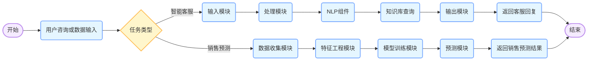

# AI Agent在电子商务中的应用：智能客服与销售预测

> 关键词：AI Agent、电子商务、智能客服、销售预测、自然语言处理

> 摘要：本文深入探讨了AI Agent在电子商务领域的重要应用，即智能客服和销售预测。详细介绍了AI Agent的核心概念、算法原理、数学模型，通过实际案例展示了其在开发环境搭建、代码实现等方面的具体操作。同时分析了AI Agent在不同电子商务场景中的应用，推荐了相关的学习资源、开发工具和论文著作。最后总结了AI Agent在电子商务中的未来发展趋势与挑战，并提供了常见问题的解答和扩展阅读参考资料，旨在为相关从业者和研究者提供全面而深入的技术指导。

## 1. 背景介绍 
### 1.1 目的和范围
随着电子商务的快速发展，消费者对服务质量和购物体验的要求越来越高。同时，商家也面临着提高运营效率、精准预测销售等挑战。AI Agent作为一种智能化的解决方案，能够模拟人类的行为和决策过程，在电子商务中发挥重要作用。本文的目的是全面介绍AI Agent在电子商务智能客服和销售预测方面的应用，涵盖从核心概念到实际应用的各个方面，为读者提供系统的技术知识和实践指导。

### 1.2 预期读者
本文主要面向电子商务从业者、AI技术开发者、数据分析师以及对电子商务和AI技术融合感兴趣的研究人员。对于希望了解如何利用AI Agent提升电子商务服务质量和运营效率的人员具有较高的参考价值。

### 1.3 文档结构概述
本文首先介绍AI Agent的背景知识，包括目的、预期读者和文档结构。接着阐述核心概念与联系，通过文本示意图和Mermaid流程图展示其原理和架构。然后详细讲解核心算法原理和具体操作步骤，并使用Python代码进行说明。之后介绍数学模型和公式，结合实例进行讲解。通过项目实战部分展示代码实际案例和详细解释。分析AI Agent在电子商务中的实际应用场景，推荐相关的工具和资源。最后总结未来发展趋势与挑战，提供常见问题解答和扩展阅读参考资料。

### 1.4 术语表
#### 1.4.1 核心术语定义
- **AI Agent（人工智能代理）**：是一种能够感知环境、进行推理和决策，并采取行动以实现特定目标的智能实体。在电子商务中，它可以根据用户的输入和历史数据提供服务和预测。
- **智能客服**：利用AI技术实现自动回答用户咨询、解决问题的客服系统，通过自然语言处理和机器学习算法理解用户意图并提供准确的回复。
- **销售预测**：基于历史销售数据、市场趋势等信息，运用数据分析和机器学习方法对未来销售情况进行预测的过程。

#### 1.4.2 相关概念解释
- **自然语言处理（NLP）**：是AI的一个重要领域，主要研究如何让计算机理解和处理人类语言。在智能客服中，NLP技术用于文本分类、情感分析、意图识别等任务。
- **机器学习（ML）**：是一门多领域交叉学科，涉及概率论、统计学、逼近论、凸分析、算法复杂度理论等多门学科。它专门研究计算机怎样模拟或实现人类的学习行为，以获取新的知识或技能，重新组织已有的知识结构使之不断改善自身的性能。在销售预测中，机器学习算法用于分析历史数据和预测未来趋势。

#### 1.4.3 缩略词列表
- **NLP**：Natural Language Processing（自然语言处理）
- **ML**：Machine Learning（机器学习）
- **RNN**：Recurrent Neural Network（循环神经网络）
- **LSTM**：Long Short - Term Memory（长短期记忆网络）
- **GRU**：Gated Recurrent Unit（门控循环单元）

## 2. 核心概念与联系 

### 核心概念原理
AI Agent在电子商务中的应用主要基于两个核心概念：智能客服和销售预测。

#### 智能客服原理
智能客服系统主要由输入模块、处理模块和输出模块组成。输入模块负责接收用户的咨询信息，通常是自然语言文本。处理模块是核心部分，它运用自然语言处理技术对输入的文本进行分析，包括分词、词性标注、命名实体识别、意图识别等。通过这些处理，系统能够理解用户的意图，然后从知识库中查找相应的答案。输出模块将处理结果以自然语言的形式返回给用户。

#### 销售预测原理
销售预测主要基于历史销售数据和相关的外部因素（如市场趋势、季节变化、促销活动等）。通过机器学习算法对这些数据进行分析和建模，挖掘数据中的规律和模式。常见的机器学习算法包括线性回归、决策树、神经网络等。训练好的模型可以根据输入的特征数据预测未来的销售情况。

### 架构的文本示意图
```plaintext
+---------------------+
|    电子商务平台    |
+---------------------+
|  智能客服子系统    |
|  - 输入模块        |
|  - 处理模块        |
|    - NLP组件       |
|    - 知识库        |
|  - 输出模块        |
|  销售预测子系统    |
|  - 数据收集模块    |
|  - 特征工程模块    |
|  - 模型训练模块    |
|  - 预测模块        |
+---------------------+
```

### Mermaid流程图


## 3. 核心算法原理 & 具体操作步骤 

### 智能客服核心算法原理
智能客服中最重要的算法是自然语言处理算法，下面以意图识别为例进行讲解。意图识别的目标是判断用户输入的文本表达的具体意图，例如查询商品信息、询问订单状态、申请退款等。

一种常用的方法是使用深度学习模型，如循环神经网络（RNN）及其变体长短期记忆网络（LSTM）和门控循环单元（GRU）。这些模型能够处理序列数据，非常适合处理自然语言文本。

#### Python代码实现意图识别
```python
import tensorflow as tf
from tensorflow.keras.preprocessing.text import Tokenizer
from tensorflow.keras.preprocessing.sequence import pad_sequences
from tensorflow.keras.models import Sequential
from tensorflow.keras.layers import Embedding, LSTM, Dense

# 示例数据
texts = ["我想查询商品信息", "我的订单状态如何", "我要申请退款"]
labels = [0, 1, 2]

# 分词和构建词汇表
tokenizer = Tokenizer()
tokenizer.fit_on_texts(texts)
vocab_size = len(tokenizer.word_index) + 1

# 将文本转换为序列
sequences = tokenizer.texts_to_sequences(texts)
max_length = max([len(seq) for seq in sequences])
padded_sequences = pad_sequences(sequences, maxlen=max_length)

# 构建模型
model = Sequential([
    Embedding(vocab_size, 100, input_length=max_length),
    LSTM(100),
    Dense(3, activation='softmax')
])

# 编译模型
model.compile(loss='sparse_categorical_crossentropy', optimizer='adam', metrics=['accuracy'])

# 训练模型
model.fit(padded_sequences, labels, epochs=10, verbose=1)

# 预测新文本的意图
new_text = ["我想知道这个商品的价格"]
new_sequence = tokenizer.texts_to_sequences(new_text)
new_padded_sequence = pad_sequences(new_sequence, maxlen=max_length)
prediction = model.predict(new_padded_sequence)
predicted_label = tf.argmax(prediction, axis=1).numpy()[0]
print(f"预测的意图标签: {predicted_label}")
```

### 销售预测核心算法原理
销售预测中常用的算法是线性回归和决策树。线性回归是一种简单而有效的预测方法，它假设自变量和因变量之间存在线性关系。决策树则是一种基于树结构进行决策的算法，能够处理非线性关系。

#### Python代码实现线性回归销售预测
```python
import numpy as np
from sklearn.linear_model import LinearRegression

# 示例数据：历史销售数据（特征）和对应的销售额（目标）
X = np.array([[1], [2], [3], [4], [5]])
y = np.array([2, 4, 6, 8, 10])

# 创建线性回归模型
model = LinearRegression()

# 训练模型
model.fit(X, y)

# 预测未来销售
new_X = np.array([[6]])
prediction = model.predict(new_X)
print(f"预测的销售额: {prediction[0]}")
```

### 具体操作步骤
#### 智能客服操作步骤
1. **数据收集**：收集用户的历史咨询数据和对应的回复，构建训练数据集。
2. **数据预处理**：对文本数据进行清洗、分词、去除停用词等处理。
3. **模型训练**：选择合适的自然语言处理模型，如上述的LSTM模型，进行训练。
4. **模型评估**：使用测试数据集评估模型的性能，如准确率、召回率等。
5. **部署上线**：将训练好的模型部署到智能客服系统中，处理用户的实时咨询。

#### 销售预测操作步骤
1. **数据收集**：收集历史销售数据、市场数据、促销活动数据等。
2. **特征工程**：对数据进行预处理，选择合适的特征，如时间、季节、商品类别等。
3. **模型选择和训练**：选择合适的机器学习模型，如线性回归或决策树，进行训练。
4. **模型评估**：使用测试数据集评估模型的预测性能，如均方误差、平均绝对误差等。
5. **预测和监控**：使用训练好的模型进行销售预测，并定期监控预测结果的准确性，根据实际情况调整模型。

## 4. 数学模型和公式 & 详细讲解 & 举例说明 

### 智能客服中的数学模型和公式
#### 词向量表示
在自然语言处理中，通常将文本中的每个词表示为一个向量，常用的方法是词嵌入（Word Embedding）。例如，使用Word2Vec算法可以将每个词映射到一个低维向量空间中。假设词 $w$ 的词向量表示为 $\mathbf{v}_w \in \mathbb{R}^d$，其中 $d$ 是向量的维度。

#### 意图识别模型的损失函数
在使用深度学习模型进行意图识别时，常用的损失函数是交叉熵损失函数。对于一个多分类问题，假设模型的输出是一个概率分布 $\mathbf{p} = [p_1, p_2, \cdots, p_n]$，其中 $p_i$ 表示第 $i$ 个类别的概率，真实标签为 $\mathbf{y} = [y_1, y_2, \cdots, y_n]$，其中 $y_i$ 是一个二进制向量，表示第 $i$ 个类别是否为真实类别。交叉熵损失函数的公式为：

$$
L(\mathbf{p}, \mathbf{y}) = - \sum_{i=1}^{n} y_i \log(p_i)
$$

例如，假设模型的输出概率分布为 $\mathbf{p} = [0.1, 0.7, 0.2]$，真实标签为 $\mathbf{y} = [0, 1, 0]$，则交叉熵损失为：

$$
L(\mathbf{p}, \mathbf{y}) = - (0 \times \log(0.1) + 1 \times \log(0.7) + 0 \times \log(0.2)) \approx 0.357
$$

### 销售预测中的数学模型和公式
#### 线性回归模型
线性回归模型假设自变量 $X$ 和因变量 $y$ 之间存在线性关系，其数学模型可以表示为：

$$
y = \beta_0 + \beta_1 X_1 + \beta_2 X_2 + \cdots + \beta_n X_n + \epsilon
$$

其中，$\beta_0$ 是截距，$\beta_1, \beta_2, \cdots, \beta_n$ 是回归系数，$\epsilon$ 是误差项。

在训练线性回归模型时，通常使用最小二乘法来估计回归系数。最小二乘法的目标是最小化残差平方和：

$$
S(\beta) = \sum_{i=1}^{m} (y_i - \hat{y}_i)^2 = \sum_{i=1}^{m} (y_i - (\beta_0 + \beta_1 X_{i1} + \beta_2 X_{i2} + \cdots + \beta_n X_{in}))^2
$$

其中，$m$ 是样本数量，$y_i$ 是第 $i$ 个样本的真实值，$\hat{y}_i$ 是第 $i$ 个样本的预测值。

例如，对于简单线性回归模型 $y = \beta_0 + \beta_1 X$，假设我们有以下样本数据：$(X_1, y_1) = (1, 2)$，$(X_2, y_2) = (2, 4)$，$(X_3, y_3) = (3, 6)$。我们可以使用最小二乘法求解 $\beta_0$ 和 $\beta_1$。

首先，计算样本均值：$\bar{X} = \frac{1 + 2 + 3}{3} = 2$，$\bar{y} = \frac{2 + 4 + 6}{3} = 4$。

然后，计算 $\beta_1$：

$$
\beta_1 = \frac{\sum_{i=1}^{3} (X_i - \bar{X})(y_i - \bar{y})}{\sum_{i=1}^{3} (X_i - \bar{X})^2} = \frac{(1 - 2)(2 - 4) + (2 - 2)(4 - 4) + (3 - 2)(6 - 4)}{(1 - 2)^2 + (2 - 2)^2 + (3 - 2)^2} = 2
$$

最后，计算 $\beta_0$：

$$
\beta_0 = \bar{y} - \beta_1 \bar{X} = 4 - 2 \times 2 = 0
$$

所以，线性回归模型为 $y = 2X$。

## 5. 项目实战：代码实际案例和详细解释说明 

### 5.1  开发环境搭建
#### 安装Python
首先，确保你已经安装了Python 3.x版本。可以从Python官方网站（https://www.python.org/downloads/）下载并安装。

#### 安装必要的库
使用pip命令安装以下必要的库：
```bash
pip install tensorflow scikit-learn numpy pandas
```

### 5.2  源代码详细实现和代码解读
#### 智能客服系统实现
```python
import tensorflow as tf
from tensorflow.keras.preprocessing.text import Tokenizer
from tensorflow.keras.preprocessing.sequence import pad_sequences
from tensorflow.keras.models import Sequential
from tensorflow.keras.layers import Embedding, LSTM, Dense

# 示例数据
texts = ["我想查询商品信息", "我的订单状态如何", "我要申请退款"]
labels = [0, 1, 2]

# 分词和构建词汇表
tokenizer = Tokenizer()
tokenizer.fit_on_texts(texts)
vocab_size = len(tokenizer.word_index) + 1

# 将文本转换为序列
sequences = tokenizer.texts_to_sequences(texts)
max_length = max([len(seq) for seq in sequences])
padded_sequences = pad_sequences(sequences, maxlen=max_length)

# 构建模型
model = Sequential([
    Embedding(vocab_size, 100, input_length=max_length),
    LSTM(100),
    Dense(3, activation='softmax')
])

# 编译模型
model.compile(loss='sparse_categorical_crossentropy', optimizer='adam', metrics=['accuracy'])

# 训练模型
model.fit(padded_sequences, labels, epochs=10, verbose=1)

# 预测新文本的意图
new_text = ["我想知道这个商品的价格"]
new_sequence = tokenizer.texts_to_sequences(new_text)
new_padded_sequence = pad_sequences(new_sequence, maxlen=max_length)
prediction = model.predict(new_padded_sequence)
predicted_label = tf.argmax(prediction, axis=1).numpy()[0]
print(f"预测的意图标签: {predicted_label}")
```

**代码解读**：
1. **数据准备**：定义了示例的文本数据 `texts` 和对应的标签 `labels`。使用 `Tokenizer` 对文本进行分词并构建词汇表，将文本转换为序列，然后使用 `pad_sequences` 对序列进行填充，使其长度一致。
2. **模型构建**：使用 `Sequential` 模型构建一个简单的深度学习模型，包括 `Embedding` 层将词转换为向量，`LSTM` 层处理序列数据，最后使用 `Dense` 层进行分类。
3. **模型编译**：使用 `sparse_categorical_crossentropy` 作为损失函数，`adam` 作为优化器，`accuracy` 作为评估指标。
4. **模型训练**：使用 `fit` 方法对模型进行训练。
5. **预测**：对新的文本进行预测，将其转换为序列并填充，然后使用训练好的模型进行预测，最后获取预测的标签。

#### 销售预测系统实现
```python
import numpy as np
from sklearn.linear_model import LinearRegression

# 示例数据：历史销售数据（特征）和对应的销售额（目标）
X = np.array([[1], [2], [3], [4], [5]])
y = np.array([2, 4, 6, 8, 10])

# 创建线性回归模型
model = LinearRegression()

# 训练模型
model.fit(X, y)

# 预测未来销售
new_X = np.array([[6]])
prediction = model.predict(new_X)
print(f"预测的销售额: {prediction[0]}")
```

**代码解读**：
1. **数据准备**：定义了示例的特征数据 `X` 和目标数据 `y`。
2. **模型创建**：使用 `LinearRegression` 创建一个线性回归模型。
3. **模型训练**：使用 `fit` 方法对模型进行训练。
4. **预测**：定义新的特征数据 `new_X`，使用训练好的模型进行预测，并打印预测结果。

### 5.3  代码解读与分析
#### 智能客服代码分析
- **优点**：使用深度学习模型能够处理复杂的自然语言模式，具有较高的准确率。通过词嵌入层将词转换为向量，能够捕捉词之间的语义关系。
- **缺点**：需要大量的训练数据才能达到较好的效果，训练时间较长，模型的可解释性较差。

#### 销售预测代码分析
- **优点**：线性回归模型简单易懂，计算效率高，可解释性强。能够快速得到预测结果，并且可以通过回归系数分析特征对销售额的影响。
- **缺点**：假设自变量和因变量之间存在线性关系，对于非线性关系的数据集，预测效果可能较差。

## 6. 实际应用场景 
### 智能客服应用场景
#### 实时咨询解答
在电子商务平台上，用户可以随时向智能客服咨询商品信息、订单状态、退换货政策等问题。智能客服能够快速准确地回答用户的问题，提高用户的购物体验。

#### 自动分流和转接
当用户的问题比较复杂或超出智能客服的能力范围时，智能客服可以自动将问题分流到人工客服或其他专业部门，实现无缝转接。

#### 客户反馈收集
智能客服可以在与用户的对话中收集客户的反馈信息，如对商品的评价、对服务的满意度等。这些反馈信息可以帮助商家改进产品和服务。

### 销售预测应用场景
#### 库存管理
通过销售预测，商家可以合理安排库存，避免库存积压或缺货的情况发生。根据预测结果提前采购商品，确保商品的供应满足市场需求。

#### 促销活动策划
销售预测可以帮助商家了解不同时间段的销售趋势，从而制定合理的促销活动计划。例如，在销售旺季加大促销力度，提高销售额。

#### 资源分配
根据销售预测结果，商家可以合理分配人力、物力和财力资源。例如，在销售高峰期增加客服人员和物流配送人员，提高服务效率。

## 7. 工具和资源推荐
### 7.1 学习资源推荐
#### 7.1.1 书籍推荐
- 《Python自然语言处理实战：核心技术与算法》：详细介绍了Python在自然语言处理中的应用，包括分词、词性标注、命名实体识别等技术。
- 《机器学习》（周志华著）：全面介绍了机器学习的基本概念、算法和应用，是机器学习领域的经典教材。
- 《深度学习》（Ian Goodfellow等著）：深入讲解了深度学习的原理、模型和算法，适合有一定基础的读者。

#### 7.1.2 在线课程
- Coursera上的“Natural Language Processing Specialization”：由顶尖大学的教授授课，系统介绍自然语言处理的各个方面。
- edX上的“Machine Learning Fundamentals”：提供机器学习的基础知识和实践操作。
- 网易云课堂上的“深度学习工程师微专业”：涵盖深度学习的多个领域，包括图像识别、自然语言处理等。

#### 7.1.3 技术博客和网站
- 博客园：有许多技术开发者分享的关于人工智能、机器学习和自然语言处理的文章。
- 机器之心：专注于人工智能领域的新闻、技术和研究成果，提供最新的行业动态。
- Medium：有很多优秀的技术博客，涉及AI Agent、电子商务等多个领域。

### 7.2 开发工具框架推荐
#### 7.2.1 IDE和编辑器
- PyCharm：功能强大的Python集成开发环境，提供代码编辑、调试、版本控制等功能。
- Jupyter Notebook：交互式的开发环境，适合进行数据分析和模型实验。
- Visual Studio Code：轻量级的代码编辑器，支持多种编程语言，有丰富的插件扩展。

#### 7.2.2 调试和性能分析工具
- TensorBoard：TensorFlow提供的可视化工具，用于监控模型的训练过程、分析模型的性能。
- Scikit-learn的交叉验证工具：可以帮助评估模型的性能和选择合适的模型参数。
- cProfile：Python内置的性能分析工具，用于分析代码的运行时间和内存使用情况。

#### 7.2.3 相关框架和库
- TensorFlow：开源的深度学习框架，提供丰富的工具和模型，支持多种深度学习任务。
- PyTorch：另一个流行的深度学习框架，具有动态图的特点，易于使用和调试。
- Scikit-learn：用于机器学习的Python库，提供了各种机器学习算法和工具，如分类、回归、聚类等。

### 7.3 相关论文著作推荐
#### 7.3.1 经典论文
- “Attention Is All You Need”：提出了Transformer模型，是自然语言处理领域的重要突破。
- “Long Short-Term Memory”：介绍了长短期记忆网络（LSTM）的原理和应用。
- “A Unified Approach to Interpreting Model Predictions”：提出了一种统一的模型解释方法，有助于理解模型的决策过程。

#### 7.3.2 最新研究成果
- 在ACM SIGKDD、NeurIPS、ACL等顶级学术会议上搜索关于AI Agent、智能客服和销售预测的最新研究论文。
- 关注相关领域的预印本平台，如arXiv，获取最新的研究成果。

#### 7.3.3 应用案例分析
- 一些电子商务企业的官方博客或技术分享平台会发布关于AI Agent应用的案例分析，如阿里巴巴、亚马逊等。
- 研究机构和咨询公司的报告也会包含一些实际应用案例，如Gartner、IDC等。

## 8. 总结：未来发展趋势与挑战
### 未来发展趋势
#### 多模态融合
未来的AI Agent将不仅仅局限于处理文本信息，还会融合语音、图像等多模态信息。例如，智能客服可以通过语音与用户进行交互，销售预测可以结合图像识别技术分析商品的外观和市场需求。

#### 个性化服务
随着数据的不断积累和算法的不断优化，AI Agent将能够为用户提供更加个性化的服务。智能客服可以根据用户的历史咨询记录和偏好提供定制化的回复，销售预测可以针对不同的用户群体和商品类别进行精准预测。

#### 与区块链技术结合
区块链技术的去中心化、不可篡改等特点可以为AI Agent在电子商务中的应用提供更安全、可信的环境。例如，在智能客服中，区块链可以用于记录用户的咨询历史和客服的回复，确保信息的真实性和完整性。

### 挑战
#### 数据隐私和安全
AI Agent在电子商务中的应用需要大量的用户数据，如何保护用户的隐私和数据安全是一个重要的挑战。需要采取有效的数据加密、访问控制等技术手段，防止数据泄露和滥用。

#### 模型可解释性
深度学习模型在智能客服和销售预测中取得了很好的效果，但这些模型通常是黑盒模型，难以解释其决策过程。在一些关键场景中，如金融风险评估、医疗诊断等，模型的可解释性非常重要。需要研究和开发可解释的人工智能模型。

#### 技术门槛和人才短缺
AI Agent的开发和应用需要掌握深度学习、自然语言处理、数据分析等多方面的技术知识，技术门槛较高。目前，相关领域的专业人才短缺，限制了AI Agent在电子商务中的广泛应用。需要加强人才培养和技术普及。

## 9. 附录：常见问题与解答
### 智能客服相关问题
#### 问题1：智能客服的准确率如何提高？
解答：可以通过增加训练数据的数量和质量、优化自然语言处理算法、使用更复杂的深度学习模型等方法来提高智能客服的准确率。同时，定期对模型进行评估和更新，根据用户的反馈不断改进模型。

#### 问题2：智能客服能否处理复杂的业务问题？
解答：对于一些常见的、规则明确的业务问题，智能客服可以通过预设的规则和模型进行处理。但对于复杂的、需要深入分析和判断的业务问题，可能需要人工客服的介入。可以通过智能客服与人工客服的结合，实现对复杂问题的有效处理。

### 销售预测相关问题
#### 问题1：销售预测的误差如何控制？
解答：可以通过选择合适的预测模型、进行特征工程、增加数据的多样性和准确性等方法来控制销售预测的误差。同时，定期对预测结果进行评估和调整，根据实际销售情况对模型进行优化。

#### 问题2：销售预测是否受外部因素的影响？
解答：是的，销售预测会受到市场趋势、季节变化、促销活动、竞争对手等外部因素的影响。在进行销售预测时，需要考虑这些外部因素，并将其作为特征纳入模型中，以提高预测的准确性。

## 10. 扩展阅读 & 参考资料
### 扩展阅读
- 《AI未来进行式》：探讨了人工智能在各个领域的应用和未来发展趋势。
- 《智能商业》：介绍了人工智能和大数据在商业领域的应用，以及如何构建智能商业生态系统。

### 参考资料
- 《TensorFlow官方文档》：https://www.tensorflow.org/
- 《Scikit-learn官方文档》：https://scikit-learn.org/
- 《自然语言处理入门》（何晗著）

作者：AI天才研究院/AI Genius Institute & 禅与计算机程序设计艺术 /Zen And The Art of Computer Programming