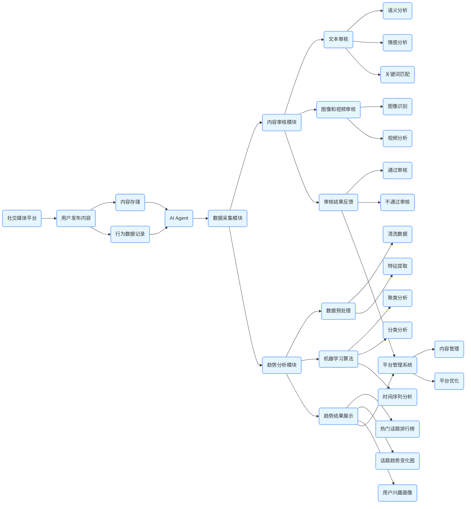

# AI Agent在社交媒体中的应用：内容审核与趋势分析

> 关键词：AI Agent、社交媒体、内容审核、趋势分析、人工智能应用

> 摘要：本文深入探讨了AI Agent在社交媒体中的应用，聚焦于内容审核与趋势分析两个核心方面。首先介绍了相关背景知识，包括目的、预期读者等；接着阐述了AI Agent的核心概念及与社交媒体的联系，通过文本示意图和Mermaid流程图进行直观展示。详细讲解了核心算法原理和具体操作步骤，结合Python代码进行说明，并给出了相关数学模型和公式。通过项目实战展示了如何在实际中运用AI Agent进行内容审核与趋势分析，包括开发环境搭建、源代码实现与解读。分析了AI Agent在社交媒体中的实际应用场景，推荐了学习、开发相关的工具和资源，最后总结了未来发展趋势与挑战，还提供了常见问题解答和扩展阅读参考资料，旨在为读者全面呈现AI Agent在社交媒体领域的应用全貌。

## 1. 背景介绍 
### 1.1 目的和范围
随着社交媒体的飞速发展，其用户数量急剧增加，每天产生的海量内容给平台管理带来了巨大挑战。一方面，确保内容符合平台规定和社会道德规范，避免不良信息传播，需要高效的内容审核机制；另一方面，了解用户兴趣和社会热点趋势，有助于平台优化服务、提供个性化推荐。本文章的目的在于探讨如何利用AI Agent来解决社交媒体中的内容审核和趋势分析问题。范围涵盖了AI Agent的基本概念、相关算法原理、实际应用案例，以及未来发展趋势等方面。

### 1.2 预期读者
本文预期读者包括对人工智能技术在社交媒体领域应用感兴趣的技术爱好者、社交媒体平台的开发者和运营者、相关领域的研究人员，以及希望了解AI Agent实际应用场景的学生等。对于有一定编程基础和机器学习知识的读者，能深入理解算法原理和代码实现；对于非技术背景的读者，也能通过直观的描述和案例了解AI Agent在社交媒体中的作用。

### 1.3 文档结构概述
本文首先介绍了AI Agent在社交媒体应用的背景知识，包括目的、读者群体和文档结构。接着阐述了AI Agent的核心概念及其与社交媒体的联系，通过示意图和流程图进行直观展示。然后详细讲解了核心算法原理和具体操作步骤，结合Python代码进行说明，并给出了相关数学模型和公式。通过项目实战部分展示了如何在实际中运用AI Agent进行内容审核与趋势分析，包括开发环境搭建、源代码实现与解读。之后分析了AI Agent在社交媒体中的实际应用场景，推荐了学习、开发相关的工具和资源。最后总结了未来发展趋势与挑战，提供了常见问题解答和扩展阅读参考资料。

### 1.4 术语表
#### 1.4.1 核心术语定义
- **AI Agent（人工智能代理）**：是一种能够感知环境、自主决策并采取行动以实现特定目标的人工智能实体。在社交媒体中，AI Agent可以感知用户发布的内容、用户行为等信息，根据预设规则或通过学习进行内容审核和趋势分析等操作。
- **内容审核**：指对社交媒体上用户发布的各种内容，如文本、图片、视频等进行检查，判断其是否符合平台规定和法律法规，防止不良信息传播。
- **趋势分析**：通过对社交媒体上大量数据的分析，挖掘出用户兴趣、社会热点等随时间变化的趋势，为平台运营、营销等提供决策依据。

#### 1.4.2 相关概念解释
- **自然语言处理（NLP）**：是人工智能的一个重要领域，主要研究如何让计算机理解和处理人类语言。在内容审核中，NLP技术可用于对文本内容进行语义分析、情感分析等；在趋势分析中，可用于提取关键词、主题建模等。
- **计算机视觉（CV）**：研究如何使计算机从图像或视频中获取信息。在内容审核中，CV技术可用于识别图片和视频中的违规内容，如色情、暴力等；在趋势分析中，可用于分析图片和视频的流行风格等。
- **机器学习（ML）**：是一门多领域交叉学科，涉及概率论、统计学、逼近论、凸分析、算法复杂度理论等多门学科。它专门研究计算机怎样模拟或实现人类的学习行为，以获取新的知识或技能，重新组织已有的知识结构使之不断改善自身的性能。在AI Agent中，机器学习算法可用于训练模型，以提高内容审核和趋势分析的准确性。

#### 1.4.3 缩略词列表
- **NLP**：Natural Language Processing（自然语言处理）
- **CV**：Computer Vision（计算机视觉）
- **ML**：Machine Learning（机器学习）
- **API**：Application Programming Interface（应用程序编程接口）

## 2. 核心概念与联系 

### 核心概念原理
AI Agent在社交媒体中的内容审核与趋势分析主要基于人工智能的多个领域技术。在内容审核方面，对于文本内容，利用自然语言处理技术进行语义理解、情感分析和关键词匹配等操作。例如，通过训练好的模型判断文本是否包含敏感词汇、是否具有攻击性或不良导向等。对于图片和视频内容，借助计算机视觉技术进行图像识别和视频分析，检测其中是否存在违规元素，如色情、暴力、恐怖等画面。

在趋势分析方面，AI Agent通过收集和分析社交媒体上的大量数据，包括用户发布的内容、点赞、评论、分享等行为数据。利用自然语言处理技术提取关键词和主题，通过机器学习算法进行聚类和分类，挖掘出用户感兴趣的话题和热点趋势。例如，通过分析一段时间内的社交媒体数据，发现某个话题的讨论量逐渐增加，从而判断该话题正在成为热点。

### 架构的文本示意图
```plaintext
社交媒体平台
├── 用户发布内容（文本、图片、视频）
│   ├── 内容存储
│   └── 行为数据记录（点赞、评论、分享）
├── AI Agent
│   ├── 数据采集模块
│   │   ├── 从内容存储和行为数据记录中获取数据
│   │   └── 实时监听新发布内容
│   ├── 内容审核模块
│   │   ├── 文本审核（NLP技术）
│   │   │   ├── 语义分析
│   │   │   ├── 情感分析
│   │   │   └── 关键词匹配
│   │   ├── 图像和视频审核（CV技术）
│   │   │   ├── 图像识别
│   │   │   └── 视频分析
│   │   └── 审核结果反馈
│   │       ├── 通过审核
│   │       └── 不通过审核（标记、删除、警告等）
│   ├── 趋势分析模块
│   │   ├── 数据预处理
│   │   │   ├── 清洗数据
│   │   │   └── 特征提取
│   │   ├── 机器学习算法
│   │   │   ├── 聚类分析
│   │   │   ├── 分类分析
│   │   │   └── 时间序列分析
│   │   └── 趋势结果展示
│   │       ├── 热门话题排行榜
│   │       ├── 话题趋势变化图
│   │       └── 用户兴趣画像
└── 平台管理系统
    ├── 根据审核结果进行内容管理
    ├── 根据趋势分析结果进行平台优化
```

### Mermaid流程图


## 3. 核心算法原理 & 具体操作步骤 

### 文本审核算法原理及Python代码实现
#### 关键词匹配算法
关键词匹配是一种简单而有效的文本审核方法，通过预先定义敏感关键词列表，检查文本中是否包含这些关键词。
```python
def keyword_matching(text, keyword_list):
    for keyword in keyword_list:
        if keyword in text:
            return True
    return False

# 示例使用
text = "这是一段包含敏感词的文本，如毒品"
keyword_list = ["毒品", "暴力", "色情"]
result = keyword_matching(text, keyword_list)
print(f"关键词匹配结果: {result}")
```
#### 情感分析算法
情感分析用于判断文本的情感倾向，通常分为积极、消极和中性。这里使用`TextBlob`库进行简单的情感分析。
```python
from textblob import TextBlob

def sentiment_analysis(text):
    blob = TextBlob(text)
    polarity = blob.sentiment.polarity
    if polarity > 0:
        return "积极"
    elif polarity < 0:
        return "消极"
    else:
        return "中性"

# 示例使用
text = "这部电影太棒了！"
result = sentiment_analysis(text)
print(f"情感分析结果: {result}")
```

### 图像审核算法原理及Python代码实现
#### 图像分类算法
这里使用`Keras`库和预训练的`VGG16`模型进行图像分类，判断图像是否包含违规内容。
```python
from keras.applications.vgg16 import VGG16
from keras.preprocessing import image
from keras.applications.vgg16 import preprocess_input, decode_predictions
import numpy as np

# 加载预训练模型
model = VGG16(weights='imagenet')

def image_classification(img_path):
    img = image.load_img(img_path, target_size=(224, 224))
    x = image.img_to_array(img)
    x = np.expand_dims(x, axis=0)
    x = preprocess_input(x)

    preds = model.predict(x)
    decoded_preds = decode_predictions(preds, top=3)[0]
    for _, label, prob in decoded_preds:
        if label in ["pornography", "violence"]:  # 假设违规标签
            return True
    return False

# 示例使用
img_path = "test_image.jpg"
result = image_classification(img_path)
print(f"图像分类结果: {result}")
```

### 趋势分析算法原理及Python代码实现
#### 关键词提取算法
使用`jieba`库进行中文关键词提取。
```python
import jieba.analyse

def keyword_extraction(text):
    keywords = jieba.analyse.extract_tags(text, topK=5, withWeight=False)
    return keywords

# 示例使用
text = "人工智能在社交媒体中的应用越来越广泛，特别是在内容审核和趋势分析方面。"
result = keyword_extraction(text)
print(f"关键词提取结果: {result}")
```
#### 聚类分析算法
使用`sklearn`库的`KMeans`算法进行简单的文本聚类分析。
```python
from sklearn.feature_extraction.text import TfidfVectorizer
from sklearn.cluster import KMeans

def text_clustering(texts, n_clusters=3):
    vectorizer = TfidfVectorizer(stop_words='english')
    X = vectorizer.fit_transform(texts)

    kmeans = KMeans(n_clusters=n_clusters, random_state=0)
    kmeans.fit(X)

    labels = kmeans.labels_
    return labels

# 示例使用
texts = [
    "AI in social media for content moderation",
    "Trend analysis using AI in social media",
    "Machine learning for image recognition in social media",
    "Social media marketing strategies",
    "Content creation for social media platforms"
]
labels = text_clustering(texts)
print(f"文本聚类结果: {labels}")
```

## 4. 数学模型和公式 & 详细讲解 & 举例说明 

### 关键词匹配的数学模型
关键词匹配可以看作是一个简单的布尔逻辑判断问题。设文本为 $T$，关键词列表为 $K = \{k_1, k_2, \cdots, k_n\}$，定义匹配函数 $f(T, K)$ 如下：
$$
f(T, K) = 
\begin{cases}
True, & \text{如果存在 } k_i \in K \text{ 使得 } k_i \in T \\
False, & \text{否则}
\end{cases}
$$
例如，对于文本 $T =$ "这是一段包含敏感词的文本，如毒品"，关键词列表 $K =$ ["毒品", "暴力", "色情"]，因为 "毒品" $\in T$，所以 $f(T, K) = True$。

### 情感分析的数学模型
情感分析通常基于文本的词向量表示和分类器。以朴素贝叶斯分类器为例，假设文本 $T$ 由 $n$ 个词组成，即 $T = \{w_1, w_2, \cdots, w_n\}$，情感类别集合为 $C = \{c_1, c_2, \cdots, c_m\}$（如积极、消极、中性）。根据贝叶斯定理，文本 $T$ 属于类别 $c_j$ 的概率为：
$$
P(c_j|T) = \frac{P(T|c_j)P(c_j)}{P(T)}
$$
其中，$P(c_j)$ 是类别 $c_j$ 的先验概率，$P(T|c_j)$ 是在类别 $c_j$ 下文本 $T$ 出现的概率。在实际计算中，为了简化计算，通常假设词之间相互独立，即：
$$
P(T|c_j) = \prod_{i=1}^{n}P(w_i|c_j)
$$
然后选择概率最大的类别作为文本的情感类别：
$$
\hat{c} = \arg\max_{c_j \in C} P(c_j|T)
$$

### 图像分类的数学模型
图像分类通常基于卷积神经网络（CNN）。以 VGG16 模型为例，输入图像 $I$ 经过一系列卷积层、池化层和全连接层的处理，最终输出一个概率向量 $\mathbf{p} = (p_1, p_2, \cdots, p_N)$，其中 $p_i$ 表示图像属于第 $i$ 个类别的概率，$N$ 是类别总数。选择概率最大的类别作为图像的分类结果：
$$
\hat{y} = \arg\max_{i} p_i
$$

### 关键词提取的数学模型
关键词提取常用的方法是 TF-IDF（词频 - 逆文档频率）。设词 $w$ 在文档 $d$ 中的词频为 $TF(w, d)$，表示词 $w$ 在文档 $d$ 中出现的次数；逆文档频率为 $IDF(w)$，表示包含词 $w$ 的文档数 $n_w$ 与文档总数 $N$ 的关系：
$$
IDF(w) = \log\frac{N}{n_w + 1}
$$
则词 $w$ 在文档 $d$ 中的 TF-IDF 值为：
$$
TF - IDF(w, d) = TF(w, d) \times IDF(w)
$$
选择 TF-IDF 值较高的词作为关键词。

### 聚类分析的数学模型
以 K-Means 算法为例，假设数据集为 $\mathbf{X} = \{\mathbf{x}_1, \mathbf{x}_2, \cdots, \mathbf{x}_m\}$，其中 $\mathbf{x}_i \in \mathbb{R}^n$ 是第 $i$ 个样本，$m$ 是样本数量，$n$ 是特征维度。K-Means 算法的目标是将数据集划分为 $k$ 个簇 $C = \{C_1, C_2, \cdots, C_k\}$，使得簇内样本的相似度最大，簇间样本的相似度最小。定义簇的质心为 $\mu_j$，$j = 1, 2, \cdots, k$，则 K-Means 算法的目标函数为：
$$
J = \sum_{j=1}^{k} \sum_{\mathbf{x}_i \in C_j} \|\mathbf{x}_i - \mu_j\|^2
$$
K-Means 算法通过迭代更新簇的质心和样本的簇分配，使得目标函数 $J$ 最小化。

## 5. 项目实战：代码实际案例和详细解释说明 

### 5.1  开发环境搭建
#### 操作系统
建议使用 Linux 系统（如 Ubuntu）或 macOS，也可以使用 Windows 系统。

#### Python 环境
安装 Python 3.7 及以上版本。可以使用 Anaconda 来管理 Python 环境，以下是安装步骤：
1. 下载 Anaconda 安装包：根据自己的操作系统从 [Anaconda 官网](https://www.anaconda.com/products/individual) 下载对应版本的安装包。
2. 安装 Anaconda：按照安装向导的提示进行安装。
3. 创建虚拟环境：打开终端（或 Anaconda Prompt），执行以下命令创建一个新的虚拟环境：
```bash
conda create -n social_media_ai python=3.8
```
4. 激活虚拟环境：
```bash
conda activate social_media_ai
```

#### 安装依赖库
在激活的虚拟环境中，使用 `pip` 安装所需的依赖库：
```bash
pip install numpy pandas scikit-learn keras tensorflow textblob jieba
```

### 5.2  源代码详细实现和代码解读
#### 内容审核模块
```python
import re
from textblob import TextBlob
from keras.applications.vgg16 import VGG16
from keras.preprocessing import image
from keras.applications.vgg16 import preprocess_input, decode_predictions
import numpy as np

# 关键词匹配
def keyword_matching(text, keyword_list):
    for keyword in keyword_list:
        if keyword in text:
            return True
    return False

# 情感分析
def sentiment_analysis(text):
    blob = TextBlob(text)
    polarity = blob.sentiment.polarity
    if polarity < -0.5:  # 自定义消极阈值
        return True  # 消极内容
    return False

# 图像审核
def image_classification(img_path):
    model = VGG16(weights='imagenet')
    img = image.load_img(img_path, target_size=(224, 224))
    x = image.img_to_array(img)
    x = np.expand_dims(x, axis=0)
    x = preprocess_input(x)

    preds = model.predict(x)
    decoded_preds = decode_predictions(preds, top=3)[0]
    for _, label, prob in decoded_preds:
        if label in ["pornography", "violence"]:
            return True
    return False

# 内容审核主函数
def content_moderation(text=None, img_path=None, keyword_list=None):
    if text:
        if keyword_list and keyword_matching(text, keyword_list):
            return True
        if sentiment_analysis(text):
            return True
    if img_path:
        if image_classification(img_path):
            return True
    return False

# 示例使用
text = "这是一段包含敏感词的文本，如毒品"
img_path = "test_image.jpg"
keyword_list = ["毒品", "暴力", "色情"]
result = content_moderation(text=text, img_path=img_path, keyword_list=keyword_list)
print(f"内容审核结果: {result}")
```
**代码解读**：
- `keyword_matching` 函数：遍历关键词列表，检查文本中是否包含任何关键词，如果包含则返回 `True`，否则返回 `False`。
- `sentiment_analysis` 函数：使用 `TextBlob` 库进行情感分析，计算文本的极性得分。如果极性得分小于 -0.5，则认为文本是消极内容，返回 `True`，否则返回 `False`。
- `image_classification` 函数：加载预训练的 VGG16 模型，对输入的图像进行分类。如果分类结果中包含违规标签（如 "pornography" 或 "violence"），则返回 `True`，否则返回 `False`。
- `content_moderation` 函数：根据输入的文本、图像路径和关键词列表进行内容审核。如果文本包含关键词或情感消极，或者图像包含违规内容，则返回 `True`，否则返回 `False`。

#### 趋势分析模块
```python
import jieba.analyse
from sklearn.feature_extraction.text import TfidfVectorizer
from sklearn.cluster import KMeans
import pandas as pd

# 关键词提取
def keyword_extraction(text):
    keywords = jieba.analyse.extract_tags(text, topK=5, withWeight=False)
    return keywords

# 文本聚类
def text_clustering(texts, n_clusters=3):
    vectorizer = TfidfVectorizer(stop_words='english')
    X = vectorizer.fit_transform(texts)

    kmeans = KMeans(n_clusters=n_clusters, random_state=0)
    kmeans.fit(X)

    labels = kmeans.labels_
    return labels

# 趋势分析主函数
def trend_analysis(texts):
    # 关键词提取
    all_keywords = []
    for text in texts:
        keywords = keyword_extraction(text)
        all_keywords.extend(keywords)

    # 统计关键词频率
    keyword_counts = pd.Series(all_keywords).value_counts()

    # 文本聚类
    labels = text_clustering(texts)

    return keyword_counts, labels

# 示例使用
texts = [
    "AI in social media for content moderation",
    "Trend analysis using AI in social media",
    "Machine learning for image recognition in social media",
    "Social media marketing strategies",
    "Content creation for social media platforms"
]
keyword_counts, labels = trend_analysis(texts)
print(f"关键词频率统计: {keyword_counts}")
print(f"文本聚类结果: {labels}")
```
**代码解读**：
- `keyword_extraction` 函数：使用 `jieba` 库进行中文关键词提取，提取前 5 个关键词。
- `text_clustering` 函数：使用 `TfidfVectorizer` 将文本转换为 TF-IDF 特征向量，然后使用 `KMeans` 算法进行聚类。
- `trend_analysis` 函数：首先对所有文本进行关键词提取，并统计关键词的频率。然后对文本进行聚类分析，返回关键词频率统计结果和聚类标签。

### 5.3  代码解读与分析
#### 内容审核模块
- **优点**：
  - 简单易懂：代码结构清晰，各个功能模块独立，易于理解和维护。
  - 可扩展性：可以方便地添加新的审核规则，如增加关键词、调整情感分析阈值等。
  - 多模态支持：支持文本和图像的审核，综合考虑多种内容形式。
- **缺点**：
  - 准确性有限：关键词匹配和情感分析方法相对简单，可能会出现误判。例如，一些正常的文本可能因为包含关键词而被误判为违规内容。
  - 模型依赖：图像审核依赖于预训练的 VGG16 模型，对于特定领域的违规图像可能识别效果不佳。

#### 趋势分析模块
- **优点**：
  - 关键词提取有效：使用 TF-IDF 方法提取关键词，能够较好地反映文本的主题。
  - 聚类分析实用：通过聚类分析可以将文本分组，发现不同的主题趋势。
  - 数据可视化基础：关键词频率统计和聚类结果可以为后续的数据可视化提供基础。
- **缺点**：
  - 聚类效果依赖参数：KMeans 算法的聚类效果依赖于簇的数量 $k$ 的选择，需要根据实际情况进行调整。
  - 缺乏上下文理解：关键词提取和聚类分析主要基于文本的词频和特征，缺乏对文本上下文的深入理解。

## 6. 实际应用场景 
### 社交媒体平台内容管理
社交媒体平台每天会收到大量用户发布的内容，通过 AI Agent 进行内容审核可以快速筛选出违规内容，如色情、暴力、虚假信息等，确保平台内容的健康和安全。同时，趋势分析可以帮助平台了解用户兴趣和热点话题，优化推荐算法，提高用户体验。

### 品牌声誉管理
企业可以利用 AI Agent 对社交媒体上与自身品牌相关的内容进行审核和趋势分析。及时发现负面评价和潜在危机，采取相应的措施进行公关处理。同时，了解消费者对品牌的关注点和需求，调整营销策略。

### 舆情监测
政府和相关机构可以通过 AI Agent 对社交媒体上的舆情进行监测。分析公众对政策、事件的态度和反应，及时掌握社会动态，为决策提供参考。

### 广告投放优化
广告商可以利用 AI Agent 的趋势分析功能，了解社交媒体上的热点话题和用户兴趣，制定更精准的广告投放策略。将广告投放到用户感兴趣的内容附近，提高广告的点击率和转化率。

## 7. 工具和资源推荐
### 7.1 学习资源推荐
#### 7.1.1 书籍推荐
- 《Python 机器学习》：这本书详细介绍了 Python 在机器学习领域的应用，包括各种机器学习算法的原理和实现，适合初学者入门。
- 《深度学习》：由 Ian Goodfellow、Yoshua Bengio 和 Aaron Courville 合著，是深度学习领域的经典教材，涵盖了深度学习的基本原理、模型架构和应用。
- 《自然语言处理入门》：介绍了自然语言处理的基本概念、方法和技术，包括词法分析、句法分析、语义分析等内容。

#### 7.1.2 在线课程
- Coursera 上的 “机器学习” 课程：由 Andrew Ng 教授授课，是机器学习领域的经典课程，讲解深入浅出，适合初学者。
- edX 上的 “深度学习” 系列课程：由不同的知名教授授课，涵盖了深度学习的各个方面，包括卷积神经网络、循环神经网络等。
- 阿里云天池的 “自然语言处理实战” 课程：结合实际案例，介绍了自然语言处理的应用和实践技巧。

#### 7.1.3 技术博客和网站
- Medium：上面有很多关于人工智能、机器学习和自然语言处理的优质博客文章，作者来自不同的领域和背景。
- Towards Data Science：专注于数据科学和机器学习领域的博客，提供了很多实用的技术文章和案例分析。
- 机器之心：国内知名的人工智能媒体，提供了最新的行业动态、技术文章和研究成果。

### 7.2 开发工具框架推荐
#### 7.2.1 IDE和编辑器
- PyCharm：一款功能强大的 Python 集成开发环境，提供了代码编辑、调试、版本控制等一系列功能，适合开发大型 Python 项目。
- Jupyter Notebook：一个交互式的开发环境，支持 Python、R 等多种编程语言，方便进行数据探索和模型实验。
- Visual Studio Code：一款轻量级的代码编辑器，支持多种编程语言，有丰富的插件扩展功能，适合快速开发和调试代码。

#### 7.2.2 调试和性能分析工具
- TensorBoard：TensorFlow 提供的可视化工具，可以用于查看模型的训练过程、损失函数变化、网络结构等信息，帮助调试和优化模型。
- Py-Spy：一个用于分析 Python 程序性能的工具，可以实时查看程序的 CPU 使用率、函数调用栈等信息，找出性能瓶颈。
- Memory Profiler：用于分析 Python 程序的内存使用情况，帮助发现内存泄漏和优化内存占用。

#### 7.2.3 相关框架和库
- TensorFlow：一个开源的机器学习框架，提供了丰富的工具和接口，支持构建和训练各种深度学习模型。
- PyTorch：另一个流行的深度学习框架，以其简洁的语法和动态计算图而受到广泛关注，适合研究和开发。
- NLTK：自然语言处理工具包，提供了丰富的语料库和处理工具，如分词、词性标注、命名实体识别等。

### 7.3 相关论文著作推荐
#### 7.3.1 经典论文
- 《Attention Is All You Need》：提出了 Transformer 模型，是自然语言处理领域的重要突破，为后续的 BERT、GPT 等模型奠定了基础。
- 《ImageNet Classification with Deep Convolutional Neural Networks》：介绍了 AlexNet 模型，开启了深度学习在计算机视觉领域的大规模应用。
- 《A Mathematical Theory of Communication》：由 Claude E. Shannon 撰写，是信息论的奠基之作，对自然语言处理和机器学习中的信息处理有重要影响。

#### 7.3.2 最新研究成果
- 关注顶级学术会议，如 NeurIPS（神经信息处理系统大会）、ICML（国际机器学习会议）、ACL（计算语言学协会年会）等，这些会议上会发表很多关于人工智能、机器学习和自然语言处理的最新研究成果。
- 查阅学术期刊，如 Journal of Artificial Intelligence Research（JAIR）、Artificial Intelligence 等，获取最新的学术论文。

#### 7.3.3 应用案例分析
- 一些知名科技公司的技术博客，如 Google AI Blog、Facebook Research Blog 等，会分享他们在人工智能应用方面的案例和经验。
- 行业报告和白皮书，如 Gartner、IDC 等机构发布的相关报告，分析了人工智能在不同行业的应用现状和趋势。

## 8. 总结：未来发展趋势与挑战
### 未来发展趋势
#### 多模态融合
未来的 AI Agent 将不仅仅局限于文本和图像的处理，还会融合音频、视频等多种模态的信息。例如，在内容审核中，可以同时对视频的画面、声音和文字进行综合分析，提高审核的准确性和全面性。在趋势分析中，结合多种模态的数据可以更深入地了解用户的兴趣和行为。

#### 强化学习应用
强化学习可以让 AI Agent 在与环境的交互中不断学习和优化决策。在社交媒体中，AI Agent 可以通过强化学习来动态调整内容审核策略，根据不同的场景和用户反馈做出更合理的决策。例如，对于不同类型的用户群体，采用不同的审核标准；在不同的时间段，根据流量和内容特点调整审核力度。

#### 个性化服务
随着用户对个性化体验的需求不断增加，AI Agent 将为每个用户提供个性化的内容审核和趋势分析服务。例如，根据用户的兴趣偏好、使用习惯和社交关系，为用户推荐更符合其需求的内容，同时对用户发布的内容进行更精准的审核和引导。

#### 与区块链结合
区块链技术具有去中心化、不可篡改等特点，可以为社交媒体的内容审核和趋势分析提供更安全、可信的环境。例如，通过区块链记录用户的内容发布和审核历史，确保数据的真实性和完整性；利用智能合约实现自动化的内容审核和奖励机制。

### 挑战
#### 数据隐私和安全
社交媒体上包含大量用户的个人信息和隐私数据，AI Agent 在处理这些数据时需要严格遵守相关法律法规，保护用户的隐私和数据安全。同时，要防止数据泄露和恶意攻击，确保系统的稳定性和可靠性。

#### 算法偏见
AI Agent 的算法往往基于大量的数据进行训练，如果数据存在偏差或不完整，可能会导致算法产生偏见。例如，在内容审核中，可能会对某些群体或观点存在歧视性的判断；在趋势分析中，可能会忽略某些小众但有价值的趋势。因此，需要采取措施减少算法偏见，提高算法的公正性和客观性。

#### 语义理解难题
虽然自然语言处理技术取得了很大进展，但目前的 AI Agent 在语义理解方面仍然存在一定的局限性。例如，对于一些隐含的语义、隐喻和歧义的理解还不够准确。在内容审核和趋势分析中，准确的语义理解是非常重要的，因此需要进一步研究和发展语义理解技术。

#### 技术更新换代快
人工智能领域的技术发展迅速，新的算法和模型不断涌现。AI Agent 需要及时跟上技术的发展步伐，不断更新和优化自身的算法和架构，以提高性能和竞争力。同时，开发人员也需要不断学习和掌握新的技术知识，以应对不断变化的需求。

## 9. 附录：常见问题与解答
### 1. AI Agent 在内容审核中的准确性如何保证？
可以通过以下方法提高 AI Agent 在内容审核中的准确性：
- 使用高质量的训练数据：确保训练数据包含各种类型的内容和违规情况，以提高模型的泛化能力。
- 多模型融合：结合多种审核方法和模型，如关键词匹配、机器学习分类器、深度学习模型等，综合判断内容是否违规。
- 人工审核辅助：对于一些难以判断的内容，由人工进行审核和标注，然后将这些数据反馈给 AI Agent 进行训练，不断优化模型。
- 持续更新模型：随着新的违规内容和趋势的出现，及时更新训练数据和模型参数，以保持模型的准确性。

### 2. AI Agent 在趋势分析中能否预测未来趋势？
AI Agent 可以通过对历史数据的分析和挖掘，发现一些潜在的趋势和模式，但不能完全准确地预测未来趋势。因为未来趋势受到多种因素的影响，如社会事件、政策变化、技术创新等，这些因素具有不确定性。然而，AI Agent 可以提供一些有价值的参考信息，帮助用户提前做好准备和决策。

### 3. 如何选择适合的 AI Agent 开发框架和工具？
选择适合的开发框架和工具需要考虑以下因素：
- 项目需求：根据项目的具体需求，如处理的数据类型、算法复杂度、性能要求等，选择合适的框架和工具。例如，如果需要处理大规模的图像数据，选择支持 GPU 加速的深度学习框架如 TensorFlow 或 PyTorch；如果是简单的文本处理任务，可以选择轻量级的工具如 NLTK。
- 开发经验：考虑开发团队的技术水平和经验。如果团队熟悉某种编程语言和框架，选择与之相关的工具可以提高开发效率。
- 社区支持：选择有活跃社区支持的框架和工具，这样可以方便获取文档、教程和开源代码，遇到问题也能及时得到解决。
- 可扩展性：确保所选的框架和工具具有良好的可扩展性，以便在项目发展过程中能够方便地添加新的功能和模块。

### 4. AI Agent 在社交媒体中的应用是否会取代人工审核和分析？
目前来看，AI Agent 不会完全取代人工审核和分析。虽然 AI Agent 可以快速处理大量数据，提高效率和准确性，但在一些复杂的情况下，如对语义的深入理解、对文化背景的把握、对情感的细腻感知等方面，人工审核和分析仍然具有不可替代的作用。因此，未来的发展趋势是 AI Agent 与人工审核和分析相结合，发挥各自的优势，实现更高效、更准确的内容审核和趋势分析。

## 10. 扩展阅读 & 参考资料
### 扩展阅读
- 《人工智能时代》：探讨了人工智能对社会、经济和文化的影响，以及人类如何应对人工智能带来的挑战和机遇。
- 《未来简史：从智人到神人》：作者 Yuval Noah Harari 对未来人类的发展进行了大胆的预测，其中涉及到人工智能、生物技术等领域的发展趋势。
- 《失控：全人类的最终命运和结局》：这本书提出了很多关于复杂系统、自组织、进化等方面的思想，对理解人工智能的发展和应用有一定的启发。

### 参考资料
- 各社交媒体平台的官方文档和开发者文档，如 Facebook、Twitter、Instagram 等。
- 相关的学术论文和研究报告，可通过学术数据库如 IEEE Xplore、ACM Digital Library、Google Scholar 等获取。
- 开源项目和代码库，如 GitHub 上的相关项目，可从中学习和借鉴他人的实现思路和代码。

作者：AI天才研究院/AI Genius Institute & 禅与计算机程序设计艺术 /Zen And The Art of Computer Programming