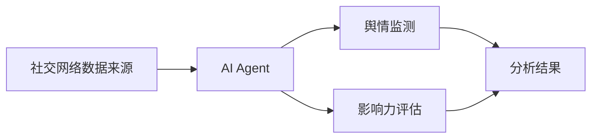

# AI Agent在社交网络分析中的应用：舆情监测与影响力评估

> 关键词：AI Agent、社交网络分析、舆情监测、影响力评估、人工智能

> 摘要：本文聚焦于AI Agent在社交网络分析中的应用，着重探讨其在舆情监测与影响力评估方面的作用。首先介绍了相关背景知识，包括目的范围、预期读者等内容。接着详细阐述了核心概念与联系，给出了原理和架构的示意图与流程图。深入讲解了核心算法原理，并使用Python代码进行说明，同时介绍了相关的数学模型和公式。通过项目实战展示了代码的实际应用和详细解读。分析了AI Agent在社交网络分析中的实际应用场景，推荐了学习、开发相关的工具和资源，以及相关论文著作。最后总结了未来发展趋势与挑战，并提供了常见问题解答和扩展阅读参考资料。

## 1. 背景介绍 
### 1.1 目的和范围
在当今数字化时代，社交网络已经成为人们交流、表达观点和获取信息的重要平台。社交网络上的数据量巨大且实时更新，蕴含着丰富的舆情信息和用户影响力信息。本研究的目的是探讨如何利用AI Agent技术对社交网络进行有效分析，实现精准的舆情监测和客观的影响力评估。范围涵盖了主流社交网络平台，如微博、微信、Twitter等，研究内容包括AI Agent的工作原理、相关算法、数学模型以及实际应用案例等。

### 1.2 预期读者
本文预期读者包括从事人工智能、数据挖掘、社交网络分析等领域的研究人员和学者，希望了解如何将AI Agent应用于实际项目的开发人员，以及关注社交网络舆情和用户影响力的企业市场营销人员、政府公关人员等。

### 1.3 文档结构概述
本文将按照以下结构展开：首先介绍核心概念与联系，包括AI Agent、社交网络分析、舆情监测和影响力评估的定义和相互关系，并给出相应的示意图和流程图；接着详细讲解核心算法原理和具体操作步骤，使用Python代码进行示例；然后介绍相关的数学模型和公式，并举例说明；通过项目实战展示代码的实际应用和详细解读；分析AI Agent在社交网络分析中的实际应用场景；推荐学习、开发相关的工具和资源，以及相关论文著作；最后总结未来发展趋势与挑战，提供常见问题解答和扩展阅读参考资料。

### 1.4 术语表
#### 1.4.1 核心术语定义
- **AI Agent**：是一种能够感知环境、自主决策并采取行动以实现特定目标的人工智能实体。在社交网络分析中，AI Agent可以自动收集、分析和处理社交网络数据。
- **社交网络分析**：是指对社交网络中的节点（如用户、组织）和边（如关系、互动）进行研究，以揭示网络的结构、行为和规律。
- **舆情监测**：是指对社会舆情的监测和分析，通过收集和分析社交网络上的信息，了解公众对特定事件、话题或品牌的态度和看法。
- **影响力评估**：是指对社交网络中用户或节点的影响力进行量化评估，确定其在信息传播和社交互动中的作用和地位。

#### 1.4.2 相关概念解释
- **自然语言处理（NLP）**：是AI Agent在社交网络分析中常用的技术之一，用于处理和理解社交网络上的文本信息，如情感分析、主题提取等。
- **机器学习（ML）**：通过训练模型，让AI Agent能够自动从数据中学习规律和模式，从而实现舆情监测和影响力评估等任务。
- **图论**：用于描述和分析社交网络的结构，为影响力评估提供理论基础。

#### 1.4.3 缩略词列表
- **AI**：Artificial Intelligence（人工智能）
- **NLP**：Natural Language Processing（自然语言处理）
- **ML**：Machine Learning（机器学习）

## 2. 核心概念与联系 
### 核心概念原理
#### AI Agent
AI Agent的核心原理是基于感知、决策和行动的循环。在社交网络分析中，AI Agent首先通过API或爬虫等方式感知社交网络环境，收集相关数据；然后对收集到的数据进行分析和处理，运用机器学习、自然语言处理等技术进行决策，例如判断舆情的正负倾向、评估用户的影响力等；最后根据决策结果采取相应的行动，如向用户发送预警信息、提供分析报告等。

#### 社交网络分析
社交网络分析的原理是将社交网络抽象为图结构，其中节点表示用户或组织，边表示节点之间的关系或互动。通过对图的结构和属性进行分析，可以揭示社交网络的拓扑结构、信息传播规律、用户行为模式等。

#### 舆情监测
舆情监测的原理是通过对社交网络上的文本信息进行收集、整理和分析，运用自然语言处理技术提取关键词、主题和情感倾向等信息，从而了解公众对特定事件、话题或品牌的态度和看法。

#### 影响力评估
影响力评估的原理是基于社交网络的结构和节点之间的互动关系，运用图论、机器学习等方法对节点的影响力进行量化评估。例如，通过计算节点的度中心性、介数中心性、PageRank值等指标来衡量节点在社交网络中的影响力。

### 架构的文本示意图
```plaintext
社交网络数据来源（微博、微信、Twitter等）
    |
    v
AI Agent（数据收集模块、数据处理模块、决策模块、行动模块）
    |
    v
舆情监测（文本分析、情感分析、主题提取）
    |
    v
影响力评估（图论分析、机器学习模型）
    |
    v
分析结果（舆情报告、影响力排名）
```

### Mermaid流程图


## 3. 核心算法原理 & 具体操作步骤 
### 核心算法原理
#### 情感分析算法
情感分析是舆情监测中的重要环节，用于判断文本的情感倾向（积极、消极或中性）。常用的情感分析算法有基于词典的方法和基于机器学习的方法。

基于词典的方法是通过预先构建情感词典，将文本中的词语与词典中的词语进行匹配，根据词语的情感极性计算文本的情感得分。例如，使用SnowNLP库进行情感分析：
```python
from snownlp import SnowNLP

text = "这个产品真的很棒！"
s = SnowNLP(text)
sentiment_score = s.sentiments
if sentiment_score > 0.5:
    print("积极情感")
elif sentiment_score < 0.5:
    print("消极情感")
else:
    print("中性情感")
```

基于机器学习的方法是通过训练分类模型，让模型学习文本的特征和情感标签之间的关系。常用的分类算法有朴素贝叶斯、支持向量机等。以下是使用Scikit-learn库实现朴素贝叶斯分类器进行情感分析的示例：
```python
from sklearn.feature_extraction.text import CountVectorizer
from sklearn.naive_bayes import MultinomialNB
from sklearn.pipeline import Pipeline

# 训练数据
train_texts = ["这个产品真的很棒！", "这个服务太差了！", "一般般，没有什么特别的。"]
train_labels = [1, 0, 2]  # 1: 积极，0: 消极，2: 中性

# 创建管道
pipeline = Pipeline([
    ('vectorizer', CountVectorizer()),
    ('classifier', MultinomialNB())
])

# 训练模型
pipeline.fit(train_texts, train_labels)

# 测试数据
test_text = "这个东西还不错。"
predicted_label = pipeline.predict([test_text])[0]
if predicted_label == 1:
    print("积极情感")
elif predicted_label == 0:
    print("消极情感")
else:
    print("中性情感")
```

#### PageRank算法
PageRank算法是一种用于评估网页重要性的算法，也可以应用于社交网络中的影响力评估。其基本思想是一个节点的影响力取决于指向它的其他节点的数量和质量。

以下是PageRank算法的Python实现：
```python
import numpy as np

def pagerank(M, num_iterations: int = 100, d: float = 0.85):
    N = M.shape[1]
    v = np.random.rand(N, 1)
    v = v / np.linalg.norm(v, 1)
    M_hat = (d * M + (1 - d) / N)
    for i in range(num_iterations):
        v = M_hat @ v
    return v

# 示例邻接矩阵
M = np.array([[0, 1, 1], [1, 0, 0], [1, 0, 0]])
pr = pagerank(M)
print("PageRank值:", pr)
```

### 具体操作步骤
1. **数据收集**：使用API或爬虫工具从社交网络平台收集相关数据，包括用户信息、帖子内容、评论等。
2. **数据预处理**：对收集到的数据进行清洗、去重、分词等处理，以便后续分析。
3. **舆情监测**：运用情感分析算法对文本数据进行情感分析，提取关键词和主题，了解公众的态度和关注点。
4. **影响力评估**：构建社交网络的图结构，使用PageRank等算法计算节点的影响力。
5. **结果展示**：将舆情监测和影响力评估的结果以报告、图表等形式展示给用户。

## 4. 数学模型和公式 & 详细讲解 & 举例说明 
### 情感分析的数学模型
#### 基于词典的情感分析
假设文本 $T$ 由 $n$ 个词语 $w_1, w_2, \cdots, w_n$ 组成，情感词典中每个词语 $w_i$ 都有一个情感极性得分 $s_i$。则文本 $T$ 的情感得分 $S$ 可以表示为：
$$S = \frac{1}{n} \sum_{i=1}^{n} s_i$$

例如，文本 “这个产品真的很棒！” 分词后为 “这个”、“产品”、“真的”、“很棒”，假设 “很棒” 的情感极性得分 $s = 0.9$，其他词语的情感极性得分 $s = 0$，则该文本的情感得分 $S = \frac{0.9}{4} = 0.225$。

#### 基于机器学习的情感分析
在基于机器学习的情感分析中，通常使用分类模型进行预测。假设输入文本 $x$ 经过特征提取后得到特征向量 $\mathbf{x}$，分类模型的参数为 $\mathbf{\theta}$，则预测的情感标签 $y$ 可以表示为：
$$y = f(\mathbf{x}; \mathbf{\theta})$$
其中 $f$ 是分类函数，例如逻辑回归模型的分类函数为：
$$f(\mathbf{x}; \mathbf{\theta}) = \frac{1}{1 + e^{-\mathbf{\theta}^T \mathbf{x}}}$$

### PageRank算法的数学模型
PageRank算法的核心公式为：
$$PR(p_i) = (1 - d) + d \sum_{p_j \in M(p_i)} \frac{PR(p_j)}{L(p_j)}$$
其中 $PR(p_i)$ 是节点 $p_i$ 的PageRank值，$d$ 是阻尼系数（通常取 $0.85$），$M(p_i)$ 是指向节点 $p_i$ 的节点集合，$L(p_j)$ 是节点 $p_j$ 的出度。

例如，对于一个简单的社交网络，有三个节点 $A$、$B$、$C$，其邻接矩阵为：
$$M = \begin{bmatrix}
0 & 1 & 1 \\
1 & 0 & 0 \\
1 & 0 & 0
\end{bmatrix}$$
假设初始的PageRank值都为 $\frac{1}{3}$，经过多次迭代后可以得到最终的PageRank值。

## 5. 项目实战：代码实际案例和详细解释说明 
### 5.1  开发环境搭建
1. **安装Python**：建议使用Python 3.7及以上版本，可以从Python官方网站（https://www.python.org/downloads/）下载安装。
2. **安装必要的库**：使用pip命令安装所需的库，如Scikit-learn、SnowNLP、NetworkX等。
```sh
pip install scikit-learn snownlp networkx
```

### 5.2  源代码详细实现和代码解读
以下是一个完整的项目示例，实现了社交网络舆情监测和影响力评估的功能。

```python
import pandas as pd
from snownlp import SnowNLP
import networkx as nx
import matplotlib.pyplot as plt

# 模拟社交网络数据
data = {
    'user': ['A', 'B', 'C', 'A', 'B'],
    'post': ['这个产品真的很棒！', '这个服务太差了！', '一般般，没有什么特别的。', '非常喜欢这个活动！', '太让人失望了！'],
    'mention': ['B', 'C', 'A', 'C', 'A']
}
df = pd.DataFrame(data)

# 舆情监测：情感分析
df['sentiment'] = df['post'].apply(lambda x: SnowNLP(x).sentiments)
print("舆情监测结果：")
print(df[['post', 'sentiment']])

# 构建社交网络
G = nx.DiGraph()
for index, row in df.iterrows():
    G.add_edge(row['user'], row['mention'])

# 影响力评估：PageRank算法
pr = nx.pagerank(G)
print("影响力评估结果：")
for node, score in pr.items():
    print(f"用户 {node} 的影响力得分：{score}")

# 可视化社交网络
pos = nx.spring_layout(G)
nx.draw_networkx_nodes(G, pos)
nx.draw_networkx_edges(G, pos)
nx.draw_networkx_labels(G, pos)
plt.title("社交网络可视化")
plt.show()
```

### 5.3  代码解读与分析
1. **数据模拟**：使用Pandas库创建一个包含用户信息、帖子内容和提及关系的DataFrame。
2. **舆情监测**：使用SnowNLP库对帖子内容进行情感分析，将情感得分添加到DataFrame中。
3. **构建社交网络**：使用NetworkX库构建有向图表示社交网络，节点表示用户，边表示提及关系。
4. **影响力评估**：使用NetworkX库的pagerank函数计算节点的PageRank值，评估用户的影响力。
5. **可视化**：使用Matplotlib库将社交网络可视化，直观展示节点之间的关系。

## 6. 实际应用场景 
### 企业市场营销
企业可以利用AI Agent进行舆情监测，了解消费者对产品或品牌的评价和反馈，及时调整营销策略。同时，通过影响力评估，找到社交网络中的意见领袖，与其合作进行产品推广，提高品牌知名度和产品销量。

### 政府公关
政府部门可以使用AI Agent监测社会舆情，了解公众对政策、事件的态度和看法，及时回应公众关切，化解社会矛盾。此外，通过评估公众人物和组织的影响力，有针对性地进行信息传播和舆论引导。

### 学术研究
在学术研究领域，AI Agent可以帮助研究人员收集和分析社交网络数据，探索社交行为规律、信息传播机制等问题，为社会学、心理学等学科的研究提供数据支持。

## 7. 工具和资源推荐
### 7.1 学习资源推荐
#### 7.1.1 书籍推荐
- 《Python自然语言处理实战：核心技术与算法》：介绍了Python在自然语言处理中的应用，包括文本分类、情感分析等技术。
- 《社交网络分析：方法与应用》：系统阐述了社交网络分析的理论和方法，涵盖图论、网络模型等内容。
- 《机器学习》：经典的机器学习教材，介绍了各种机器学习算法的原理和应用。

#### 7.1.2 在线课程
- Coursera上的“Natural Language Processing Specialization”：提供了自然语言处理的全面课程，包括情感分析、机器翻译等内容。
- edX上的“Social Network Analysis”：深入讲解了社交网络分析的方法和工具。

#### 7.1.3 技术博客和网站
- 开源中国（https://www.oschina.net/）：提供了丰富的技术文章和开源项目资源。
- 知乎（https://www.zhihu.com/）：有很多关于人工智能、社交网络分析的讨论和分享。

### 7.2 开发工具框架推荐
#### 7.2.1 IDE和编辑器
- PyCharm：功能强大的Python集成开发环境，提供代码编辑、调试、版本控制等功能。
- Jupyter Notebook：交互式的开发环境，适合进行数据探索和模型实验。

#### 7.2.2 调试和性能分析工具
- PDB：Python自带的调试器，用于调试Python代码。
- cProfile：Python的性能分析工具，用于分析代码的运行时间和内存使用情况。

#### 7.2.3 相关框架和库
- Scikit-learn：常用的机器学习库，提供了丰富的机器学习算法和工具。
- SnowNLP：简单易用的中文自然语言处理库，支持情感分析、关键词提取等功能。
- NetworkX：用于创建、操作和研究复杂网络的Python库。

### 7.3 相关论文著作推荐
#### 7.3.1 经典论文
- “The PageRank Citation Ranking: Bringing Order to the Web”：介绍了PageRank算法的原理和应用。
- “Mining and Summarizing Customer Reviews”：提出了一种基于文本挖掘的客户评论分析方法。

#### 7.3.2 最新研究成果
- 可以关注ACM SIGKDD、IEEE ICML等顶级学术会议的论文，了解最新的研究动态。

#### 7.3.3 应用案例分析
- 一些企业和研究机构会发布关于AI Agent在社交网络分析中的应用案例，可以参考学习。

## 8. 总结：未来发展趋势与挑战
### 未来发展趋势
- **多模态数据融合**：未来的AI Agent将不仅处理文本数据，还会融合图像、音频、视频等多模态数据，更全面地了解社交网络中的信息。
- **深度学习的应用**：深度学习技术将在舆情监测和影响力评估中发挥更大的作用，提高分析的准确性和效率。
- **实时监测和预测**：实现对社交网络舆情的实时监测和趋势预测，及时发现潜在的风险和机会。

### 挑战
- **数据隐私和安全**：社交网络数据包含大量用户的个人信息，如何在保护数据隐私和安全的前提下进行有效分析是一个重要挑战。
- **语义理解的准确性**：自然语言具有复杂性和歧义性，提高AI Agent对语义的理解准确性仍然是一个难题。
- **模型的可解释性**：深度学习模型通常是黑盒模型，如何解释模型的决策过程和结果，让用户信任模型的分析结果是一个挑战。

## 9. 附录：常见问题与解答
### 问题1：AI Agent在社交网络分析中的准确率如何保证？
解答：可以通过以下方法提高准确率：使用大量的标注数据进行模型训练，选择合适的算法和特征，进行模型评估和调优，不断更新和优化模型。

### 问题2：如何处理社交网络中的噪声数据？
解答：可以使用数据清洗技术，如去除重复数据、过滤垃圾信息等。同时，可以使用机器学习算法对数据进行预处理，提高数据的质量。

### 问题3：AI Agent可以应用于哪些社交网络平台？
解答：AI Agent可以应用于各种主流社交网络平台，如微博、微信、Twitter、Facebook等，只要能够获取到相应的数据接口。

## 10. 扩展阅读 & 参考资料
### 扩展阅读
- 《人工智能：现代方法》：全面介绍了人工智能的理论和方法。
- 《大数据时代：生活、工作与思维的大变革》：探讨了大数据对社会和生活的影响。

### 参考资料
- 相关学术论文和研究报告。
- 各社交网络平台的官方文档和API文档。

作者：AI天才研究院/AI Genius Institute & 禅与计算机程序设计艺术 /Zen And The Art of Computer Programming