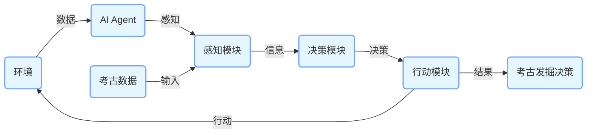

# AI Agent在考古发掘中的数据分析

> 关键词：AI Agent、考古发掘、数据分析、信息提取、决策支持

> 摘要：本文聚焦于AI Agent在考古发掘中的数据分析应用。详细阐述了AI Agent的核心概念、工作原理以及其与考古发掘数据分析的联系。通过介绍相关算法原理、数学模型，结合实际项目案例展示了AI Agent如何在考古发掘中进行高效的数据处理与分析。同时探讨了其在考古领域的实际应用场景，推荐了相关的学习资源、开发工具和研究论文。最后对AI Agent在考古发掘数据分析中的未来发展趋势与挑战进行了总结，并提供了常见问题解答和扩展阅读参考资料。

## 1. 背景介绍 
### 1.1 目的和范围
考古发掘是探索人类历史和文化的重要手段，随着科技的发展，考古工作中产生的数据量日益庞大，包括遗址的地理信息、文物的特征数据、发掘过程中的各种记录等。传统的数据分析方法在处理这些复杂多样的数据时面临效率和准确性的挑战。本文章的目的是探讨如何利用AI Agent技术对考古发掘中的数据进行有效的分析，以提高考古工作的效率和准确性，帮助考古学家更好地理解考古发现。文章的范围涵盖了AI Agent的基本概念、相关算法、数学模型，以及在考古发掘数据分析中的实际应用案例和未来发展趋势。

### 1.2 预期读者
本文的预期读者包括考古学家、考古专业的学生、对考古与人工智能交叉领域感兴趣的科研人员，以及从事人工智能开发并希望将其应用于考古领域的程序员和工程师。

### 1.3 文档结构概述
本文将首先介绍核心概念与联系，明确AI Agent和考古发掘数据分析的定义、原理和架构。接着阐述核心算法原理和具体操作步骤，并用Python代码详细说明。然后介绍相关的数学模型和公式，并举例说明其应用。通过一个项目实战案例，展示AI Agent在考古发掘数据分析中的具体实现过程。探讨实际应用场景，为读者提供更多的应用思路。推荐学习资源、开发工具和相关论文，帮助读者深入学习和研究。最后总结未来发展趋势与挑战，解答常见问题，并提供扩展阅读和参考资料。

### 1.4 术语表
#### 1.4.1 核心术语定义
- **AI Agent（人工智能代理）**：是一种能够感知环境、自主决策并采取行动以实现特定目标的人工智能实体。它可以接收环境信息，根据预设的规则或学习到的知识进行推理和决策，然后执行相应的动作。
- **考古发掘**：是指对古代人类活动遗留下来的遗迹、遗物进行科学的调查、勘探和挖掘的过程。
- **数据分析**：是指对收集到的数据进行清洗、转换、分析和解释的过程，以提取有价值的信息和知识。

#### 1.4.2 相关概念解释
- **环境感知**：AI Agent通过各种传感器或数据接口获取周围环境的信息，例如在考古发掘中，可能通过卫星图像、地理信息系统（GIS）数据、文物扫描数据等获取考古遗址的相关信息。
- **决策制定**：AI Agent根据感知到的环境信息和预设的目标，运用算法和模型进行推理和计算，做出最优的决策。在考古发掘数据分析中，决策可能包括确定下一步的发掘区域、判断文物的年代和文化归属等。
- **行动执行**：AI Agent根据决策结果采取相应的行动，例如在考古发掘中，可能是指挥机器人进行特定区域的挖掘，或者向考古学家提供建议。

#### 1.4.3 缩略词列表
- **GIS**：地理信息系统（Geographic Information System）
- **ML**：机器学习（Machine Learning）
- **DL**：深度学习（Deep Learning）

## 2. 核心概念与联系 
### 核心概念原理
#### AI Agent原理
AI Agent的工作原理基于感知 - 决策 - 行动的循环。它首先通过传感器或数据接口感知环境信息，将这些信息输入到内部的决策模块。决策模块根据预设的规则、算法或学习到的模型对输入信息进行处理和分析，生成决策结果。最后，AI Agent根据决策结果执行相应的行动，并将行动的结果反馈给环境，形成一个闭环系统。

#### 考古发掘数据分析原理
考古发掘数据分析的目标是从大量的考古数据中提取有价值的信息和知识，帮助考古学家更好地理解考古发现。其原理包括数据收集、数据预处理、数据分析和结果解释。数据收集是指通过各种手段获取考古遗址的相关数据，如地理信息、文物特征、发掘记录等。数据预处理包括数据清洗、转换和归一化等操作，以提高数据的质量和可用性。数据分析是指运用各种统计方法、机器学习算法和人工智能技术对预处理后的数据进行分析，挖掘数据中的潜在模式和规律。结果解释是指将数据分析的结果转化为对考古现象的理解和解释。

### 架构示意图

这个架构示意图展示了AI Agent在考古发掘数据分析中的工作流程。AI Agent从环境中感知考古数据，经过感知模块处理后输入到决策模块。决策模块根据数据生成决策，通过行动模块执行决策，并将结果反馈给环境。最终，AI Agent的决策结果为考古发掘提供支持。

### 核心概念联系
AI Agent与考古发掘数据分析密切相关。AI Agent可以作为一个智能的数据分析工具，应用于考古发掘的各个阶段。在数据收集阶段，AI Agent可以自动识别和收集各种考古数据，提高数据收集的效率和准确性。在数据预处理阶段，AI Agent可以对数据进行清洗、转换和归一化等操作，减少人工处理的工作量。在数据分析阶段，AI Agent可以运用机器学习和深度学习算法对数据进行挖掘和分析，发现数据中的潜在模式和规律。在结果解释阶段，AI Agent可以根据分析结果为考古学家提供决策支持和建议，帮助他们更好地理解考古发现。

## 3. 核心算法原理 & 具体操作步骤 
### 核心算法原理
#### 机器学习算法 - 决策树算法
决策树是一种常用的机器学习算法，它通过对数据的特征进行划分，构建一个树形结构的模型。决策树的每个内部节点表示一个特征上的测试，每个分支表示测试的一个输出，每个叶节点表示一个类别或值。决策树算法的基本思想是通过递归地划分数据集，选择最优的特征进行划分，使得划分后的子集尽可能地纯净。

以下是决策树算法的Python实现示例：
```python
from sklearn.datasets import load_iris
from sklearn.model_selection import train_test_split
from sklearn.tree import DecisionTreeClassifier
from sklearn.metrics import accuracy_score

# 加载鸢尾花数据集
iris = load_iris()
X = iris.data
y = iris.target

# 划分训练集和测试集
X_train, X_test, y_train, y_test = train_test_split(X, y, test_size=0.3, random_state=42)

# 创建决策树分类器
clf = DecisionTreeClassifier()

# 训练模型
clf.fit(X_train, y_train)

# 预测测试集
y_pred = clf.predict(X_test)

# 计算准确率
accuracy = accuracy_score(y_test, y_pred)
print(f"决策树模型的准确率: {accuracy}")
```
#### 深度学习算法 - 卷积神经网络（CNN）
卷积神经网络是一种专门用于处理具有网格结构数据的深度学习模型，如图像、音频等。CNN通过卷积层、池化层和全连接层的组合，自动提取数据的特征。卷积层通过卷积核在输入数据上滑动，进行卷积操作，提取局部特征。池化层通过对卷积层的输出进行下采样，减少数据的维度，提高模型的计算效率。全连接层将池化层的输出进行扁平化处理，然后通过全连接的方式进行分类或回归。

以下是一个简单的CNN模型的Python实现示例：
```python
import tensorflow as tf
from tensorflow.keras import layers, models

# 构建CNN模型
model = models.Sequential()
model.add(layers.Conv2D(32, (3, 3), activation='relu', input_shape=(32, 32, 3)))
model.add(layers.MaxPooling2D((2, 2)))
model.add(layers.Conv2D(64, (3, 3), activation='relu'))
model.add(layers.MaxPooling2D((2, 2)))
model.add(layers.Conv2D(64, (3, 3), activation='relu'))
model.add(layers.Flatten())
model.add(layers.Dense(64, activation='relu'))
model.add(layers.Dense(10))

# 编译模型
model.compile(optimizer='adam',
              loss=tf.keras.losses.SparseCategoricalCrossentropy(from_logits=True),
              metrics=['accuracy'])

# 训练模型
# 这里假设已经有了训练数据 train_images 和 train_labels
# model.fit(train_images, train_labels, epochs=10)
```

### 具体操作步骤
#### 数据准备
在使用AI Agent进行考古发掘数据分析之前，需要准备好相关的数据。数据可以包括考古遗址的地理信息、文物的图像数据、发掘记录等。首先，需要对数据进行收集和整理，将不同来源的数据整合到一个数据集。然后，对数据进行预处理，包括数据清洗、缺失值处理、数据归一化等操作，以提高数据的质量和可用性。

#### 模型选择与训练
根据数据分析的目标和数据的特点，选择合适的算法和模型。如果是分类问题，可以选择决策树、支持向量机、神经网络等模型；如果是回归问题，可以选择线性回归、岭回归等模型。选择好模型后，使用准备好的训练数据对模型进行训练，调整模型的参数，以提高模型的性能。

#### 模型评估与优化
使用测试数据对训练好的模型进行评估，计算模型的准确率、召回率、F1值等指标，评估模型的性能。如果模型的性能不理想，可以对模型进行优化，例如调整模型的参数、增加训练数据、使用更复杂的模型等。

#### 决策与应用
将训练好的模型应用到实际的考古发掘数据分析中，根据模型的输出结果进行决策。例如，根据模型对文物年代的预测结果，确定文物的文化归属；根据模型对遗址区域的分析结果，确定下一步的发掘区域。

## 4. 数学模型和公式 & 详细讲解 & 举例说明 
### 决策树算法的数学模型和公式
#### 信息熵
信息熵是衡量数据集中不确定性的指标，其计算公式为：
$$H(X)=-\sum_{i=1}^{n}p(x_i)\log_2p(x_i)$$
其中，$X$ 是一个离散随机变量，$p(x_i)$ 是 $X$ 取值为 $x_i$ 的概率，$n$ 是 $X$ 可能取值的个数。信息熵越大，数据集中的不确定性越大。

#### 信息增益
信息增益是衡量特征对分类结果的影响程度的指标，其计算公式为：
$$IG(D,A)=H(D)-H(D|A)$$
其中，$D$ 是数据集，$A$ 是一个特征，$H(D)$ 是数据集 $D$ 的信息熵，$H(D|A)$ 是在已知特征 $A$ 的条件下，数据集 $D$ 的条件熵。信息增益越大，说明特征 $A$ 对分类结果的影响越大。

#### 举例说明
假设有一个考古数据集，包含文物的颜色、形状和年代三个特征，以及文物的文化归属类别。我们要使用决策树算法对文物的文化归属进行分类。首先，计算数据集的信息熵 $H(D)$。然后，分别计算每个特征的信息增益 $IG(D,颜色)$、$IG(D,形状)$ 和 $IG(D,年代)$。选择信息增益最大的特征作为决策树的根节点，对数据集进行划分。重复这个过程，直到数据集被划分到足够纯净为止。

### 卷积神经网络的数学模型和公式
#### 卷积操作
卷积操作是CNN的核心操作，其计算公式为：
$$y_{i,j}=\sum_{m=0}^{M-1}\sum_{n=0}^{N-1}x_{i+m,j+n}w_{m,n}+b$$
其中，$x$ 是输入数据，$w$ 是卷积核，$b$ 是偏置项，$y$ 是卷积输出，$M$ 和 $N$ 是卷积核的大小。

#### 池化操作
池化操作是对卷积层的输出进行下采样的操作，常用的池化方法有最大池化和平均池化。最大池化的计算公式为：
$$y_{i,j}=\max_{m=0}^{M-1}\max_{n=0}^{N-1}x_{i\times s+m,j\times s+n}$$
其中，$x$ 是输入数据，$y$ 是池化输出，$s$ 是池化步长，$M$ 和 $N$ 是池化窗口的大小。

#### 举例说明
假设我们要对考古文物的图像进行分类，使用CNN模型。首先，将文物图像输入到卷积层，通过卷积操作提取图像的特征。然后，将卷积层的输出输入到池化层，通过池化操作减少数据的维度。重复这个过程，经过多个卷积层和池化层的处理后，将最终的输出输入到全连接层，进行分类。

## 5. 项目实战：代码实际案例和详细解释说明 
### 5.1  开发环境搭建
#### 安装Python
首先，需要安装Python编程语言。可以从Python官方网站（https://www.python.org/downloads/）下载适合自己操作系统的Python安装包，并按照安装向导进行安装。

#### 安装相关库
在Python环境中，需要安装一些相关的库，如NumPy、Pandas、Scikit-learn、TensorFlow等。可以使用pip命令进行安装，例如：
```sh
pip install numpy pandas scikit-learn tensorflow
```

### 5.2  源代码详细实现和代码解读
#### 数据加载和预处理
```python
import pandas as pd
from sklearn.preprocessing import StandardScaler

# 加载考古数据集
data = pd.read_csv('archaeology_data.csv')

# 分离特征和标签
X = data.drop('label', axis=1)
y = data['label']

# 数据标准化
scaler = StandardScaler()
X_scaled = scaler.fit_transform(X)
```
代码解读：首先，使用Pandas库的`read_csv`函数加载考古数据集。然后，将数据集分离为特征矩阵 $X$ 和标签向量 $y$。最后，使用`StandardScaler`对特征矩阵进行标准化处理，使特征具有零均值和单位方差。

#### 模型训练和评估
```python
from sklearn.model_selection import train_test_split
from sklearn.tree import DecisionTreeClassifier
from sklearn.metrics import accuracy_score

# 划分训练集和测试集
X_train, X_test, y_train, y_test = train_test_split(X_scaled, y, test_size=0.2, random_state=42)

# 创建决策树分类器
clf = DecisionTreeClassifier()

# 训练模型
clf.fit(X_train, y_train)

# 预测测试集
y_pred = clf.predict(X_test)

# 计算准确率
accuracy = accuracy_score(y_test, y_pred)
print(f"决策树模型的准确率: {accuracy}")
```
代码解读：使用`train_test_split`函数将数据集划分为训练集和测试集，其中测试集占总数据集的20%。创建一个决策树分类器，并使用训练集对其进行训练。使用训练好的模型对测试集进行预测，并计算预测结果的准确率。

### 5.3  代码解读与分析
#### 数据预处理的重要性
数据预处理是机器学习和数据分析中非常重要的一步。通过数据标准化，可以使不同特征具有相同的尺度，避免某些特征因为数值范围过大而对模型产生过大的影响。同时，数据预处理还可以处理缺失值、异常值等问题，提高数据的质量和可用性。

#### 模型选择和评估
在这个项目中，选择了决策树分类器作为模型。决策树是一种简单易懂、计算效率高的模型，适合处理分类问题。在模型评估方面，使用了准确率作为评估指标，准确率是分类问题中常用的评估指标之一，它表示模型预测正确的样本数占总样本数的比例。

## 6. 实际应用场景 
### 文物年代鉴定
AI Agent可以通过对文物的图像、材质、纹理等特征进行分析，结合历史数据库和机器学习算法，预测文物的年代。例如，通过对陶瓷文物的外观特征进行分析，判断其属于哪个朝代的制品。

### 遗址区域分析
利用地理信息系统（GIS）数据和遥感图像，AI Agent可以对考古遗址的地形、地貌、土壤等信息进行分析，预测遗址中可能存在文物的区域。这可以帮助考古学家更有针对性地进行发掘工作，提高发掘效率。

### 文物修复与保护
AI Agent可以对文物的损坏情况进行评估，根据文物的材质和损坏程度，提供修复方案和保护建议。例如，通过对壁画的图像分析，判断壁画的褪色、剥落等情况，并给出相应的修复措施。

### 文化归属判断
通过对文物的特征和考古遗址的信息进行分析，AI Agent可以判断文物的文化归属，确定其所属的文化类型和族群。这有助于深入了解古代文化的传播和交流。

## 7. 工具和资源推荐
### 7.1 学习资源推荐
#### 7.1.1 书籍推荐
- 《机器学习》（周志华著）：这本书是机器学习领域的经典教材，系统地介绍了机器学习的基本概念、算法和应用。
- 《深度学习》（Ian Goodfellow、Yoshua Bengio和Aaron Courville著）：这本书是深度学习领域的权威著作，深入介绍了深度学习的原理、模型和算法。
- 《Python数据分析实战》（Sebastian Raschka著）：这本书通过实际案例介绍了如何使用Python进行数据分析，包括数据处理、可视化和机器学习等方面。

#### 7.1.2 在线课程
- Coursera上的“机器学习”课程（Andrew Ng教授授课）：这是一门非常受欢迎的机器学习入门课程，通过视频讲解、编程作业和考试等方式，帮助学员掌握机器学习的基本概念和算法。
- edX上的“深度学习基础”课程（由MIT教授授课）：这门课程介绍了深度学习的基本原理和应用，包括神经网络、卷积神经网络、循环神经网络等。
- Kaggle上的“微课程”：Kaggle提供了一系列的微课程，涵盖了数据科学、机器学习、深度学习等多个领域，通过实际案例和竞赛的方式，帮助学员提高实践能力。

#### 7.1.3 技术博客和网站
- Medium：Medium上有很多关于人工智能、机器学习和数据分析的技术博客，作者来自世界各地的专家和爱好者，可以从中获取最新的技术动态和实践经验。
- Towards Data Science：这是一个专注于数据科学和机器学习的技术博客，提供了大量的教程、案例分析和研究成果。
- ArXiv：ArXiv是一个开放的学术预印本平台，上面有很多关于人工智能、机器学习和计算机科学的最新研究论文。

### 7.2 开发工具框架推荐
#### 7.2.1 IDE和编辑器
- PyCharm：PyCharm是一款专门为Python开发设计的集成开发环境（IDE），具有代码编辑、调试、版本控制等功能，非常适合Python开发者使用。
- Jupyter Notebook：Jupyter Notebook是一个基于Web的交互式计算环境，支持多种编程语言，如Python、R等。它可以将代码、文本、图像等内容整合在一起，方便进行数据分析和模型开发。
- Visual Studio Code：Visual Studio Code是一款轻量级的代码编辑器，支持多种编程语言和插件扩展。它具有丰富的代码提示、调试功能和版本控制支持，是很多开发者喜欢的编辑器之一。

#### 7.2.2 调试和性能分析工具
- TensorBoard：TensorBoard是TensorFlow提供的一个可视化工具，用于监控和分析深度学习模型的训练过程。它可以展示模型的训练损失、准确率、梯度等指标，帮助开发者优化模型。
- Py-Spy：Py-Spy是一个Python性能分析工具，它可以实时监控Python程序的运行状态，分析程序的CPU使用率、函数调用时间等信息，帮助开发者找出程序中的性能瓶颈。
- cProfile：cProfile是Python标准库中的一个性能分析模块，它可以对Python程序进行详细的性能分析，输出函数调用的时间、次数等信息。

#### 7.2.3 相关框架和库
- Scikit-learn：Scikit-learn是一个简单易用的机器学习库，提供了各种机器学习算法和工具，如分类、回归、聚类、降维等。
- TensorFlow：TensorFlow是一个开源的深度学习框架，由Google开发。它提供了丰富的深度学习模型和工具，支持分布式训练和部署。
- PyTorch：PyTorch是另一个流行的深度学习框架，由Facebook开发。它具有动态计算图的特点，易于使用和调试，受到很多研究者和开发者的喜爱。

### 7.3 相关论文著作推荐
#### 7.3.1 经典论文
- “A Logical Calculus of the Ideas Immanent in Nervous Activity”（Warren S. McCulloch和Walter Pitts著）：这篇论文提出了人工神经网络的基本模型，是神经网络领域的开山之作。
- “Learning Representations by Back-propagating Errors”（David E. Rumelhart、Geoffrey E. Hinton和Ronald J. Williams著）：这篇论文介绍了反向传播算法，使得神经网络的训练变得可行，推动了神经网络的发展。
- “ImageNet Classification with Deep Convolutional Neural Networks”（Alex Krizhevsky、Ilya Sutskever和Geoffrey E. Hinton著）：这篇论文介绍了AlexNet，一个在ImageNet图像分类竞赛中取得优异成绩的卷积神经网络模型，开启了深度学习在计算机视觉领域的热潮。

#### 7.3.2 最新研究成果
- “Attention Is All You Need”（Ashish Vaswani等人著）：这篇论文提出了Transformer模型，是自然语言处理领域的重要突破，为后续的BERT、GPT等模型奠定了基础。
- “Generative Adversarial Networks”（Ian J. Goodfellow等人著）：这篇论文介绍了生成对抗网络（GAN），是一种用于生成数据的新型模型，在图像生成、数据增强等领域有广泛的应用。
- “Neural Architecture Search with Reinforcement Learning”（Barret Zoph和Quoc V. Le著）：这篇论文提出了使用强化学习进行神经网络架构搜索的方法，为自动化机器学习提供了新的思路。

#### 7.3.3 应用案例分析
- “AI for Cultural Heritage: A Survey”（多个作者合著）：这篇论文对人工智能在文化遗产领域的应用进行了全面的综述，包括文物保护、考古发掘、文化遗产数字化等方面的应用案例和研究成果。
- “Using Machine Learning to Predict the Location of Undiscovered Archaeological Sites”（作者根据实际研究撰写）：这篇论文介绍了如何使用机器学习算法预测未发现的考古遗址的位置，通过实际案例展示了机器学习在考古发掘中的应用效果。

## 8. 总结：未来发展趋势与挑战
### 未来发展趋势
#### 多模态数据融合
未来，AI Agent在考古发掘数据分析中将更加注重多模态数据的融合。除了传统的图像、文本数据外，还将融合地理信息、音频、视频等多种数据，以更全面地了解考古遗址和文物的信息。通过多模态数据融合，可以挖掘出更多隐藏的信息和规律，提高考古研究的准确性和深度。

#### 智能考古机器人
随着机器人技术和人工智能的发展，智能考古机器人将成为未来考古发掘的重要工具。AI Agent可以控制考古机器人进行自动化的发掘工作，如挖掘、采样、测量等。同时，机器人可以实时采集和传输数据，AI Agent对这些数据进行分析和处理，为机器人提供决策支持，实现高效、精准的考古发掘。

#### 跨学科合作
考古发掘数据分析涉及到考古学、计算机科学、数学、统计学等多个学科领域。未来，跨学科合作将更加紧密，不同学科的专家将共同参与到考古研究中。通过跨学科的合作，可以充分发挥各学科的优势，推动AI Agent在考古发掘中的应用和发展。

### 挑战
#### 数据质量和隐私问题
考古数据的质量和隐私是AI Agent在考古发掘数据分析中面临的重要挑战。考古数据往往存在缺失值、噪声、不一致等问题，需要进行有效的数据预处理和清洗。同时，考古数据涉及到文化遗产和历史信息，具有较高的隐私性，需要采取有效的措施保护数据的安全和隐私。

#### 模型可解释性
深度学习模型在考古发掘数据分析中取得了很好的效果，但这些模型往往是黑盒模型，缺乏可解释性。在考古研究中，需要对分析结果进行解释和验证，以确保结果的可靠性和科学性。因此，如何提高模型的可解释性是未来需要解决的一个重要问题。

#### 技术应用成本
AI Agent技术的应用需要一定的硬件和软件支持，包括高性能的计算机、服务器、数据库等。同时，训练和优化模型也需要大量的计算资源和时间。对于一些考古研究机构和团队来说，技术应用成本可能是一个较大的负担。因此，如何降低技术应用成本，提高技术的可普及性，是未来需要解决的另一个问题。

## 9. 附录：常见问题与解答
### 问题1：AI Agent在考古发掘数据分析中的准确性如何保证？
解答：为了保证AI Agent在考古发掘数据分析中的准确性，需要从多个方面入手。首先，要确保数据的质量，对数据进行充分的预处理和清洗，减少数据中的噪声和错误。其次，选择合适的算法和模型，并对模型进行充分的训练和优化。可以使用交叉验证、网格搜索等方法来选择最优的模型参数。最后，对模型的输出结果进行验证和评估，可以与专家的判断进行对比，或者通过实际的考古发掘结果进行验证。

### 问题2：AI Agent能否完全替代考古学家进行考古发掘工作？
解答：AI Agent不能完全替代考古学家进行考古发掘工作。虽然AI Agent可以在数据处理和分析方面提供很大的帮助，但考古发掘工作还涉及到很多人文、历史、艺术等方面的知识和判断，需要考古学家的专业经验和智慧。AI Agent可以作为考古学家的辅助工具，帮助他们更高效地处理和分析数据，提供决策支持，但最终的判断和决策还是需要考古学家来做出。

### 问题3：如何获取考古发掘数据用于AI Agent的训练？
解答：获取考古发掘数据可以通过多种途径。可以与考古研究机构、博物馆等合作，获取他们的考古数据库中的数据。也可以通过实地考察和发掘，自己收集考古数据。此外，一些公开的考古数据集也可以在互联网上找到，如国际考古数据联盟（IAD）提供的一些数据集。在获取数据时，需要遵守相关的法律法规和数据使用协议，确保数据的合法性和合规性。

### 问题4：AI Agent在考古发掘数据分析中的应用是否会对文化遗产造成破坏？
解答：AI Agent在考古发掘数据分析中的应用本身不会对文化遗产造成破坏。相反，它可以帮助考古学家更科学、更谨慎地进行考古发掘工作，减少对文化遗产的不必要破坏。例如，通过对遗址区域的分析，AI Agent可以帮助考古学家确定最佳的发掘区域和方法，避免盲目挖掘。同时，AI Agent还可以对文物的修复和保护提供建议，有助于更好地保护文化遗产。

## 10. 扩展阅读 & 参考资料
### 扩展阅读
- 《人工智能时代的考古学》：这本书探讨了人工智能技术在考古学中的应用前景和挑战，介绍了一些最新的研究成果和实践案例。
- 《数字考古学》：本书介绍了数字技术在考古学中的应用，包括地理信息系统、遥感技术、三维建模等，以及如何利用这些技术进行考古数据的采集、分析和展示。
- 《文化遗产保护与人工智能》：这本书从文化遗产保护的角度出发，介绍了人工智能技术在文物保护、遗址监测、文化遗产数字化等方面的应用。

### 参考资料
- 相关学术论文和研究报告：在学术数据库如IEEE Xplore、ACM Digital Library、Google Scholar等上搜索关于AI Agent在考古发掘数据分析中的研究论文和报告。
- 考古学专业书籍和期刊：如《考古》、《文物》等期刊，以及一些考古学领域的经典著作。
- 人工智能和机器学习相关的官方文档和教程：如Scikit-learn、TensorFlow、PyTorch等库的官方文档和教程。

作者：AI天才研究院/AI Genius Institute & 禅与计算机程序设计艺术 /Zen And The Art of Computer Programming