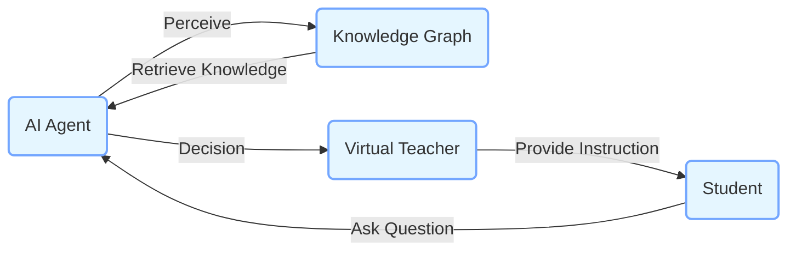

# AI Agent在虚拟教师中的知识图谱应用

> 关键词：AI Agent、虚拟教师、知识图谱、教育应用、智能教学

> 摘要：本文聚焦于AI Agent在虚拟教师中的知识图谱应用。首先介绍了相关背景，包括目的范围、预期读者等。接着阐述核心概念，如AI Agent、虚拟教师和知识图谱的原理及相互联系，并给出相应的示意图和流程图。详细讲解核心算法原理与操作步骤，结合Python代码说明。深入探讨数学模型和公式，辅以实例。通过项目实战，从开发环境搭建到源代码实现与解读，展示如何将知识应用于实际。分析实际应用场景，推荐学习资源、开发工具框架和相关论文著作。最后总结未来发展趋势与挑战，提供常见问题解答和扩展阅读参考资料，旨在为AI Agent和知识图谱在虚拟教师领域的应用提供全面且深入的技术指导。

## 1. 背景介绍 
### 1.1 目的和范围
随着人工智能技术的飞速发展，教育领域也迎来了新的变革。虚拟教师作为一种创新的教育工具，能够为学生提供个性化、高效的学习服务。AI Agent和知识图谱技术的结合，为虚拟教师的智能化发展提供了强大的支持。本文的目的在于深入探讨AI Agent在虚拟教师中如何应用知识图谱，以提升虚拟教师的教学能力和效果。范围涵盖了从核心概念的阐述、算法原理的讲解、数学模型的分析，到实际项目的开发和应用场景的分析，旨在为相关领域的研究者和开发者提供全面的技术参考。

### 1.2 预期读者
本文预期读者包括教育技术领域的研究者、人工智能开发者、虚拟教师系统的开发人员、对教育智能化感兴趣的技术爱好者以及教育行业的从业者。这些读者可能希望了解如何将AI Agent和知识图谱技术应用于虚拟教师系统，以提高教学质量和效率。

### 1.3 文档结构概述
本文将按照以下结构进行组织：首先介绍相关背景信息，包括目的、预期读者和文档结构概述。接着阐述核心概念，如AI Agent、虚拟教师和知识图谱的原理及相互联系，并给出相应的示意图和流程图。然后详细讲解核心算法原理与操作步骤，结合Python代码进行说明。深入探讨数学模型和公式，并辅以实例。通过项目实战，从开发环境搭建到源代码实现与解读，展示如何将知识应用于实际。分析实际应用场景，推荐学习资源、开发工具框架和相关论文著作。最后总结未来发展趋势与挑战，提供常见问题解答和扩展阅读参考资料。

### 1.4 术语表
#### 1.4.1 核心术语定义
- **AI Agent**：即人工智能代理，是一种能够感知环境、进行决策并采取行动以实现特定目标的软件实体。它可以根据预设的规则或通过学习来适应不同的情况。
- **虚拟教师**：是基于人工智能技术开发的一种智能化教学系统，能够模拟人类教师的教学行为，为学生提供个性化的学习指导和服务。
- **知识图谱**：是一种语义网络，用于表示实体之间的关系和知识。它将各种知识以图的形式组织起来，每个节点表示一个实体，边表示实体之间的关系。

#### 1.4.2 相关概念解释
- **本体**：是对概念化的明确表示，用于定义知识图谱中的实体、属性和关系。本体提供了一种标准化的方式来描述知识，使得不同的系统能够共享和理解相同的知识。
- **语义理解**：是指计算机能够理解自然语言文本的含义。在虚拟教师系统中，语义理解技术可以帮助AI Agent理解学生的问题，并提供准确的回答。
- **个性化学习**：是指根据学生的学习能力、兴趣和需求，为其提供定制化的学习内容和教学方法。虚拟教师可以利用知识图谱和AI Agent技术实现个性化学习。

#### 1.4.3 缩略词列表
- **AI**：Artificial Intelligence，人工智能
- **KG**：Knowledge Graph，知识图谱
- **NLP**：Natural Language Processing，自然语言处理

## 2. 核心概念与联系 

### 核心概念原理
#### AI Agent原理
AI Agent的核心原理是感知 - 决策 - 行动的循环。它通过传感器感知环境信息，然后根据预设的规则或学习到的模型进行决策，最后通过执行器采取相应的行动。例如，在虚拟教师系统中，AI Agent可以通过自然语言处理技术感知学生的问题，然后根据知识图谱中的知识进行推理和决策，最后以自然语言的形式向学生提供答案和建议。

#### 虚拟教师原理
虚拟教师的原理是模拟人类教师的教学行为。它可以根据学生的学习情况和需求，提供个性化的学习内容和教学方法。虚拟教师通常包括教学内容管理、学生学习状态评估、个性化推荐等模块。知识图谱可以为虚拟教师提供丰富的知识资源，AI Agent可以帮助虚拟教师实现智能化的决策和交互。

#### 知识图谱原理
知识图谱的原理是将各种知识以图的形式组织起来。它通过实体、属性和关系来表示知识。实体是知识图谱中的节点，属性是实体的特征，关系是实体之间的联系。例如，在教育领域的知识图谱中，实体可以是课程、知识点、学生等，属性可以是课程的难度、知识点的重要性等，关系可以是课程包含知识点、学生学习课程等。

### 架构的文本示意图
```plaintext
+-----------------+       +-----------------+       +-----------------+
|     AI Agent    | <----> |   Knowledge Map | <----> |   Virtual Teacher |
+-----------------+       +-----------------+       +-----------------+
| - Perception    |       | - Entities      |       | - Teaching Content|
| - Decision      |       | - Attributes    |       | - Student Assessment|
| - Action        |       | - Relationships |       | - Personalized Recommendation|
+-----------------+       +-----------------+       +-----------------+
```

### Mermaid流程图


## 3. 核心算法原理 & 具体操作步骤 

### 核心算法原理
在AI Agent在虚拟教师中应用知识图谱的场景下，核心算法主要涉及知识图谱的构建、知识推理和自然语言处理。

#### 知识图谱构建算法
知识图谱的构建通常包括实体识别、关系抽取和知识融合等步骤。其中，实体识别可以使用命名实体识别（NER）算法，如基于深度学习的BiLSTM - CRF模型。关系抽取可以使用远程监督学习或基于深度学习的关系抽取模型。知识融合则是将不同来源的知识进行整合，消除冲突和冗余。

#### 知识推理算法
知识推理是根据知识图谱中的已有知识推导出新的知识。常见的知识推理算法包括基于规则的推理、基于机器学习的推理和基于深度学习的推理。例如，基于规则的推理可以使用Datalog规则进行知识推导，基于深度学习的推理可以使用图神经网络（GNN）模型。

#### 自然语言处理算法
自然语言处理算法用于处理学生的问题和虚拟教师的回答。常见的自然语言处理任务包括文本分类、情感分析、语义理解等。在虚拟教师系统中，语义理解是关键任务之一，可以使用预训练的语言模型，如BERT、GPT等。

### 具体操作步骤

#### 步骤1：知识图谱构建
```python
import spacy
from spacy.matcher import Matcher

# 加载预训练的语言模型
nlp = spacy.load("en_core_web_sm")

# 示例文本
text = "John studied Math at Harvard University."

# 处理文本
doc = nlp(text)

# 实体识别
entities = [(ent.text, ent.label_) for ent in doc.ents]
print("Entities:", entities)

# 关系抽取示例（简单规则匹配）
matcher = Matcher(nlp.vocab)
pattern = [{"LOWER": "studied"}, {"LOWER": "at"}]
matcher.add("STUDY_AT", [pattern])
matches = matcher(doc)
if matches:
    start, end = matches[0][1], matches[0][2]
    relationship = doc[start:end].text
    print("Relationship:", relationship)
```

#### 步骤2：知识推理
```python
from rdflib import Graph, Literal, RDF, URIRef
from rdflib.namespace import FOAF, XSD

# 创建一个知识图谱
g = Graph()

# 定义实体和关系
john = URIRef("http://example.org/john")
math = URIRef("http://example.org/math")
harvard = URIRef("http://example.org/harvard")

# 添加三元组到知识图谱
g.add((john, FOAF.name, Literal("John")))
g.add((john, URIRef("http://example.org/studied"), math))
g.add((john, URIRef("http://example.org/studied_at"), harvard))

# 简单的知识推理示例：查询John学习的课程
query = """
SELECT?course
WHERE {
    <http://example.org/john> <http://example.org/studied>?course.
}
"""
results = g.query(query)
for row in results:
    print("John studied:", row[0])
```

#### 步骤3：自然语言处理
```python
from transformers import AutoTokenizer, AutoModelForQuestionAnswering
import torch

# 加载预训练的问答模型
tokenizer = AutoTokenizer.from_pretrained("bert-large-uncased-whole-word-masking-finetuned-squad")
model = AutoModelForQuestionAnswering.from_pretrained("bert-large-uncased-whole-word-masking-finetuned-squad")

# 示例问题和文本
question = "Where did John study?"
text = "John studied Math at Harvard University."

# 编码输入
inputs = tokenizer(question, text, return_tensors='pt')

# 模型推理
outputs = model(**inputs)
answer_start_scores = outputs.start_logits
answer_end_scores = outputs.end_logits

# 获取答案
answer_start = torch.argmax(answer_start_scores)
answer_end = torch.argmax(answer_end_scores) + 1
answer = tokenizer.convert_tokens_to_string(tokenizer.convert_ids_to_tokens(inputs['input_ids'][0][answer_start:answer_end]))
print("Answer:", answer)
```

## 4. 数学模型和公式 & 详细讲解 & 举例说明 

### 知识图谱嵌入模型
知识图谱嵌入模型用于将知识图谱中的实体和关系表示为低维向量，以便进行机器学习和推理。常见的知识图谱嵌入模型包括TransE、TransH、DistMult等。

#### TransE模型
TransE模型的核心思想是将实体和关系表示为向量，使得对于知识图谱中的三元组 $(h, r, t)$，满足 $h + r \approx t$。其中，$h$ 是头实体的向量表示，$r$ 是关系的向量表示，$t$ 是尾实体的向量表示。

损失函数定义为：
$$
L = \sum_{(h, r, t) \in S} \sum_{(h', r, t') \in S'} [\gamma + d(h + r, t) - d(h' + r, t')]_+
$$
其中，$S$ 是正样本集合，$S'$ 是负样本集合，$\gamma$ 是边界参数，$d$ 是距离度量函数，通常使用L1或L2距离，$[x]_+ = \max(0, x)$。

#### 举例说明
假设知识图谱中有三元组 (John, studied, Math)，我们将 John、studied 和 Math 分别表示为向量 $\mathbf{h}$、$\mathbf{r}$ 和 $\mathbf{t}$。在训练过程中，模型的目标是使得 $\mathbf{h} + \mathbf{r}$ 尽可能接近 $\mathbf{t}$。同时，对于负样本，如 (John, studied, Physics)，模型要使得 $\mathbf{h} + \mathbf{r}$ 与 $\mathbf{t}'$（Physics 的向量表示）的距离尽可能大。

### 图神经网络模型
图神经网络（GNN）模型可以用于知识图谱的推理和表示学习。以图卷积网络（GCN）为例，GCN 的核心公式如下：

$$
\mathbf{H}^{(l+1)} = \sigma(\tilde{\mathbf{D}}^{-\frac{1}{2}} \tilde{\mathbf{A}} \tilde{\mathbf{D}}^{-\frac{1}{2}} \mathbf{H}^{(l)} \mathbf{W}^{(l)})
$$
其中，$\mathbf{H}^{(l)}$ 是第 $l$ 层的节点特征矩阵，$\tilde{\mathbf{A}} = \mathbf{A} + \mathbf{I}$ 是邻接矩阵加上自环，$\tilde{\mathbf{D}}$ 是 $\tilde{\mathbf{A}}$ 的度矩阵，$\mathbf{W}^{(l)}$ 是第 $l$ 层的可学习权重矩阵，$\sigma$ 是激活函数。

#### 举例说明
在知识图谱中，每个实体可以看作图中的一个节点，关系可以看作边。我们可以将实体的初始特征作为 $\mathbf{H}^{(0)}$，通过 GCN 模型不断更新节点的特征表示。例如，对于一个包含课程和学生的知识图谱，我们可以使用 GCN 模型学习课程和学生之间的潜在关系，从而为学生提供更准确的课程推荐。

## 5. 项目实战：代码实际案例和详细解释说明 

### 5.1  开发环境搭建
#### 操作系统
可以选择 Windows、Linux 或 macOS 操作系统。建议使用 Linux 系统，如 Ubuntu，因为它在开发和部署方面具有更好的稳定性和兼容性。

#### 编程语言和环境
使用 Python 作为主要编程语言，版本建议为 Python 3.7 及以上。可以使用 Anaconda 来管理 Python 环境，创建一个新的虚拟环境：
```bash
conda create -n virtual_teacher python=3.8
conda activate virtual_teacher
```

#### 依赖库安装
安装必要的依赖库，包括 `spacy`、`rdflib`、`transformers` 等：
```bash
pip install spacy
python -m spacy download en_core_web_sm
pip install rdflib
pip install transformers
```

### 5.2  源代码详细实现和代码解读
```python
import spacy
from rdflib import Graph, Literal, RDF, URIRef
from rdflib.namespace import FOAF, XSD
from transformers import AutoTokenizer, AutoModelForQuestionAnswering
import torch

# 加载预训练的语言模型
nlp = spacy.load("en_core_web_sm")

# 加载预训练的问答模型
tokenizer = AutoTokenizer.from_pretrained("bert-large-uncased-whole-word-masking-finetuned-squad")
model = AutoModelForQuestionAnswering.from_pretrained("bert-large-uncased-whole-word-masking-finetuned-squad")

# 创建一个知识图谱
g = Graph()

# 定义实体和关系
john = URIRef("http://example.org/john")
math = URIRef("http://example.org/math")
harvard = URIRef("http://example.org/harvard")

# 添加三元组到知识图谱
g.add((john, FOAF.name, Literal("John")))
g.add((john, URIRef("http://example.org/studied"), math))
g.add((john, URIRef("http://example.org/studied_at"), harvard))

def process_question(question):
    # 自然语言处理：识别实体和关系
    doc = nlp(question)
    entities = [(ent.text, ent.label_) for ent in doc.ents]
    
    # 尝试从知识图谱中查询答案
    query = None
    if "where" in question.lower():
        query = """
        SELECT?place
        WHERE {
            <http://example.org/john> <http://example.org/studied_at>?place.
        }
        """
    elif "what" in question.lower() and "studied" in question.lower():
        query = """
        SELECT?course
        WHERE {
            <http://example.org/john> <http://example.org/studied>?course.
        }
        """
    
    if query:
        results = g.query(query)
        for row in results:
            return str(row[0])
    
    # 如果知识图谱中没有答案，使用问答模型
    text = "John studied Math at Harvard University."
    inputs = tokenizer(question, text, return_tensors='pt')
    outputs = model(**inputs)
    answer_start_scores = outputs.start_logits
    answer_end_scores = outputs.end_logits
    answer_start = torch.argmax(answer_start_scores)
    answer_end = torch.argmax(answer_end_scores) + 1
    answer = tokenizer.convert_tokens_to_string(tokenizer.convert_ids_to_tokens(inputs['input_ids'][0][answer_start:answer_end]))
    return answer

# 测试问题
question = "Where did John study?"
answer = process_question(question)
print("Question:", question)
print("Answer:", answer)
```

### 5.3  代码解读与分析
#### 代码功能概述
这段代码实现了一个简单的虚拟教师系统，能够处理学生的问题并提供答案。它结合了知识图谱和自然语言处理技术，首先尝试从知识图谱中查询答案，如果没有找到则使用预训练的问答模型进行回答。

#### 代码详细解读
1. **初始化部分**：加载了预训练的语言模型 `spacy` 和问答模型 `transformers`，并创建了一个知识图谱 `rdflib.Graph`，添加了一些示例三元组。
2. **`process_question` 函数**：
    - 对输入的问题进行自然语言处理，识别其中的实体和关系。
    - 根据问题的关键词（如 "where"、"what"）构造相应的 SPARQL 查询语句，尝试从知识图谱中查询答案。
    - 如果知识图谱中没有答案，则使用问答模型对问题进行处理，从示例文本中提取答案。
3. **测试部分**：输入一个示例问题，调用 `process_question` 函数获取答案并打印输出。

#### 代码优化建议
- 可以扩展知识图谱，添加更多的实体和关系，以提高系统的回答能力。
- 可以优化自然语言处理部分，使用更复杂的语义理解技术，提高问题的理解准确率。
- 可以引入更多的问答模型，根据不同的问题类型选择合适的模型进行回答。

## 6. 实际应用场景 
### 个性化学习辅导
虚拟教师可以根据学生的学习历史和知识图谱中的信息，为学生提供个性化的学习建议和辅导。例如，通过分析学生在不同知识点上的掌握情况，为学生推荐适合的学习资源和练习题目。

### 智能答疑
学生在学习过程中遇到问题时，可以向虚拟教师提问。虚拟教师可以利用知识图谱和自然语言处理技术，快速准确地回答学生的问题。同时，还可以提供相关的知识点和拓展信息，帮助学生深入理解问题。

### 课程推荐
虚拟教师可以根据学生的兴趣、学习目标和知识图谱中的课程信息，为学生推荐合适的课程。通过分析课程之间的关联和学生的学习进度，提供个性化的课程推荐方案。

### 学习评估
虚拟教师可以利用知识图谱中的知识结构和学生的学习行为数据，对学生的学习效果进行评估。例如，通过分析学生在不同知识点上的答题情况，评估学生的知识掌握程度，并提供针对性的反馈和改进建议。

## 7. 工具和资源推荐
### 7.1 学习资源推荐
#### 7.1.1 书籍推荐
- 《人工智能：一种现代的方法》：全面介绍了人工智能的基本概念、算法和应用，是人工智能领域的经典教材。
- 《知识图谱：方法、实践与应用》：详细介绍了知识图谱的构建、推理和应用，对于深入理解知识图谱技术非常有帮助。
- 《自然语言处理入门》：适合初学者入门自然语言处理领域，介绍了自然语言处理的基本任务和常用算法。

#### 7.1.2 在线课程
- Coursera 上的 "人工智能基础" 课程：由知名高校教授授课，系统介绍了人工智能的基本概念和算法。
- edX 上的 "知识图谱与语义网" 课程：深入讲解了知识图谱的理论和实践，包括知识图谱的构建、推理和应用。
- 吴恩达的 "深度学习专项课程"：在深度学习领域具有很高的声誉，对于理解自然语言处理和知识图谱中的深度学习模型非常有帮助。

#### 7.1.3 技术博客和网站
- AI科技评论：提供人工智能领域的最新技术动态和深度分析文章。
- 机器之心：专注于人工智能技术的报道和解读，有很多关于知识图谱和自然语言处理的文章。
- 开源中国：提供开源项目的介绍和技术文章，对于了解开源的知识图谱和自然语言处理工具非常有帮助。

### 7.2 开发工具框架推荐
#### 7.2.1 IDE和编辑器
- PyCharm：是一款专业的 Python 集成开发环境，具有代码编辑、调试、版本控制等功能，适合开发虚拟教师系统。
- Jupyter Notebook：是一个交互式的开发环境，适合进行数据分析、模型训练和代码演示，对于快速验证算法和模型非常方便。
- Visual Studio Code：是一款轻量级的代码编辑器，支持多种编程语言和插件扩展，具有丰富的代码编辑和调试功能。

#### 7.2.2 调试和性能分析工具
- PDB：是 Python 自带的调试器，可以帮助开发者定位代码中的错误和问题。
- TensorBoard：是 TensorFlow 提供的可视化工具，可以用于监控模型的训练过程和性能指标。
- cProfile：是 Python 标准库中的性能分析工具，可以帮助开发者分析代码的运行时间和内存使用情况。

#### 7.2.3 相关框架和库
- SpaCy：是一个高效的自然语言处理库，提供了实体识别、词性标注、句法分析等功能，适合处理学生的问题。
- RDFlib：是一个用于处理 RDF 数据的 Python 库，支持知识图谱的创建、查询和推理。
- Transformers：是 Hugging Face 开发的一个强大的自然语言处理库，提供了多种预训练的语言模型，如 BERT、GPT 等，适合用于问答系统。

### 7.3 相关论文著作推荐
#### 7.3.1 经典论文
- "Translating Embeddings for Modeling Multi-relational Data"：提出了 TransE 知识图谱嵌入模型，为知识图谱的表示学习奠定了基础。
- "Graph Convolutional Networks for Semi-Supervised Classification"：介绍了图卷积网络（GCN）的基本原理和应用，对于知识图谱的推理和表示学习具有重要意义。
- "BERT: Pre-training of Deep Bidirectional Transformers for Language Understanding"：提出了 BERT 预训练语言模型，在自然语言处理领域取得了巨大的成功。

#### 7.3.2 最新研究成果
- 关注 ACL（Association for Computational Linguistics）、AAAI（Association for the Advancement of Artificial Intelligence）等顶级学术会议的论文，了解知识图谱和自然语言处理领域的最新研究进展。
- 关注知名学术期刊，如 "Journal of Artificial Intelligence Research"、"Artificial Intelligence" 等，获取最新的研究成果。

#### 7.3.3 应用案例分析
- 分析一些知名的虚拟教师系统和智能教育平台的应用案例，了解它们如何应用 AI Agent 和知识图谱技术，以及取得的效果和经验教训。例如，科大讯飞的智能教育产品、字节跳动的大力智能学习灯等。

## 8. 总结：未来发展趋势与挑战
### 未来发展趋势
#### 更强大的语义理解能力
未来的虚拟教师将具备更强大的语义理解能力，能够准确理解学生的问题和意图，提供更加个性化和准确的回答。这需要不断发展和改进自然语言处理技术，如使用更先进的预训练语言模型和语义表示方法。

#### 知识图谱的不断扩展和更新
随着知识的不断积累和更新，知识图谱需要不断扩展和更新，以包含更多的领域知识和最新的研究成果。同时，需要开发更高效的知识图谱构建和更新算法，确保知识图谱的准确性和及时性。

#### 多模态交互
未来的虚拟教师将支持多模态交互，如语音、图像、手势等。学生可以通过多种方式与虚拟教师进行交流，提高学习的便利性和趣味性。这需要结合计算机视觉、语音识别等技术，实现多模态信息的融合和处理。

#### 与现实教育场景的深度融合
虚拟教师将与现实教育场景深度融合，如与学校的教学管理系统、在线学习平台等集成，实现学生学习数据的共享和分析。同时，虚拟教师可以为教师提供辅助教学工具，如教学资源推荐、学生学习情况分析等，提高教学效率和质量。

### 挑战
#### 知识获取和标注的难度
知识图谱的构建需要大量的知识获取和标注工作，这是一项非常耗时和费力的任务。同时，知识的质量和准确性也难以保证，需要开发更高效的知识获取和标注方法。

#### 语义理解的局限性
虽然自然语言处理技术取得了很大的进展，但语义理解仍然存在一定的局限性。例如，对于一些模糊、歧义的问题，虚拟教师可能无法准确理解其含义，导致回答不准确。

#### 个性化学习的挑战
实现个性化学习需要准确了解学生的学习能力、兴趣和需求，但学生的信息获取和分析是一个复杂的问题。同时，如何根据学生的个性化需求提供合适的学习内容和教学方法，也是一个挑战。

#### 数据隐私和安全问题
虚拟教师系统需要收集和处理大量的学生数据，如学习记录、个人信息等。这涉及到数据隐私和安全问题，需要采取有效的措施保护学生的数据安全和隐私。

## 9. 附录：常见问题与解答
### 问题1：知识图谱构建的数据源有哪些？
知识图谱构建的数据源可以包括结构化数据（如数据库、电子表格）、半结构化数据（如 XML、JSON）和非结构化数据（如文本、网页）。常见的数据源包括百科全书、学术论文、新闻报道等。

### 问题2：如何选择合适的自然语言处理模型？
选择合适的自然语言处理模型需要考虑多个因素，如任务类型、数据规模、计算资源等。对于简单的任务，如文本分类、情感分析，可以选择一些轻量级的模型，如 FastText、TextCNN 等。对于复杂的任务，如问答系统、语义理解，可以选择预训练的语言模型，如 BERT、GPT 等。

### 问题3：虚拟教师系统如何进行性能评估？
虚拟教师系统的性能评估可以从多个方面进行，如回答准确率、回答速度、个性化程度等。可以使用人工评估和自动评估相结合的方法，例如让人工评估者对虚拟教师的回答进行打分，同时使用一些自动评估指标，如准确率、召回率、F1 值等。

### 问题4：如何保证知识图谱的质量和准确性？
保证知识图谱的质量和准确性需要从多个方面入手，如选择可靠的数据源、采用有效的知识获取和标注方法、进行知识验证和纠错等。同时，可以引入专家知识和人工审核机制，对知识图谱中的知识进行验证和修正。

## 10. 扩展阅读 & 参考资料
### 扩展阅读
- 《人工智能时代的教育革命》：探讨了人工智能技术对教育领域的影响和变革，以及如何应对这些挑战和机遇。
- 《智能时代》：介绍了智能技术的发展趋势和应用场景，对于理解虚拟教师系统的发展方向具有一定的参考价值。
- 《大数据时代的教育变革》：分析了大数据技术在教育领域的应用和挑战，以及如何利用大数据提升教育质量。

### 参考资料
- 相关学术论文和研究报告，如 ACL、AAAI 等会议的论文集。
- 开源项目的文档和代码，如 SpaCy、RDFlib、Transformers 等项目的官方文档。
- 技术博客和网站上的文章，如 AI科技评论、机器之心等网站的相关文章。

作者：AI天才研究院/AI Genius Institute & 禅与计算机程序设计艺术 /Zen And The Art of Computer Programming