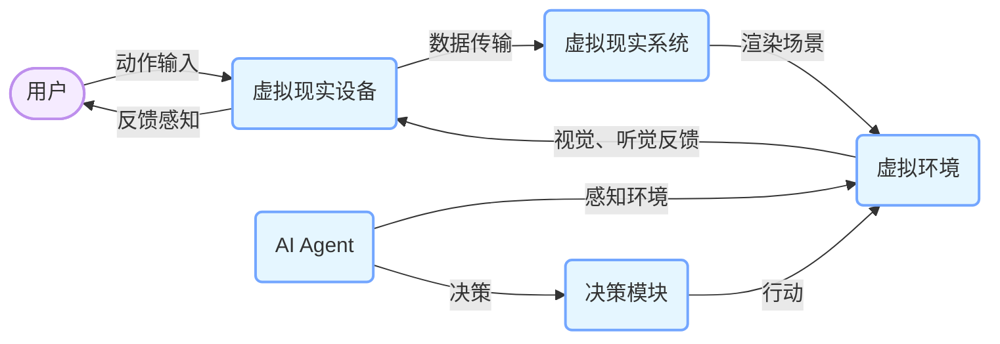

# AI Agent在虚拟现实中的应用：沉浸式体验增强

> 关键词：AI Agent、虚拟现实、沉浸式体验、交互技术、人工智能算法

> 摘要：本文深入探讨了AI Agent在虚拟现实中的应用，旨在增强用户的沉浸式体验。首先介绍了相关背景，包括目的范围、预期读者、文档结构和术语表。接着阐述了核心概念及联系，分析了AI Agent与虚拟现实的原理和架构，并给出相应示意图和流程图。详细讲解了核心算法原理和具体操作步骤，结合Python代码进行说明。同时给出了相关数学模型和公式，并举例解释。通过项目实战，展示了代码实际案例及详细解读。探讨了实际应用场景，推荐了学习、开发工具及相关论文著作。最后总结了未来发展趋势与挑战，还提供了常见问题解答和扩展阅读参考资料。

## 1. 背景介绍 
### 1.1 目的和范围
随着虚拟现实（VR）技术的不断发展，用户对于沉浸式体验的要求也越来越高。AI Agent作为人工智能领域的重要概念，具有自主决策和交互能力。本文章的目的在于研究如何将AI Agent应用于虚拟现实中，以增强用户在虚拟环境中的沉浸式体验。范围涵盖了AI Agent和虚拟现实的基本概念、相关算法原理、实际应用案例以及未来发展趋势等方面。

### 1.2 预期读者
本文预期读者包括虚拟现实技术开发者、人工智能研究人员、对虚拟现实和人工智能交叉领域感兴趣的学生和爱好者，以及相关行业的从业者，如游戏开发者、教育领域的技术人员等。

### 1.3 文档结构概述
本文将按照以下结构展开：首先介绍核心概念与联系，明确AI Agent和虚拟现实的原理和架构；接着讲解核心算法原理和具体操作步骤，并用Python代码进行详细阐述；然后给出数学模型和公式，并举例说明；通过项目实战展示代码实际案例和详细解释；探讨实际应用场景；推荐相关工具和资源；最后总结未来发展趋势与挑战，提供常见问题解答和扩展阅读参考资料。

### 1.4 术语表
#### 1.4.1 核心术语定义
- **AI Agent**：人工智能代理，是一种能够感知环境、自主决策并采取行动以实现特定目标的软件实体。
- **虚拟现实（VR）**：利用计算机技术生成的一种模拟环境，用户通过特定设备（如头戴式显示器）沉浸其中，获得身临其境的体验。
- **沉浸式体验**：用户在虚拟环境中产生的一种全身心投入、仿佛真实存在于其中的感觉。
- **交互技术**：实现用户与虚拟环境、AI Agent之间进行信息交换和操作的技术。

#### 1.4.2 相关概念解释
- **感知能力**：AI Agent通过各种传感器获取环境信息的能力，在虚拟现实中可以表现为对用户动作、位置、声音等的感知。
- **决策能力**：AI Agent根据感知到的信息，运用算法和规则做出决策的能力，例如决定如何与用户进行交互。
- **行动能力**：AI Agent根据决策结果采取相应行动的能力，如在虚拟环境中移动、改变状态等。

#### 1.4.3 缩略词列表
- **VR**：Virtual Reality（虚拟现实）
- **AI**：Artificial Intelligence（人工智能）

## 2. 核心概念与联系 
### 核心概念原理
#### AI Agent原理
AI Agent的基本原理是基于感知 - 决策 - 行动的循环。它通过传感器感知环境信息，将这些信息输入到决策模块，决策模块根据预设的算法和规则进行分析和推理，做出决策，然后通过执行器采取相应的行动。例如，在虚拟现实游戏中，一个AI Agent可能会感知到用户的攻击动作，根据自身的策略决定是进行防御、反击还是躲避，然后在虚拟环境中执行相应的动作。

#### 虚拟现实原理
虚拟现实利用计算机图形学、传感器技术和人机交互技术等，创建一个虚拟的三维环境。用户通过头戴式显示器、手柄等设备与虚拟环境进行交互。计算机根据用户的动作和输入实时更新虚拟场景的显示和反馈，使用户产生身临其境的感觉。例如，当用户转动头部时，虚拟场景会相应地改变视角，让用户感觉自己真的在虚拟世界中移动。

### 架构示意图


### 联系说明
AI Agent与虚拟现实的联系紧密。在虚拟现实中，AI Agent可以作为虚拟角色或智能助手存在。它们能够感知用户在虚拟环境中的行为，根据这些行为做出决策并与用户进行交互，从而丰富虚拟环境的内容和交互性，增强用户的沉浸式体验。例如，在一个虚拟现实教育场景中，AI Agent可以作为教师角色，根据学生的学习进度和表现提供个性化的指导和反馈。

## 3. 核心算法原理 & 具体操作步骤 
### 核心算法原理
#### 基于规则的算法
基于规则的算法是一种简单而直接的决策方法。AI Agent根据预设的规则对感知到的信息进行判断，并采取相应的行动。例如，在一个虚拟现实格斗游戏中，如果AI Agent感知到用户的攻击动作，并且攻击方向在其左侧，根据规则它可能会选择向右侧躲避。

以下是一个简单的基于规则的Python代码示例：
```python
# 定义规则
def rule_based_agent(user_action):
    if user_action == "left_attack":
        return "right_dodge"
    elif user_action == "right_attack":
        return "left_dodge"
    else:
        return "stand_still"

# 模拟用户动作
user_action = "left_attack"
agent_action = rule_based_agent(user_action)
print(f"用户动作: {user_action}, AI Agent动作: {agent_action}")
```

#### 机器学习算法
机器学习算法可以让AI Agent通过学习大量的数据来提高决策能力。常见的机器学习算法包括决策树、神经网络等。以神经网络为例，AI Agent可以通过训练学习到不同输入（如用户的动作、环境状态等）与输出（如最佳行动策略）之间的映射关系。

以下是一个简单的使用Python和TensorFlow库实现的神经网络示例：
```python
import tensorflow as tf
import numpy as np

# 生成一些示例数据
x_train = np.array([[0, 0], [0, 1], [1, 0], [1, 1]])
y_train = np.array([[0], [1], [1], [0]])

# 定义神经网络模型
model = tf.keras.Sequential([
    tf.keras.layers.Dense(2, input_shape=(2,), activation='relu'),
    tf.keras.layers.Dense(1, activation='sigmoid')
])

# 编译模型
model.compile(optimizer='adam', loss='binary_crossentropy', metrics=['accuracy'])

# 训练模型
model.fit(x_train, y_train, epochs=1000)

# 预测
test_input = np.array([[0, 0]])
prediction = model.predict(test_input)
print(f"预测结果: {prediction}")
```

### 具体操作步骤
1. **需求分析**：明确虚拟现实项目的需求，确定AI Agent的功能和目标，例如在游戏中是作为敌人还是队友，在教育场景中是提供知识讲解还是互动练习等。
2. **数据收集与预处理**：收集与AI Agent决策相关的数据，如用户的历史行为数据、虚拟环境的状态数据等。对数据进行清洗、归一化等预处理操作，以便后续的算法处理。
3. **算法选择与模型训练**：根据需求和数据特点选择合适的算法，如基于规则的算法或机器学习算法。如果选择机器学习算法，需要使用收集到的数据对模型进行训练。
4. **集成与测试**：将训练好的AI Agent集成到虚拟现实系统中，进行功能测试和性能测试，确保其能够正常工作并达到预期的效果。
5. **优化与调整**：根据测试结果对AI Agent的算法和参数进行优化和调整，进一步提高其决策能力和交互效果。

## 4. 数学模型和公式 & 详细讲解 & 举例说明 
### 基于规则的算法数学模型
基于规则的算法可以用条件语句来表示。设 $S$ 为感知到的环境状态集合，$A$ 为可能的行动集合，$R$ 为规则集合。对于每个规则 $r \in R$，可以表示为一个条件 - 行动对 $(c, a)$，其中 $c$ 是一个关于 $S$ 的条件表达式，$a$ 是 $A$ 中的一个行动。当感知到的状态 $s \in S$ 满足条件 $c$ 时，AI Agent将采取行动 $a$。

例如，在前面的格斗游戏示例中，$S$ 可以表示为 $\{left\_attack, right\_attack, no\_attack\}$，$A$ 可以表示为 $\{right\_dodge, left\_dodge, stand\_still\}$，规则集合 $R$ 可以表示为：
- $(s == left\_attack, right\_dodge)$
- $(s == right\_attack, left\_dodge)$
- $(s == no\_attack, stand\_still)$

### 机器学习算法数学模型（以神经网络为例）
神经网络是一种基于神经元模型的机器学习算法。一个简单的多层感知机（MLP）可以表示为：

设输入层有 $n$ 个神经元，隐藏层有 $m$ 个神经元，输出层有 $k$ 个神经元。输入向量 $\mathbf{x} = [x_1, x_2, \cdots, x_n]^T$，隐藏层第 $j$ 个神经元的输入为：

$$z_j = \sum_{i=1}^{n} w_{ji}x_i + b_j$$

其中 $w_{ji}$ 是输入层第 $i$ 个神经元到隐藏层第 $j$ 个神经元的权重，$b_j$ 是隐藏层第 $j$ 个神经元的偏置。

经过激活函数 $\sigma$ 处理后，隐藏层第 $j$ 个神经元的输出为：

$$h_j = \sigma(z_j)$$

输出层第 $l$ 个神经元的输入为：

$$u_l = \sum_{j=1}^{m} v_{lj}h_j + c_l$$

其中 $v_{lj}$ 是隐藏层第 $j$ 个神经元到输出层第 $l$ 个神经元的权重，$c_l$ 是输出层第 $l$ 个神经元的偏置。

经过激活函数处理后，输出层第 $l$ 个神经元的输出为：

$$y_l = \sigma(u_l)$$

整个神经网络的输出向量为 $\mathbf{y} = [y_1, y_2, \cdots, y_k]^T$。

### 举例说明
假设我们有一个简单的二分类问题，输入是二维向量 $\mathbf{x} = [x_1, x_2]^T$，输出是一个标量 $y$（0 或 1）。我们使用一个包含一个隐藏层（2 个神经元）的神经网络来解决这个问题。

输入层到隐藏层的权重矩阵 $\mathbf{W}$ 为：

$$\mathbf{W} = \begin{bmatrix}
w_{11} & w_{12} \\
w_{21} & w_{22}
\end{bmatrix}$$

隐藏层到输出层的权重向量 $\mathbf{v}$ 为：

$$\mathbf{v} = \begin{bmatrix}
v_1 \\
v_2
\end{bmatrix}$$

隐藏层的偏置向量 $\mathbf{b}$ 为：

$$\mathbf{b} = \begin{bmatrix}
b_1 \\
b_2
\end{bmatrix}$$

输出层的偏置 $c$。

对于输入 $\mathbf{x}$，隐藏层的输入向量 $\mathbf{z}$ 为：

$$\mathbf{z} = \mathbf{W}\mathbf{x} + \mathbf{b}$$

隐藏层的输出向量 $\mathbf{h}$ 为：

$$\mathbf{h} = \sigma(\mathbf{z})$$

输出层的输入 $u$ 为：

$$u = \mathbf{v}^T\mathbf{h} + c$$

最终输出 $y$ 为：

$$y = \sigma(u)$$

假设 $\mathbf{W} = \begin{bmatrix}
1 & 2 \\
3 & 4
\end{bmatrix}$，$\mathbf{v} = \begin{bmatrix}
5 \\
6
\end{bmatrix}$，$\mathbf{b} = \begin{bmatrix}
0.1 \\
0.2
\end{bmatrix}$，$c = 0.3$，$\mathbf{x} = \begin{bmatrix}
0.5 \\
0.6
\end{bmatrix}$，激活函数 $\sigma$ 为 sigmoid 函数 $\sigma(t) = \frac{1}{1 + e^{-t}}$。

首先计算隐藏层的输入向量 $\mathbf{z}$：

$$\mathbf{z} = \begin{bmatrix}
1 & 2 \\
3 & 4
\end{bmatrix}\begin{bmatrix}
0.5 \\
0.6
\end{bmatrix} + \begin{bmatrix}
0.1 \\
0.2
\end{bmatrix} = \begin{bmatrix}
1\times0.5 + 2\times0.6 + 0.1 \\
3\times0.5 + 4\times0.6 + 0.2
\end{bmatrix} = \begin{bmatrix}
1.8 \\
4.1
\end{bmatrix}$$

然后计算隐藏层的输出向量 $\mathbf{h}$：

$$\mathbf{h} = \begin{bmatrix}
\frac{1}{1 + e^{-1.8}} \\
\frac{1}{1 + e^{-4.1}}
\end{bmatrix} \approx \begin{bmatrix}
0.85 \\
0.98
\end{bmatrix}$$

接着计算输出层的输入 $u$：

$$u = \begin{bmatrix}
5 & 6
\end{bmatrix}\begin{bmatrix}
0.85 \\
0.98
\end{bmatrix} + 0.3 = 5\times0.85 + 6\times0.98 + 0.3 = 10.33$$

最后计算最终输出 $y$：

$$y = \frac{1}{1 + e^{-10.33}} \approx 1$$

## 5. 项目实战：代码实际案例和详细解释说明 
### 5.1  开发环境搭建
#### 硬件环境
- **计算机**：需要一台性能较好的计算机，推荐配备高性能的显卡（如NVIDIA GeForce RTX系列）、多核处理器（如Intel Core i7以上）和足够的内存（16GB以上）。
- **虚拟现实设备**：如Oculus Rift、HTC Vive等头戴式显示器，以及相应的手柄等交互设备。

#### 软件环境
- **操作系统**：推荐使用Windows 10或更高版本。
- **开发工具**：
    - **Python**：版本3.7以上，用于实现AI Agent的算法。
    - **Unity**：一款流行的游戏开发引擎，支持虚拟现实开发，用于创建虚拟现实场景。
    - **TensorFlow**：用于机器学习模型的训练和部署。

### 5.2  源代码详细实现和代码解读
#### 场景描述
我们将创建一个简单的虚拟现实场景，其中有一个AI Agent作为虚拟角色，用户可以通过手柄与AI Agent进行交互。AI Agent根据用户的动作做出相应的反应。

#### Python代码实现（AI Agent决策部分）
```python
import numpy as np
import tensorflow as tf

# 加载训练好的模型
model = tf.keras.models.load_model('trained_model.h5')

# 定义动作映射
action_mapping = {
    0: "walk_forward",
    1: "walk_backward",
    2: "turn_left",
    3: "turn_right"
}

def ai_agent_decision(user_input):
    # 对用户输入进行预处理
    input_data = np.array([user_input])
    # 进行预测
    prediction = model.predict(input_data)
    # 获取预测结果的索引
    action_index = np.argmax(prediction)
    # 根据索引获取对应的动作
    action = action_mapping[action_index]
    return action

# 模拟用户输入
user_input = [0.1, 0.2, 0.3, 0.4]
agent_action = ai_agent_decision(user_input)
print(f"用户输入: {user_input}, AI Agent动作: {agent_action}")
```

#### 代码解读
- **加载模型**：使用 `tf.keras.models.load_model` 函数加载之前训练好的机器学习模型。
- **动作映射**：定义一个字典 `action_mapping`，将模型输出的索引映射到具体的动作。
- **决策函数**：`ai_agent_decision` 函数接收用户输入，对输入进行预处理后，使用模型进行预测，获取预测结果的索引，再根据索引从动作映射中获取对应的动作。

#### Unity代码实现（虚拟现实场景部分）
```csharp
using UnityEngine;

public class UserInteraction : MonoBehaviour
{
    public GameObject aiAgent;
    public float inputValue1;
    public float inputValue2;
    public float inputValue3;
    public float inputValue4;

    // 模拟用户输入并发送给AI Agent
    void Update()
    {
        if (Input.GetButtonDown("Fire1"))
        {
            float[] userInput = { inputValue1, inputValue2, inputValue3, inputValue4 };
            string agentAction = SendInputToPython(userInput);
            PerformAgentAction(agentAction);
        }
    }

    // 发送用户输入到Python脚本
    string SendInputToPython(float[] userInput)
    {
        // 这里可以使用Python.NET等工具调用Python脚本
        // 为了简化，假设已经实现了调用并返回结果
        return "walk_forward";
    }

    // 根据AI Agent的动作执行相应的操作
    void PerformAgentAction(string action)
    {
        switch (action)
        {
            case "walk_forward":
                aiAgent.transform.Translate(Vector3.forward * Time.deltaTime);
                break;
            case "walk_backward":
                aiAgent.transform.Translate(Vector3.back * Time.deltaTime);
                break;
            case "turn_left":
                aiAgent.transform.Rotate(Vector3.up, -90 * Time.deltaTime);
                break;
            case "turn_right":
                aiAgent.transform.Rotate(Vector3.up, 90 * Time.deltaTime);
                break;
        }
    }
}
```

#### 代码解读
- **用户交互脚本**：`UserInteraction` 脚本挂载在用户交互对象上，在 `Update` 方法中检测用户按下“Fire1”按钮的事件。
- **发送输入**：`SendInputToPython` 方法将用户输入发送给Python脚本，并返回AI Agent的动作。这里为了简化，直接返回一个固定的动作。
- **执行动作**：`PerformAgentAction` 方法根据AI Agent的动作，对AI Agent对象进行相应的移动或旋转操作。

### 5.3  代码解读与分析
#### 优点
- **模块化设计**：Python代码和Unity代码分别实现了AI Agent的决策和虚拟现实场景的交互，代码结构清晰，便于维护和扩展。
- **机器学习的应用**：使用训练好的机器学习模型进行决策，使AI Agent能够根据用户输入做出更智能的反应。

#### 缺点
- **通信问题**：在实际应用中，Python脚本和Unity之间的通信可能会存在延迟和稳定性问题，需要进一步优化。
- **模型训练**：机器学习模型的训练需要大量的数据和计算资源，如果数据不足或模型设计不合理，可能会导致决策不准确。

## 6. 实际应用场景 
### 游戏领域
在虚拟现实游戏中，AI Agent可以作为敌人、队友或NPC（非玩家角色）存在。作为敌人，AI Agent可以根据玩家的行为和策略做出不同的反应，增加游戏的挑战性和趣味性。例如，在一款虚拟现实射击游戏中，AI敌人可以感知玩家的位置和动作，选择合适的时机进行攻击或躲避。作为队友，AI Agent可以协助玩家完成任务，提供支援和保护。例如，在一款虚拟现实角色扮演游戏中，AI队友可以根据玩家的指令和战场情况进行战斗和治疗。

### 教育领域
在虚拟现实教育中，AI Agent可以作为教师、导师或学习伙伴。作为教师，AI Agent可以根据学生的学习进度和表现提供个性化的教学内容和指导。例如，在一款虚拟现实化学实验教学中，AI Agent可以引导学生进行实验操作，解答学生的问题，并对学生的实验结果进行评估。作为学习伙伴，AI Agent可以与学生进行互动和合作，共同完成学习任务。例如，在一款虚拟现实历史学习游戏中，AI Agent可以与学生一起探索历史场景，讨论历史事件。

### 医疗领域
在虚拟现实医疗中，AI Agent可以作为康复治疗师、心理咨询师或医疗助手。作为康复治疗师，AI Agent可以根据患者的病情和康复进度制定个性化的康复方案，并引导患者进行康复训练。例如，在一款虚拟现实运动康复训练中，AI Agent可以实时监测患者的动作，给予反馈和纠正。作为心理咨询师，AI Agent可以与患者进行交流和沟通，提供心理支持和疏导。例如，在一款虚拟现实心理治疗中，AI Agent可以通过对话了解患者的心理状态，给予相应的建议和指导。作为医疗助手，AI Agent可以协助医生进行手术模拟、病例分析等工作。例如，在一款虚拟现实手术模拟系统中，AI Agent可以提供手术步骤的提示和风险评估。

### 工业领域
在虚拟现实工业中，AI Agent可以作为生产指导者、质量检测员或设备维护员。作为生产指导者，AI Agent可以根据生产计划和工艺要求，指导工人进行生产操作。例如，在一款虚拟现实汽车装配生产线中，AI Agent可以实时显示装配步骤和注意事项，帮助工人提高生产效率和质量。作为质量检测员，AI Agent可以利用图像识别、传感器等技术对产品进行质量检测，及时发现和处理问题。例如，在一款虚拟现实电子产品检测系统中，AI Agent可以检测产品的外观缺陷、性能指标等。作为设备维护员，AI Agent可以对设备进行实时监测和故障诊断，提前预测设备的故障并提供维护建议。例如，在一款虚拟现实工业设备维护系统中，AI Agent可以分析设备的运行数据，判断设备是否存在异常，并提供相应的维护方案。

## 7. 工具和资源推荐
### 7.1 学习资源推荐
#### 7.1.1 书籍推荐
- 《人工智能：一种现代的方法》：这是一本经典的人工智能教材，涵盖了人工智能的各个领域，包括AI Agent、机器学习、自然语言处理等。
- 《虚拟现实技术及应用》：详细介绍了虚拟现实的原理、技术和应用，对于了解虚拟现实的基本概念和开发方法有很大帮助。
- 《Python机器学习实战》：通过实际案例介绍了Python在机器学习中的应用，对于学习如何使用Python实现AI Agent的算法很有帮助。

#### 7.1.2 在线课程
- Coursera上的“人工智能基础”课程：由知名教授授课，系统地介绍了人工智能的基本概念和算法。
- Udemy上的“虚拟现实开发实战”课程：通过实际项目讲解了如何使用Unity等工具进行虚拟现实开发。
- edX上的“Python数据科学入门”课程：帮助学习者掌握Python在数据处理和机器学习中的应用。

#### 7.1.3 技术博客和网站
- Medium：有很多关于人工智能和虚拟现实的技术文章和案例分享。
- arXiv：提供了大量的学术论文和研究成果，对于了解最新的技术动态很有帮助。
- Stack Overflow：一个程序员社区，用户可以在这里提问和分享经验，解决开发过程中遇到的问题。

### 7.2 开发工具框架推荐
#### 7.2.1 IDE和编辑器
- PyCharm：一款专业的Python集成开发环境，提供了代码编辑、调试、版本控制等功能。
- Visual Studio Code：一款轻量级的代码编辑器，支持多种编程语言，有丰富的插件可以扩展功能。
- Unity Hub：用于管理和启动Unity引擎，方便开发者进行虚拟现实项目的开发。

#### 7.2.2 调试和性能分析工具
- TensorBoard：TensorFlow的可视化工具，可以帮助开发者监控模型的训练过程和性能指标。
- Unity Profiler：Unity引擎自带的性能分析工具，可以帮助开发者找出项目中的性能瓶颈。
- Py-Spy：一个Python性能分析工具，可以实时监测Python程序的运行状态和性能。

#### 7.2.3 相关框架和库
- TensorFlow：一个开源的机器学习框架，提供了丰富的工具和算法，用于模型的训练和部署。
- PyTorch：另一个流行的机器学习框架，具有动态图和易于使用的特点。
- OpenAI Gym：一个用于开发和比较强化学习算法的工具包，提供了多种环境和任务。

### 7.3 相关论文著作推荐
#### 7.3.1 经典论文
- “Reinforcement Learning: An Introduction”：强化学习领域的经典著作，系统地介绍了强化学习的基本概念和算法。
- “A Logical Calculus of the Ideas Immanent in Nervous Activity”：提出了神经网络的基本模型，为人工智能的发展奠定了基础。
- “The AI Effect: Why AI Seem Not to Work”：探讨了人工智能发展过程中遇到的问题和挑战。

#### 7.3.2 最新研究成果
- 关注顶级学术会议如NeurIPS（神经信息处理系统大会）、ICML（国际机器学习会议）、CVPR（计算机视觉与模式识别会议）上的最新论文，了解人工智能和虚拟现实领域的最新研究进展。
- 查阅知名学术期刊如Journal of Artificial Intelligence Research（JAIR）、ACM Transactions on Graphics（TOG）上的相关研究成果。

#### 7.3.3 应用案例分析
- 一些行业报告和案例分析网站会分享AI Agent在虚拟现实中的实际应用案例，如Gartner、Forrester等机构的报告，以及行业博客和论坛上的案例分享。

## 8. 总结：未来发展趋势与挑战
### 未来发展趋势
#### 更加智能的AI Agent
随着人工智能技术的不断发展，AI Agent将具备更强大的感知、决策和学习能力。它们能够更好地理解用户的意图和情感，提供更加个性化的交互体验。例如，在虚拟现实游戏中，AI Agent可以根据玩家的情绪状态调整游戏难度和节奏。

#### 多模态交互
未来的虚拟现实系统将支持多模态交互，如语音、手势、表情等。AI Agent可以通过多种方式感知用户的输入，并做出相应的反应。例如，在虚拟现实教育场景中，学生可以通过语音提问，AI Agent可以实时回答并提供相关的学习资源。

#### 与现实世界的融合
虚拟现实将与现实世界更加紧密地融合，AI Agent可以在虚拟和现实之间进行无缝切换和交互。例如，在工业领域，工人可以通过虚拟现实设备与远程的AI Agent进行协作，共同完成生产任务。

#### 社交化体验
虚拟现实将成为一个社交平台，AI Agent可以作为虚拟社交伙伴，帮助用户建立社交关系和进行交流。例如，在虚拟现实社交游戏中，AI Agent可以根据用户的兴趣和偏好推荐合适的社交对象。

### 挑战
#### 技术难题
- **计算资源需求**：实现更加智能的AI Agent和多模态交互需要大量的计算资源，如何在有限的硬件条件下满足这些需求是一个挑战。
- **数据隐私和安全**：AI Agent需要收集和处理大量的用户数据，如何保护用户的隐私和数据安全是一个重要问题。
- **算法复杂度**：随着AI Agent的功能越来越复杂，算法的复杂度也会增加，如何设计高效、可解释的算法是一个挑战。

#### 用户接受度
- **沉浸感和舒适度**：虚拟现实设备的佩戴舒适度和沉浸感仍然有待提高，如果用户在使用过程中感到不适，会影响他们对虚拟现实和AI Agent的接受度。
- **学习成本**：使用虚拟现实和AI Agent需要一定的学习成本，如何降低学习成本，让更多的用户能够轻松上手是一个问题。

#### 伦理和法律问题
- **道德决策**：AI Agent在做出决策时可能会涉及到道德和伦理问题，如何确保AI Agent的决策符合人类的价值观和道德准则是一个挑战。
- **法律责任**：当AI Agent在虚拟现实中造成损害时，如何确定法律责任是一个需要解决的问题。

## 9. 附录：常见问题与解答
### 问题1：AI Agent和虚拟现实的结合需要哪些技术基础？
答：需要掌握人工智能算法（如机器学习、强化学习）、虚拟现实技术（如计算机图形学、传感器技术）、编程语言（如Python、C#）以及相关的开发工具和框架（如TensorFlow、Unity）。

### 问题2：如何训练一个高效的AI Agent用于虚拟现实？
答：首先需要收集大量与虚拟现实场景相关的数据，然后选择合适的算法进行模型训练。在训练过程中，需要不断调整模型的参数，进行优化和评估，以提高模型的性能。

### 问题3：AI Agent在虚拟现实中的响应速度如何保证？
答：可以通过优化算法、使用高性能的硬件设备、采用分布式计算等方式来提高AI Agent的响应速度。同时，合理设计数据传输和处理流程，减少延迟。

### 问题4：虚拟现实中的AI Agent是否会取代人类角色？
答：目前来看，AI Agent在虚拟现实中主要是作为辅助角色，增强用户的体验。虽然AI Agent的能力在不断提高，但它们无法完全取代人类角色，因为人类具有情感、创造力和主观判断能力，这些是AI Agent目前所不具备的。

### 问题5：如何确保AI Agent在虚拟现实中的安全性？
答：需要从多个方面确保安全性，包括数据加密、访问控制、漏洞修复等。同时，对AI Agent的决策和行为进行监控和审计，及时发现和处理潜在的安全问题。

## 10. 扩展阅读 & 参考资料
- 《人工智能时代的虚拟现实技术创新》
- 《基于AI Agent的虚拟现实交互系统设计与实现》
- 相关学术论文和研究报告可在IEEE Xplore、ACM Digital Library等学术数据库中查找。

作者：AI天才研究院/AI Genius Institute & 禅与计算机程序设计艺术 /Zen And The Art of Computer Programming