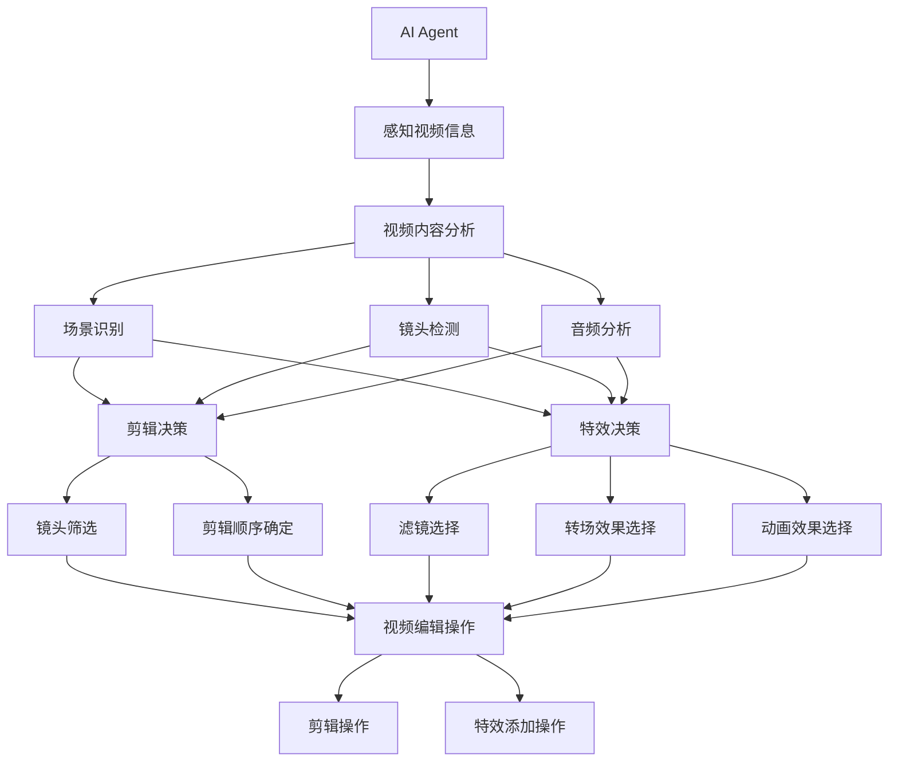

# AI Agent在视频编辑中的应用：自动剪辑与特效添加

> 关键词：AI Agent、视频编辑、自动剪辑、特效添加、人工智能

> 摘要：本文聚焦于AI Agent在视频编辑领域的应用，特别是自动剪辑与特效添加功能。首先介绍了相关背景知识，包括目的、预期读者等内容。接着深入剖析AI Agent的核心概念与联系，阐述其工作原理和架构。详细讲解了实现自动剪辑与特效添加的核心算法原理，并给出Python代码示例。通过数学模型和公式进一步解释其内在逻辑，还提供了项目实战案例，包括开发环境搭建、源代码实现与解读。探讨了AI Agent在视频编辑中的实际应用场景，推荐了相关学习资源、开发工具框架以及论文著作。最后总结了未来发展趋势与挑战，并提供常见问题解答和扩展阅读参考资料，旨在为读者全面呈现AI Agent在视频编辑中的应用全貌。

## 1. 背景介绍 
### 1.1 目的和范围
在当今数字化时代，视频内容的创作和传播需求呈爆炸式增长。无论是社交媒体上的短视频，还是专业的影视制作，都需要高效、高质量的视频编辑技术。传统的视频编辑方式往往需要专业的技能和大量的时间投入，这限制了视频创作的普及和效率。AI Agent在视频编辑中的应用，特别是自动剪辑与特效添加功能，旨在降低视频编辑的门槛，提高编辑效率，让更多人能够轻松创作出精彩的视频内容。

本文的范围主要涵盖AI Agent在视频编辑中自动剪辑与特效添加的相关技术和应用。将深入探讨其核心概念、算法原理、数学模型，通过项目实战展示具体实现方法，并分析其实际应用场景和未来发展趋势。

### 1.2 预期读者
本文预期读者包括对视频编辑技术感兴趣的初学者、希望了解AI在视频领域应用的技术爱好者、从事视频编辑相关工作的专业人员以及对人工智能算法研究有兴趣的科研人员。

### 1.3 文档结构概述
本文将按照以下结构进行组织：
1. 背景介绍：阐述文章的目的、预期读者和文档结构概述，并对相关术语进行解释。
2. 核心概念与联系：介绍AI Agent、视频编辑、自动剪辑和特效添加的核心概念，以及它们之间的联系，通过文本示意图和Mermaid流程图进行说明。
3. 核心算法原理 & 具体操作步骤：详细讲解实现自动剪辑与特效添加的核心算法原理，并给出Python源代码进行具体阐述。
4. 数学模型和公式 & 详细讲解 & 举例说明：通过数学模型和公式深入解释算法的内在逻辑，并举例说明其应用。
5. 项目实战：代码实际案例和详细解释说明：包括开发环境搭建、源代码详细实现和代码解读，以及对代码的分析。
6. 实际应用场景：探讨AI Agent在视频编辑中的实际应用场景。
7. 工具和资源推荐：推荐相关的学习资源、开发工具框架和论文著作。
8. 总结：未来发展趋势与挑战：总结AI Agent在视频编辑中应用的未来发展趋势和面临的挑战。
9. 附录：常见问题与解答：提供常见问题的解答。
10. 扩展阅读 & 参考资料：提供扩展阅读的相关资料和参考文献。

### 1.4 术语表
#### 1.4.1 核心术语定义
- **AI Agent（人工智能代理）**：是一种能够感知环境、做出决策并采取行动的智能实体。在视频编辑中，AI Agent可以根据视频内容和用户需求，自动完成剪辑和特效添加等任务。
- **自动剪辑**：指利用计算机技术，根据预设的规则或算法，自动对视频素材进行筛选、裁剪和拼接，生成完整视频的过程。
- **特效添加**：在视频中添加各种视觉效果，如滤镜、转场效果、动画等，以增强视频的观赏性和表现力。
- **视频编辑**：对视频素材进行采集、剪辑、合成、特效处理等一系列操作，以制作出符合需求的视频作品的过程。

#### 1.4.2 相关概念解释
- **计算机视觉**：是人工智能的一个重要领域，研究如何让计算机理解和处理图像和视频。在视频编辑中，计算机视觉技术可用于视频内容分析、目标检测、图像识别等任务，为自动剪辑和特效添加提供基础支持。
- **深度学习**：是一种基于人工神经网络的机器学习方法，能够自动从大量数据中学习特征和模式。在视频编辑中，深度学习可用于训练模型，实现视频内容的理解和特效的生成。

#### 1.4.3 缩略词列表
- **CNN（Convolutional Neural Network）**：卷积神经网络，一种常用于图像和视频处理的深度学习模型。
- **RNN（Recurrent Neural Network）**：循环神经网络，适用于处理序列数据，如视频帧序列。
- **GAN（Generative Adversarial Network）**：生成对抗网络，可用于生成逼真的图像和视频特效。

## 2. 核心概念与联系 

### 核心概念原理
#### AI Agent
AI Agent是一个智能实体，它由感知模块、决策模块和执行模块组成。感知模块负责获取视频的相关信息，如视频内容、音频信息等；决策模块根据感知到的信息和预设的规则或目标，做出相应的决策，如确定剪辑的时间点、选择合适的特效等；执行模块则根据决策结果，对视频进行实际的剪辑和特效添加操作。

#### 自动剪辑
自动剪辑的原理是通过对视频内容的分析，提取关键信息，如场景变化、镜头切换、音频特征等，然后根据预设的规则或算法，对视频素材进行筛选和拼接。例如，可以根据视频的主题、时长要求、情感表达等因素，自动选择合适的镜头，并按照一定的节奏进行剪辑。

#### 特效添加
特效添加的原理是利用图像处理和计算机图形学技术，对视频帧进行处理，生成各种视觉效果。例如，滤镜效果可以通过调整图像的颜色、对比度、亮度等参数来实现；转场效果可以通过图像的渐变、变形等操作来实现；动画效果可以通过对图像的运动、变形等处理来实现。

### 架构的文本示意图
```plaintext
            +----------------+
            |   AI Agent     |
            +----------------+
            |  感知模块      |
            |  决策模块      |
            |  执行模块      |
            +----------------+
                   |
                   |  感知视频信息
                   v
            +----------------+
            |  视频内容分析  |
            +----------------+
            |  场景识别      |
            |  镜头检测      |
            |  音频分析      |
            +----------------+
                   |
                   |  决策依据
                   v
            +----------------+
            |  剪辑决策      |
            +----------------+
            |  镜头筛选      |
            |  剪辑顺序确定  |
            +----------------+
                   |
                   |  特效决策
                   v
            +----------------+
            |  特效选择      |
            +----------------+
            |  滤镜选择      |
            |  转场效果选择  |
            |  动画效果选择  |
            +----------------+
                   |
                   |  执行操作
                   v
            +----------------+
            |  视频编辑操作  |
            +----------------+
            |  剪辑操作      |
            |  特效添加操作  |
            +----------------+
```

### Mermaid流程图


## 3. 核心算法原理 & 具体操作步骤 

### 自动剪辑算法原理
自动剪辑的核心算法是基于视频内容分析和镜头筛选。以下是一个简单的基于镜头变化检测的自动剪辑算法：

```python
import cv2

def detect_shot_changes(video_path, threshold=30):
    cap = cv2.VideoCapture(video_path)
    ret, prev_frame = cap.read()
    if not ret:
        return []
    prev_gray = cv2.cvtColor(prev_frame, cv2.COLOR_BGR2GRAY)
    shot_changes = []
    frame_count = 0

    while True:
        ret, frame = cap.read()
        if not ret:
            break
        gray = cv2.cvtColor(frame, cv2.COLOR_BGR2GRAY)
        diff = cv2.absdiff(prev_gray, gray)
        diff_mean = diff.mean()
        if diff_mean > threshold:
            shot_changes.append(frame_count)
        prev_gray = gray
        frame_count += 1

    cap.release()
    return shot_changes

def auto_clip_video(video_path, shot_changes, clip_duration=5):
    cap = cv2.VideoCapture(video_path)
    fps = cap.get(cv2.CAP_PROP_FPS)
    fourcc = cv2.VideoWriter_fourcc(*'mp4v')
    out = cv2.VideoWriter('output.mp4', fourcc, fps, (int(cap.get(3)), int(cap.get(4))))

    for change in shot_changes:
        start_frame = change
        end_frame = start_frame + int(clip_duration * fps)
        cap.set(cv2.CAP_PROP_POS_FRAMES, start_frame)
        frame_count = 0
        while frame_count < clip_duration * fps and cap.isOpened():
            ret, frame = cap.read()
            if ret:
                out.write(frame)
            else:
                break
            frame_count += 1

    cap.release()
    out.release()

# 示例使用
video_path = 'input_video.mp4'
shot_changes = detect_shot_changes(video_path)
auto_clip_video(video_path, shot_changes)
```

### 特效添加算法原理
特效添加可以使用OpenCV库实现简单的滤镜效果。以下是一个添加灰度滤镜的示例代码：

```python
import cv2

def add_gray_filter(video_path, output_path):
    cap = cv2.VideoCapture(video_path)
    fps = cap.get(cv2.CAP_PROP_FPS)
    fourcc = cv2.VideoWriter_fourcc(*'mp4v')
    out = cv2.VideoWriter(output_path, fourcc, fps, (int(cap.get(3)), int(cap.get(4))), isColor=False)

    while cap.isOpened():
        ret, frame = cap.read()
        if ret:
            gray_frame = cv2.cvtColor(frame, cv2.COLOR_BGR2GRAY)
            out.write(gray_frame)
        else:
            break

    cap.release()
    out.release()

# 示例使用
video_path = 'input_video.mp4'
output_path = 'output_gray.mp4'
add_gray_filter(video_path, output_path)
```

### 具体操作步骤
1. **视频内容分析**：使用计算机视觉技术对视频进行分析，提取关键信息，如场景变化、镜头切换、音频特征等。
2. **剪辑决策**：根据视频内容分析的结果，确定剪辑的时间点、镜头筛选和剪辑顺序。
3. **特效决策**：根据视频的主题、风格和用户需求，选择合适的特效，如滤镜、转场效果、动画等。
4. **视频编辑操作**：根据剪辑决策和特效决策的结果，对视频进行实际的剪辑和特效添加操作。

## 4. 数学模型和公式 & 详细讲解 & 举例说明 

### 镜头变化检测的数学模型
镜头变化检测可以通过计算相邻帧之间的差异来实现。常用的方法是计算相邻帧的灰度图像之间的绝对差值的平均值。

设 $I_{t}$ 和 $I_{t+1}$ 分别表示第 $t$ 帧和第 $t+1$ 帧的灰度图像，$D_{t}$ 表示它们之间的绝对差值图像，则：

$$D_{t}(x,y) = |I_{t}(x,y) - I_{t+1}(x,y)|$$

其中，$(x,y)$ 表示图像中的像素坐标。

然后计算 $D_{t}$ 的平均值 $\overline{D_{t}}$：

$$\overline{D_{t}} = \frac{1}{M \times N} \sum_{x=0}^{M-1} \sum_{y=0}^{N-1} D_{t}(x,y)$$

其中，$M$ 和 $N$ 分别表示图像的宽度和高度。

当 $\overline{D_{t}}$ 超过某个阈值 $\theta$ 时，认为发生了镜头变化。

### 举例说明
假设我们有一个视频，其中相邻两帧的灰度图像如下：

$I_{t} = \begin{bmatrix} 100 & 110 & 120 \\ 130 & 140 & 150 \\ 160 & 170 & 180 \end{bmatrix}$

$I_{t+1} = \begin{bmatrix} 150 & 160 & 170 \\ 180 & 190 & 200 \\ 210 & 220 & 230 \end{bmatrix}$

首先计算绝对差值图像 $D_{t}$：

$D_{t} = \begin{bmatrix} |100 - 150| & |110 - 160| & |120 - 170| \\ |130 - 180| & |140 - 190| & |150 - 200| \\ |160 - 210| & |170 - 220| & |180 - 230| \end{bmatrix} = \begin{bmatrix} 50 & 50 & 50 \\ 50 & 50 & 50 \\ 50 & 50 & 50 \end{bmatrix}$

然后计算平均值 $\overline{D_{t}}$：

$\overline{D_{t}} = \frac{1}{3 \times 3} \sum_{x=0}^{2} \sum_{y=0}^{2} D_{t}(x,y) = \frac{1}{9} \times (50 \times 9) = 50$

如果阈值 $\theta = 30$，则 $\overline{D_{t}} > \theta$，认为发生了镜头变化。

### 特效添加的数学模型
以灰度滤镜为例，灰度滤镜的原理是将彩色图像转换为灰度图像。对于彩色图像中的每个像素 $(x,y)$，其RGB值分别为 $(R(x,y), G(x,y), B(x,y))$，转换为灰度值 $Y(x,y)$ 的公式为：

$$Y(x,y) = 0.299R(x,y) + 0.587G(x,y) + 0.114B(x,y)$$

这个公式是根据人眼对不同颜色的敏感度来确定的，其中红色、绿色和蓝色的权重分别为 0.299、0.587 和 0.114。

### 举例说明
假设我们有一个彩色像素的RGB值为 $(200, 150, 100)$，则其灰度值为：

$Y = 0.299 \times 200 + 0.587 \times 150 + 0.114 \times 100 = 59.8 + 88.05 + 11.4 = 159.25$

因此，该彩色像素转换为灰度像素后的灰度值为 159.25。

## 5. 项目实战：代码实际案例和详细解释说明 

### 5.1  开发环境搭建
1. **安装Python**：从Python官方网站（https://www.python.org/downloads/）下载并安装Python 3.x版本。
2. **安装OpenCV**：使用pip命令安装OpenCV库：
```sh
pip install opencv-python
```
3. **安装FFmpeg**：FFmpeg是一个强大的音视频处理工具，OpenCV在处理视频时可能需要依赖FFmpeg。可以从FFmpeg官方网站（https://ffmpeg.org/download.html）下载并安装FFmpeg，并将其添加到系统环境变量中。

### 5.2  源代码详细实现和代码解读
#### 自动剪辑代码实现
```python
import cv2

def detect_shot_changes(video_path, threshold=30):
    # 打开视频文件
    cap = cv2.VideoCapture(video_path)
    # 读取第一帧
    ret, prev_frame = cap.read()
    if not ret:
        return []
    # 将第一帧转换为灰度图像
    prev_gray = cv2.cvtColor(prev_frame, cv2.COLOR_BGR2GRAY)
    shot_changes = []
    frame_count = 0

    while True:
        # 读取下一帧
        ret, frame = cap.read()
        if not ret:
            break
        # 将当前帧转换为灰度图像
        gray = cv2.cvtColor(frame, cv2.COLOR_BGR2GRAY)
        # 计算相邻帧的绝对差值