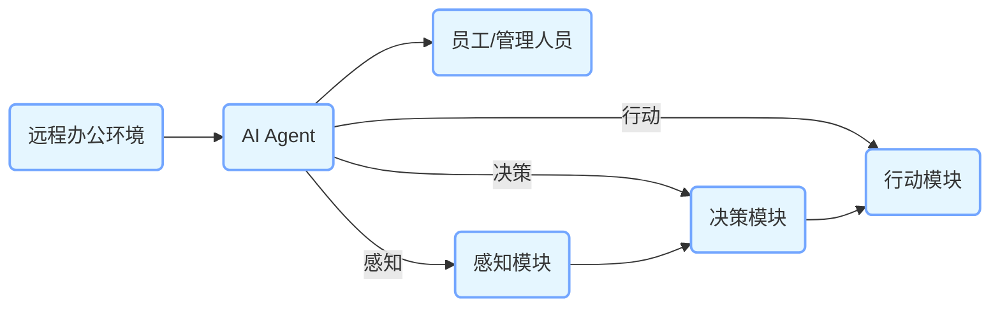

# AI Agent在远程办公支持中的应用与最佳实践

> 关键词：AI Agent、远程办公支持、智能助手、自动化流程、最佳实践

> 摘要：本文深入探讨了AI Agent在远程办公支持领域的应用与最佳实践。首先介绍了相关背景，包括目的、预期读者、文档结构和术语表。接着阐述了AI Agent的核心概念及其与远程办公的联系，给出了原理和架构的文本示意图与Mermaid流程图。详细讲解了核心算法原理并通过Python代码示例展示，同时介绍了相关数学模型和公式。通过项目实战，包括开发环境搭建、源代码实现与解读，说明了AI Agent在实际中的应用。还列举了实际应用场景，推荐了学习资源、开发工具框架和相关论文著作。最后总结了未来发展趋势与挑战，并给出常见问题解答和扩展阅读参考资料，旨在为远程办公中更好地应用AI Agent提供全面的指导。

## 1. 背景介绍 
### 1.1 目的和范围
在当今数字化时代，远程办公模式日益普及。然而，远程办公也面临着诸多挑战，如沟通效率低下、任务管理困难、信息获取不及时等。本文章的目的在于深入探讨AI Agent在远程办公支持中的应用，为企业和个人提供有效的解决方案，提高远程办公的效率和质量。范围涵盖了AI Agent的核心概念、算法原理、实际应用场景以及最佳实践等方面。

### 1.2 预期读者
本文预期读者包括远程办公的从业者、企业管理人员、IT技术人员以及对AI Agent和远程办公感兴趣的研究人员。对于远程办公从业者，本文可以帮助他们更好地利用AI Agent提升工作效率；企业管理人员可以从中了解如何引入AI Agent优化远程办公管理；IT技术人员可以获取AI Agent开发和应用的技术指导；研究人员则可以得到相关领域的研究思路和参考资料。

### 1.3 文档结构概述
本文将按照以下结构进行阐述：首先介绍核心概念与联系，让读者了解AI Agent与远程办公的基本原理和架构；接着讲解核心算法原理和具体操作步骤，并给出Python代码示例；然后介绍相关的数学模型和公式，并举例说明；通过项目实战展示AI Agent在远程办公支持中的具体应用；列举实际应用场景，让读者了解其实际价值；推荐学习资源、开发工具框架和相关论文著作；最后总结未来发展趋势与挑战，给出常见问题解答和扩展阅读参考资料。

### 1.4 术语表
#### 1.4.1 核心术语定义
- **AI Agent**：人工智能代理，是一种能够感知环境、自主决策并采取行动以实现特定目标的软件实体。它可以模拟人类的智能行为，处理各种任务。
- **远程办公**：指员工无需到传统的办公场所，通过信息技术手段在异地进行工作的办公模式。
- **智能助手**：基于AI Agent技术开发的，能够为用户提供各种信息和帮助的软件程序。

#### 1.4.2 相关概念解释
- **自动化流程**：通过AI Agent自动执行一系列预先定义的任务和操作，减少人工干预，提高工作效率。
- **自然语言处理（NLP）**：AI Agent实现与用户自然交流的关键技术，能够理解和生成人类语言。
- **机器学习（ML）**：AI Agent学习和优化自身性能的技术，通过数据训练模型，使其能够不断提高任务处理能力。

#### 1.4.3 缩略词列表
- **AI**：Artificial Intelligence，人工智能
- **NLP**：Natural Language Processing，自然语言处理
- **ML**：Machine Learning，机器学习

## 2. 核心概念与联系 
### 核心概念原理
AI Agent的核心原理基于人工智能的多个领域，包括机器学习、自然语言处理、知识表示与推理等。它通过感知环境获取信息，利用内部的知识库和算法进行分析和决策，然后采取相应的行动。在远程办公支持中，AI Agent可以作为智能助手，与员工进行交互，帮助他们完成各种任务。

例如，当员工需要查找某个文件时，AI Agent可以通过自然语言理解员工的需求，在企业的文件系统中进行搜索，并将结果反馈给员工。它还可以根据员工的工作习惯和历史记录，提供个性化的建议和提醒。

### 架构的文本示意图
```plaintext
          远程办公环境
          ┌───────────────────┐
          │  沟通工具         │
          │  任务管理系统     │
          │  文件存储系统     │
          │  其他办公系统     │
          └───────────────────┘
                  │
                  ▼
       ┌───────────────────────┐
       │  AI Agent             │
       │ ┌───────────────────┐ │
       │ │  感知模块         │ │
       │ │  决策模块         │ │
       │ │  行动模块         │ │
       │ └───────────────────┘ │
       └───────────────────────┘
                  │
                  ▼
           ┌───────────────┐
           │  员工         │
           │  管理人员     │
           └───────────────┘
```

### Mermaid流程图


在这个流程图中，远程办公环境中的各种系统和工具是AI Agent的感知对象，AI Agent通过感知模块获取信息，决策模块进行分析和决策，行动模块采取相应的行动，最终为员工和管理人员提供支持。

## 3. 核心算法原理 & 具体操作步骤 
### 核心算法原理
AI Agent在远程办公支持中常用的算法包括自然语言处理算法和机器学习算法。

#### 自然语言处理算法
自然语言处理算法主要用于理解用户的自然语言输入和生成自然语言输出。其中，词法分析、句法分析和语义理解是关键步骤。

词法分析是将输入的文本拆分成单词或词元的过程。例如，对于句子“请帮我查找上周的销售报告”，词法分析会将其拆分成“请”、“帮”、“我”、“查找”、“上周”、“的”、“销售报告”等词元。

句法分析是分析句子的语法结构，确定词与词之间的关系。例如，通过句法分析可以确定“查找”是谓语动词，“销售报告”是宾语。

语义理解是理解句子的含义，将自然语言转化为计算机能够处理的语义表示。例如，上述句子的语义可以表示为一个查询请求，要求查找上周的销售报告。

以下是一个简单的Python代码示例，使用`nltk`库进行词法分析：
```python
import nltk
nltk.download('punkt')

sentence = "请帮我查找上周的销售报告"
tokens = nltk.word_tokenize(sentence)
print(tokens)
```
在这个代码中，我们首先导入`nltk`库并下载`punkt`分词器。然后定义一个句子，使用`word_tokenize`函数对其进行分词，并打印分词结果。

#### 机器学习算法
机器学习算法用于让AI Agent学习和优化自身性能。常见的机器学习算法包括监督学习、无监督学习和强化学习。

监督学习是通过有标签的数据进行训练，让模型学习输入和输出之间的映射关系。例如，在分类任务中，我们可以使用标注好的文本数据训练一个分类器，用于判断文本的类别。

无监督学习是在无标签的数据上进行学习，发现数据中的模式和结构。例如，聚类算法可以将相似的文本数据聚成一类。

强化学习是通过与环境进行交互，根据奖励信号来学习最优的行为策略。例如，AI Agent可以在远程办公环境中通过不断尝试不同的操作，根据得到的奖励（如任务完成时间、用户满意度等）来优化自己的行为。

以下是一个简单的监督学习示例，使用`scikit-learn`库训练一个简单的文本分类器：
```python
from sklearn.feature_extraction.text import CountVectorizer
from sklearn.naive_bayes import MultinomialNB
from sklearn.pipeline import Pipeline

# 训练数据
train_data = ["我要请假", "我要提交报告", "我要查询资料"]
train_labels = ["请假", "提交报告", "查询资料"]

# 创建管道
text_clf = Pipeline([
    ('vect', CountVectorizer()),
    ('clf', MultinomialNB())
])

# 训练模型
text_clf.fit(train_data, train_labels)

# 测试数据
test_data = ["我想请假"]
predicted = text_clf.predict(test_data)
print(predicted)
```
在这个代码中，我们首先定义了训练数据和标签。然后创建了一个管道，包含`CountVectorizer`用于将文本转换为向量表示，`MultinomialNB`用于训练朴素贝叶斯分类器。接着使用训练数据对模型进行训练，最后使用测试数据进行预测并打印结果。

### 具体操作步骤
#### 步骤1：需求分析
明确远程办公支持中需要AI Agent解决的问题，例如任务管理、信息查询、沟通协调等。

#### 步骤2：数据收集与准备
收集相关的数据，如历史聊天记录、任务信息、文件数据等，并进行清洗和预处理，以便用于模型训练。

#### 步骤3：模型选择与训练
根据需求选择合适的算法和模型，如上述的自然语言处理模型和机器学习模型。使用准备好的数据对模型进行训练。

#### 步骤4：开发与集成
将训练好的模型集成到AI Agent中，并开发与远程办公系统的接口，使其能够与各种办公工具进行交互。

#### 步骤5：测试与优化
对AI Agent进行测试，收集用户反馈，根据反馈对模型和算法进行优化，提高其性能和准确性。

#### 步骤6：部署与维护
将优化后的AI Agent部署到远程办公环境中，并进行持续的维护和更新，以适应不断变化的需求。

## 4. 数学模型和公式 & 详细讲解 & 举例说明 
### 自然语言处理中的数学模型
#### 词向量表示模型
在自然语言处理中，词向量表示是将单词转换为向量的过程，以便计算机能够处理。常见的词向量表示模型有Word2Vec和GloVe。

Word2Vec基于神经网络模型，通过学习单词在上下文中的共现关系来生成词向量。其核心思想是最大化目标单词和上下文单词同时出现的概率。具体来说，Word2Vec有两种训练模型：CBOW（Continuous Bag-of-Words）和Skip-gram。

CBOW模型的目标是根据上下文单词预测目标单词。其数学公式可以表示为：
$$
\max_{\theta} \prod_{t=1}^{T} \prod_{-c \leq j \leq c, j \neq 0} P(w_{t+j} | w_t; \theta)
$$
其中，$T$ 是文本的长度，$c$ 是上下文窗口的大小，$w_t$ 是目标单词，$w_{t+j}$ 是上下文单词，$\theta$ 是模型的参数。

Skip-gram模型的目标是根据目标单词预测上下文单词。其数学公式可以表示为：
$$
\max_{\theta} \prod_{t=1}^{T} \prod_{-c \leq j \leq c, j \neq 0} P(w_{t+j} | w_t; \theta)
$$
虽然公式形式相同，但含义不同，Skip-gram是通过目标单词预测上下文单词，而CBOW是通过上下文单词预测目标单词。

例如，在一个文本语料库中，对于句子“我喜欢吃苹果”，如果使用Skip-gram模型，以“喜欢”为目标单词，上下文窗口大小为1，那么模型会学习预测“我”和“吃”这两个上下文单词。

#### 文本分类模型
在文本分类任务中，常用的数学模型是逻辑回归和朴素贝叶斯。

逻辑回归是一种二分类模型，通过逻辑函数将线性回归的输出映射到概率值。其数学公式可以表示为：
$$
P(y=1 | x) = \frac{1}{1 + e^{-(w^T x + b)}}
$$
其中，$y$ 是类别标签（0或1），$x$ 是输入的特征向量，$w$ 是权重向量，$b$ 是偏置项。

朴素贝叶斯分类器基于贝叶斯定理和特征条件独立假设。对于文本分类任务，假设每个单词在类别条件下是独立的。其数学公式可以表示为：
$$
P(c | d) = \frac{P(d | c) P(c)}{P(d)}
$$
其中，$c$ 是类别，$d$ 是文档，$P(c)$ 是类别 $c$ 的先验概率，$P(d | c)$ 是在类别 $c$ 下文档 $d$ 的条件概率，$P(d)$ 是文档 $d$ 的先验概率。在实际应用中，通常只需要比较不同类别下的后验概率 $P(c | d)$ 的大小，选择概率最大的类别作为预测结果。

例如，对于一个文本分类任务，要判断一篇文档是关于体育还是科技的。我们可以使用朴素贝叶斯分类器，计算文档在体育和科技两个类别下的后验概率，选择概率大的类别作为预测结果。

### 机器学习中的数学模型
#### 线性回归模型
线性回归是一种用于预测连续值的机器学习模型。其数学公式可以表示为：
$$
y = w^T x + b + \epsilon
$$
其中，$y$ 是目标值，$x$ 是输入的特征向量，$w$ 是权重向量，$b$ 是偏置项，$\epsilon$ 是误差项。

在训练线性回归模型时，通常使用最小二乘法来最小化预测值和真实值之间的误差平方和。其目标函数可以表示为：
$$
\min_{w, b} \sum_{i=1}^{n} (y_i - (w^T x_i + b))^2
$$
其中，$n$ 是样本数量，$y_i$ 是第 $i$ 个样本的真实值，$x_i$ 是第 $i$ 个样本的特征向量。

例如，在预测员工的工作效率时，我们可以使用线性回归模型，将员工的工作时间、任务难度等作为特征向量 $x$，工作效率作为目标值 $y$，通过训练模型得到权重向量 $w$ 和偏置项 $b$，从而可以根据新的特征向量预测员工的工作效率。

#### 决策树模型
决策树是一种基于树结构进行决策的机器学习模型。每个内部节点表示一个特征上的测试，每个分支表示测试输出，每个叶节点表示一个类别或值。

决策树的构建过程通常基于信息增益、信息增益比或基尼不纯度等指标来选择最优的特征进行划分。以信息增益为例，信息增益的计算公式为：
$$
IG(S, A) = H(S) - \sum_{v \in Values(A)} \frac{|S_v|}{|S|} H(S_v)
$$
其中，$S$ 是数据集，$A$ 是特征，$Values(A)$ 是特征 $A$ 的取值集合，$S_v$ 是特征 $A$ 取值为 $v$ 的子集，$H(S)$ 是数据集 $S$ 的熵，定义为：
$$
H(S) = - \sum_{c \in Classes(S)} p(c) \log_2 p(c)
$$
其中，$Classes(S)$ 是数据集 $S$ 的类别集合，$p(c)$ 是类别 $c$ 在数据集 $S$ 中的概率。

例如，在对员工的绩效进行分类时，我们可以使用决策树模型。根据员工的工作时长、任务完成率等特征构建决策树，通过计算信息增益选择最优的特征进行划分，最终得到一个可以对员工绩效进行分类的决策树模型。

## 5. 项目实战：代码实际案例和详细解释说明 
### 5.1  开发环境搭建
#### 操作系统
可以选择Windows、Linux或macOS等常见的操作系统。这里以Ubuntu 20.04为例进行说明。

#### Python环境
安装Python 3.7或以上版本。可以使用以下命令进行安装：
```bash
sudo apt update
sudo apt install python3 python3-pip
```

#### 相关库的安装
安装项目中需要的Python库，如`nltk`、`scikit-learn`等。可以使用以下命令进行安装：
```bash
pip3 install nltk scikit-learn
```
同时，还需要下载`nltk`的相关数据：
```python
import nltk
nltk.download('punkt')
```

### 5.2  源代码详细实现和代码解读
以下是一个简单的AI Agent在远程办公支持中的代码示例，实现了一个简单的任务管理功能。

```python
import nltk
from sklearn.feature_extraction.text import CountVectorizer
from sklearn.naive_bayes import MultinomialNB
from sklearn.pipeline import Pipeline

# 训练数据
train_data = [
    "创建一个新任务，任务名称：会议准备，截止日期：明天",
    "完成任务：文档整理",
    "查询任务：项目报告"
]
train_labels = ["创建任务", "完成任务", "查询任务"]

# 创建管道
text_clf = Pipeline([
    ('vect', CountVectorizer()),
    ('clf', MultinomialNB())
])

# 训练模型
text_clf.fit(train_data, train_labels)

# 模拟用户输入
user_input = "创建一个新任务，任务名称：资料收集，截止日期：后天"

# 预测用户意图
predicted = text_clf.predict([user_input])
print(f"用户意图：{predicted[0]}")

# 根据用户意图执行相应操作
if predicted[0] == "创建任务":
    # 解析任务名称和截止日期
    import re
    task_name = re.search(r'任务名称：(.*?)，', user_input).group(1)
    deadline = re.search(r'截止日期：(.*)', user_input).group(1)
    print(f"创建任务：{task_name}，截止日期：{deadline}")
elif predicted[0] == "完成任务":
    task_name = re.search(r'完成任务：(.*)', user_input).group(1)
    print(f"完成任务：{task_name}")
elif predicted[0] == "查询任务":
    task_name = re.search(r'查询任务：(.*)', user_input).group(1)
    print(f"查询任务：{task_name}")
```

### 5.3  代码解读与分析
#### 数据准备
首先，我们定义了训练数据和对应的标签。训练数据是一些用户可能输入的关于任务管理的文本，标签表示这些文本对应的操作类型，如“创建任务”、“完成任务”、“查询任务”。

#### 模型训练
使用`Pipeline`将`CountVectorizer`和`MultinomialNB`组合在一起。`CountVectorizer`用于将文本转换为向量表示，`MultinomialNB`是一个朴素贝叶斯分类器，用于对文本进行分类。使用`fit`方法对模型进行训练。

#### 用户输入处理
模拟用户输入一个任务管理的文本，使用训练好的模型对用户输入进行预测，得到用户的意图。

#### 操作执行
根据预测的用户意图，使用正则表达式解析文本中的任务名称和截止日期等信息，并执行相应的操作，如创建任务、完成任务或查询任务。

通过这个代码示例，我们可以看到如何使用AI Agent实现一个简单的远程办公任务管理功能。在实际应用中，可以根据需要扩展训练数据和功能，提高模型的准确性和实用性。

## 6. 实际应用场景 
### 智能沟通助手
在远程办公中，沟通是非常重要的环节。AI Agent可以作为智能沟通助手，帮助员工更好地进行沟通。例如，当员工在聊天工具中询问问题时，AI Agent可以自动识别问题的意图，提供相关的信息和解决方案。它还可以对聊天内容进行总结和提炼，帮助员工快速了解重要信息。

### 任务管理与调度
AI Agent可以协助员工进行任务管理和调度。它可以根据员工的工作安排和优先级，自动分配任务，并提醒员工按时完成。例如，当一个任务接近截止日期时，AI Agent会及时提醒员工；当有新的任务到来时，它可以根据员工的当前工作量和技能情况，合理分配任务。

### 信息查询与推荐
在远程办公环境中，员工可能需要查找各种信息，如文件、资料、知识库等。AI Agent可以通过自然语言处理技术，理解员工的查询需求，在企业的信息系统中进行快速搜索，并将结果反馈给员工。同时，它还可以根据员工的历史查询记录和工作习惯，提供个性化的信息推荐。

### 自动化流程执行
对于一些重复性的工作流程，AI Agent可以实现自动化执行。例如，每天定时生成报表、自动发送邮件通知等。通过自动化流程，减少人工操作，提高工作效率，避免人为错误。

### 员工培训与辅导
AI Agent可以作为员工培训与辅导的工具。它可以根据员工的岗位需求和技能水平，提供个性化的培训课程和学习资源。当员工在工作中遇到问题时，AI Agent可以提供实时的指导和帮助，帮助员工快速解决问题，提升工作能力。

## 7. 工具和资源推荐
### 7.1 学习资源推荐
#### 7.1.1 书籍推荐
- 《人工智能：一种现代的方法》：这是一本经典的人工智能教材，全面介绍了人工智能的各个领域，包括搜索算法、知识表示、机器学习、自然语言处理等。对于深入理解AI Agent的原理和技术非常有帮助。
- 《Python自然语言处理》：本书详细介绍了使用Python进行自然语言处理的方法和技术，包括词法分析、句法分析、语义理解等。对于实现AI Agent的自然语言交互功能很有参考价值。
- 《机器学习》：周志华教授所著的机器学习教材，系统地介绍了机器学习的基本概念、算法和应用。对于理解AI Agent中的机器学习算法原理很有帮助。

#### 7.1.2 在线课程
- Coursera上的“人工智能基础”课程：由知名教授授课，全面介绍人工智能的基础知识和技术，包括AI Agent的概念和应用。
- edX上的“自然语言处理”课程：深入讲解自然语言处理的理论和实践，通过实际案例和编程作业，帮助学习者掌握相关技术。
- 中国大学MOOC上的“机器学习”课程：国内多所高校的优秀教师联合授课，内容丰富，适合初学者和有一定基础的学习者。

#### 7.1.3 技术博客和网站
- 机器之心：提供人工智能领域的最新技术动态、研究成果和应用案例，是了解AI Agent最新发展的重要渠道。
- 开源中国：有很多关于人工智能和软件开发的技术文章和经验分享，对于AI Agent的开发和实践有一定的参考价值。
- 掘金：聚集了大量的技术开发者，有很多关于AI Agent和远程办公支持的技术文章和项目分享。

### 7.2 开发工具框架推荐
#### 7.2.1 IDE和编辑器
- PyCharm：是一款专门为Python开发设计的集成开发环境，具有强大的代码编辑、调试和项目管理功能，适合开发AI Agent相关的Python项目。
- Visual Studio Code：一款轻量级的代码编辑器，支持多种编程语言和插件扩展，对于快速开发和调试AI Agent代码非常方便。

#### 7.2.2 调试和性能分析工具
- PySnooper：一个简单易用的Python调试工具，可以自动记录函数的执行过程和变量的值，帮助开发者快速定位问题。
- cProfile：Python标准库中的性能分析工具，可以分析代码的运行时间和函数调用情况，帮助优化代码性能。

#### 7.2.3 相关框架和库
- TensorFlow：一个开源的机器学习框架，提供了丰富的工具和接口，用于构建和训练深度学习模型，对于开发复杂的AI Agent非常有用。
- PyTorch：另一个流行的深度学习框架，具有动态图的特点，易于使用和调试，适合快速开发和实验。
- Rasa：一个用于构建对话式AI Agent的开源框架，提供了自然语言理解、对话管理等功能，简化了AI Agent的开发过程。

### 7.3 相关论文著作推荐
#### 7.3.1 经典论文
- “A Survey of Agent Technologies and Applications”：对AI Agent技术和应用进行了全面的综述，介绍了AI Agent的发展历程、关键技术和应用领域。
- “Natural Language Processing (Almost) from Scratch”：详细介绍了自然语言处理的基本原理和算法，对于理解AI Agent的自然语言交互功能有重要的参考价值。
- “Machine Learning: A Probabilistic Perspective”：从概率的角度介绍了机器学习的理论和算法，对于深入理解AI Agent中的机器学习算法原理很有帮助。

#### 7.3.2 最新研究成果
- 关注顶级人工智能会议（如NeurIPS、ICML、ACL等）上的最新研究成果，这些会议会发布很多关于AI Agent和相关技术的前沿研究论文。
- 查阅知名学术期刊（如Journal of Artificial Intelligence Research、Artificial Intelligence等）上的最新文章，了解AI Agent领域的最新研究动态。

#### 7.3.3 应用案例分析
- 一些知名企业（如Google、Microsoft、IBM等）会发布关于AI Agent在实际应用中的案例分析报告，可以从中了解AI Agent在不同行业和场景中的应用经验和最佳实践。

## 8. 总结：未来发展趋势与挑战
### 未来发展趋势
#### 更加智能化和个性化
未来的AI Agent将更加智能化，能够理解和处理更复杂的自然语言和任务。同时，它将能够根据用户的个性化需求和偏好，提供更加定制化的服务和支持。例如，根据员工的工作习惯和技能水平，为其提供个性化的任务推荐和培训方案。

#### 与更多系统和设备集成
AI Agent将与更多的远程办公系统和设备进行集成，实现更加无缝的协作和交互。例如，与视频会议系统集成，实现自动记录会议内容、识别发言者和提取关键信息；与智能办公设备集成，实现远程控制和自动化操作。

#### 多模态交互
未来的AI Agent将支持多模态交互，包括语音、文字、图像、手势等。用户可以通过多种方式与AI Agent进行交流，提高交互的效率和便捷性。例如，用户可以通过语音指令让AI Agent完成任务，也可以通过手写输入或手势操作与AI Agent进行交互。

#### 群体智能协作
多个AI Agent之间将实现群体智能协作，共同完成复杂的任务。例如，在一个大型项目中，不同的AI Agent可以分别负责不同的任务模块，通过协作和沟通，实现项目的高效完成。

### 挑战
#### 数据隐私和安全问题
AI Agent在运行过程中需要收集和处理大量的用户数据，如聊天记录、任务信息、文件数据等。如何保障这些数据的隐私和安全是一个重要的挑战。需要采取有效的数据加密、访问控制和安全审计等措施，防止数据泄露和滥用。

#### 自然语言理解的准确性
虽然自然语言处理技术取得了很大的进展，但在处理复杂的自然语言和语义理解方面仍然存在一定的局限性。AI Agent可能会误解用户的意图，导致错误的响应和操作。需要不断改进自然语言处理算法，提高自然语言理解的准确性。

#### 模型的可解释性和透明度
在一些关键的决策场景中，如任务分配和绩效评估，用户需要了解AI Agent的决策依据和过程。然而，一些机器学习模型（如深度学习模型）具有较高的复杂性和黑盒性，难以解释其决策过程。需要研究和开发可解释的机器学习模型，提高模型的可解释性和透明度。

#### 与人类的协作和融合
AI Agent的最终目标是与人类进行有效的协作和融合，共同完成工作任务。然而，如何实现人机之间的良好协作和沟通是一个挑战。需要研究人类的认知和行为模式，设计更加友好和高效的人机交互界面和协作机制。

## 9. 附录：常见问题与解答
### 问题1：AI Agent在远程办公中的应用是否会取代人类员工？
解答：AI Agent在远程办公中的应用主要是为了辅助人类员工，提高工作效率和质量，而不是取代人类员工。虽然AI Agent可以自动执行一些重复性的任务，但在创造性、情感理解和复杂决策等方面，人类员工仍然具有不可替代的优势。AI Agent和人类员工可以相互协作，共同完成工作任务。

### 问题2：如何确保AI Agent的安全性和可靠性？
解答：为了确保AI Agent的安全性和可靠性，需要采取以下措施：
- 数据加密：对AI Agent处理的敏感数据进行加密，防止数据泄露。
- 访问控制：设置严格的访问权限，只有授权人员才能访问AI Agent和相关数据。
- 安全审计：对AI Agent的操作和数据访问进行审计，及时发现和处理安全问题。
- 模型评估和验证：对AI Agent使用的模型进行严格的评估和验证，确保其准确性和可靠性。
- 备份和恢复：定期对AI Agent的数据和模型进行备份，以便在出现问题时能够及时恢复。

### 问题3：AI Agent的训练数据从哪里获取？
解答：AI Agent的训练数据可以从多个来源获取：
- 企业内部数据：如历史聊天记录、任务信息、文件数据等，这些数据反映了企业的业务流程和员工的工作习惯，对于训练AI Agent非常有价值。
- 公开数据集：一些公开的自然语言处理数据集和机器学习数据集可以用于训练AI Agent的基础模型，如GLUE、SQuAD等。
- 用户反馈数据：在AI Agent的使用过程中，收集用户的反馈数据，如用户的提问、评价和建议等，用于不断优化模型。

### 问题4：如何提高AI Agent的自然语言理解能力？
解答：可以从以下几个方面提高AI Agent的自然语言理解能力：
- 增加训练数据：使用更多、更丰富的训练数据来训练模型，提高模型的泛化能力。
- 改进算法：采用更先进的自然语言处理算法，如预训练语言模型（如BERT、GPT等），提高模型的语义理解能力。
- 多模态融合：结合语音、图像等多模态信息，提高对自然语言的理解和处理能力。
- 持续学习：让AI Agent在实际使用过程中不断学习和优化，根据用户的反馈和新的数据进行模型更新。

## 10. 扩展阅读 & 参考资料
### 扩展阅读
- 《智能时代》：吴军著，介绍了人工智能在各个领域的应用和影响，对于理解AI Agent在远程办公中的应用背景和趋势有帮助。
- 《未来简史：从智人到智神》：尤瓦尔·赫拉利著，探讨了人工智能和生物技术对人类未来的影响，引发对AI Agent与人类关系的深入思考。

### 参考资料
- 相关学术论文和研究报告：如上述推荐的经典论文和最新研究成果。
- 开源项目和代码库：如GitHub上的相关AI Agent项目和代码，可用于学习和参考。
- 行业报告和白皮书：一些咨询公司和行业组织发布的关于AI Agent和远程办公的行业报告和白皮书，提供了行业动态和市场趋势等信息。

作者：AI天才研究院/AI Genius Institute & 禅与计算机程序设计艺术 /Zen And The Art of Computer Programming