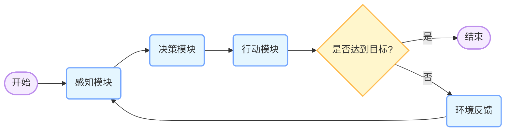

# AI Agent在金融行业的创新应用

> 关键词：AI Agent、金融行业、创新应用、人工智能、自动化决策、风险管理、客户服务

> 摘要：本文聚焦于AI Agent在金融行业的创新应用。首先介绍了相关背景，包括目的、预期读者等内容。接着阐述了AI Agent的核心概念与联系，详细讲解其原理和架构。在算法原理方面，通过Python代码进行了具体说明。还给出了相关数学模型和公式，并举例解释。项目实战部分展示了代码实际案例及详细解读。探讨了AI Agent在金融行业的实际应用场景，推荐了学习资源、开发工具框架以及相关论文著作。最后总结了未来发展趋势与挑战，提供常见问题解答和扩展阅读参考资料，旨在全面展现AI Agent在金融行业的应用现状与潜力，为相关从业者和研究者提供有价值的参考。

## 1. 背景介绍 
### 1.1 目的和范围
本文章的目的在于深入探讨AI Agent在金融行业的创新应用，全面剖析其在金融领域各个环节的应用原理、实际效果以及未来发展方向。范围涵盖了AI Agent在金融行业从基础概念到具体实践的各个方面，包括但不限于客户服务、风险管理、投资决策、金融监管等多个核心业务领域。通过对这些应用的研究，旨在为金融机构和相关从业者提供可借鉴的经验和思路，促进金融行业的智能化升级。

### 1.2 预期读者
预期读者主要包括金融行业的从业者，如银行职员、投资顾问、风险管理人员等，他们可以从文章中获取AI Agent在实际业务中的应用方法和案例，以提升工作效率和服务质量。同时，人工智能领域的研究者和开发者也可从文中了解金融行业的需求和应用场景，为进一步的技术创新提供方向。此外，对金融科技感兴趣的学生和爱好者也能通过本文对AI Agent在金融行业的应用有一个全面的认识。

### 1.3 文档结构概述
本文首先介绍背景信息，让读者了解文章的目的、预期读者和整体结构。接着阐述AI Agent的核心概念与联系，包括其原理和架构，通过文本示意图和Mermaid流程图进行直观展示。然后详细讲解核心算法原理，使用Python源代码进行说明，并给出具体操作步骤。之后介绍相关的数学模型和公式，结合举例进行深入讲解。项目实战部分展示代码实际案例，包括开发环境搭建、源代码实现和代码解读。再探讨AI Agent在金融行业的实际应用场景。随后推荐相关的学习资源、开发工具框架和论文著作。最后总结未来发展趋势与挑战，提供常见问题解答和扩展阅读参考资料。

### 1.4 术语表
#### 1.4.1 核心术语定义
- **AI Agent（人工智能智能体）**：是一种能够感知环境、根据内部状态和目标进行决策，并采取行动以实现目标的人工智能实体。它可以自主地与环境进行交互，不断学习和适应环境的变化。
- **金融行业**：指经营金融商品的特殊行业，包括银行业、证券业、保险业、信托业、基金业等。
- **自动化决策**：利用计算机系统和算法，根据预设的规则和数据，自动做出决策的过程。
- **风险管理**：对金融机构面临的各种风险进行识别、评估、控制和监测的过程。
- **客户服务**：金融机构为客户提供的各种服务，包括咨询、投诉处理、业务办理等。

#### 1.4.2 相关概念解释
- **人工智能**：是一门研究如何使计算机能够模拟人类智能的学科，包括机器学习、自然语言处理、计算机视觉等多个领域。
- **机器学习**：是人工智能的一个重要分支，通过让计算机从数据中学习模式和规律，从而实现预测和决策的能力。
- **深度学习**：是机器学习的一种特殊形式，通过构建多层神经网络来学习数据的深层特征，在图像识别、语音识别等领域取得了显著的成果。

#### 1.4.3 缩略词列表
- **AI**：Artificial Intelligence（人工智能）
- **ML**：Machine Learning（机器学习）
- **DL**：Deep Learning（深度学习）

## 2. 核心概念与联系 
### 2.1 AI Agent的原理
AI Agent的核心原理基于感知 - 决策 - 行动的循环过程。它首先通过各种传感器感知环境信息，例如在金融行业中，可能会感知市场数据、客户信息等。然后，根据内部的状态和预设的目标，利用算法和模型进行决策。最后，根据决策结果采取相应的行动，如执行交易、提供客户服务建议等。这个循环过程不断重复，使AI Agent能够不断适应环境的变化，实现目标的优化。

### 2.2 AI Agent的架构
AI Agent的架构通常包括感知模块、决策模块和行动模块。感知模块负责收集环境信息，例如通过网络爬虫获取市场新闻、通过数据接口获取金融数据等。决策模块是AI Agent的核心，它根据感知到的信息和内部的知识进行推理和决策。行动模块则根据决策结果执行相应的操作，如发送消息、执行交易指令等。此外，AI Agent还可能包括学习模块，用于不断更新内部的知识和模型，以提高决策的准确性和适应性。

### 2.3 文本示意图
AI Agent在金融行业的应用架构可以用以下文本描述：金融数据和客户信息作为输入，经过感知模块收集和预处理。然后将处理后的数据传递给决策模块，决策模块利用机器学习模型和规则引擎进行分析和决策。决策结果发送到行动模块，行动模块执行相应的操作，如客户服务响应、投资决策执行等。同时，行动的结果和环境的反馈信息又会作为新的输入进入感知模块，形成一个闭环的反馈系统。

### 2.4 Mermaid流程图


## 3. 核心算法原理 & 具体操作步骤 
### 3.1 核心算法原理
在AI Agent的决策过程中，常用的算法包括机器学习算法和强化学习算法。以机器学习中的决策树算法为例，决策树是一种基于树结构进行决策的算法。它通过对输入数据的特征进行划分，构建一个树状结构，每个内部节点表示一个特征上的测试，每个分支表示一个测试输出，每个叶节点表示一个类别或值。在金融行业中，决策树可以用于客户信用评估、风险分类等任务。

### 3.2 Python源代码实现
以下是一个使用Python实现简单决策树算法的示例代码：
```python
import numpy as np
from sklearn.datasets import load_iris
from sklearn.model_selection import train_test_split
from sklearn.tree import DecisionTreeClassifier
from sklearn.metrics import accuracy_score

# 加载数据集
iris = load_iris()
X = iris.data
y = iris.target

# 划分训练集和测试集
X_train, X_test, y_train, y_test = train_test_split(X, y, test_size=0.3, random_state=42)

# 创建决策树分类器
clf = DecisionTreeClassifier()

# 训练模型
clf.fit(X_train, y_train)

# 预测
y_pred = clf.predict(X_test)

# 计算准确率
accuracy = accuracy_score(y_test, y_pred)
print(f"Accuracy: {accuracy}")
```
### 3.3 具体操作步骤
1. **数据准备**：收集和整理相关的金融数据，例如客户的信用信息、市场交易数据等。对数据进行预处理，包括数据清洗、特征提取和特征选择等操作。
2. **模型选择**：根据具体的任务需求选择合适的算法和模型，如决策树、神经网络、支持向量机等。
3. **模型训练**：将准备好的数据划分为训练集和测试集，使用训练集对模型进行训练。在训练过程中，调整模型的参数以优化性能。
4. **模型评估**：使用测试集对训练好的模型进行评估，计算评估指标，如准确率、召回率、F1值等。根据评估结果对模型进行调整和优化。
5. **部署和应用**：将训练好的模型部署到实际的生产环境中，让AI Agent利用模型进行决策和行动。同时，不断收集新的数据，对模型进行更新和优化。

## 4. 数学模型和公式 & 详细讲解 & 举例说明 
### 4.1 决策树的数学模型
决策树的构建过程基于信息论中的熵和信息增益的概念。熵是衡量数据不确定性的指标，对于一个分类问题，设数据集 $D$ 中包含 $n$ 个类别，第 $i$ 个类别的样本数为 $n_i$，则数据集 $D$ 的熵定义为：
$$H(D)=-\sum_{i=1}^{n}\frac{n_i}{|D|}\log_2\frac{n_i}{|D|}$$
其中，$|D|$ 表示数据集 $D$ 的样本总数。

信息增益是指在划分数据集前后熵的减少量，用于衡量某个特征对分类的重要性。设特征 $A$ 有 $v$ 个不同的取值，将数据集 $D$ 按照特征 $A$ 进行划分得到 $v$ 个子集 $D_1,D_2,\cdots,D_v$，则特征 $A$ 对数据集 $D$ 的信息增益定义为：
$$Gain(D,A)=H(D)-\sum_{v=1}^{V}\frac{|D_v|}{|D|}H(D_v)$$

### 4.2 详细讲解
熵的概念可以理解为数据集的混乱程度，熵值越大，数据集的不确定性越高。信息增益则表示通过某个特征进行划分后，数据集的不确定性减少的程度。在决策树的构建过程中，选择信息增益最大的特征作为当前节点的划分特征，这样可以使得决策树的每个节点都尽可能地减少数据集的不确定性，从而提高分类的准确性。

### 4.3 举例说明
假设有一个数据集 $D$ 包含 10 个样本，其中 6 个属于类别 $C_1$，4 个属于类别 $C_2$。则数据集 $D$ 的熵为：
$$H(D)=-\frac{6}{10}\log_2\frac{6}{10}-\frac{4}{10}\log_2\frac{4}{10}\approx 0.971$$
假设存在一个特征 $A$，将数据集 $D$ 按照特征 $A$ 进行划分后得到两个子集 $D_1$ 和 $D_2$，其中 $D_1$ 包含 4 个样本，3 个属于类别 $C_1$，1 个属于类别 $C_2$；$D_2$ 包含 6 个样本，3 个属于类别 $C_1$，3 个属于类别 $C_2$。则子集 $D_1$ 和 $D_2$ 的熵分别为：
$$H(D_1)=-\frac{3}{4}\log_2\frac{3}{4}-\frac{1}{4}\log_2\frac{1}{4}\approx 0.811$$
$$H(D_2)=-\frac{3}{6}\log_2\frac{3}{6}-\frac{3}{6}\log_2\frac{3}{6}= 1$$
特征 $A$ 对数据集 $D$ 的信息增益为：
$$Gain(D,A)=0.971 - (\frac{4}{10}\times0.811+\frac{6}{10}\times1)\approx 0.046$$

## 5. 项目实战：代码实际案例和详细解释说明 
### 5.1 开发环境搭建
1. **安装Python**：从Python官方网站（https://www.python.org/downloads/）下载并安装Python 3.x版本。
2. **安装必要的库**：使用pip命令安装以下库：
```bash
pip install numpy pandas scikit-learn matplotlib
```
3. **选择开发工具**：可以选择使用Jupyter Notebook、PyCharm等开发工具。

### 5.2 源代码详细实现和代码解读
以下是一个使用AI Agent进行客户信用评估的项目实战代码示例：
```python
import pandas as pd
from sklearn.model_selection import train_test_split
from sklearn.linear_model import LogisticRegression
from sklearn.metrics import accuracy_score, confusion_matrix

# 加载数据集
data = pd.read_csv('credit_data.csv')

# 数据预处理
X = data.drop('credit_rating', axis=1)
y = data['credit_rating']

# 划分训练集和测试集
X_train, X_test, y_train, y_test = train_test_split(X, y, test_size=0.2, random_state=42)

# 创建逻辑回归模型
model = LogisticRegression()

# 训练模型
model.fit(X_train, y_train)

# 预测
y_pred = model.predict(X_test)

# 计算准确率
accuracy = accuracy_score(y_test, y_pred)
print(f"Accuracy: {accuracy}")

# 打印混淆矩阵
conf_matrix = confusion_matrix(y_test, y_pred)
print(f"Confusion Matrix:\n{conf_matrix}")
```
### 5.3 代码解读与分析
1. **数据加载**：使用`pandas`库的`read_csv`函数加载客户信用评估数据集。
2. **数据预处理**：将特征数据和标签数据分离，`X`表示特征数据，`y`表示标签数据。
3. **数据集划分**：使用`train_test_split`函数将数据集划分为训练集和测试集，测试集占比为20%。
4. **模型创建**：创建一个逻辑回归模型，逻辑回归是一种常用的分类算法，适用于二分类和多分类问题。
5. **模型训练**：使用训练集对模型进行训练，通过`fit`方法学习数据的模式和规律。
6. **模型预测**：使用测试集对训练好的模型进行预测，得到预测结果。
7. **模型评估**：使用`accuracy_score`函数计算模型的准确率，使用`confusion_matrix`函数打印混淆矩阵，混淆矩阵可以直观地展示模型的分类结果。

## 6. 实际应用场景 
### 6.1 客户服务
AI Agent可以在金融行业的客户服务中发挥重要作用。它可以通过自然语言处理技术与客户进行交互，解答客户的咨询、处理客户的投诉等。例如，当客户咨询理财产品的信息时，AI Agent可以根据客户的需求和风险偏好，推荐合适的产品。同时，AI Agent还可以24小时不间断地提供服务，提高客户服务的效率和质量。

### 6.2 风险管理
在风险管理方面，AI Agent可以实时监测市场数据和客户信息，识别潜在的风险。例如，通过对客户的信用数据进行分析，预测客户的违约风险。同时，AI Agent可以根据风险评估结果，自动调整投资组合，降低风险。在金融市场出现异常波动时，AI Agent可以及时发出警报，提醒金融机构采取相应的措施。

### 6.3 投资决策
AI Agent可以利用大数据和机器学习算法，对市场趋势进行分析和预测，为投资决策提供支持。例如，通过对历史数据的学习，预测股票价格的走势、债券收益率的变化等。同时，AI Agent可以根据投资者的风险偏好和投资目标，生成个性化的投资策略。在投资过程中，AI Agent可以实时监测投资组合的表现，及时调整投资策略，以实现投资收益的最大化。

### 6.4 金融监管
AI Agent可以协助金融监管机构进行监管工作。它可以对金融机构的交易数据进行实时监测，识别异常交易行为。例如，通过对大额资金流动的分析，发现洗钱、内幕交易等违法行为。同时，AI Agent可以对金融机构的合规情况进行评估，提高监管的效率和准确性。

## 7. 工具和资源推荐
### 7.1 学习资源推荐
#### 7.1.1 书籍推荐
- 《机器学习》（周志华著）：全面介绍了机器学习的基本概念、算法和应用，是机器学习领域的经典教材。
- 《深度学习》（Ian Goodfellow、Yoshua Bengio和Aaron Courville著）：详细讲解了深度学习的原理和技术，适合对深度学习感兴趣的读者。
- 《Python数据分析实战》（Sebastian Raschka著）：介绍了使用Python进行数据分析的方法和技巧，对于金融数据分析有很大的帮助。

#### 7.1.2 在线课程
- Coursera上的“机器学习”课程（Andrew Ng教授主讲）：是一门非常经典的机器学习入门课程，讲解深入浅出，适合初学者。
- edX上的“深度学习”课程（由不同的知名教授主讲）：提供了深度学习的系统学习资源。
- 中国大学MOOC上的“金融科技”课程：介绍了金融科技的发展和应用，包括AI Agent在金融行业的应用。

#### 7.1.3 技术博客和网站
- Medium：有很多关于人工智能和金融科技的优秀博客文章，作者来自不同的领域，可以获取最新的技术动态和研究成果。
- arXiv：是一个预印本平台，提供了大量的学术论文，包括人工智能和金融领域的研究论文。
- 机器之心：专注于人工智能领域的资讯和技术分享，有很多关于AI Agent的应用案例和技术分析。

### 7.2 开发工具框架推荐
#### 7.2.1 IDE和编辑器
- PyCharm：是一款专门为Python开发设计的集成开发环境，功能强大，提供了代码编辑、调试、