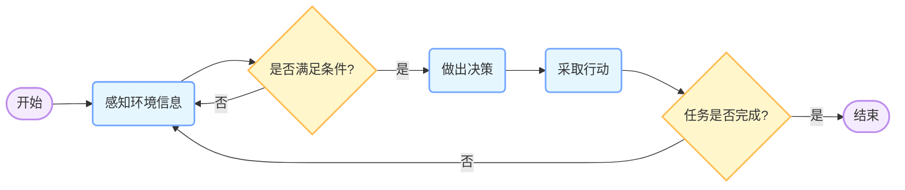

# AI Agent在金融行业的应用与挑战

> 关键词：AI Agent、金融行业、应用场景、技术原理、挑战与趋势

> 摘要：本文深入探讨了AI Agent在金融行业的应用与挑战。首先介绍了相关背景知识，包括目的范围、预期读者等内容。接着阐述了AI Agent的核心概念、联系以及其算法原理和具体操作步骤，通过Python代码进行详细说明。同时给出了数学模型和公式，并结合实际例子讲解。在项目实战部分，提供了开发环境搭建、源代码实现与解读。分析了AI Agent在金融行业的实际应用场景，推荐了学习资源、开发工具框架和相关论文著作。最后总结了未来发展趋势与挑战，并对常见问题进行了解答，为金融行业应用AI Agent提供了全面而深入的参考。

## 1. 背景介绍 
### 1.1 目的和范围
随着人工智能技术的飞速发展，AI Agent逐渐成为各行业关注的焦点。在金融行业，其应用不仅能够提高运营效率、降低成本，还能为客户提供更优质的服务。本文旨在全面探讨AI Agent在金融行业的应用场景、技术原理、面临的挑战以及未来发展趋势。范围涵盖了AI Agent在金融行业各个细分领域的应用，包括但不限于银行、证券、保险等。

### 1.2 预期读者
本文预期读者主要包括金融行业的从业者，如银行家、投资经理、保险代理人等，他们可以通过本文了解如何利用AI Agent提升业务效率和服务质量。同时，人工智能领域的研究者和开发者也可以从中获取关于AI Agent在金融场景下的具体应用需求和技术挑战。此外，对金融科技感兴趣的学生和爱好者也能通过本文获得相关的基础知识和前沿信息。

### 1.3 文档结构概述
本文共分为十个部分。第一部分为背景介绍，阐述了文章的目的、范围、预期读者和文档结构。第二部分介绍AI Agent的核心概念与联系，包括其原理和架构。第三部分讲解核心算法原理和具体操作步骤，并给出Python代码示例。第四部分给出数学模型和公式，并进行详细讲解和举例说明。第五部分是项目实战，包括开发环境搭建、源代码实现和代码解读。第六部分分析AI Agent在金融行业的实际应用场景。第七部分推荐学习资源、开发工具框架和相关论文著作。第八部分总结未来发展趋势与挑战。第九部分是附录，解答常见问题。第十部分提供扩展阅读和参考资料。

### 1.4 术语表
#### 1.4.1 核心术语定义
- **AI Agent（人工智能代理）**：是一种能够感知环境、自主决策并采取行动以实现特定目标的软件实体。它可以根据预设的规则或通过学习不断优化自己的行为。
- **金融行业**：指经营金融商品的特殊行业，包括银行业、证券业、保险业、信托业、基金业等。
- **机器学习**：是一门多领域交叉学科，涉及概率论、统计学、逼近论、凸分析、算法复杂度理论等多门学科。它专门研究计算机怎样模拟或实现人类的学习行为，以获取新的知识或技能，重新组织已有的知识结构使之不断改善自身的性能。
- **自然语言处理**：是计算机科学领域与人工智能领域中的一个重要方向。它研究能实现人与计算机之间用自然语言进行有效通信的各种理论和方法。

#### 1.4.2 相关概念解释
- **强化学习**：是机器学习中的一个领域，强调智能体（agent）如何在环境中采取一系列行动，以最大化累积奖励。在强化学习中，智能体通过与环境进行交互，根据环境反馈的奖励信号来学习最优策略。
- **深度学习**：是机器学习的一个分支领域，它是一种基于对数据进行表征学习的方法。深度学习通过构建具有很多层的神经网络模型，自动从大量数据中学习特征和模式。
- **知识图谱**：是一种语义网络，它以实体为节点，以关系为边，将各种信息连接起来，形成一个大规模的知识网络。知识图谱可以用于知识表示、推理和问答系统等。

#### 1.4.3 缩略词列表
- **AI**：Artificial Intelligence，人工智能
- **ML**：Machine Learning，机器学习
- **NLP**：Natural Language Processing，自然语言处理
- **RL**：Reinforcement Learning，强化学习
- **DL**：Deep Learning，深度学习

## 2. 核心概念与联系 

### 2.1 AI Agent的定义与原理
AI Agent可以被看作是一个具有自主性、反应性、社会性和主动性的实体。自主性意味着它能够在没有人类干预的情况下独立完成任务；反应性表示它能够感知环境的变化并及时做出响应；社会性指它可以与其他Agent或人类进行交互；主动性则体现为它能够主动地采取行动以实现目标。

其基本原理是通过感知模块获取环境信息，然后利用决策模块根据预设的规则或学习到的模型进行决策，最后通过执行模块采取相应的行动。例如，在金融交易场景中，AI Agent可以感知市场行情的变化，根据预设的交易策略或通过机器学习模型预测市场走势，然后决定是否进行交易。

### 2.2 AI Agent与金融行业的联系
在金融行业，AI Agent可以应用于多个方面。在客户服务领域，它可以作为智能客服，通过自然语言处理技术与客户进行交互，解答客户的问题，提供个性化的服务建议。在风险管理方面，AI Agent可以实时监测市场风险、信用风险等，通过分析大量的数据及时发现潜在的风险并发出预警。在投资决策中，AI Agent可以根据市场数据和投资者的风险偏好，制定最优的投资组合。

### 2.3 核心概念原理和架构的文本示意图
```plaintext
+-------------------+
|    环境 (金融市场) |
+-------------------+
        | 感知
+-------------------+
|   AI Agent        |
| +---------------+ |
| | 感知模块      | |
| +---------------+ |
| | 决策模块      | |
| +---------------+ |
| | 执行模块      | |
| +---------------+ |
+-------------------+
        | 行动
+-------------------+
|    环境 (金融市场) |
+-------------------+
```

### 2.4 Mermaid流程图


## 3. 核心算法原理 & 具体操作步骤 

### 3.1 强化学习算法原理
强化学习是AI Agent常用的算法之一，其核心思想是智能体通过与环境进行交互，根据环境反馈的奖励信号来学习最优策略。在强化学习中，有几个重要的概念：
- **状态（State）**：表示环境在某一时刻的特征，例如在金融交易中，市场行情、资产价格等都可以作为状态。
- **动作（Action）**：智能体在某一状态下可以采取的行为，如买入、卖出、持有等。
- **奖励（Reward）**：环境对智能体采取的动作的反馈，用于评估动作的好坏。例如，在金融交易中，盈利可以作为正奖励，亏损则作为负奖励。

强化学习的目标是找到一个最优策略 $\pi^*$，使得智能体在长期内获得的累积奖励最大。常用的强化学习算法有Q - learning、Deep Q - Network（DQN）等。

### 3.2 Q - learning算法原理
Q - learning是一种无模型的强化学习算法，它通过维护一个Q表来记录每个状态 - 动作对的价值。Q表中的每个元素 $Q(s, a)$ 表示在状态 $s$ 下采取动作 $a$ 所能获得的最大累积奖励。

Q - learning的更新公式为：
$$Q(s_t, a_t) \leftarrow Q(s_t, a_t) + \alpha [r_{t+1} + \gamma \max_{a} Q(s_{t+1}, a) - Q(s_t, a_t)]$$
其中，$s_t$ 是当前状态，$a_t$ 是当前动作，$r_{t+1}$ 是采取动作 $a_t$ 后获得的即时奖励，$s_{t+1}$ 是下一个状态，$\alpha$ 是学习率，$\gamma$ 是折扣因子。

### 3.3 Python代码实现Q - learning算法
```python
import numpy as np

# 定义环境参数
num_states = 5
num_actions = 2
gamma = 0.9
alpha = 0.1
episodes = 100

# 初始化Q表
Q = np.zeros((num_states, num_actions))

# 定义环境的转移函数和奖励函数
def env_step(state, action):
    if action == 0:
        next_state = max(state - 1, 0)
    else:
        next_state = min(state + 1, num_states - 1)
    
    if next_state == num_states - 1:
        reward = 1
    else:
        reward = 0
    
    return next_state, reward

# Q - learning算法主循环
for episode in range(episodes):
    state = 0
    done = False
    
    while not done:
        # 选择动作（使用贪心策略）
        if np.random.uniform(0, 1) < 0.1:
            action = np.random.choice(num_actions)
        else:
            action = np.argmax(Q[state, :])
        
        # 执行动作，获取下一个状态和奖励
        next_state, reward = env_step(state, action)
        
        # 更新Q表
        Q[state, action] = Q[state, action] + alpha * (reward + gamma * np.max(Q[next_state, :]) - Q[state, action])
        
        state = next_state
        
        if state == num_states - 1:
            done = True

print("最终的Q表：")
print(Q)
```

### 3.4 具体操作步骤
1. **初始化**：初始化Q表为全零矩阵，设置学习率 $\alpha$、折扣因子 $\gamma$ 和训练的回合数。
2. **选择动作**：在每个状态下，根据贪心策略选择动作。以一定的概率（如0.1）随机选择动作，以探索新的状态 - 动作对；否则选择Q表中当前状态下价值最大的动作。
3. **执行动作**：执行选择的动作，与环境进行交互，获取下一个状态和即时奖励。
4. **更新Q表**：根据Q - learning的更新公式更新Q表。
5. **终止条件**：当达到终止状态或完成预设的回合数时，训练结束。

## 4. 数学模型和公式 & 详细讲解 & 举例说明 

### 4.1 马尔可夫决策过程（MDP）
马尔可夫决策过程是强化学习的数学基础，它由一个四元组 $(S, A, P, R)$ 表示：
- $S$ 是有限的状态集合。
- $A$ 是有限的动作集合。
- $P(s_{t+1} | s_t, a_t)$ 是状态转移概率，表示在状态 $s_t$ 下采取动作 $a_t$ 后转移到状态 $s_{t+1}$ 的概率。
- $R(s_t, a_t, s_{t+1})$ 是奖励函数，表示在状态 $s_t$ 下采取动作 $a_t$ 转移到状态 $s_{t+1}$ 时获得的奖励。

### 4.2 价值函数
价值函数用于评估状态或状态 - 动作对的好坏。主要有状态价值函数 $V(s)$ 和动作价值函数 $Q(s, a)$。

#### 4.2.1 状态价值函数
状态价值函数 $V^{\pi}(s)$ 表示在策略 $\pi$ 下，从状态 $s$ 开始所能获得的期望累积奖励：
$$V^{\pi}(s) = \mathbb{E}_{\pi} \left[ \sum_{t=0}^{\infty} \gamma^t r_{t+1} | s_0 = s \right]$$
其中，$\gamma$ 是折扣因子，用于权衡即时奖励和未来奖励的重要性。

#### 4.2.2 动作价值函数
动作价值函数 $Q^{\pi}(s, a)$ 表示在策略 $\pi$ 下，从状态 $s$ 采取动作 $a$ 后所能获得的期望累积奖励：
$$Q^{\pi}(s, a) = \mathbb{E}_{\pi} \left[ \sum_{t=0}^{\infty} \gamma^t r_{t+1} | s_0 = s, a_0 = a \right]$$

### 4.3 贝尔曼方程
贝尔曼方程是价值函数的递归表达式，它将当前状态的价值与下一个状态的价值联系起来。

#### 4.3.1 状态价值函数的贝尔曼方程
$$V^{\pi}(s) = \sum_{a \in A} \pi(a|s) \sum_{s' \in S} P(s' | s, a) [R(s, a, s') + \gamma V^{\pi}(s')]$$

#### 4.3.2 动作价值函数的贝尔曼方程
$$Q^{\pi}(s, a) = \sum_{s' \in S} P(s' | s, a) [R(s, a, s') + \gamma \sum_{a' \in A} \pi(a'|s') Q^{\pi}(s', a')]$$

### 4.4 举例说明
假设一个简单的金融交易场景，状态 $S = \{s_1, s_2, s_3\}$ 表示市场的三种不同行情，动作 $A = \{买入, 卖出\}$。状态转移概率和奖励函数如下：

| 当前状态 $s$ | 动作 $a$ | 下一个状态 $s'$ | 转移概率 $P(s' | s, a)$ | 奖励 $R(s, a, s')$ |
| --- | --- | --- | --- | --- |
| $s_1$ | 买入 | $s_2$ | 0.6 | 1 |
| $s_1$ | 买入 | $s_3$ | 0.4 | -1 |
| $s_1$ | 卖出 | $s_1$ | 1 | 0 |
| $\cdots$ | $\cdots$ | $\cdots$ | $\cdots$ | $\cdots$ |

假设折扣因子 $\gamma = 0.9$，策略 $\pi$ 是随机选择动作（即每种动作的概率为0.5）。我们可以使用贝尔曼方程计算状态 $s_1$ 的价值：

首先计算动作价值函数：
- $Q^{\pi}(s_1, 买入) = 0.6 \times (1 + 0.9 \times V^{\pi}(s_2)) + 0.4 \times (-1 + 0.9 \times V^{\pi}(s_3))$
- $Q^{\pi}(s_1, 卖出) = 1 \times (0 + 0.9 \times V^{\pi}(s_1))$

然后计算状态价值函数：
$$V^{\pi}(s_1) = 0.5 \times Q^{\pi}(s_1, 买入) + 0.5 \times Q^{\pi}(s_1, 卖出)$$

通过迭代求解贝尔曼方程，我们可以得到每个状态的价值和最优策略。

## 5. 项目实战：代码实际案例和详细解释说明 

### 5.1 开发环境搭建
#### 5.1.1 安装Python
首先，确保你已经安装了Python 3.x版本。可以从Python官方网站（https://www.python.org/downloads/） 下载并安装适合你操作系统的Python版本。

#### 5.1.2 安装必要的库
使用以下命令安装所需的库：
```sh
pip install numpy pandas matplotlib scikit-learn
```
- `numpy`：用于数值计算。
- `pandas`：用于数据处理和分析。
- `matplotlib`：用于数据可视化。
- `scikit-learn`：用于机器学习算法的实现。

### 5.2 源代码详细实现和代码解读
#### 5.2.1 数据准备
假设我们要构建一个简单的股票交易AI Agent，首先需要准备股票数据。以下是一个使用`pandas`读取股票数据的示例：
```python
import pandas as pd

# 读取股票数据
data = pd.read_csv('stock_data.csv')

# 提取特征和标签
features = data[['Open', 'High', 'Low', 'Close', 'Volume']]
labels = data['Next_Day_Change']
```

#### 5.2.2 构建AI Agent模型
我们使用一个简单的决策树分类器作为AI Agent的决策模型：
```python
from sklearn.tree import DecisionTreeClassifier
from sklearn.model_selection import train_test_split
from sklearn.metrics import accuracy_score

# 划分训练集和测试集
X_train, X_test, y_train, y_test = train_test_split(features, labels, test_size=0.2, random_state=42)

# 创建决策树分类器
model = DecisionTreeClassifier()

# 训练模型
model.fit(X_train, y_train)

# 预测
y_pred = model.predict(X_test)

# 计算准确率
accuracy = accuracy_score(y_test, y_pred)
print(f"模型准确率: {accuracy}")
```

#### 5.2.3 交易策略实现
根据模型的预测结果，我们可以实现一个简单的交易策略：
```python
# 模拟交易
capital = 10000
shares = 0

for i in range(len(data)):
    if i < len(X_train):
        continue
    
    current_price = data['Close'][i]
    prediction = model.predict([features.iloc[i]])
    
    if prediction == 1 and shares == 0:
        # 买入
        shares = capital / current_price
        capital = 0
    elif prediction == -1 and shares > 0:
        # 卖出
        capital = shares * current_price
        shares = 0

# 计算最终资产
final_capital = capital + shares * data['Close'].iloc[-1]
print(f"最终资产: {final_capital}")
```

### 5.3 代码解读与分析
#### 5.3.1 数据准备部分
- 使用`pandas`的`read_csv`函数读取股票数据文件。
- 提取特征（如开盘价、最高价、最低价、收盘价和成交量）和标签（如次日价格变化）。

#### 5.3.2 模型构建部分
- 使用`train_test_split`函数将数据划分为训练集和测试集。
- 创建一个决策树分类器并使用训练集进行训练。
- 使用测试集进行预测，并计算模型的准确率。

#### 5.3.3 交易策略部分
- 初始化初始资金和持股数量。
- 遍历数据，根据模型的预测结果进行买入或卖出操作。
- 计算最终资产，评估交易策略的效果。

需要注意的是，这个示例只是一个简单的演示，实际的股票交易AI Agent需要考虑更多的因素，如交易成本、风险控制等。

## 6. 实际应用场景 
### 6.1 客户服务
#### 6.1.1 智能客服
AI Agent可以作为智能客服，通过自然语言处理技术与客户进行交互。它可以实时解答客户的常见问题，如账户查询、业务办理流程等。例如，客户询问“如何办理信用卡挂失”，AI Agent可以快速提供详细的办理步骤和所需材料。

#### 6.1.2 个性化服务推荐
AI Agent可以根据客户的历史交易记录、资产状况、风险偏好等信息，为客户提供个性化的金融产品推荐。例如，对于风险偏好较高的客户，推荐股票型基金；对于风险偏好较低的客户，推荐债券型基金。

### 6.2 风险管理
#### 6.2.1 信用风险评估
AI Agent可以通过分析客户的信用历史、收入状况、负债情况等多源数据，评估客户的信用风险。例如，在贷款审批过程中，AI Agent可以快速判断客户的违约概率，帮助银行做出更准确的决策。

#### 6.2.2 市场风险监测
AI Agent可以实时监测市场行情的变化，分析各种市场因素对金融资产的影响。例如，当股票市场出现大幅波动时，AI Agent可以及时发出预警，提醒投资者调整投资组合。

### 6.3 投资决策
#### 6.3.1 投资组合优化
AI Agent可以根据市场数据和投资者的风险偏好，构建最优的投资组合。它可以考虑多种资产的风险 - 收益特征，通过优化算法找到使投资组合风险最小化或收益最大化的资产配置方案。

#### 6.3.2 量化交易
AI Agent可以实现量化交易策略，根据预设的交易规则和算法自动进行交易。例如，当股票价格突破某个阈值时，AI Agent可以自动买入或卖出股票。

### 6.4 保险业务
#### 6.4.1 保险产品定价
AI Agent可以分析大量的保险理赔数据、客户健康信息、风险因素等，为保险产品制定合理的价格。例如，对于健康保险，AI Agent可以根据客户的年龄、性别、病史等因素，计算出不同客户的保险费率。

#### 6.4.2 理赔处理
AI Agent可以自动化处理保险理赔流程。它可以快速审核理赔申请，通过图像识别、自然语言处理等技术验证理赔材料的真实性和完整性，提高理赔处理效率。

## 7. 工具和资源推荐
### 7.1 学习资源推荐
#### 7.1.1 书籍推荐
- 《人工智能：一种现代的方法》：这本书是人工智能领域的经典教材，全面介绍了人工智能的各个方面，包括搜索算法、知识表示、机器学习、自然语言处理等。
- 《强化学习：原理与Python实现》：详细介绍了强化学习的基本原理和算法，并提供了Python代码实现，适合初学者学习。
- 《深度学习》：由深度学习领域的三位先驱Ian Goodfellow、Yoshua Bengio和Aaron Courville撰写，是深度学习领域的权威著作。

#### 7.1.2 在线课程
- Coursera上的“机器学习”课程：由斯坦福大学教授Andrew Ng主讲，是机器学习领域的经典课程，涵盖了机器学习的基本概念、算法和应用。
- edX上的“强化学习基础”课程：由UC Berkeley的Pieter Abbeel教授主讲，深入介绍了强化学习的原理和算法。
- Kaggle上的机器学习和深度学习微课程：提供了实践导向的学习内容，通过实际案例帮助学习者掌握机器学习和深度学习的技能。

#### 7.1.3 技术博客和网站
- Medium：上面有很多人工智能领域的优秀博客文章，涵盖了最新的研究成果、技术应用和实践经验。
- Towards Data Science：专注于数据科学和人工智能领域的知识分享，提供了大量的技术文章和案例分析。
- AI社区：如OpenAI、Hugging Face等社区，提供了丰富的开源模型、工具和文档，是学习和交流的好平台。

### 7.2 开发工具框架推荐
#### 7.2.1 IDE和编辑器
- PyCharm：是一款专业的Python集成开发环境，提供了代码编辑、调试、版本控制等功能，适合Python开发。
- Jupyter Notebook：是一个交互式的开发环境，支持多种编程语言，特别适合数据探索、模型训练和可视化。
- Visual Studio Code：是一款轻量级的代码编辑器，支持多种编程语言和插件，具有丰富的扩展功能。

#### 7.2.2 调试和性能分析工具
- TensorBoard：是TensorFlow提供的可视化工具，可以用于监控模型的训练过程、可视化模型结构和分析性能指标。
- Py-Spy：是一个用于Python代码性能分析的工具，可以帮助开发者找出代码中的性能瓶颈。
- cProfile：是Python标准库中的性能分析模块，可以统计函数的调用次数、执行时间等信息。

#### 7.2.3 相关框架和库
- TensorFlow：是Google开发的开源深度学习框架，提供了丰富的工具和库，支持各种深度学习模型的构建和训练。
- PyTorch：是Facebook开发的开源深度学习框架，具有动态图的特点，易于使用和调试，在学术界和工业界都有广泛的应用。
- Scikit-learn：是一个简单易用的机器学习库，提供了各种机器学习算法和工具，适合初学者和快速开发。

### 7.3 相关论文著作推荐
#### 7.3.1 经典论文
- “Q - learning”：由Chris Watkins和Peter Dayan于1992年发表，首次提出了Q - learning算法，是强化学习领域的经典论文。
- “Deep Residual Learning for Image Recognition”：由Kaiming He等人于2015年发表，提出了残差网络（ResNet），解决了深度学习中的梯度消失问题，在图像识别领域取得了巨大成功。
- “Attention Is All You Need”：由Google Brain团队于2017年发表，提出了Transformer模型，在自然语言处理领域引起了革命性的变化。

#### 7.3.2 最新研究成果
- 关注顶级学术会议如NeurIPS（神经信息处理系统大会）、ICML（国际机器学习会议）、ACL（计算语言学协会年会）等的论文，这些会议汇集了人工智能领域的最新研究成果。
- 一些知名的学术期刊如Journal of Artificial Intelligence Research（JAIR）、Artificial Intelligence等也会发表高质量的研究论文。

#### 7.3.3 应用案例分析
- 《金融科技：应用与创新》：介绍了金融科技在各个领域的应用案例，包括AI Agent在金融行业的应用实践。
- 一些金融机构的官方网站和研究报告也会分享他们在应用AI Agent方面的经验和成果。

## 8. 总结：未来发展趋势与挑战
### 8.1 未来发展趋势
#### 8.1.1 多模态融合
未来的AI Agent将融合多种模态的信息，如文本、图像、语音等。在金融行业，这意味着AI Agent可以同时处理客户的语音咨询、图像化的财务报表和文本形式的市场分析报告，提供更全面、准确的服务。

#### 8.1.2 与区块链技术结合
区块链技术具有去中心化、不可篡改、安全可靠等特点，与AI Agent结合可以提高金融交易的透明度和安全性。例如，在供应链金融中，AI Agent可以基于区块链上的交易数据进行风险评估和融资决策。

#### 8.1.3 强化学习与深度学习的融合
强化学习和深度学习的融合将使AI Agent具有更强的决策能力和学习能力。在金融投资领域，这种融合可以帮助AI Agent更好地应对复杂多变的市场环境，实现更优化的投资策略。

### 8.2 挑战
#### 8.2.1 数据隐私和安全
金融行业涉及大量的敏感客户数据，如个人身份信息、财务状况等。AI Agent在处理这些数据时，需要确保数据的隐私和安全，防止数据泄露和滥用。

#### 8.2.2 可解释性问题
AI Agent的决策过程往往是基于复杂的机器学习模型，其决策结果难以解释。在金融行业，这可能会导致监管难题和客户信任问题。因此，提高AI Agent的可解释性是一个重要的挑战。

#### 8.2.3 技术人才短缺
AI Agent的开发和应用需要具备人工智能、金融等多领域知识的复合型人才。目前，这类人才相对短缺，限制了AI Agent在金融行业的广泛应用。

## 9. 附录：常见问题与解答
### 9.1 AI Agent在金融行业的应用是否会取代人类金融从业者？
不会。虽然AI Agent可以在很多方面提高金融行业的效率和准确性，但人类金融从业者具有独特的优势，如人际交往能力、判断力、创造力等。AI Agent更像是人类的助手，帮助金融从业者更好地完成工作。

### 9.2 如何确保AI Agent在金融行业的决策是可靠的？
可以从以下几个方面确保AI Agent决策的可靠性：
- 使用高质量的数据进行模型训练，避免数据偏差。
- 对模型进行严格的评估和验证，确保其在不同场景下的性能稳定。
- 采用可解释的模型和算法，使决策过程透明化，便于人工监督和干预。

### 9.3 AI Agent在金融行业的应用需要哪些技术支持？
主要需要以下技术支持：
- 机器学习和深度学习技术，用于构建模型和算法。
- 自然语言处理技术，用于处理客户的文本和语音交互。
- 数据挖掘和分析技术，用于处理和分析大量的金融数据。
- 云计算和大数据技术，用于存储和处理大规模的数据。

## 10. 扩展阅读 & 参考资料
### 10.1 扩展阅读
- 《金融科技前沿：技术驱动的金融创新》：深入探讨了金融科技的前沿技术和应用，为进一步了解AI Agent在金融行业的应用提供了更广阔的视角。
- 《人工智能时代的金融风险管理》：介绍了人工智能技术在金融风险管理中的应用和挑战，对相关领域的研究有一定的参考价值。

### 10.2 参考资料
- Goodfellow, I., Bengio, Y., & Courville, A. (2016). Deep Learning. MIT Press.
- Sutton, R. S., & Barto, A. G. (2018). Reinforcement Learning: An Introduction. MIT Press.
- 相关金融机构的官方报告和研究论文。

作者：AI天才研究院/AI Genius Institute & 禅与计算机程序设计艺术 /Zen And The Art of Computer Programming