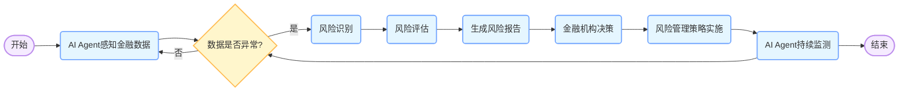

# AI Agent在金融风险分析中的应用

> 关键词：AI Agent、金融风险分析、风险评估、自动化决策、机器学习

> 摘要：本文聚焦于AI Agent在金融风险分析中的应用。首先介绍了研究的背景、目的、预期读者、文档结构和相关术语。接着阐述了AI Agent和金融风险分析的核心概念及其联系，通过Mermaid流程图展示其架构。详细讲解了核心算法原理，并用Python代码进行阐述，同时给出了相关数学模型和公式。通过项目实战，介绍了开发环境搭建、源代码实现与解读。探讨了AI Agent在金融风险分析中的实际应用场景，推荐了学习资源、开发工具框架和相关论文著作。最后总结了未来发展趋势与挑战，解答了常见问题并提供扩展阅读和参考资料。

## 1. 背景介绍 
### 1.1 目的和范围
金融行业面临着各种各样的风险，如信用风险、市场风险、操作风险等。准确、及时地识别和评估这些风险对于金融机构的稳健运营至关重要。AI Agent作为一种智能的自动化实体，能够模拟人类的决策过程，在金融风险分析中具有巨大的应用潜力。本文的目的是深入探讨AI Agent在金融风险分析中的应用，包括其核心概念、算法原理、实际应用场景等，范围涵盖了从理论到实践的多个方面。

### 1.2 预期读者
本文预期读者包括金融行业从业者，如风险分析师、投资经理、金融科技专家等，他们希望了解如何利用AI Agent提升金融风险分析的效率和准确性；计算机科学领域的研究人员和开发者，对AI Agent的应用和开发感兴趣；以及对金融科技和人工智能交叉领域有学习需求的学生和爱好者。

### 1.3 文档结构概述
本文将按照以下结构进行阐述：首先介绍相关背景和术语，然后详细讲解AI Agent和金融风险分析的核心概念及其联系，接着探讨核心算法原理和操作步骤，给出数学模型和公式，通过项目实战展示代码实现和解读，分析实际应用场景，推荐学习资源、开发工具框架和相关论文著作，最后总结未来发展趋势与挑战，解答常见问题并提供扩展阅读和参考资料。

### 1.4 术语表
#### 1.4.1 核心术语定义
- **AI Agent**：一种能够感知环境、根据感知信息进行决策并采取行动以实现特定目标的智能实体。它可以是软件程序、机器人等形式。
- **金融风险分析**：对金融领域中各种风险进行识别、评估和监测的过程，旨在帮助金融机构制定合理的风险管理策略。
- **信用风险**：借款人或交易对手未能履行合同义务而导致金融机构遭受损失的风险。
- **市场风险**：由于市场因素（如利率、汇率、股票价格等）的波动而导致金融资产价值变动的风险。
- **操作风险**：由于不完善或有问题的内部程序、人员和系统，或外部事件而导致的直接或间接损失的风险。

#### 1.4.2 相关概念解释
- **自动化决策**：AI Agent根据预设的规则或通过机器学习模型，自动对金融风险进行评估和决策，减少人工干预。
- **机器学习模型**：一种通过数据学习模式和规律的算法模型，如决策树、神经网络等，可用于预测金融风险。
- **数据挖掘**：从大量数据中发现有价值信息和知识的过程，在金融风险分析中可用于挖掘潜在的风险因素。

#### 1.4.3 缩略词列表
- **AI**：Artificial Intelligence（人工智能）
- **ML**：Machine Learning（机器学习）
- **DL**：Deep Learning（深度学习）
- **RNN**：Recurrent Neural Network（循环神经网络）
- **LSTM**：Long Short-Term Memory（长短期记忆网络）

## 2. 核心概念与联系 
### 2.1 AI Agent的核心概念
AI Agent是一个具有自主性、反应性、社会性和主动性的智能实体。自主性意味着它能够在没有人类干预的情况下独立完成任务；反应性使它能够感知环境的变化并及时做出响应；社会性表示它可以与其他Agent或人类进行交互；主动性则体现在它能够主动追求目标。

AI Agent的架构通常包括感知模块、决策模块和行动模块。感知模块负责收集环境信息，决策模块根据感知信息和预设的规则或学习到的模型进行决策，行动模块则根据决策结果采取相应的行动。

### 2.2 金融风险分析的核心概念
金融风险分析是一个复杂的过程，涉及到多个方面的信息和分析方法。主要包括风险识别、风险评估和风险监测。风险识别是指确定可能存在的风险因素；风险评估是对风险的大小和可能性进行量化分析；风险监测则是对风险的变化情况进行实时跟踪。

### 2.3 两者的联系
AI Agent可以在金融风险分析的各个环节发挥重要作用。在风险识别阶段，AI Agent可以通过感知模块收集各种金融数据，如市场数据、企业财务数据等，利用数据挖掘和机器学习技术发现潜在的风险因素。在风险评估阶段，AI Agent可以根据学习到的模型对风险进行量化评估，提供准确的风险评估结果。在风险监测阶段，AI Agent可以实时跟踪风险的变化情况，及时发出预警信号，为金融机构的决策提供支持。

### 2.4 文本示意图
```plaintext
+----------------+         +-------------------+         +----------------+
|  AI Agent      |         |  金融风险分析     |         |  金融机构      |
|                |         |                   |         |                |
|  感知模块      | -------> |  风险识别         | -------> |  决策支持      |
|  决策模块      | <------- |  风险评估         | <------- |  风险管理策略 |
|  行动模块      |         |  风险监测         |         |                |
+----------------+         +-------------------+         +----------------+
```

### 2.5 Mermaid流程图


## 3. 核心算法原理 & 具体操作步骤 
### 3.1 决策树算法原理
决策树是一种常用的机器学习算法，它通过构建树形结构来进行决策。决策树的每个内部节点代表一个属性上的测试，每个分支代表一个测试输出，每个叶节点代表一种类别或值。

在金融风险分析中，决策树可以用于根据各种金融数据（如借款人的收入、信用记录等）来判断是否存在信用风险。以下是一个简单的Python代码示例，使用`scikit-learn`库构建决策树模型：

```python
import numpy as np
from sklearn.datasets import load_iris
from sklearn.model_selection import train_test_split
from sklearn.tree import DecisionTreeClassifier
from sklearn.metrics import accuracy_score

# 加载示例数据集
iris = load_iris()
X = iris.data
y = iris.target

# 划分训练集和测试集
X_train, X_test, y_train, y_test = train_test_split(X, y, test_size=0.3, random_state=42)

# 创建决策树分类器
clf = DecisionTreeClassifier()

# 训练模型
clf.fit(X_train, y_train)

# 预测
y_pred = clf.predict(X_test)

# 计算准确率
accuracy = accuracy_score(y_test, y_pred)
print(f"Accuracy: {accuracy}")
```

### 3.2 具体操作步骤
1. **数据收集**：收集与金融风险相关的数据，如市场数据、企业财务数据、客户信用数据等。
2. **数据预处理**：对收集到的数据进行清洗、转换和归一化等处理，以提高数据的质量和可用性。
3. **特征选择**：从预处理后的数据中选择与金融风险相关的特征，减少数据的维度。
4. **模型训练**：使用选择好的特征和标记好的训练数据对AI Agent的决策模型进行训练。
5. **模型评估**：使用测试数据对训练好的模型进行评估，计算模型的准确率、召回率等指标。
6. **模型优化**：根据评估结果对模型进行优化，如调整模型的参数、更换算法等。
7. **部署和应用**：将优化后的模型部署到实际的金融风险分析系统中，让AI Agent自动进行风险分析和决策。

## 4. 数学模型和公式 & 详细讲解 & 举例说明 
### 4.1 逻辑回归模型
逻辑回归是一种常用的分类算法，用于预测一个事件发生的概率。其数学模型可以表示为：

$$P(Y=1|X)=\frac{1}{1 + e^{-(w_0 + w_1x_1 + w_2x_2 + \cdots + w_nx_n)}}$$

其中，$P(Y=1|X)$ 表示在给定特征向量 $X=(x_1, x_2, \cdots, x_n)$ 的情况下，事件 $Y=1$ 发生的概率；$w_0, w_1, w_2, \cdots, w_n$ 是模型的参数。

逻辑回归的目标是通过最大化似然函数来估计参数 $w$。似然函数可以表示为：

$$L(w)=\prod_{i=1}^{m}P(y_i|x_i;w)$$

为了方便计算，通常使用对数似然函数：

$$\ell(w)=\log L(w)=\sum_{i=1}^{m}[y_i\log P(y_i = 1|x_i;w)+(1 - y_i)\log(1 - P(y_i = 1|x_i;w))]$$

### 4.2 举例说明
假设我们要使用逻辑回归模型来预测借款人是否会违约。我们收集了借款人的一些特征，如收入、年龄、信用评分等。我们将这些特征作为输入 $X$，违约情况作为输出 $Y$（$Y=1$ 表示违约，$Y=0$ 表示不违约）。

以下是一个使用`scikit-learn`库实现逻辑回归的Python代码示例：

```python
import numpy as np
from sklearn.linear_model import LogisticRegression
from sklearn.model_selection import train_test_split
from sklearn.metrics import accuracy_score

# 生成示例数据
X = np.random.rand(100, 3)
y = np.random.randint(0, 2, 100)

# 划分训练集和测试集
X_train, X_test, y_train, y_test = train_test_split(X, y, test_size=0.3, random_state=42)

# 创建逻辑回归模型
clf = LogisticRegression()

# 训练模型
clf.fit(X_train, y_train)

# 预测
y_pred = clf.predict(X_test)

# 计算准确率
accuracy = accuracy_score(y_test, y_pred)
print(f"Accuracy: {accuracy}")
```

### 4.3 支持向量机模型
支持向量机（SVM）是一种强大的分类和回归算法。其基本思想是找到一个最优的超平面，将不同类别的数据分开。对于线性可分的数据，SVM的目标是最大化间隔，即超平面到最近的数据点的距离。

SVM的数学模型可以表示为：

$$\min_{w,b}\frac{1}{2}\|w\|^2$$

subject to

$$y_i(w^T x_i + b) \geq 1, i = 1, 2, \cdots, m$$

其中，$w$ 是超平面的法向量，$b$ 是偏置，$x_i$ 是数据点，$y_i$ 是数据点的标签。

对于线性不可分的数据，可以使用核函数将数据映射到高维空间，使得数据在高维空间中线性可分。

### 4.4 举例说明
以下是一个使用`scikit-learn`库实现SVM的Python代码示例：

```python
import numpy as np
from sklearn import svm
from sklearn.model_selection import train_test_split
from sklearn.metrics import accuracy_score

# 生成示例数据
X = np.random.rand(100, 3)
y = np.random.randint(0, 2, 100)

# 划分训练集和测试集
X_train, X_test, y_train, y_test = train_test_split(X, y, test_size=0.3, random_state=42)

# 创建SVM模型
clf = svm.SVC()

# 训练模型
clf.fit(X_train, y_train)

# 预测
y_pred = clf.predict(X_test)

# 计算准确率
accuracy = accuracy_score(y_test, y_pred)
print(f"Accuracy: {accuracy}")
```

## 5. 项目实战：代码实际案例和详细解释说明 
### 5.1  开发环境搭建
#### 5.1.1 安装Python
首先需要安装Python，建议使用Python 3.7及以上版本。可以从Python官方网站（https://www.python.org/downloads/）下载并安装。

#### 5.1.2 安装必要的库
使用`pip`命令安装以下必要的库：
```bash
pip install numpy pandas scikit-learn matplotlib seaborn
```

#### 5.1.3 安装开发环境
可以选择使用Jupyter Notebook或PyCharm等开发环境。Jupyter Notebook适合进行交互式开发和数据分析，PyCharm适合进行大型项目的开发。

### 5.2  源代码详细实现和代码解读
以下是一个使用逻辑回归模型进行信用风险分析的完整代码示例：

```python
import numpy as np
import pandas as pd
from sklearn.model_selection import train_test_split
from sklearn.linear_model import LogisticRegression
from sklearn.metrics import accuracy_score, confusion_matrix
import matplotlib.pyplot as plt
import seaborn as sns

# 加载数据集
data = pd.read_csv('credit_data.csv')

# 数据预处理
# 处理缺失值
data = data.dropna()

# 分离特征和标签
X = data.drop('default', axis=1)
y = data['default']

# 划分训练集和测试集
X_train, X_test, y_train, y_test = train_test_split(X, y, test_size=0.3, random_state=42)

# 创建逻辑回归模型
clf = LogisticRegression()

# 训练模型
clf.fit(X_train, y_train)

# 预测
y_pred = clf.predict(X_test)

# 计算准确率
accuracy = accuracy_score(y_test, y_pred)
print(f"Accuracy: {accuracy}")

# 绘制混淆矩阵
cm = confusion_matrix(y_test, y_pred)
sns.heatmap(cm, annot=True, fmt='d', cmap='Blues')
plt.xlabel('Predicted')
plt.ylabel('Actual')
plt.show()
```

### 5.3  代码解读与分析
1. **数据加载**：使用`pandas`库的`read_csv`函数加载信用数据集。
2. **数据预处理**：使用`dropna`函数处理数据中的缺失值。
3. **特征和标签分离**：将数据集分为特征矩阵 $X$ 和标签向量 $y$。
4. **划分训练集和测试集**：使用`train_test_split`函数将数据集划分为训练集和测试集，测试集占比为30%。
5. **模型创建和训练**：创建逻辑回归模型并使用训练集进行训练。
6. **预测和评估**：使用训练好的模型对测试集进行预测，并计算准确率。
7. **混淆矩阵绘制**：使用`seaborn`库绘制混淆矩阵，直观地展示模型的预测结果。

## 6. 实际应用场景 
### 6.1 信用风险评估
AI Agent可以根据借款人的各种信息，如收入、信用记录、负债情况等，使用机器学习模型对借款人的信用风险进行评估。通过分析大量的历史数据，AI Agent可以更准确地预测借款人违约的可能性，帮助金融机构做出更合理的贷款决策。

### 6.2 市场风险监测
在金融市场中，AI Agent可以实时监测市场数据，如股票价格、利率、汇率等的变化。当市场出现异常波动时，AI Agent可以及时发出预警信号，帮助金融机构采取相应的风险管理措施，如调整投资组合、对冲风险等。

### 6.3 操作风险识别
AI Agent可以通过分析金融机构的内部操作数据，如交易记录、员工行为等，识别潜在的操作风险。例如，检测异常的交易行为、违规操作等，及时发现并防范操作风险的发生。

### 6.4 投资组合优化
AI Agent可以根据投资者的风险偏好、投资目标等因素，使用优化算法对投资组合进行优化。通过分析各种资产的风险和收益特征，AI Agent可以为投资者提供最优的投资组合建议，提高投资收益并降低风险。

## 7. 工具和资源推荐
### 7.1 学习资源推荐
#### 7.1.1 书籍推荐
- 《人工智能：一种现代的方法》：全面介绍了人工智能的基本概念、算法和应用，是人工智能领域的经典教材。
- 《机器学习》：由周志华教授编写，系统地介绍了机器学习的基本原理和算法，适合初学者和专业人士阅读。
- 《Python机器学习实战》：通过实际案例介绍了如何使用Python进行机器学习项目的开发，具有很强的实践性。

#### 7.1.2 在线课程
- Coursera上的“机器学习”课程：由Andrew Ng教授授课，是机器学习领域最受欢迎的在线课程之一。
- edX上的“人工智能基础”课程：介绍了人工智能的基本概念、算法和应用，适合初学者学习。
- 阿里云大学的“金融科技与人工智能”课程：结合金融行业的实际需求，介绍了人工智能在金融领域的应用。

#### 7.1.3 技术博客和网站
- Towards Data Science：一个专注于数据科学和机器学习的博客平台，上面有很多优秀的技术文章和案例分享。
- Kaggle：一个数据科学竞赛平台，上面有很多公开的数据集和优秀的解决方案，可以学习到很多实际的数据分析和机器学习技巧。
- AI科技大本营：提供人工智能领域的最新技术动态、学术研究成果和行业应用案例。

### 7.2 开发工具框架推荐
#### 7.2.1 IDE和编辑器
- PyCharm：一款专业的Python集成开发环境，具有强大的代码编辑、调试和项目管理功能。
- Jupyter Notebook：一个交互式的开发环境，适合进行数据分析和机器学习模型的开发和调试。
- Visual Studio Code：一款轻量级的代码编辑器，支持多种编程语言，具有丰富的插件扩展功能。

#### 7.2.2 调试和性能分析工具
- PySnooper：一个简单易用的Python调试工具，可以自动记录函数的调用过程和变量的值。
- cProfile：Python内置的性能分析工具，可以分析程序的运行时间和函数调用次数。
- TensorBoard：一个可视化工具，用于监控和分析深度学习模型的训练过程。

#### 7.2.3 相关框架和库
- scikit-learn：一个常用的机器学习库，提供了丰富的机器学习算法和工具，如分类、回归、聚类等。
- TensorFlow：一个开源的深度学习框架，广泛应用于图像识别、自然语言处理等领域。
- PyTorch：另一个流行的深度学习框架，具有简洁易用的接口和高效的计算性能。

### 7.3 相关论文著作推荐
#### 7.3.1 经典论文
- “Pattern Recognition and Machine Learning” by Christopher M. Bishop：介绍了机器学习的基本理论和算法，是机器学习领域的经典著作。
- “The Elements of Statistical Learning” by Trevor Hastie, Robert Tibshirani, and Jerome Friedman：系统地介绍了统计学习的方法和应用。
- “Neural Networks and Deep Learning” by Michael Nielsen：介绍了神经网络和深度学习的基本原理和算法。

#### 7.3.2 最新研究成果
- 关注顶级学术会议如NeurIPS、ICML、CVPR等的论文，了解人工智能领域的最新研究动态。
- 查阅金融科技领域的学术期刊，如《Journal of Financial Economics》、《Review of Financial Studies》等，了解AI在金融领域的最新应用研究。

#### 7.3.3 应用案例分析
- 阅读金融机构的年度报告和研究报告，了解他们在金融风险分析中应用AI Agent的实际案例和经验。
- 参考金融科技公司的白皮书和案例分享，学习他们在AI Agent开发和应用方面的最佳实践。

## 8. 总结：未来发展趋势与挑战
### 8.1 未来发展趋势
- **智能化程度不断提高**：AI Agent将具备更强的自主学习和决策能力，能够在复杂的金融环境中自动调整策略，提高风险分析的准确性和效率。
- **多模态数据融合**：未来的AI Agent将不仅能够处理结构化数据，还能融合图像、文本、语音等多模态数据，更全面地分析金融风险。
- **与区块链技术结合**：区块链技术的去中心化、不可篡改等特点与AI Agent相结合，可以提高金融数据的安全性和可信度，为金融风险分析提供更可靠的基础。
- **行业应用拓展**：AI Agent在金融风险分析中的应用将不断拓展到其他金融领域，如保险、证券、基金等，推动整个金融行业的智能化转型。

### 8.2 挑战
- **数据质量和隐私问题**：金融数据的质量和隐私保护是AI Agent应用的关键挑战。数据的不准确、不完整可能导致模型的错误决策，而数据的隐私泄露则会带来严重的安全风险。
- **模型可解释性**：许多机器学习模型，如深度学习模型，具有较高的复杂度，其决策过程难以解释。在金融风险分析中，模型的可解释性至关重要，需要开发更具可解释性的模型和方法。
- **法律法规和监管**：AI Agent在金融领域的应用需要遵循严格的法律法规和监管要求。如何确保AI Agent的决策符合法律法规和监管标准，是一个亟待解决的问题。
- **人才短缺**：AI Agent的开发和应用需要具备人工智能、金融等多领域知识的复合型人才。目前，这类人才相对短缺，限制了AI Agent在金融风险分析中的广泛应用。

## 9. 附录：常见问题与解答
### 9.1 AI Agent在金融风险分析中的准确性如何保证？
可以通过以下几个方面来保证AI Agent在金融风险分析中的准确性：
- **高质量的数据**：收集准确、完整、有代表性的数据，并进行合理的预处理，如清洗、归一化等。
- **合适的算法模型**：根据具体的风险分析任务选择合适的算法模型，并进行模型的优化和调参。
- **模型评估和验证**：使用交叉验证、测试集等方法对模型进行评估和验证，及时发现和解决模型的问题。
- **持续学习和更新**：随着金融市场的变化和新数据的出现，不断对AI Agent的模型进行更新和优化。

### 9.2 AI Agent能否完全替代人类进行金融风险分析？
目前来看，AI Agent还不能完全替代人类进行金融风险分析。虽然AI Agent具有高效、准确的特点，但在一些方面还存在局限性，如对复杂情况的判断、对政策和市场变化的理解等。人类具有丰富的经验、直觉和判断力，可以对AI Agent的分析结果进行补充和验证。因此，未来的金融风险分析将是AI Agent和人类专家相结合的模式。

### 9.3 如何确保AI Agent在金融风险分析中的安全性？
可以从以下几个方面确保AI Agent在金融风险分析中的安全性：
- **数据安全**：采用加密技术对金融数据进行保护，防止数据泄露和篡改。
- **模型安全**：对AI Agent的模型进行安全审计，防止模型被攻击和恶意利用。
- **访问控制**：设置严格的访问权限，只有授权人员才能访问AI Agent的系统和数据。
- **合规性**：确保AI Agent的开发和应用符合相关的法律法规和监管要求。

## 10. 扩展阅读 & 参考资料
### 10.1 扩展阅读
- 《金融科技前沿：技术驱动的金融创新》：介绍了金融科技的最新发展趋势和应用案例，包括AI在金融领域的应用。
- 《人工智能时代的金融风险管理》：探讨了人工智能在金融风险管理中的应用和挑战，提供了一些实践经验和解决方案。
- 《智能金融：AI如何改变金融服务》：介绍了AI在金融服务各个环节的应用，如客户服务、风险评估、投资决策等。

### 10.2 参考资料
- 相关学术论文和研究报告，如IEEE、ACM等学术组织的会议论文和期刊文章。
- 金融机构和金融科技公司的官方网站和研究报告，如银行、证券、保险等机构的年度报告和研究成果。
- 政府部门和监管机构发布的相关政策和法规文件，如中国人民银行、银保监会等发布的金融科技相关政策。

作者：AI天才研究院/AI Genius Institute & 禅与计算机程序设计艺术 /Zen And The Art of Computer Programming