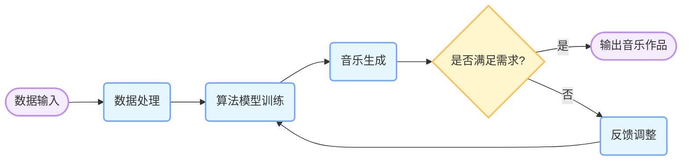

# AI Agent在音乐创作中的辅助角色

> 关键词：AI Agent、音乐创作、辅助角色、算法原理、应用场景

> 摘要：本文深入探讨了AI Agent在音乐创作中的辅助角色。首先介绍了相关背景知识，包括目的范围、预期读者等。接着阐述了核心概念及联系，分析了核心算法原理和具体操作步骤，并给出了数学模型和公式。通过项目实战展示了AI Agent在音乐创作中的实际应用，包括开发环境搭建、源代码实现与解读。同时探讨了其实际应用场景，推荐了相关工具和资源。最后总结了未来发展趋势与挑战，并提供了常见问题解答和扩展阅读参考资料，旨在为读者全面呈现AI Agent在音乐创作中辅助角色的多方面信息。

## 1. 背景介绍 
### 1.1 目的和范围
随着人工智能技术的飞速发展，AI Agent在各个领域都展现出了巨大的潜力，音乐创作领域也不例外。本文的目的在于详细剖析AI Agent在音乐创作中所扮演的辅助角色，探讨其如何为音乐创作者提供支持和帮助。范围涵盖了AI Agent在音乐创作过程中的核心概念、算法原理、实际应用场景等多个方面，旨在为音乐创作者、人工智能研究者以及对该领域感兴趣的读者提供全面且深入的了解。

### 1.2 预期读者
本文的预期读者包括音乐创作者，他们可以从中了解如何借助AI Agent提升创作效率和创新能力；人工智能研究者，能够获取AI Agent在音乐领域应用的相关理论和实践知识；音乐爱好者，有助于他们理解AI对音乐创作的影响；以及对跨学科领域研究感兴趣的读者，为他们探索人工智能与音乐的结合提供参考。

### 1.3 文档结构概述
本文将按照以下结构进行阐述：首先介绍背景知识，为后续内容奠定基础；接着讲解核心概念与联系，明确AI Agent在音乐创作中的基本原理和架构；然后深入分析核心算法原理和具体操作步骤，并给出相应的数学模型和公式；通过项目实战展示AI Agent在音乐创作中的实际应用；探讨其在不同场景下的应用；推荐相关的学习资源、开发工具和论文著作；最后总结未来发展趋势与挑战，解答常见问题并提供扩展阅读和参考资料。

### 1.4 术语表
#### 1.4.1 核心术语定义
- **AI Agent（人工智能代理）**：是一种能够感知环境、自主决策并采取行动以实现特定目标的人工智能实体。在音乐创作中，AI Agent可以根据输入的音乐信息和预设的规则，生成音乐片段或提供创作建议。
- **音乐创作**：指创作者运用音乐元素（如音符、节奏、和声等）创造出具有一定艺术价值的音乐作品的过程。
- **辅助角色**：在音乐创作中，AI Agent不直接取代人类创作者，而是通过提供灵感、优化创作过程等方式，协助人类创作者完成音乐作品。

#### 1.4.2 相关概念解释
- **音乐风格**：是指音乐作品在旋律、节奏、和声、配器等方面所呈现出的独特特征和艺术倾向，如古典音乐、流行音乐、摇滚音乐等。
- **音乐情感**：音乐所表达的情感内容，如喜悦、悲伤、愤怒等，AI Agent可以通过分析音乐元素来识别和模拟不同的情感。
- **音乐生成**：利用人工智能技术自动生成音乐片段或完整音乐作品的过程，AI Agent可以根据不同的算法和模型实现音乐生成。

#### 1.4.3 缩略词列表
- **AI**：Artificial Intelligence（人工智能）
- **ML**：Machine Learning（机器学习）
- **DL**：Deep Learning（深度学习）

## 2. 核心概念与联系 
### 核心概念原理
AI Agent在音乐创作中的核心原理是基于对音乐数据的学习和分析，利用各种算法和模型来生成音乐或提供创作建议。它可以通过学习大量的音乐作品，掌握音乐的基本规律和特征，如音符的组合、节奏的变化、和声的进行等。然后，根据创作者的需求和输入信息，AI Agent可以运用这些知识生成符合要求的音乐片段。

例如，AI Agent可以使用机器学习算法对音乐数据进行分类和聚类，识别不同音乐风格的特征。当创作者需要创作某种特定风格的音乐时，AI Agent可以根据已学习到的该风格的特征，生成相应的音乐素材。

### 架构的文本示意图
AI Agent在音乐创作中的架构可以分为以下几个主要部分：
1. **数据输入层**：接收来自创作者的输入信息，如音乐主题、风格要求、情感倾向等，同时也可以获取大量的音乐数据作为学习样本。
2. **数据处理层**：对输入的数据进行清洗、特征提取和转换等操作，以便后续的算法处理。例如，将音乐数据转换为数字序列，提取音符的音高、时长等特征。
3. **算法模型层**：运用各种机器学习和深度学习算法，如神经网络、遗传算法等，对处理后的数据进行学习和分析，建立音乐生成模型。
4. **音乐生成层**：根据建立的模型和创作者的输入信息，生成音乐片段或完整的音乐作品。
5. **反馈交互层**：将生成的音乐反馈给创作者，接收创作者的反馈意见，对模型进行调整和优化，以提高生成音乐的质量和符合度。

### Mermaid流程图


## 3. 核心算法原理 & 具体操作步骤 
### 核心算法原理
在AI Agent进行音乐创作时，常用的算法有神经网络算法，下面以循环神经网络（RNN）为例进行详细阐述。

循环神经网络是一种专门用于处理序列数据的神经网络，它可以捕捉序列中的时间依赖关系。在音乐创作中，音乐数据可以看作是一个时间序列，每个音符或音乐片段都与之前的部分存在关联。

RNN的基本原理是通过循环结构，将前一个时间步的输出作为当前时间步的输入，从而实现对序列数据的处理。其数学表达式如下：
$$
h_t = \tanh(W_{hh}h_{t-1} + W_{xh}x_t + b_h)
$$
$$
y_t = W_{hy}h_t + b_y
$$
其中，$x_t$ 是当前时间步的输入，$h_t$ 是当前时间步的隐藏状态，$y_t$ 是当前时间步的输出，$W_{hh}$、$W_{xh}$ 和 $W_{hy}$ 是权重矩阵，$b_h$ 和 $b_y$ 是偏置向量，$\tanh$ 是激活函数。

### 具体操作步骤
以下是使用Python和PyTorch库实现基于RNN的音乐生成的具体步骤：

#### 步骤1：数据准备
首先，需要将音乐数据转换为适合神经网络处理的格式。可以将音乐数据表示为音符序列，每个音符用一个数字表示。
```python
import torch
import numpy as np

# 假设音乐数据已经转换为一个一维的音符序列
music_data = np.array([1, 2, 3, 4, 5, 6, 7, 8, 9, 10])

# 将数据转换为PyTorch张量
music_tensor = torch.tensor(music_data, dtype=torch.float32)

# 划分训练集和测试集
train_size = int(len(music_tensor) * 0.8)
train_data = music_tensor[:train_size]
test_data = music_tensor[train_size:]
```

#### 步骤2：定义RNN模型
```python
import torch.nn as nn

class MusicRNN(nn.Module):
    def __init__(self, input_size, hidden_size, output_size):
        super(MusicRNN, self).__init__()
        self.hidden_size = hidden_size
        self.rnn = nn.RNN(input_size, hidden_size, batch_first=True)
        self.fc = nn.Linear(hidden_size, output_size)

    def forward(self, x):
        h0 = torch.zeros(1, x.size(0), self.hidden_size).to(x.device)
        out, _ = self.rnn(x, h0)
        out = self.fc(out[:, -1, :])
        return out

# 定义模型参数
input_size = 1
hidden_size = 128
output_size = 1

# 创建模型实例
model = MusicRNN(input_size, hidden_size, output_size)
```

#### 步骤3：训练模型
```python
import torch.optim as optim

# 定义损失函数和优化器
criterion = nn.MSELoss()
optimizer = optim.Adam(model.parameters(), lr=0.001)

# 训练模型
num_epochs = 100
for epoch in range(num_epochs):
    optimizer.zero_grad()
    inputs = train_data[:-1].unsqueeze(0).unsqueeze(-1)
    targets = train_data[1:].unsqueeze(0).unsqueeze(-1)
    outputs = model(inputs)
    loss = criterion(outputs, targets)
    loss.backward()
    optimizer.step()
    if (epoch + 1) % 10 == 0:
        print(f'Epoch [{epoch+1}/{num_epochs}], Loss: {loss.item():.4f}')
```

#### 步骤4：生成音乐
```python
# 生成音乐
start_note = train_data[-1].unsqueeze(0).unsqueeze(-1)
generated_music = [start_note.item()]
num_notes_to_generate = 20

for _ in range(num_notes_to_generate):
    input_note = torch.tensor([[generated_music[-1]]], dtype=torch.float32)
    output = model(input_note)
    next_note = output.item()
    generated_music.append(next_note)

print("Generated music:", generated_music)
```

## 4. 数学模型和公式 & 详细讲解 & 举例说明 
### 数学模型
在音乐创作中，除了上述的RNN模型，还可以使用马尔可夫模型。马尔可夫模型是一种基于概率的模型，它假设未来的状态只依赖于当前的状态，而与过去的状态无关。

在音乐创作中，我们可以将每个音符看作一个状态，通过统计大量音乐数据中音符之间的转移概率，构建马尔可夫链。然后，根据这个马尔可夫链，随机生成音符序列，从而实现音乐创作。

### 公式
设 $S = \{s_1, s_2, \cdots, s_n\}$ 是所有可能的音符状态集合，$P_{ij}$ 表示从状态 $s_i$ 转移到状态 $s_j$ 的概率，满足 $\sum_{j=1}^{n}P_{ij} = 1$。

马尔可夫链的状态转移可以用以下公式表示：
$$
P(X_{t+1} = s_j | X_t = s_i) = P_{ij}
$$
其中，$X_t$ 表示在时间 $t$ 时的状态。

### 详细讲解
马尔可夫模型的核心是状态转移概率矩阵 $P$，它描述了音符之间的转移规律。通过对大量音乐数据的统计分析，可以得到这个概率矩阵。

例如，我们统计了一首歌曲中音符的出现情况，得到了以下状态转移概率矩阵：
$$
P = 
\begin{bmatrix}
0.2 & 0.3 & 0.5 \\
0.4 & 0.1 & 0.5 \\
0.3 & 0.6 & 0.1
\end{bmatrix}
$$
假设当前音符的状态是 $s_1$，那么下一个音符是 $s_1$ 的概率是 $0.2$，是 $s_2$ 的概率是 $0.3$，是 $s_3$ 的概率是 $0.5$。我们可以根据这些概率随机选择下一个音符，从而生成音乐序列。

### 举例说明
假设我们从状态 $s_1$ 开始，根据上述概率矩阵生成一个长度为 5 的音符序列。

第一次转移：从 $s_1$ 转移，根据概率 $P_{11} = 0.2$，$P_{12} = 0.3$，$P_{13} = 0.5$，我们随机选择一个状态。假设我们选择了 $s_3$。

第二次转移：从 $s_3$ 转移，根据概率 $P_{31} = 0.3$，$P_{32} = 0.6$，$P_{33} = 0.1$，假设我们选择了 $s_2$。

以此类推，我们可以得到一个音符序列，如 $s_1 \to s_3 \to s_2 \to s_1 \to s_3$。

## 5. 项目实战：代码实际案例和详细解释说明 
### 5.1  开发环境搭建
#### 操作系统
可以选择Windows、Linux或macOS操作系统，本文以Windows为例进行说明。

#### 编程语言和库
- **Python**：建议使用Python 3.7及以上版本。
- **PyTorch**：用于构建和训练神经网络模型。
- **Music21**：一个用于音乐分析和生成的Python库。

#### 安装步骤
1. 安装Python：从Python官方网站（https://www.python.org/downloads/）下载并安装Python。
2. 安装PyTorch：根据自己的显卡情况选择合适的版本，在PyTorch官方网站（https://pytorch.org/get-started/locally/）上获取安装命令，例如：
```sh
pip install torch torchvision torchaudio
```
3. 安装Music21：使用以下命令进行安装：
```sh
pip install music21
```

### 5.2  源代码详细实现和代码解读
以下是一个使用Music21和PyTorch实现简单音乐生成的代码示例：

```python
import music21
import torch
import torch.nn as nn
import torch.optim as optim
import numpy as np

# 加载音乐数据
def load_music_data(file_path):
    score = music21.converter.parse(file_path)
    notes = []
    for element in score.flat.notes:
        if isinstance(element, music21.note.Note):
            notes.append(str(element.pitch))
        elif isinstance(element, music21.chord.Chord):
            notes.append('.'.join(str(n) for n in element.normalOrder))
    return notes

# 数据预处理
def preprocess_data(notes, sequence_length=100):
    pitch_names = sorted(set(item for item in notes))
    note_to_int = dict((note, number) for number, note in enumerate(pitch_names))
    network_input = []
    network_output = []
    for i in range(0, len(notes) - sequence_length, 1):
        sequence_in = notes[i:i + sequence_length]
        sequence_out = notes[i + sequence_length]
        network_input.append([note_to_int[char] for char in sequence_in])
        network_output.append(note_to_int[sequence_out])
    n_patterns = len(network_input)
    network_input = np.reshape(network_input, (n_patterns, sequence_length, 1))
    network_input = network_input / float(len(pitch_names))
    network_output = torch.tensor(network_output, dtype=torch.long)
    return network_input, network_output, pitch_names

# 定义神经网络模型
class MusicGenerator(nn.Module):
    def __init__(self, input_size, hidden_size, output_size):
        super(MusicGenerator, self).__init__()
        self.lstm = nn.LSTM(input_size, hidden_size, batch_first=True)
        self.fc = nn.Linear(hidden_size, output_size)

    def forward(self, x):
        out, _ = self.lstm(x)
        out = self.fc(out[:, -1, :])
        return out

# 训练模型
def train_model(model, network_input, network_output, num_epochs=100, lr=0.001):
    criterion = nn.CrossEntropyLoss()
    optimizer = optim.Adam(model.parameters(), lr=lr)
    for epoch in range(num_epochs):
        inputs = torch.tensor(network_input, dtype=torch.float32)
        optimizer.zero_grad()
        outputs = model(inputs)
        loss = criterion(outputs, network_output)
        loss.backward()
        optimizer.step()
        if (epoch + 1) % 10 == 0:
            print(f'Epoch [{epoch+1}/{num_epochs}], Loss: {loss.item():.4f}')

# 生成音乐
def generate_music(model, network_input, pitch_names, sequence_length=100):
    start = np.random.randint(0, len(network_input) - 1)
    int_to_note = dict((number, note) for number, note in enumerate(pitch_names))
    pattern = network_input[start]
    prediction_output = []
    for note_index in range(500):
        prediction_input = np.reshape(pattern, (1, len(pattern), 1))
        prediction_input = prediction_input / float(len(pitch_names))
        prediction_input = torch.tensor(prediction_input, dtype=torch.float32)
        prediction = model(prediction_input)
        index = torch.argmax(prediction).item()
        result = int_to_note[index]
        prediction_output.append(result)
        pattern = np.append(pattern[1:], index)
    return prediction_output

# 保存生成的音乐
def save_music(prediction_output, file_path):
    offset = 0
    output_notes = []
    for pattern in prediction_output:
        if ('.' in pattern) or pattern.isdigit():
            notes_in_chord = pattern.split('.')
            notes = []
            for current_note in notes_in_chord:
                new_note = music21.note.Note(int(current_note))
                new_note.storedInstrument = music21.instrument.Piano()
                notes.append(new_note)
            new_chord = music21.chord.Chord(notes)
            new_chord.offset = offset
            output_notes.append(new_chord)
        else:
            new_note = music21.note.Note(pattern)
            new_note.offset = offset
            new_note.storedInstrument = music21.instrument.Piano()
            output_notes.append(new_note)
        offset += 0.5
    midi_stream = music21.stream.Stream(output_notes)
    midi_stream.write('midi', fp=file_path)

# 主函数
def main():
    file_path = 'your_music_file.mid'
    notes = load_music_data(file_path)
    network_input, network_output, pitch_names = preprocess_data(notes)
    input_size = 1
    hidden_size = 256
    output_size = len(pitch_names)
    model = MusicGenerator(input_size, hidden_size, output_size)
    train_model(model, network_input, network_output)
    prediction_output = generate_music(model, network_input, pitch_names)
    save_music(prediction_output, 'generated_music.mid')

if __name__ == "__main__":
    main()
```

### 5.3  代码解读与分析
#### 数据加载和预处理
- `load_music_data` 函数：使用Music21库加载音乐文件，并将音符和和弦转换为字符串表示。
- `preprocess_data` 函数：将音符序列转换为适合神经网络处理的格式，包括将音符映射为整数，划分输入序列和输出序列，并进行归一化处理。

#### 模型定义
- `MusicGenerator` 类：定义了一个基于LSTM的神经网络模型，用于音乐生成。LSTM层可以捕捉序列中的长期依赖关系，全连接层将LSTM的输出映射到音符的概率分布。

#### 模型训练
- `train_model` 函数：使用交叉熵损失函数和Adam优化器对模型进行训练，通过多次迭代更新模型参数，降低损失值。

#### 音乐生成
- `generate_music` 函数：从训练数据中随机选择一个起始序列，通过模型预测下一个音符，不断迭代生成音乐序列。

#### 音乐保存
- `save_music` 函数：将生成的音符序列转换为Music21的音符和和弦对象，保存为MIDI文件。

## 6. 实际应用场景 
### 灵感启发
AI Agent可以为音乐创作者提供灵感。例如，当创作者遇到创作瓶颈时，AI Agent可以根据创作者输入的主题、风格等要求，生成一些独特的音乐片段，为创作者提供新的思路和方向。

### 快速生成草稿
在音乐创作的初期，创作者可以使用AI Agent快速生成音乐草稿。AI Agent可以根据预设的规则和模板，迅速生成一段基本的音乐结构，创作者可以在此基础上进行修改和完善，提高创作效率。

### 个性化音乐创作
AI Agent可以根据用户的个性化需求进行音乐创作。例如，根据用户的情感状态、喜好的音乐风格等，生成符合用户个性化需求的音乐作品，为用户提供独特的音乐体验。

### 音乐风格融合
AI Agent可以将不同风格的音乐元素进行融合，创造出新颖的音乐风格。例如，将古典音乐和流行音乐的元素相结合，产生出具有独特魅力的音乐作品。

### 音乐自动配乐
在影视、游戏等领域，AI Agent可以根据视频内容的情节、氛围等特点，自动为其配上合适的音乐。这样可以大大提高配乐的效率，降低制作成本。

## 7. 工具和资源推荐
### 7.1 学习资源推荐
#### 7.1.1 书籍推荐
- 《深度学习》（Deep Learning）：由Ian Goodfellow、Yoshua Bengio和Aaron Courville所著，是深度学习领域的经典教材，涵盖了神经网络、深度学习算法等方面的知识，对于理解AI Agent的核心算法原理有很大帮助。
- 《音乐信息检索》（Music Information Retrieval）：介绍了音乐信息处理的基本概念、方法和技术，包括音乐特征提取、音乐分类、音乐生成等内容，为AI Agent在音乐创作中的应用提供了理论基础。

#### 7.1.2 在线课程
- Coursera上的“深度学习专项课程”（Deep Learning Specialization）：由Andrew Ng教授主讲，系统地介绍了深度学习的理论和实践，包括神经网络、卷积神经网络、循环神经网络等内容，对于学习AI Agent的算法实现非常有帮助。
- edX上的“音乐信息检索导论”（Introduction to Music Information Retrieval）：提供了音乐信息处理的基础知识和方法，包括音乐特征提取、音乐分类、音乐推荐等方面的内容，适合对音乐和人工智能结合感兴趣的学习者。

#### 7.1.3 技术博客和网站
- Towards Data Science：是一个专注于数据科学和机器学习的博客平台，上面有很多关于AI Agent在音乐创作中应用的技术文章和案例分析。
- Music Technology World：提供了音乐技术领域的最新资讯和技术文章，包括AI在音乐创作、制作等方面的应用，对于了解行业动态和技术发展趋势有很大帮助。

### 7.2 开发工具框架推荐
#### 7.2.1 IDE和编辑器
- PyCharm：是一款专门为Python开发设计的集成开发环境，具有代码编辑、调试、版本控制等功能，对于开发基于Python的AI Agent音乐创作项目非常方便。
- Jupyter Notebook：是一个交互式的开发环境，支持Python代码的编写、运行和可视化展示，适合进行数据分析、模型训练和测试等工作。

#### 7.2.2 调试和性能分析工具
- TensorBoard：是TensorFlow的可视化工具，可以用于监控模型训练过程中的损失值、准确率等指标，还可以可视化模型的结构和参数分布，帮助开发者进行调试和优化。
- Py-Spy：是一个Python性能分析工具，可以实时监控Python程序的CPU使用率和函数调用情况，帮助开发者找出性能瓶颈。

#### 7.2.3 相关框架和库
- PyTorch：是一个开源的深度学习框架，提供了丰富的神经网络层和优化算法，支持GPU加速，对于构建和训练AI Agent的音乐生成模型非常方便。
- Music21：是一个用于音乐分析和生成的Python库，提供了丰富的音乐数据处理和分析工具，支持多种音乐文件格式的读取和写入，对于音乐数据的预处理和生成音乐作品非常有用。

### 7.3 相关论文著作推荐
#### 7.3.1 经典论文
- "Generating Music with Recurrent Neural Networks"：介绍了使用循环神经网络进行音乐生成的方法和技术，为后续的音乐生成研究奠定了基础。
- "A Survey on Deep Learning Techniques for Music Generation"：对深度学习在音乐生成领域的应用进行了全面的综述，分析了不同的深度学习模型和算法在音乐生成中的优缺点。

#### 7.3.2 最新研究成果
- "Style Transfer in Music: A Review"：探讨了音乐风格迁移的最新研究成果和方法，介绍了如何使用AI技术将一种音乐风格转换为另一种音乐风格。
- "AI-Enhanced Music Composition: State-of-the-Art and Future Directions"：分析了AI在音乐创作中的现状和未来发展趋势，提出了一些新的研究方向和挑战。

#### 7.3.3 应用案例分析
- "Using AI to Create Soundtracks for Video Games"：介绍了如何使用AI Agent为视频游戏创作配乐的应用案例，分析了AI在游戏音乐创作中的优势和挑战。
- "AI-Generated Music in Film Production"：探讨了AI Agent在电影音乐制作中的应用案例，展示了AI如何根据电影情节和氛围生成合适的音乐。

## 8. 总结：未来发展趋势与挑战
### 未来发展趋势
#### 更加智能化和个性化
未来的AI Agent将更加智能化，能够更好地理解人类的音乐需求和情感，提供更加个性化的音乐创作服务。例如，根据用户的实时情感状态和场景变化，动态生成符合用户需求的音乐。

#### 与其他技术的融合
AI Agent将与虚拟现实（VR）、增强现实（AR）等技术进行深度融合，为用户带来更加沉浸式的音乐体验。例如，在VR环境中，用户可以与AI Agent实时互动，共同创作音乐。

#### 跨文化音乐创作
AI Agent可以学习和融合不同文化背景下的音乐元素，实现跨文化的音乐创作。这将促进不同文化之间的音乐交流和融合，创造出更加丰富多彩的音乐作品。

### 挑战
#### 音乐创造力的提升
虽然AI Agent可以生成音乐，但目前其创造力还相对有限。如何让AI Agent具备更高的创造力，生成更加新颖、独特的音乐作品，是未来需要解决的一个重要问题。

#### 音乐版权和伦理问题
随着AI Agent在音乐创作中的应用越来越广泛，音乐版权和伦理问题也日益凸显。例如，AI生成的音乐作品的版权归属问题，以及AI是否会取代人类音乐创作者等问题，需要进一步探讨和解决。

#### 数据质量和隐私问题
AI Agent的性能很大程度上依赖于训练数据的质量。如何获取高质量的音乐数据，同时保护数据的隐私和安全，是需要关注的问题。

## 9. 附录：常见问题与解答
### 问题1：AI Agent生成的音乐是否具有艺术价值？
解答：AI Agent生成的音乐具有一定的艺术价值。虽然目前AI的创造力还不如人类，但它可以通过学习大量的音乐作品，掌握音乐的基本规律和技巧，生成出具有一定美感和创新性的音乐作品。同时，AI生成的音乐也可以为人类创作者提供灵感和启发，促进音乐创作的发展。

### 问题2：AI Agent会取代人类音乐创作者吗？
解答：目前来看，AI Agent不会取代人类音乐创作者。虽然AI Agent可以在某些方面辅助音乐创作，提高创作效率，但音乐创作不仅仅是技术和技巧的体现，还涉及到情感、文化、个人体验等多个方面。人类创作者具有独特的创造力和情感表达能力，这是AI Agent目前无法替代的。

### 问题3：如何评估AI Agent生成的音乐质量？
解答：评估AI Agent生成的音乐质量可以从多个方面进行，如旋律的优美程度、节奏的合理性、和声的协调性等。同时，也可以通过主观评价的方式，让听众对音乐进行打分和评价。此外，还可以使用一些客观的指标，如音乐的复杂度、创新性等，来评估音乐的质量。

### 问题4：使用AI Agent进行音乐创作需要具备哪些技术知识？
解答：使用AI Agent进行音乐创作需要具备一定的人工智能和音乐相关的技术知识。在人工智能方面，需要了解机器学习、深度学习等算法原理，掌握相关的编程语言和开发框架，如Python、PyTorch等。在音乐方面，需要了解音乐的基本理论知识，如音符、节奏、和声等。

## 10. 扩展阅读 & 参考资料
### 扩展阅读
- 《人工智能时代的音乐创作》：深入探讨了人工智能对音乐创作的影响和变革，介绍了一些前沿的音乐创作技术和方法。
- 《音乐与科技的融合》：分析了音乐与科技在不同领域的融合应用，包括AI在音乐创作、表演、传播等方面的应用案例。

### 参考资料
- Goodfellow, I., Bengio, Y., & Courville, A. (2016). Deep Learning. MIT Press.
- Downie, J. S. (2003). Music Information Retrieval. Annual Review of Information Science and Technology, 37(1), 295-340.
- "Generating Music with Recurrent Neural Networks" paper link
- "A Survey on Deep Learning Techniques for Music Generation" paper link

作者：AI天才研究院/AI Genius Institute & 禅与计算机程序设计艺术 /Zen And The Art of Computer Programming