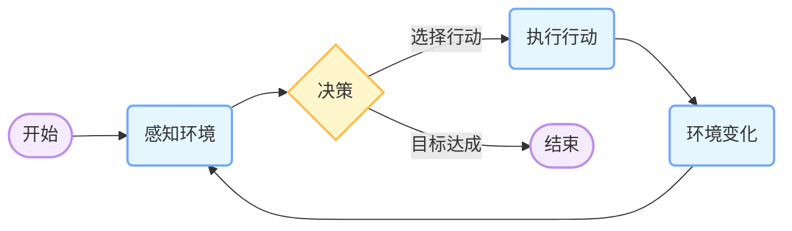

# AI Agent基础概念：理解智能代理的核心

> 关键词：AI Agent，智能代理，核心概念，算法原理，实际应用

> 摘要：本文旨在深入探讨AI Agent（智能代理）的基础概念，详细剖析其核心原理、算法机制以及数学模型。通过实际的代码案例展示其在项目中的具体应用，同时介绍了与之相关的工具和资源。最后对AI Agent的未来发展趋势与挑战进行总结，并解答常见问题，为读者全面理解智能代理提供了系统而深入的知识体系。

## 1. 背景介绍 
### 1.1 目的和范围
随着人工智能技术的飞速发展，AI Agent作为其中一个关键的概念逐渐受到广泛关注。本文的目的在于为读者提供一个全面且深入的AI Agent基础概念的介绍，涵盖其核心原理、算法机制、数学模型、实际应用等方面。通过详细的讲解和实际案例分析，帮助读者理解智能代理的核心，掌握相关的技术知识和应用方法。本文的范围主要集中在AI Agent的基础理论和实践，不涉及过于复杂的前沿研究成果，但会为读者进一步深入学习提供指引。

### 1.2 预期读者
本文预期读者包括对人工智能领域感兴趣的初学者、计算机科学专业的学生、从事软件开发和人工智能相关工作的程序员以及希望了解智能代理技术的企业管理人员等。无论您是刚刚接触人工智能领域，还是已经有一定的技术基础，本文都将为您提供有价值的信息和知识。

### 1.3 文档结构概述
本文将按照以下结构进行组织：首先介绍AI Agent的核心概念与联系，包括其定义、原理和架构；接着详细讲解核心算法原理和具体操作步骤，并使用Python源代码进行阐述；然后介绍数学模型和公式，并通过举例说明其应用；之后通过项目实战展示代码实际案例和详细解释说明；再探讨AI Agent的实际应用场景；推荐相关的工具和资源；最后总结未来发展趋势与挑战，解答常见问题，并提供扩展阅读和参考资料。

### 1.4 术语表
#### 1.4.1 核心术语定义
- **AI Agent（智能代理）**：是一种能够感知环境、自主决策并采取行动以实现特定目标的软件实体或系统。它可以在复杂的环境中独立运行，根据环境的变化动态调整自己的行为。
- **环境（Environment）**：是AI Agent所处的外部世界，包括各种资源、信息和其他实体。环境可以是物理环境，如现实世界中的机器人所处的环境；也可以是虚拟环境，如计算机网络中的软件系统。
- **感知（Perception）**：是AI Agent获取环境信息的过程。通过各种传感器或接口，AI Agent可以收集环境中的数据，如温度、湿度、图像、声音等。
- **决策（Decision - making）**：是AI Agent根据感知到的环境信息和自身的目标，选择合适的行动方案的过程。决策过程通常基于一定的算法和规则。
- **行动（Action）**：是AI Agent根据决策结果在环境中执行的操作。行动可以是物理动作，如机器人的移动、抓取；也可以是虚拟动作，如发送消息、修改数据等。

#### 1.4.2 相关概念解释
- **自主性（Autonomy）**：指AI Agent能够在没有人类干预的情况下独立运行和决策。自主性是智能代理的重要特征之一，它使得AI Agent能够适应复杂多变的环境。
- **反应性（Reactivity）**：表示AI Agent能够及时对环境的变化做出响应。当环境发生变化时，AI Agent能够迅速感知并调整自己的行为。
- **目标导向性（Goal - orientation）**：意味着AI Agent具有明确的目标，并会采取行动来实现这些目标。目标可以是预先设定的，也可以是在运行过程中动态调整的。

#### 1.4.3 缩略词列表
- **AI**：Artificial Intelligence，人工智能
- **ML**：Machine Learning，机器学习
- **RL**：Reinforcement Learning，强化学习

## 2. 核心概念与联系 

### 核心概念原理
AI Agent的核心原理基于感知 - 决策 - 行动的循环过程。AI Agent通过传感器感知环境中的信息，将这些信息传递给决策模块。决策模块根据预设的目标和规则，对感知到的信息进行分析和处理，选择合适的行动方案。最后，行动模块将决策结果转化为具体的行动，作用于环境。环境的变化又会被AI Agent感知到，从而开始新的循环。

### 架构的文本示意图
一个典型的AI Agent架构可以分为以下几个部分：
1. **感知模块**：负责收集环境信息，如摄像头、麦克风、传感器等。
2. **决策模块**：根据感知到的信息和目标，进行决策。决策模块可以使用各种算法，如机器学习、规则引擎等。
3. **行动模块**：将决策结果转化为具体的行动，如机器人的运动控制、软件系统的操作等。
4. **知识库**：存储AI Agent的知识和规则，为决策提供支持。

### Mermaid流程图


## 3. 核心算法原理 & 具体操作步骤 

### 算法原理
在AI Agent中，常用的算法包括基于规则的算法、机器学习算法和强化学习算法。这里我们以强化学习算法为例进行详细讲解。

强化学习是一种通过智能体与环境进行交互来学习最优行为策略的方法。智能体在环境中采取行动，环境会根据智能体的行动给予奖励或惩罚。智能体的目标是最大化长期累积奖励。

### Python源代码阐述
以下是一个简单的强化学习示例，使用OpenAI Gym库中的CartPole环境：

```python
import gym

# 创建CartPole环境
env = gym.make('CartPole-v1')

# 初始化环境
observation = env.reset()

for _ in range(1000):
    # 渲染环境
    env.render()
    
    # 随机选择一个动作
    action = env.action_space.sample()
    
    # 执行动作并获取新的观测、奖励、是否结束和额外信息
    observation, reward, done, info = env.step(action)
    
    if done:
        # 如果环境结束，重置环境
        observation = env.reset()

# 关闭环境
env.close()
```

### 具体操作步骤
1. **导入必要的库**：在上述代码中，我们导入了`gym`库，它是一个用于开发和比较强化学习算法的工具包。
2. **创建环境**：使用`gym.make()`函数创建CartPole环境。
3. **初始化环境**：调用`env.reset()`函数初始化环境，获取初始观测值。
4. **循环执行动作**：在循环中，我们首先渲染环境，然后随机选择一个动作，执行该动作并获取新的观测、奖励、是否结束和额外信息。如果环境结束，我们重置环境。
5. **关闭环境**：最后，调用`env.close()`函数关闭环境。

## 4. 数学模型和公式 & 详细讲解 & 举例说明 

### 数学模型
在强化学习中，常用的数学模型是马尔可夫决策过程（Markov Decision Process，MDP）。MDP可以用一个五元组 $(S, A, P, R, \gamma)$ 表示，其中：
- $S$ 是状态空间，表示环境的所有可能状态。
- $A$ 是动作空间，表示智能体可以采取的所有可能动作。
- $P$ 是状态转移概率函数，表示在状态 $s$ 采取动作 $a$ 后转移到状态 $s'$ 的概率，即 $P(s'|s, a)$。
- $R$ 是奖励函数，表示在状态 $s$ 采取动作 $a$ 转移到状态 $s'$ 时获得的奖励，即 $R(s, a, s')$。
- $\gamma$ 是折扣因子，用于权衡即时奖励和未来奖励，取值范围为 $[0, 1]$。

### 公式
在MDP中，智能体的目标是找到一个最优策略 $\pi^*$，使得长期累积奖励最大化。长期累积奖励可以用以下公式表示：

$$G_t = \sum_{k = 0}^{\infty} \gamma^k R_{t + k + 1}$$

其中，$G_t$ 是从时间步 $t$ 开始的长期累积奖励，$R_{t + k + 1}$ 是时间步 $t + k + 1$ 获得的奖励。

策略 $\pi$ 定义了在每个状态下选择动作的概率分布，即 $\pi(a|s)$ 表示在状态 $s$ 选择动作 $a$ 的概率。智能体的价值函数 $V^{\pi}(s)$ 表示在策略 $\pi$ 下从状态 $s$ 开始的长期累积奖励的期望，即：

$$V^{\pi}(s) = \mathbb{E}_{\pi}[G_t|S_t = s]$$

动作价值函数 $Q^{\pi}(s, a)$ 表示在策略 $\pi$ 下从状态 $s$ 采取动作 $a$ 开始的长期累积奖励的期望，即：

$$Q^{\pi}(s, a) = \mathbb{E}_{\pi}[G_t|S_t = s, A_t = a]$$

### 详细讲解
价值函数和动作价值函数是强化学习中的重要概念，它们可以帮助智能体评估不同状态和动作的优劣。智能体的目标是找到一个最优策略 $\pi^*$，使得价值函数 $V^{\pi^*}(s)$ 或动作价值函数 $Q^{\pi^*}(s, a)$ 最大化。

### 举例说明
假设我们有一个简单的网格世界环境，智能体可以在网格中上下左右移动。每个网格有一个奖励值，智能体的目标是从起点移动到终点，获得最大的累积奖励。在这个环境中，状态 $s$ 可以表示智能体在网格中的位置，动作 $a$ 可以表示上下左右四个方向。状态转移概率函数 $P(s'|s, a)$ 表示在状态 $s$ 采取动作 $a$ 后转移到状态 $s'$ 的概率，奖励函数 $R(s, a, s')$ 表示在状态 $s$ 采取动作 $a$ 转移到状态 $s'$ 时获得的奖励。智能体可以通过学习最优策略 $\pi^*$ 来最大化长期累积奖励。

## 5. 项目实战：代码实际案例和详细解释说明 

### 5.1  开发环境搭建
#### 安装Python
首先，确保你已经安装了Python 3.x版本。你可以从Python官方网站（https://www.python.org/downloads/）下载并安装适合你操作系统的Python版本。

#### 安装必要的库
在这个项目中，我们需要安装`gym`库和`numpy`库。可以使用以下命令进行安装：
```bash
pip install gym numpy
```

### 5.2  源代码详细实现和代码解读
以下是一个使用Q - learning算法解决CartPole问题的完整代码示例：

```python
import gym
import numpy as np

# 创建CartPole环境
env = gym.make('CartPole-v1')

# 定义Q - learning的参数
learning_rate = 0.1
discount_factor = 0.99
epsilon = 0.1
num_episodes = 1000

# 离散化状态空间
state_bins = [
    np.linspace(-4.8, 4.8, 20),
    np.linspace(-5, 5, 20),
    np.linspace(-0.418, 0.418, 20),
    np.linspace(-5, 5, 20)
]

def discretize_state(state):
    discretized = []
    for i in range(len(state)):
        discretized.append(np.digitize(state[i], state_bins[i]))
    return tuple(discretized)

# 初始化Q表
q_table = np.zeros((20, 20, 20, 20, env.action_space.n))

for episode in range(num_episodes):
    # 重置环境
    state = env.reset()
    state = discretize_state(state)
    done = False
    
    while not done:
        # epsilon - greedy策略选择动作
        if np.random.uniform(0, 1) < epsilon:
            action = env.action_space.sample()
        else:
            action = np.argmax(q_table[state])
        
        # 执行动作
        next_state, reward, done, _ = env.step(action)
        next_state = discretize_state(next_state)
        
        # 更新Q表
        q_table[state][action] = (1 - learning_rate) * q_table[state][action] + \
                                 learning_rate * (reward + discount_factor * np.max(q_table[next_state]))
        
        state = next_state

# 测试训练好的策略
state = env.reset()
state = discretize_state(state)
done = False
total_reward = 0

while not done:
    env.render()
    action = np.argmax(q_table[state])
    next_state, reward, done, _ = env.step(action)
    next_state = discretize_state(next_state)
    total_reward += reward
    state = next_state

print(f"Total reward in test: {total_reward}")

# 关闭环境
env.close()
```

### 5.3  代码解读与分析
1. **导入必要的库**：导入`gym`库和`numpy`库。
2. **创建环境**：使用`gym.make()`函数创建CartPole环境。
3. **定义Q - learning的参数**：包括学习率`learning_rate`、折扣因子`discount_factor`、探索率`epsilon`和训练的回合数`num_episodes`。
4. **离散化状态空间**：由于CartPole环境的状态空间是连续的，而Q - learning算法通常适用于离散状态空间，因此我们需要将状态空间离散化。
5. **初始化Q表**：Q表是一个多维数组，用于存储每个状态 - 动作对的Q值。
6. **训练过程**：在每个回合中，我们使用epsilon - greedy策略选择动作，执行动作并更新Q表。
7. **测试过程**：使用训练好的Q表进行测试，计算总奖励。
8. **关闭环境**：最后，关闭环境。

## 6. 实际应用场景 
### 游戏领域
AI Agent在游戏领域有着广泛的应用。例如，在棋类游戏中，AI Agent可以通过学习和推理，与人类玩家进行对战。在电子竞技游戏中，AI Agent可以作为对手或队友，提高游戏的趣味性和挑战性。

### 机器人领域
在机器人领域，AI Agent可以控制机器人的运动和行为。例如，机器人可以通过感知环境信息，自主决策并执行任务，如导航、抓取物体等。

### 智能客服领域
AI Agent可以作为智能客服，自动回答用户的问题。通过学习大量的问答数据，AI Agent可以理解用户的意图，并提供准确的回答。

### 金融领域
在金融领域，AI Agent可以用于风险评估、投资决策等。通过分析大量的金融数据，AI Agent可以预测市场趋势，为投资者提供建议。

## 7. 工具和资源推荐
### 7.1 学习资源推荐
#### 7.1.1 书籍推荐
- 《Reinforcement Learning: An Introduction》：这是一本强化学习领域的经典教材，详细介绍了强化学习的基本概念、算法和应用。
- 《Artificial Intelligence: A Modern Approach》：这本书全面介绍了人工智能的各个领域，包括AI Agent、机器学习、自然语言处理等。

#### 7.1.2 在线课程
- Coursera上的“Reinforcement Learning Specialization”：由知名教授授课，系统介绍了强化学习的理论和实践。
- edX上的“Artificial Intelligence”：涵盖了人工智能的多个方面，包括AI Agent的相关知识。

#### 7.1.3 技术博客和网站
- OpenAI Blog：OpenAI官方博客，发布了许多关于人工智能和强化学习的最新研究成果。
- Towards Data Science：一个专注于数据科学和人工智能的技术博客，有很多关于AI Agent的文章。

### 7.2 开发工具框架推荐
#### 7.2.1 IDE和编辑器
- PyCharm：一款专业的Python集成开发环境，提供了丰富的功能和插件，方便开发和调试AI Agent相关的代码。
- Jupyter Notebook：一个交互式的开发环境，适合进行数据探索和模型实验。

#### 7.2.2 调试和性能分析工具
- TensorBoard：一个用于可视化深度学习模型训练过程的工具，可以帮助我们分析模型的性能和调试代码。
- cProfile：Python自带的性能分析工具，可以帮助我们找出代码中的性能瓶颈。

#### 7.2.3 相关框架和库
- OpenAI Gym：一个用于开发和比较强化学习算法的工具包，提供了丰富的环境和接口。
- Stable Baselines3：一个基于PyTorch的强化学习库，提供了多种预训练的强化学习算法。

### 7.3 相关论文著作推荐
#### 7.3.1 经典论文
- “Q - learning”：这篇论文提出了Q - learning算法，是强化学习领域的经典之作。
- “Playing Atari with Deep Reinforcement Learning”：这篇论文首次将深度学习和强化学习相结合，用于解决Atari游戏问题。

#### 7.3.2 最新研究成果
- 关注顶级学术会议如NeurIPS、ICML、AAAI等的论文，这些会议上会发布许多关于AI Agent的最新研究成果。

#### 7.3.3 应用案例分析
- 可以参考一些企业的技术博客和研究报告，了解AI Agent在实际应用中的案例和经验。

## 8. 总结：未来发展趋势与挑战
### 未来发展趋势
- **多智能体系统**：未来，AI Agent将不仅仅是单个智能体的运行，而是多个智能体之间的协作和竞争。多智能体系统可以应用于更复杂的场景，如交通管理、物流配送等。
- **与其他技术的融合**：AI Agent将与物联网、大数据、区块链等技术进行深度融合，创造出更智能、更高效的应用场景。
- **情感智能**：未来的AI Agent可能会具备情感智能，能够理解和表达人类的情感，提供更加个性化的服务。

### 挑战
- **数据隐私和安全**：随着AI Agent的广泛应用，数据隐私和安全问题变得越来越重要。如何保护用户的数据不被泄露和滥用是一个亟待解决的问题。
- **伦理和道德问题**：AI Agent的决策和行为可能会对人类产生影响，因此需要建立相应的伦理和道德准则，确保AI Agent的行为符合人类的价值观。
- **可解释性**：目前，许多AI Agent的决策过程是黑盒的，难以解释。如何提高AI Agent的可解释性，让人类能够理解其决策过程是一个重要的挑战。

## 9. 附录：常见问题与解答
### 问题1：AI Agent和普通程序有什么区别？
解答：普通程序通常是按照预设的规则和流程执行任务，缺乏自主性和适应性。而AI Agent能够感知环境的变化，自主决策并采取行动，具有一定的智能和适应性。

### 问题2：强化学习一定需要大量的数据吗？
解答：不一定。虽然强化学习通常需要大量的数据来学习最优策略，但在一些简单的环境中，通过合理的算法和参数设置，也可以在较少的数据下取得较好的效果。

### 问题3：如何评估AI Agent的性能？
解答：可以使用多种指标来评估AI Agent的性能，如累积奖励、成功率、平均步数等。具体的评估指标需要根据具体的应用场景和任务来确定。

## 10. 扩展阅读 & 参考资料
- Sutton, R. S., & Barto, A. G. (2018). Reinforcement Learning: An Introduction. MIT press.
- Russell, S. J., & Norvig, P. (2020). Artificial Intelligence: A Modern Approach. Pearson.
- OpenAI Gym官方文档：https://gym.openai.com/
- Stable Baselines3官方文档：https://stable - baselines3.readthedocs.io/

作者：AI天才研究院/AI Genius Institute & 禅与计算机程序设计艺术 /Zen And The Art of Computer Programming