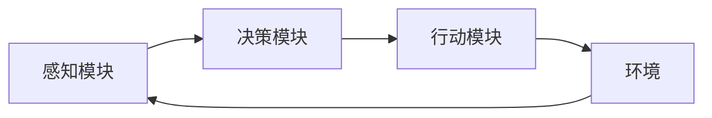

# AI Agent性能优化：监控、分析与调优技巧

> 关键词：AI Agent、性能优化、监控、分析、调优技巧

> 摘要：本文聚焦于AI Agent的性能优化，深入探讨了监控、分析与调优的相关技巧。首先介绍了背景信息，包括目的范围、预期读者等内容。接着阐述了AI Agent的核心概念与联系，详细讲解了核心算法原理和具体操作步骤，并结合数学模型和公式进行说明。通过项目实战给出代码实际案例及详细解释。还探讨了AI Agent的实际应用场景，推荐了相关的工具和资源。最后对未来发展趋势与挑战进行总结，并提供了常见问题解答和扩展阅读参考资料，旨在帮助读者全面掌握AI Agent性能优化的方法和策略。

## 1. 背景介绍 
### 1.1 目的和范围
随着人工智能技术的飞速发展，AI Agent在各个领域得到了广泛应用，如智能客服、自动驾驶、智能物流等。然而，AI Agent的性能表现直接影响其应用效果和用户体验。因此，对AI Agent进行性能优化显得尤为重要。本文的目的在于系统地介绍AI Agent性能优化的相关技巧，包括如何对AI Agent的性能进行监控、分析以及如何根据分析结果进行调优。范围涵盖了常见的AI Agent类型，如基于规则的Agent、学习型Agent等，同时涉及到多种性能指标，如响应时间、准确率、资源利用率等。

### 1.2 预期读者
本文预期读者主要包括人工智能领域的开发者、研究人员、软件架构师以及对AI Agent性能优化感兴趣的技术爱好者。对于开发者来说，本文可以帮助他们在实际项目中提高AI Agent的性能；研究人员可以从本文中获取相关的研究思路和方法；软件架构师可以参考本文的内容进行系统架构的设计和优化；技术爱好者则可以通过本文了解AI Agent性能优化的基本概念和技巧。

### 1.3 文档结构概述
本文将按照以下结构进行组织：首先介绍核心概念与联系，让读者对AI Agent有一个全面的认识；接着详细讲解核心算法原理和具体操作步骤，为性能优化提供理论基础；然后通过数学模型和公式进一步阐述性能优化的原理，并举例说明；之后进行项目实战，给出代码实际案例和详细解释；再探讨AI Agent的实际应用场景；推荐相关的工具和资源；最后总结未来发展趋势与挑战，提供常见问题解答和扩展阅读参考资料。

### 1.4 术语表
#### 1.4.1 核心术语定义
- **AI Agent**：即人工智能代理，是一种能够感知环境、根据感知信息进行决策并采取行动以实现特定目标的实体。它可以是软件程序、机器人等。
- **性能优化**：指通过一系列的技术和方法，提高系统或程序在特定指标下的性能表现，如提高运行速度、降低资源消耗等。
- **监控**：对AI Agent的运行状态和性能指标进行实时或定期的监测和记录。
- **分析**：对监控得到的数据进行深入研究和处理，找出性能瓶颈和问题所在。
- **调优**：根据分析结果，采取相应的措施对AI Agent进行调整和优化，以提高其性能。

#### 1.4.2 相关概念解释
- **感知**：AI Agent通过各种传感器或输入接口获取环境信息的过程。
- **决策**：AI Agent根据感知到的信息，运用一定的算法和策略，选择合适的行动方案的过程。
- **行动**：AI Agent根据决策结果，对环境进行操作或影响的过程。

#### 1.4.3 缩略词列表
- **CPU**：中央处理器（Central Processing Unit），是计算机的核心运算部件。
- **GPU**：图形处理器（Graphics Processing Unit），常用于加速深度学习等计算密集型任务。
- **RAM**：随机存取存储器（Random Access Memory），用于临时存储计算机运行时的数据。

## 2. 核心概念与联系 
### 核心概念原理
AI Agent的核心原理是基于感知 - 决策 - 行动的循环过程。AI Agent首先通过各种传感器或输入接口感知环境信息，将这些信息作为输入传递给决策模块。决策模块根据预设的算法和策略，对输入信息进行处理和分析，选择合适的行动方案。最后，行动模块根据决策结果对环境进行操作或影响，从而实现特定的目标。

### 架构的文本示意图
```plaintext
+---------------------+
|      感知模块       |
+---------------------+
         |
         v
+---------------------+
|      决策模块       |
+---------------------+
         |
         v
+---------------------+
|      行动模块       |
+---------------------+
         |
         v
+---------------------+
|       环境          |
+---------------------+
```

### Mermaid流程图


## 3. 核心算法原理 & 具体操作步骤 
### 算法原理讲解
在AI Agent中，常见的决策算法有基于规则的算法、机器学习算法等。这里以基于规则的算法为例进行讲解。基于规则的算法通过预先定义一系列的规则，根据感知到的信息匹配相应的规则，从而做出决策。

以下是一个简单的基于规则的AI Agent的Python代码示例：
```python
# 定义规则
rules = [
    {
        "condition": lambda perception: perception["temperature"] > 30,
        "action": "Turn on the air conditioner"
    },
    {
        "condition": lambda perception: perception["temperature"] < 10,
        "action": "Turn on the heater"
    },
    {
        "condition": lambda perception: 10 <= perception["temperature"] <= 30,
        "action": "Do nothing"
    }
]

# 定义AI Agent类
class AI_Agent:
    def __init__(self, rules):
        self.rules = rules

    def perceive(self, environment):
        # 模拟感知环境信息
        return environment

    def decide(self, perception):
        for rule in self.rules:
            if rule["condition"](perception):
                return rule["action"]
        return "No matching rule"

    def act(self, action):
        print(f"Taking action: {action}")

    def run(self, environment):
        perception = self.perceive(environment)
        action = self.decide(perception)
        self.act(action)

# 创建AI Agent实例
agent = AI_Agent(rules)

# 模拟环境信息
environment = {"temperature": 32}

# 运行AI Agent
agent.run(environment)
```

### 具体操作步骤
1. **定义规则**：根据具体的应用场景和需求，定义一系列的规则，每个规则包含一个条件和一个对应的行动。
2. **创建AI Agent类**：在类中实现感知、决策和行动三个方法。感知方法用于获取环境信息，决策方法根据感知到的信息匹配规则并做出决策，行动方法根据决策结果采取相应的行动。
3. **创建AI Agent实例**：根据定义的规则创建AI Agent的实例。
4. **模拟环境信息**：提供具体的环境信息作为AI Agent的输入。
5. **运行AI Agent**：调用AI Agent的运行方法，完成感知 - 决策 - 行动的循环过程。

## 4. 数学模型和公式 & 详细讲解 & 举例说明 
### 数学模型
在AI Agent的性能优化中，常用的数学模型有马尔可夫决策过程（MDP）。马尔可夫决策过程是一个离散时间的随机控制过程，由状态集合 $S$、动作集合 $A$、状态转移概率 $P(s'|s,a)$、奖励函数 $R(s,a,s')$ 和折扣因子 $\gamma$ 组成。

### 公式
- 状态转移概率：$P(s'|s,a)$ 表示在状态 $s$ 下采取动作 $a$ 后转移到状态 $s'$ 的概率。
- 奖励函数：$R(s,a,s')$ 表示在状态 $s$ 下采取动作 $a$ 并转移到状态 $s'$ 时获得的奖励。
- 价值函数：$V^\pi(s)$ 表示在策略 $\pi$ 下从状态 $s$ 开始的期望累计折扣奖励，其计算公式为：
$$V^\pi(s) = \mathbb{E}_\pi\left[\sum_{t=0}^{\infty}\gamma^tR(S_t,A_t,S_{t+1})|S_0 = s\right]$$
其中，$\gamma \in [0,1]$ 是折扣因子，用于权衡即时奖励和未来奖励。

### 详细讲解
马尔可夫决策过程的核心思想是通过选择合适的策略 $\pi$ 来最大化价值函数 $V^\pi(s)$。策略 $\pi$ 是一个从状态到动作的映射，即 $\pi(s) = a$ 表示在状态 $s$ 下采取动作 $a$。通过不断地与环境交互，AI Agent可以学习到最优策略 $\pi^*$，使得在每个状态下都能获得最大的期望累计折扣奖励。

### 举例说明
假设有一个简单的网格世界，AI Agent的目标是从起点移动到终点。状态集合 $S$ 表示网格中的每个位置，动作集合 $A$ 包括上下左右四个方向的移动。状态转移概率 $P(s'|s,a)$ 表示在状态 $s$ 下采取动作 $a$ 后转移到状态 $s'$ 的概率，例如，如果AI Agent在网格中向上移动，那么它有一定的概率成功移动到上方的网格，也有一定的概率因为障碍物等原因保持在原位置。奖励函数 $R(s,a,s')$ 可以根据AI Agent的移动结果给予不同的奖励，例如，如果AI Agent移动到终点，则给予一个正的奖励；如果AI Agent撞到障碍物，则给予一个负的奖励。通过马尔可夫决策过程，AI Agent可以学习到最优的移动策略，从而尽快到达终点。

## 5. 项目实战：代码实际案例和详细解释说明 
### 5.1  开发环境搭建
- **操作系统**：建议使用Linux系统，如Ubuntu 18.04及以上版本，因为Linux系统在开发和部署人工智能项目方面具有良好的稳定性和兼容性。
- **编程语言**：Python 3.7及以上版本，Python是人工智能领域最常用的编程语言，拥有丰富的库和工具。
- **开发工具**：可以使用PyCharm作为集成开发环境（IDE），它提供了强大的代码编辑、调试和项目管理功能。
- **相关库和框架**：安装NumPy、Pandas、Scikit-learn等常用的Python库，用于数据处理和机器学习；如果使用深度学习模型，还需要安装TensorFlow或PyTorch等深度学习框架。

### 5.2  源代码详细实现和代码解读
以下是一个使用Python和Scikit-learn库实现的简单AI Agent性能优化案例，该案例是一个基于决策树的分类器，用于对鸢尾花进行分类。

```python
import numpy as np
from sklearn.datasets import load_iris
from sklearn.model_selection import train_test_split
from sklearn.tree import DecisionTreeClassifier
from sklearn.metrics import accuracy_score

# 加载鸢尾花数据集
iris = load_iris()
X = iris.data
y = iris.target

# 划分训练集和测试集
X_train, X_test, y_train, y_test = train_test_split(X, y, test_size=0.2, random_state=42)

# 创建决策树分类器
clf = DecisionTreeClassifier()

# 训练模型
clf.fit(X_train, y_train)

# 预测测试集
y_pred = clf.predict(X_test)

# 计算准确率
accuracy = accuracy_score(y_test, y_pred)
print(f"Accuracy: {accuracy}")

# 性能优化：调整决策树的参数
clf_optimized = DecisionTreeClassifier(max_depth=3, min_samples_split=5)
clf_optimized.fit(X_train, y_train)
y_pred_optimized = clf_optimized.predict(X_test)
accuracy_optimized = accuracy_score(y_test, y_pred_optimized)
print(f"Optimized accuracy: {accuracy_optimized}")
```

### 代码解读与分析
1. **数据加载和划分**：使用 `load_iris` 函数加载鸢尾花数据集，将数据集划分为特征矩阵 $X$ 和标签向量 $y$。然后使用 `train_test_split` 函数将数据集划分为训练集和测试集，其中测试集占比为20%。
2. **模型创建和训练**：创建一个决策树分类器 `DecisionTreeClassifier` 的实例，并使用训练集对模型进行训练。
3. **模型预测和评估**：使用训练好的模型对测试集进行预测，并使用 `accuracy_score` 函数计算预测结果的准确率。
4. **性能优化**：通过调整决策树的参数，如 `max_depth` 和 `min_samples_split`，创建一个优化后的决策树分类器，并重新进行训练和预测。最后比较优化前后的准确率，评估性能优化的效果。

## 6. 实际应用场景 
### 智能客服
在智能客服场景中，AI Agent可以通过自然语言处理技术理解用户的问题，并根据预设的规则或机器学习模型给出相应的回答。性能优化可以提高AI Agent的响应速度和回答准确率，从而提升用户体验。例如，通过优化模型的训练算法和参数，减少模型的推理时间，使AI Agent能够更快地给出回答；通过增加训练数据和改进模型结构，提高模型的泛化能力，使AI Agent能够更准确地回答各种类型的问题。

### 自动驾驶
在自动驾驶场景中，AI Agent需要实时感知周围环境，做出决策并控制车辆的行驶。性能优化对于保障自动驾驶的安全性和可靠性至关重要。例如，通过优化传感器数据的处理算法，减少数据处理时间，使AI Agent能够更快地获取准确的环境信息；通过优化决策算法，提高决策的准确性和实时性，使AI Agent能够在复杂的交通环境中做出合理的决策。

### 智能物流
在智能物流场景中，AI Agent可以用于优化物流路径规划、货物调度等任务。性能优化可以提高物流效率，降低成本。例如，通过优化路径规划算法，减少车辆的行驶里程和时间，提高物流配送的效率；通过优化货物调度算法，合理分配货物和车辆资源，降低物流成本。

## 7. 工具和资源推荐
### 7.1 学习资源推荐
#### 7.1.1 书籍推荐
- 《人工智能：一种现代的方法》（Artificial Intelligence: A Modern Approach）：这是一本经典的人工智能教材，涵盖了AI Agent、搜索算法、机器学习、自然语言处理等多个领域的内容，适合作为人工智能领域的入门书籍。
- 《Python机器学习》（Python Machine Learning）：该书详细介绍了使用Python进行机器学习的方法和技巧，包括数据预处理、模型选择、模型评估等内容，对于想要使用Python进行AI Agent开发的读者来说是一本很好的参考书籍。

#### 7.1.2 在线课程
- Coursera上的“人工智能基础”（Foundations of Artificial Intelligence）课程：由知名教授授课，系统地介绍了人工智能的基本概念、算法和应用，适合初学者学习。
- edX上的“深度学习”（Deep Learning）课程：该课程深入讲解了深度学习的原理和应用，包括神经网络、卷积神经网络、循环神经网络等内容，对于想要深入学习深度学习的读者来说是一个不错的选择。

#### 7.1.3 技术博客和网站
- Medium上的人工智能相关博客：Medium上有很多人工智能领域的专家和开发者分享他们的经验和见解，读者可以从中获取最新的技术动态和研究成果。
- arXiv.org：这是一个预印本服务器，提供了大量的人工智能相关的研究论文，读者可以通过该网站了解最新的研究进展。

### 7.2 开发工具框架推荐
#### 7.2.1 IDE和编辑器
- PyCharm：是一款专门为Python开发设计的集成开发环境，提供了丰富的代码编辑、调试和项目管理功能，适合专业的Python开发者使用。
- Jupyter Notebook：是一个交互式的开发环境，支持Python等多种编程语言，适合进行数据分析和模型实验。

#### 7.2.2 调试和性能分析工具
- TensorBoard：是TensorFlow提供的一个可视化工具，可以用于监控模型的训练过程、可视化模型的结构和性能指标等。
- cProfile：是Python标准库中的一个性能分析工具，可以用于分析Python代码的性能瓶颈。

#### 7.2.3 相关框架和库
- TensorFlow：是一个开源的深度学习框架，提供了丰富的深度学习模型和工具，支持CPU、GPU等多种计算设备。
- PyTorch：是另一个流行的深度学习框架，具有动态图的特点，易于使用和调试，受到了很多研究人员和开发者的喜爱。

### 7.3 相关论文著作推荐
#### 7.3.1 经典论文
- “A Unified Approach to Interpreting Model Predictions”：该论文提出了一种统一的方法来解释模型的预测结果，对于理解和优化AI Agent的决策过程具有重要的参考价值。
- “Attention Is All You Need”：该论文提出了Transformer模型，是自然语言处理领域的一项重要突破，对于提高AI Agent在自然语言处理任务中的性能具有重要的意义。

#### 7.3.2 最新研究成果
- 关注NeurIPS、ICML、CVPR等顶级人工智能会议的论文，这些会议汇集了人工智能领域的最新研究成果，读者可以从中了解到最前沿的技术和方法。

#### 7.3.3 应用案例分析
- 阅读一些关于AI Agent在实际应用场景中的案例分析报告，如智能客服、自动驾驶等领域的案例，从中学习如何将理论知识应用到实际项目中，以及如何解决实际问题。

## 8. 总结：未来发展趋势与挑战
### 未来发展趋势
- **智能化程度不断提高**：未来的AI Agent将具备更强的学习能力和推理能力，能够更好地理解和应对复杂的环境和任务。例如，AI Agent可以通过强化学习不断优化自己的决策策略，提高解决问题的能力。
- **与其他技术的融合**：AI Agent将与物联网、大数据、云计算等技术深度融合，实现更加智能化的应用。例如，在智能家居场景中，AI Agent可以通过与物联网设备的连接，实现对家居设备的智能控制和管理。
- **多Agent系统的发展**：多个AI Agent之间的协作和交互将成为未来的研究热点。多Agent系统可以通过分工合作，共同完成复杂的任务，提高系统的整体性能和效率。

### 挑战
- **数据隐私和安全问题**：AI Agent的训练和运行需要大量的数据，如何保护数据的隐私和安全是一个亟待解决的问题。例如，在智能医疗场景中，AI Agent需要处理患者的敏感医疗数据，如何确保这些数据不被泄露和滥用是一个重要的挑战。
- **可解释性问题**：目前的很多AI Agent模型，如深度学习模型，具有很强的黑盒性，难以解释其决策过程和结果。这在一些对安全性和可靠性要求较高的场景中，如自动驾驶、金融风控等，是一个很大的障碍。
- **性能优化的难度增加**：随着AI Agent的功能和复杂度不断增加，性能优化的难度也越来越大。需要开发更加高效的优化算法和工具，以满足不断增长的性能需求。

## 9. 附录：常见问题与解答
### 问题1：如何选择合适的性能指标来监控AI Agent？
解答：选择合适的性能指标需要根据AI Agent的具体应用场景和目标来确定。例如，在智能客服场景中，可以选择响应时间、回答准确率等指标；在自动驾驶场景中，可以选择安全性指标、行驶效率指标等。同时，还需要考虑指标的可测量性和可操作性。

### 问题2：如何对AI Agent的性能进行有效的分析？
解答：可以使用多种方法对AI Agent的性能进行分析，如统计分析、可视化分析、模型解释等。统计分析可以通过计算各种性能指标的统计量，如均值、标准差等，来了解性能的整体情况；可视化分析可以通过绘制图表和图形，直观地展示性能的变化趋势和分布情况；模型解释可以通过解释模型的决策过程和结果，找出性能瓶颈和问题所在。

### 问题3：在性能优化过程中，如何平衡不同性能指标之间的关系？
解答：在性能优化过程中，不同的性能指标之间可能存在相互制约的关系。例如，提高模型的准确率可能会导致响应时间增加。因此，需要根据具体的应用场景和需求，确定各个性能指标的权重，通过多目标优化的方法来平衡不同性能指标之间的关系。

## 10. 扩展阅读 & 参考资料
### 扩展阅读
- 《强化学习：原理与Python实现》：深入介绍了强化学习的原理和算法，并通过Python代码进行了详细的实现和解释，对于想要深入学习强化学习的读者来说是一本很好的参考书籍。
- 《自然语言处理入门》：系统地介绍了自然语言处理的基本概念、算法和应用，适合对自然语言处理感兴趣的读者阅读。

### 参考资料
- 相关的学术论文和研究报告，可以通过学术数据库如IEEE Xplore、ACM Digital Library等进行查找。
- 开源项目的文档和代码，如TensorFlow、PyTorch等开源框架的官方文档和代码仓库，可以从中学习到很多实用的技术和方法。

作者：AI天才研究院/AI Genius Institute & 禅与计算机程序设计艺术 /Zen And The Art of Computer Programming