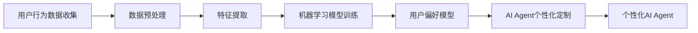

# AI Agent的个性化定制：用户偏好学习与应用

> 关键词：AI Agent、个性化定制、用户偏好学习、用户行为分析、应用场景

> 摘要：本文围绕AI Agent的个性化定制展开，深入探讨用户偏好学习及其应用。首先介绍背景知识，包括目的范围、预期读者等。接着阐述AI Agent、用户偏好学习等核心概念及联系，给出原理和架构示意图与流程图。详细讲解核心算法原理及操作步骤，用Python代码说明。通过数学模型和公式进一步剖析，结合实际案例进行项目实战，解释开发环境搭建、代码实现与解读。探讨实际应用场景，推荐相关工具和资源，包括学习资源、开发工具框架、论文著作等。最后总结未来发展趋势与挑战，提供常见问题解答及扩展阅读参考资料，旨在为读者全面呈现AI Agent个性化定制的技术全貌。

## 1. 背景介绍 
### 1.1 目的和范围
在当今数字化时代，AI Agent的应用越来越广泛，从智能客服到智能家居助手等。然而，通用的AI Agent往往无法满足每个用户的独特需求。本文的目的在于深入研究如何通过学习用户偏好对AI Agent进行个性化定制，以提升用户体验和服务质量。范围涵盖了用户偏好学习的原理、算法，以及如何将这些学习结果应用到AI Agent的实际开发和应用中。

### 1.2 预期读者
本文预期读者包括人工智能领域的研究人员、程序员、软件架构师，以及对AI Agent个性化定制感兴趣的技术爱好者。对于正在从事相关项目开发的专业人士，本文可以提供技术思路和实践指导；对于初学者，能帮助他们建立对该领域的基本认知和理解。

### 1.3 文档结构概述
本文首先介绍背景知识，让读者了解研究的目的和相关信息。接着阐述核心概念及联系，包括AI Agent、用户偏好学习等概念的原理和架构。然后详细讲解核心算法原理和具体操作步骤，通过Python代码进行说明。利用数学模型和公式进一步分析问题。通过项目实战展示如何将理论应用到实际中，包括开发环境搭建、代码实现和解读。探讨实际应用场景，为读者提供应用思路。推荐相关的工具和资源，帮助读者深入学习和实践。最后总结未来发展趋势与挑战，提供常见问题解答和扩展阅读参考资料。

### 1.4 术语表
#### 1.4.1 核心术语定义
- **AI Agent（人工智能代理）**：能够感知环境、做出决策并采取行动以实现特定目标的智能实体。它可以是软件程序、机器人等。
- **个性化定制**：根据用户的独特特征和偏好，为用户提供定制化的服务和体验。
- **用户偏好学习**：通过收集和分析用户的行为数据，推断出用户的喜好和需求的过程。

#### 1.4.2 相关概念解释
- **用户行为数据**：用户在与系统交互过程中产生的数据，如搜索记录、浏览历史、购买记录等。
- **特征工程**：从原始数据中提取有用的特征，以便机器学习算法能够更好地理解和处理数据。

#### 1.4.3 缩略词列表
- **ML（Machine Learning）**：机器学习
- **DL（Deep Learning）**：深度学习
- **NLP（Natural Language Processing）**：自然语言处理

## 2. 核心概念与联系 
### 核心概念原理
#### AI Agent
AI Agent的核心原理基于感知、决策和行动的循环。它通过传感器感知环境信息，然后利用内部的决策模型对这些信息进行分析和处理，最后根据决策结果采取相应的行动。例如，智能客服AI Agent会感知用户的提问，通过自然语言处理技术理解问题，然后从知识库中查找答案并回复用户。

#### 用户偏好学习
用户偏好学习的原理是基于数据分析和机器学习。通过收集用户的行为数据，如点击记录、购买历史等，利用机器学习算法挖掘数据中的模式和规律，从而推断出用户的偏好。例如，通过分析用户的购物记录，可以了解用户喜欢的商品类别、品牌等。

### 架构的文本示意图
```plaintext
用户行为数据收集模块 -> 数据预处理模块 -> 特征提取模块 -> 机器学习模型训练模块 -> 用户偏好模型 -> AI Agent个性化定制模块 -> 个性化AI Agent
```

### Mermaid流程图


## 3. 核心算法原理 & 具体操作步骤 
### 核心算法原理
在用户偏好学习中，常用的算法有协同过滤算法、深度学习算法等。这里以协同过滤算法为例进行讲解。协同过滤算法的核心思想是基于用户之间的相似性或物品之间的相似性来推荐用户可能感兴趣的物品。

### 具体操作步骤
#### 数据收集
收集用户的行为数据，如用户的评分、购买记录等。以下是一个简单的Python代码示例来模拟数据收集：
```python
# 模拟用户评分数据
user_ratings = {
    'user1': {'item1': 5, 'item2': 3, 'item3': 4},
    'user2': {'item1': 4, 'item2': 2, 'item4': 5},
    'user3': {'item2': 4, 'item3': 3, 'item4': 2}
}
```
#### 数据预处理
对收集到的数据进行清洗和转换，去除缺失值和异常值。以下是一个简单的数据预处理代码示例：
```python
def preprocess_data(user_ratings):
    # 处理缺失值，这里简单地将缺失值设为0
    all_items = set()
    for user in user_ratings:
        all_items.update(user_ratings[user].keys())
    processed_ratings = {}
    for user in user_ratings:
        processed_ratings[user] = {}
        for item in all_items:
            if item in user_ratings[user]:
                processed_ratings[user][item] = user_ratings[user][item]
            else:
                processed_ratings[user][item] = 0
    return processed_ratings

processed_ratings = preprocess_data(user_ratings)
```
#### 计算用户相似度
使用皮尔逊相关系数等方法计算用户之间的相似度。以下是计算皮尔逊相关系数的Python代码：
```python
import math

def pearson_similarity(user1, user2, ratings):
    common_items = []
    for item in ratings[user1]:
        if item in ratings[user2]:
            common_items.append(item)
    if len(common_items) == 0:
        return 0
    sum1 = sum([ratings[user1][item] for item in common_items])
    sum2 = sum([ratings[user2][item] for item in common_items])
    sum1_sq = sum([pow(ratings[user1][item], 2) for item in common_items])
    sum2_sq = sum([pow(ratings[user2][item], 2) for item in common_items])
    p_sum = sum([ratings[user1][item] * ratings[user2][item] for item in common_items])
    num = p_sum - (sum1 * sum2 / len(common_items))
    den = math.sqrt((sum1_sq - pow(sum1, 2) / len(common_items)) * (sum2_sq - pow(sum2, 2) / len(common_items)))
    if den == 0:
        return 0
    return num / den

similarity_matrix = {}
users = list(processed_ratings.keys())
for i in range(len(users)):
    similarity_matrix[users[i]] = {}
    for j in range(i + 1, len(users)):
        similarity = pearson_similarity(users[i], users[j], processed_ratings)
        similarity_matrix[users[i]][users[j]] = similarity
        similarity_matrix[users[j]][users[i]] = similarity
```
#### 推荐物品
根据用户相似度为用户推荐物品。以下是推荐物品的Python代码：
```python
def recommend_items(user, ratings, similarity_matrix, top_n=3):
    user_ratings = ratings[user]
    total_scores = {}
    similarity_sums = {}
    for other_user in similarity_matrix[user]:
        sim = similarity_matrix[user][other_user]
        if sim <= 0:
            continue
        for item in ratings[other_user]:
            if item not in user_ratings or user_ratings[item] == 0:
                if item not in total_scores:
                    total_scores[item] = 0
                    similarity_sums[item] = 0
                total_scores[item] += ratings[other_user][item] * sim
                similarity_sums[item] += sim
    rankings = [(total_scores[item] / similarity_sums[item], item) for item in total_scores]
    rankings.sort(reverse=True)
    return rankings[:top_n]

recommended_items = recommend_items('user1', processed_ratings, similarity_matrix)
print(recommended_items)
```

## 4. 数学模型和公式 & 详细讲解 & 举例说明 
### 皮尔逊相关系数公式
皮尔逊相关系数用于衡量两个变量之间的线性相关性，在协同过滤算法中用于计算用户之间的相似度。公式如下：
$$
r_{xy}=\frac{\sum_{i = 1}^{n}(x_i-\bar{x})(y_i-\bar{y})}{\sqrt{\sum_{i = 1}^{n}(x_i-\bar{x})^2\sum_{i = 1}^{n}(y_i-\bar{y})^2}}
$$
其中，$x_i$ 和 $y_i$ 分别是用户 $x$ 和用户 $y$ 对第 $i$ 个物品的评分，$\bar{x}$ 和 $\bar{y}$ 分别是用户 $x$ 和用户 $y$ 的平均评分，$n$ 是用户 $x$ 和用户 $y$ 共同评分的物品数量。

### 详细讲解
分子部分 $\sum_{i = 1}^{n}(x_i-\bar{x})(y_i-\bar{y})$ 衡量了两个用户评分的协同变化程度。如果两个用户对共同物品的评分趋势一致，那么该值为正；如果趋势相反，该值为负。分母部分 $\sqrt{\sum_{i = 1}^{n}(x_i-\bar{x})^2\sum_{i = 1}^{n}(y_i-\bar{y})^2}$ 用于归一化，使得相关系数的值在 $[-1, 1]$ 之间。

### 举例说明
假设有两个用户 $A$ 和 $B$，他们对三个物品的评分如下：
| 用户 | 物品1 | 物品2 | 物品3 |
| ---- | ---- | ---- | ---- |
| A    | 5    | 3    | 4    |
| B    | 4    | 2    | 5    |

首先计算用户 $A$ 的平均评分 $\bar{x}=\frac{5 + 3 + 4}{3}=4$，用户 $B$ 的平均评分 $\bar{y}=\frac{4 + 2 + 5}{3}=\frac{11}{3}$。

分子部分：
$$
\begin{align*}
&\sum_{i = 1}^{3}(x_i-\bar{x})(y_i-\bar{y})\\
=&(5 - 4)\times(4-\frac{11}{3})+(3 - 4)\times(2-\frac{11}{3})+(4 - 4)\times(5-\frac{11}{3})\\
=&1\times\frac{1}{3}+(-1)\times(-\frac{5}{3})+0\times\frac{4}{3}\\
=&\frac{1 + 5}{3}\\
=&2
\end{align*}
$$

分母部分：
$$
\begin{align*}
&\sqrt{\sum_{i = 1}^{3}(x_i-\bar{x})^2\sum_{i = 1}^{3}(y_i-\bar{y})^2}\\
=&\sqrt{( (5 - 4)^2+(3 - 4)^2+(4 - 4)^2 )\times( (4-\frac{11}{3})^2+(2-\frac{11}{3})^2+(5-\frac{11}{3})^2 )}\\
=&\sqrt{(1 + 1 + 0)\times( (\frac{1}{3})^2+(-\frac{5}{3})^2+(\frac{4}{3})^2 )}\\
=&\sqrt{2\times\frac{1 + 25 + 16}{9}}\\
=&\sqrt{2\times\frac{42}{9}}\\
=&\sqrt{\frac{28}{3}}
\end{align*}
$$

皮尔逊相关系数 $r_{AB}=\frac{2}{\sqrt{\frac{28}{3}}}\approx0.65$，表示用户 $A$ 和用户 $B$ 有一定的相似性。

## 5. 项目实战：代码实际案例和详细解释说明 
### 5.1  开发环境搭建
#### 安装Python
首先需要安装Python，建议使用Python 3.7及以上版本。可以从Python官方网站（https://www.python.org/downloads/）下载安装包进行安装。

#### 安装必要的库
使用以下命令安装必要的库：
```sh
pip install numpy pandas scikit-learn
```
### 5.2  源代码详细实现和代码解读
#### 数据加载和预处理
```python
import pandas as pd
from sklearn.preprocessing import MinMaxScaler

# 加载数据
data = pd.read_csv('user_behavior_data.csv')

# 数据预处理
scaler = MinMaxScaler()
numerical_columns = data.select_dtypes(include=['number']).columns
data[numerical_columns] = scaler.fit_transform(data[numerical_columns])

# 处理缺失值
data = data.fillna(0)
```
**代码解读**：首先使用 `pandas` 库加载用户行为数据。然后使用 `MinMaxScaler` 对数值型数据进行归一化处理，将数据缩放到 $[0, 1]$ 范围内。最后使用 `fillna` 方法处理缺失值，将缺失值填充为0。

#### 特征提取
```python
from sklearn.feature_extraction.text import TfidfVectorizer

# 提取文本特征
text_column = 'search_query'
vectorizer = TfidfVectorizer()
text_features = vectorizer.fit_transform(data[text_column])

# 合并特征
from scipy.sparse import hstack
numerical_features = data[numerical_columns].values
all_features = hstack((text_features, numerical_features))
```
**代码解读**：使用 `TfidfVectorizer` 对文本数据进行特征提取，将文本转换为数值特征。然后使用 `hstack` 方法将文本特征和数值特征合并为一个特征矩阵。

#### 模型训练
```python
from sklearn.model_selection import train_test_split
from sklearn.ensemble import RandomForestClassifier

# 划分训练集和测试集
X_train, X_test, y_train, y_test = train_test_split(all_features, data['preferred_category'], test_size=0.2, random_state=42)

# 训练模型
model = RandomForestClassifier()
model.fit(X_train, y_train)
```
**代码解读**：使用 `train_test_split` 方法将数据集划分为训练集和测试集，测试集占比为20%。然后使用 `RandomForestClassifier` 训练一个随机森林分类器。

#### 模型评估
```python
from sklearn.metrics import accuracy_score

# 预测
y_pred = model.predict(X_test)

# 评估模型
accuracy = accuracy_score(y_test, y_pred)
print(f"模型准确率: {accuracy}")
```
**代码解读**：使用训练好的模型对测试集进行预测，然后使用 `accuracy_score` 计算模型的准确率。

### 5.3  代码解读与分析
通过以上代码，我们完成了一个完整的用户偏好学习项目。从数据加载和预处理开始，对数据进行清洗和转换，以便后续的特征提取和模型训练。特征提取阶段将文本数据和数值数据转换为适合机器学习模型处理的特征矩阵。模型训练阶段使用随机森林分类器进行训练，最后对模型进行评估。整个过程展示了如何从原始数据中学习用户偏好，并使用机器学习模型进行预测。

## 6. 实际应用场景 
### 智能推荐系统
在电商平台、音乐平台、视频平台等，AI Agent可以根据用户的历史行为和偏好，为用户推荐个性化的商品、音乐、视频等。例如，亚马逊的商品推荐系统会根据用户的浏览历史、购买记录等推荐用户可能感兴趣的商品。

### 智能客服
智能客服AI Agent可以根据用户的历史咨询记录和偏好，提供个性化的服务和解答。例如，当用户再次咨询时，客服可以根据用户之前的问题和偏好，快速准确地提供解决方案。

### 智能家居
智能家居系统中的AI Agent可以学习用户的生活习惯和偏好，自动调整家居设备的状态。例如，根据用户的起床时间自动调节灯光亮度，根据用户的睡眠习惯自动调节空调温度等。

### 教育领域
在在线教育平台，AI Agent可以根据学生的学习历史和偏好，为学生提供个性化的学习计划和推荐学习资源。例如，根据学生的薄弱知识点推荐相关的练习题和课程。

## 7. 工具和资源推荐
### 7.1 学习资源推荐
#### 7.1.1 书籍推荐
- 《机器学习》（周志华）：全面介绍了机器学习的基本概念、算法和应用，是机器学习领域的经典教材。
- 《深度学习》（Ian Goodfellow等）：详细讲解了深度学习的理论和实践，适合有一定机器学习基础的读者。
- 《Python机器学习实战》（Sebastian Raschka）：通过实际案例介绍了如何使用Python进行机器学习项目开发。

#### 7.1.2 在线课程
- Coursera上的“机器学习”课程（Andrew Ng教授）：经典的机器学习课程，深入浅出地介绍了机器学习的基本原理和算法。
- edX上的“深度学习专项课程”：由深度学习领域的知名学者授课，系统地介绍了深度学习的各个方面。
- 中国大学MOOC上的“人工智能基础”课程：适合初学者了解人工智能的基本概念和技术。

#### 7.1.3 技术博客和网站
- Medium：有很多人工智能领域的优秀博客文章，涵盖了最新的研究成果和实践经验。
- Towards Data Science：专注于数据科学和机器学习领域的技术博客，提供了丰富的教程和案例。
- AI开源社区：如GitHub上有很多开源的人工智能项目和代码，可以学习和参考。

### 7.2 开发工具框架推荐
#### 7.2.1 IDE和编辑器
- PyCharm：功能强大的Python集成开发环境，提供了代码编辑、调试、版本控制等功能。
- Jupyter Notebook：交互式的开发环境，适合数据探索和模型实验，方便代码的展示和分享。
- Visual Studio Code：轻量级的代码编辑器，支持多种编程语言，有丰富的插件扩展。

#### 7.2.2 调试和性能分析工具
- TensorBoard：用于可视化深度学习模型的训练过程和性能指标，帮助开发者调试和优化模型。
- Py-Spy：用于分析Python代码的性能瓶颈，找出耗时的代码段。
- cProfile：Python内置的性能分析工具，可以统计函数的调用次数和执行时间。

#### 7.2.3 相关框架和库
- TensorFlow：Google开发的深度学习框架，支持多种深度学习模型的开发和训练。
- PyTorch：Facebook开发的深度学习框架，具有动态图的特点，易于使用和调试。
- Scikit-learn：用于机器学习的Python库，提供了丰富的机器学习算法和工具。

### 7.3 相关论文著作推荐
#### 7.3.1 经典论文
- “A Taxonomy of Recommender Systems”：对推荐系统进行了分类和综述，是推荐系统领域的经典论文。
- “Deep Learning”：由Yoshua Bengio、Geoffrey Hinton和Yann LeCun撰写，全面介绍了深度学习的发展和应用。
- “The Matrix Factorization Technique for Recommender Systems”：介绍了矩阵分解技术在推荐系统中的应用。

#### 7.3.2 最新研究成果
- 关注顶级学术会议如NeurIPS、ICML、ACL等的论文，了解人工智能领域的最新研究动态。
- 学术期刊如Journal of Artificial Intelligence Research (JAIR)、Artificial Intelligence等也会发表高质量的研究论文。

#### 7.3.3 应用案例分析
- 一些知名企业的技术博客会分享他们在AI Agent个性化定制方面的应用案例，如Google、Amazon、Netflix等。
- 研究机构和学者也会发布一些实际应用案例的分析报告，可以从中学习到实际项目的经验和技巧。

## 8. 总结：未来发展趋势与挑战
### 未来发展趋势
#### 多模态融合
未来的AI Agent将不仅依赖于文本数据，还会融合图像、语音、视频等多模态数据来学习用户偏好，提供更加丰富和个性化的服务。例如，智能助手可以通过识别用户的面部表情和语音语调来更好地理解用户的情绪和需求。

#### 强化学习的应用
强化学习可以使AI Agent在与用户的交互过程中不断学习和优化，以获得更好的用户体验。例如，智能家居系统中的AI Agent可以通过强化学习自动调整设备的状态，以达到节能和舒适的最佳平衡。

#### 联邦学习
随着数据隐私保护的重要性日益增加，联邦学习将成为AI Agent个性化定制的重要技术。联邦学习允许在不共享原始数据的情况下进行模型训练，保护用户的数据隐私。

### 挑战
#### 数据隐私和安全
用户偏好学习需要收集大量的用户行为数据，这涉及到数据隐私和安全问题。如何在保护用户数据隐私的前提下进行有效的用户偏好学习是一个亟待解决的问题。

#### 数据质量和多样性
用户行为数据的质量和多样性会影响用户偏好学习的效果。如果数据存在噪声、偏差或不完整，可能会导致模型的性能下降。因此，如何提高数据质量和多样性是一个挑战。

#### 模型可解释性
深度学习模型在用户偏好学习中取得了很好的效果，但这些模型往往是黑盒模型，缺乏可解释性。在一些应用场景中，如医疗、金融等，模型的可解释性非常重要。如何提高模型的可解释性是一个需要研究的问题。

## 9. 附录：常见问题与解答
### 问题1：如何收集高质量的用户行为数据？
答：可以通过多种方式收集用户行为数据，如网站日志、应用程序埋点、用户问卷调查等。为了保证数据质量，需要确保数据的准确性、完整性和一致性。同时，要遵守相关的数据隐私法规，获得用户的同意。

### 问题2：用户偏好学习模型的训练时间过长怎么办？
答：可以采取以下措施来缩短训练时间：使用更高效的算法和模型，如随机森林、梯度提升树等；对数据进行降维处理，减少特征数量；使用分布式计算或云计算资源，提高计算能力。

### 问题3：如何评估用户偏好学习模型的性能？
答：可以使用多种指标来评估模型的性能，如准确率、召回率、F1值、均方误差等。具体选择哪种指标取决于具体的应用场景。例如，在分类问题中，可以使用准确率、召回率和F1值；在回归问题中，可以使用均方误差。

### 问题4：如何处理用户偏好的动态变化？
答：可以定期更新用户偏好模型，以适应用户偏好的动态变化。例如，可以设置一个时间窗口，每隔一段时间重新训练模型。同时，可以使用在线学习算法，使模型能够实时更新。

## 10. 扩展阅读 & 参考资料
### 扩展阅读
- 《人工智能：现代方法》（Stuart Russell和Peter Norvig）：全面介绍了人工智能的各个领域，包括知识表示、推理、学习、规划等。
- 《推荐系统实践》（项亮）：详细介绍了推荐系统的原理、算法和实践经验，适合从事推荐系统开发的人员阅读。
- 《数据挖掘：概念与技术》（Jiawei Han等）：介绍了数据挖掘的基本概念、算法和应用，对用户偏好学习中的数据处理和分析有很大帮助。

### 参考资料
- 各个学术会议和期刊的官方网站，如NeurIPS、ICML、ACL、JAIR等。
- 相关技术博客和论坛，如Medium、Towards Data Science、Stack Overflow等。
- 开源项目和代码库，如GitHub上的人工智能相关项目。

作者：AI天才研究院/AI Genius Institute & 禅与计算机程序设计艺术 /Zen And The Art of Computer Programming