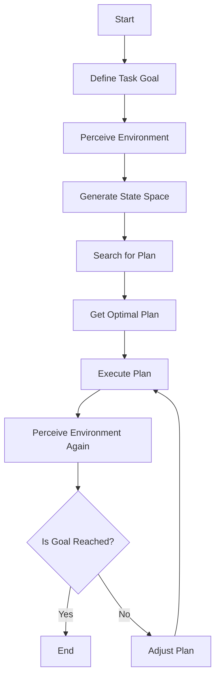

# AI Agent的任务规划与执行模块开发

> 关键词：AI Agent、任务规划、任务执行、模块开发、人工智能

> 摘要：本文聚焦于AI Agent的任务规划与执行模块开发，深入探讨了该领域的核心概念、算法原理、数学模型等内容。首先介绍了开发的背景，包括目的、预期读者和文档结构等。接着详细阐述了核心概念及其联系，给出了原理和架构的示意图与流程图。通过Python源代码详细讲解了核心算法原理和具体操作步骤，并对数学模型和公式进行了深入分析与举例说明。结合项目实战，展示了代码实际案例并进行详细解释。同时探讨了实际应用场景，推荐了相关的学习资源、开发工具框架和论文著作。最后总结了未来发展趋势与挑战，并提供了常见问题解答和扩展阅读参考资料，旨在为相关开发者和研究者提供全面而深入的技术指导。

## 1. 背景介绍 
### 1.1 目的和范围
随着人工智能技术的飞速发展，AI Agent在各个领域的应用越来越广泛。AI Agent的任务规划与执行模块是其核心组成部分，它决定了AI Agent能否高效、准确地完成各种任务。本开发的目的在于设计并实现一个高效、灵活且具有良好扩展性的AI Agent任务规划与执行模块，使其能够适应不同类型的任务和复杂的环境。

本开发的范围涵盖了从核心概念的理解到具体代码实现的全过程，包括任务规划算法的设计、执行流程的优化、数学模型的建立以及实际项目中的应用等方面。同时，还将探讨该模块在不同场景下的应用和未来的发展趋势。

### 1.2 预期读者
本文的预期读者主要包括人工智能领域的开发者、研究者，以及对AI Agent技术感兴趣的程序员和软件架构师。对于那些希望深入了解AI Agent任务规划与执行机制，并将其应用于实际项目中的人员来说，本文将提供有价值的参考。

### 1.3 文档结构概述
本文将按照以下结构进行组织：首先介绍背景知识，包括目的、预期读者和文档结构等。然后详细阐述核心概念与联系，给出原理和架构的示意图与流程图。接着讲解核心算法原理和具体操作步骤，通过Python源代码进行详细说明。之后分析数学模型和公式，并举例说明。结合项目实战，展示代码实际案例并进行详细解释。探讨实际应用场景，推荐相关的学习资源、开发工具框架和论文著作。最后总结未来发展趋势与挑战，提供常见问题解答和扩展阅读参考资料。

### 1.4 术语表
#### 1.4.1 核心术语定义
- **AI Agent**：人工智能代理，是一种能够感知环境、做出决策并执行行动的智能实体。
- **任务规划**：根据目标和环境信息，制定一系列的行动步骤，以实现特定的任务。
- **任务执行**：按照规划好的步骤，实际执行相应的行动，以达到任务目标。
- **状态空间**：所有可能的状态的集合，AI Agent在执行任务过程中会在状态空间中进行转移。
- **启发式函数**：用于评估某个状态到目标状态的距离或代价，帮助任务规划算法更快地找到最优解。

#### 1.4.2 相关概念解释
- **目标导向**：AI Agent的任务规划和执行都是以实现特定的目标为导向的，通过不断地调整行动来趋近目标。
- **环境感知**：AI Agent需要感知周围的环境信息，包括资源状况、障碍物等，以便做出合理的决策。
- **动态规划**：一种在状态空间中寻找最优解的算法，通过将大问题分解为小问题，逐步求解。

#### 1.4.3 缩略词列表
- **AI**：Artificial Intelligence，人工智能
- **RRT**：Rapidly-exploring Random Trees，快速探索随机树
- **A***：A-star，一种启发式搜索算法

## 2. 核心概念与联系 
### 核心概念原理
AI Agent的任务规划与执行模块主要由任务规划器和任务执行器两部分组成。任务规划器的主要功能是根据任务目标和当前环境信息，生成一系列的行动步骤，即规划。任务执行器则负责按照规划好的步骤，实际执行相应的行动。

任务规划的过程可以看作是在状态空间中寻找一条从初始状态到目标状态的路径。状态空间是所有可能的状态的集合，每个状态代表了AI Agent和环境的一种特定组合。任务规划器通过搜索算法在状态空间中进行搜索，找到一条最优或次优的路径。

任务执行的过程则是AI Agent根据规划好的路径，依次执行每个行动，直到达到目标状态。在执行过程中，AI Agent需要不断地感知环境信息，根据实际情况调整行动，以确保任务的顺利完成。

### 架构的文本示意图
```plaintext
+---------------------+
|     AI Agent        |
+---------------------+
|  Task Planner       |
|  - Goal Definition  |
|  - State Space      |
|  - Search Algorithm |
+---------------------+
|  Task Executor      |
|  - Action Execution |
|  - Environment Perception |
|  - Action Adjustment |
+---------------------+
```

### Mermaid流程图


## 3. 核心算法原理 & 具体操作步骤 
### 核心算法原理
在AI Agent的任务规划中，常用的搜索算法有A*算法和RRT算法等。这里以A*算法为例进行详细讲解。

A*算法是一种启发式搜索算法，它结合了Dijkstra算法的最优路径搜索和贪心最佳优先搜索的启发式搜索思想。A*算法通过维护一个开放列表和一个关闭列表来进行搜索。开放列表中存储待扩展的节点，关闭列表中存储已经扩展过的节点。

A*算法的核心是启发式函数 $h(n)$，它用于评估从节点 $n$ 到目标节点的估计代价。A*算法使用 $f(n) = g(n) + h(n)$ 来评估每个节点的优先级，其中 $g(n)$ 是从初始节点到节点 $n$ 的实际代价。

### 具体操作步骤
以下是A*算法的具体操作步骤：
1. 初始化开放列表和关闭列表，将初始节点加入开放列表。
2. 当开放列表不为空时，执行以下操作：
    - 从开放列表中选择 $f(n)$ 值最小的节点 $n$。
    - 如果节点 $n$ 是目标节点，则搜索结束，回溯路径。
    - 将节点 $n$ 从开放列表中移除，加入关闭列表。
    - 扩展节点 $n$ 的所有邻居节点：
        - 如果邻居节点在关闭列表中，则忽略。
        - 如果邻居节点不在开放列表中，则计算 $g(n)$、$h(n)$ 和 $f(n)$，将其加入开放列表。
        - 如果邻居节点已经在开放列表中，且新的 $g(n)$ 值更小，则更新其 $g(n)$、$f(n)$ 值和父节点。
3. 如果开放列表为空，说明没有找到路径。

### Python源代码实现
```python
import heapq

class Node:
    def __init__(self, state, parent=None, g=0, h=0):
        self.state = state
        self.parent = parent
        self.g = g
        self.h = h
        self.f = g + h

    def __lt__(self, other):
        return self.f < other.f

def heuristic(state, goal):
    # 曼哈顿距离作为启发式函数
    return abs(state[0] - goal[0]) + abs(state[1] - goal[1])

def a_star_search(start, goal, neighbors):
    open_list = []
    closed_set = set()

    start_node = Node(start, None, 0, heuristic(start, goal))
    heapq.heappush(open_list, start_node)

    while open_list:
        current_node = heapq.heappop(open_list)
        current_state = current_node.state

        if current_state == goal:
            path = []
            while current_node:
                path.append(current_node.state)
                current_node = current_node.parent
            return path[::-1]

        closed_set.add(current_state)

        for neighbor_state in neighbors(current_state):
            if neighbor_state in closed_set:
                continue

            tentative_g = current_node.g + 1
            neighbor_node = next((node for node in open_list if node.state == neighbor_state), None)

            if not neighbor_node:
                neighbor_node = Node(neighbor_state, current_node, tentative_g, heuristic(neighbor_state, goal))
                heapq.heappush(open_list, neighbor_node)
            elif tentative_g < neighbor_node.g:
                neighbor_node.parent = current_node
                neighbor_node.g = tentative_g
                neighbor_node.f = tentative_g + neighbor_node.h

    return None

# 示例邻居函数
def example_neighbors(state):
    x, y = state
    neighbors = []
    for dx, dy in [(0, 1), (0, -1), (1, 0), (-1, 0)]:
        new_x, new_y = x + dx, y + dy
        # 简单假设状态空间为二维平面，范围在(0, 0)到(9, 9)之间
        if 0 <= new_x < 10 and 0 <= new_y < 10:
            neighbors.append((new_x, new_y))
    return neighbors

start_state = (0, 0)
goal_state = (9, 9)
path = a_star_search(start_state, goal_state, example_neighbors)
print("Path:", path)
```

## 4. 数学模型和公式 & 详细讲解 & 举例说明 
### 数学模型
在A*算法中，主要涉及到以下几个数学模型和公式：
- **启发式函数**：$h(n)$ 用于评估从节点 $n$ 到目标节点的估计代价。常见的启发式函数有曼哈顿距离、欧几里得距离等。
- **实际代价**：$g(n)$ 表示从初始节点到节点 $n$ 的实际代价。在简单的网格地图中，通常每走一步的代价为1。
- **总代价**：$f(n) = g(n) + h(n)$ 用于评估每个节点的优先级，A*算法总是选择 $f(n)$ 值最小的节点进行扩展。

### 详细讲解
- **启发式函数的选择**：启发式函数的选择对A*算法的性能有很大影响。一个好的启发式函数应该能够准确地估计从当前节点到目标节点的代价，同时计算复杂度不能太高。例如，在二维网格地图中，曼哈顿距离是一种常用的启发式函数，它计算两个节点在水平和垂直方向上的距离之和，公式为：
$$h(n) = |x_n - x_g| + |y_n - y_g|$$
其中 $(x_n, y_n)$ 是当前节点的坐标，$(x_g, y_g)$ 是目标节点的坐标。

- **实际代价的计算**：实际代价 $g(n)$ 通常根据具体的问题进行定义。在简单的网格地图中，每走一步的代价为1，因此 $g(n)$ 等于从初始节点到节点 $n$ 所经过的步数。

- **总代价的作用**：总代价 $f(n)$ 综合考虑了从初始节点到当前节点的实际代价和从当前节点到目标节点的估计代价。A*算法通过比较 $f(n)$ 值来选择下一个扩展的节点，从而保证找到的路径是最优或次优的。

### 举例说明
假设有一个二维网格地图，初始节点为 $(0, 0)$，目标节点为 $(3, 3)$。我们使用曼哈顿距离作为启发式函数，每走一步的代价为1。

- 初始节点 $(0, 0)$：
    - $g(0, 0) = 0$
    - $h(0, 0) = |0 - 3| + |0 - 3| = 6$
    - $f(0, 0) = 0 + 6 = 6$

- 邻居节点 $(0, 1)$：
    - $g(0, 1) = 1$
    - $h(0, 1) = |0 - 3| + |1 - 3| = 5$
    - $f(0, 1) = 1 + 5 = 6$

A*算法会根据 $f(n)$ 值选择下一个扩展的节点，不断重复这个过程，直到找到目标节点。

## 5. 项目实战：代码实际案例和详细解释说明 
### 5.1  开发环境搭建
为了实现AI Agent的任务规划与执行模块，我们可以使用Python语言进行开发。以下是开发环境的搭建步骤：
1. **安装Python**：从Python官方网站（https://www.python.org/downloads/）下载并安装Python 3.x版本。
2. **安装开发工具**：推荐使用PyCharm作为开发工具，它提供了丰富的代码编辑、调试和项目管理功能。可以从JetBrains官方网站（https://www.jetbrains.com/pycharm/download/）下载并安装。
3. **安装必要的库**：在本项目中，我们需要使用一些Python库，如`heapq`用于实现优先队列。这些库通常是Python标准库的一部分，无需额外安装。

### 5.2  源代码详细实现和代码解读
以下是一个完整的AI Agent任务规划与执行模块的代码示例：
```python
import heapq

class Node:
    def __init__(self, state, parent=None, g=0, h=0):
        self.state = state
        self.parent = parent
        self.g = g
        self.h = h
        self.f = g + h

    def __lt__(self, other):
        return self.f < other.f

def heuristic(state, goal):
    # 曼哈顿距离作为启发式函数
    return abs(state[0] - goal[0]) + abs(state[1] - goal[1])

def a_star_search(start, goal, neighbors):
    open_list = []
    closed_set = set()

    start_node = Node(start, None, 0, heuristic(start, goal))
    heapq.heappush(open_list, start_node)

    while open_list:
        current_node = heapq.heappop(open_list)
        current_state = current_node.state

        if current_state == goal:
            path = []
            while current_node:
                path.append(current_node.state)
                current_node = current_node.parent
            return path[::-1]

        closed_set.add(current_state)

        for neighbor_state in neighbors(current_state):
            if neighbor_state in closed_set:
                continue

            tentative_g = current_node.g + 1
            neighbor_node = next((node for node in open_list if node.state == neighbor_state), None)

            if not neighbor_node:
                neighbor_node = Node(neighbor_state, current_node, tentative_g, heuristic(neighbor_state, goal))
                heapq.heappush(open_list, neighbor_node)
            elif tentative_g < neighbor_node.g:
                neighbor_node.parent = current_node
                neighbor_node.g = tentative_g
                neighbor_node.f = tentative_g + neighbor_node.h

    return None

# 示例邻居函数
def example_neighbors(state):
    x, y = state
    neighbors = []
    for dx, dy in [(0, 1), (0, -1), (1, 0), (-1, 0)]:
        new_x, new_y = x + dx, y + dy
        # 简单假设状态空间为二维平面，范围在(0, 0)到(9, 9)之间
        if 0 <= new_x < 10 and 0 <= new_y < 10:
            neighbors.append((new_x, new_y))
    return neighbors

class AI_Agent:
    def __init__(self, start_state, goal_state):
        self.start_state = start_state
        self.goal_state = goal_state

    def plan(self):
        path = a_star_search(self.start_state, self.goal_state, example_neighbors)
        return path

    def execute(self, path):
        if path:
            print("Executing path:", path)
            for state in path:
                print("Moving to state:", state)
        else:
            print("No path found.")

# 主程序
if __name__ == "__main__":
    start_state = (0, 0)
    goal_state = (9, 9)
    agent = AI_Agent(start_state, goal_state)
    path = agent.plan()
    agent.execute(path)
```

### 代码解读与分析
- **Node类**：用于表示状态空间中的节点，包含状态、父节点、实际代价 $g$、启发式代价 $h$ 和总代价 $f$。
- **heuristic函数**：计算曼哈顿距离作为启发式函数。
- **a_star_search函数**：实现了A*算法，用于在状态空间中搜索最优路径。
- **example_neighbors函数**：返回当前状态的邻居状态。
- **AI_Agent类**：表示AI Agent，包含`plan`方法用于生成任务规划，`execute`方法用于执行规划好的路径。
- **主程序**：创建AI Agent实例，调用`plan`方法生成路径，然后调用`execute`方法执行路径。

## 6. 实际应用场景 
AI Agent的任务规划与执行模块在许多领域都有广泛的应用，以下是一些常见的应用场景：
- **机器人导航**：在机器人导航中，AI Agent需要根据目标位置和环境信息，规划出一条最优的路径，并执行该路径到达目标位置。任务规划与执行模块可以帮助机器人避开障碍物，高效地完成导航任务。
- **游戏开发**：在游戏中，AI Agent可以作为游戏角色的智能控制模块。它可以根据游戏目标和当前游戏状态，规划出最佳的行动策略，并执行相应的行动，提高游戏的趣味性和挑战性。
- **物流配送**：在物流配送中，AI Agent可以根据订单信息和仓库位置，规划出最优的配送路线，并协调车辆和人员进行货物配送。任务规划与执行模块可以提高物流配送的效率和准确性。
- **智能客服**：在智能客服系统中，AI Agent可以根据用户的问题和历史对话记录，规划出最佳的回复策略，并执行相应的回复。它可以提高客服的响应速度和服务质量。

## 7. 工具和资源推荐
### 7.1 学习资源推荐
#### 7.1.1 书籍推荐
- 《人工智能：一种现代的方法》（Artificial Intelligence: A Modern Approach）：这是一本经典的人工智能教材，全面介绍了人工智能的各个领域，包括任务规划与执行等内容。
- 《机器人学导论》（Introduction to Robotics）：本书详细介绍了机器人的运动学、动力学、控制和规划等方面的知识，对于理解机器人导航中的任务规划与执行有很大帮助。

#### 7.1.2 在线课程
- Coursera上的“人工智能基础”（Foundations of Artificial Intelligence）课程：该课程由知名教授授课，系统地介绍了人工智能的基本概念和算法，包括任务规划算法。
- edX上的“机器人运动规划”（Robot Motion Planning）课程：专注于机器人运动规划的理论和方法，适合深入学习任务规划与执行的相关知识。

#### 7.1.3 技术博客和网站
- Medium上的人工智能相关博客：有许多人工智能领域的专家和开发者在Medium上分享他们的研究成果和实践经验，包括任务规划与执行模块的开发。
- AI社区网站如AI Stack Exchange：可以在上面提问、交流和学习关于AI Agent任务规划与执行的相关问题。

### 7.2 开发工具框架推荐
#### 7.2.1 IDE和编辑器
- PyCharm：是一款专门为Python开发设计的集成开发环境，提供了丰富的代码编辑、调试和项目管理功能，适合开发AI Agent任务规划与执行模块。
- Visual Studio Code：是一款轻量级的代码编辑器，支持多种编程语言和插件，具有良好的扩展性，也可以用于Python项目的开发。

#### 7.2.2 调试和性能分析工具
- pdb：Python自带的调试器，可以帮助开发者调试代码，定位问题。
- cProfile：Python的性能分析工具，可以分析代码的运行时间和资源消耗，帮助优化代码性能。

#### 7.2.3 相关框架和库
- NumPy：是Python中用于科学计算的基础库，提供了高效的数组操作和数学函数，在任务规划与执行模块的开发中可以用于数据处理和计算。
- SciPy：是基于NumPy的科学计算库，提供了更多的科学计算工具和算法，如优化算法等，可以用于任务规划算法的优化。

### 7.3 相关论文著作推荐
#### 7.3.1 经典论文
- “A Formal Basis for the Heuristic Determination of Minimum Cost Paths”：这篇论文首次提出了A*算法，是任务规划领域的经典之作。
- “Rapidly-exploring Random Trees: A New Tool for Path Planning”：介绍了RRT算法，是一种用于机器人运动规划的快速搜索算法。

#### 7.3.2 最新研究成果
- 关注顶级人工智能会议如AAAI、IJCAI等的会议论文，这些会议上会发表许多关于AI Agent任务规划与执行的最新研究成果。
- 阅读人工智能领域的顶级期刊如Journal of Artificial Intelligence Research（JAIR）上的相关论文。

#### 7.3.3 应用案例分析
- 一些科技公司的技术博客会分享他们在实际项目中应用AI Agent任务规划与执行模块的案例和经验，如Google、Microsoft等公司的博客。

## 8. 总结：未来发展趋势与挑战
### 未来发展趋势
- **多智能体协同**：未来的AI Agent任务规划与执行将不仅仅局限于单个智能体，而是更多地涉及到多个智能体之间的协同工作。多个智能体需要在共享信息的基础上，进行任务分配和协调，以实现更复杂的目标。
- **与深度学习的融合**：深度学习在图像识别、自然语言处理等领域取得了巨大的成功。未来，AI Agent的任务规划与执行模块将与深度学习技术相结合，利用深度学习模型进行环境感知和决策，提高智能体的智能水平。
- **应用领域的拓展**：随着人工智能技术的不断发展，AI Agent的任务规划与执行模块将在更多的领域得到应用，如医疗、教育、金融等。

### 挑战
- **计算复杂度**：在复杂的环境中，任务规划的计算复杂度会非常高，导致规划时间过长。如何降低计算复杂度，提高规划效率是一个亟待解决的问题。
- **不确定性处理**：实际环境中存在许多不确定性因素，如传感器误差、环境变化等。如何在不确定性环境下进行有效的任务规划和执行，是另一个挑战。
- **伦理和法律问题**：随着AI Agent在各个领域的广泛应用，伦理和法律问题也日益凸显。例如，当AI Agent做出错误决策导致损失时，责任如何界定等问题需要进一步研究和解决。

## 9. 附录：常见问题与解答
### 问题1：A*算法一定能找到最优路径吗？
答：在启发式函数满足可采纳性（即 $h(n)$ 不会高估从节点 $n$ 到目标节点的实际代价）的条件下，A*算法一定能找到最优路径。

### 问题2：如何选择合适的启发式函数？
答：选择合适的启发式函数需要考虑问题的特点和计算复杂度。常见的启发式函数有曼哈顿距离、欧几里得距离等。在选择时，要确保启发式函数能够准确地估计从当前节点到目标节点的代价，同时计算复杂度不能太高。

### 问题3：当环境发生变化时，如何调整任务规划？
答：当环境发生变化时，AI Agent需要重新感知环境信息，然后根据新的环境信息重新进行任务规划。可以使用增量式规划算法，在原规划的基础上进行局部调整，以提高规划效率。

## 10. 扩展阅读 & 参考资料
- 《人工智能算法（卷3）：机器人学习与控制》
- 《Python人工智能实践指南》
- AAAI会议论文集
- IJCAI会议论文集
- Journal of Artificial Intelligence Research（JAIR）期刊文章

作者：AI天才研究院/AI Genius Institute & 禅与计算机程序设计艺术 /Zen And The Art of Computer Programming