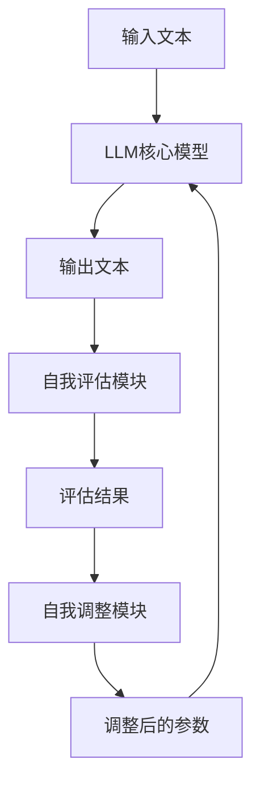

# AI Agent的元认知能力：增强LLM的自我评估与调整

> 关键词：AI Agent、元认知能力、大语言模型（LLM）、自我评估、自我调整

> 摘要：本文聚焦于AI Agent的元认知能力，旨在探讨如何通过赋予大语言模型（LLM）自我评估与调整能力来提升其性能和适应性。首先介绍了相关背景知识，包括目的、预期读者、文档结构和术语表。接着阐述了核心概念与联系，给出了原理和架构的文本示意图及Mermaid流程图。详细讲解了核心算法原理和具体操作步骤，结合Python源代码进行说明。深入分析了数学模型和公式，并举例说明。通过项目实战，展示了代码的实际案例和详细解释。探讨了实际应用场景，推荐了相关的工具和资源。最后总结了未来发展趋势与挑战，提供了常见问题解答和扩展阅读参考资料。

## 1. 背景介绍 
### 1.1 目的和范围
本文章的主要目的是深入研究AI Agent的元认知能力，特别是如何将这种能力应用于增强大语言模型（LLM）的自我评估与调整。随着人工智能技术的快速发展，LLM在自然语言处理等多个领域取得了显著的成果，但仍然面临着一些挑战，如缺乏对自身输出质量的有效评估和根据不同场景进行动态调整的能力。通过引入元认知能力，可以使LLM更加智能和灵活，提高其在各种任务中的表现。

本文的范围涵盖了AI Agent元认知能力的基本概念、核心算法原理、数学模型、实际应用案例以及相关的工具和资源推荐等方面。通过系统的介绍和分析，帮助读者全面了解如何提升LLM的自我评估与调整能力。

### 1.2 预期读者
本文的预期读者包括人工智能领域的研究人员、开发者、学生以及对AI技术感兴趣的专业人士。对于研究人员来说，本文可以提供关于AI Agent元认知能力的最新研究进展和思路；对于开发者而言，文章中的代码示例和项目实战部分可以帮助他们在实际项目中应用相关技术；对于学生来说，能够帮助他们深入理解人工智能的高级概念和技术；对于其他对AI技术感兴趣的专业人士，本文可以作为一个科普和学习的资料，了解AI Agent元认知能力的重要性和应用前景。

### 1.3 文档结构概述
本文将按照以下结构进行组织：
1. **背景介绍**：阐述文章的目的、预期读者、文档结构和术语表。
2. **核心概念与联系**：介绍AI Agent元认知能力、LLM等核心概念，以及它们之间的联系，给出原理和架构的文本示意图及Mermaid流程图。
3. **核心算法原理 & 具体操作步骤**：详细讲解实现LLM自我评估与调整的核心算法原理，并结合Python源代码说明具体操作步骤。
4. **数学模型和公式 & 详细讲解 & 举例说明**：介绍相关的数学模型和公式，并通过具体例子进行详细讲解。
5. **项目实战：代码实际案例和详细解释说明**：通过一个实际项目，展示如何实现LLM的自我评估与调整，包括开发环境搭建、源代码详细实现和代码解读。
6. **实际应用场景**：探讨AI Agent元认知能力在不同领域的实际应用场景。
7. **工具和资源推荐**：推荐相关的学习资源、开发工具框架和论文著作。
8. **总结：未来发展趋势与挑战**：总结AI Agent元认知能力的发展趋势和面临的挑战。
9. **附录：常见问题与解答**：解答读者在学习和应用过程中可能遇到的常见问题。
10. **扩展阅读 & 参考资料**：提供进一步学习和研究的扩展阅读资料和参考文献。

### 1.4 术语表
#### 1.4.1 核心术语定义
- **AI Agent**：是一种能够感知环境、进行决策并采取行动以实现特定目标的人工智能实体。它可以根据环境的变化动态地调整自己的行为。
- **元认知能力**：指的是个体对自己认知过程的认知和监控能力。在AI领域，AI Agent的元认知能力是指其对自身的知识、推理过程、输出结果等进行评估和调整的能力。
- **大语言模型（LLM）**：是一种基于深度学习的自然语言处理模型，通过在大规模文本数据上进行训练，学习语言的模式和规律，能够生成自然流畅的文本。
- **自我评估**：指AI Agent对自己的输出结果、推理过程等进行质量评估的过程，判断其是否符合预期目标和要求。
- **自我调整**：根据自我评估的结果，AI Agent对自己的参数、策略、推理过程等进行调整，以提高输出结果的质量和适应性。

#### 1.4.2 相关概念解释
- **认知过程**：包括感知、注意、记忆、思维、语言等一系列心理活动，是个体获取、处理和利用信息的过程。在AI中，认知过程可以理解为模型对输入数据进行处理和生成输出的过程。
- **知识表示**：是指将知识以某种形式表示出来，以便计算机能够处理和利用。常见的知识表示方法包括符号表示、向量表示等。
- **推理**：是指从已知的知识和信息中推导出新的知识和结论的过程。在AI中，推理可以基于规则、统计模型等进行。

#### 1.4.3 缩略词列表
- **AI**：Artificial Intelligence，人工智能
- **LLM**：Large Language Model，大语言模型
- **NLP**：Natural Language Processing，自然语言处理

## 2. 核心概念与联系 

### 核心概念原理
AI Agent的元认知能力是建立在对自身认知过程的理解和监控基础上的。对于LLM来说，其认知过程主要包括对输入文本的理解、知识的提取和整合、以及生成输出文本的过程。元认知能力的引入可以使LLM在这个过程中进行自我评估和调整。

自我评估的原理是通过定义一些评估指标，如答案的准确性、逻辑性、连贯性等，对LLM的输出结果进行量化评估。这些评估指标可以基于规则、统计模型或机器学习模型来计算。例如，可以通过比较LLM的输出与参考答案的相似度来评估其准确性，或者通过检测文本中的逻辑矛盾来评估其逻辑性。

自我调整则是根据自我评估的结果，对LLM的参数、推理策略或知识表示进行调整。如果评估结果显示输出结果的准确性较低，可能需要调整模型的参数，使其在后续的推理过程中更加准确。或者，如果发现推理过程存在逻辑问题，可以调整推理策略，采用更合理的推理方法。

### 架构的文本示意图
```plaintext
                          +----------------+
                          |   输入文本     |
                          +----------------+
                                 |
                                 v
                          +----------------+
                          |   LLM核心模型   |
                          +----------------+
                                 |
                                 v
                          +----------------+
                          |  输出文本      |
                          +----------------+
                                 |
                                 v
                          +----------------+
                          |  自我评估模块  |
                          +----------------+
                                 |
                                 v
                          +----------------+
                          |  评估结果      |
                          +----------------+
                                 |
                                 v
                          +----------------+
                          |  自我调整模块  |
                          +----------------+
                                 |
                                 v
                          +----------------+
                          |  调整后的参数  |
                          +----------------+
                                 |
                                 v
                          +----------------+
                          |  LLM核心模型   |
                          +----------------+
```

### Mermaid流程图


这个流程图展示了AI Agent元认知能力的基本工作流程。输入文本首先进入LLM核心模型进行处理，生成输出文本。然后，自我评估模块对输出文本进行评估，得到评估结果。自我调整模块根据评估结果生成调整后的参数，这些参数反馈给LLM核心模型，用于下一次的处理。通过这种循环反馈的机制，LLM可以不断地提高自己的性能和适应性。

## 3. 核心算法原理 & 具体操作步骤 

### 核心算法原理
实现LLM的自我评估与调整主要涉及到两个核心算法：自我评估算法和自我调整算法。

#### 自我评估算法
自我评估算法的目标是对LLM的输出结果进行量化评估。常见的评估指标包括准确性、逻辑性、连贯性等。这里我们以准确性评估为例，介绍一种基于相似度计算的评估算法。

假设LLM的输出文本为 $O$，参考答案为 $R$，我们可以使用余弦相似度来计算它们之间的相似度。余弦相似度的计算公式为：

$$
\cos(\theta) = \frac{\mathbf{O} \cdot \mathbf{R}}{\|\mathbf{O}\| \|\mathbf{R}\|}
$$

其中，$\mathbf{O}$ 和 $\mathbf{R}$ 分别是输出文本和参考答案的向量表示，$\cdot$ 表示向量的点积，$\|\mathbf{O}\|$ 和 $\|\mathbf{R}\|$ 分别是向量的模。余弦相似度的值越接近1，表示两个文本越相似，即LLM的输出结果越准确。

#### 自我调整算法
自我调整算法的目标是根据自我评估的结果，对LLM的参数进行调整。这里我们采用梯度下降法来进行参数调整。梯度下降法是一种常用的优化算法，通过不断地沿着目标函数的负梯度方向更新参数，使得目标函数的值逐渐减小。

假设我们的目标是最小化LLM输出结果与参考答案之间的差异，我们可以定义目标函数为：

$$
J(\theta) = 1 - \cos(\theta)
$$

其中，$\theta$ 是LLM的参数，$\cos(\theta)$ 是输出结果与参考答案的余弦相似度。我们的目标是找到一组参数 $\theta$，使得 $J(\theta)$ 的值最小。

梯度下降法的更新公式为：

$$
\theta_{t+1} = \theta_{t} - \alpha \nabla J(\theta_{t})
$$

其中，$\theta_{t}$ 是第 $t$ 次迭代的参数，$\alpha$ 是学习率，$\nabla J(\theta_{t})$ 是目标函数 $J(\theta)$ 在 $\theta_{t}$ 处的梯度。

### 具体操作步骤

#### 步骤1：数据准备
首先，我们需要准备训练数据，包括输入文本、参考答案等。同时，我们需要将文本数据转换为向量表示，以便进行相似度计算。可以使用预训练的词向量模型，如Word2Vec、GloVe等，将文本转换为向量。

#### 步骤2：初始化参数
初始化LLM的参数 $\theta$，可以随机初始化或使用预训练的参数。

#### 步骤3：自我评估
将输入文本输入到LLM中，得到输出文本 $O$。计算输出文本 $O$ 与参考答案 $R$ 的余弦相似度 $\cos(\theta)$，并根据目标函数 $J(\theta) = 1 - \cos(\theta)$ 计算目标函数的值。

#### 步骤4：自我调整
计算目标函数 $J(\theta)$ 在当前参数 $\theta$ 处的梯度 $\nabla J(\theta)$。根据梯度下降法的更新公式 $\theta_{t+1} = \theta_{t} - \alpha \nabla J(\theta_{t})$ 更新参数 $\theta$。

#### 步骤5：重复步骤3和步骤4
重复步骤3和步骤4，直到目标函数的值收敛或达到最大迭代次数。

### Python源代码实现
```python
import numpy as np
from sklearn.metrics.pairwise import cosine_similarity

# 假设我们已经将文本转换为向量
output_vector = np.array([1, 2, 3])  # LLM的输出文本向量
reference_vector = np.array([4, 5, 6])  # 参考答案向量

# 自我评估：计算余弦相似度
similarity = cosine_similarity([output_vector], [reference_vector])[0][0]
print(f"输出结果与参考答案的余弦相似度: {similarity}")

# 定义目标函数
def objective_function(similarity):
    return 1 - similarity

# 计算目标函数的值
loss = objective_function(similarity)
print(f"目标函数的值: {loss}")

# 假设我们已经计算出目标函数的梯度
gradient = np.array([0.1, 0.2, 0.3])  # 目标函数的梯度
learning_rate = 0.01  # 学习率

# 自我调整：使用梯度下降法更新参数
parameters = np.array([0.5, 0.6, 0.7])  # 初始化参数
parameters = parameters - learning_rate * gradient
print(f"调整后的参数: {parameters}")
```

在这个代码示例中，我们首先计算了LLM的输出结果与参考答案的余弦相似度，然后根据目标函数计算了目标函数的值。接着，我们假设已经计算出目标函数的梯度，使用梯度下降法更新了参数。通过不断地重复这个过程，LLM可以逐渐提高自己的性能。

## 4. 数学模型和公式 & 详细讲解 & 举例说明 

### 余弦相似度公式
余弦相似度是一种常用的文本相似度计算方法，其公式为：

$$
\cos(\theta) = \frac{\mathbf{O} \cdot \mathbf{R}}{\|\mathbf{O}\| \|\mathbf{R}\|}
$$

其中，$\mathbf{O}$ 和 $\mathbf{R}$ 分别是输出文本和参考答案的向量表示，$\cdot$ 表示向量的点积，$\|\mathbf{O}\|$ 和 $\|\mathbf{R}\|$ 分别是向量的模。

#### 详细讲解
- **向量的点积**：向量的点积是指两个向量对应元素相乘后相加的结果。例如，对于两个二维向量 $\mathbf{a} = [a_1, a_2]$ 和 $\mathbf{b} = [b_1, b_2]$，它们的点积为 $\mathbf{a} \cdot \mathbf{b} = a_1b_1 + a_2b_2$。点积的结果表示两个向量在方向上的相似程度。
- **向量的模**：向量的模是指向量的长度，计算公式为 $\|\mathbf{v}\| = \sqrt{v_1^2 + v_2^2 + \cdots + v_n^2}$，其中 $\mathbf{v} = [v_1, v_2, \cdots, v_n]$ 是一个 $n$ 维向量。

余弦相似度的值范围在 $[-1, 1]$ 之间，值越接近1，表示两个向量越相似；值越接近 -1，表示两个向量越相反；值接近0，表示两个向量相互垂直，即不相似。

#### 举例说明
假设我们有两个文本向量 $\mathbf{O} = [1, 2, 3]$ 和 $\mathbf{R} = [4, 5, 6]$，我们可以计算它们的余弦相似度：

首先，计算向量的点积：

$$
\mathbf{O} \cdot \mathbf{R} = 1\times4 + 2\times5 + 3\times6 = 4 + 10 + 18 = 32
$$

然后，计算向量的模：

$$
\|\mathbf{O}\| = \sqrt{1^2 + 2^2 + 3^2} = \sqrt{1 + 4 + 9} = \sqrt{14}
$$

$$
\|\mathbf{R}\| = \sqrt{4^2 + 5^2 + 6^2} = \sqrt{16 + 25 + 36} = \sqrt{77}
$$

最后，计算余弦相似度：

$$
\cos(\theta) = \frac{\mathbf{O} \cdot \mathbf{R}}{\|\mathbf{O}\| \|\mathbf{R}\|} = \frac{32}{\sqrt{14} \sqrt{77}} \approx 0.9746
$$

这表明两个文本向量非常相似。

### 梯度下降法公式
梯度下降法是一种常用的优化算法，其更新公式为：

$$
\theta_{t+1} = \theta_{t} - \alpha \nabla J(\theta_{t})
$$

其中，$\theta_{t}$ 是第 $t$ 次迭代的参数，$\alpha$ 是学习率，$\nabla J(\theta_{t})$ 是目标函数 $J(\theta)$ 在 $\theta_{t}$ 处的梯度。

#### 详细讲解
- **目标函数**：目标函数是我们希望最小化的函数，在本文中，我们的目标函数是 $J(\theta) = 1 - \cos(\theta)$，表示LLM输出结果与参考答案之间的差异。
- **梯度**：梯度是目标函数在某一点的导数，表示目标函数在该点的变化率。梯度的方向是目标函数增加最快的方向，负梯度的方向是目标函数减小最快的方向。
- **学习率**：学习率是一个超参数，控制每次参数更新的步长。如果学习率过大，可能会导致参数更新过大，错过最优解；如果学习率过小，可能会导致参数更新过慢，收敛速度变慢。

#### 举例说明
假设我们的目标函数是 $J(\theta) = \theta^2$，我们希望找到使 $J(\theta)$ 最小的 $\theta$ 值。

首先，计算目标函数的导数：

$$
\nabla J(\theta) = 2\theta
$$

假设初始参数 $\theta_0 = 2$，学习率 $\alpha = 0.1$。

第一次迭代：

$$
\nabla J(\theta_0) = 2\times2 = 4
$$

$$
\theta_1 = \theta_0 - \alpha \nabla J(\theta_0) = 2 - 0.1\times4 = 1.6
$$

第二次迭代：

$$
\nabla J(\theta_1) = 2\times1.6 = 3.2
$$

$$
\theta_2 = \theta_1 - \alpha \nabla J(\theta_1) = 1.6 - 0.1\times3.2 = 1.28
$$

通过不断地迭代，$\theta$ 的值会逐渐接近最优解 $\theta = 0$。

## 5. 项目实战：代码实际案例和详细解释说明 

### 5.1  开发环境搭建
#### 安装Python
首先，确保你已经安装了Python 3.x版本。可以从Python官方网站（https://www.python.org/downloads/） 下载并安装适合你操作系统的Python版本。

#### 安装必要的库
我们需要安装一些必要的Python库，包括 `numpy`、`scikit-learn` 等。可以使用以下命令进行安装：

```bash
pip install numpy scikit-learn
```

### 5.2  源代码详细实现和代码解读
```python
import numpy as np
from sklearn.metrics.pairwise import cosine_similarity

# 模拟LLM的输出结果和参考答案
output_texts = ["这是一个测试句子", "另一个测试句子"]
reference_texts = ["这是一个测试语句", "另一个测试语句"]

# 假设我们已经有一个函数可以将文本转换为向量
def text_to_vector(text):
    # 这里只是一个简单的模拟，实际应用中可以使用预训练的词向量模型
    return np.random.rand(10)

# 将文本转换为向量
output_vectors = [text_to_vector(text) for text in output_texts]
reference_vectors = [text_to_vector(text) for text in reference_texts]

# 自我评估：计算每个输出结果与参考答案的余弦相似度
similarities = []
for output_vector, reference_vector in zip(output_vectors, reference_vectors):
    similarity = cosine_similarity([output_vector], [reference_vector])[0][0]
    similarities.append(similarity)
    print(f"输出结果: {output_texts[similarities.index(similarity)]}")
    print(f"参考答案: {reference_texts[similarities.index(similarity)]}")
    print(f"余弦相似度: {similarity}")

# 定义目标函数
def objective_function(similarity):
    return 1 - similarity

# 计算每个输出结果的目标函数值
losses = [objective_function(similarity) for similarity in similarities]
print(f"目标函数值: {losses}")

# 假设我们已经计算出目标函数的梯度
gradients = [np.random.rand(10) for _ in range(len(losses))]  # 随机生成梯度
learning_rate = 0.01  # 学习率

# 自我调整：使用梯度下降法更新参数
parameters = [np.random.rand(10) for _ in range(len(losses))]  # 初始化参数
for i in range(len(parameters)):
    parameters[i] = parameters[i] - learning_rate * gradients[i]
print(f"调整后的参数: {parameters}")
```

### 5.3  代码解读与分析
#### 文本向量化
```python
def text_to_vector(text):
    # 这里只是一个简单的模拟，实际应用中可以使用预训练的词向量模型
    return np.random.rand(10)

output_vectors = [text_to_vector(text) for text in output_texts]
reference_vectors = [text_to_vector(text) for text in reference_texts]
```
这部分代码将文本转换为向量表示。在实际应用中，可以使用预训练的词向量模型，如Word2Vec、GloVe等，将文本转换为更有意义的向量。

#### 自我评估
```python
similarities = []
for output_vector, reference_vector in zip(output_vectors, reference_vectors):
    similarity = cosine_similarity([output_vector], [reference_vector])[0][0]
    similarities.append(similarity)
    print(f"输出结果: {output_texts[similarities.index(similarity)]}")
    print(f"参考答案: {reference_texts[similarities.index(similarity)]}")
    print(f"余弦相似度: {similarity}")
```
这部分代码计算每个输出结果与参考答案的余弦相似度，并打印出结果。余弦相似度的值越接近1，表示输出结果与参考答案越相似。

#### 目标函数计算
```python
def objective_function(similarity):
    return 1 - similarity

losses = [objective_function(similarity) for similarity in similarities]
print(f"目标函数值: {losses}")
```
这部分代码定义了目标函数，并计算每个输出结果的目标函数值。目标函数的值越小，表示输出结果与参考答案越接近。

#### 自我调整
```python
gradients = [np.random.rand(10) for _ in range(len(losses))]  # 随机生成梯度
learning_rate = 0.01  # 学习率

parameters = [np.random.rand(10) for _ in range(len(losses))]  # 初始化参数
for i in range(len(parameters)):
    parameters[i] = parameters[i] - learning_rate * gradients[i]
print(f"调整后的参数: {parameters}")
```
这部分代码使用梯度下降法更新参数。在实际应用中，需要根据目标函数的具体形式计算梯度。通过不断地更新参数，可以使LLM的输出结果更加接近参考答案。

## 6. 实际应用场景 
### 智能客服
在智能客服系统中，AI Agent可以使用元认知能力来评估自己的回答是否准确、清晰和有用。当用户提出问题时，LLM生成回答后，自我评估模块可以根据用户的历史反馈、知识库中的标准答案等进行评估。如果评估结果显示回答存在问题，自我调整模块可以调整模型的参数或推理策略，以提高下一次回答的质量。例如，如果用户对某个回答不满意，AI Agent可以分析用户的反馈，找出问题所在，并对模型进行相应的调整。

### 自动写作
在自动写作领域，AI Agent的元认知能力可以帮助其评估生成的文章的质量。自我评估模块可以从文章的逻辑性、连贯性、语法正确性等方面进行评估。例如，可以使用自然语言处理技术检测文章中的逻辑矛盾、语法错误等。如果评估结果不理想，自我调整模块可以调整写作策略，如改变文章的结构、使用更合适的词汇等。通过不断地自我评估和调整，AI Agent可以生成质量更高的文章。

### 智能教育
在智能教育系统中，AI Agent可以根据学生的回答和学习情况进行自我评估和调整。例如，当学生回答问题时，AI Agent可以评估学生的回答是否正确，并根据评估结果提供相应的反馈和指导。同时，AI Agent可以根据学生的学习进度和表现，调整教学策略和内容，以提供个性化的学习体验。例如，如果学生在某个知识点上掌握得不好，AI Agent可以提供更多的练习和讲解，帮助学生更好地理解该知识点。

### 信息检索
在信息检索系统中，AI Agent的元认知能力可以帮助其评估检索结果的相关性和准确性。自我评估模块可以根据用户的查询需求和历史检索记录，对检索结果进行评估。如果评估结果显示检索结果不理想，自我调整模块可以调整检索策略，如改变关键词、调整检索算法等，以提高检索结果的质量。例如，如果用户对检索结果不满意，AI Agent可以分析用户的反馈，找出问题所在，并对检索策略进行相应的调整。

## 7. 工具和资源推荐
### 7.1 学习资源推荐
#### 7.1.1 书籍推荐
- 《人工智能：一种现代的方法》（Artificial Intelligence: A Modern Approach）：这是一本经典的人工智能教材，全面介绍了人工智能的各个领域，包括搜索算法、知识表示、推理、机器学习等。书中对AI Agent的概念和原理进行了详细的讲解，是学习人工智能的必备书籍。
- 《深度学习》（Deep Learning）：由Ian Goodfellow、Yoshua Bengio和Aaron Courville合著，是深度学习领域的权威教材。书中介绍了深度学习的基本原理、模型结构和训练方法，对大语言模型的学习有很大的帮助。
- 《自然语言处理入门》：这本书适合初学者，系统地介绍了自然语言处理的基本概念、方法和技术，包括词法分析、句法分析、语义理解等。通过学习这本书，可以了解自然语言处理的基础知识，为研究AI Agent的元认知能力打下基础。

#### 7.1.2 在线课程
- Coursera上的“人工智能基础”（Fundamentals of Artificial Intelligence）课程：由哥伦比亚大学的教授授课，全面介绍了人工智能的基本概念、算法和应用。课程内容丰富，讲解详细，适合初学者学习。
- edX上的“深度学习专项课程”（Deep Learning Specialization）：由Andrew Ng教授授课，是深度学习领域的经典课程。课程包括神经网络和深度学习、改善深层神经网络、结构化机器学习项目、卷积神经网络、序列模型等五个部分，对大语言模型的学习有很大的帮助。
- 吴恩达老师在B站上的“机器学习”课程：这是一门非常受欢迎的机器学习课程，吴恩达老师以其清晰的讲解和生动的案例，让学习者轻松掌握机器学习的基本概念和算法。

#### 7.1.3 技术博客和网站
- Medium：这是一个技术博客平台，有很多人工智能领域的专家和开发者分享他们的研究成果和实践经验。可以关注一些知名的博主，如Andrej Karpathy、李开复等，了解人工智能的最新动态。
- arXiv：这是一个预印本平台，提供了大量的学术论文，包括人工智能、机器学习、自然语言处理等领域的最新研究成果。可以在上面搜索相关的论文，了解该领域的前沿技术。
- 机器之心：这是一个专注于人工智能领域的科技媒体，提供了丰富的技术文章、行业动态和研究报告。可以通过阅读机器之心的文章，了解人工智能的发展趋势和应用案例。

### 7.2 开发工具框架推荐
#### 7.2.1 IDE和编辑器
- PyCharm：这是一款专门为Python开发设计的集成开发环境（IDE），具有强大的代码编辑、调试、代码分析等功能。PyCharm支持多种Python框架和库，对人工智能开发非常友好。
- Jupyter Notebook：这是一个交互式的开发环境，适合进行数据分析、模型训练和可视化等工作。Jupyter Notebook可以将代码、文本、图表等内容整合在一起，方便进行实验和分享。
- Visual Studio Code：这是一款轻量级的代码编辑器，支持多种编程语言和插件。Visual Studio Code具有丰富的扩展功能，可以通过安装相应的插件来支持人工智能开发。

#### 7.2.2 调试和性能分析工具
- TensorBoard：这是TensorFlow提供的一个可视化工具，可以用于监控模型的训练过程、可视化模型的结构和性能指标等。通过TensorBoard，可以直观地了解模型的训练情况，及时发现问题并进行调整。
- PyTorch Profiler：这是PyTorch提供的一个性能分析工具，可以用于分析模型的性能瓶颈、内存使用情况等。通过PyTorch Profiler，可以优化模型的性能，提高训练效率。
- cProfile：这是Python内置的一个性能分析工具，可以用于分析Python代码的执行时间和函数调用情况。通过cProfile，可以找出代码中的性能瓶颈，进行优化。

#### 7.2.3 相关框架和库
- TensorFlow：这是一个开源的机器学习框架，由Google开发。TensorFlow提供了丰富的工具和库，支持深度学习模型的构建、训练和部署。TensorFlow在自然语言处理领域有广泛的应用，很多大语言模型都是基于TensorFlow实现的。
- PyTorch：这是一个开源的深度学习框架，由Facebook开发。PyTorch具有动态图的特点，代码简洁易懂，适合快速开发和实验。PyTorch在学术界和工业界都有广泛的应用，是研究和开发大语言模型的常用框架之一。
- Transformers：这是一个基于PyTorch和TensorFlow的开源库，由Hugging Face开发。Transformers提供了丰富的预训练模型，包括BERT、GPT等，方便用户进行自然语言处理任务的开发。

### 7.3 相关论文著作推荐
#### 7.3.1 经典论文
- “Attention Is All You Need”：这篇论文提出了Transformer架构，是自然语言处理领域的里程碑式论文。Transformer架构通过引入注意力机制，解决了传统循环神经网络在处理长序列时的问题，大大提高了模型的性能和效率。
- “BERT: Pre-training of Deep Bidirectional Transformers for Language Understanding”：这篇论文提出了BERT模型，是一种基于Transformer架构的预训练语言模型。BERT模型通过在大规模文本数据上进行无监督学习，学习到了丰富的语言知识，可以在多种自然语言处理任务上取得优异的成绩。
- “Generative Pretrained Transformer 3 (GPT-3): Language Models are Few-Shot Learners”：这篇论文介绍了GPT-3模型，是一种基于Transformer架构的生成式预训练语言模型。GPT-3模型具有强大的语言生成能力，可以在多种自然语言处理任务上实现零样本或少样本学习。

#### 7.3.2 最新研究成果
- 可以关注arXiv上的最新论文，了解AI Agent元认知能力领域的最新研究成果。例如，一些研究致力于提高LLM的自我评估和调整能力，通过引入元学习、强化学习等技术，使LLM能够更好地适应不同的任务和环境。
- 参加人工智能领域的学术会议，如NeurIPS、ICML、ACL等，了解最新的研究动态和成果。这些会议上会有很多优秀的研究论文和报告，展示了该领域的前沿技术和发展趋势。

#### 7.3.3 应用案例分析
- 可以阅读一些关于AI Agent元认知能力在实际应用中的案例分析，了解如何将相关技术应用到实际项目中。例如，一些智能客服系统、自动写作工具等，都可以通过引入元认知能力来提高性能和用户体验。可以通过查阅相关的技术博客、行业报告等获取这些案例分析。

## 8. 总结：未来发展趋势与挑战
### 未来发展趋势
#### 更强大的自我评估能力
未来的AI Agent将具备更强大的自我评估能力，能够从多个维度对自己的输出结果进行全面、准确的评估。除了现有的准确性、逻辑性、连贯性等评估指标外，还将考虑更多的因素，如情感表达、风格一致性等。例如，在自动写作领域，AI Agent可以评估生成文章的情感倾向是否符合要求，风格是否与目标受众相匹配。

#### 更智能的自我调整策略
随着技术的不断发展，AI Agent的自我调整策略将更加智能和灵活。不仅可以根据自我评估的结果调整模型的参数，还可以调整推理策略、知识表示等。例如，当发现某个推理策略在某些情况下效果不佳时，AI Agent可以自动切换到其他更合适的推理策略。同时，AI Agent还可以根据不同的任务和环境，动态地调整自己的知识表示，以提高处理问题的能力。

#### 与人类认知的融合
未来的AI Agent将更加注重与人类认知的融合，借鉴人类的元认知能力，提高自身的智能水平。例如，人类在学习和解决问题的过程中，会不断地反思自己的思维过程，调整自己的策略。AI Agent可以学习这种反思和调整的能力，通过与人类的交互和合作，不断优化自己的性能。

#### 跨领域应用的拓展
AI Agent的元认知能力将在更多的领域得到应用，如医疗、金融、交通等。在医疗领域，AI Agent可以对自己的诊断结果进行自我评估和调整，提高诊断的准确性和可靠性；在金融领域，AI Agent可以对市场趋势进行分析和预测，并根据评估结果调整投资策略；在交通领域，AI Agent可以对交通流量进行实时监测和分析，优化交通信号控制策略，提高交通效率。

### 面临的挑战
#### 评估指标的定义和量化
如何定义和量化有效的评估指标是一个挑战。不同的任务和应用场景可能需要不同的评估指标，而且这些指标的计算方法也需要不断地优化和改进。例如，在评估文章的质量时，如何综合考虑逻辑性、连贯性、情感表达等多个因素，是一个需要深入研究的问题。

#### 计算资源的需求
提高AI Agent的元认知能力通常需要大量的计算资源。自我评估和调整过程需要进行复杂的计算和推理，对硬件设备的性能要求较高。如何在有限的计算资源下实现高效的自我评估和调整，是一个亟待解决的问题。

#### 数据的质量和多样性
数据的质量和多样性对AI Agent的元认知能力有着重要的影响。如果训练数据存在偏差或噪声，可能会导致自我评估和调整的结果不准确。因此，需要收集和整理高质量、多样化的数据，以提高AI Agent的性能和适应性。

#### 伦理和安全问题
随着AI Agent的元认知能力不断增强，伦理和安全问题也日益凸显。例如，AI Agent可能会根据自我评估的结果做出一些不合理或不道德的决策，对人类社会造成负面影响。因此，需要建立相应的伦理和安全规范，确保AI Agent的行为符合人类的价值观和利益。

## 9. 附录：常见问题与解答
### 问题1：什么是AI Agent的元认知能力？
AI Agent的元认知能力是指其对自己的认知过程进行认知和监控的能力。具体来说，AI Agent可以对自己的知识、推理过程、输出结果等进行评估和调整，以提高自己的性能和适应性。例如，在回答问题时，AI Agent可以评估自己的回答是否准确、清晰，并根据评估结果进行调整。

### 问题2：为什么要给LLM引入元认知能力？
给LLM引入元认知能力可以解决LLM在实际应用中面临的一些问题。LLM虽然在自然语言处理方面取得了显著的成果，但仍然缺乏对自身输出质量的有效评估和根据不同场景进行动态调整的能力。通过引入元认知能力，LLM可以更好地理解自己的行为和结果，及时发现问题并进行调整，从而提高在各种任务中的表现。

### 问题3：如何实现LLM的自我评估和调整？
实现LLM的自我评估和调整可以通过以下步骤：
1. **定义评估指标**：根据不同的任务和应用场景，定义合适的评估指标，如准确性、逻辑性、连贯性等。
2. **计算评估指标**：使用相应的算法和模型，计算LLM输出结果的评估指标值。
3. **根据评估结果进行调整**：根据评估结果，调整LLM的参数、推理策略或知识表示，以提高输出结果的质量。

### 问题4：自我评估和调整会增加计算复杂度吗？
是的，自我评估和调整会增加一定的计算复杂度。自我评估过程需要对LLM的输出结果进行分析和计算，调整过程需要对模型的参数进行更新。然而，通过优化算法和使用高效的计算资源，可以在一定程度上降低计算复杂度。

### 问题5：AI Agent的元认知能力可以应用于哪些领域？
AI Agent的元认知能力可以应用于多个领域，如智能客服、自动写作、智能教育、信息检索等。在这些领域中，AI Agent可以通过自我评估和调整，提高自己的性能和用户体验。

## 10. 扩展阅读 & 参考资料
### 扩展阅读
- 《思考，快与慢》（Thinking, Fast and Slow）：这本书由诺贝尔经济学奖获得者丹尼尔·卡尼曼（Daniel Kahneman）所著，介绍了人类的两种思维模式：快思考和慢思考。了解人类的思维模式可以帮助我们更好地理解AI Agent的元认知能力，借鉴人类的认知机制来设计更智能的AI Agent。
- 《人工智能哲学》（Philosophy of Artificial Intelligence）：这本书探讨了人工智能领域的哲学问题，如智能的本质、意识的产生、伦理和道德等。阅读这本书可以帮助我们从哲学的角度思考AI Agent的元认知能力，引发对人工智能发展的深入思考。
- 《技术的本质》（The Nature of Technology）：这本书由经济学家布莱恩·阿瑟（W. Brian Arthur）所著，探讨了技术的本质和发展规律。了解技术的本质可以帮助我们更好地理解AI Agent的元认知能力的发展趋势，以及如何推动这一技术的进步。

### 参考资料
- Goodfellow, I., Bengio, Y., & Courville, A. (2016). Deep Learning. MIT Press.
- Mitchell, T. M. (1997). Machine Learning. McGraw-Hill.
- Vaswani, A., Shazeer, N., Parmar, N., Uszkoreit, J., Jones, L., Gomez, A. N.,... & Polosukhin, I. (2017). Attention is all you need. Advances in neural information processing systems, 30.
- Devlin, J., Chang, M. W., Lee, K., & Toutanova, K. (2018). Bert: Pre-training of deep bidirectional transformers for language understanding. arXiv preprint arXiv:1810.04805.
- Brown, T. B., Mann, B., Ryder, N., Subbiah, M., Kaplan, J., Dhariwal, P.,... & Amodei, D. (2020). Language models are few-shot learners. Advances in neural information processing systems, 33.

作者：AI天才研究院/AI Genius Institute & 禅与计算机程序设计艺术 /Zen And The Art of Computer Programming