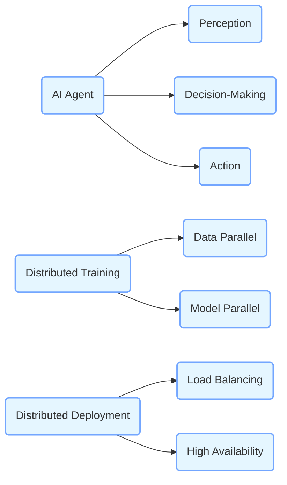

# AI Agent的分布式训练与部署策略

> 关键词：AI Agent、分布式训练、分布式部署、训练策略、部署策略

> 摘要：本文聚焦于AI Agent的分布式训练与部署策略，旨在深入探讨如何利用分布式技术提升AI Agent的训练效率和部署效果。首先介绍了相关背景知识，包括目的范围、预期读者等。接着阐述了AI Agent、分布式训练与部署的核心概念及其联系，并给出了相应的文本示意图和Mermaid流程图。详细讲解了核心算法原理，结合Python代码进行说明，同时给出了相关的数学模型和公式。通过项目实战案例，展示了开发环境搭建、源代码实现与解读。分析了AI Agent在不同领域的实际应用场景，推荐了学习资源、开发工具框架和相关论文著作。最后总结了未来发展趋势与挑战，解答了常见问题，并提供了扩展阅读和参考资料。

## 1. 背景介绍 
### 1.1 目的和范围
随着人工智能技术的不断发展，AI Agent在各个领域的应用越来越广泛。然而，单个计算设备的计算能力和存储容量有限，难以满足大规模AI Agent的训练和部署需求。分布式训练与部署策略能够充分利用多个计算设备的资源，提高训练效率和部署的灵活性。本文的目的在于系统地介绍AI Agent的分布式训练与部署策略，包括相关概念、算法原理、实际操作步骤、应用场景等，为读者提供全面的技术指导。范围涵盖了常见的分布式训练框架和部署方式，以及在不同场景下的应用案例。

### 1.2 预期读者
本文预期读者包括人工智能领域的研究人员、开发者、数据科学家，以及对AI Agent技术感兴趣的技术爱好者。对于有一定编程基础和机器学习知识的读者，能够更深入地理解文中的算法原理和代码实现；而对于初学者，也可以通过本文了解AI Agent分布式训练与部署的基本概念和应用场景。

### 1.3 文档结构概述
本文将按照以下结构进行组织：首先介绍背景知识，包括目的、预期读者和文档结构。接着阐述核心概念与联系，包括AI Agent、分布式训练与部署的定义和关系。然后详细讲解核心算法原理和具体操作步骤，结合Python代码进行说明。随后给出数学模型和公式，并举例说明。通过项目实战案例，展示开发环境搭建、源代码实现和代码解读。分析实际应用场景，推荐学习资源、开发工具框架和相关论文著作。最后总结未来发展趋势与挑战，解答常见问题，并提供扩展阅读和参考资料。

### 1.4 术语表
#### 1.4.1 核心术语定义
- **AI Agent**：是一种能够感知环境、做出决策并采取行动以实现特定目标的智能实体。它可以是软件程序、机器人等。
- **分布式训练**：将训练任务分配到多个计算设备（如多个GPU、多台服务器）上并行进行，以提高训练效率。
- **分布式部署**：将训练好的AI Agent模型部署到多个计算节点上，实现高可用性和负载均衡。

#### 1.4.2 相关概念解释
- **并行计算**：指同时执行多个计算任务，以提高计算效率。在分布式训练中，并行计算可以分为数据并行和模型并行。
- **负载均衡**：在分布式系统中，将工作负载均匀地分配到各个计算节点上，避免某些节点过载而其他节点闲置。

#### 1.4.3 缩略词列表
- **GPU**：图形处理单元（Graphics Processing Unit），常用于加速深度学习训练。
- **CPU**：中央处理单元（Central Processing Unit），是计算机的核心计算部件。
- **MPI**：消息传递接口（Message Passing Interface），是一种用于并行计算的通信协议。

## 2. 核心概念与联系 
### 核心概念原理
#### AI Agent
AI Agent是一种能够自主感知环境、做出决策并采取行动的智能实体。它通常由感知模块、决策模块和行动模块组成。感知模块负责收集环境信息，决策模块根据感知到的信息做出决策，行动模块根据决策结果采取相应的行动。例如，一个自动驾驶汽车可以看作是一个AI Agent，它通过摄像头、雷达等传感器感知周围环境，决策模块根据这些信息决定行驶速度、方向等，行动模块则控制汽车的油门、刹车和方向盘。

#### 分布式训练
分布式训练是将训练任务分配到多个计算设备上并行进行的过程。在深度学习中，训练一个大规模的模型通常需要大量的计算资源和时间。通过分布式训练，可以充分利用多个计算设备的计算能力，加速训练过程。常见的分布式训练方式有数据并行和模型并行。
- **数据并行**：将训练数据分割成多个子集，每个计算设备负责处理一个子集。每个设备上都有一份完整的模型副本，在每个训练步骤中，各个设备根据自己的数据子集计算梯度，然后将梯度进行汇总，更新模型参数。
- **模型并行**：将模型分割成多个部分，每个计算设备负责处理模型的一部分。例如，对于一个深度神经网络，可以将不同的层分配到不同的设备上进行计算。

#### 分布式部署
分布式部署是将训练好的AI Agent模型部署到多个计算节点上，以实现高可用性和负载均衡。在实际应用中，可能会有大量的请求需要AI Agent进行处理，如果只部署在一个节点上，可能会导致该节点过载，影响系统的性能和可用性。通过分布式部署，可以将请求均匀地分配到多个节点上，提高系统的处理能力和可靠性。

### 架构的文本示意图
```plaintext
+---------------------+
|      AI Agent       |
| +-----------------+ |
| |   Perception    | |
| +-----------------+ |
| |   Decision-Making | |
| +-----------------+ |
| |    Action       | |
| +-----------------+ |
+---------------------+

+---------------------+
|  Distributed Training |
| +-----------------+ |
| | Data Parallel   | |
| +-----------------+ |
| | Model Parallel  | |
| +-----------------+ |
+---------------------+

+---------------------+
|  Distributed Deployment |
| +-----------------+ |
| | Load Balancing  | |
| +-----------------+ |
| | High Availability | |
| +-----------------+ |
+---------------------+
```

### Mermaid流程图


## 3. 核心算法原理 & 具体操作步骤 
### 核心算法原理
在分布式训练中，数据并行是一种常用的算法。下面以深度学习中的随机梯度下降（SGD）算法为例，介绍数据并行的核心原理。

随机梯度下降算法的目标是最小化损失函数 $L(\theta)$，其中 $\theta$ 是模型的参数。在每次训练步骤中，算法从训练数据集中随机选取一个小批量（mini-batch）的数据，计算该小批量数据上的损失函数的梯度 $\nabla L(\theta)$，然后根据梯度更新模型参数：

$$\theta \leftarrow \theta - \alpha \nabla L(\theta)$$

其中 $\alpha$ 是学习率。

在数据并行的分布式训练中，每个计算设备上都有一份完整的模型副本，并且负责处理一个小批量的数据。每个设备计算自己小批量数据上的梯度，然后将梯度进行汇总，得到全局梯度。最后，每个设备根据全局梯度更新自己的模型参数。

### 具体操作步骤
#### 步骤1：初始化模型和数据
在每个计算设备上初始化相同的模型参数 $\theta$，并将训练数据分割成多个子集，每个设备负责处理一个子集。

#### 步骤2：计算局部梯度
每个设备根据自己的数据子集计算损失函数的局部梯度 $\nabla L_i(\theta)$，其中 $i$ 表示设备编号。

#### 步骤3：汇总局部梯度
将所有设备的局部梯度进行汇总，得到全局梯度 $\nabla L(\theta)$：

$$\nabla L(\theta) = \frac{1}{n} \sum_{i=1}^{n} \nabla L_i(\theta)$$

其中 $n$ 是计算设备的数量。

#### 步骤4：更新模型参数
每个设备根据全局梯度更新自己的模型参数：

$$\theta \leftarrow \theta - \alpha \nabla L(\theta)$$

#### 步骤5：重复步骤2 - 4
重复步骤2 - 4，直到达到训练的终止条件（如达到最大训练步数、损失函数收敛等）。

### Python源代码实现
以下是一个使用PyTorch实现数据并行分布式训练的示例代码：

```python
import torch
import torch.nn as nn
import torch.optim as optim
import torch.distributed as dist
import torch.multiprocessing as mp
from torch.nn.parallel import DistributedDataParallel as DDP

# 定义一个简单的神经网络模型
class SimpleModel(nn.Module):
    def __init__(self):
        super(SimpleModel, self).__init__()
        self.fc = nn.Linear(10, 1)

    def forward(self, x):
        return self.fc(x)

# 训练函数
def train(rank, world_size):
    # 初始化分布式环境
    dist.init_process_group("nccl", rank=rank, world_size=world_size)

    # 创建模型并将其移动到当前设备
    model = SimpleModel().to(rank)
    ddp_model = DDP(model, device_ids=[rank])

    # 定义损失函数和优化器
    criterion = nn.MSELoss()
    optimizer = optim.SGD(ddp_model.parameters(), lr=0.001)

    # 模拟训练数据
    inputs = torch.randn(100, 10).to(rank)
    labels = torch.randn(100, 1).to(rank)

    # 数据分割
    sampler = torch.utils.data.DistributedSampler(
        torch.utils.data.TensorDataset(inputs, labels),
        num_replicas=world_size,
        rank=rank
    )
    dataloader = torch.utils.data.DataLoader(
        torch.utils.data.TensorDataset(inputs, labels),
        batch_size=10,
        sampler=sampler
    )

    # 训练循环
    for epoch in range(10):
        sampler.set_epoch(epoch)
        for inputs, labels in dataloader:
            optimizer.zero_grad()
            outputs = ddp_model(inputs)
            loss = criterion(outputs, labels)
            loss.backward()
            optimizer.step()

        print(f"Rank {rank}, Epoch {epoch}: Loss = {loss.item()}")

    # 清理分布式环境
    dist.destroy_process_group()

# 主函数
if __name__ == "__main__":
    world_size = 2  # 计算设备数量
    mp.spawn(train, args=(world_size,), nprocs=world_size, join=True)
```

### 代码解释
1. **初始化分布式环境**：使用 `dist.init_process_group` 函数初始化分布式环境，指定通信后端（如 `nccl`）、当前进程的排名（`rank`）和计算设备的总数（`world_size`）。
2. **创建模型并使用 `DistributedDataParallel` 封装**：将模型移动到当前设备，并使用 `DistributedDataParallel` 对模型进行封装，以实现数据并行。
3. **定义损失函数和优化器**：使用均方误差损失函数（`MSELoss`）和随机梯度下降优化器（`SGD`）。
4. **数据分割**：使用 `DistributedSampler` 对训练数据进行分割，确保每个设备处理不同的数据子集。
5. **训练循环**：在每个训练步骤中，计算损失函数的梯度，然后使用优化器更新模型参数。
6. **清理分布式环境**：使用 `dist.destroy_process_group` 函数清理分布式环境。

## 4. 数学模型和公式 & 详细讲解 & 举例说明 
### 随机梯度下降（SGD）
随机梯度下降是一种常用的优化算法，用于最小化损失函数。给定一个损失函数 $L(\theta)$，其中 $\theta$ 是模型的参数，SGD的更新公式为：

$$\theta \leftarrow \theta - \alpha \nabla L(\theta)$$

其中 $\alpha$ 是学习率，$\nabla L(\theta)$ 是损失函数关于参数 $\theta$ 的梯度。

### 详细讲解
- **学习率 $\alpha$**：控制每次参数更新的步长。如果学习率过大，模型可能会跳过最优解；如果学习率过小，模型的收敛速度会很慢。
- **梯度 $\nabla L(\theta)$**：表示损失函数在当前参数值处的变化率。梯度的方向是损失函数增加最快的方向，因此我们沿着梯度的反方向更新参数，以减小损失函数的值。

### 举例说明
假设我们有一个简单的线性回归模型 $y = wx + b$，其中 $w$ 和 $b$ 是模型的参数，$x$ 是输入特征，$y$ 是输出。损失函数可以定义为均方误差：

$$L(w, b) = \frac{1}{n} \sum_{i=1}^{n} (y_i - (wx_i + b))^2$$

其中 $n$ 是样本数量，$(x_i, y_i)$ 是第 $i$ 个样本。

为了使用SGD更新参数 $w$ 和 $b$，我们需要计算损失函数关于 $w$ 和 $b$ 的梯度：

$$\frac{\partial L}{\partial w} = -\frac{2}{n} \sum_{i=1}^{n} x_i (y_i - (wx_i + b))$$

$$\frac{\partial L}{\partial b} = -\frac{2}{n} \sum_{i=1}^{n} (y_i - (wx_i + b))$$

然后根据SGD的更新公式更新参数：

$$w \leftarrow w - \alpha \frac{\partial L}{\partial w}$$

$$b \leftarrow b - \alpha \frac{\partial L}{\partial b}$$

### 数据并行中的梯度汇总
在数据并行的分布式训练中，每个计算设备计算自己小批量数据上的梯度，然后将梯度进行汇总，得到全局梯度。假设共有 $n$ 个计算设备，第 $i$ 个设备计算的局部梯度为 $\nabla L_i(\theta)$，则全局梯度为：

$$\nabla L(\theta) = \frac{1}{n} \sum_{i=1}^{n} \nabla L_i(\theta)$$

### 详细讲解
- **局部梯度 $\nabla L_i(\theta)$**：每个设备根据自己的数据子集计算的梯度。
- **全局梯度 $\nabla L(\theta)$**：所有设备的局部梯度的平均值。通过汇总局部梯度，我们可以得到更准确的梯度估计，从而更有效地更新模型参数。

### 举例说明
假设我们有两个计算设备，第一个设备计算的局部梯度为 $\nabla L_1(\theta) = [0.1, 0.2]$，第二个设备计算的局部梯度为 $\nabla L_2(\theta) = [0.3, 0.4]$，则全局梯度为：

$$\nabla L(\theta) = \frac{1}{2} ([0.1, 0.2] + [0.3, 0.4]) = [0.2, 0.3]$$

## 5. 项目实战：代码实际案例和详细解释说明 
### 5.1  开发环境搭建
#### 硬件环境
- **服务器**：建议使用多台具有GPU的服务器，例如NVIDIA DGX系列服务器。
- **GPU**：推荐使用NVIDIA的GPU，如V100、A100等。

#### 软件环境
- **操作系统**：Ubuntu 18.04或更高版本。
- **Python**：Python 3.7或更高版本。
- **深度学习框架**：PyTorch 1.8或更高版本。
- **分布式通信库**：NCCL（NVIDIA Collective Communications Library）。

#### 安装步骤
1. **安装Python**：可以从Python官方网站下载并安装Python 3.7或更高版本。
2. **安装PyTorch**：根据自己的CUDA版本，从PyTorch官方网站选择合适的安装命令进行安装。例如，对于CUDA 11.1，可以使用以下命令：

```bash
pip install torch torchvision torchaudio --extra-index-url https://download.pytorch.org/whl/cu111
```

3. **安装NCCL**：可以从NVIDIA官方网站下载并安装NCCL。

### 5.2  源代码详细实现和代码解读
以下是一个完整的基于PyTorch的数据并行分布式训练示例代码：

```python
import torch
import torch.nn as nn
import torch.optim as optim
import torch.distributed as dist
import torch.multiprocessing as mp
from torch.nn.parallel import DistributedDataParallel as DDP
import os

# 定义一个简单的神经网络模型
class SimpleModel(nn.Module):
    def __init__(self):
        super(SimpleModel, self).__init__()
        self.fc1 = nn.Linear(10, 20)
        self.relu = nn.ReLU()
        self.fc2 = nn.Linear(20, 1)

    def forward(self, x):
        x = self.fc1(x)
        x = self.relu(x)
        x = self.fc2(x)
        return x

# 训练函数
def train(rank, world_size):
    # 初始化分布式环境
    os.environ['MASTER_ADDR'] = 'localhost'
    os.environ['MASTER_PORT'] = '12355'
    dist.init_process_group("nccl", rank=rank, world_size=world_size)

    # 创建模型并将其移动到当前设备
    torch.cuda.set_device(rank)
    model = SimpleModel().to(rank)
    ddp_model = DDP(model, device_ids=[rank])

    # 定义损失函数和优化器
    criterion = nn.MSELoss()
    optimizer = optim.SGD(ddp_model.parameters(), lr=0.001)

    # 模拟训练数据
    inputs = torch.randn(100, 10).to(rank)
    labels = torch.randn(100, 1).to(rank)

    # 数据分割
    sampler = torch.utils.data.DistributedSampler(
        torch.utils.data.TensorDataset(inputs, labels),
        num_replicas=world_size,
        rank=rank
    )
    dataloader = torch.utils.data.DataLoader(
        torch.utils.data.TensorDataset(inputs, labels),
        batch_size=10,
        sampler=sampler
    )

    # 训练循环
    for epoch in range(10):
        sampler.set_epoch(epoch)
        for inputs, labels in dataloader:
            optimizer.zero_grad()
            outputs = ddp_model(inputs)
            loss = criterion(outputs, labels)
            loss.backward()
            optimizer.step()

        print(f"Rank {rank}, Epoch {epoch}: Loss = {loss.item()}")

    # 清理分布式环境
    dist.destroy_process_group()

# 主函数
if __name__ == "__main__":
    world_size = 2  # 计算设备数量
    mp.spawn(train, args=(world_size,), nprocs=world_size, join=True)
```

### 代码解读
1. **导入必要的库**：导入PyTorch、分布式训练相关的库以及操作系统相关的库。
2. **定义模型**：定义一个简单的两层全连接神经网络模型 `SimpleModel`。
3. **训练函数 `train`**：
    - **初始化分布式环境**：设置主节点的地址和端口，使用 `dist.init_process_group` 函数初始化分布式环境。
    - **创建模型并封装**：将模型移动到当前设备，并使用 `DistributedDataParallel` 对模型进行封装。
    - **定义损失函数和优化器**：使用均方误差损失函数和随机梯度下降优化器。
    - **模拟训练数据**：生成随机的输入数据和标签。
    - **数据分割**：使用 `DistributedSampler` 对训练数据进行分割，确保每个设备处理不同的数据子集。
    - **训练循环**：在每个训练步骤中，计算损失函数的梯度，然后使用优化器更新模型参数。
    - **清理分布式环境**：使用 `dist.destroy_process_group` 函数清理分布式环境。
4. **主函数**：使用 `mp.spawn` 函数启动多个进程进行分布式训练。

### 5.3  代码解读与分析
#### 优点
- **并行计算**：通过数据并行的方式，将训练任务分配到多个计算设备上并行进行，大大提高了训练效率。
- **易于实现**：PyTorch提供了 `DistributedDataParallel` 模块，使得数据并行的实现非常简单。

#### 缺点
- **通信开销**：在梯度汇总过程中，需要在各个计算设备之间进行通信，会产生一定的通信开销。
- **数据同步**：需要确保各个设备上的模型参数和数据是同步的，否则可能会导致训练结果不稳定。

#### 优化建议
- **使用异步通信**：可以使用异步通信方式，减少通信开销。
- **梯度累积**：在每个设备上进行多次前向和反向传播，然后累积梯度，最后进行一次梯度更新，减少通信次数。

## 6. 实际应用场景 
### 自然语言处理
在自然语言处理领域，AI Agent可以用于文本生成、机器翻译、问答系统等任务。分布式训练可以加速大规模语言模型的训练过程，例如GPT-3等模型的训练需要大量的计算资源，通过分布式训练可以在更短的时间内完成训练。分布式部署可以将训练好的模型部署到多个服务器上，以处理大量的用户请求，提高系统的响应速度和可用性。

### 计算机视觉
在计算机视觉领域，AI Agent可以用于图像分类、目标检测、图像生成等任务。分布式训练可以加速卷积神经网络（CNN）等模型的训练过程，特别是对于大规模的图像数据集。分布式部署可以将模型部署到多个边缘设备上，实现实时的图像识别和处理，例如智能监控系统、自动驾驶汽车等。

### 强化学习
在强化学习领域，AI Agent通过与环境进行交互来学习最优策略。分布式训练可以加速强化学习算法的训练过程，例如使用多个智能体同时与环境进行交互，然后将经验进行汇总和学习。分布式部署可以将训练好的智能体部署到多个物理设备上，实现分布式的决策和控制，例如机器人协作、无人机集群等。

### 金融领域
在金融领域，AI Agent可以用于风险评估、投资决策、交易策略优化等任务。分布式训练可以处理大规模的金融数据，提高模型的准确性和泛化能力。分布式部署可以将模型部署到多个金融机构的服务器上，实现实时的金融分析和决策。

## 7. 工具和资源推荐
### 7.1 学习资源推荐
#### 7.1.1 书籍推荐
- 《深度学习》（Deep Learning）：由Ian Goodfellow、Yoshua Bengio和Aaron Courville撰写，是深度学习领域的经典教材，涵盖了深度学习的基本原理、算法和应用。
- 《Python深度学习》（Deep Learning with Python）：由Francois Chollet撰写，介绍了如何使用Python和Keras框架进行深度学习开发，适合初学者。
- 《强化学习：原理与Python实现》：介绍了强化学习的基本原理和算法，并提供了Python代码实现，帮助读者深入理解强化学习。

#### 7.1.2 在线课程
- Coursera上的“深度学习专项课程”（Deep Learning Specialization）：由Andrew Ng教授授课，包括深度学习的基础、卷积神经网络、循环神经网络等内容。
- edX上的“强化学习基础”（Fundamentals of Reinforcement Learning）：介绍了强化学习的基本概念、算法和应用。
- Udemy上的“PyTorch深度学习实战”（Deep Learning with PyTorch）：通过实际项目介绍了如何使用PyTorch进行深度学习开发。

#### 7.1.3 技术博客和网站
- Medium：有很多关于人工智能、深度学习的技术博客文章，例如Towards Data Science、The AI Summer等。
- arXiv：是一个预印本数据库，包含了大量的人工智能、机器学习领域的研究论文。
- Hugging Face：提供了丰富的自然语言处理模型和工具，以及相关的教程和文档。

### 7.2 开发工具框架推荐
#### 7.2.1 IDE和编辑器
- PyCharm：是一款专业的Python集成开发环境，提供了代码编辑、调试、版本控制等功能。
- Jupyter Notebook：是一个交互式的开发环境，适合进行数据探索、模型训练和可视化。
- Visual Studio Code：是一款轻量级的代码编辑器，支持多种编程语言和插件扩展。

#### 7.2.2 调试和性能分析工具
- TensorBoard：是TensorFlow提供的可视化工具，可以用于监控模型的训练过程、查看模型的结构和性能指标。
- PyTorch Profiler：是PyTorch提供的性能分析工具，可以帮助开发者找出代码中的性能瓶颈。
- NVIDIA Nsight Systems：是NVIDIA提供的性能分析工具，专门用于分析GPU程序的性能。

#### 7.2.3 相关框架和库
- PyTorch：是一个开源的深度学习框架，提供了丰富的神经网络层、优化器和数据处理工具，支持分布式训练和部署。
- TensorFlow：是另一个流行的深度学习框架，具有强大的分布式训练和部署能力，广泛应用于工业界。
- Horovod：是一个用于分布式深度学习训练的开源框架，支持多种深度学习框架，如PyTorch、TensorFlow等。

### 7.3 相关论文著作推荐
#### 7.3.1 经典论文
- “Distributed Representations of Words and Phrases and their Compositionality”：介绍了Word2Vec模型，是自然语言处理领域的经典论文。
- “ImageNet Classification with Deep Convolutional Neural Networks”：介绍了AlexNet模型，开启了深度学习在计算机视觉领域的应用热潮。
- “Asynchronous Methods for Deep Reinforcement Learning”：提出了异步优势演员-评论家（A3C）算法，是强化学习领域的重要论文。

#### 7.3.2 最新研究成果
- 关注arXiv上的最新论文，特别是关于分布式训练、AI Agent的研究成果。
- 参加国际顶级的人工智能会议，如NeurIPS、ICML、CVPR等，了解最新的研究动态。

#### 7.3.3 应用案例分析
- 阅读工业界的技术博客和案例分享，了解AI Agent在实际应用中的部署和优化经验。
- 参考开源项目的文档和代码，学习如何实现分布式训练和部署。

## 8. 总结：未来发展趋势与挑战
### 未来发展趋势
#### 更高效的分布式训练算法
随着计算资源的不断增加，需要开发更高效的分布式训练算法，以充分利用这些资源。例如，研究人员正在探索新的并行计算模式、梯度压缩算法等，以减少通信开销和计算时间。

#### 异构计算环境的支持
未来的分布式训练和部署将越来越多地涉及到异构计算环境，包括CPU、GPU、TPU等不同类型的计算设备。需要开发能够有效利用异构计算资源的框架和算法，提高系统的整体性能。

#### AI Agent的智能化和自主化
AI Agent将越来越智能化和自主化，能够在复杂的环境中自主学习和决策。分布式训练和部署将为AI Agent的大规模应用提供支持，例如多智能体系统的协作和交互。

#### 边缘计算与分布式训练的结合
边缘计算可以将计算和数据存储靠近数据源，减少数据传输延迟。未来，边缘计算将与分布式训练相结合，实现更高效的AI Agent训练和部署，例如在物联网设备上进行实时的模型更新和推理。

### 挑战
#### 通信开销和带宽限制
在分布式训练和部署中，通信开销是一个重要的问题。随着计算设备数量的增加，通信开销会显著增加，影响系统的性能。同时，网络带宽的限制也会影响数据的传输速度，需要优化通信协议和数据传输方式。

#### 数据隐私和安全
在分布式训练中，数据通常分布在多个计算设备上，需要保证数据的隐私和安全。例如，如何在不泄露数据的情况下进行梯度汇总和模型更新，是一个亟待解决的问题。

#### 模型一致性和同步问题
在分布式训练中，需要确保各个计算设备上的模型参数是一致的。由于计算设备的性能差异和网络延迟等因素，可能会导致模型参数的不一致，影响训练结果的稳定性。需要开发有效的同步机制和算法，保证模型的一致性。

#### 系统管理和运维
分布式训练和部署涉及到多个计算设备和复杂的网络环境，系统管理和运维变得更加困难。需要开发自动化的管理工具和监控系统，提高系统的可靠性和可用性。

## 9. 附录：常见问题与解答
### 问题1：分布式训练和单机训练有什么区别？
分布式训练将训练任务分配到多个计算设备上并行进行，而单机训练只在一个计算设备上进行。分布式训练可以利用多个设备的计算资源，加速训练过程，特别是对于大规模的模型和数据集。但是，分布式训练也会引入通信开销和同步问题，需要进行额外的处理。

### 问题2：如何选择合适的分布式训练框架？
选择合适的分布式训练框架需要考虑以下因素：
- **支持的深度学习框架**：如果已经使用了某个深度学习框架，如PyTorch或TensorFlow，建议选择与之兼容的分布式训练框架。
- **性能和效率**：不同的分布式训练框架在性能和效率上可能会有所差异，需要根据具体的应用场景进行选择。
- **易用性和社区支持**：选择一个易用性好、社区支持活跃的分布式训练框架，可以降低开发成本和难度。

### 问题3：分布式部署中如何实现负载均衡？
可以使用负载均衡器（如Nginx、HAProxy等）来实现分布式部署中的负载均衡。负载均衡器可以根据各个节点的负载情况，将请求均匀地分配到不同的节点上。此外，还可以使用一些算法来实现负载均衡，如轮询算法、加权轮询算法、最少连接算法等。

### 问题4：分布式训练中如何处理数据不平衡问题？
数据不平衡问题在分布式训练中同样存在，可以采用以下方法进行处理：
- **数据采样**：对少数类样本进行过采样，对多数类样本进行欠采样，以平衡数据分布。
- **加权损失函数**：在损失函数中对少数类样本赋予更高的权重，以提高模型对少数类样本的关注度。
- **集成学习**：使用多个模型进行训练，然后将它们的预测结果进行融合，以提高模型的性能。

## 10. 扩展阅读 & 参考资料
### 扩展阅读
- 《人工智能：现代方法》（Artificial Intelligence: A Modern Approach）：全面介绍了人工智能的基本概念、算法和应用，是人工智能领域的经典教材。
- 《深度学习实战》（Deep Learning in Practice）：通过实际项目介绍了深度学习的开发流程和技术，适合有一定基础的读者。
- 《强化学习精要：核心算法与TensorFlow实现》：深入介绍了强化学习的核心算法，并提供了TensorFlow代码实现。

### 参考资料
- PyTorch官方文档：https://pytorch.org/docs/stable/index.html
- TensorFlow官方文档：https://www.tensorflow.org/api_docs
- Horovod官方文档：https://horovod.readthedocs.io/en/stable/

作者：AI天才研究院/AI Genius Institute & 禅与计算机程序设计艺术 /Zen And The Art of Computer Programming