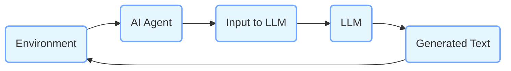

# AI Agent的创造力：激发LLM的创新能力

> 关键词：AI Agent、大语言模型（LLM）、创造力、创新能力、生成式AI

> 摘要：本文聚焦于AI Agent的创造力，深入探讨如何激发大语言模型（LLM）的创新能力。首先介绍了相关背景信息，包括目的、预期读者、文档结构和术语表。接着阐述了核心概念与联系，通过文本示意图和Mermaid流程图展示其原理和架构。详细讲解了核心算法原理及具体操作步骤，结合Python源代码进行说明。同时给出了数学模型和公式，并举例解释。通过项目实战，从开发环境搭建到源代码实现和解读，展示了如何在实际中运用相关技术。分析了实际应用场景，推荐了学习资源、开发工具框架和相关论文著作。最后总结了未来发展趋势与挑战，还包含常见问题解答和扩展阅读参考资料，旨在为读者全面呈现AI Agent激发LLM创新能力的相关知识和技术。

## 1. 背景介绍 
### 1.1 目的和范围
本文章的目的在于深入探讨AI Agent如何激发大语言模型（LLM）的创新能力。随着人工智能技术的飞速发展，LLM已经在多个领域展现出强大的能力，但在创造力方面仍有提升空间。AI Agent作为一种能够自主执行任务和与环境交互的智能实体，有望为LLM带来新的创新活力。文章将涵盖AI Agent和LLM的基本概念、相关算法原理、数学模型，通过实际案例展示如何运用这些技术激发创新能力，并分析其在不同场景下的应用。

### 1.2 预期读者
本文预期读者包括人工智能领域的研究者、开发者、技术爱好者，以及对AI Agent和LLM创新应用感兴趣的相关行业人士。对于希望深入了解如何提升LLM创造力的专业人员，文章将提供理论和实践方面的指导；对于初学者，也能通过详细的解释和案例，初步掌握相关技术的核心要点。

### 1.3 文档结构概述
本文将按照以下结构进行组织：首先介绍核心概念与联系，通过文本示意图和Mermaid流程图清晰展示AI Agent和LLM之间的关系和架构；接着讲解核心算法原理及具体操作步骤，结合Python代码进行详细说明；然后给出数学模型和公式，并举例解释其应用；通过项目实战，从开发环境搭建到源代码实现和解读，展示如何在实际中运用相关技术；分析实际应用场景，为读者提供实际应用的思路；推荐学习资源、开发工具框架和相关论文著作，帮助读者进一步深入学习；最后总结未来发展趋势与挑战，解答常见问题，并提供扩展阅读和参考资料。

### 1.4 术语表
#### 1.4.1 核心术语定义
- **AI Agent**：一种能够感知环境、自主决策并执行相应动作以实现特定目标的智能实体。它可以与环境进行交互，根据环境反馈调整自身行为。
- **大语言模型（LLM）**：基于深度学习技术，通过在大规模文本数据上进行训练得到的语言模型。它能够理解和生成自然语言文本，在语言理解、文本生成等任务中表现出色。
- **创造力**：在本文中，指LLM能够生成新颖、有价值且具有独特视角的文本内容的能力。
- **创新能力**：与创造力相关，强调LLM在解决问题、生成新观点和思路等方面的能力。

#### 1.4.2 相关概念解释
- **生成式AI**：一类能够自动生成新内容的人工智能技术，LLM是生成式AI的典型代表之一。它通过学习大量数据的模式和规律，能够生成与训练数据类似但又具有一定创新性的文本。
- **强化学习**：一种机器学习方法，智能体（如AI Agent）通过与环境进行交互，根据环境给予的奖励信号来学习最优的行为策略。在激发LLM创新能力中，强化学习可以用于引导AI Agent探索更有创意的文本生成方向。

#### 1.4.3 缩略词列表
- **LLM**：Large Language Model（大语言模型）
- **AI**：Artificial Intelligence（人工智能）

## 2. 核心概念与联系 

### 核心概念原理
AI Agent和LLM是两个不同但又相互关联的概念。LLM作为一种强大的语言处理工具，能够根据输入的文本生成相应的输出。然而，LLM本身的输出往往受到训练数据和模型结构的限制，缺乏足够的创造力。

AI Agent则可以通过与环境交互和自主决策，为LLM提供多样化的输入和引导，从而激发LLM的创新能力。AI Agent可以根据不同的任务和目标，选择合适的输入文本、调整生成参数，甚至与多个LLM进行协作，以生成更具创新性的文本内容。

### 架构的文本示意图
```plaintext
               +-----------------+
               |     Environment   |
               +-----------------+
                        |
                        v
               +-----------------+
               |     AI Agent     |
               +-----------------+
                        |
                        | Input
                        v
               +-----------------+
               |     LLM          |
               +-----------------+
                        |
                        | Output
                        v
               +-----------------+
               |   Generated Text |
               +-----------------+
```
在这个架构中，环境为AI Agent提供了信息和反馈。AI Agent根据环境信息和自身的目标，选择合适的输入传递给LLM。LLM根据输入生成文本输出，这些输出可以进一步反馈给环境，形成一个闭环的交互过程。

### Mermaid流程图

该流程图展示了AI Agent、LLM和环境之间的交互过程。环境的信息影响AI Agent的决策，AI Agent将输入传递给LLM，LLM生成文本后反馈给环境，形成一个持续的循环，不断促进文本的创新生成。

## 3. 核心算法原理 & 具体操作步骤 

### 核心算法原理
为了激发LLM的创新能力，我们可以采用基于强化学习的算法。强化学习的核心思想是智能体（AI Agent）通过与环境交互，根据环境给予的奖励信号来学习最优的行为策略。

在这个场景中，AI Agent的行为是选择合适的输入文本和生成参数传递给LLM，环境的奖励信号可以根据生成文本的创新性、实用性等指标来定义。例如，如果生成的文本具有新颖的观点、独特的表达方式，或者能够有效解决问题，就给予较高的奖励；反之，则给予较低的奖励。

AI Agent通过不断尝试不同的行为，根据奖励信号调整自己的策略，逐渐找到能够使LLM生成更具创新性文本的方法。

### 具体操作步骤
#### 步骤1：定义状态、动作和奖励
- **状态**：可以定义为当前环境的信息，例如任务描述、历史生成文本等。
- **动作**：AI Agent可以采取的行为，如选择不同的输入文本、调整生成参数（如温度、采样策略等）。
- **奖励**：根据生成文本的创新性和实用性来定义。例如，可以使用人工评估、自动评估指标（如困惑度、新颖度等）来计算奖励。

#### 步骤2：初始化AI Agent和LLM
- 初始化AI Agent的策略网络，用于选择动作。
- 加载预训练的LLM模型。

#### 步骤3：交互过程
- AI Agent根据当前状态选择一个动作。
- 将动作对应的输入文本和参数传递给LLM，生成文本。
- 根据生成文本计算奖励。
- 使用奖励更新AI Agent的策略网络。

#### 步骤4：重复交互
重复步骤3，直到达到预设的训练步数或满足停止条件。

### Python源代码详细阐述
```python
import torch
import torch.nn as nn
import torch.optim as optim
from transformers import GPT2LMHeadModel, GPT2Tokenizer

# 定义AI Agent的策略网络
class AIAgent(nn.Module):
    def __init__(self, input_dim, action_dim):
        super(AIAgent, self).__init__()
        self.fc1 = nn.Linear(input_dim, 128)
        self.fc2 = nn.Linear(128, action_dim)

    def forward(self, x):
        x = torch.relu(self.fc1(x))
        x = self.fc2(x)
        return x

# 初始化LLM
tokenizer = GPT2Tokenizer.from_pretrained('gpt2')
llm = GPT2LMHeadModel.from_pretrained('gpt2')

# 初始化AI Agent
input_dim = 10  # 假设状态维度为10
action_dim = 5  # 假设动作维度为5
agent = AIAgent(input_dim, action_dim)
optimizer = optim.Adam(agent.parameters(), lr=0.001)

# 模拟交互过程
num_steps = 100
for step in range(num_steps):
    # 生成随机状态
    state = torch.randn(input_dim)

    # AI Agent选择动作
    action_probs = torch.softmax(agent(state), dim=0)
    action = torch.multinomial(action_probs, 1).item()

    # 根据动作生成输入文本和参数
    # 这里简单假设动作对应不同的输入文本
    input_texts = ["Tell me a story", "Write a poem", "Describe a scene", "Give an opinion", "Solve a problem"]
    input_text = input_texts[action]
    input_ids = tokenizer.encode(input_text, return_tensors='pt')

    # LLM生成文本
    output = llm.generate(input_ids)
    generated_text = tokenizer.decode(output[0], skip_special_tokens=True)

    # 计算奖励（这里简单使用随机奖励）
    reward = torch.randn(1).item()

    # 更新AI Agent的策略网络
    loss = -torch.log(action_probs[action]) * reward
    optimizer.zero_grad()
    loss.backward()
    optimizer.step()

    print(f"Step {step}: Action = {action}, Generated Text = {generated_text}, Reward = {reward}")
```
在这段代码中，我们首先定义了AI Agent的策略网络`AIAgent`，使用简单的全连接层。然后初始化了LLM和AI Agent。在交互过程中，AI Agent根据当前状态选择动作，将动作对应的输入文本传递给LLM生成文本，计算奖励并更新策略网络。

## 4. 数学模型和公式 & 详细讲解 & 举例说明 

### 强化学习基本公式
在强化学习中，我们通常使用马尔可夫决策过程（MDP）来描述智能体与环境的交互。MDP可以用一个五元组 $(S, A, P, R, \gamma)$ 表示，其中：
- $S$ 是状态空间，包含所有可能的状态。
- $A$ 是动作空间，包含智能体可以采取的所有动作。
- $P(s'|s, a)$ 是状态转移概率，表示在状态 $s$ 采取动作 $a$ 后转移到状态 $s'$ 的概率。
- $R(s, a)$ 是奖励函数，表示在状态 $s$ 采取动作 $a$ 后获得的即时奖励。
- $\gamma \in [0, 1]$ 是折扣因子，用于权衡即时奖励和未来奖励。

智能体的目标是最大化长期累积奖励，定义为：
$$G_t = \sum_{k=0}^{\infty} \gamma^k R_{t+k+1}$$
其中 $G_t$ 是从时间步 $t$ 开始的长期累积奖励，$R_{t+k+1}$ 是时间步 $t + k + 1$ 获得的即时奖励。

### 策略梯度算法
为了学习最优策略，我们可以使用策略梯度算法。策略梯度算法的核心思想是通过梯度上升的方法来最大化长期累积奖励的期望。

策略函数 $\pi(a|s; \theta)$ 表示在状态 $s$ 下采取动作 $a$ 的概率，参数为 $\theta$。策略梯度定理表明，策略参数 $\theta$ 的梯度可以表示为：
$$\nabla_{\theta} J(\theta) = \mathbb{E}_{\tau} \left[ \sum_{t=0}^{T} \nabla_{\theta} \log \pi(a_t|s_t; \theta) G_t \right]$$
其中 $J(\theta)$ 是策略的性能指标（即长期累积奖励的期望），$\tau = (s_0, a_0, r_0, s_1, a_1, r_1, \cdots)$ 是一个轨迹，$T$ 是轨迹的长度。

### 详细讲解
在我们的场景中，状态 $s$ 可以是当前的任务描述和历史生成文本的特征表示，动作 $a$ 是AI Agent选择的输入文本和生成参数，奖励 $R(s, a)$ 可以根据生成文本的创新性和实用性来计算。

策略函数 $\pi(a|s; \theta)$ 由AI Agent的策略网络表示，参数 $\theta$ 是策略网络的权重。通过不断更新策略网络的权重，使得策略梯度 $\nabla_{\theta} J(\theta)$ 朝着正方向移动，从而提高策略的性能，即让AI Agent能够选择更有利于激发LLM创新能力的动作。

### 举例说明
假设我们要让LLM生成一篇关于未来城市的创新文章。初始状态 $s_0$ 可以是任务描述“Write an innovative article about future cities”。AI Agent根据策略函数 $\pi(a|s_0; \theta)$ 选择一个动作 $a_0$，例如选择输入文本“Imagine a city floating in the sky”和合适的生成参数。

LLM根据输入生成一篇文章，我们通过人工评估或自动评估指标计算奖励 $R(s_0, a_0)$。如果文章具有新颖的观点和独特的描述，奖励较高；反之，奖励较低。

然后，根据策略梯度公式更新策略网络的参数 $\theta$，使得在后续遇到类似状态时，AI Agent更有可能选择能够获得高奖励的动作。

## 5. 项目实战：代码实际案例和详细解释说明 

### 5.1  开发环境搭建
#### 安装Python
首先，确保你已经安装了Python 3.7或更高版本。可以从Python官方网站（https://www.python.org/downloads/）下载并安装。

#### 安装必要的库
使用`pip`安装以下必要的库：
```bash
pip install torch transformers
```
- `torch`：PyTorch是一个深度学习框架，用于构建和训练神经网络。
- `transformers`：Hugging Face的Transformers库提供了预训练的语言模型和相关工具，方便我们使用LLM。

### 5.2  源代码详细实现和代码解读
```python
import torch
import torch.nn as nn
import torch.optim as optim
from transformers import GPT2LMHeadModel, GPT2Tokenizer
import random

# 定义AI Agent的策略网络
class AIAgent(nn.Module):
    def __init__(self, input_dim, action_dim):
        super(AIAgent, self).__init__()
        self.fc1 = nn.Linear(input_dim, 128)
        self.fc2 = nn.Linear(128, action_dim)

    def forward(self, x):
        x = torch.relu(self.fc1(x))
        x = self.fc2(x)
        return x

# 初始化LLM
tokenizer = GPT2Tokenizer.from_pretrained('gpt2')
llm = GPT2LMHeadModel.from_pretrained('gpt2')

# 初始化AI Agent
input_dim = 10  # 假设状态维度为10
action_dim = 5  # 假设动作维度为5
agent = AIAgent(input_dim, action_dim)
optimizer = optim.Adam(agent.parameters(), lr=0.001)

# 模拟任务环境
tasks = ["Write a story about a magical forest", "Create a poem about the ocean", "Describe a futuristic city"]

# 训练过程
num_episodes = 10
for episode in range(num_episodes):
    # 随机选择一个任务
    task = random.choice(tasks)
    # 生成随机状态
    state = torch.randn(input_dim)

    # AI Agent选择动作
    action_probs = torch.softmax(agent(state), dim=0)
    action = torch.multinomial(action_probs, 1).item()

    # 根据动作生成输入文本和参数
    input_texts = ["Start with a mysterious event", "Use vivid imagery", "Introduce a unique character"]
    input_text = f"{task}. {input_texts[action]}"
    input_ids = tokenizer.encode(input_text, return_tensors='pt')

    # LLM生成文本
    output = llm.generate(input_ids)
    generated_text = tokenizer.decode(output[0], skip_special_tokens=True)

    # 简单的奖励评估函数（这里可以替换为更复杂的评估指标）
    if "unique" in generated_text.lower():
        reward = 1
    else:
        reward = -1

    # 更新AI Agent的策略网络
    loss = -torch.log(action_probs[action]) * reward
    optimizer.zero_grad()
    loss.backward()
    optimizer.step()

    print(f"Episode {episode}: Action = {action}, Generated Text = {generated_text}, Reward = {reward}")
```
### 代码解读
1. **定义AI Agent的策略网络**：`AIAgent`类是一个简单的全连接神经网络，包含两个线性层。输入维度为`input_dim`，输出维度为`action_dim`，表示不同的动作。
2. **初始化LLM**：使用`transformers`库加载预训练的GPT-2模型和对应的分词器。
3. **初始化AI Agent**：创建AI Agent实例和优化器，使用Adam优化器更新策略网络的参数。
4. **模拟任务环境**：定义了一些任务，如写故事、写诗、描述未来城市等。
5. **训练过程**：
    - 随机选择一个任务。
    - 生成随机状态。
    - AI Agent根据状态选择动作。
    - 根据动作生成输入文本，结合任务描述传递给LLM。
    - LLM生成文本。
    - 使用简单的奖励评估函数计算奖励。
    - 根据奖励更新AI Agent的策略网络。

### 5.3  代码解读与分析
- **策略网络的作用**：AI Agent的策略网络用于根据当前状态选择动作。通过不断训练，策略网络可以学习到更优的动作选择策略，从而提高生成文本的创新性。
- **奖励评估函数的影响**：奖励评估函数直接影响AI Agent的学习方向。在这个简单的例子中，我们根据生成文本中是否包含“unique”来计算奖励。在实际应用中，可以使用更复杂的评估指标，如新颖度、连贯性、实用性等。
- **训练的收敛性**：由于强化学习的特性，训练过程可能会比较不稳定。可以通过调整学习率、增加训练步数、使用更复杂的策略网络等方法来提高训练的稳定性和收敛速度。

## 6. 实际应用场景 
### 内容创作
在文学创作、新闻写作、广告文案等领域，AI Agent可以激发LLM的创新能力，生成更具吸引力和独特性的内容。例如，在文学创作中，AI Agent可以根据不同的主题和风格要求，选择合适的输入引导LLM生成富有创意的故事、诗歌等。在广告文案创作中，AI Agent可以根据产品特点和目标受众，引导LLM生成具有创新性和说服力的文案。

### 问题解决
在科学研究、工程设计等领域，AI Agent可以帮助LLM从不同的角度思考问题，提出创新的解决方案。例如，在科学研究中，AI Agent可以根据研究问题和已有数据，引导LLM生成新的假设和研究思路。在工程设计中，AI Agent可以结合设计要求和约束条件，引导LLM生成创新的设计方案。

### 教育领域
在教育中，AI Agent可以激发LLM的创新能力，为学生提供更个性化、多样化的学习资源和辅导。例如，AI Agent可以根据学生的学习进度和兴趣爱好，引导LLM生成适合学生的练习题、讲解材料和拓展内容，帮助学生更好地理解和掌握知识。

### 娱乐产业
在游戏开发、影视制作等娱乐产业中，AI Agent可以与LLM结合，生成更具创意和互动性的内容。例如，在游戏中，AI Agent可以根据玩家的行为和游戏情节，引导LLM生成动态的剧情和对话，增强游戏的趣味性和沉浸感。在影视制作中，AI Agent可以帮助编剧和导演生成新颖的剧本创意和场景设计。

## 7. 工具和资源推荐
### 7.1 学习资源推荐
#### 7.1.1 书籍推荐
- 《深度学习》（Deep Learning）：由Ian Goodfellow、Yoshua Bengio和Aaron Courville所著，是深度学习领域的经典教材，涵盖了神经网络、优化算法、生成模型等方面的知识。
- 《强化学习：原理与Python实现》：详细介绍了强化学习的基本原理、算法和实际应用，通过Python代码示例帮助读者理解和掌握强化学习技术。
- 《自然语言处理入门》：适合初学者，介绍了自然语言处理的基本概念、方法和技术，包括词法分析、句法分析、语义理解等内容。

#### 7.1.2 在线课程
- Coursera上的“深度学习专项课程”（Deep Learning Specialization）：由Andrew Ng教授授课，包括神经网络基础、卷积神经网络、循环神经网络等多个课程，系统地介绍了深度学习的理论和实践。
- edX上的“强化学习基础”（Fundamentals of Reinforcement Learning）：讲解了强化学习的基本概念、算法和应用，通过案例分析和编程实践帮助学员掌握强化学习技术。
- Hugging Face的“自然语言处理课程”：提供了关于使用Transformers库进行自然语言处理的详细教程，包括文本分类、情感分析、文本生成等任务。

#### 7.1.3 技术博客和网站
- Medium：有许多关于人工智能、深度学习和自然语言处理的技术博客文章，作者来自不同的研究机构和企业，分享了最新的研究成果和实践经验。
- arXiv：是一个预印本平台，提供了大量关于人工智能、机器学习和自然语言处理的学术论文，读者可以及时了解最新的研究动态。
- Hugging Face官方博客：发布了关于Transformers库的更新和应用案例，对于学习和使用LLM非常有帮助。

### 7.2 开发工具框架推荐
#### 7.2.1 IDE和编辑器
- PyCharm：是一款专业的Python集成开发环境，提供了代码编辑、调试、版本控制等功能，适合开发Python项目，尤其是深度学习和自然语言处理项目。
- Jupyter Notebook：是一个交互式的开发环境，支持Python、R等多种编程语言。它以笔记本的形式展示代码和结果，方便进行实验和数据分析，非常适合深度学习和自然语言处理的研究和开发。
- Visual Studio Code：是一款轻量级的代码编辑器，支持多种编程语言和插件扩展。它具有丰富的代码提示、调试功能，并且可以与Git等版本控制系统集成，是开发Python项目的常用工具之一。

#### 7.2.2 调试和性能分析工具
- TensorBoard：是TensorFlow提供的可视化工具，也可以与PyTorch结合使用。它可以用于可视化训练过程中的损失函数、准确率等指标，帮助开发者监控模型的训练情况。
- PyTorch Profiler：是PyTorch提供的性能分析工具，可以帮助开发者分析模型的计算瓶颈和内存使用情况，优化模型的性能。
- cProfile：是Python标准库中的性能分析模块，可以用于分析Python代码的运行时间和函数调用情况，帮助开发者找出代码中的性能瓶颈。

#### 7.2.3 相关框架和库
- PyTorch：是一个开源的深度学习框架，提供了丰富的神经网络层和优化算法，支持GPU加速。它具有简洁的API和动态计算图的特点，适合快速开发和实验深度学习模型。
- TensorFlow：是另一个广泛使用的深度学习框架，提供了高级的模型构建和训练接口，支持分布式训练和部署。它在工业界和学术界都有广泛的应用。
- Transformers：是Hugging Face开发的自然语言处理库，提供了大量预训练的语言模型，如GPT-2、BERT等，以及相应的工具和接口，方便开发者进行文本分类、情感分析、文本生成等任务。

### 7.3 相关论文著作推荐
#### 7.3.1 经典论文
- “Attention Is All You Need”：提出了Transformer架构，是现代大语言模型的基础。该论文介绍了Transformer的原理和训练方法，为自然语言处理领域带来了革命性的变化。
- “Human-Level Control through Deep Reinforcement Learning”：介绍了深度强化学习在游戏领域的应用，通过深度Q网络（DQN）实现了在Atari游戏上的人类水平控制。
- “Generative Adversarial Networks”：提出了生成对抗网络（GAN）的概念，用于生成新的数据样本。GAN在图像生成、文本生成等领域都有广泛的应用。

#### 7.3.2 最新研究成果
- 关注顶级学术会议，如NeurIPS（神经信息处理系统大会）、ICML（国际机器学习会议）、ACL（计算语言学协会年会）等，这些会议上会发布关于人工智能、深度学习和自然语言处理的最新研究成果。
- 关注知名研究机构和学者的研究动态，如OpenAI、DeepMind等，他们在AI Agent、LLM等领域有很多前沿的研究工作。

#### 7.3.3 应用案例分析
- 一些企业和研究机构会发布关于AI Agent和LLM应用的案例分析报告，例如Google、Microsoft等公司的技术博客和研究报告。这些案例分析可以帮助读者了解如何将相关技术应用到实际场景中，解决实际问题。

## 8. 总结：未来发展趋势与挑战
### 未来发展趋势
- **更强大的模型融合**：未来，AI Agent和LLM可能会与其他类型的模型，如图像模型、音频模型等进行更深度的融合，实现多模态的创新。例如，在内容创作中，可以同时生成文本、图像和音频，提供更加丰富和生动的体验。
- **个性化创新**：随着对用户数据的深入分析和理解，AI Agent可以根据用户的个性化需求和偏好，更精准地激发LLM的创新能力，为用户提供量身定制的创新内容和解决方案。
- **自主学习和进化**：AI Agent有望具备更强的自主学习和进化能力，能够在不断的交互过程中自动调整策略，适应不同的环境和任务，持续提高激发LLM创新能力的效果。

### 挑战
- **评估标准的不确定性**：目前，对于LLM生成内容的创新性评估还缺乏统一和准确的标准。不同的人对于创新的理解和判断可能存在差异，这给奖励评估和模型训练带来了困难。
- **数据隐私和安全问题**：在激发LLM创新能力的过程中，需要大量的数据进行训练和交互。如何保护用户数据的隐私和安全，防止数据泄露和滥用，是一个亟待解决的问题。
- **伦理和法律问题**：AI Agent激发LLM创新能力可能会产生一些伦理和法律问题，例如生成虚假信息、侵犯知识产权等。需要建立相应的伦理和法律规范，引导技术的合理应用。

## 9. 附录：常见问题与解答
### 问题1：AI Agent和LLM有什么区别？
AI Agent是一种能够感知环境、自主决策并执行相应动作的智能实体，它的主要作用是通过与环境交互，为LLM提供合适的输入和引导，以激发LLM的创新能力。而LLM是基于深度学习技术训练得到的语言模型，主要用于理解和生成自然语言文本。

### 问题2：如何评估LLM生成文本的创新性？
目前，评估LLM生成文本的创新性是一个具有挑战性的问题。可以采用人工评估和自动评估相结合的方法。人工评估可以邀请专业人员或用户对生成文本进行评价，考虑文本的新颖性、独特性、实用性等方面。自动评估可以使用一些指标，如困惑度、新颖度、与已有文本的相似度等，但这些指标还不够完善，需要进一步研究和改进。

### 问题3：强化学习在激发LLM创新能力中的作用是什么？
强化学习可以帮助AI Agent学习最优的行为策略，通过与环境交互和根据奖励信号调整策略，使得AI Agent能够选择更有利于激发LLM创新能力的输入文本和生成参数。通过不断的训练，AI Agent可以逐渐找到能够使LLM生成更具创新性文本的方法。

### 问题4：如何解决AI Agent训练过程中的不稳定问题？
可以通过以下方法解决AI Agent训练过程中的不稳定问题：
- 调整学习率：选择合适的学习率可以控制参数更新的步长，避免学习过程过于剧烈或缓慢。
- 增加训练步数：增加训练步数可以让AI Agent有更多的机会探索不同的动作和状态，提高学习的稳定性。
- 使用更复杂的策略网络：可以尝试使用更复杂的神经网络结构，如卷积神经网络（CNN）、循环神经网络（RNN）等，提高策略网络的表达能力。
- 经验回放：使用经验回放机制可以减少训练数据的相关性，提高训练的稳定性。

## 10. 扩展阅读 & 参考资料
- Goodfellow, I., Bengio, Y., & Courville, A. (2016). Deep Learning. MIT Press.
- Sutton, R. S., & Barto, A. G. (2018). Reinforcement Learning: An Introduction. MIT Press.
- Devlin, J., Chang, M. W., Lee, K., & Toutanova, K. (2018). BERT: Pre-training of Deep Bidirectional Transformers for Language Understanding. arXiv preprint arXiv:1810.04805.
- Vaswani, A., Shazeer, N., Parmar, N., Uszkoreit, J., Jones, L., Gomez, A. N.,... & Polosukhin, I. (2017). Attention Is All You Need. Advances in Neural Information Processing Systems, 5998-6008.
- Hugging Face官方文档：https://huggingface.co/docs
- PyTorch官方文档：https://pytorch.org/docs/stable/index.html

作者：AI天才研究院/AI Genius Institute & 禅与计算机程序设计艺术 /Zen And The Art of Computer Programming