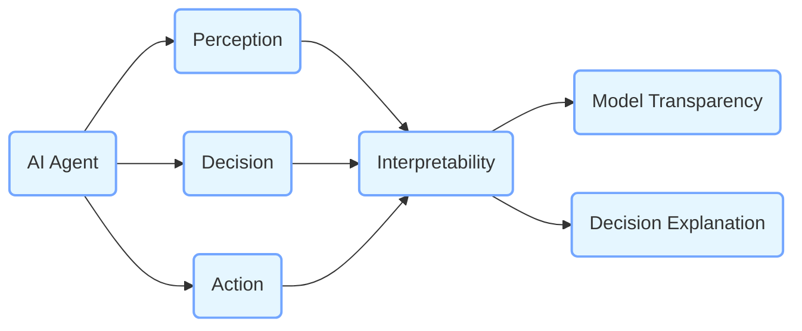

# AI Agent的可解释性设计原则

> 关键词：AI Agent、可解释性、设计原则、模型透明度、决策解释

> 摘要：本文聚焦于AI Agent的可解释性设计原则，旨在探讨如何让AI Agent的决策和行为变得可理解和可信赖。首先介绍了研究的背景、目的、预期读者以及文档结构等内容。接着阐述了AI Agent及可解释性的核心概念和它们之间的联系，并给出相应的示意图和流程图。详细讲解了实现可解释性的核心算法原理，通过Python代码进行了具体说明。深入探讨了相关的数学模型和公式，并举例说明。结合项目实战，给出了代码实际案例及详细解释。分析了AI Agent可解释性在不同场景下的实际应用。推荐了学习资源、开发工具框架以及相关论文著作。最后总结了未来发展趋势与挑战，提供了常见问题解答和扩展阅读参考资料，为AI Agent可解释性设计提供了全面且深入的指导。

## 1. 背景介绍 
### 1.1 目的和范围
随着人工智能技术的飞速发展，AI Agent在各个领域的应用越来越广泛，如医疗诊断、金融投资、自动驾驶等。然而，由于AI Agent的决策过程往往是复杂且难以理解的，这给其应用带来了一定的风险和挑战。例如，在医疗诊断中，如果医生无法理解AI Agent给出的诊断结果是如何得出的，就很难信任并采用该结果；在自动驾驶中，如果无法解释车辆的决策行为，一旦发生事故，就难以确定责任。因此，提高AI Agent的可解释性变得至关重要。

本文章的目的是深入探讨AI Agent的可解释性设计原则，为开发者和研究者提供一套系统的方法和指导，帮助他们设计出更具可解释性的AI Agent。范围涵盖了AI Agent可解释性的基本概念、核心算法、数学模型、实际应用场景等方面，并通过项目实战和代码示例进行详细说明。

### 1.2 预期读者
本文主要面向以下几类读者：
- **AI开发者**：希望在开发AI Agent时能够遵循可解释性设计原则，提高所开发系统的透明度和可信度。
- **研究人员**：对AI Agent可解释性领域感兴趣，希望深入了解相关理论和技术，开展进一步的研究工作。
- **行业从业者**：如医疗、金融、交通等领域的从业者，需要理解AI Agent的决策过程，以便更好地应用AI技术解决实际问题。
- **学生**：正在学习人工智能相关课程，希望通过本文了解AI Agent可解释性的基本概念和方法，拓宽知识面。

### 1.3 文档结构概述
本文将按照以下结构进行组织：
- **核心概念与联系**：介绍AI Agent和可解释性的核心概念，以及它们之间的联系，并通过示意图和流程图进行直观展示。
- **核心算法原理 & 具体操作步骤**：详细讲解实现AI Agent可解释性的核心算法原理，通过Python代码给出具体的操作步骤。
- **数学模型和公式 & 详细讲解 & 举例说明**：阐述相关的数学模型和公式，并结合具体例子进行详细解释。
- **项目实战：代码实际案例和详细解释说明**：通过一个实际的项目案例，展示如何在开发中应用可解释性设计原则，包括开发环境搭建、源代码实现和代码解读。
- **实际应用场景**：分析AI Agent可解释性在不同领域的实际应用场景。
- **工具和资源推荐**：推荐学习资源、开发工具框架以及相关论文著作，帮助读者进一步深入学习和研究。
- **总结：未来发展趋势与挑战**：总结AI Agent可解释性的未来发展趋势，并分析可能面临的挑战。
- **附录：常见问题与解答**：解答读者在学习和应用过程中可能遇到的常见问题。
- **扩展阅读 & 参考资料**：提供相关的扩展阅读材料和参考资料，方便读者进一步探索。

### 1.4 术语表
#### 1.4.1 核心术语定义
- **AI Agent**：是一种能够感知环境、做出决策并采取行动以实现特定目标的人工智能实体。它可以是软件程序、机器人等不同形式。
- **可解释性**：指的是能够以人类可理解的方式解释AI Agent的决策过程和行为结果。可解释性可以帮助用户信任AI Agent的决策，发现潜在的问题，并进行有效的监督和控制。
- **模型透明度**：表示AI Agent内部模型的可理解程度。高透明度的模型意味着其结构、参数和决策逻辑能够被清晰地解释。
- **决策解释**：对AI Agent做出的具体决策进行详细说明，包括决策所依据的信息、采用的规则或算法等。

#### 1.4.2 相关概念解释
- **黑盒模型**：指那些内部工作机制难以理解的AI模型，其输入和输出之间的关系不明确，就像一个封闭的黑盒子。大多数深度学习模型都属于黑盒模型。
- **白盒模型**：与黑盒模型相反，白盒模型的内部结构和决策过程是清晰可解释的，例如决策树模型。
- **局部解释**：针对AI Agent的某个具体决策进行解释，侧重于说明该决策在特定输入下的产生原因。
- **全局解释**：从整体上解释AI Agent的决策行为，分析模型的一般特征和规律。

#### 1.4.3 缩略词列表
- **ML**：Machine Learning，机器学习
- **DL**：Deep Learning，深度学习
- **XAI**：Explainable Artificial Intelligence，可解释人工智能

## 2. 核心概念与联系 

### 2.1 AI Agent的基本概念
AI Agent是人工智能系统中的一个重要概念，它具有以下几个关键特性：
- **感知能力**：能够通过传感器或其他输入设备获取环境信息。例如，自动驾驶汽车通过摄像头、雷达等设备感知道路状况、其他车辆和行人的位置。
- **决策能力**：根据感知到的信息，运用一定的算法和规则做出决策。例如，在医疗诊断中，AI Agent根据患者的症状、检查结果等信息判断疾病类型。
- **行动能力**：根据决策结果采取相应的行动。例如，机器人根据决策结果移动到指定位置或执行特定任务。

### 2.2 可解释性的重要性
可解释性对于AI Agent的应用至关重要，主要体现在以下几个方面：
- **信任建立**：用户只有理解了AI Agent的决策过程，才会信任其给出的结果。例如，在金融投资领域，投资者需要了解AI Agent的投资策略是如何制定的，才会放心地将资金交给它管理。
- **问题发现**：可解释性有助于发现AI Agent中的潜在问题。如果决策过程无法解释，就很难判断其是否存在错误或偏差。例如，在图像识别系统中，如果无法解释为什么将某个图像识别为特定的类别，就可能存在误判的情况。
- **合规性要求**：在一些领域，如医疗、金融等，法律法规对AI系统的可解释性有明确要求。例如，医疗诊断系统需要能够解释诊断结果的依据，以便医生进行审核和判断。

### 2.3 核心概念的联系
AI Agent的可解释性设计旨在让AI Agent的决策过程变得透明和可理解。通过提高模型透明度和提供决策解释，可以增强用户对AI Agent的信任，同时也便于对其进行监督和控制。具体来说，可解释性与AI Agent的感知、决策和行动能力密切相关：
- **感知层面**：可解释性要求AI Agent能够清晰地说明所感知到的信息以及这些信息是如何获取的。例如，在图像识别中，需要解释哪些图像特征被用于识别。
- **决策层面**：需要解释AI Agent是如何根据感知到的信息做出决策的，包括采用的算法、规则和模型参数等。
- **行动层面**：要说明决策结果是如何转化为具体行动的，以及这些行动对环境的影响。

### 2.4 文本示意图
```plaintext
             +-------------------+
             |    AI Agent       |
             |                   |
             |  +-------------+  |
             |  |  Perception |  |
             |  +-------------+  |
             |  |  Decision   |  |
             |  +-------------+  |
             |  |  Action     |  |
             |  +-------------+  |
             |                   |
             +-------------------+
                      |
                      |
                      v
             +-------------------+
             |  Interpretability |
             |                   |
             |  +-------------+  |
             |  |  Model       |  |
             |  |  Transparency|  |
             |  +-------------+  |
             |  |  Decision    |  |
             |  |  Explanation |  |
             |  +-------------+  |
             |                   |
             +-------------------+
```

### 2.5 Mermaid流程图


## 3. 核心算法原理 & 具体操作步骤 

### 3.1 基于特征重要性的可解释性算法
#### 3.1.1 算法原理
基于特征重要性的可解释性算法通过计算输入特征对模型输出的影响程度，来解释模型的决策过程。常见的方法有随机森林的特征重要性计算、梯度提升树的特征重要性计算等。以随机森林为例，其特征重要性的计算原理是：在构建随机森林的过程中，每个决策树都会根据特征的划分情况来评估特征的重要性。最后，将所有决策树的特征重要性进行平均，得到整个随机森林的特征重要性。

#### 3.1.2 Python代码实现
```python
import numpy as np
from sklearn.ensemble import RandomForestClassifier
from sklearn.datasets import load_iris

# 加载数据集
iris = load_iris()
X = iris.data
y = iris.target

# 训练随机森林模型
model = RandomForestClassifier(n_estimators=100)
model.fit(X, y)

# 计算特征重要性
feature_importances = model.feature_importances_

# 打印特征重要性
for i in range(len(iris.feature_names)):
    print(f"{iris.feature_names[i]}: {feature_importances[i]}")
```
#### 3.1.3 代码解释
- 首先，使用`sklearn.datasets.load_iris`函数加载鸢尾花数据集。
- 然后，创建一个随机森林分类器`RandomForestClassifier`，并使用`fit`方法对模型进行训练。
- 接着，通过`feature_importances_`属性获取模型的特征重要性。
- 最后，遍历特征名称列表，打印每个特征的重要性。

### 3.2 局部可解释模型无关解释（LIME）算法
#### 3.2.1 算法原理
LIME算法是一种局部可解释模型无关解释方法，它的核心思想是在局部范围内构建一个简单的可解释模型来近似复杂的黑盒模型。具体步骤如下：
1. 选择一个需要解释的样本。
2. 在该样本的局部邻域内生成大量的扰动样本。
3. 使用黑盒模型对这些扰动样本进行预测。
4. 根据预测结果训练一个简单的可解释模型，如线性回归模型。
5. 使用可解释模型的系数来解释黑盒模型在该样本上的决策。

#### 3.2.2 Python代码实现
```python
import numpy as np
from sklearn.datasets import load_iris
from sklearn.ensemble import RandomForestClassifier
import lime
import lime.lime_tabular

# 加载数据集
iris = load_iris()
X = iris.data
y = iris.target

# 训练随机森林模型
model = RandomForestClassifier(n_estimators=100)
model.fit(X, y)

# 创建LIME解释器
explainer = lime.lime_tabular.LimeTabularExplainer(X, feature_names=iris.feature_names, class_names=iris.target_names, discretize_continuous=False)

# 选择一个需要解释的样本
sample_index = 0
sample = X[sample_index]

# 生成解释
explanation = explainer.explain_instance(sample, model.predict_proba, num_features=4)

# 打印解释结果
explanation.show_in_notebook(show_table=True)
```
#### 3.2.3 代码解释
- 首先，加载鸢尾花数据集并训练随机森林模型。
- 然后，创建一个`LimeTabularExplainer`对象，用于解释表格数据。
- 选择一个需要解释的样本，并使用`explain_instance`方法生成解释。
- 最后，使用`show_in_notebook`方法显示解释结果。

## 4. 数学模型和公式 & 详细讲解 & 举例说明 

### 4.1 随机森林特征重要性的数学模型
#### 4.1.1 基尼不纯度
在随机森林中，常用基尼不纯度（Gini impurity）来衡量特征的重要性。基尼不纯度的计算公式为：
$$Gini(p) = 1 - \sum_{i=1}^{n} p_i^2$$
其中，$p_i$ 表示第 $i$ 类样本在某个节点中的比例，$n$ 表示类别数。

#### 4.1.2 特征重要性计算
随机森林中某个特征的重要性可以通过以下公式计算：
$$FI_j = \sum_{t=1}^{T} w_t \cdot \Delta Gini_j^t$$
其中，$FI_j$ 表示第 $j$ 个特征的重要性，$T$ 表示随机森林中决策树的数量，$w_t$ 表示第 $t$ 棵决策树的权重（通常为 1），$\Delta Gini_j^t$ 表示第 $t$ 棵决策树中第 $j$ 个特征的基尼不纯度减少量。

#### 4.1.3 举例说明
假设我们有一个二分类问题，某个节点包含 10 个样本，其中 6 个属于类别 1，4 个属于类别 2。则该节点的基尼不纯度为：
$$Gini(p) = 1 - (\frac{6}{10})^2 - (\frac{4}{10})^2 = 1 - 0.36 - 0.16 = 0.48$$
如果使用某个特征对该节点进行划分后，左子节点包含 4 个样本，其中 3 个属于类别 1，1 个属于类别 2；右子节点包含 6 个样本，其中 3 个属于类别 1，3 个属于类别 2。则左子节点的基尼不纯度为：
$$Gini(p_{left}) = 1 - (\frac{3}{4})^2 - (\frac{1}{4})^2 = 1 - 0.5625 - 0.0625 = 0.375$$
右子节点的基尼不纯度为：
$$Gini(p_{right}) = 1 - (\frac{3}{6})^2 - (\frac{3}{6})^2 = 1 - 0.25 - 0.25 = 0.5$$
该特征的基尼不纯度减少量为：
$$\Delta Gini = 0.48 - \frac{4}{10} \times 0.375 - \frac{6}{10} \times 0.5 = 0.48 - 0.15 - 0.3 = 0.03$$

### 4.2 LIME算法的数学模型
#### 4.2.1 局部近似模型
LIME算法在局部范围内构建一个线性回归模型来近似黑盒模型。线性回归模型的表达式为：
$$\hat{f}(x) = \sum_{i=1}^{d} \beta_i x_i + \beta_0$$
其中，$\hat{f}(x)$ 表示线性回归模型的预测值，$x_i$ 表示第 $i$ 个特征的值，$\beta_i$ 表示第 $i$ 个特征的系数，$\beta_0$ 表示截距。

#### 4.2.2 权重函数
为了使局部近似模型更关注靠近需要解释的样本的扰动样本，LIME算法使用一个权重函数来对扰动样本进行加权。常用的权重函数是高斯核函数：
$$\pi_x(z) = exp(-\frac{D(x, z)^2}{\sigma^2})$$
其中，$\pi_x(z)$ 表示样本 $z$ 相对于样本 $x$ 的权重，$D(x, z)$ 表示样本 $x$ 和样本 $z$ 之间的距离，$\sigma$ 是一个超参数。

#### 4.2.3 目标函数
LIME算法的目标是最小化以下目标函数：
$$\xi(x) = \min_{\beta} L(f, \hat{f}, \pi_x) + \Omega(\hat{f})$$
其中，$L(f, \hat{f}, \pi_x)$ 表示黑盒模型 $f$ 和线性回归模型 $\hat{f}$ 之间的加权损失，$\Omega(\hat{f})$ 表示线性回归模型的复杂度惩罚项。

#### 4.2.4 举例说明
假设我们有一个需要解释的样本 $x$，其特征向量为 $(x_1, x_2)$。在局部邻域内生成了 10 个扰动样本 $z_1, z_2, \cdots, z_{10}$，并使用黑盒模型对这些样本进行预测，得到预测结果 $y_1, y_2, \cdots, y_{10}$。然后，使用高斯核函数计算每个扰动样本相对于样本 $x$ 的权重 $\pi_x(z_1), \pi_x(z_2), \cdots, \pi_x(z_{10})$。最后，使用加权最小二乘法训练一个线性回归模型，使得目标函数 $\xi(x)$ 最小化。训练得到的线性回归模型的系数 $\beta_1$ 和 $\beta_2$ 就可以用来解释黑盒模型在样本 $x$ 上的决策。

## 5. 项目实战：代码实际案例和详细解释说明 

### 5.1  开发环境搭建
#### 5.1.1 安装Python
首先，确保你已经安装了Python 3.x版本。可以从Python官方网站（https://www.python.org/downloads/）下载并安装适合你操作系统的Python版本。

#### 5.1.2 创建虚拟环境
为了避免不同项目之间的依赖冲突，建议使用虚拟环境。可以使用`venv`模块创建虚拟环境：
```bash
python -m venv myenv
```
激活虚拟环境：
- 在Windows上：
```bash
myenv\Scripts\activate
```
- 在Linux或Mac上：
```bash
source myenv/bin/activate
```

#### 5.1.3 安装必要的库
在虚拟环境中安装必要的库，包括`numpy`、`scikit-learn`、`lime`等：
```bash
pip install numpy scikit-learn lime
```

### 5.2  源代码详细实现和代码解读
#### 5.2.1 项目背景
本项目的目标是构建一个基于随机森林的鸢尾花分类模型，并使用LIME算法对模型的决策进行解释。

#### 5.2.2 源代码实现
```python
import numpy as np
from sklearn.datasets import load_iris
from sklearn.ensemble import RandomForestClassifier
import lime
import lime.lime_tabular

# 加载数据集
iris = load_iris()
X = iris.data
y = iris.target

# 划分训练集和测试集
from sklearn.model_selection import train_test_split
X_train, X_test, y_train, y_test = train_test_split(X, y, test_size=0.2, random_state=42)

# 训练随机森林模型
model = RandomForestClassifier(n_estimators=100)
model.fit(X_train, y_train)

# 评估模型性能
from sklearn.metrics import accuracy_score
y_pred = model.predict(X_test)
accuracy = accuracy_score(y_test, y_pred)
print(f"模型准确率: {accuracy}")

# 创建LIME解释器
explainer = lime.lime_tabular.LimeTabularExplainer(X_train, feature_names=iris.feature_names, class_names=iris.target_names, discretize_continuous=False)

# 选择一个需要解释的样本
sample_index = 0
sample = X_test[sample_index]

# 生成解释
explanation = explainer.explain_instance(sample, model.predict_proba, num_features=4)

# 打印解释结果
explanation.show_in_notebook(show_table=True)
```

#### 5.2.3 代码解读
- **数据加载和划分**：使用`sklearn.datasets.load_iris`函数加载鸢尾花数据集，并使用`train_test_split`函数将数据集划分为训练集和测试集。
- **模型训练**：创建一个随机森林分类器`RandomForestClassifier`，并使用训练集对模型进行训练。
- **模型评估**：使用`accuracy_score`函数计算模型在测试集上的准确率。
- **LIME解释器创建**：创建一个`LimeTabularExplainer`对象，用于解释表格数据。
- **样本选择和解释生成**：选择一个需要解释的样本，并使用`explain_instance`方法生成解释。
- **解释结果显示**：使用`show_in_notebook`方法显示解释结果。

### 5.3  代码解读与分析
#### 5.3.1 模型性能分析
通过计算模型在测试集上的准确率，我们可以评估模型的性能。在本项目中，模型的准确率较高，说明随机森林模型能够较好地对鸢尾花进行分类。

#### 5.3.2 解释结果分析
LIME算法生成的解释结果可以帮助我们理解模型在某个具体样本上的决策过程。解释结果通常会显示每个特征对模型预测结果的影响程度，以及该特征的取值是如何影响预测结果的。例如，如果某个特征的系数为正，说明该特征的取值越大，模型预测该样本属于某个类别的概率就越高；反之，如果系数为负，则说明该特征的取值越大，模型预测该样本属于某个类别的概率就越低。

## 6. 实际应用场景 
### 6.1 医疗诊断
在医疗诊断领域，AI Agent可以辅助医生进行疾病诊断。例如，通过分析患者的病历、检查结果等信息，AI Agent可以给出可能的疾病诊断结果。然而，医生需要了解AI Agent的决策过程，才能信任并采用该结果。可解释性设计原则可以帮助AI Agent解释诊断结果是如何得出的，例如哪些症状、检查指标对诊断结果影响较大。这样，医生可以根据解释结果进行进一步的判断和验证，提高诊断的准确性和可靠性。

### 6.2 金融投资
在金融投资领域，AI Agent可以用于投资组合优化、风险评估等。投资者需要了解AI Agent的投资策略和决策依据，才能放心地将资金交给它管理。可解释性设计原则可以使AI Agent解释其投资决策是基于哪些市场数据、经济指标和模型算法做出的。例如，在股票投资中，AI Agent可以解释为什么选择某些股票进行投资，以及这些股票的风险和收益情况。这样，投资者可以更好地理解投资风险，做出合理的投资决策。

### 6.3 自动驾驶
在自动驾驶领域，AI Agent需要实时感知环境并做出决策，如加速、减速、转弯等。一旦发生事故，需要明确AI Agent的决策过程是否合理。可解释性设计原则可以帮助解释车辆的决策行为，例如在遇到障碍物时，AI Agent是如何根据传感器数据判断障碍物的位置、速度和类型，并做出相应的避让决策的。这样，在事故发生时，可以快速分析原因，确定责任，同时也有助于提高自动驾驶系统的安全性和可靠性。

### 6.4 智能客服
在智能客服领域，AI Agent可以自动回答用户的问题。用户可能希望了解AI Agent是如何理解问题并给出答案的。可解释性设计原则可以使AI Agent解释其回答是基于哪些知识库、规则和算法生成的。例如，当用户询问某个产品的特点时，AI Agent可以解释它是从哪些产品文档中提取的信息，并根据什么逻辑进行整理和回答的。这样，用户可以更好地信任AI Agent的回答，同时也可以对回答进行进一步的追问和验证。

## 7. 工具和资源推荐
### 7.1 学习资源推荐
#### 7.1.1 书籍推荐
- 《可解释人工智能：黑盒模型可解释性方法指南》：这本书系统地介绍了可解释人工智能的各种方法和技术，包括模型无关的解释方法、基于模型的解释方法等，并通过大量的案例进行说明。
- 《Python机器学习实战》：虽然这本书主要介绍机器学习的基础知识和实践，但其中也包含了一些可解释性相关的内容，如决策树的可视化和特征重要性分析等。

#### 7.1.2 在线课程
- Coursera上的“Explainable AI”课程：该课程由知名教授授课，详细介绍了可解释人工智能的原理、方法和应用，通过视频讲解、案例分析和编程作业等方式帮助学员掌握相关知识和技能。
- edX上的“Artificial Intelligence: Ethics and Society”课程：虽然该课程主要关注人工智能的伦理和社会影响，但其中也涉及到了可解释性的重要性和相关技术。

#### 7.1.3 技术博客和网站
- Towards Data Science：这是一个知名的数据科学博客平台，上面有很多关于可解释人工智能的文章，包括最新的研究成果、技术应用案例等。
- Medium上的AI Explainability板块：汇集了众多可解释人工智能领域的专家和爱好者分享的文章和见解。

### 7.2 开发工具框架推荐
#### 7.2.1 IDE和编辑器
- PyCharm：是一款功能强大的Python集成开发环境，提供了代码编辑、调试、版本控制等一系列功能，非常适合开发Python项目。
- Jupyter Notebook：是一个交互式的笔记本环境，可以方便地进行代码编写、运行和可视化展示，常用于数据科学和机器学习项目的开发。

#### 7.2.2 调试和性能分析工具
- TensorBoard：是TensorFlow提供的一个可视化工具，可以用于查看模型的训练过程、性能指标、计算图等，帮助开发者进行调试和优化。
- Py-Spy：是一个轻量级的Python性能分析工具，可以实时监控Python程序的CPU使用率、函数调用情况等，帮助开发者找出性能瓶颈。

#### 7.2.3 相关框架和库
- LIME：是一个用于生成局部可解释模型无关解释的Python库，支持多种数据类型和机器学习模型。
- SHAP：是一个用于计算特征重要性和生成全局解释的Python库，基于博弈论的方法，可以为各种机器学习模型提供统一的解释框架。

### 7.3 相关论文著作推荐
#### 7.3.1 经典论文
- “Why Should I Trust You?” Explaining the Predictions of Any Classifier：这篇论文提出了LIME算法，是可解释人工智能领域的经典之作，详细介绍了LIME算法的原理和实现方法。
- A Unified Approach to Interpreting Model Predictions：这篇论文提出了SHAP值的概念，为特征重要性的计算和模型解释提供了一种统一的方法。

#### 7.3.2 最新研究成果
- 关注顶级学术会议如NeurIPS、ICML、AAAI等上发表的关于可解释人工智能的论文，了解该领域的最新研究动态和技术发展趋势。

#### 7.3.3 应用案例分析
- 一些知名企业和研究机构会发布关于可解释人工智能在实际应用中的案例分析报告，如谷歌、微软等公司的研究博客，这些案例可以帮助我们更好地理解可解释性在不同领域的应用场景和实现方法。

## 8. 总结：未来发展趋势与挑战
### 8.1 未来发展趋势
#### 8.1.1 多模态可解释性
随着人工智能技术的发展，越来越多的AI Agent需要处理多模态数据，如图像、文本、语音等。未来，可解释性设计将不仅仅局限于单一模态数据，而是需要实现多模态数据的可解释性。例如，在一个智能医疗诊断系统中，AI Agent需要同时分析患者的病历文本、医学影像等多模态数据，并解释诊断结果是如何综合这些数据得出的。

#### 8.1.2 实时可解释性
在一些实时性要求较高的应用场景中，如自动驾驶、金融交易等，AI Agent需要在短时间内做出决策并给出解释。未来的可解释性设计需要满足实时性的要求，能够快速生成准确的解释结果。例如，在自动驾驶车辆遇到突发情况时，AI Agent需要在瞬间解释其采取的避让决策的原因。

#### 8.1.3 人机协作可解释性
未来的AI Agent将更多地与人类进行协作，共同完成任务。在人机协作过程中，可解释性设计需要考虑如何让人类更好地理解AI Agent的决策和行为，同时也需要让AI Agent能够理解人类的意图和需求。例如，在一个智能客服系统中，AI Agent需要向用户解释其回答的依据，同时也需要理解用户的进一步追问和反馈。

### 8.2 挑战
#### 8.2.1 模型复杂度与可解释性的平衡
随着深度学习等技术的发展，AI模型的复杂度越来越高，这使得模型的可解释性变得更加困难。如何在保证模型性能的前提下，提高模型的可解释性，是一个亟待解决的问题。例如，一些复杂的深度学习模型可以在图像识别、自然语言处理等任务中取得很好的效果，但它们的内部工作机制却很难理解。

#### 8.2.2 解释的一致性和可靠性
不同的可解释性方法可能会给出不同的解释结果，这就导致了解释的一致性和可靠性问题。如何确保解释结果的一致性和可靠性，是可解释性设计面临的一个挑战。例如，在使用LIME和SHAP两种方法对同一个模型进行解释时，可能会得到不同的特征重要性排序。

#### 8.2.3 隐私和安全问题
在一些应用场景中，AI Agent需要处理敏感信息，如医疗数据、金融数据等。在进行可解释性设计时，需要考虑如何保护这些敏感信息的隐私和安全。例如，在解释医疗诊断结果时，不能泄露患者的个人隐私信息。

## 9. 附录：常见问题与解答
### 9.1 为什么AI Agent需要可解释性？
AI Agent在很多领域的应用越来越广泛，但由于其决策过程往往是复杂且难以理解的，这给其应用带来了一定的风险和挑战。可解释性可以帮助用户信任AI Agent的决策，发现潜在的问题，并进行有效的监督和控制。例如，在医疗诊断中，医生需要了解AI Agent的诊断结果是如何得出的，才会信任并采用该结果。

### 9.2 可解释性和模型性能之间有什么关系？
一般来说，可解释性和模型性能之间存在一定的权衡关系。一些简单的可解释模型，如决策树、线性回归等，通常具有较好的可解释性，但在一些复杂任务上的性能可能不如复杂的黑盒模型，如深度学习模型。然而，随着技术的发展，也有一些方法可以在提高模型性能的同时，保持一定的可解释性。例如，一些基于深度学习的可解释性方法可以在不损失太多性能的前提下，提供模型的解释信息。

### 9.3 如何选择合适的可解释性方法？
选择合适的可解释性方法需要考虑多个因素，如模型类型、数据类型、应用场景等。如果模型是一个黑盒模型，如深度学习模型，可以选择一些模型无关的可解释性方法，如LIME、SHAP等；如果模型是一个白盒模型，如决策树，可以直接分析模型的结构和参数来进行解释。此外，还需要考虑解释的粒度和实时性要求等因素。

### 9.4 可解释性方法是否会增加计算成本？
一些可解释性方法可能会增加一定的计算成本，尤其是一些复杂的全局解释方法。例如，SHAP值的计算需要进行大量的采样和计算，可能会比较耗时。但也有一些局部解释方法，如LIME，计算成本相对较低。在实际应用中，需要根据具体情况选择合适的可解释性方法，在保证解释效果的前提下，尽量降低计算成本。

## 10. 扩展阅读 & 参考资料
### 10.1 扩展阅读
- 《人工智能：现代方法》：这本书是人工智能领域的经典教材，涵盖了人工智能的各个方面，包括搜索算法、机器学习、自然语言处理等，可以帮助读者进一步深入了解人工智能的基础知识。
- 《深度学习》：由深度学习领域的三位顶尖专家所著，详细介绍了深度学习的原理、算法和应用，对于理解深度学习模型的内部工作机制和可解释性有很大的帮助。

### 10.2 参考资料
- [scikit-learn官方文档](https://scikit-learn.org/stable/)：提供了丰富的机器学习算法和工具的文档和示例代码，对于学习和使用机器学习模型进行可解释性设计非常有帮助。
- [LIME官方文档](https://lime-ml.readthedocs.io/en/latest/)：详细介绍了LIME算法的使用方法和原理。
- [SHAP官方文档](https://shap.readthedocs.io/en/latest/)：提供了SHAP库的详细文档和示例代码。

作者：AI天才研究院/AI Genius Institute & 禅与计算机程序设计艺术 /Zen And The Art of Computer Programming