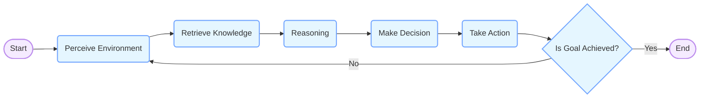

# AI Agent的可解释推理：提高LLM决策的透明度

> 关键词：AI Agent、可解释推理、大语言模型（LLM）、决策透明度、推理机制

> 摘要：本文聚焦于AI Agent的可解释推理，旨在提高大语言模型（LLM）决策的透明度。首先介绍了相关背景知识，包括目的、预期读者、文档结构和术语表。接着阐述了核心概念及其联系，通过文本示意图和Mermaid流程图进行直观展示。详细讲解了核心算法原理和具体操作步骤，使用Python源代码进行说明。深入探讨了数学模型和公式，并举例说明。通过项目实战展示代码实际案例并进行详细解释。分析了实际应用场景，推荐了学习、开发工具和相关论文著作。最后总结了未来发展趋势与挑战，提供了常见问题解答和扩展阅读参考资料，帮助读者全面了解AI Agent可解释推理以提升LLM决策透明度的相关内容。

## 1. 背景介绍 
### 1.1 目的和范围
随着大语言模型（LLM）在各个领域的广泛应用，其决策过程的不透明性成为了一个显著问题。LLM在执行任务时，往往像一个“黑匣子”，我们很难理解它是如何得出某个特定决策的。这在一些对决策可解释性要求较高的领域，如医疗、金融、法律等，可能会引发严重的信任危机。

本文的目的在于深入探讨AI Agent的可解释推理机制，通过一系列方法和技术提高LLM决策的透明度。具体范围涵盖了可解释推理的核心概念、算法原理、数学模型，以及实际应用场景和开发工具等方面。

### 1.2 预期读者
本文预期读者包括但不限于以下几类人群：
- 人工智能领域的研究人员，希望深入了解AI Agent可解释推理的前沿技术和研究方向。
- 软件开发工程师，对将可解释推理技术应用到实际项目中感兴趣。
- 数据科学家，关注如何通过可解释性提升模型的可信度和实用性。
- 相关行业从业者，如医疗、金融、法律等领域的专业人士，希望借助可解释推理技术更好地理解和应用LLM的决策结果。

### 1.3 文档结构概述
本文将按照以下结构进行组织：
- 核心概念与联系：介绍AI Agent、可解释推理、LLM等核心概念，并阐述它们之间的联系，通过文本示意图和Mermaid流程图进行直观展示。
- 核心算法原理 & 具体操作步骤：详细讲解实现可解释推理的核心算法原理，并给出具体的操作步骤，使用Python源代码进行说明。
- 数学模型和公式 & 详细讲解 & 举例说明：深入探讨可解释推理背后的数学模型和公式，并通过具体例子进行详细说明。
- 项目实战：代码实际案例和详细解释说明：通过一个实际项目案例，展示如何在代码中实现可解释推理，并对代码进行详细解读。
- 实际应用场景：分析可解释推理在不同领域的实际应用场景。
- 工具和资源推荐：推荐学习可解释推理所需的书籍、在线课程、技术博客等资源，以及开发过程中常用的工具、框架和相关论文著作。
- 总结：未来发展趋势与挑战：总结可解释推理的未来发展趋势，并分析可能面临的挑战。
- 附录：常见问题与解答：提供一些常见问题的解答，帮助读者更好地理解文章内容。
- 扩展阅读 & 参考资料：列出相关的扩展阅读材料和参考资料，方便读者进一步深入学习。

### 1.4 术语表
#### 1.4.1 核心术语定义
- **AI Agent（人工智能代理）**：是一种能够感知环境、进行推理和决策，并采取行动以实现特定目标的软件实体。它可以与外部环境进行交互，根据环境信息做出相应的反应。
- **可解释推理**：指的是能够清晰地解释推理过程和决策依据的能力。在AI领域，可解释推理旨在让人们理解模型是如何得出某个结论的，而不仅仅是知道结论本身。
- **大语言模型（LLM）**：是基于大量文本数据训练得到的语言模型，具有强大的语言理解和生成能力。常见的LLM如GPT - 3、BERT等。
- **决策透明度**：表示决策过程和依据的可理解程度。高决策透明度意味着人们能够清楚地了解模型为什么做出某个决策。

#### 1.4.2 相关概念解释
- **知识图谱**：是一种用于表示实体之间关系的图结构数据。在可解释推理中，知识图谱可以提供丰富的背景知识，帮助模型进行更合理的推理。
- **注意力机制**：是一种在深度学习中广泛使用的技术，它可以让模型在处理输入时关注到不同部分的重要性。在可解释推理中，注意力机制可以帮助解释模型对输入的哪些部分给予了更多的关注。

#### 1.4.3 缩略词列表
- **LLM**：Large Language Model（大语言模型）
- **AI**：Artificial Intelligence（人工智能）

## 2. 核心概念与联系 

### 核心概念原理
#### AI Agent
AI Agent是一个具有自主性和智能性的实体，它可以感知环境中的信息，通过内部的推理机制进行分析和决策，然后采取相应的行动。AI Agent通常由感知模块、推理模块和行动模块组成。感知模块负责收集环境信息，推理模块根据这些信息进行推理和决策，行动模块则将决策转化为具体的行动。

#### 可解释推理
可解释推理的核心原理是将模型的推理过程分解为一系列可理解的步骤，并为每个步骤提供合理的解释。这可以通过多种方法实现，如基于规则的推理、知识图谱推理、注意力机制解释等。可解释推理的目标是让人们能够理解模型为什么做出某个决策，从而提高模型的可信度和可接受性。

#### 大语言模型（LLM）
LLM是基于深度学习技术训练得到的语言模型，它通过在大规模文本数据上进行无监督学习，学习到语言的模式和规律。LLM可以用于各种自然语言处理任务，如文本生成、问答系统、机器翻译等。然而，由于其复杂的神经网络结构，LLM的决策过程往往难以解释。

### 架构的文本示意图
```plaintext
              +----------------+
              |   Environment  |
              +----------------+
                      |
                      v
+----------------+     +----------------+     +----------------+
|  Perception    | --> |   Reasoning    | --> |   Action       |
|  Module        |     |   Module       |     |   Module       |
+----------------+     +----------------+     +----------------+
                      |
                      v
              +----------------+
              |    Knowledge    |
              |    Base         |
              +----------------+
```
在这个架构中，AI Agent通过感知模块从环境中获取信息，将其传递给推理模块。推理模块利用知识库中的知识进行推理和决策，然后将决策结果传递给行动模块，由行动模块采取相应的行动。

### Mermaid流程图

该流程图展示了AI Agent的工作流程。首先，AI Agent感知环境信息，然后从知识库中检索相关知识，进行推理并做出决策，最后采取行动。如果目标没有实现，则继续循环执行上述步骤。

## 3. 核心算法原理 & 具体操作步骤 

### 核心算法原理
我们以基于规则的可解释推理算法为例进行说明。基于规则的推理是一种简单而直观的推理方法，它通过定义一系列规则来进行推理和决策。规则通常采用“如果……那么……”的形式，例如：“如果天气下雨，那么带雨伞”。

在AI Agent中，基于规则的推理算法可以通过以下步骤实现：
1. **规则表示**：将规则用一种合适的数据结构表示，例如列表或字典。每个规则可以包含前提条件和结论。
2. **条件匹配**：将感知到的环境信息与规则的前提条件进行匹配。如果匹配成功，则执行该规则的结论。
3. **冲突解决**：如果多个规则的前提条件都匹配成功，需要解决冲突，选择一个最合适的规则执行。

### 具体操作步骤及Python源代码
```python
# 定义规则
rules = [
    {
        "conditions": ["天气下雨"],
        "conclusion": "带雨伞"
    },
    {
        "conditions": ["天气炎热"],
        "conclusion": "戴太阳帽"
    }
]

# 定义环境信息
environment = ["天气下雨"]

# 规则匹配函数
def match_rules(rules, environment):
    matched_rules = []
    for rule in rules:
        conditions = rule["conditions"]
        all_matched = True
        for condition in conditions:
            if condition not in environment:
                all_matched = False
                break
        if all_matched:
            matched_rules.append(rule)
    return matched_rules

# 冲突解决函数（简单示例，选择第一个匹配的规则）
def resolve_conflict(matched_rules):
    if len(matched_rules) > 0:
        return matched_rules[0]
    return None

# 执行推理
matched_rules = match_rules(rules, environment)
selected_rule = resolve_conflict(matched_rules)

if selected_rule:
    print("决策结果：", selected_rule["conclusion"])
else:
    print("没有匹配的规则，无法做出决策。")
```
在上述代码中，我们首先定义了一组规则和环境信息。然后，通过`match_rules`函数将环境信息与规则的前提条件进行匹配，找出所有匹配的规则。接着，使用`resolve_conflict`函数解决冲突，选择一个最合适的规则。最后，根据选择的规则输出决策结果。

## 4. 数学模型和公式 & 详细讲解 & 举例说明 

### 数学模型
在可解释推理中，我们可以使用逻辑推理的数学模型。逻辑推理主要基于命题逻辑和谓词逻辑。

#### 命题逻辑
命题逻辑是研究命题之间逻辑关系的数学分支。命题是一个可以判断真假的陈述句，例如“天气下雨”就是一个命题。命题可以用逻辑运算符（如与（$\land$）、或（$\lor$）、非（$\neg$））进行组合，形成复合命题。

例如，规则“如果天气下雨且温度低于10度，那么穿厚外套”可以用命题逻辑表示为：
$$(P \land Q) \to R$$
其中，$P$ 表示“天气下雨”，$Q$ 表示“温度低于10度”，$R$ 表示“穿厚外套”。

#### 谓词逻辑
谓词逻辑是在命题逻辑的基础上引入了变量和量词（全称量词 $\forall$ 和存在量词 $\exists$）。谓词是一个带有变量的命题，例如“$x$ 是偶数”就是一个谓词，其中 $x$ 是变量。

例如，规则“对于所有的人 $x$，如果 $x$ 是学生且 $x$ 考试成绩优秀，那么 $x$ 会获得奖学金”可以用谓词逻辑表示为：
$$\forall x (Student(x) \land ExcellentGrade(x)) \to Scholarship(x)$$

### 详细讲解
命题逻辑和谓词逻辑的核心是推理规则。常见的推理规则有：
- **假言推理**：如果 $P \to Q$ 为真，且 $P$ 为真，那么 $Q$ 为真。用公式表示为：
$$\frac{P \to Q, P}{Q}$$
- **拒取式**：如果 $P \to Q$ 为真，且 $\neg Q$ 为真，那么 $\neg P$ 为真。用公式表示为：
$$\frac{P \to Q, \neg Q}{\neg P}$$

### 举例说明
假设我们有以下规则和事实：
- 规则：如果天气下雨（$P$），那么地面会湿（$Q$），即 $P \to Q$。
- 事实：天气下雨，即 $P$ 为真。

根据假言推理规则，我们可以得出结论：地面会湿，即 $Q$ 为真。

在Python代码中，我们可以实现简单的命题逻辑推理：
```python
# 定义规则和事实
rule = lambda p: p  # P -> Q
fact = True  # P 为真

# 进行推理
if rule(fact):
    print("推理结果：地面会湿")
else:
    print("推理结果：地面不会湿")
```

## 5. 项目实战：代码实际案例和详细解释说明 

### 5.1  开发环境搭建
#### 环境准备
我们将使用Python进行开发，建议使用Python 3.7及以上版本。可以通过以下步骤搭建开发环境：
1. **安装Python**：从Python官方网站（https://www.python.org/downloads/）下载并安装Python。
2. **创建虚拟环境**：使用`venv`模块创建虚拟环境，避免不同项目之间的依赖冲突。
```bash
python -m venv myenv
```
3. **激活虚拟环境**：
    - 在Windows上：
```bash
myenv\Scripts\activate
```
    - 在Linux/Mac上：
```bash
source myenv/bin/activate
```
4. **安装必要的库**：在本项目中，我们主要使用Python的内置库，无需额外安装其他库。

### 5.2  源代码详细实现和代码解读
我们将实现一个简单的AI Agent可解释推理系统，用于根据用户的症状进行疾病诊断。

```python
# 定义疾病诊断规则
disease_rules = [
    {
        "conditions": ["咳嗽", "发热"],
        "disease": "感冒",
        "explanation": "咳嗽和发热是感冒的常见症状，所以诊断为感冒。"
    },
    {
        "conditions": ["腹痛", "腹泻"],
        "disease": "肠胃炎",
        "explanation": "腹痛和腹泻是肠胃炎的典型症状，因此诊断为肠胃炎。"
    }
]

# 定义AI Agent类
class AIAgent:
    def __init__(self, rules):
        self.rules = rules

    def diagnose(self, symptoms):
        matched_rules = []
        for rule in self.rules:
            conditions = rule["conditions"]
            all_matched = True
            for condition in conditions:
                if condition not in symptoms:
                    all_matched = False
                    break
            if all_matched:
                matched_rules.append(rule)

        if len(matched_rules) == 0:
            return "无法诊断", "没有匹配的规则，无法做出诊断。"
        elif len(matched_rules) == 1:
            rule = matched_rules[0]
            return rule["disease"], rule["explanation"]
        else:
            # 简单示例，选择第一个匹配的规则
            rule = matched_rules[0]
            return rule["disease"], rule["explanation"]

# 创建AI Agent实例
agent = AIAgent(disease_rules)

# 用户输入症状
user_symptoms = ["咳嗽", "发热"]

# 进行诊断
disease, explanation = agent.diagnose(user_symptoms)

print("诊断结果：", disease)
print("诊断依据：", explanation)
```

### 5.3  代码解读与分析
#### 代码结构
- **疾病诊断规则定义**：`disease_rules` 列表中存储了一系列疾病诊断规则，每个规则包含症状条件、疾病名称和诊断依据解释。
- **AI Agent类**：`AIAgent` 类封装了诊断逻辑，`__init__` 方法用于初始化规则，`diagnose` 方法用于根据用户输入的症状进行诊断。
- **主程序**：创建 `AIAgent` 实例，获取用户输入的症状，调用 `diagnose` 方法进行诊断，并输出诊断结果和依据。

#### 推理过程
1. **规则匹配**：在 `diagnose` 方法中，遍历所有规则，将用户输入的症状与规则的条件进行匹配。如果所有条件都匹配成功，则将该规则添加到 `matched_rules` 列表中。
2. **结果判断**：根据 `matched_rules` 列表的长度进行不同的处理。如果列表为空，则无法诊断；如果列表长度为1，则返回该规则的疾病名称和解释；如果列表长度大于1，则选择第一个匹配的规则返回。

## 6. 实际应用场景 
### 医疗领域
在医疗领域，AI Agent的可解释推理可以帮助医生更准确地进行疾病诊断和治疗方案制定。例如，通过分析患者的症状、病史、检查结果等信息，AI Agent可以给出诊断建议，并解释推理过程和依据。这有助于医生更好地理解诊断结果，提高诊断的准确性和可信度。同时，可解释推理还可以为患者提供更清晰的病情解释，增强患者对治疗方案的理解和接受度。

### 金融领域
在金融领域，可解释推理可以用于风险评估、信贷审批等决策过程。例如，银行在审批贷款时，可以使用AI Agent分析申请人的信用记录、收入情况、负债情况等信息，给出是否批准贷款的决策，并解释决策的依据。这有助于银行更好地管理风险，同时也可以让申请人了解贷款审批的过程和原因。

### 法律领域
在法律领域，AI Agent的可解释推理可以辅助律师进行法律检索和案例分析。例如，通过分析法律条文、案例库和案件事实，AI Agent可以提供相关的法律依据和判决建议，并解释推理过程。这有助于律师更高效地处理案件，提高法律决策的准确性和公正性。

### 教育领域
在教育领域，可解释推理可以用于智能辅导系统。例如，根据学生的学习情况和问题，AI Agent可以提供针对性的学习建议和解答，并解释推理过程。这有助于学生更好地理解知识，提高学习效果。

## 7. 工具和资源推荐
### 7.1 学习资源推荐
#### 7.1.1 书籍推荐
- 《人工智能：一种现代的方法》：这是一本经典的人工智能教材，涵盖了人工智能的各个方面，包括知识表示、推理、机器学习等内容，对可解释推理有一定的介绍。
- 《深入浅出数据分析》：虽然不是专门针对可解释推理的书籍，但它介绍了数据分析的基本方法和思维方式，有助于理解可解释推理中的数据处理和分析过程。

#### 7.1.2 在线课程
- Coursera上的“人工智能基础”课程：由知名高校教授授课，系统地介绍了人工智能的基础知识，包括推理和决策等内容。
- edX上的“机器学习”课程：详细讲解了机器学习的算法和原理，对理解可解释推理中的模型和算法有很大帮助。

#### 7.1.3 技术博客和网站
- Medium：上面有很多关于人工智能和可解释推理的技术文章，作者来自不同的领域和背景，可以提供不同的视角和思路。
- arXiv：是一个预印本平台，上面有很多最新的人工智能研究论文，包括可解释推理方面的研究成果。

### 7.2 开发工具框架推荐
#### 7.2.1 IDE和编辑器
- PyCharm：是一款专门为Python开发设计的集成开发环境，具有强大的代码编辑、调试和项目管理功能。
- Visual Studio Code：是一款轻量级的代码编辑器，支持多种编程语言和插件扩展，非常适合Python开发。

#### 7.2.2 调试和性能分析工具
- pdb：是Python的内置调试器，可以帮助开发者逐行调试代码，查找问题。
- cProfile：是Python的性能分析工具，可以分析代码的运行时间和函数调用情况，帮助优化代码性能。

#### 7.2.3 相关框架和库
- scikit - learn：是一个常用的机器学习库，提供了丰富的机器学习算法和工具，可用于实现可解释推理中的模型训练和评估。
- NetworkX：是一个用于创建、操作和研究复杂网络的Python库，可用于构建和分析知识图谱，辅助可解释推理。

### 7.3 相关论文著作推荐
#### 7.3.1 经典论文
- “Explaining and Harnessing Adversarial Examples”：该论文探讨了深度学习模型中的对抗样本问题，同时也涉及到了模型的可解释性研究。
- “Why Should I Trust You?”：提出了一种基于特征重要性的可解释性方法，对理解模型决策过程有重要意义。

#### 7.3.2 最新研究成果
- 可以关注每年的人工智能顶级会议，如NeurIPS、ICML、ACL等，这些会议上会有很多关于可解释推理的最新研究成果发布。

#### 7.3.3 应用案例分析
- 一些知名企业和研究机构会发布关于可解释推理在实际应用中的案例分析报告，如Google、Microsoft等公司的技术博客上可能会有相关内容。

## 8. 总结：未来发展趋势与挑战
### 未来发展趋势
#### 多模态融合的可解释推理
未来，AI Agent的可解释推理将不仅仅局限于文本信息，还会融合图像、音频、视频等多模态信息。通过多模态融合，可以更全面地理解环境信息，提高推理的准确性和可解释性。

#### 与人类认知的深度融合
可解释推理将更加注重与人类认知的深度融合，借鉴人类的思维方式和推理模式，使模型的推理过程更加符合人类的直觉和理解。例如，引入常识推理、类比推理等人类常用的推理方法。

#### 可解释性的自动化评估
随着可解释推理技术的发展，将出现更加自动化的可解释性评估方法和指标。这些方法和指标可以帮助开发者更客观地评估模型的可解释性，从而不断改进模型。

### 挑战
#### 模型复杂度与可解释性的平衡
随着大语言模型等复杂模型的不断发展，模型的复杂度越来越高，而可解释性却越来越难以保证。如何在提高模型性能的同时，保持模型的可解释性，是一个亟待解决的问题。

#### 数据隐私和安全问题
在可解释推理过程中，需要使用大量的数据进行训练和推理。这些数据可能包含用户的敏感信息，如医疗记录、金融信息等。如何在保证可解释性的同时，保护数据的隐私和安全，是一个重要的挑战。

#### 跨领域知识的整合
不同领域的知识和推理规则存在很大差异，如何将跨领域的知识进行有效的整合，实现跨领域的可解释推理，是一个具有挑战性的问题。

## 9. 附录：常见问题与解答
### 问题1：可解释推理和传统推理有什么区别？
可解释推理不仅关注推理的结果，更注重推理过程的可理解性。传统推理往往只给出最终的结论，而可解释推理会详细解释模型是如何得出这个结论的，包括使用的知识、推理步骤等。

### 问题2：可解释推理会降低模型的性能吗？
在某些情况下，可解释推理可能会对模型的性能产生一定的影响。因为为了实现可解释性，可能需要对模型的结构和算法进行一些调整，这可能会导致模型的复杂度增加或计算效率降低。然而，通过合理的设计和优化，可以在保证可解释性的同时，尽量减少对模型性能的影响。

### 问题3：如何评估模型的可解释性？
目前，还没有统一的评估模型可解释性的标准和方法。常见的评估方法包括可视化分析、特征重要性评估、规则可读性评估等。可视化分析可以直观地展示模型的推理过程；特征重要性评估可以确定哪些特征对模型的决策影响最大；规则可读性评估可以评估规则的简单性和易懂性。

## 10. 扩展阅读 & 参考资料
### 扩展阅读
- 《可解释人工智能：算法与应用》：深入探讨了可解释人工智能的各种算法和应用场景。
- 《知识图谱：方法、实践与应用》：详细介绍了知识图谱的构建方法和应用，对可解释推理中的知识表示和推理有很大帮助。

### 参考资料
- Goodfellow, I. J., Shlens, J., & Szegedy, C. (2014). Explaining and Harnessing Adversarial Examples. arXiv preprint arXiv:1412.6572.
- Ribeiro, M. T., Singh, S., & Guestrin, C. (2016). “Why Should I Trust You?”: Explaining the Predictions of Any Classifier. In Proceedings of the 22nd ACM SIGKDD international conference on knowledge discovery and data mining (pp. 1135 - 1144).

作者：AI天才研究院/AI Genius Institute & 禅与计算机程序设计艺术 /Zen And The Art of Computer Programming