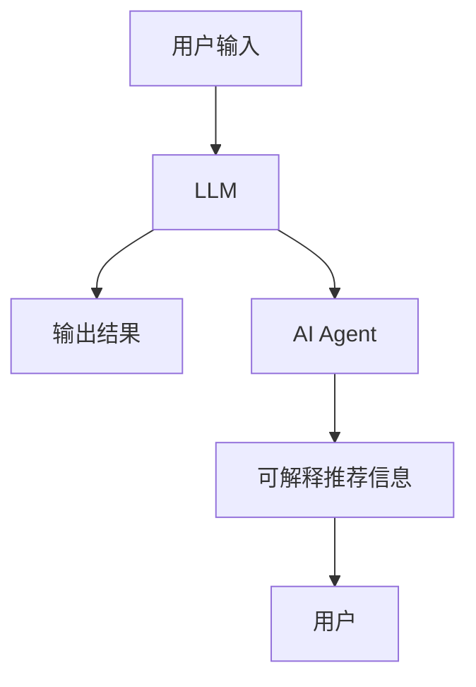

# AI Agent的可解释推荐：提高LLM决策的透明度

> 关键词：AI Agent、可解释推荐、大语言模型（LLM）、决策透明度、人工智能

> 摘要：本文聚焦于AI Agent的可解释推荐在提高大语言模型（LLM）决策透明度方面的重要性和作用。首先介绍相关背景知识，包括目的、预期读者等内容。接着深入探讨核心概念与联系，阐述其原理和架构。详细讲解核心算法原理及具体操作步骤，并结合数学模型和公式进行分析。通过项目实战展示代码实现和解读，介绍实际应用场景。同时推荐相关工具和资源，最后总结未来发展趋势与挑战，解答常见问题并提供扩展阅读和参考资料，旨在全面剖析AI Agent的可解释推荐对LLM决策透明度提升的关键意义。

## 1. 背景介绍 
### 1.1 目的和范围
随着人工智能技术的飞速发展，大语言模型（LLM）在各个领域得到了广泛应用，如智能客服、内容生成、推荐系统等。然而，LLM的决策过程往往如同一个“黑盒”，其输出结果的依据难以被理解，这给用户带来了信任危机，也限制了其在一些对决策透明度要求较高的领域的应用。本文章的目的在于探讨如何通过AI Agent的可解释推荐来提高LLM决策的透明度，范围涵盖相关概念的阐述、算法原理的讲解、实际案例的分析以及未来发展趋势的展望等方面。

### 1.2 预期读者
本文预期读者包括人工智能领域的研究人员、开发者、对AI技术感兴趣的学生以及关注AI应用中决策透明度问题的企业管理人员等。研究人员可以从本文中获取新的研究思路和方法；开发者能够学习到具体的实现技术和代码示例；学生可以加深对AI Agent和LLM相关概念的理解；企业管理人员可以了解如何利用可解释推荐来提升用户对LLM应用的信任度。

### 1.3 文档结构概述
本文首先介绍背景知识，为读者建立基础认知。然后深入探讨核心概念与联系，使读者理解AI Agent的可解释推荐与LLM决策透明度之间的关系。接着详细讲解核心算法原理和具体操作步骤，并结合数学模型和公式进行理论分析。通过项目实战部分，让读者了解实际代码实现和应用。之后介绍实际应用场景，展示其在不同领域的价值。再推荐相关工具和资源，帮助读者进一步学习和实践。最后总结未来发展趋势与挑战，解答常见问题并提供扩展阅读和参考资料，形成一个完整的知识体系。

### 1.4 术语表
#### 1.4.1 核心术语定义
- **AI Agent**：人工智能代理，是一种能够感知环境、进行推理并采取行动以实现特定目标的智能实体。它可以根据输入信息，运用自身的知识和算法进行决策，并执行相应的操作。
- **可解释推荐**：指在推荐系统中，不仅能够给出推荐结果，还能提供推荐理由和依据，使用户能够理解为什么会得到这样的推荐。
- **大语言模型（LLM）**：是一种基于深度学习的语言模型，通过对大量文本数据的学习，能够生成自然语言文本，完成各种语言相关的任务，如文本生成、问答系统等。
- **决策透明度**：指决策过程和依据能够被清晰地理解和解释，使用户能够知道决策是如何做出的，以及背后的原因是什么。

#### 1.4.2 相关概念解释
- **黑盒模型**：指模型的内部结构和决策过程难以被理解和解释，用户只能看到输入和输出，而无法了解模型是如何从输入得到输出的。LLM在很多情况下被视为黑盒模型，因为其复杂的神经网络结构和大规模的参数使得决策过程难以解释。
- **白盒模型**：与黑盒模型相对，白盒模型的决策过程是透明的，用户可以清楚地了解模型是如何进行决策的，例如决策树模型就具有较高的可解释性，属于白盒模型。

#### 1.4.3 缩略词列表
- **LLM**：Large Language Model（大语言模型）
- **AI**：Artificial Intelligence（人工智能）

## 2. 核心概念与联系 

### 核心概念原理
AI Agent的可解释推荐旨在通过提供清晰的解释和依据，使LLM的决策过程变得透明。AI Agent作为智能实体，它可以对LLM的输入和输出进行分析和处理，挖掘其中的关联信息，并将这些信息以人类可理解的方式呈现出来。例如，在一个新闻推荐系统中，LLM根据用户的历史浏览记录和当前的搜索关键词生成推荐新闻列表。AI Agent可以分析LLM的决策过程，找出哪些因素（如关键词匹配度、新闻热度等）对推荐结果产生了影响，并将这些因素作为推荐理由呈现给用户。

### 架构的文本示意图
```plaintext
用户输入 --> LLM --> 输出结果
                |
                v
            AI Agent
                |
                v
        可解释推荐信息 --> 用户
```
这个示意图展示了用户输入信息首先进入LLM，LLM生成输出结果。AI Agent对LLM的决策过程进行分析，提取可解释推荐信息，并将其反馈给用户，从而提高LLM决策的透明度。

### Mermaid流程图


## 3. 核心算法原理 & 具体操作步骤 

### 核心算法原理
为了实现AI Agent的可解释推荐，我们可以采用特征重要性分析算法。该算法的核心思想是通过计算每个输入特征对LLM输出结果的影响程度，来确定哪些特征是重要的，从而为推荐结果提供解释。

### Python源代码详细阐述
以下是一个简单的示例，假设我们有一个基于简单线性回归模型（模拟LLM的简化版本）的推荐系统，使用Python的`scikit-learn`库来实现特征重要性分析：

```python
import numpy as np
from sklearn.linear_model import LinearRegression

# 生成一些示例数据
X = np.array([[1, 2, 3], [4, 5, 6], [7, 8, 9]])
y = np.array([10, 20, 30])

# 训练线性回归模型
model = LinearRegression()
model.fit(X, y)

# 计算特征重要性
feature_importance = model.coef_

# 输出特征重要性
print("特征重要性:", feature_importance)

# 示例用户输入
user_input = np.array([[2, 3, 4]])

# 模型预测
prediction = model.predict(user_input)

# 解释预测结果
explanation = []
for i in range(len(user_input[0])):
    contribution = user_input[0][i] * feature_importance[i]
    explanation.append(f"特征 {i + 1} 的贡献: {contribution}")

print("预测结果:", prediction)
print("解释:", explanation)
```

### 具体操作步骤
1. **数据准备**：收集和整理相关的数据，包括输入特征和对应的输出结果。
2. **模型训练**：使用训练数据对LLM或简化的模拟模型进行训练。
3. **特征重要性计算**：使用合适的算法（如上述的线性回归系数）计算每个输入特征对输出结果的重要性。
4. **用户输入处理**：当用户输入新的数据时，模型进行预测。
5. **解释生成**：根据特征重要性和用户输入，计算每个特征对预测结果的贡献，生成解释信息。
6. **推荐呈现**：将预测结果和解释信息一起呈现给用户。

## 4. 数学模型和公式 & 详细讲解 & 举例说明 

### 数学模型
假设我们有一个线性回归模型，其数学表达式为：

$$y = \beta_0 + \beta_1x_1 + \beta_2x_2 + \cdots + \beta_nx_n + \epsilon$$

其中，$y$ 是输出结果，$x_1, x_2, \cdots, x_n$ 是输入特征，$\beta_0, \beta_1, \beta_2, \cdots, \beta_n$ 是模型的系数，$\epsilon$ 是误差项。

### 特征重要性计算
特征的重要性可以通过模型的系数来衡量。对于第 $i$ 个特征，其重要性可以表示为 $\beta_i$。系数的绝对值越大，说明该特征对输出结果的影响越大。

### 举例说明
在上述的Python代码示例中，线性回归模型的系数就是特征的重要性。例如，假设特征重要性计算结果为 `[0.5, 1.0, 0.3]`，用户输入为 `[2, 3, 4]`。则第一个特征的贡献为 $2 \times 0.5 = 1$，第二个特征的贡献为 $3 \times 1.0 = 3$，第三个特征的贡献为 $4 \times 0.3 = 1.2$。这些贡献值可以作为解释预测结果的依据。

## 5. 项目实战：代码实际案例和详细解释说明 

### 5.1  开发环境搭建
- **Python环境**：安装Python 3.x版本。
- **相关库**：安装`scikit-learn`、`numpy`等库，可以使用以下命令进行安装：
```sh
pip install scikit-learn numpy
```

### 5.2  源代码详细实现和代码解读
以下是一个更完整的项目实战代码示例，使用`scikit-learn`中的决策树模型（具有一定的可解释性）来实现AI Agent的可解释推荐：

```python
import numpy as np
from sklearn.datasets import load_iris
from sklearn.tree import DecisionTreeClassifier
from sklearn.model_selection import train_test_split

# 加载鸢尾花数据集
iris = load_iris()
X = iris.data
y = iris.target

# 划分训练集和测试集
X_train, X_test, y_train, y_test = train_test_split(X, y, test_size=0.2, random_state=42)

# 训练决策树模型
model = DecisionTreeClassifier()
model.fit(X_train, y_train)

# 示例用户输入
user_input = np.array([[5.1, 3.5, 1.4, 0.2]])

# 模型预测
prediction = model.predict(user_input)

# 解释预测结果
feature_names = iris.feature_names
tree = model.tree_
node_index = tree.apply(user_input.astype(np.float32))
path = tree.decision_path(user_input.astype(np.float32)).indices
explanation = []
for i in path:
    if tree.feature[i] != -2:
        feature_name = feature_names[tree.feature[i]]
        threshold = tree.threshold[i]
        value = user_input[0][tree.feature[i]]
        if value <= threshold:
            explanation.append(f"特征 {feature_name} 的值 {value} 小于等于阈值 {threshold}")
        else:
            explanation.append(f"特征 {feature_name} 的值 {value} 大于阈值 {threshold}")

print("预测结果:", iris.target_names[prediction][0])
print("解释:", explanation)
```

### 代码解读与分析
1. **数据加载与划分**：使用`load_iris`函数加载鸢尾花数据集，并将其划分为训练集和测试集。
2. **模型训练**：使用决策树分类器对训练数据进行训练。
3. **用户输入处理**：定义一个示例用户输入，并使用训练好的模型进行预测。
4. **解释生成**：通过决策树的内部结构，找出决策路径，根据每个节点的特征和阈值，生成解释信息。
5. **结果输出**：输出预测结果和解释信息。

## 6. 实际应用场景 
### 医疗领域
在医疗诊断中，LLM可以根据患者的症状、检查结果等信息进行疾病预测。AI Agent的可解释推荐可以提供预测的依据，如哪些症状对诊断结果影响较大，帮助医生更好地理解模型的决策过程，提高诊断的准确性和可信度。

### 金融领域
在金融风险评估中，LLM可以根据客户的信用记录、财务状况等信息评估客户的风险等级。可解释推荐可以解释为什么给客户评定这样的风险等级，帮助金融机构更好地管理风险，同时也让客户了解评估的依据，增强客户的信任。

### 教育领域
在智能教育系统中，LLM可以根据学生的学习数据推荐学习资源。可解释推荐可以告诉学生为什么推荐这些资源，例如是因为学生在某个知识点上的薄弱环节，还是根据学生的学习进度等，帮助学生更好地利用推荐资源，提高学习效果。

## 7. 工具和资源推荐
### 7.1 学习资源推荐
#### 7.1.1 书籍推荐
- 《Python机器学习》：全面介绍了Python在机器学习领域的应用，包括各种算法和模型的实现，适合初学者学习。
- 《深度学习》：由深度学习领域的三位顶尖专家撰写，系统地介绍了深度学习的理论和实践，是深度学习领域的经典著作。

#### 7.1.2 在线课程
- Coursera上的“机器学习”课程：由斯坦福大学的Andrew Ng教授授课，是机器学习领域的经典课程，涵盖了机器学习的基本概念、算法和应用。
- edX上的“深度学习基础”课程：由深度学习领域的专家授课，深入介绍了深度学习的原理和实践。

#### 7.1.3 技术博客和网站
- Medium：上面有很多关于人工智能和机器学习的技术博客，作者来自世界各地的专家和爱好者，可以获取最新的技术动态和研究成果。
- Towards Data Science：专注于数据科学和机器学习领域的技术博客，提供了很多实用的教程和案例分析。

### 7.2 开发工具框架推荐
#### 7.2.1 IDE和编辑器
- PyCharm：是一款专门为Python开发设计的集成开发环境，具有强大的代码编辑、调试和项目管理功能。
- Visual Studio Code：是一款轻量级的代码编辑器，支持多种编程语言，通过安装插件可以实现Python开发的各种功能。

#### 7.2.2 调试和性能分析工具
- PDB：Python自带的调试器，可以帮助开发者逐行调试代码，查找问题。
- cProfile：Python的性能分析工具，可以分析代码的运行时间和函数调用情况，帮助开发者优化代码性能。

#### 7.2.3 相关框架和库
- TensorFlow：是一个开源的深度学习框架，由Google开发，提供了丰富的工具和库，支持各种深度学习任务。
- PyTorch：是另一个流行的深度学习框架，由Facebook开发，具有动态图的特点，适合快速迭代和实验。

### 7.3 相关论文著作推荐
#### 7.3.1 经典论文
- “Gradient-based Learning Applied to Document Recognition”：由Yann LeCun等人撰写，介绍了卷积神经网络在手写字符识别中的应用，是深度学习领域的经典论文之一。
- “Attention Is All You Need”：提出了Transformer架构，为现代大语言模型的发展奠定了基础。

#### 7.3.2 最新研究成果
- 关注顶级学术会议（如NeurIPS、ICML、ACL等）上的最新研究论文，了解AI Agent和可解释推荐领域的最新进展。

#### 7.3.3 应用案例分析
- 一些知名企业（如Google、Microsoft等）会在其官方博客或技术报告中分享AI Agent和可解释推荐在实际应用中的案例分析，可以从中学习到实际应用的经验和方法。

## 8. 总结：未来发展趋势与挑战
### 未来发展趋势
- **多模态可解释推荐**：未来的AI Agent可解释推荐将不仅仅局限于文本信息，还会结合图像、语音等多模态信息，提供更全面、更丰富的解释。
- **自适应可解释性**：根据不同的用户需求和应用场景，AI Agent可以自适应地调整解释的详细程度和方式，提高用户体验。
- **与人类认知结合**：研究如何将AI Agent的可解释推荐与人类的认知模式相结合，使解释更符合人类的思维习惯，提高用户对解释的理解和接受程度。

### 挑战
- **计算复杂度**：实现可解释推荐需要对LLM的决策过程进行深入分析，这可能会带来较高的计算复杂度，如何在保证解释效果的前提下降低计算成本是一个挑战。
- **解释的准确性和可靠性**：如何确保解释的准确性和可靠性，避免解释出现偏差或误导用户，是需要解决的重要问题。
- **隐私和安全问题**：在分析LLM的决策过程时，可能会涉及到用户的隐私和数据安全问题，如何在可解释推荐的同时保护用户的隐私和数据安全是一个挑战。

## 9. 附录：常见问题与解答
### 问题1：AI Agent的可解释推荐是否会影响LLM的性能？
解答：在一定程度上可能会有影响。因为实现可解释推荐需要对LLM的决策过程进行分析，这可能会增加计算量和时间成本。但是，通过优化算法和技术，可以在保证一定可解释性的前提下，尽量减少对性能的影响。

### 问题2：如何评估可解释推荐的效果？
解答：可以从多个方面进行评估，如解释的清晰度、准确性、完整性等。可以通过用户调查、对比实验等方法来收集用户对解释的反馈，评估解释是否能够帮助用户理解LLM的决策过程。

### 问题3：可解释推荐是否适用于所有的LLM？
解答：不是所有的LLM都能很容易地实现可解释推荐。一些复杂的黑盒模型可能需要更复杂的技术和算法来实现可解释性。但是，随着技术的发展，越来越多的方法和工具被提出，可解释推荐的适用范围也在不断扩大。

## 10. 扩展阅读 & 参考资料
- Goodfellow, I. J., Bengio, Y., & Courville, A. (2016). Deep Learning. MIT Press.
- Ng, A. (2012). Machine Learning. Stanford University, Coursera.
- Vaswani, A., Shazeer, N., Parmar, N., et al. (2017). Attention Is All You Need. Advances in Neural Information Processing Systems.

作者：AI天才研究院/AI Genius Institute & 禅与计算机程序设计艺术 /Zen And The Art of Computer Programming