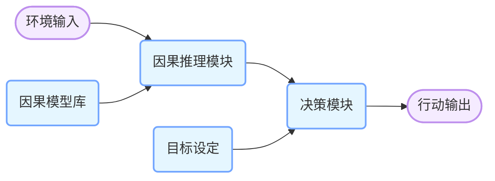

# AI Agent的因果推理：增强决策能力

> 关键词：AI Agent、因果推理、决策能力、因果模型、强化学习

> 摘要：本文围绕AI Agent的因果推理展开，探讨如何通过因果推理增强AI Agent的决策能力。首先介绍了相关背景知识，包括目的范围、预期读者、文档结构和术语表。接着阐述了核心概念与联系，给出了原理和架构的文本示意图与Mermaid流程图。详细讲解了核心算法原理和具体操作步骤，并使用Python源代码进行说明。同时介绍了数学模型和公式，通过举例加深理解。通过项目实战展示了代码实际案例和详细解释。分析了实际应用场景，推荐了相关的工具和资源。最后总结了未来发展趋势与挑战，提供了常见问题解答和扩展阅读参考资料，旨在为读者全面深入地了解AI Agent的因果推理及其在增强决策能力方面的应用提供有价值的参考。

## 1. 背景介绍 
### 1.1 目的和范围
在当今人工智能快速发展的时代，AI Agent在各个领域得到了广泛应用。然而，传统的AI Agent决策往往基于关联关系，缺乏对因果关系的深入理解，导致在复杂环境下决策的局限性。本文章的目的在于深入探讨AI Agent的因果推理机制，通过引入因果推理来增强AI Agent的决策能力。范围涵盖因果推理的核心概念、算法原理、数学模型，以及如何在实际项目中应用因果推理提升AI Agent的决策表现，同时分析其在不同实际场景中的应用和未来发展趋势。

### 1.2 预期读者
本文预期读者包括人工智能领域的研究人员、开发者、学生，以及对AI Agent决策和因果推理感兴趣的技术爱好者。对于研究人员，可提供新的研究思路和方向；开发者可以从中获取实现因果推理增强决策能力的技术方法；学生则能系统地学习相关知识；技术爱好者可以加深对该领域的理解。

### 1.3 文档结构概述
本文将按照以下结构展开：首先介绍相关背景知识，让读者了解文章的目的、受众和整体结构。接着阐述核心概念与联系，包括因果推理的基本原理和架构。然后详细讲解核心算法原理和具体操作步骤，并使用Python代码进行说明。之后介绍数学模型和公式，通过举例帮助读者理解。通过项目实战展示如何在实际中应用因果推理增强AI Agent的决策能力。分析实际应用场景，让读者了解其实际价值。推荐相关的工具和资源，方便读者进一步学习和研究。最后总结未来发展趋势与挑战，提供常见问题解答和扩展阅读参考资料。

### 1.4 术语表
#### 1.4.1 核心术语定义
- **AI Agent**：人工智能代理，是一种能够感知环境、做出决策并执行行动的智能实体。它可以根据预设的目标和规则，在不同的环境中自主地进行交互和操作。
- **因果推理**：是一种从原因到结果的逻辑推理方法，旨在识别变量之间的因果关系，而不仅仅是关联关系。通过因果推理，可以理解事件发生的原因和机制，从而做出更准确的预测和决策。
- **决策能力**：指AI Agent在面对不同情况时，能够根据自身的目标和环境信息，选择最优行动方案的能力。良好的决策能力可以使AI Agent更有效地完成任务。
- **因果模型**：是一种用于表示变量之间因果关系的数学模型，常见的因果模型包括结构因果模型（SCM）、贝叶斯网络等。因果模型可以帮助我们分析和推理因果关系。

#### 1.4.2 相关概念解释
- **关联关系**：是指两个或多个变量之间的统计相关性。关联关系只能表明变量之间存在某种联系，但不能确定这种联系是否是因果关系。例如，冰淇淋销量和游泳溺水人数可能存在正相关，但这并不意味着冰淇淋销量的增加会导致溺水人数的增加，它们可能都受到气温等其他因素的影响。
- **反事实推理**：是因果推理中的一种重要方法，它考虑在不同条件下事件可能的结果。例如，假设一个人服用了某种药物后康复了，反事实推理会思考如果这个人没有服用该药物，是否还会康复。通过反事实推理，可以更深入地理解因果关系。

#### 1.4.3 缩略词列表
- **SCM**：Structural Causal Model，结构因果模型
- **RL**：Reinforcement Learning，强化学习
- **DNN**：Deep Neural Network，深度神经网络

## 2. 核心概念与联系 

### 核心概念原理
AI Agent的因果推理核心在于理解环境中变量之间的因果关系，从而在决策过程中考虑因果效应。传统的AI Agent决策往往基于关联信息，例如通过观察到两个事件经常同时发生，就认为它们之间存在联系。但这种关联可能是虚假的，并不一定意味着因果关系。因果推理则试图揭示事件发生的真正原因，通过构建因果模型来表示变量之间的因果结构。

例如，在医疗领域，一个AI Agent可能观察到某种症状和某种疾病经常同时出现，但这并不意味着症状就是疾病的原因。通过因果推理，我们可以分析其他可能的因素，如生活习惯、遗传因素等，来确定真正的因果关系。这样，AI Agent在做出诊断和治疗决策时，就能更准确地考虑各种因素的影响。

### 架构的文本示意图
```plaintext
环境输入 -> 因果推理模块 -> 决策模块 -> 行动输出
|                     |
|                     |
V                     V
因果模型库        目标设定

因果推理模块从环境输入中获取信息，利用因果模型库中的因果模型进行推理，确定变量之间的因果关系。决策模块根据因果推理的结果和预先设定的目标，选择最优的行动方案，并将行动输出到环境中。
```

### Mermaid流程图


这个流程图展示了AI Agent基于因果推理进行决策的基本流程。环境输入提供了AI Agent所需的信息，因果推理模块利用因果模型库中的知识进行因果推理，决策模块结合因果推理结果和目标设定做出决策，最后输出行动。

## 3. 核心算法原理 & 具体操作步骤 

### 核心算法原理
在AI Agent的因果推理中，一个常用的算法是基于结构因果模型（SCM）的推理方法。SCM是一种图形化的模型，它用有向无环图（DAG）来表示变量之间的因果关系。每个节点表示一个变量，边表示因果关系的方向。

在SCM中，每个变量都有一个结构方程，描述了该变量如何由其直接原因决定。例如，假设有三个变量 $X$、$Y$ 和 $Z$，它们之间的因果关系可以用以下结构方程表示：

$X = U_X$

$Z = f_Z(X, U_Z)$

$Y = f_Y(Z, U_Y)$

其中 $U_X$、$U_Z$ 和 $U_Y$ 是外生变量，表示无法由其他变量解释的随机因素。$f_Z$ 和 $f_Y$ 是函数，描述了变量之间的因果关系。

### 具体操作步骤
#### 步骤1：构建因果模型
首先，需要根据领域知识和数据来构建因果模型。可以使用领域专家的经验、实验数据或观察数据来确定变量之间的因果关系，并构建有向无环图。例如，在市场营销领域，我们可能知道广告投入会影响产品销量，产品质量也会影响销量，那么可以构建一个包含广告投入、产品质量和产品销量三个变量的因果模型。

#### 步骤2：估计因果效应
在构建好因果模型后，需要估计变量之间的因果效应。可以使用各种方法来估计因果效应，如后门调整、前门调整、工具变量法等。以后门调整为例，假设我们想估计变量 $X$ 对变量 $Y$ 的因果效应，后门调整的公式为：

$P(Y|do(X=x)) = \sum_{z} P(Y|X=x, Z=z)P(Z=z)$

其中 $Z$ 是满足后门准则的变量集合，$do(X=x)$ 表示对变量 $X$ 进行干预，使其取值为 $x$。

#### 步骤3：决策制定
根据估计的因果效应，AI Agent可以制定决策。例如，在资源分配问题中，AI Agent可以根据不同资源投入对目标变量的因果效应，选择最优的资源分配方案。

### Python源代码实现
```python
import numpy as np
import pandas as pd
import networkx as nx
import dowhy.api

# 步骤1：构建因果模型
# 生成一些示例数据
np.random.seed(0)
n_samples = 1000
X = np.random.randn(n_samples)
Z = 0.5 * X + np.random.randn(n_samples)
Y = 0.3 * Z + np.random.randn(n_samples)
data = pd.DataFrame({'X': X, 'Z': Z, 'Y': Y})

# 定义因果图
graph = nx.DiGraph()
graph.add_edges_from([('X', 'Z'), ('Z', 'Y')])

# 步骤2：估计因果效应
model = data.causal.do('X',
                       method='weighting',
                       variable_types={'X': 'c', 'Z': 'c', 'Y': 'c'},
                       outcome='Y',
                       common_causes=['Z'],
                       graph=nx.to_numpy_matrix(graph))

# 步骤3：决策制定
# 假设我们想知道当X增加1个单位时，Y的期望变化
treatment_value = 1
result = model.query(f'Y[{treatment_value}] - Y[0]')
print(f"当X增加1个单位时，Y的期望变化为: {result.mean()}")
```

在这个代码示例中，我们首先生成了一些示例数据，并定义了因果图。然后使用 `dowhy` 库进行因果效应估计，最后进行简单的决策分析，计算当 $X$ 增加1个单位时，$Y$ 的期望变化。

## 4. 数学模型和公式 & 详细讲解 & 举例说明 

### 结构因果模型（SCM）
结构因果模型是因果推理中的核心数学模型，它由一个有向无环图（DAG） $G = (V, E)$ 和一组结构方程组成。其中 $V$ 是变量的集合，$E$ 是边的集合，表示变量之间的因果关系。

对于每个变量 $V_i \in V$，其结构方程可以表示为：

$V_i = f_i(PA_i, U_i)$

其中 $PA_i$ 是 $V_i$ 的父节点集合，即直接导致 $V_i$ 变化的变量集合，$U_i$ 是外生变量，表示无法由其他变量解释的随机因素。

例如，考虑一个简单的因果模型，包含三个变量 $X$、$Y$ 和 $Z$，其因果关系为 $X \rightarrow Z \rightarrow Y$。结构方程可以表示为：

$X = U_X$

$Z = f_Z(X, U_Z)$

$Y = f_Y(Z, U_Y)$

### 因果效应估计公式
#### 后门调整公式
假设我们想估计变量 $X$ 对变量 $Y$ 的因果效应，后门调整公式为：

$$P(Y|do(X=x)) = \sum_{z} P(Y|X=x, Z=z)P(Z=z)$$

其中 $Z$ 是满足后门准则的变量集合。后门准则要求 $Z$ 能够阻断所有从 $X$ 到 $Y$ 的后门路径（即不经过 $X \rightarrow Y$ 这条路径的路径）。

举例说明：假设我们研究吸烟（$X$）对肺癌（$Y$）的因果效应，同时考虑年龄（$Z$）这个混杂因素。年龄可能既影响吸烟行为，又影响患肺癌的概率。通过收集数据，我们可以计算 $P(Y|X=x, Z=z)$ 和 $P(Z=z)$，然后使用后门调整公式来估计吸烟对肺癌的因果效应。

#### 前门调整公式
当前门准则满足时，可以使用前门调整公式来估计因果效应。前门准则要求存在一个变量集合 $M$，使得 $M$ 是 $X$ 到 $Y$ 的中介变量，且 $X$ 到 $M$ 和 $M$ 到 $Y$ 的因果效应可以被估计。前门调整公式为：

$$P(Y|do(X=x)) = \sum_{m} P(M=m|X=x) \sum_{x'} P(Y|X=x', M=m)P(X=x')$$

例如，在研究教育水平（$X$）对收入（$Y$）的因果效应时，职业选择（$M$）可能是一个中介变量。教育水平会影响职业选择，职业选择又会影响收入。通过收集相关数据，我们可以使用前门调整公式来估计教育水平对收入的因果效应。

### 反事实推理公式
反事实推理是因果推理中的重要方法，用于考虑在不同条件下事件可能的结果。假设我们想知道在 $X = x'$ 的情况下，$Y$ 的值，即 $Y_{x'}$。在SCM中，可以通过以下步骤进行反事实推理：

1. 确定实际情况中变量的值，记为 $V = v$。
2. 修改结构方程中与 $X$ 相关的方程，使得 $X = x'$。
3. 求解修改后的结构方程，得到 $Y_{x'}$ 的值。

例如，假设我们有一个因果模型：

$X = U_X$

$Z = 0.5X + U_Z$

$Y = 0.3Z + U_Y$

实际情况中 $X = 1$，$Z = 1.2$，$Y = 0.8$。现在我们想知道如果 $X = 2$，$Y$ 的值是多少。首先修改结构方程中 $X$ 的值为 $2$，然后重新计算 $Z$ 和 $Y$ 的值：

$Z = 0.5 \times 2 + U_Z = 1 + U_Z$

$Y = 0.3Z + U_Y$

由于 $U_Z$ 和 $U_Y$ 是随机因素，我们可以根据它们的分布来估计 $Y$ 的值。

## 5. 项目实战：代码实际案例和详细解释说明 

### 5.1  开发环境搭建
#### 操作系统
可以选择常见的操作系统，如Windows、Linux（如Ubuntu）或macOS。不同的操作系统对开发环境的配置略有不同，但基本的开发流程是相似的。

#### Python环境
建议使用Python 3.7及以上版本。可以通过Anaconda或Python官方网站下载和安装Python。安装完成后，使用 `pip` 包管理工具来安装所需的库。

#### 所需库的安装
在项目中，我们需要安装以下几个重要的库：
- `numpy`：用于数值计算。
- `pandas`：用于数据处理和分析。
- `networkx`：用于构建和操作图结构。
- `dowhy`：用于因果推理。

可以使用以下命令来安装这些库：
```sh
pip install numpy pandas networkx dowhy
```

### 5.2  源代码详细实现和代码解读
```python
import numpy as np
import pandas as pd
import networkx as nx
import dowhy.api

# 步骤1：生成示例数据
np.random.seed(42)
n_samples = 1000

# 定义变量
# 自变量X
X = np.random.randn(n_samples)
# 中介变量Z
Z = 0.5 * X + np.random.randn(n_samples)
# 因变量Y
Y = 0.3 * Z + np.random.randn(n_samples)

# 创建DataFrame存储数据
data = pd.DataFrame({'X': X, 'Z': Z, 'Y': Y})

# 步骤2：构建因果图
graph = nx.DiGraph()
# 添加边表示因果关系，X -> Z -> Y
graph.add_edges_from([('X', 'Z'), ('Z', 'Y')])

# 步骤3：使用dowhy进行因果推理
# 进行干预操作，干预变量为X
model = data.causal.do('X',
                       method='weighting',
                       variable_types={'X': 'c', 'Z': 'c', 'Y': 'c'},
                       outcome='Y',
                       common_causes=['Z'],
                       graph=nx.to_numpy_matrix(graph))

# 步骤4：计算因果效应
# 假设我们想知道当X增加1个单位时，Y的期望变化
treatment_value = 1
# 计算Y在X增加1个单位和X为0时的差值
result = model.query(f'Y[{treatment_value}] - Y[0]')

# 输出结果
print(f"当X增加1个单位时，Y的期望变化为: {result.mean()}")
```

### 代码解读与分析
#### 步骤1：生成示例数据
- `np.random.seed(42)`：设置随机数种子，确保代码的可重复性。
- `n_samples = 1000`：定义样本数量为1000。
- `X = np.random.randn(n_samples)`：生成1000个服从标准正态分布的随机数作为自变量 $X$。
- `Z = 0.5 * X + np.random.randn(n_samples)`：根据 $X$ 生成中介变量 $Z$，其中 $Z$ 是 $X$ 的线性函数加上一个随机噪声。
- `Y = 0.3 * Z + np.random.randn(n_samples)`：根据 $Z$ 生成因变量 $Y$，同样是线性函数加上随机噪声。
- `data = pd.DataFrame({'X': X, 'Z': Z, 'Y': Y})`：将生成的数据存储在 `pandas` 的 `DataFrame` 中，方便后续处理。

#### 步骤2：构建因果图
- `graph = nx.DiGraph()`：创建一个有向图对象。
- `graph.add_edges_from([('X', 'Z'), ('Z', 'Y')])`：添加边表示因果关系，即 $X$ 影响 $Z$，$Z$ 影响 $Y$。

#### 步骤3：使用dowhy进行因果推理
- `model = data.causal.do('X',...)`：使用 `dowhy` 库的 `do` 方法进行干预操作，干预变量为 $X$。
  - `method='weighting'`：指定因果效应估计的方法为加权法。
  - `variable_types={'X': 'c', 'Z': 'c', 'Y': 'c'}`：指定变量类型为连续变量。
  - `outcome='Y'`：指定结果变量为 $Y$。
  - `common_causes=['Z']`：指定混杂变量为 $Z$。
  - `graph=nx.to_numpy_matrix(graph)`：将因果图转换为邻接矩阵作为输入。

#### 步骤4：计算因果效应
- `treatment_value = 1`：定义干预值，即 $X$ 增加1个单位。
- `result = model.query(f'Y[{treatment_value}] - Y[0]')`：计算 $Y$ 在 $X$ 增加1个单位和 $X$ 为0时的差值，即 $X$ 对 $Y$ 的因果效应。
- `print(f"当X增加1个单位时，Y的期望变化为: {result.mean()}")`：输出因果效应的平均值。

通过这个项目实战，我们可以看到如何使用Python和相关库来实现AI Agent的因果推理，并计算变量之间的因果效应，从而为决策提供依据。

## 6. 实际应用场景 
### 医疗领域
在医疗领域，AI Agent的因果推理可以帮助医生做出更准确的诊断和治疗决策。例如，通过分析大量的医疗数据，构建因果模型来理解疾病的发病机制和治疗效果。医生可以利用因果推理来评估不同治疗方案对患者康复的因果效应，从而选择最优的治疗方案。同时，因果推理还可以帮助识别疾病的危险因素，为疾病的预防提供依据。

### 市场营销领域
在市场营销中，AI Agent的因果推理可以用于评估广告投放、促销活动等营销手段对产品销量的因果影响。通过分析市场数据，构建因果模型，企业可以了解不同营销因素之间的因果关系，从而优化营销策略，提高营销效果。例如，企业可以通过因果推理来确定哪种广告渠道对产品销售的影响最大，从而合理分配广告预算。

### 金融领域
在金融领域，AI Agent的因果推理可以用于风险评估和投资决策。通过分析金融市场数据，构建因果模型，投资者可以理解不同金融变量之间的因果关系，预测市场走势，评估投资风险。例如，投资者可以利用因果推理来分析宏观经济因素、公司财务指标等对股票价格的因果影响，从而做出更明智的投资决策。

### 交通领域
在交通领域，AI Agent的因果推理可以用于交通流量预测和交通管理。通过分析交通数据，构建因果模型，交通管理部门可以了解不同因素（如天气、时间、道路状况等）对交通流量的因果影响，从而提前采取措施缓解交通拥堵。例如，交通管理部门可以根据因果推理结果，调整信号灯的时间设置，优化公交线路等。

## 7. 工具和资源推荐
### 7.1 学习资源推荐
#### 7.1.1 书籍推荐
- 《因果论：模型、推理和推断》（*Causality: Models, Reasoning, and Inference*）：这本书是因果推理领域的经典著作，由 Judea Pearl 所著。书中系统地介绍了因果推理的基本概念、方法和理论，包括结构因果模型、因果效应估计、反事实推理等内容。
- 《为什么：关于因果关系的新科学》（*The Book of Why: The New Science of Cause and Effect*）：同样是 Judea Pearl 的作品，这本书以通俗易懂的方式介绍了因果推理的思想和应用。书中通过大量的实例和故事，帮助读者理解因果推理的重要性和实际应用。

#### 7.1.2 在线课程
- Coursera 上的 “因果推理：从数据到决策”（*Causal Inference: From Data to Decisions*）：这门课程由知名教授讲授，系统地介绍了因果推理的基本概念、方法和应用。课程内容包括因果图模型、因果效应估计、工具变量法等。
- edX 上的 “因果机器学习”（*Causal Machine Learning*）：该课程结合了机器学习和因果推理的知识，介绍了如何使用机器学习方法进行因果效应估计和因果推理。课程内容包括深度学习在因果推理中的应用、强化学习与因果推理等。

#### 7.1.3 技术博客和网站
- Medium 上的因果推理相关博客：Medium 上有很多关于因果推理的技术博客，作者们会分享自己的研究成果、实践经验和学习心得。通过阅读这些博客，可以了解因果推理领域的最新动态和技术趋势。
- Causal Inference Initiative 网站：该网站是因果推理领域的一个重要资源平台，提供了丰富的研究论文、数据集、工具和课程等资源。

### 7.2 开发工具框架推荐
#### 7.2.1 IDE和编辑器
- PyCharm：是一款专业的Python集成开发环境（IDE），具有强大的代码编辑、调试、自动完成等功能。它支持多种Python库和框架，非常适合开发因果推理相关的项目。
- Jupyter Notebook：是一个交互式的开发环境，允许用户在浏览器中编写和运行代码。它支持Markdown文本和代码单元格的混合编辑，非常适合进行数据探索、模型实验和结果展示。

#### 7.2.2 调试和性能分析工具
- pdb：是Python自带的调试工具，可以帮助开发者在代码中设置断点、单步执行代码、查看变量值等。通过使用pdb，可以快速定位和解决代码中的问题。
- cProfile：是Python的性能分析工具，可以帮助开发者分析代码的性能瓶颈。通过使用cProfile，可以了解代码中各个函数的执行时间和调用次数，从而优化代码性能。

#### 7.2.3 相关框架和库
- dowhy：是一个用于因果推理的Python库，提供了丰富的因果推理方法和工具。它支持多种因果效应估计方法，如后门调整、前门调整、工具变量法等，并且可以方便地与其他Python库（如pandas、numpy等）集成。
- causalinference：是另一个用于因果推理的Python库，主要用于因果效应估计和因果分析。它提供了多种因果效应估计方法和统计检验方法，并且具有简单易用的API。

### 7.3 相关论文著作推荐
#### 7.3.1 经典论文
- Pearl, J. (2009). Causal diagrams for empirical research. *Biometrika*, 82(4), 669-688. 这篇论文介绍了结构因果模型和因果图的基本概念和方法，为因果推理的发展奠定了基础。
- Rubin, D. B. (1974). Estimating causal effects of treatments in randomized and nonrandomized studies. *Journal of Educational Psychology*, 66(5), 688-701. 这篇论文提出了潜在结果框架，是因果推理中的另一个重要理论基础。

#### 7.3.2 最新研究成果
- Shi, C., Blei, D. M., & Veitch, V. (2020). Adapting neural networks for the estimation of treatment effects. *Proceedings of the 37th International Conference on Machine Learning-Volume 119*. 这篇论文研究了如何使用神经网络进行因果效应估计，提出了一种新的方法。
- Athey, S., & Imbens, G. W. (2016). Recursive partitioning for heterogeneous causal effects. *Proceedings of the National Academy of Sciences*, 113(27), 7353-7360. 这篇论文提出了一种基于递归划分的方法来估计异质因果效应。

#### 7.3.3 应用案例分析
- Hill, J. L. (2011). Bayesian nonparametric modeling for causal inference. *Journal of Computational and Graphical Statistics*, 20(1), 217-240. 这篇论文介绍了如何使用贝叶斯非参数模型进行因果推理，并给出了在教育领域的应用案例。
- Tian, J., & Pearl, J. (2000). A general identification condition for causal effects. *Proceedings of the Sixteenth conference on Uncertainty in artificial intelligence*. 这篇论文提出了一种通用的因果效应识别条件，并给出了在医疗领域的应用案例。

## 8. 总结：未来发展趋势与挑战
### 未来发展趋势
#### 与深度学习的融合
未来，AI Agent的因果推理将与深度学习技术更加紧密地结合。深度学习在处理复杂数据和模式识别方面具有强大的能力，而因果推理可以为深度学习模型提供更深入的解释和决策依据。例如，将因果推理融入到深度神经网络中，可以使模型不仅能够预测结果，还能够理解结果背后的因果机制。

#### 多领域跨学科应用
随着因果推理技术的不断发展，它将在更多的领域得到应用，并且跨学科的应用也将越来越多。例如，在生物学、社会学、经济学等领域，因果推理可以帮助研究人员更好地理解复杂的系统和现象，做出更准确的预测和决策。

#### 自动化因果发现
目前，因果模型的构建往往需要领域专家的知识和经验，这限制了因果推理的应用范围。未来，自动化因果发现技术将得到进一步发展，通过数据驱动的方法自动发现变量之间的因果关系，减少对领域专家的依赖。

### 挑战
#### 数据质量和数量
因果推理需要大量高质量的数据来构建准确的因果模型。然而，在实际应用中，数据往往存在噪声、缺失值等问题，并且数据的数量可能不足以支持复杂的因果推理任务。如何处理低质量数据和有限数据下的因果推理是一个重要的挑战。

#### 因果模型的可解释性
虽然因果推理的目的是为了提供更可解释的决策依据，但因果模型本身可能也具有一定的复杂性，难以被人类理解。如何提高因果模型的可解释性，使决策者能够直观地理解因果关系和决策结果，是一个需要解决的问题。

#### 计算复杂度
一些因果推理算法的计算复杂度较高，特别是在处理大规模数据和复杂因果模型时，计算时间和资源消耗可能会成为瓶颈。如何优化因果推理算法，降低计算复杂度，提高推理效率，是未来需要研究的方向。

## 9. 附录：常见问题与解答
### 问题1：因果推理和关联分析有什么区别？
因果推理旨在识别变量之间的因果关系，即一个变量的变化是否会导致另一个变量的变化。而关联分析只是发现变量之间的统计相关性，这种相关性可能是由于其他因素引起的，并不一定意味着因果关系。例如，冰淇淋销量和游泳溺水人数可能存在正相关，但这并不意味着冰淇淋销量的增加会导致溺水人数的增加，它们可能都受到气温等其他因素的影响。

### 问题2：如何判断一个变量是否是混杂变量？
混杂变量是指既与自变量相关，又与因变量相关的变量。判断一个变量是否是混杂变量可以通过以下方法：
1. 理论分析：根据领域知识和因果机制，判断该变量是否可能同时影响自变量和因变量。
2. 统计检验：通过统计方法检验该变量与自变量和因变量之间的相关性。如果该变量与自变量和因变量都显著相关，则可能是混杂变量。
3. 因果图分析：使用因果图来表示变量之间的因果关系，判断该变量是否位于自变量和因变量之间的后门路径上。如果是，则该变量是混杂变量。

### 问题3：因果推理在实际应用中存在哪些局限性？
因果推理在实际应用中存在以下局限性：
1. 数据质量和数量：因果推理需要大量高质量的数据来构建准确的因果模型。如果数据存在噪声、缺失值等问题，或者数据量不足，可能会影响因果推理的准确性。
2. 因果模型的假设：因果推理通常基于一些假设，如因果图的结构、变量之间的函数关系等。如果这些假设不成立，因果推理的结果可能会不准确。
3. 可解释性：虽然因果推理的目的是为了提供更可解释的决策依据，但因果模型本身可能也具有一定的复杂性，难以被人类理解。
4. 计算复杂度：一些因果推理算法的计算复杂度较高，特别是在处理大规模数据和复杂因果模型时，计算时间和资源消耗可能会成为瓶颈。

### 问题4：如何选择合适的因果效应估计方法？
选择合适的因果效应估计方法需要考虑以下因素：
1. 数据类型：不同的因果效应估计方法适用于不同类型的数据，如连续变量、离散变量等。
2. 因果图结构：根据因果图的结构，判断是否满足后门准则、前门准则等条件，从而选择合适的估计方法。
3. 样本数量：样本数量的多少也会影响估计方法的选择。一些方法在样本数量较少时可能不适用。
4. 计算复杂度：不同的估计方法具有不同的计算复杂度，需要根据实际情况选择计算复杂度合适的方法。

## 10. 扩展阅读 & 参考资料
### 扩展阅读
- Peters, J., Janzing, D., & Schölkopf, B. (2017). Elements of causal inference: foundations and learning algorithms. The MIT Press. 这本书深入介绍了因果推理的基础理论和学习算法，适合对因果推理有一定了解的读者进一步学习。
- Imbens, G. W., & Rubin, D. B. (2015). Causal inference in statistics, social, and biomedical sciences. Cambridge University Press. 这本书从统计学、社会学和生物医学等多个领域的角度介绍了因果推理的应用和方法。

### 参考资料
- Pearl, J., Glymour, M., & Jewell, N. P. (2016). Causal inference in statistics: A primer. John Wiley & Sons. 这本书是因果推理领域的入门教材，系统地介绍了因果推理的基本概念、方法和应用。
- Spirtes, P., Glymour, C. N., & Scheines, R. (2000). Causation, prediction, and search. MIT press. 这本书介绍了因果发现的理论和方法，包括基于约束的方法和基于评分的方法。

作者：AI天才研究院/AI Genius Institute & 禅与计算机程序设计艺术 /Zen And The Art of Computer Programming