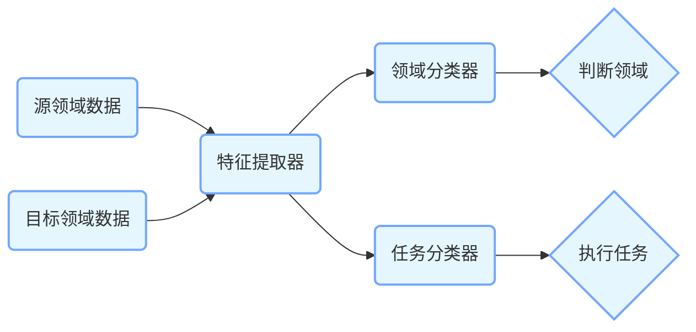

# AI Agent的域适应技术：跨领域知识迁移

> 关键词：AI Agent、域适应技术、跨领域知识迁移、机器学习、深度学习、领域差异、知识泛化

> 摘要：本文聚焦于AI Agent的域适应技术，旨在深入探讨跨领域知识迁移的相关原理、算法、数学模型及实际应用。通过系统地介绍域适应技术的背景、核心概念、算法原理、数学模型，结合项目实战案例，详细阐述如何实现AI Agent在不同领域间的知识迁移，以提高其泛化能力和适应性。同时，分析了该技术在实际场景中的应用，推荐了相关的学习资源、开发工具和论文著作，最后总结了未来发展趋势与挑战，为相关领域的研究和实践提供全面且深入的参考。

## 1. 背景介绍 
### 1.1 目的和范围
随着人工智能技术的不断发展，AI Agent在各个领域得到了广泛的应用。然而，不同领域的数据分布和任务需求存在显著差异，这使得AI Agent在一个领域训练得到的模型难以直接应用到其他领域。域适应技术作为解决这一问题的关键手段，旨在通过跨领域知识迁移，使AI Agent能够在不同领域中高效地工作。本文的目的在于全面介绍AI Agent的域适应技术，包括其原理、算法、数学模型、实际应用等方面，涵盖了从理论到实践的多个层面，为读者提供一个系统的了解和学习途径。

### 1.2 预期读者
本文预期读者包括人工智能领域的研究人员、开发者、学生以及对AI Agent和域适应技术感兴趣的技术爱好者。无论是希望深入研究域适应技术的理论基础，还是想要在实际项目中应用该技术的开发者，都能从本文中获取有价值的信息。

### 1.3 文档结构概述
本文将按照以下结构进行阐述：首先介绍域适应技术的背景知识，包括目的、预期读者和文档结构概述；接着阐述核心概念与联系，包括域适应的基本原理和架构；然后详细讲解核心算法原理及具体操作步骤，通过Python代码进行说明；再介绍数学模型和公式，并举例说明；之后通过项目实战展示代码实际案例和详细解释；分析实际应用场景；推荐相关的工具和资源；最后总结未来发展趋势与挑战，提供常见问题与解答及扩展阅读参考资料。

### 1.4 术语表
#### 1.4.1 核心术语定义
- **AI Agent**：人工智能代理，是能够感知环境、做出决策并采取行动以实现特定目标的智能实体。
- **域适应（Domain Adaptation）**：指将在一个源领域（Source Domain）中训练得到的模型应用到另一个目标领域（Target Domain）时，通过某种方法减少两个领域之间的差异，使模型能够在目标领域中有效工作的技术。
- **跨领域知识迁移（Cross - Domain Knowledge Transfer）**：将一个领域的知识、经验或模型参数应用到另一个不同领域的过程，以提高目标领域的学习效率和性能。
- **源领域（Source Domain）**：数据丰富且模型训练的原始领域。
- **目标领域（Target Domain）**：需要将源领域知识迁移过来并应用的领域。

#### 1.4.2 相关概念解释
- **领域差异**：源领域和目标领域在数据分布、特征表示、任务定义等方面存在的不同。例如，在图像识别中，源领域可能是自然图像，目标领域可能是医学图像，两者的图像特征和语义信息有很大差异。
- **知识泛化**：模型在训练数据之外的新数据上能够保持良好性能的能力，域适应技术的一个重要目标就是提高模型的知识泛化能力，使其能够适应不同领域的变化。

#### 1.4.3 缩略词列表
- **DANN**：Domain Adversarial Neural Network（域对抗神经网络）
- **MMD**：Maximum Mean Discrepancy（最大均值差异）

## 2. 核心概念与联系 
### 核心概念原理
域适应技术的核心思想是解决源领域和目标领域之间的分布差异问题。在传统的机器学习中，我们通常假设训练数据和测试数据来自相同的分布。然而，在跨领域应用中，这个假设往往不成立。源领域和目标领域的数据可能具有不同的均值、方差、概率分布等。域适应技术通过各种方法来缩小这种分布差异，从而实现知识的迁移。

一种常见的方法是特征对齐，即通过学习一个特征变换函数，将源领域和目标领域的数据映射到一个共同的特征空间，使得在这个空间中两个领域的数据分布尽可能相似。另一种方法是基于对抗学习的思想，通过一个对抗网络来训练模型，使得模型能够区分源领域和目标领域的数据，同时又要学习到对领域不变的特征表示。

### 架构示意图


在这个架构中，源领域数据和目标领域数据首先通过特征提取器进行特征提取。然后，提取的特征分别输入到领域分类器和任务分类器中。领域分类器的作用是判断输入数据来自源领域还是目标领域，而任务分类器则是执行具体的任务，如分类、回归等。通过训练领域分类器和任务分类器，使得模型能够学习到对领域不变的特征表示，从而实现跨领域知识迁移。

## 3. 核心算法原理 & 具体操作步骤 
### 域对抗神经网络（DANN）算法原理
域对抗神经网络（DANN）是一种基于对抗学习的域适应算法。其核心思想是通过一个对抗网络来学习领域不变的特征表示。具体来说，DANN由三个部分组成：特征提取器、领域分类器和任务分类器。

特征提取器的作用是将输入数据映射到一个特征空间。领域分类器的任务是判断输入数据来自源领域还是目标领域，而任务分类器则是执行具体的任务，如分类任务。在训练过程中，特征提取器和任务分类器是协同训练的，而领域分类器则与特征提取器进行对抗训练。

### Python源代码实现
```python
import torch
import torch.nn as nn
import torch.optim as optim
from torch.utils.data import DataLoader, Dataset

# 定义特征提取器
class FeatureExtractor(nn.Module):
    def __init__(self):
        super(FeatureExtractor, self).__init__()
        self.fc1 = nn.Linear(10, 20)
        self.relu = nn.ReLU()
        self.fc2 = nn.Linear(20, 15)

    def forward(self, x):
        x = self.fc1(x)
        x = self.relu(x)
        x = self.fc2(x)
        return x

# 定义领域分类器
class DomainClassifier(nn.Module):
    def __init__(self):
        super(DomainClassifier, self).__init__()
        self.fc = nn.Linear(15, 1)
        self.sigmoid = nn.Sigmoid()

    def forward(self, x):
        x = self.fc(x)
        x = self.sigmoid(x)
        return x

# 定义任务分类器
class TaskClassifier(nn.Module):
    def __init__(self):
        super(TaskClassifier, self).__init__()
        self.fc = nn.Linear(15, 2)
        self.softmax = nn.Softmax(dim=1)

    def forward(self, x):
        x = self.fc(x)
        x = self.softmax(x)
        return x

# 自定义数据集类
class CustomDataset(Dataset):
    def __init__(self, data, labels, domain_labels):
        self.data = data
        self.labels = labels
        self.domain_labels = domain_labels

    def __len__(self):
        return len(self.data)

    def __getitem__(self, idx):
        return self.data[idx], self.labels[idx], self.domain_labels[idx]

# 训练函数
def train_dann(source_data, source_labels, target_data, target_labels, num_epochs=100, batch_size=32):
    # 初始化模型
    feature_extractor = FeatureExtractor()
    domain_classifier = DomainClassifier()
    task_classifier = TaskClassifier()

    # 定义优化器和损失函数
    optimizer = optim.Adam(list(feature_extractor.parameters()) + list(task_classifier.parameters()) + list(domain_classifier.parameters()), lr=0.001)
    task_criterion = nn.CrossEntropyLoss()
    domain_criterion = nn.BCELoss()

    # 创建数据集和数据加载器
    source_domain_labels = torch.zeros(len(source_data))
    target_domain_labels = torch.ones(len(target_data))
    source_dataset = CustomDataset(source_data, source_labels, source_domain_labels)
    target_dataset = CustomDataset(target_data, target_labels, target_domain_labels)
    source_loader = DataLoader(source_dataset, batch_size=batch_size, shuffle=True)
    target_loader = DataLoader(target_dataset, batch_size=batch_size, shuffle=True)

    for epoch in range(num_epochs):
        for (source_batch, source_label_batch, source_domain_batch), (target_batch, _, target_domain_batch) in zip(source_loader, target_loader):
            # 前向传播
            source_features = feature_extractor(source_batch)
            target_features = feature_extractor(target_batch)
            all_features = torch.cat((source_features, target_features), dim=0)
            all_domain_labels = torch.cat((source_domain_batch, target_domain_batch), dim=0).unsqueeze(1)

            domain_output = domain_classifier(all_features)
            source_task_output = task_classifier(source_features)

            # 计算损失
            domain_loss = domain_criterion(domain_output, all_domain_labels)
            task_loss = task_criterion(source_task_output, source_label_batch)
            loss = task_loss + domain_loss

            # 反向传播和优化
            optimizer.zero_grad()
            loss.backward()
            optimizer.step()

        if epoch % 10 == 0:
            print(f'Epoch {epoch}, Loss: {loss.item()}')

    return feature_extractor, task_classifier
```

### 具体操作步骤
1. **数据准备**：准备源领域数据和目标领域数据，包括输入数据、标签和领域标签。
2. **模型初始化**：初始化特征提取器、领域分类器和任务分类器。
3. **定义优化器和损失函数**：使用Adam优化器，任务损失使用交叉熵损失函数，领域损失使用二元交叉熵损失函数。
4. **创建数据集和数据加载器**：将数据封装成数据集，并创建数据加载器。
5. **训练模型**：在每个epoch中，进行前向传播计算损失，然后进行反向传播和优化。
6. **评估模型**：在训练完成后，可以使用目标领域的数据对模型进行评估，检查模型在目标领域的性能。

## 4. 数学模型和公式 & 详细讲解 & 举例说明 
### 最大均值差异（MMD）数学模型
最大均值差异（MMD）是一种衡量两个分布之间差异的方法。给定两个数据集 $X = \{x_1, x_2, \cdots, x_n\}$ 和 $Y = \{y_1, y_2, \cdots, y_m\}$，MMD的定义为：

$$MMD^2(X, Y) = \left\|\frac{1}{n}\sum_{i=1}^{n}\phi(x_i) - \frac{1}{m}\sum_{j=1}^{m}\phi(y_j)\right\|_{\mathcal{H}}^2$$

其中，$\phi(\cdot)$ 是一个将数据映射到再生核希尔伯特空间（RKHS） $\mathcal{H}$ 的映射函数。在实际计算中，通常使用核函数 $k(x, y) = \langle\phi(x), \phi(y)\rangle_{\mathcal{H}}$ 来计算MMD，其计算公式为：

$$MMD^2(X, Y) = \frac{1}{n^2}\sum_{i=1}^{n}\sum_{j=1}^{n}k(x_i, x_j) + \frac{1}{m^2}\sum_{i=1}^{m}\sum_{j=1}^{m}k(y_i, y_j) - \frac{2}{nm}\sum_{i=1}^{n}\sum_{j=1}^{m}k(x_i, y_j)$$

### 详细讲解
MMD的核心思想是通过比较两个数据集在再生核希尔伯特空间中的均值来衡量它们之间的差异。如果两个数据集的分布相同，那么它们在RKHS中的均值也应该相同，此时MMD的值为0。反之，MMD的值越大，说明两个数据集的分布差异越大。

### 举例说明
假设我们有两个一维数据集 $X = \{1, 2, 3\}$ 和 $Y = \{4, 5, 6\}$，使用高斯核函数 $k(x, y) = \exp\left(-\frac{\|x - y\|^2}{2\sigma^2}\right)$，其中 $\sigma = 1$。

首先计算 $\frac{1}{n^2}\sum_{i=1}^{n}\sum_{j=1}^{n}k(x_i, x_j)$：
- 当 $i = 1, j = 1$ 时，$k(1, 1)=\exp\left(-\frac{\|1 - 1\|^2}{2\times1^2}\right)=1$
- 当 $i = 1, j = 2$ 时，$k(1, 2)=\exp\left(-\frac{\|1 - 2\|^2}{2\times1^2}\right)=\exp\left(-\frac{1}{2}\right)\approx0.6065$
- 以此类推，计算所有的 $k(x_i, x_j)$ 并求和，再除以 $n^2 = 9$。

同理计算 $\frac{1}{m^2}\sum_{i=1}^{m}\sum_{j=1}^{m}k(y_i, y_j)$ 和 $\frac{2}{nm}\sum_{i=1}^{n}\sum_{j=1}^{m}k(x_i, y_j)$，最后得到MMD的值。

```python
import numpy as np

def gaussian_kernel(x, y, sigma=1):
    return np.exp(-np.linalg.norm(x - y)**2 / (2 * sigma**2))

def mmd(X, Y, sigma=1):
    n = len(X)
    m = len(Y)
    term1 = 0
    for i in range(n):
        for j in range(n):
            term1 += gaussian_kernel(X[i], X[j], sigma)
    term1 /= n**2

    term2 = 0
    for i in range(m):
        for j in range(m):
            term2 += gaussian_kernel(Y[i], Y[j], sigma)
    term2 /= m**2

    term3 = 0
    for i in range(n):
        for j in range(m):
            term3 += gaussian_kernel(X[i], Y[j], sigma)
    term3 *= 2 / (n * m)

    return term1 + term2 - term3

X = np.array([1, 2, 3])
Y = np.array([4, 5, 6])
print(mmd(X, Y))
```

## 5. 项目实战：代码实际案例和详细解释说明 
### 5.1  开发环境搭建
- **操作系统**：推荐使用Linux系统，如Ubuntu 18.04及以上版本，也可以使用Windows 10或macOS。
- **Python环境**：Python 3.6及以上版本，可以使用Anaconda来管理Python环境。
- **深度学习框架**：PyTorch 1.7及以上版本，可以根据自己的显卡情况选择是否安装GPU版本。

安装PyTorch的命令如下（以CPU版本为例）：
```bash
pip install torch torchvision
```

### 5.2  源代码详细实现和代码解读
以下是一个完整的域适应项目实战代码，使用MNIST和USPS数据集进行跨领域数字识别任务。

```python
import torch
import torch.nn as nn
import torch.optim as optim
from torchvision import datasets, transforms
from torch.utils.data import DataLoader, ConcatDataset
import numpy as np

# 定义特征提取器
class FeatureExtractor(nn.Module):
    def __init__(self):
        super(FeatureExtractor, self).__init__()
        self.conv1 = nn.Conv2d(1, 10, kernel_size=5)
        self.pool = nn.MaxPool2d(2)
        self.relu = nn.ReLU()
        self.conv2 = nn.Conv2d(10, 20, kernel_size=5)
        self.fc1 = nn.Linear(320, 50)

    def forward(self, x):
        x = self.pool(self.relu(self.conv1(x)))
        x = self.pool(self.relu(self.conv2(x)))
        x = x.view(-1, 320)
        x = self.relu(self.fc1(x))
        return x

# 定义领域分类器
class DomainClassifier(nn.Module):
    def __init__(self):
        super(DomainClassifier, self).__init__()
        self.fc = nn.Linear(50, 1)
        self.sigmoid = nn.Sigmoid()

    def forward(self, x):
        x = self.fc(x)
        x = self.sigmoid(x)
        return x

# 