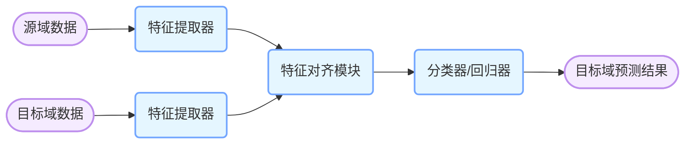

# AI Agent的域适应：跨领域知识迁移

> 关键词：AI Agent、域适应、跨领域知识迁移、机器学习、特征映射、对抗训练

> 摘要：本文围绕AI Agent的域适应和跨领域知识迁移展开深入探讨。首先介绍了研究背景、目的、预期读者和文档结构，对相关术语进行了清晰定义。详细阐述了域适应的核心概念与联系，包括原理和架构，并通过Mermaid流程图直观呈现。深入讲解了核心算法原理及具体操作步骤，结合Python源代码进行说明。给出了相关数学模型和公式，并举例解释。通过项目实战展示了代码实现和详细解读。分析了实际应用场景，推荐了学习资源、开发工具框架和相关论文著作。最后总结了未来发展趋势与挑战，并提供常见问题解答和扩展阅读参考资料，旨在为读者全面了解和应用AI Agent的域适应提供专业指导。

## 1. 背景介绍 
### 1.1 目的和范围
在当今的人工智能领域，AI Agent被广泛应用于各种任务和场景中，如机器人导航、智能客服、自动驾驶等。然而，不同的应用场景往往对应着不同的数据分布和特征模式，即不同的“域”。当一个AI Agent在一个源域上训练好后，直接应用到目标域时，由于域之间的差异，其性能往往会显著下降。域适应和跨领域知识迁移的研究目的就是解决这一问题，使得AI Agent能够将在源域学到的知识有效地迁移到目标域，从而在目标域上也能表现出良好的性能。

本文的范围涵盖了AI Agent域适应的基本概念、核心算法原理、数学模型、实际应用案例以及相关的工具和资源推荐等方面，旨在为读者提供一个全面而深入的关于AI Agent域适应和跨领域知识迁移的知识体系。

### 1.2 预期读者
本文预期读者包括人工智能领域的研究人员、开发者、数据科学家以及对AI Agent和域适应感兴趣的技术爱好者。对于初学者，本文可以作为入门教程，帮助他们了解域适应的基本概念和方法；对于有一定经验的专业人士，本文可以提供更深入的技术分析和最新的研究成果，为他们的研究和开发工作提供参考。

### 1.3 文档结构概述
本文将按照以下结构进行组织：首先介绍背景知识，包括目的、预期读者和文档结构概述，以及相关术语的定义。接着详细阐述域适应的核心概念和联系，通过文本示意图和Mermaid流程图进行直观展示。然后讲解核心算法原理和具体操作步骤，并结合Python源代码进行说明。随后给出相关的数学模型和公式，并通过具体例子进行详细解释。通过项目实战部分展示代码的实际实现和详细解读。分析AI Agent域适应在不同场景下的实际应用。推荐学习资源、开发工具框架和相关论文著作。最后总结未来发展趋势与挑战，提供常见问题解答和扩展阅读参考资料。

### 1.4 术语表
#### 1.4.1 核心术语定义
- **AI Agent（人工智能代理）**：是一种能够感知环境、做出决策并采取行动以实现特定目标的智能实体。它可以是软件程序，也可以是物理机器人。
- **域适应（Domain Adaptation）**：指的是在不同的数据分布（域）之间进行知识迁移，使得模型在目标域上也能有良好的性能。源域是模型训练的原始数据域，目标域是模型需要应用的新数据域。
- **跨领域知识迁移（Cross - domain Knowledge Transfer）**：是指将在一个领域（源域）中学习到的知识应用到另一个不同的领域（目标域）中，以提高目标域的学习效果。
- **源域（Source Domain）**：模型进行训练的原始数据集合所对应的领域。
- **目标域（Target Domain）**：模型需要在其上进行预测或执行任务的新数据集合所对应的领域。

#### 1.4.2 相关概念解释
- **特征分布差异**：源域和目标域的数据在特征空间上可能存在不同的分布。例如，在图像识别任务中，源域的图像可能是在室内环境下拍摄的，而目标域的图像是在室外环境下拍摄的，这会导致图像的颜色、光照等特征分布不同。
- **协变量偏移（Covariate Shift）**：是指源域和目标域的输入特征分布不同，但条件概率分布相同的情况。例如，在不同地区收集的医疗数据，由于环境、生活习惯等因素，数据的特征分布可能不同，但疾病与症状之间的关系（条件概率分布）可能是相似的。
- **概念漂移（Concept Drift）**：指的是数据的分布随时间发生变化，导致模型的性能下降。例如，在股票市场预测中，市场情况会随时间不断变化，之前训练的模型可能不再适用。

#### 1.4.3 缩略词列表
- **ML（Machine Learning）**：机器学习
- **DL（Deep Learning）**：深度学习
- **GAN（Generative Adversarial Network）**：生成对抗网络
- **CNN（Convolutional Neural Network）**：卷积神经网络
- **SVM（Support Vector Machine）**：支持向量机

## 2. 核心概念与联系 
### 核心概念原理
域适应的核心思想是找到一种方法，使得源域和目标域的数据在特征空间上尽可能接近，从而能够将源域学到的模型知识迁移到目标域。主要有以下几种实现方式：

#### 特征映射方法
通过学习一个特征映射函数，将源域和目标域的数据映射到一个新的特征空间，在这个新空间中，源域和目标域的数据分布更加相似。例如，可以使用自编码器（Autoencoder）来学习数据的低维表示，使得源域和目标域的数据在低维空间中的分布更加接近。

#### 对抗训练方法
利用生成对抗网络（GAN）的思想，设计一个判别器来区分源域和目标域的数据，同时训练一个特征提取器来生成能够混淆判别器的特征表示。这样可以使得源域和目标域的数据在特征层面上更加难以区分，从而实现知识迁移。

#### 样本加权方法
为源域的样本分配不同的权重，使得在训练模型时，更关注那些与目标域数据相似的源域样本。例如，可以使用基于核方法的样本加权算法，根据样本之间的相似度来计算权重。

### 架构示意图
以下是一个简单的域适应架构示意图：

```plaintext
+----------------+          +----------------+
| 源域数据        |          | 目标域数据      |
+----------------+          +----------------+
       |                          |
       |                          |
+----------------+          +----------------+
| 特征提取器      |          | 特征提取器      |
+----------------+          +----------------+
       |                          |
       |                          |
       +----------+   +----------+
                  |   |
                  v   v
            +----------------+
            | 特征对齐模块    |
            +----------------+
                  |
                  v
            +----------------+
            | 分类器/回归器  |
            +----------------+
                  |
                  v
            +----------------+
            | 目标域预测结果  |
            +----------------+
```

### Mermaid流程图


## 3. 核心算法原理 & 具体操作步骤 
### 基于对抗训练的域适应算法原理
基于对抗训练的域适应算法通常使用生成对抗网络（GAN）的思想。其核心是训练一个特征提取器和一个判别器。特征提取器的目标是将源域和目标域的数据映射到一个特征空间，使得判别器难以区分源域和目标域的数据；判别器的目标是准确区分源域和目标域的数据。

### 具体操作步骤
1. **数据准备**：收集源域和目标域的数据，并进行预处理，如归一化、特征提取等。
2. **模型定义**：定义特征提取器、判别器和分类器（或回归器）的网络结构。
3. **训练过程**：
    - 交替训练判别器和特征提取器。
    - 对于判别器，输入源域和目标域的特征，训练其区分源域和目标域的能力。
    - 对于特征提取器，输入源域和目标域的数据，训练其生成能够混淆判别器的特征表示。同时，使用源域的标签信息训练分类器（或回归器）。
4. **模型评估**：使用目标域的测试数据评估模型的性能。

### Python源代码实现
```python
import torch
import torch.nn as nn
import torch.optim as optim
from torch.utils.data import DataLoader, TensorDataset

# 定义特征提取器
class FeatureExtractor(nn.Module):
    def __init__(self):
        super(FeatureExtractor, self).__init__()
        self.fc1 = nn.Linear(10, 20)
        self.relu = nn.ReLU()
        self.fc2 = nn.Linear(20, 10)

    def forward(self, x):
        x = self.fc1(x)
        x = self.relu(x)
        x = self.fc2(x)
        return x

# 定义判别器
class Discriminator(nn.Module):
    def __init__(self):
        super(Discriminator, self).__init__()
        self.fc = nn.Linear(10, 1)
        self.sigmoid = nn.Sigmoid()

    def forward(self, x):
        x = self.fc(x)
        x = self.sigmoid(x)
        return x

# 定义分类器
class Classifier(nn.Module):
    def __init__(self):
        super(Classifier, self).__init__()
        self.fc = nn.Linear(10, 2)

    def forward(self, x):
        x = self.fc(x)
        return x

# 生成一些示例数据
source_data = torch.randn(100, 10)
source_labels = torch.randint(0, 2, (100,))
target_data = torch.randn(100, 10)

source_dataset = TensorDataset(source_data, source_labels)
source_loader = DataLoader(source_dataset, batch_size=10, shuffle=True)

# 初始化模型
feature_extractor = FeatureExtractor()
discriminator = Discriminator()
classifier = Classifier()

# 定义损失函数和优化器
criterion_discriminator = nn.BCELoss()
criterion_classifier = nn.CrossEntropyLoss()
optimizer_feature_extractor = optim.Adam(feature_extractor.parameters(), lr=0.001)
optimizer_discriminator = optim.Adam(discriminator.parameters(), lr=0.001)
optimizer_classifier = optim.Adam(classifier.parameters(), lr=0.001)

# 训练过程
num_epochs = 10
for epoch in range(num_epochs):
    for i, (source_batch, source_labels_batch) in enumerate(source_loader):
        # 训练判别器
        optimizer_discriminator.zero_grad()
        source_features = feature_extractor(source_batch)
        target_features = feature_extractor(target_data)

        source_labels_discriminator = torch.ones(source_features.size(0), 1)
        target_labels_discriminator = torch.zeros(target_features.size(0), 1)

        source_output_discriminator = discriminator(source_features)
        target_output_discriminator = discriminator(target_features)

        loss_discriminator = criterion_discriminator(source_output_discriminator, source_labels_discriminator) + \
                             criterion_discriminator(target_output_discriminator, target_labels_discriminator)
        loss_discriminator.backward(retain_graph=True)
        optimizer_discriminator.step()

        # 训练特征提取器和分类器
        optimizer_feature_extractor.zero_grad()
        optimizer_classifier.zero_grad()

        source_features = feature_extractor(source_batch)
        source_output_classifier = classifier(source_features)
        loss_classifier = criterion_classifier(source_output_classifier, source_labels_batch)

        target_features = feature_extractor(target_data)
        target_output_discriminator = discriminator(target_features)
        target_labels_discriminator = torch.ones(target_features.size(0), 1)
        loss_adversarial = criterion_discriminator(target_output_discriminator, target_labels_discriminator)

        loss_total = loss_classifier + loss_adversarial
        loss_total.backward()
        optimizer_feature_extractor.step()
        optimizer_classifier.step()

    print(f'Epoch {epoch + 1}/{num_epochs}, Loss: {loss_total.item()}')
```

## 4. 数学模型和公式 & 详细讲解 & 举例说明 
### 数学模型
在域适应问题中，我们通常假设源域数据 $X_s$ 服从分布 $P_s(X)$，目标域数据 $X_t$ 服从分布 $P_t(X)$。我们的目标是找到一个模型 $f$，使得在目标域上的风险 $R_t(f)$ 最小。

目标域风险可以定义为：
$$R_t(f) = E_{(x,y) \sim P_t(X,Y)}[L(f(x), y)]$$
其中 $L$ 是损失函数，如交叉熵损失、均方误差损失等。

### 基于最大均值差异（MMD）的域适应公式
最大均值差异（MMD）是一种常用的度量两个分布之间差异的方法。假设我们有源域样本 $x_{s1}, x_{s2}, \cdots, x_{sn}$ 和目标域样本 $x_{t1}, x_{t2}, \cdots, x_{tm}$，MMD 的计算公式为：
$$MMD^2(\mathcal{D}_s, \mathcal{D}_t) = \left\lVert \frac{1}{n} \sum_{i=1}^{n} \phi(x_{si}) - \frac{1}{m} \sum_{j=1}^{m} \phi(x_{tj}) \right\rVert_{\mathcal{H}}^2$$
其中 $\phi$ 是将样本映射到再生核希尔伯特空间（RKHS）的映射函数，$\mathcal{H}$ 是再生核希尔伯特空间。

在实际应用中，我们可以使用核函数 $k(x, x') = \langle \phi(x), \phi(x') \rangle_{\mathcal{H}}$ 来计算 MMD：
$$MMD^2(\mathcal{D}_s, \mathcal{D}_t) = \frac{1}{n^2} \sum_{i=1}^{n} \sum_{j=1}^{n} k(x_{si}, x_{sj}) + \frac{1}{m^2} \sum_{i=1}^{m} \sum_{j=1}^{m} k(x_{ti}, x_{tj}) - \frac{2}{nm} \sum_{i=1}^{n} \sum_{j=1}^{m} k(x_{si}, x_{tj})$$

### 详细讲解
MMD 的核心思想是通过比较两个分布在再生核希尔伯特空间中的均值来度量它们之间的差异。如果两个分布相同，那么它们在再生核希尔伯特空间中的均值也相同，MMD 值为 0。在域适应中，我们的目标是最小化源域和目标域之间的 MMD，使得它们在特征空间上更加接近。

### 举例说明
假设我们有源域样本 $x_{s1} = [1, 2]$，$x_{s2} = [2, 3]$ 和目标域样本 $x_{t1} = [3, 4]$，$x_{t2} = [4, 5]$。我们使用高斯核函数 $k(x, x') = \exp(-\frac{\lVert x - x' \rVert^2}{2\sigma^2})$，其中 $\sigma = 1$。

首先计算核矩阵：
$$K_{ss} = \begin{bmatrix}
k(x_{s1}, x_{s1}) & k(x_{s1}, x_{s2}) \\
k(x_{s2}, x_{s1}) & k(x_{s2}, x_{s2})
\end{bmatrix}$$
$$K_{tt} = \begin{bmatrix}
k(x_{t1}, x_{t1}) & k(x_{t1}, x_{t2}) \\
k(x_{t2}, x_{t1}) & k(x_{t2}, x_{t2})
\end{bmatrix}$$
$$K_{st} = \begin{bmatrix}
k(x_{s1}, x_{t1}) & k(x_{s1}, x_{t2}) \\
k(x_{s2}, x_{t1}) & k(x_{s2}, x_{t2})
\end{bmatrix}$$

然后计算 MMD：
$$MMD^2(\mathcal{D}_s, \mathcal{D}_t) = \frac{1}{2^2} \sum_{i=1}^{2} \sum_{j=1}^{2} K_{ss}[i, j] + \frac{1}{2^2} \sum_{i=1}^{2} \sum_{j=1}^{2} K_{tt}[i, j] - \frac{2}{2\times2} \sum_{i=1}^{2} \sum_{j=1}^{2} K_{st}[i, j]$$

```python
import numpy as np

def gaussian_kernel(x1, x2, sigma=1):
    return np.exp(-np.linalg.norm(x1 - x2) ** 2 / (2 * sigma ** 2))

source_samples = np.array([[1, 2], [2, 3]])
target_samples = np.array([[3, 4], [4, 5]])

n = len(source_samples)
m = len(target_samples)

K_ss = np.zeros((n, n))
K_tt = np.zeros((m, m))
K_st = np.zeros((n, m))

for i in range(n):
    for j in range(n):
        K_ss[i, j] = gaussian_kernel(source_samples[i], source_samples[j])
    for j in range(m):
        K_st[i, j] = gaussian_kernel(source_samples[i], target_samples[j])

for i in range(m):
    for j in range(m):
        K_tt[i, j] = gaussian_kernel(target_samples[i], target_samples[j])

mmd_squared = (1 / (n ** 2)) * np.sum(K_ss) + (1 / (m ** 2)) * np.sum(K_tt) - (2 / (n * m)) * np.sum(K_st)
print(f'MMD^2: {mmd_squared}')
```

## 5. 项目实战：代码实际案例和详细解释说明 
### 5.1  开发环境搭建
#### 安装Python
首先需要安装Python，建议使用Python 3.7及以上版本。可以从Python官方网站（https://www.python.org/downloads/）下载并安装。

#### 安装深度学习框架
我们使用PyTorch作为深度学习框架，可以通过以下命令安装：
```sh
pip install torch torchvision
```

#### 安装其他依赖库
还需要安装一些其他的依赖库，如NumPy、Matplotlib等：
```sh
pip install numpy matplotlib
```

### 5.2  源代码详细实现和代码解读
以下是一个基于MNIST和USPS数据集的域适应项目的完整代码：

```python
import torch
import torch.nn as nn
import torch.optim as optim
from torchvision import datasets, transforms
from torch.utils.data import DataLoader
import numpy as np
import matplotlib.pyplot as plt

# 定义特征提取器
class FeatureExtractor(nn.Module):
    def __init__(self):
        super(FeatureExtractor, self).__init__()
        self.conv1 = nn.Conv2d(1, 10, kernel_size=5)
        self.pool = nn.MaxPool2d(2)
        self.relu = nn.ReLU()
        self.conv2 = nn.Conv2d(10, 20, kernel_size=5)
        self.fc1 = nn.Linear(320, 50)

    def forward(self, x):
        x = self.pool(self.relu(self.conv1(x)))
        x = self.pool(self.relu(self.conv2(x)))
        x = x.view(-1, 320)
        x = self.relu(self.fc1(x))
        return x

# 定义判别器
class Discriminator(nn.Module):
    def __init__(self):
        super(Discriminator, self).__init__()
        self.fc = nn.Linear(50, 1)
        self.sigmoid = nn.Sigmoid()

    def forward(self, x):
        x = self.fc(x)
        x = self.sigmoid(x)
        return x

# 定义分类器
class Classifier(nn.Module):
    def __init__(self):
        super(Classifier, self).__init__()
        self.fc = nn.Linear(50, 10)

    def forward(self, x):
        x = self.fc(x)
        return x

# 数据预处理
transform = transforms.Compose([
    transforms.ToTensor(),
    transforms.Normalize((0.1307,), (0.3081,))
])

# 加载MNIST数据集作为源域
source_train_dataset = datasets.MNIST(root='./data', train=True,
                                      download=True, transform=transform)
source_train_loader = DataLoader(source_train_dataset, batch_size=64, shuffle=True)

# 加载USPS数据集作为目标域
target_train_dataset = datasets.USPS(root='./data', train=True,
                                     download=True, transform=transform)
target_train_loader = DataLoader(target_train_dataset, batch_size=64, shuffle=True)

# 初始化模型
feature_extractor = FeatureExtractor()
discriminator = Discriminator()
classifier = Classifier()

# 定义损失函数和优化器
criterion_discriminator = nn.BCELoss()
criterion_classifier = nn.CrossEntropyLoss()
optimizer_feature_extractor = optim.Adam(feature_extractor.parameters(), lr=0.001)
optimizer_discriminator = optim.Adam(discriminator.parameters(), lr=0.001)
optimizer_classifier = optim.Adam(classifier.parameters(), lr=0.001)

# 训练过程
num_epochs = 10
for epoch in range(num_epochs):
    for i, ((source_data, source_labels), (target_data, _)) in enumerate(zip(source_train_loader, target_train_loader)):
        # 训练判别器
        optimizer_discriminator.zero_grad()
        source_features = feature_extractor(source_data)
        target_features = feature_extractor(target_data)

        source_labels_discriminator = torch.ones(source_features.size(0), 1)
        target_labels_discriminator = torch.zeros(target_features.size(0), 1)

        source_output_discriminator = discriminator(source_features)
        target_output_discriminator = discriminator(target_features)

        loss_discriminator = criterion_discriminator(source_output_discriminator, source_labels_discriminator) + \
                             criterion_discriminator(target_output_discriminator, target_labels_discriminator)
        loss_discriminator.backward(retain_graph=True)
        optimizer_discriminator.step()

        # 训练特征提取器和分类器
        optimizer_feature_extractor.zero_grad()
        optimizer_classifier.zero_grad()

        source_features = feature_extractor(source_data)
        source_output_classifier = classifier(source_features)
        loss_classifier = criterion_classifier(source_output_classifier, source_labels)

        target_features = feature_extractor(target_data)
        target_output_discriminator = discriminator(target_features)
        target_labels_discriminator = torch.ones(target_features.size(0), 1)
        loss_adversarial = criterion_discriminator(target_output_discriminator, target_labels_discriminator)

        loss_total = loss_classifier + loss_adversarial
        loss_total.backward()
        optimizer_feature_extractor.step()
        optimizer_classifier.step()

    print(f'Epoch {epoch + 1}/{num_epochs}, Loss: {loss_total.item()}')

# 评估模型
target_test_dataset = datasets.USPS(root='./data', train=False,
                                    download=True, transform=transform)
target_test_loader = DataLoader(target_test_dataset, batch_size=64, shuffle=False)

correct = 0
total = 0
with torch.no_grad():
    for data, labels in target_test_loader:
        features = feature_extractor(data)
        outputs = classifier(features)
        _, predicted = torch.max(outputs.data, 1)
        total += labels.size(0)
        correct += (predicted == labels).sum().item()

print(f'Accuracy on target domain: {100 * correct / total}%')
```

### 5.3  代码解读与分析
#### 数据加载部分
使用`torchvision.datasets`加载MNIST和USPS数据集，并使用`DataLoader`进行批量加载。MNIST数据集作为源域，USPS数据集作为目标域。

#### 模型定义部分
- `FeatureExtractor`：使用卷积层和全连接层提取数据的特征。
- `Discriminator`：一个简单的全连接层，用于区分源域和目标域的数据。
- `Classifier`：一个全连接层，用于对源域数据进行分类。

#### 训练过程部分
- 交替训练判别器和特征提取器/分类器。
- 判别器的目标是准确区分源域和目标域的数据。
- 特征提取器和分类器的目标是生成能够混淆判别器的特征表示，并在源域上进行分类。

#### 评估部分
使用目标域的测试数据评估模型的性能，计算分类准确率。

## 6. 实际应用场景 
### 图像识别
在图像识别任务中，不同的数据集可能具有不同的光照条件、图像分辨率、拍摄角度等，导致数据分布不同。通过域适应技术，可以将在一个大规模标注数据集上训练好的模型迁移到另一个不同分布的数据集上，提高模型的泛化能力。例如，将在ImageNet数据集上训练的模型迁移到医学图像识别任务中。

### 自然语言处理
在自然语言处理中，不同的文本来源可能具有不同的语言风格、词汇分布等。例如，在社交媒体上的文本和新闻文章的文本就有很大的差异。通过域适应，可以将在新闻文章数据集上训练的情感分析模型迁移到社交媒体文本上，提高情感分析的准确性。

### 机器人导航
机器人在不同的环境中进行导航时，环境的特征（如光照、障碍物分布等）可能会发生变化。域适应技术可以帮助机器人将在模拟环境中学习到的导航策略迁移到真实环境中，提高机器人的适应性和导航能力。

### 金融风险预测
不同地区、不同行业的金融数据可能具有不同的分布特征。通过域适应，可以将在一个地区或行业的金融数据上训练的风险预测模型迁移到另一个地区或行业，提高风险预测的准确性。

## 7. 工具和资源推荐
### 7.1 学习资源推荐
#### 7.1.1 书籍推荐
- 《机器学习》（周志华）：全面介绍了机器学习的基本概念、算法和应用，对域适应也有一定的介绍。
- 《深度学习》（Ian Goodfellow、Yoshua Bengio和Aaron Courville）：深度学习领域的经典著作，涵盖了深度学习的各个方面，包括生成对抗网络等与域适应相关的技术。
- 《Pattern Recognition and Machine Learning》（Christopher M. Bishop）：一本经典的机器学习教材，对机器学习的理论和算法有深入的讲解。

#### 7.1.2 在线课程
- Coursera上的“Machine Learning”（Andrew Ng）：经典的机器学习课程，适合初学者入门。
- edX上的“Deep Learning Specialization”：由深度学习领域的知名学者授课，深入介绍了深度学习的各个方面。
- 网易云课堂上的“人工智能原理与算法”：由浙江大学的老师授课，涵盖了人工智能的基本原理和算法，包括域适应等内容。

#### 7.1.3 技术博客和网站
- Medium上的Towards Data Science：有很多关于机器学习、深度学习和域适应的高质量文章。
- arXiv.org：可以获取最新的学术论文，了解域适应领域的最新研究成果。
- Kaggle：一个数据科学竞赛平台，上面有很多关于机器学习和域适应的案例和讨论。

### 7.2 开发工具框架推荐
#### 7.2.1 IDE和编辑器
- PyCharm：一款功能强大的Python集成开发环境，支持代码调试、代码分析等功能。
- Jupyter Notebook：一个交互式的开发环境，适合进行数据探索和模型实验。
- Visual Studio Code：一款轻量级的代码编辑器，支持多种编程语言，有丰富的插件扩展。

#### 7.2.2 调试和性能分析工具
- TensorBoard：TensorFlow的可视化工具，可以用于查看模型的训练过程、损失曲线等。
- PyTorch Profiler：PyTorch的性能分析工具，可以帮助分析模型的运行时间、内存使用等情况。
- cProfile：Python的内置性能分析工具，可以分析Python代码的运行时间和函数调用情况。

#### 7.2.3 相关框架和库
- PyTorch：一个开源的深度学习框架，具有动态图的特点，易于使用和调试。
- TensorFlow：另一个流行的深度学习框架，具有强大的分布式训练和部署能力。
- Scikit-learn：一个简单易用的机器学习库，提供了各种机器学习算法和工具。

### 7.3 相关论文著作推荐
#### 7.3.1 经典论文
- “Domain Adaptation via Transfer Component Analysis”：提出了基于迁移成分分析（TCA）的域适应方法。
- “Unsupervised Domain Adaptation by Backpropagation”：首次将对抗训练引入到域适应中。
- “Learning Transferable Features with Deep Adaptation Networks”：提出了深度适应网络（DAN）的方法。

#### 7.3.2 最新研究成果
可以通过arXiv.org等学术平台关注域适应领域的最新研究论文，了解最新的算法和技术。

#### 7.3.3 应用案例分析
- 可以在Kaggle等平台上查找关于域适应的实际应用案例，学习如何在实际项目中应用域适应技术。

## 8. 总结：未来发展趋势与挑战
### 未来发展趋势
#### 多源域适应
目前的域适应研究主要集中在单源域到单目标域的迁移，未来的研究将更加关注多源域到单目标域或多目标域的迁移，以充分利用多个源域的知识。

#### 深度强化学习中的域适应
随着深度强化学习在机器人、自动驾驶等领域的广泛应用，域适应在深度强化学习中的研究将变得更加重要。如何将在模拟环境中学习到的策略迁移到真实环境中，是未来的一个研究热点。

#### 无监督和半监督域适应
在实际应用中，目标域的数据往往是无标签或只有少量标签的。因此，无监督和半监督域适应的研究将具有更大的应用价值。

### 挑战
#### 复杂的域差异
在实际应用中，源域和目标域之间的差异可能非常复杂，不仅包括特征分布的差异，还包括概念、任务等方面的差异。如何有效地处理这些复杂的域差异是一个挑战。

#### 计算资源和时间成本
一些域适应算法需要大量的计算资源和时间来训练模型，特别是在处理大规模数据集时。如何提高算法的效率，降低计算资源和时间成本是一个需要解决的问题。

#### 模型可解释性
大多数域适应模型是基于深度学习的黑盒模型，缺乏可解释性。在一些对模型可解释性要求较高的应用场景中，如何提高模型的可解释性是一个挑战。

## 9. 附录：常见问题与解答
### 问题1：域适应和迁移学习有什么区别？
域适应是迁移学习的一个子领域，主要关注的是在不同的数据分布（域）之间进行知识迁移，以提高模型在目标域上的性能。迁移学习的范围更广，除了域适应外，还包括任务迁移、领域迁移等多种形式。

### 问题2：在实际应用中，如何选择合适的域适应方法？
选择合适的域适应方法需要考虑多个因素，如数据的特点（是否有标签、数据量大小等）、域之间的差异程度、计算资源等。一般来说，如果数据量较小且域之间的差异较大，可以考虑使用基于对抗训练的方法；如果数据量较大且域之间的差异相对较小，可以考虑使用基于特征映射的方法。

### 问题3：域适应方法是否一定能提高模型在目标域上的性能？
不一定。域适应方法的效果取决于多种因素，如源域和目标域之间的相似性、模型的选择和训练等。如果源域和目标域之间的差异过大，或者模型选择不当，域适应方法可能无法提高模型在目标域上的性能，甚至可能会降低性能。

### 问题4：如何评估域适应模型的性能？
可以使用目标域的测试数据来评估域适应模型的性能，常用的评估指标包括准确率、召回率、F1值等。此外，还可以使用一些域适应特有的评估指标，如最大均值差异（MMD）等，来评估源域和目标域之间的分布差异是否减小。

## 10. 扩展阅读 & 参考资料
### 扩展阅读
- 《Adversarial Transfer Learning》：深入介绍了基于对抗训练的迁移学习方法。
- 《Domain Adaptation for Visual Applications》：专门讨论了域适应在视觉应用中的问题和方法。

### 参考资料
- [PyTorch官方文档](https://pytorch.org/docs/stable/index.html)
- [TensorFlow官方文档](https://www.tensorflow.org/api_docs)
- [Scikit-learn官方文档](https://scikit-learn.org/stable/documentation.html)

作者：AI天才研究院/AI Genius Institute & 禅与计算机程序设计艺术 /Zen And The Art of Computer Programming