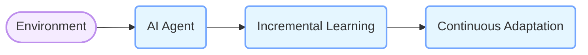

# AI Agent的增量学习与持续适应

> 关键词：AI Agent、增量学习、持续适应、机器学习、模型更新

> 摘要：本文深入探讨了AI Agent的增量学习与持续适应这一前沿话题。首先介绍了相关背景，包括目的范围、预期读者等。接着阐述了核心概念与联系，详细讲解了核心算法原理及具体操作步骤，并结合数学模型和公式进行说明。通过项目实战案例，展示了如何在实际中运用这些技术。同时分析了实际应用场景，推荐了学习所需的工具和资源。最后总结了未来发展趋势与挑战，还设置了常见问题解答和扩展阅读参考资料，旨在为读者全面呈现AI Agent增量学习与持续适应的技术全貌。

## 1. 背景介绍 
### 1.1 目的和范围
本文章的主要目的是深入探讨AI Agent的增量学习与持续适应技术。随着人工智能技术的不断发展，AI Agent需要在动态变化的环境中持续学习和适应新的数据和任务。增量学习允许AI Agent在已有知识的基础上，逐步学习新的数据，而无需重新训练整个模型，从而提高学习效率和资源利用率。持续适应则强调AI Agent能够在不同的环境和任务中保持良好的性能。

文章的范围涵盖了AI Agent增量学习与持续适应的核心概念、算法原理、数学模型、实际应用场景以及相关的工具和资源推荐。通过理论讲解和实际案例分析，帮助读者全面了解这一领域的技术和方法。

### 1.2 预期读者
本文预期读者包括人工智能领域的研究人员、开发人员、学生以及对AI Agent技术感兴趣的爱好者。对于研究人员，文章可以提供最新的研究思路和方法；对于开发人员，文章可以指导他们在实际项目中应用增量学习与持续适应技术；对于学生，文章可以作为学习人工智能相关课程的补充资料；对于爱好者，文章可以帮助他们了解这一前沿领域的基本概念和应用。

### 1.3 文档结构概述
本文将按照以下结构进行组织：
1. 背景介绍：介绍文章的目的、范围、预期读者和文档结构概述。
2. 核心概念与联系：阐述AI Agent、增量学习和持续适应的核心概念，并分析它们之间的联系。
3. 核心算法原理 & 具体操作步骤：详细讲解增量学习的核心算法原理，并给出具体的操作步骤。
4. 数学模型和公式 & 详细讲解 & 举例说明：介绍增量学习的数学模型和公式，并通过具体例子进行说明。
5. 项目实战：代码实际案例和详细解释说明：通过一个实际项目案例，展示如何实现AI Agent的增量学习与持续适应。
6. 实际应用场景：分析AI Agent增量学习与持续适应在不同领域的实际应用场景。
7. 工具和资源推荐：推荐学习和开发AI Agent增量学习与持续适应所需的工具和资源。
8. 总结：未来发展趋势与挑战：总结AI Agent增量学习与持续适应的未来发展趋势和面临的挑战。
9. 附录：常见问题与解答：解答读者在学习和应用过程中常见的问题。
10. 扩展阅读 & 参考资料：提供相关的扩展阅读材料和参考资料。

### 1.4 术语表
#### 1.4.1 核心术语定义
- **AI Agent**：人工智能代理，是一种能够感知环境、做出决策并执行行动的智能实体。它可以是软件程序、机器人或其他智能设备。
- **增量学习**：一种机器学习方法，允许模型在已有知识的基础上，逐步学习新的数据，而无需重新训练整个模型。
- **持续适应**：指AI Agent能够在不同的环境和任务中，通过不断学习和调整自身的行为，保持良好的性能。

#### 1.4.2 相关概念解释
- **在线学习**：一种增量学习的特殊形式，模型在接收到新的数据时立即进行更新。
- **迁移学习**：将在一个任务上学习到的知识迁移到另一个相关任务上的学习方法。
- **终身学习**：AI Agent在其整个生命周期内持续学习和适应新的环境和任务的能力。

#### 1.4.3 缩略词列表
- **ML**：Machine Learning，机器学习
- **DL**：Deep Learning，深度学习
- **RL**：Reinforcement Learning，强化学习

## 2. 核心概念与联系 

### 核心概念原理
#### AI Agent
AI Agent是一个自主的实体，它能够感知周围的环境，根据感知到的信息做出决策，并执行相应的行动。AI Agent可以用一个三元组 $(S, A, \pi)$ 来表示，其中 $S$ 是环境的状态空间，$A$ 是动作空间，$\pi$ 是策略函数，它将状态映射到动作。

#### 增量学习
增量学习的核心思想是在已有模型的基础上，逐步学习新的数据。传统的机器学习方法通常需要在所有数据上进行训练，当有新的数据到来时，需要重新训练整个模型，这在数据量很大或者数据不断变化的情况下是非常低效的。增量学习通过只更新模型中与新数据相关的部分，避免了重新训练整个模型，从而提高了学习效率。

#### 持续适应
持续适应强调AI Agent能够在不同的环境和任务中保持良好的性能。随着环境的变化和新任务的出现，AI Agent需要不断地学习和调整自身的策略，以适应新的情况。持续适应可以通过增量学习来实现，即通过不断地学习新的数据来更新模型，从而使AI Agent能够在新的环境和任务中表现更好。

### 架构的文本示意图
```plaintext
          +----------------+
          |    Environment   |
          +----------------+
                  |
                  v
          +----------------+
          |    AI Agent     |
          |  (S, A, π)      |
          +----------------+
                  |
                  v
          +----------------+
          | Incremental Learning |
          +----------------+
                  |
                  v
          +----------------+
          |  Continuous Adaptation |
          +----------------+
```

### Mermaid流程图


## 3. 核心算法原理 & 具体操作步骤 

### 核心算法原理
增量学习有多种算法，这里以在线梯度下降算法为例进行讲解。在线梯度下降算法是一种简单而有效的增量学习算法，它在每次接收到一个新的数据样本时，就更新模型的参数。

假设我们有一个线性回归模型 $y = \mathbf{w}^T\mathbf{x} + b$，其中 $\mathbf{w}$ 是权重向量，$b$ 是偏置项，$\mathbf{x}$ 是输入特征向量，$y$ 是输出值。我们的目标是最小化损失函数 $L(\mathbf{w}, b) = \frac{1}{2}(y - \mathbf{w}^T\mathbf{x} - b)^2$。

在线梯度下降算法的更新规则如下：
1. 初始化权重向量 $\mathbf{w}$ 和偏置项 $b$。
2. 对于每个新的数据样本 $(\mathbf{x}_i, y_i)$：
    - 计算损失函数关于 $\mathbf{w}$ 和 $b$ 的梯度：
      - $\nabla_{\mathbf{w}}L(\mathbf{w}, b) = - (y_i - \mathbf{w}^T\mathbf{x}_i - b)\mathbf{x}_i$
      - $\nabla_{b}L(\mathbf{w}, b) = - (y_i - \mathbf{w}^T\mathbf{x}_i - b)$
    - 更新权重向量和偏置项：
      - $\mathbf{w} = \mathbf{w} - \eta\nabla_{\mathbf{w}}L(\mathbf{w}, b)$
      - $b = b - \eta\nabla_{b}L(\mathbf{w}, b)$
其中 $\eta$ 是学习率，控制每次更新的步长。

### 具体操作步骤
以下是使用Python实现在线梯度下降算法的代码：
```python
import numpy as np

class OnlineLinearRegression:
    def __init__(self, learning_rate=0.01):
        self.learning_rate = learning_rate
        self.w = None
        self.b = None

    def fit(self, X, y):
        if self.w is None:
            self.w = np.zeros(X.shape[1])
            self.b = 0

        for i in range(X.shape[0]):
            xi = X[i]
            yi = y[i]
            # 计算预测值
            y_pred = np.dot(self.w, xi) + self.b
            # 计算误差
            error = yi - y_pred
            # 更新权重向量
            self.w = self.w + self.learning_rate * error * xi
            # 更新偏置项
            self.b = self.b + self.learning_rate * error

    def predict(self, X):
        return np.dot(X, self.w) + self.b
```

我们可以使用以下代码来测试这个模型：
```python
# 生成一些随机数据
X = np.random.rand(100, 2)
y = 2 * X[:, 0] + 3 * X[:, 1] + np.random.randn(100)

# 创建在线线性回归模型
model = OnlineLinearRegression(learning_rate=0.01)

# 逐样本进行增量学习
for i in range(X.shape[0]):
    xi = X[i].reshape(1, -1)
    yi = np.array([y[i]])
    model.fit(xi, yi)

# 预测新的数据
new_X = np.random.rand(10, 2)
predictions = model.predict(new_X)
print(predictions)
```

## 4. 数学模型和公式 & 详细讲解 & 举例说明 

### 数学模型
在线梯度下降算法的数学模型基于最小化损失函数。对于线性回归模型 $y = \mathbf{w}^T\mathbf{x} + b$，损失函数通常采用均方误差（MSE）：
$$
L(\mathbf{w}, b) = \frac{1}{2}(y - \mathbf{w}^T\mathbf{x} - b)^2
$$

### 详细讲解
为了最小化损失函数 $L(\mathbf{w}, b)$，我们需要找到使得 $L(\mathbf{w}, b)$ 最小的 $\mathbf{w}$ 和 $b$。在线梯度下降算法通过迭代的方式更新 $\mathbf{w}$ 和 $b$，每次迭代都朝着损失函数的负梯度方向更新。

损失函数关于 $\mathbf{w}$ 和 $b$ 的梯度分别为：
$$
\nabla_{\mathbf{w}}L(\mathbf{w}, b) = - (y - \mathbf{w}^T\mathbf{x} - b)\mathbf{x}
$$
$$
\nabla_{b}L(\mathbf{w}, b) = - (y - \mathbf{w}^T\mathbf{x} - b)
$$

更新规则为：
$$
\mathbf{w} = \mathbf{w} - \eta\nabla_{\mathbf{w}}L(\mathbf{w}, b)
$$
$$
b = b - \eta\nabla_{b}L(\mathbf{w}, b)
$$
其中 $\eta$ 是学习率，它控制了每次更新的步长。如果学习率过大，模型可能会跳过最优解；如果学习率过小，模型的收敛速度会很慢。

### 举例说明
假设我们有一个简单的线性回归问题，输入特征向量 $\mathbf{x} = [1, 2]$，真实输出值 $y = 5$，初始权重向量 $\mathbf{w} = [0, 0]$，偏置项 $b = 0$，学习率 $\eta = 0.1$。

1. 计算预测值：
   - $y_{pred} = \mathbf{w}^T\mathbf{x} + b = 0\times1 + 0\times2 + 0 = 0$
2. 计算误差：
   - $error = y - y_{pred} = 5 - 0 = 5$
3. 计算梯度：
   - $\nabla_{\mathbf{w}}L(\mathbf{w}, b) = - error\times\mathbf{x} = - 5\times[1, 2] = [-5, -10]$
   - $\nabla_{b}L(\mathbf{w}, b) = - error = - 5$
4. 更新权重向量和偏置项：
   - $\mathbf{w} = \mathbf{w} - \eta\nabla_{\mathbf{w}}L(\mathbf{w}, b) = [0, 0] - 0.1\times[-5, -10] = [0.5, 1]$
   - $b = b - \eta\nabla_{b}L(\mathbf{w}, b) = 0 - 0.1\times(-5) = 0.5$

通过不断地重复上述步骤，模型的权重向量和偏置项会逐渐收敛到最优值。

## 5. 项目实战：代码实际案例和详细解释说明 

### 5.1  开发环境搭建
为了实现AI Agent的增量学习与持续适应，我们需要搭建一个开发环境。以下是搭建开发环境的步骤：

1. **安装Python**：Python是一种广泛使用的编程语言，在人工智能领域有很多优秀的库和框架。我们可以从Python官方网站（https://www.python.org/downloads/）下载并安装Python 3.x版本。

2. **安装必要的库**：我们需要安装一些常用的Python库，如NumPy、Pandas、Scikit-learn等。可以使用以下命令来安装这些库：
```bash
pip install numpy pandas scikit-learn
```

### 5.2  源代码详细实现和代码解读
我们以一个简单的图像分类任务为例，展示如何实现AI Agent的增量学习与持续适应。我们将使用MNIST手写数字数据集，该数据集包含60000个训练样本和10000个测试样本。

```python
import numpy as np
from sklearn.datasets import fetch_openml
from sklearn.linear_model import SGDClassifier
from sklearn.metrics import accuracy_score

# 加载MNIST数据集
mnist = fetch_openml('mnist_784', version=1)
X, y = mnist["data"], mnist["target"]
y = y.astype(np.uint8)

# 划分训练集和测试集
X_train, X_test = X[:60000], X[60000:]
y_train, y_test = y[:60000], y[60000:]

# 创建SGDClassifier模型，SGDClassifier是一种支持增量学习的线性分类器
model = SGDClassifier(random_state=42)

# 增量学习过程
batch_size = 1000
for i in range(0, len(X_train), batch_size):
    X_batch = X_train[i:i+batch_size]
    y_batch = y_train[i:i+batch_size]
    model.partial_fit(X_batch, y_batch, classes=np.unique(y))

# 在测试集上评估模型
y_pred = model.predict(X_test)
accuracy = accuracy_score(y_test, y_pred)
print(f"Accuracy: {accuracy}")
```

### 代码解读与分析
1. **数据加载**：使用 `fetch_openml` 函数从OpenML数据集库中加载MNIST数据集。
2. **数据划分**：将数据集划分为训练集和测试集，训练集包含60000个样本，测试集包含10000个样本。
3. **模型创建**：创建一个 `SGDClassifier` 模型，`SGDClassifier` 是一种支持增量学习的线性分类器，它使用随机梯度下降算法进行训练。
4. **增量学习**：将训练集分成多个小批量，每次使用一个小批量的数据来更新模型。`partial_fit` 方法用于增量学习，它允许模型在已有知识的基础上，逐步学习新的数据。
5. **模型评估**：在测试集上评估模型的性能，使用 `accuracy_score` 函数计算模型的准确率。

通过这种方式，我们可以实现AI Agent的增量学习与持续适应，使得模型能够在不断变化的数据上保持良好的性能。

## 6. 实际应用场景 
AI Agent的增量学习与持续适应在很多领域都有广泛的应用，以下是一些常见的应用场景：

### 推荐系统
在推荐系统中，用户的兴趣和行为会随着时间不断变化。使用增量学习技术，推荐系统可以在用户产生新的行为数据时，及时更新推荐模型，从而为用户提供更个性化、更准确的推荐。例如，电商平台可以根据用户的购买历史和浏览记录，不断调整商品推荐列表。

### 金融风险评估
金融市场是动态变化的，新的风险因素和市场情况不断出现。AI Agent可以通过增量学习不断更新风险评估模型，实时监测金融风险。例如，银行可以根据客户的信用记录和市场数据，动态评估贷款风险。

### 医疗诊断
医疗数据是不断积累的，新的病例和研究成果会不断出现。AI Agent的增量学习与持续适应技术可以帮助医生更准确地进行疾病诊断。例如，医学影像诊断系统可以通过学习新的病例影像，提高疾病诊断的准确率。

### 自动驾驶
自动驾驶汽车需要在不同的路况和环境中行驶，遇到的情况千变万化。AI Agent可以通过增量学习不断适应新的路况和环境，提高自动驾驶的安全性和可靠性。例如，当遇到新的交通标志或路况时，自动驾驶系统可以及时学习并调整驾驶策略。

### 工业自动化
在工业生产中，生产环境和工艺参数可能会发生变化。AI Agent的增量学习与持续适应技术可以帮助工业机器人和自动化系统及时调整工作策略，提高生产效率和产品质量。例如，机器人可以根据生产线上的实时数据，动态调整操作动作。

## 7. 工具和资源推荐
### 7.1 学习资源推荐
#### 7.1.1 书籍推荐
- 《机器学习》（周志华著）：这本书是机器学习领域的经典教材，全面介绍了机器学习的基本概念、算法和应用。
- 《深度学习》（Ian Goodfellow、Yoshua Bengio和Aaron Courville著）：深度学习领域的权威著作，详细讲解了深度学习的理论和实践。
- 《强化学习：原理与Python实现》（智能系统学习与应用系列）：这本书介绍了强化学习的基本原理和算法，并通过Python代码进行了实现。

#### 7.1.2 在线课程
- Coursera上的“机器学习”课程（Andrew Ng教授授课）：这是一门非常经典的机器学习课程，适合初学者入门。
- edX上的“深度学习专项课程”：由深度学习领域的知名学者授课，系统介绍了深度学习的各个方面。
- Udemy上的“强化学习实战”课程：通过实际项目案例，帮助学员掌握强化学习的应用。

#### 7.1.3 技术博客和网站
- Medium上的AI相关博客：Medium上有很多AI领域的优秀博客，涵盖了机器学习、深度学习、强化学习等多个方面。
- arXiv.org：这是一个预印本平台，提供了大量的最新AI研究论文。
- AI社区论坛：如Stack Overflow、Reddit的AI板块等，是开发者交流和学习的好地方。

### 7.2 开发工具框架推荐
#### 7.2.1 IDE和编辑器
- PyCharm：一款功能强大的Python集成开发环境，提供了代码编辑、调试、版本控制等一系列功能。
- Jupyter Notebook：一个交互式的开发环境，适合进行数据探索、模型实验和可视化。
- Visual Studio Code：一款轻量级的代码编辑器，支持多种编程语言，有丰富的插件扩展。

#### 7.2.2 调试和性能分析工具
- TensorBoard：TensorFlow提供的可视化工具，可以帮助用户监控模型的训练过程、分析模型的性能。
- Py-Spy：一个用于Python代码性能分析的工具，可以找出代码中的性能瓶颈。
- cProfile：Python标准库中的性能分析模块，可以统计函数的调用次数和执行时间。

#### 7.2.3 相关框架和库
- TensorFlow：一个开源的机器学习框架，广泛应用于深度学习领域，提供了丰富的工具和库。
- PyTorch：另一个流行的深度学习框架，具有动态图的特点，易于使用和调试。
- Scikit-learn：一个简单易用的机器学习库，提供了多种机器学习算法和工具，适合初学者和快速原型开发。

### 7.3 相关论文著作推荐
#### 7.3.1 经典论文
- “Learning representations by back-propagating errors”（Rumelhart, Hinton, and Williams, 1986）：这篇论文介绍了反向传播算法，是神经网络发展的重要里程碑。
- “Playing Atari with Deep Reinforcement Learning”（Mnih et al., 2013）：首次提出了深度强化学习的概念，并在Atari游戏上取得了很好的效果。
- “Incremental Learning of Concept Drift in Non-Stationary Environments”（Widmer and Kubat, 1996）：介绍了在非平稳环境中进行增量学习的方法。

#### 7.3.2 最新研究成果
- 关注顶级AI会议（如NeurIPS、ICML、CVPR等）上的最新研究论文，了解AI Agent增量学习与持续适应领域的最新进展。
- 一些知名的研究机构（如OpenAI、DeepMind等）也会发布相关的研究成果，可以关注他们的官方网站。

#### 7.3.3 应用案例分析
- 可以在学术数据库（如IEEE Xplore、ACM Digital Library等）中搜索相关的应用案例论文，了解AI Agent增量学习与持续适应技术在不同领域的实际应用情况。

## 8. 总结：未来发展趋势与挑战
### 未来发展趋势
#### 多模态增量学习
随着数据类型的多样化，未来的AI Agent需要能够处理多种模态的数据，如图像、文本、语音等。多模态增量学习将成为一个重要的研究方向，通过整合不同模态的数据，提高AI Agent的学习能力和适应能力。

#### 终身学习系统
构建能够在整个生命周期内持续学习和适应的AI Agent是未来的一个重要目标。终身学习系统需要具备知识积累、知识迁移和知识更新的能力，能够在不同的任务和环境中不断进化。

#### 与人类协作学习
AI Agent将越来越多地与人类进行协作学习，通过与人类的交互和合作，获取更多的知识和反馈。这种人机协作学习模式将提高AI Agent的学习效率和智能水平。

#### 边缘计算与增量学习
随着物联网和边缘计算的发展，AI Agent将更多地部署在边缘设备上。边缘计算与增量学习的结合将使得AI Agent能够在本地进行实时学习和决策，减少数据传输和处理的延迟。

### 面临的挑战
#### 概念漂移问题
在动态变化的环境中，数据的分布可能会发生变化，导致模型的性能下降。如何有效地处理概念漂移问题，是增量学习面临的一个重要挑战。

#### 灾难性遗忘问题
当AI Agent学习新的数据时，可能会忘记之前学习到的知识，导致灾难性遗忘。如何避免灾难性遗忘，保持模型的稳定性和连续性，是一个亟待解决的问题。

#### 计算资源限制
增量学习需要在有限的计算资源下进行实时学习和更新。如何优化算法和模型，减少计算资源的消耗，是实际应用中需要考虑的问题。

#### 数据隐私和安全
在增量学习过程中，需要不断地处理和更新数据。如何保护数据的隐私和安全，防止数据泄露和恶意攻击，是一个重要的挑战。

## 9. 附录：常见问题与解答
### 问题1：增量学习和传统机器学习有什么区别？
增量学习允许模型在已有知识的基础上，逐步学习新的数据，而无需重新训练整个模型。传统机器学习通常需要在所有数据上进行训练，当有新的数据到来时，需要重新训练整个模型，这在数据量很大或者数据不断变化的情况下是非常低效的。

### 问题2：如何选择合适的增量学习算法？
选择合适的增量学习算法需要考虑多个因素，如数据类型、数据规模、模型复杂度、计算资源等。例如，如果数据是流式数据，且模型复杂度较低，可以选择在线梯度下降算法；如果数据规模较大，且需要处理高维数据，可以选择随机梯度下降算法。

### 问题3：增量学习会导致模型过拟合吗？
增量学习也可能会导致模型过拟合，特别是当新的数据与旧的数据分布差异较大时。为了避免过拟合，可以采用正则化方法、模型融合方法等。

### 问题4：如何评估增量学习模型的性能？
可以使用传统的机器学习评估指标，如准确率、召回率、F1值等，来评估增量学习模型的性能。此外，还可以考虑模型的稳定性和适应性，如在不同时间点的性能变化、对新数据的适应能力等。

### 问题5：增量学习在实际应用中有哪些限制？
增量学习在实际应用中可能会受到计算资源、数据隐私、概念漂移等因素的限制。例如，增量学习需要实时处理新的数据，对计算资源的要求较高；在处理敏感数据时，需要考虑数据隐私和安全问题；在动态变化的环境中，需要有效地处理概念漂移问题。

## 10. 扩展阅读 & 参考资料
### 扩展阅读
- 《自适应机器学习》：深入介绍了自适应机器学习的理论和方法，包括增量学习、在线学习等。
- 《终身机器学习》：探讨了如何构建能够在整个生命周期内持续学习和适应的机器学习系统。
- 《人工智能：一种现代的方法》：全面介绍了人工智能的各个方面，包括AI Agent、机器学习、自然语言处理等。

### 参考资料
- [周志华. 机器学习[M]. 清华大学出版社, 2016.](https://book.douban.com/subject/25708119/)
- [Ian Goodfellow, Yoshua Bengio, Aaron Courville. 深度学习[M]. 人民邮电出版社, 2017.](https://book.douban.com/subject/27087503/)
- [Andrew Ng. Machine Learning [Online Course]. Coursera.](https://www.coursera.org/learn/machine-learning)
- [Mnih, V., Kavukcuoglu, K., Silver, D., et al. Playing Atari with Deep Reinforcement Learning [J]. arXiv preprint arXiv:1312.5602, 2013.](https://arxiv.org/abs/1312.5602)

作者：AI天才研究院/AI Genius Institute & 禅与计算机程序设计艺术 /Zen And The Art of Computer Programming