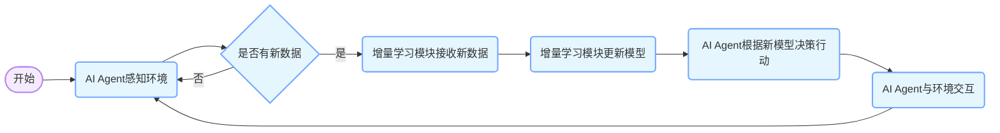

# AI Agent的增量学习：适应动态变化的环境

> 关键词：AI Agent、增量学习、动态环境、模型更新、知识积累

> 摘要：本文围绕AI Agent的增量学习展开，旨在探讨如何使AI Agent能够在动态变化的环境中进行有效的学习和适应。首先介绍了文章的背景，包括目的、预期读者、文档结构和相关术语。接着阐述了核心概念，如AI Agent和增量学习的原理及联系，并通过示意图和流程图进行直观展示。详细讲解了核心算法原理和具体操作步骤，使用Python代码进行说明。给出了相关的数学模型和公式，并举例进行解释。通过项目实战，展示了代码的实际应用和详细解读。分析了AI Agent增量学习的实际应用场景，推荐了学习资源、开发工具和相关论文著作。最后总结了未来发展趋势与挑战，并提供了常见问题解答和扩展阅读资料。

## 1. 背景介绍 
### 1.1 目的和范围
在当今复杂多变的现实世界中，环境往往是动态变化的。传统的机器学习模型通常是在固定的数据集上进行训练，训练完成后模型的参数就基本固定下来，难以适应新出现的数据和变化的环境。而AI Agent作为能够感知环境并做出决策的智能实体，需要具备在动态环境中持续学习和适应的能力。本文的目的就是深入探讨AI Agent如何通过增量学习来适应动态变化的环境，研究其核心概念、算法原理、实际应用等方面，为相关领域的研究和实践提供理论支持和技术指导。

本文的范围涵盖了AI Agent增量学习的基本概念、核心算法、数学模型、项目实战、应用场景以及相关的工具和资源推荐等方面，旨在全面系统地介绍这一领域的知识。

### 1.2 预期读者
本文的预期读者包括但不限于以下几类人群：
- 人工智能领域的研究人员，希望深入了解AI Agent增量学习的理论和技术，为其研究工作提供新的思路和方法。
- 软件开发人员，尤其是从事AI Agent开发的程序员，需要掌握增量学习的实现方法，以提高AI Agent在动态环境中的性能。
- 对人工智能技术感兴趣的学生和爱好者，通过阅读本文可以初步了解AI Agent增量学习的基本概念和应用场景，激发他们对这一领域的学习兴趣。
- 企业中负责AI项目的技术管理人员，了解AI Agent增量学习的发展趋势和应用前景，有助于制定合理的技术战略和项目规划。

### 1.3 文档结构概述
本文的文档结构如下：
- 背景介绍：介绍文章的目的、预期读者、文档结构和相关术语。
- 核心概念与联系：阐述AI Agent和增量学习的核心概念，以及它们之间的联系，并通过示意图和流程图进行直观展示。
- 核心算法原理 & 具体操作步骤：详细讲解AI Agent增量学习的核心算法原理，并使用Python代码展示具体的操作步骤。
- 数学模型和公式 & 详细讲解 & 举例说明：给出相关的数学模型和公式，并进行详细讲解，通过具体例子加深读者的理解。
- 项目实战：代码实际案例和详细解释说明：通过一个具体的项目实战，展示AI Agent增量学习的代码实现和详细解读。
- 实际应用场景：分析AI Agent增量学习在不同领域的实际应用场景。
- 工具和资源推荐：推荐学习资源、开发工具和相关论文著作。
- 总结：未来发展趋势与挑战：总结AI Agent增量学习的未来发展趋势和面临的挑战。
- 附录：常见问题与解答：提供常见问题的解答，帮助读者更好地理解文章内容。
- 扩展阅读 & 参考资料：提供扩展阅读的资料和参考文献，方便读者进一步深入学习。

### 1.4 术语表
#### 1.4.1 核心术语定义
- **AI Agent**：能够感知环境并根据感知到的信息做出决策和行动的智能实体。它可以是软件程序、机器人等，通过与环境进行交互来完成特定的任务。
- **增量学习**：一种机器学习方法，允许模型在不断接收新数据的过程中持续学习和更新，而不需要重新训练整个模型。它可以有效地利用新数据来提高模型的性能和适应性。
- **动态环境**：指环境的状态和特征会随着时间不断变化的环境。在动态环境中，数据的分布和模式可能会发生改变，需要AI Agent具备相应的适应能力。
- **模型更新**：在增量学习中，根据新的数据对模型的参数进行调整和更新，以提高模型对新数据的拟合能力和泛化能力。
- **知识积累**：AI Agent在增量学习过程中，不断从新数据中获取新的知识，并将其融入到已有的知识体系中，从而实现知识的逐步积累和增长。

#### 1.4.2 相关概念解释
- **在线学习**：在线学习是增量学习的一种特殊形式，它强调模型在接收到新数据后立即进行学习和更新，实时地适应环境的变化。与批量学习（一次性处理大量数据）不同，在线学习更适合处理实时数据流。
- **迁移学习**：迁移学习是指将在一个任务或领域中学习到的知识和经验迁移到另一个相关的任务或领域中。增量学习可以与迁移学习相结合，利用已有的知识来加速新数据的学习和适应。
- **元学习**：元学习是一种学习如何学习的方法，它旨在让模型能够快速适应新的任务和环境。在增量学习中，元学习可以帮助AI Agent更有效地利用新数据进行学习和更新。

#### 1.4.3 缩略词列表
- **ML**：Machine Learning，机器学习
- **DL**：Deep Learning，深度学习
- **RL**：Reinforcement Learning，强化学习
- **SGD**：Stochastic Gradient Descent，随机梯度下降
- **MSE**：Mean Squared Error，均方误差

## 2. 核心概念与联系 

### 2.1 AI Agent的概念
AI Agent是人工智能领域中的一个重要概念，它可以看作是一个具有自主性、反应性和社会性的智能实体。自主性意味着AI Agent能够独立地感知环境并做出决策，不需要人类的直接干预；反应性表示AI Agent能够对环境中的变化做出及时的反应；社会性则指AI Agent可以与其他Agent或人类进行交互和协作。

AI Agent通常由以下几个部分组成：
- **感知模块**：用于感知环境的状态和信息，例如传感器、摄像头等。
- **决策模块**：根据感知到的信息，运用一定的算法和策略做出决策。
- **行动模块**：根据决策结果执行相应的行动，例如机器人的运动控制、软件程序的操作等。

### 2.2 增量学习的概念
增量学习是一种机器学习方法，它允许模型在不断接收新数据的过程中持续学习和更新。与传统的批量学习方法不同，增量学习不需要重新训练整个模型，而是只对模型的部分参数进行调整和更新，从而大大提高了学习效率和适应性。

增量学习的主要优点包括：
- **高效性**：只需要处理新的数据，不需要重新处理历史数据，节省了计算资源和时间。
- **适应性**：能够及时适应环境的变化，提高模型的性能和泛化能力。
- **可扩展性**：可以在不断增加的数据上进行学习，适用于大规模数据集。

### 2.3 AI Agent与增量学习的联系
AI Agent在动态变化的环境中需要不断地感知新的信息，并根据这些信息做出合理的决策。增量学习为AI Agent提供了一种有效的方法来处理新数据，使AI Agent能够持续学习和适应环境的变化。

具体来说，AI Agent可以利用增量学习来更新自己的模型和知识，从而提高对环境的理解和决策能力。例如，在自动驾驶领域，AI Agent（自动驾驶汽车）可以通过增量学习不断学习新的路况和交通规则，提高驾驶的安全性和效率。

### 2.4 核心概念原理和架构的文本示意图
```plaintext
+----------------------+
|       AI Agent       |
+----------------------+
|  - 感知模块          |
|  - 决策模块          |
|  - 行动模块          |
+----------------------+
         |
         v
+----------------------+
|    增量学习模块      |
+----------------------+
|  - 新数据接收        |
|  - 模型更新          |
|  - 知识积累          |
+----------------------+
         |
         v
+----------------------+
|      动态环境        |
+----------------------+
```

### 2.5 Mermaid流程图


## 3. 核心算法原理 & 具体操作步骤 

### 3.1 核心算法原理
在AI Agent的增量学习中，一种常用的算法是基于梯度下降的增量学习算法。梯度下降是一种优化算法，用于寻找函数的最小值。在机器学习中，我们通常使用梯度下降来最小化损失函数，从而使模型的预测结果与真实值尽可能接近。

在增量学习中，我们可以使用随机梯度下降（SGD）算法来更新模型的参数。SGD的基本思想是每次从数据集中随机选择一个样本，计算该样本的梯度，并根据梯度的方向更新模型的参数。具体来说，对于一个线性回归模型 $y = \theta_0 + \theta_1x_1 + \cdots + \theta_nx_n$，其损失函数可以定义为均方误差（MSE）：

$$MSE(\theta) = \frac{1}{m}\sum_{i=1}^{m}(y^{(i)} - \hat{y}^{(i)})^2$$

其中，$m$ 是样本数量，$y^{(i)}$ 是第 $i$ 个样本的真实值，$\hat{y}^{(i)}$ 是第 $i$ 个样本的预测值。

SGD的更新公式为：

$$\theta_j := \theta_j - \alpha\frac{\partial MSE(\theta)}{\partial \theta_j}$$

其中，$\alpha$ 是学习率，控制参数更新的步长。

### 3.2 具体操作步骤
下面是使用Python代码实现基于SGD的增量学习的具体操作步骤：

```python
import numpy as np

# 初始化模型参数
theta = np.random.randn(2, 1)

# 定义学习率
alpha = 0.01

# 模拟新数据
new_X = np.array([[1], [2], [3]])
new_y = np.array([[2], [4], [6]])

# 增量学习过程
for i in range(len(new_X)):
    # 计算预测值
    y_pred = np.dot(new_X[i].reshape(1, -1), theta)
    
    # 计算误差
    error = y_pred - new_y[i]
    
    # 计算梯度
    gradient = 2 * np.dot(new_X[i].reshape(-1, 1), error.reshape(1, -1))
    
    # 更新模型参数
    theta = theta - alpha * gradient

print("更新后的模型参数:", theta)
```

### 3.3 代码解释
1. **初始化模型参数**：使用 `np.random.randn(2, 1)` 随机初始化模型的参数 $\theta$。
2. **定义学习率**：设置学习率 $\alpha = 0.01$，控制参数更新的步长。
3. **模拟新数据**：使用 `np.array` 生成新的输入数据 `new_X` 和对应的真实值 `new_y`。
4. **增量学习过程**：
    - 遍历新数据集中的每个样本。
    - 计算当前样本的预测值 `y_pred`。
    - 计算预测值与真实值之间的误差 `error`。
    - 根据误差计算梯度 `gradient`。
    - 使用梯度下降公式更新模型的参数 $\theta$。
5. **输出更新后的模型参数**：打印更新后的模型参数 $\theta$。

通过以上步骤，我们可以实现AI Agent在接收到新数据时，使用增量学习算法更新模型的参数，从而适应环境的变化。

## 4. 数学模型和公式 & 详细讲解 & 举例说明 

### 4.1 线性回归模型的数学表示
在AI Agent的增量学习中，线性回归是一种常用的模型。线性回归模型的数学表示为：

$$\hat{y} = \theta_0 + \theta_1x_1 + \cdots + \theta_nx_n$$

其中，$\hat{y}$ 是预测值，$x_1, x_2, \cdots, x_n$ 是输入特征，$\theta_0, \theta_1, \cdots, \theta_n$ 是模型的参数。

为了方便表示，我们可以将上述公式写成矩阵形式：

$$\hat{y} = X\theta$$

其中，$X$ 是输入特征矩阵，$\theta$ 是参数向量。

### 4.2 损失函数的定义
在机器学习中，我们通常使用损失函数来衡量模型的预测结果与真实值之间的差异。对于线性回归问题，常用的损失函数是均方误差（MSE）：

$$MSE(\theta) = \frac{1}{m}\sum_{i=1}^{m}(y^{(i)} - \hat{y}^{(i)})^2$$

其中，$m$ 是样本数量，$y^{(i)}$ 是第 $i$ 个样本的真实值，$\hat{y}^{(i)}$ 是第 $i$ 个样本的预测值。

### 4.3 梯度下降算法的数学原理
梯度下降算法的目标是找到损失函数的最小值。为了实现这一目标，我们需要计算损失函数关于模型参数的梯度，并根据梯度的方向更新模型的参数。

对于均方误差损失函数 $MSE(\theta)$，其关于参数 $\theta_j$ 的梯度为：

$$\frac{\partial MSE(\theta)}{\partial \theta_j} = \frac{2}{m}\sum_{i=1}^{m}(y^{(i)} - \hat{y}^{(i)})x_j^{(i)}$$

其中，$x_j^{(i)}$ 是第 $i$ 个样本的第 $j$ 个特征。

随机梯度下降（SGD）算法每次只使用一个样本计算梯度，并更新模型的参数。其更新公式为：

$$\theta_j := \theta_j - \alpha\frac{\partial MSE(\theta)}{\partial \theta_j}$$

其中，$\alpha$ 是学习率，控制参数更新的步长。

### 4.4 举例说明
假设我们有一个简单的线性回归问题，输入特征 $x$ 只有一个维度，真实值 $y$ 与 $x$ 之间的关系为 $y = 2x$。我们的初始模型参数 $\theta = [0, 0]$，学习率 $\alpha = 0.01$。

现在我们接收到一个新的数据样本 $(x = 1, y = 2)$，我们可以按照以下步骤进行增量学习：

1. 计算预测值：$\hat{y} = \theta_0 + \theta_1x = 0 + 0\times1 = 0$。
2. 计算误差：$error = \hat{y} - y = 0 - 2 = -2$。
3. 计算梯度：
    - 对于 $\theta_0$，$\frac{\partial MSE(\theta)}{\partial \theta_0} = 2\times error\times1 = 2\times(-2)\times1 = -4$。
    - 对于 $\theta_1$，$\frac{\partial MSE(\theta)}{\partial \theta_1} = 2\times error\times x = 2\times(-2)\times1 = -4$。
4. 更新模型参数：
    - $\theta_0 := \theta_0 - \alpha\frac{\partial MSE(\theta)}{\partial \theta_0} = 0 - 0.01\times(-4) = 0.04$。
    - $\theta_1 := \theta_1 - \alpha\frac{\partial MSE(\theta)}{\partial \theta_1} = 0 - 0.01\times(-4) = 0.04$。

通过不断接收新的数据样本，并重复以上步骤，我们可以逐步更新模型的参数，使模型的预测结果越来越接近真实值。

## 5. 项目实战：代码实际案例和详细解释说明 

### 5.1  开发环境搭建
在进行AI Agent增量学习的项目实战之前，我们需要搭建相应的开发环境。以下是具体的步骤：

1. **安装Python**：Python是一种广泛使用的编程语言，在人工智能领域有着丰富的库和工具。我们可以从Python官方网站（https://www.python.org/downloads/）下载并安装Python 3.x版本。
2. **安装必要的库**：在本项目中，我们需要使用 `numpy`、`pandas`、`scikit-learn` 等库。可以使用以下命令进行安装：

```sh
pip install numpy pandas scikit-learn
```

### 5.2  源代码详细实现和代码解读
下面是一个使用Python实现的AI Agent增量学习的项目实战代码：

```python
import numpy as np
from sklearn.linear_model import SGDRegressor

# 初始化AI Agent的模型
agent_model = SGDRegressor(learning_rate='constant', eta0=0.01)

# 模拟初始数据集
X_initial = np.array([[1], [2], [3]])
y_initial = np.array([2, 4, 6])

# 训练初始模型
agent_model.fit(X_initial, y_initial)

# 模拟新数据集
X_new = np.array([[4], [5], [6]])
y_new = np.array([8, 10, 12])

# 进行增量学习
agent_model.partial_fit(X_new, y_new)

# 预测新数据
new_prediction = agent_model.predict(X_new)

print("预测结果:", new_prediction)
```

### 5.3  代码解读与分析
1. **导入必要的库**：导入 `numpy` 用于处理数组和矩阵，导入 `SGDRegressor` 用于实现随机梯度下降回归模型。
2. **初始化AI Agent的模型**：使用 `SGDRegressor` 初始化AI Agent的模型，并设置学习率为常数 `0.01`。
3. **模拟初始数据集**：使用 `np.array` 生成初始的输入数据 `X_initial` 和对应的真实值 `y_initial`。
4. **训练初始模型**：使用 `fit` 方法对初始数据集进行训练，得到初始的模型参数。
5. **模拟新数据集**：使用 `np.array` 生成新的输入数据 `X_new` 和对应的真实值 `y_new`。
6. **进行增量学习**：使用 `partial_fit` 方法对新数据集进行增量学习，更新模型的参数。
7. **预测新数据**：使用更新后的模型对新数据进行预测，并打印预测结果。

通过以上步骤，我们可以实现AI Agent在接收到新数据时，使用增量学习算法更新模型的参数，并对新数据进行预测。

## 6. 实际应用场景 
AI Agent的增量学习在许多实际应用场景中都有着重要的作用，以下是一些常见的应用场景：

### 6.1 自动驾驶
在自动驾驶领域，AI Agent（自动驾驶汽车）需要不断地感知周围的环境，包括路况、交通标志、其他车辆和行人等。由于环境是动态变化的，新的路况和交通规则可能会不断出现，因此AI Agent需要具备增量学习的能力，以便及时适应这些变化。例如，当遇到新的交通标志或特殊路况时，AI Agent可以通过增量学习更新自己的模型，提高驾驶的安全性和效率。

### 6.2 金融风险预测
在金融领域，市场环境是不断变化的，股票价格、汇率、利率等金融指标也会随之波动。AI Agent可以用于金融风险预测，通过对历史数据和实时数据的分析，预测金融市场的走势和风险。由于市场环境的动态性，AI Agent需要不断地学习新的数据，更新自己的模型，以提高预测的准确性。例如，当出现新的经济事件或政策变化时，AI Agent可以通过增量学习调整自己的预测模型，及时反映市场的变化。

### 6.3 智能客服
在智能客服领域，AI Agent需要与用户进行交互，回答用户的问题和解决用户的问题。由于用户的问题和需求是多样化的，并且会随着时间不断变化，因此AI Agent需要具备增量学习的能力，以便不断提高自己的服务质量。例如，当遇到新的问题类型或用户需求时，AI Agent可以通过增量学习更新自己的知识库和对话模型，更好地满足用户的需求。

### 6.4 工业生产
在工业生产领域，AI Agent可以用于生产过程的监控和优化。由于生产过程中可能会出现各种故障和异常情况，并且生产环境也会不断变化，因此AI Agent需要具备增量学习的能力，以便及时发现和解决问题。例如，当生产设备出现新的故障模式或生产工艺发生变化时，AI Agent可以通过增量学习更新自己的故障诊断模型和优化策略，提高生产效率和质量。

## 7. 工具和资源推荐
### 7.1 学习资源推荐
#### 7.1.1 书籍推荐
- 《机器学习》（周志华著）：这本书是机器学习领域的经典教材，系统地介绍了机器学习的基本概念、算法和应用。
- 《深度学习》（Ian Goodfellow、Yoshua Bengio和Aaron Courville著）：这本书是深度学习领域的权威著作，深入讲解了深度学习的原理、模型和实践。
- 《强化学习：原理与Python实现》（智能系统学习与应用系列）：这本书详细介绍了强化学习的基本概念、算法和应用，通过Python代码实现了多个强化学习案例。

#### 7.1.2 在线课程
- Coursera上的“机器学习”课程（由Andrew Ng教授授课）：这是一门非常经典的机器学习在线课程，适合初学者入门。
- edX上的“深度学习”课程（由MIT开设）：这门课程深入讲解了深度学习的原理和应用，包括神经网络、卷积神经网络、循环神经网络等。
- Udemy上的“强化学习实战”课程：这门课程通过实际案例介绍了强化学习的应用，帮助学员掌握强化学习的实践技能。

#### 7.1.3 技术博客和网站
- Medium：Medium上有许多关于人工智能和机器学习的技术博客，涵盖了最新的研究成果和实践经验。
- arXiv：arXiv是一个预印本平台，提供了大量的人工智能和机器学习领域的研究论文。
- Kaggle：Kaggle是一个数据科学竞赛平台，上面有许多关于机器学习和深度学习的数据集和竞赛项目，可以帮助学员提高实践能力。

### 7.2 开发工具框架推荐
#### 7.2.1 IDE和编辑器
- PyCharm：PyCharm是一款专门为Python开发设计的集成开发环境（IDE），提供了丰富的功能和工具，如代码编辑、调试、版本控制等。
- Jupyter Notebook：Jupyter Notebook是一个交互式的开发环境，适合进行数据探索、模型训练和可视化等工作。
- Visual Studio Code：Visual Studio Code是一款轻量级的代码编辑器，支持多种编程语言，并且有丰富的插件和扩展，可以满足不同的开发需求。

#### 7.2.2 调试和性能分析工具
- TensorBoard：TensorBoard是TensorFlow提供的一个可视化工具，可以用于监控模型的训练过程、可视化模型的结构和性能等。
- Py-Spy：Py-Spy是一个用于Python代码性能分析的工具，可以帮助开发者找出代码中的性能瓶颈。
- cProfile：cProfile是Python标准库中的一个性能分析工具，可以统计代码中各个函数的执行时间和调用次数。

#### 7.2.3 相关框架和库
- TensorFlow：TensorFlow是一个开源的深度学习框架，提供了丰富的工具和接口，用于构建和训练各种深度学习模型。
- PyTorch：PyTorch是另一个流行的深度学习框架，具有动态图和易于使用的特点，适合快速开发和实验。
- Scikit-learn：Scikit-learn是一个用于机器学习的Python库，提供了各种机器学习算法和工具，如分类、回归、聚类等。

### 7.3 相关论文著作推荐
#### 7.3.1 经典论文
- “Learning representations by back-propagating errors”（Rumelhart, Hinton, and Williams, 1986）：这篇论文介绍了反向传播算法，是神经网络领域的经典之作。
- “Gradient-based learning applied to document recognition”（LeCun et al., 1998）：这篇论文介绍了卷积神经网络（CNN）在手写数字识别中的应用，为CNN的发展奠定了基础。
- “Playing Atari with Deep Reinforcement Learning”（Mnih et al., 2013）：这篇论文介绍了深度强化学习在Atari游戏中的应用，开启了深度强化学习的研究热潮。

#### 7.3.2 最新研究成果
- 在arXiv上可以找到许多关于AI Agent增量学习的最新研究论文，例如“Incremental Learning for AI Agents in Dynamic Environments”等。
- 一些顶级的人工智能会议，如NeurIPS、ICML、CVPR等，也会发表关于AI Agent增量学习的最新研究成果。

#### 7.3.3 应用案例分析
- 可以在Kaggle上找到许多关于AI Agent增量学习的应用案例，例如自动驾驶、金融风险预测等领域的案例。
- 一些科技公司的官方博客也会分享他们在AI Agent增量学习方面的应用经验和案例，如Google、Facebook等。

## 8. 总结：未来发展趋势与挑战
### 8.1 未来发展趋势
- **多模态融合**：未来的AI Agent将不仅仅依赖于单一的数据源，而是会融合多种模态的数据，如视觉、听觉、触觉等。增量学习需要能够处理这些多模态数据，实现更全面、更准确的学习和适应。
- **与其他技术的结合**：AI Agent的增量学习将与其他技术，如区块链、物联网等相结合，实现更复杂、更智能的应用场景。例如，在物联网环境中，AI Agent可以通过增量学习不断优化设备的运行状态，提高能源利用效率。
- **强化学习的应用**：强化学习在AI Agent的增量学习中将发挥越来越重要的作用。通过强化学习，AI Agent可以在动态环境中不断探索和学习，找到最优的决策策略。
- **可解释性和安全性**：随着AI Agent在越来越多的关键领域得到应用，其可解释性和安全性将成为重要的研究方向。增量学习需要能够保证模型的可解释性和安全性，以便用户能够理解和信任AI Agent的决策。

### 8.2 挑战
- **数据隐私和安全**：在增量学习过程中，需要不断接收新的数据，这可能会涉及到数据隐私和安全问题。如何在保证数据隐私和安全的前提下进行增量学习，是一个亟待解决的问题。
- **模型的稳定性**：由于增量学习是在不断接收新数据的过程中进行的，模型的参数会不断更新，这可能会导致模型的稳定性下降。如何保证模型在增量学习过程中的稳定性，是一个挑战。
- **计算资源的需求**：增量学习需要不断处理新的数据，更新模型的参数，这可能会对计算资源提出较高的要求。如何在有限的计算资源下实现高效的增量学习，是一个需要解决的问题。
- **知识的遗忘问题**：在增量学习过程中，模型可能会因为不断学习新的知识而遗忘之前学习到的知识。如何避免知识的遗忘，实现知识的有效积累，是一个重要的挑战。

## 9. 附录：常见问题与解答
### 9.1 什么是AI Agent的增量学习？
AI Agent的增量学习是指AI Agent在不断接收新数据的过程中，持续学习和更新自己的模型和知识，以适应动态变化的环境。与传统的批量学习方法不同，增量学习不需要重新训练整个模型，而是只对模型的部分参数进行调整和更新，从而提高学习效率和适应性。

### 9.2 增量学习有哪些优点？
增量学习的优点包括：
- **高效性**：只需要处理新的数据，不需要重新处理历史数据，节省了计算资源和时间。
- **适应性**：能够及时适应环境的变化，提高模型的性能和泛化能力。
- **可扩展性**：可以在不断增加的数据上进行学习，适用于大规模数据集。

### 9.3 增量学习有哪些应用场景？
增量学习在许多实际应用场景中都有着重要的作用，例如自动驾驶、金融风险预测、智能客服、工业生产等领域。在这些场景中，环境是动态变化的，需要AI Agent具备增量学习的能力，以便及时适应环境的变化。

### 9.4 如何实现AI Agent的增量学习？
实现AI Agent的增量学习可以使用多种方法，例如基于梯度下降的增量学习算法、在线学习算法等。具体实现步骤包括：初始化模型参数、接收新数据、计算误差和梯度、更新模型参数等。

### 9.5 增量学习可能会遇到哪些问题？
增量学习可能会遇到以下问题：
- **数据隐私和安全问题**：在增量学习过程中，需要不断接收新的数据，这可能会涉及到数据隐私和安全问题。
- **模型的稳定性问题**：由于增量学习是在不断接收新数据的过程中进行的，模型的参数会不断更新，这可能会导致模型的稳定性下降。
- **计算资源的需求问题**：增量学习需要不断处理新的数据，更新模型的参数，这可能会对计算资源提出较高的要求。
- **知识的遗忘问题**：在增量学习过程中，模型可能会因为不断学习新的知识而遗忘之前学习到的知识。

## 10. 扩展阅读 & 参考资料
### 10.1 扩展阅读
- 《人工智能：现代方法》（Stuart Russell和Peter Norvig著）：这本书是人工智能领域的经典教材，全面介绍了人工智能的各个方面，包括搜索算法、知识表示、机器学习、自然语言处理等。
- 《数据挖掘：概念与技术》（Jiawei Han、Jian Pei和Jianwen Yin著）：这本书系统地介绍了数据挖掘的基本概念、算法和应用，对于理解增量学习中的数据处理和分析有很大的帮助。
- 《深度学习实战》（Antoine Géron著）：这本书通过实际案例介绍了深度学习的应用，帮助读者掌握深度学习的实践技能。

### 10.2 参考资料
- Rumelhart, D. E., Hinton, G. E., & Williams, R. J. (1986). Learning representations by back-propagating errors. Nature, 323(6088), 533-536.
- LeCun, Y., Bottou, L., Bengio, Y., & Haffner, P. (1998). Gradient-based learning applied to document recognition. Proceedings of the IEEE, 86(11), 2278-2324.
- Mnih, V., Kavukcuoglu, K., Silver, D., Graves, A., Antonoglou, I., Wierstra, D., & Riedmiller, M. (2013). Playing Atari with deep reinforcement learning. arXiv preprint arXiv:1312.5602.

作者：AI天才研究院/AI Genius Institute & 禅与计算机程序设计艺术 /Zen And The Art of Computer Programming