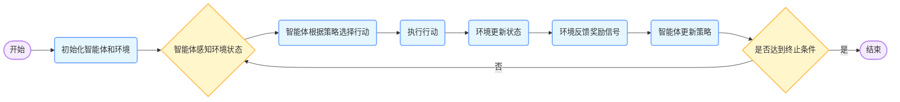

# AI Agent的多Agent博弈：策略学习与优化

> 关键词：AI Agent、多Agent博弈、策略学习、策略优化、强化学习

> 摘要：本文聚焦于AI Agent的多Agent博弈领域，深入探讨了策略学习与优化的相关问题。首先介绍了多Agent博弈的背景知识，包括目的、预期读者、文档结构和术语表。接着阐述了核心概念及其联系，通过文本示意图和Mermaid流程图展示了多Agent博弈的原理和架构。详细讲解了核心算法原理，并用Python源代码进行说明。同时给出了相关的数学模型和公式，并举例说明。通过项目实战，展示了代码的实际案例并进行详细解释。分析了多Agent博弈的实际应用场景，推荐了相关的学习资源、开发工具框架和论文著作。最后总结了未来发展趋势与挑战，还提供了常见问题与解答以及扩展阅读和参考资料，旨在为读者全面深入地了解AI Agent的多Agent博弈提供有价值的参考。

## 1. 背景介绍 
### 1.1 目的和范围
多Agent博弈在人工智能领域具有重要的研究价值和广泛的应用前景。其目的在于研究多个智能体在相互竞争或合作的环境中如何制定有效的策略，以实现自身利益的最大化或共同目标的达成。本文章的范围涵盖了多Agent博弈的基本概念、核心算法、数学模型、项目实战以及实际应用场景等方面，旨在为读者提供一个全面深入的关于AI Agent的多Agent博弈中策略学习与优化的知识体系。

### 1.2 预期读者
本文预期读者包括对人工智能、机器学习、博弈论等领域感兴趣的科研人员、学生，以及从事相关技术开发的程序员和软件工程师。对于希望深入了解多Agent系统中智能体策略学习与优化的专业人士，本文将提供有价值的技术参考和实践指导。

### 1.3 文档结构概述
本文将按照以下结构展开：首先介绍多Agent博弈的背景知识，包括术语表等内容；接着阐述核心概念及其联系，通过文本示意图和Mermaid流程图进行直观展示；然后详细讲解核心算法原理，并用Python代码实现；给出相关的数学模型和公式，并举例说明；通过项目实战，展示代码的实际案例并进行详细解释；分析多Agent博弈的实际应用场景；推荐相关的学习资源、开发工具框架和论文著作；最后总结未来发展趋势与挑战，提供常见问题与解答以及扩展阅读和参考资料。

### 1.4 术语表
#### 1.4.1 核心术语定义
- **AI Agent（人工智能智能体）**：能够感知环境，并根据感知到的信息做出决策和行动的智能实体。
- **多Agent博弈**：多个AI Agent在一定的规则和环境下进行交互，通过竞争或合作来实现各自的目标。
- **策略学习**：智能体通过学习来确定在不同状态下采取何种行动的过程。
- **策略优化**：对已有的策略进行改进，以提高智能体在博弈中的表现。
- **强化学习**：智能体通过与环境进行交互，根据环境反馈的奖励信号来学习最优策略的一种机器学习方法。

#### 1.4.2 相关概念解释
- **博弈环境**：多Agent博弈发生的场景，包括规则、状态空间、动作空间等要素。
- **奖励函数**：用于衡量智能体在某个状态下采取某个行动的好坏程度，是强化学习中智能体学习的重要依据。
- **纳什均衡**：在多Agent博弈中，一种策略组合，使得每个智能体在其他智能体策略不变的情况下，无法通过改变自己的策略来获得更高的收益。

#### 1.4.3 缩略词列表
- **RL（Reinforcement Learning）**：强化学习
- **Q - learning**：一种基于值函数的强化学习算法
- **MDP（Markov Decision Process）**：马尔可夫决策过程

## 2. 核心概念与联系 

### 核心概念原理
在多Agent博弈中，每个AI Agent都有自己的目标和决策过程。智能体通过感知环境状态，根据自身的策略选择合适的行动，行动会对环境产生影响，环境会反馈给智能体相应的奖励信号。智能体根据奖励信号来调整自己的策略，以实现长期利益的最大化。

多Agent博弈的核心在于智能体之间的交互。这种交互可以是竞争的，例如在零和博弈中，一个智能体的收益就是另一个智能体的损失；也可以是合作的，多个智能体共同协作以实现一个共同的目标。

### 架构的文本示意图
多Agent博弈系统主要由多个智能体、博弈环境和通信模块组成。智能体通过感知模块获取环境信息，决策模块根据策略选择行动，执行模块将行动作用于环境。环境根据智能体的行动更新状态，并通过奖励模块给智能体反馈奖励信号。通信模块用于智能体之间的信息交流，在合作博弈中起着关键作用。

### Mermaid流程图


## 3. 核心算法原理 & 具体操作步骤 

### 核心算法原理
在多Agent博弈中，强化学习是一种常用的策略学习方法。以Q - learning算法为例，Q - learning是一种无模型的强化学习算法，它通过学习状态 - 动作对的价值（Q值）来确定最优策略。

Q - learning的核心思想是通过不断地尝试不同的状态 - 动作对，根据环境反馈的奖励来更新Q值。Q值表示在某个状态下采取某个动作后，智能体在未来能够获得的累积奖励的期望。

### 具体操作步骤
1. **初始化**：初始化Q表，将所有状态 - 动作对的Q值初始化为0。设置学习率 $\alpha$、折扣因子 $\gamma$ 和探索率 $\epsilon$。
2. **选择动作**：在每个时间步，智能体根据当前状态 $s$ 选择一个动作 $a$。可以采用 $\epsilon$ - 贪心策略，即以 $\epsilon$ 的概率随机选择一个动作，以 $1 - \epsilon$ 的概率选择Q值最大的动作。
3. **执行动作并获取奖励**：智能体执行选择的动作 $a$，环境更新状态为 $s'$，并反馈奖励 $r$。
4. **更新Q值**：根据以下公式更新Q表中 $(s, a)$ 的Q值：
   $Q(s, a) = Q(s, a) + \alpha [r + \gamma \max_{a'} Q(s', a') - Q(s, a)]$
5. **重复步骤2 - 4**：直到达到终止条件，如达到最大时间步数或智能体达到目标状态。

### Python源代码实现
```python
import numpy as np

class QLearningAgent:
    def __init__(self, state_size, action_size, learning_rate=0.1, discount_factor=0.9, exploration_rate=0.1):
        self.state_size = state_size
        self.action_size = action_size
        self.learning_rate = learning_rate
        self.discount_factor = discount_factor
        self.exploration_rate = exploration_rate
        self.q_table = np.zeros((state_size, action_size))

    def choose_action(self, state):
        if np.random.uniform(0, 1) < self.exploration_rate:
            # 随机选择动作
            action = np.random.choice(self.action_size)
        else:
            # 选择Q值最大的动作
            action = np.argmax(self.q_table[state, :])
        return action

    def update_q_table(self, state, action, reward, next_state):
        max_q_next = np.max(self.q_table[next_state, :])
        self.q_table[state, action] = self.q_table[state, action] + self.learning_rate * (
                reward + self.discount_factor * max_q_next - self.q_table[state, action])
```

## 4. 数学模型和公式 & 详细讲解 & 举例说明 

### 数学模型：马尔可夫决策过程（MDP）
多Agent博弈可以用马尔可夫决策过程（MDP）来建模。一个MDP可以用一个五元组 $\langle S, A, P, R, \gamma \rangle$ 表示，其中：
- $S$ 是状态空间，包含所有可能的环境状态。
- $A$ 是动作空间，包含智能体可以采取的所有动作。
- $P(s'|s, a)$ 是状态转移概率，表示在状态 $s$ 下采取动作 $a$ 后转移到状态 $s'$ 的概率。
- $R(s, a)$ 是奖励函数，表示在状态 $s$ 下采取动作 $a$ 后获得的即时奖励。
- $\gamma$ 是折扣因子，取值范围为 $[0, 1]$，用于衡量未来奖励的重要性。

### Q - learning公式详细讲解
Q - learning的更新公式为：
$$Q(s, a) = Q(s, a) + \alpha [r + \gamma \max_{a'} Q(s', a') - Q(s, a)]$$
其中：
- $Q(s, a)$ 是当前状态 $s$ 下采取动作 $a$ 的Q值。
- $\alpha$ 是学习率，控制每次更新的步长。
- $r$ 是执行动作 $a$ 后获得的即时奖励。
- $\gamma$ 是折扣因子，用于衡量未来奖励的重要性。
- $\max_{a'} Q(s', a')$ 是下一个状态 $s'$ 下所有动作的最大Q值。

### 举例说明
假设一个简单的多Agent博弈环境，状态空间 $S = \{s_1, s_2\}$，动作空间 $A = \{a_1, a_2\}$。初始时，Q表如下：
| 状态 | $a_1$ | $a_2$ |
| ---- | ---- | ---- |
| $s_1$ | 0 | 0 |
| $s_2$ | 0 | 0 |

当前状态 $s = s_1$，智能体选择动作 $a = a_1$，执行动作后环境转移到状态 $s' = s_2$，并反馈奖励 $r = 1$。学习率 $\alpha = 0.1$，折扣因子 $\gamma = 0.9$。

在状态 $s_2$ 下，$\max_{a'} Q(s', a') = 0$（因为Q表初始值都为0）。

根据Q - learning更新公式：
$$Q(s_1, a_1) = Q(s_1, a_1) + \alpha [r + \gamma \max_{a'} Q(s_2, a') - Q(s_1, a_1)]$$
$$= 0 + 0.1\times(1 + 0.9\times0 - 0)$$
$$= 0.1$$

更新后的Q表如下：
| 状态 | $a_1$ | $a_2$ |
| ---- | ---- | ---- |
| $s_1$ | 0.1 | 0 |
| $s_2$ | 0 | 0 |

## 5. 项目实战：代码实际案例和详细解释说明 

### 5.1  开发环境搭建
- **操作系统**：可以选择Windows、Linux或macOS。
- **编程语言**：Python 3.x
- **依赖库**：`numpy`、`matplotlib`（用于可视化）

安装依赖库可以使用以下命令：
```sh
pip install numpy matplotlib
```

### 5.2  源代码详细实现和代码解读
以下是一个简单的多Agent博弈的项目实战代码，模拟两个智能体在一个网格环境中竞争的场景。

```python
import numpy as np
import matplotlib.pyplot as plt

# 网格环境类
class GridEnvironment:
    def __init__(self, grid_size):
        self.grid_size = grid_size
        self.state_space = grid_size * grid_size
        self.action_space = 4  # 上、下、左、右
        self.agent1_pos = (0, 0)
        self.agent2_pos = (grid_size - 1, grid_size - 1)
        self.goal_pos = (grid_size - 1, grid_size - 1)

    def reset(self):
        self.agent1_pos = (0, 0)
        self.agent2_pos = (self.grid_size - 1, self.grid_size - 1)
        state1 = self.agent1_pos[0] * self.grid_size + self.agent1_pos[1]
        state2 = self.agent2_pos[0] * self.grid_size + self.agent2_pos[1]
        return state1, state2

    def step(self, action1, action2):
        # 移动智能体1
        new_pos1 = self._move(self.agent1_pos, action1)
        if self._is_valid(new_pos1) and new_pos1 != self.agent2_pos:
            self.agent1_pos = new_pos1
        # 移动智能体2
        new_pos2 = self._move(self.agent2_pos, action2)
        if self._is_valid(new_pos2) and new_pos2 != self.agent1_pos:
            self.agent2_pos = new_pos2

        # 计算奖励
        reward1 = -1
        reward2 = -1
        done1 = False
        done2 = False
        if self.agent1_pos == self.goal_pos:
            reward1 = 100
            done1 = True
        if self.agent2_pos == self.goal_pos:
            reward2 = 100
            done2 = True

        state1 = self.agent1_pos[0] * self.grid_size + self.agent1_pos[1]
        state2 = self.agent2_pos[0] * self.grid_size + self.agent2_pos[1]
        return state1, reward1, done1, state2, reward2, done2

    def _move(self, pos, action):
        x, y = pos
        if action == 0:  # 上
            x -= 1
        elif action == 1:  # 下
            x += 1
        elif action == 2:  # 左
            y -= 1
        elif action == 3:  # 右
            y += 1
        return x, y

    def _is_valid(self, pos):
        x, y = pos
        return 0 <= x < self.grid_size and 0 <= y < self.grid_size

# Q - learning智能体类
class QLearningAgent:
    def __init__(self, state_size, action_size, learning_rate=0.1, discount_factor=0.9, exploration_rate=0.1):
        self.state_size = state_size
        self.action_size = action_size
        self.learning_rate = learning_rate
        self.discount_factor = discount_factor
        self.exploration_rate = exploration_rate
        self.q_table = np.zeros((state_size, action_size))

    def choose_action(self, state):
        if np.random.uniform(0, 1) < self.exploration_rate:
            action = np.random.choice(self.action_size)
        else:
            action = np.argmax(self.q_table[state, :])
        return action

    def update_q_table(self, state, action, reward, next_state):
        max_q_next = np.max(self.q_table[next_state, :])
        self.q_table[state, action] = self.q_table[state, action] + self.learning_rate * (
                reward + self.discount_factor * max_q_next - self.q_table[state, action])

# 主函数
def main():
    grid_size = 5
    env = GridEnvironment(grid_size)
    state_size = env.state_space
    action_size = env.action_space

    agent1 = QLearningAgent(state_size, action_size)
    agent2 = QLearningAgent(state_size, action_size)

    num_episodes = 1000
    rewards1 = []
    rewards2 = []

    for episode in range(num_episodes):
        state1, state2 = env.reset()
        total_reward1 = 0
        total_reward2 = 0
        done1 = False
        done2 = False

        while not done1 and not done2:
            action1 = agent1.choose_action(state1)
            action2 = agent2.choose_action(state2)

            next_state1, reward1, done1, next_state2, reward2, done2 = env.step(action1, action2)

            agent1.update_q_table(state1, action1, reward1, next_state1)
            agent2.update_q_table(state2, action2, reward2, next_state2)

            state1 = next_state1
            state2 = next_state2

            total_reward1 += reward1
            total_reward2 += reward2

        rewards1.append(total_reward1)
        rewards2.append(total_reward2)

        if episode % 100 == 0:
            print(f"Episode {episode}: Agent1 Reward = {total_reward1}, Agent2 Reward = {total_reward2}")

    # 绘制奖励曲线
    plt.plot(rewards1, label='Agent 1')
    plt.plot(rewards2, label='Agent 2')
    plt.xlabel('Episode')
    plt.ylabel('Total Reward')
    plt.title('Multi - Agent Q - learning Training')
    plt.legend()
    plt.show()

if __name__ == "__main__":
    main()
```

### 5.3  代码解读与分析
- **GridEnvironment类**：定义了一个网格环境，包含两个智能体和一个目标位置。`reset` 方法用于重置环境状态，`step` 方法用于执行智能体的动作并更新环境状态，同时计算奖励和判断是否终止。
- **QLearningAgent类**：实现了Q - learning智能体，包含选择动作和更新Q表的方法。
- **main函数**：主函数中创建了环境和两个智能体，进行多轮训练。在每一轮训练中，智能体选择动作，执行动作，更新Q表，直到达到终止条件。最后绘制两个智能体的奖励曲线，用于观察训练效果。

通过观察奖励曲线，可以分析智能体的学习过程。如果奖励曲线逐渐上升，说明智能体在不断学习和优化策略，能够更好地完成任务。

## 6. 实际应用场景 
### 游戏领域
在电子游戏中，多Agent博弈的策略学习与优化有广泛的应用。例如，在即时战略游戏中，多个玩家控制的角色可以看作是多个智能体，它们需要在游戏环境中竞争资源、争夺地盘。通过策略学习和优化，智能体可以学习到最佳的资源采集、部队部署和攻击策略，提高游戏的竞技性和趣味性。

### 交通领域
在交通系统中，多Agent博弈可以用于优化交通流量。例如，自动驾驶车辆可以看作是智能体，它们需要在道路上行驶并与其他车辆进行交互。通过策略学习和优化，自动驾驶车辆可以学习到最佳的行驶速度、车道选择和避障策略，提高交通效率和安全性。

### 经济领域
在经济领域，多Agent博弈可以用于模拟市场竞争。企业可以看作是智能体，它们需要在市场中竞争客户、资源和利润。通过策略学习和优化，企业可以学习到最佳的定价策略、产品研发策略和市场推广策略，提高市场竞争力。

### 机器人协作领域
在机器人协作任务中，多个机器人可以看作是智能体，它们需要共同协作完成任务。例如，在仓库物流中，多个机器人需要协作完成货物的搬运和存储任务。通过策略学习和优化，机器人可以学习到最佳的协作策略，提高任务执行效率。

## 7. 工具和资源推荐
### 7.1 学习资源推荐
#### 7.1.1 书籍推荐
- 《强化学习：原理与Python实现》：详细介绍了强化学习的基本原理和算法，并用Python代码进行了实现，适合初学者入门。
- 《多智能体系统：算法、博弈论及应用》：全面介绍了多智能体系统的相关知识，包括博弈论、策略学习和优化等内容，适合有一定基础的读者深入学习。

#### 7.1.2 在线课程
- Coursera上的“Reinforcement Learning Specialization”：由知名高校的教授授课，系统地介绍了强化学习的理论和实践。
- edX上的“Multi - Agent Systems”：深入讲解了多智能体系统的相关知识，包括多Agent博弈、策略学习和优化等内容。

#### 7.1.3 技术博客和网站
- OpenAI Blog：OpenAI发布的关于人工智能、强化学习等领域的最新研究成果和技术文章。
- Towards Data Science：一个数据科学和机器学习领域的技术博客，有很多关于多Agent博弈和强化学习的优质文章。

### 7.2 开发工具框架推荐
#### 7.2.1 IDE和编辑器
- PyCharm：一款功能强大的Python集成开发环境，提供了代码编辑、调试、版本控制等功能，适合Python开发。
- Visual Studio Code：一款轻量级的代码编辑器，支持多种编程语言，有丰富的插件可以扩展功能。

#### 7.2.2 调试和性能分析工具
- PySnooper：一个简单易用的Python调试工具，可以自动记录函数的执行过程和变量的值。
- cProfile：Python自带的性能分析工具，可以分析代码的运行时间和函数调用次数，帮助优化代码性能。

#### 7.2.3 相关框架和库
- OpenAI Gym：一个用于开发和比较强化学习算法的工具包，提供了多种环境和接口，方便进行强化学习实验。
- Stable Baselines3：一个基于PyTorch的强化学习库，提供了多种预训练的强化学习算法，方便快速实现和测试。

### 7.3 相关论文著作推荐
#### 7.3.1 经典论文
- “Q - learning”：Watkins和Dayan提出的Q - learning算法的经典论文，详细介绍了Q - learning的原理和实现。
- “Markov Games as a Framework for Multi - Agent Reinforcement Learning”：Littman提出的将马尔可夫博弈作为多智能体强化学习框架的经典论文，为多Agent博弈的研究奠定了基础。

#### 7.3.2 最新研究成果
- 关注NeurIPS、ICML、AAAI等顶级人工智能会议的论文，了解多Agent博弈和强化学习领域的最新研究进展。

#### 7.3.3 应用案例分析
- 可以参考一些实际应用案例的研究论文，例如在游戏、交通、经济等领域的多Agent博弈应用案例，学习如何将理论应用到实际场景中。

## 8. 总结：未来发展趋势与挑战
### 未来发展趋势
- **深度强化学习的融合**：将深度神经网络与强化学习相结合，提高智能体在复杂环境中的策略学习和优化能力。例如，深度Q网络（DQN）在Atari游戏中的成功应用，展示了深度强化学习的强大潜力。
- **多智能体协作的优化**：研究更加高效的多智能体协作策略，提高多个智能体之间的协同能力，实现更复杂的任务。例如，在机器人协作和自动驾驶领域，多智能体协作的优化将具有重要的应用价值。
- **可解释性和安全性**：随着多Agent博弈在实际应用中的广泛使用，智能体的可解释性和安全性将成为重要的研究方向。需要开发能够解释智能体决策过程的方法，以及确保智能体在各种情况下都能安全运行的技术。

### 挑战
- **计算复杂度**：多Agent博弈中，随着智能体数量和环境复杂度的增加，计算复杂度会急剧上升。如何有效地降低计算复杂度，提高算法的效率，是一个亟待解决的问题。
- **策略的收敛性**：在多智能体环境中，由于智能体之间的相互影响，策略的收敛性变得更加复杂。如何保证智能体的策略能够收敛到最优解，是多Agent博弈研究中的一个挑战。
- **环境的不确定性**：实际应用中的环境往往具有不确定性，例如交通环境中的路况变化、经济环境中的市场波动等。如何让智能体在不确定的环境中学习和优化策略，是一个具有挑战性的问题。

## 9. 附录：常见问题与解答
### Q1：多Agent博弈和单Agent强化学习有什么区别？
A1：单Agent强化学习只考虑一个智能体在环境中的学习和决策过程，而多Agent博弈需要考虑多个智能体之间的交互和竞争或合作关系。在多Agent博弈中，一个智能体的决策会受到其他智能体决策的影响，因此问题更加复杂。

### Q2：Q - learning算法在多Agent博弈中存在哪些局限性？
A2：Q - learning算法在多Agent博弈中存在一些局限性。例如，Q - learning假设环境是静态的，而在多Agent博弈中，环境会随着其他智能体的行动而变化。此外，Q - learning在处理高维状态空间和动作空间时效率较低，可能会导致收敛速度慢或无法收敛。

### Q3：如何选择合适的学习率和折扣因子？
A3：学习率和折扣因子的选择会影响智能体的学习效果。一般来说，学习率不宜过大，否则可能会导致算法无法收敛；也不宜过小，否则学习速度会很慢。折扣因子的取值范围通常在 $[0, 1]$ 之间，取值越接近1，表示智能体越重视未来的奖励。可以通过实验和调参来选择合适的学习率和折扣因子。

## 10. 扩展阅读 & 参考资料
- Sutton, R. S., & Barto, A. G. (2018). Reinforcement Learning: An Introduction. MIT press.
- Shoham, Y., & Leyton - Brown, K. (2008). Multiagent Systems: Algorithmic, Game - Theoretic, and Logical Foundations. Cambridge University Press.
- Watkins, C. J., & Dayan, P. (1992). Q - learning. Machine learning, 8(3 - 4), 279 - 292.
- Littman, M. L. (1994). Markov games as a framework for multi - agent reinforcement learning. In Proceedings of the eleventh international conference on machine learning (pp. 157 - 163).

作者：AI天才研究院/AI Genius Institute & 禅与计算机程序设计艺术 /Zen And The Art of Computer Programming