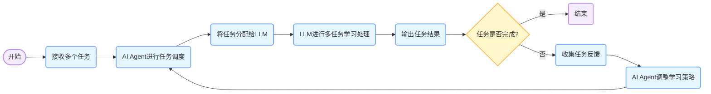

# AI Agent的多任务学习：增强LLM的泛化能力

> 关键词：AI Agent、多任务学习、大语言模型（LLM）、泛化能力、任务调度、知识迁移

> 摘要：本文深入探讨了AI Agent的多任务学习在增强大语言模型（LLM）泛化能力方面的应用。首先介绍了相关背景知识，包括目的、预期读者、文档结构和术语表。接着阐述了核心概念与联系，通过文本示意图和Mermaid流程图清晰展示其原理和架构。详细讲解了核心算法原理，使用Python代码进行说明，并给出了数学模型和公式。通过项目实战，展示了代码的实际案例和详细解释。分析了实际应用场景，推荐了学习、开发工具和相关论文著作。最后总结了未来发展趋势与挑战，并提供了常见问题解答和扩展阅读参考资料，旨在为读者全面呈现AI Agent多任务学习提升LLM泛化能力的技术全貌。

## 1. 背景介绍 
### 1.1 目的和范围
随着人工智能技术的飞速发展，大语言模型（LLM）在自然语言处理等多个领域取得了显著成果。然而，LLM在单一任务上表现出色，但在处理多样化任务时，其泛化能力有待提高。AI Agent的多任务学习为解决这一问题提供了新的思路。本文的目的是深入研究AI Agent如何通过多任务学习来增强LLM的泛化能力，探讨其核心原理、算法实现、实际应用场景等方面。范围涵盖从理论概念到实际代码实现，以及相关工具和资源的推荐。

### 1.2 预期读者
本文预期读者包括人工智能领域的研究人员、开发者、数据科学家，以及对AI Agent和大语言模型感兴趣的技术爱好者。对于有一定编程基础和机器学习知识的读者，能更深入理解文中的算法原理和代码实现；而对于初学者，也能通过本文对AI Agent的多任务学习有一个全面的认识。

### 1.3 文档结构概述
本文将按照以下结构进行阐述：首先介绍核心概念与联系，包括AI Agent、多任务学习和LLM泛化能力的定义和相互关系；接着详细讲解核心算法原理和具体操作步骤，使用Python代码进行说明；然后给出数学模型和公式，并通过举例进行详细讲解；通过项目实战展示代码的实际应用和详细解释；分析实际应用场景；推荐相关的学习、开发工具和论文著作；最后总结未来发展趋势与挑战，提供常见问题解答和扩展阅读参考资料。

### 1.4 术语表
#### 1.4.1 核心术语定义
- **AI Agent**：是一种能够感知环境、进行决策并采取行动以实现特定目标的智能实体。在本文中，AI Agent负责协调和执行多个任务，以提升LLM的泛化能力。
- **多任务学习**：指的是让模型同时学习多个相关任务，通过共享特征和知识，提高模型在各个任务上的性能和泛化能力。
- **大语言模型（LLM）**：是一种基于深度学习的自然语言处理模型，具有大规模的参数和强大的语言理解与生成能力，如GPT系列、BERT等。
- **泛化能力**：模型在未见过的数据上的表现能力，即模型能够将所学知识应用到新的任务和场景中的能力。

#### 1.4.2 相关概念解释
- **任务调度**：在多任务学习中，任务调度是指根据任务的优先级、资源需求等因素，合理安排任务的执行顺序和时间。
- **知识迁移**：指的是将在一个任务中学习到的知识应用到其他相关任务中的过程，是多任务学习提高模型泛化能力的重要机制。

#### 1.4.3 缩略词列表
- **LLM**：Large Language Model（大语言模型）
- **AI**：Artificial Intelligence（人工智能）

## 2. 核心概念与联系 

### 核心概念原理
AI Agent的多任务学习旨在让AI Agent协调LLM同时处理多个不同的任务，通过在多个任务之间共享知识和特征，提高LLM的泛化能力。具体来说，AI Agent负责接收多个任务的输入，将其分配给LLM进行处理，并根据任务的反馈调整学习策略。在多任务学习过程中，LLM会学习到不同任务之间的共性和差异，从而能够更好地适应新的任务和场景。

### 架构的文本示意图
```plaintext
+---------------------+
|     AI Agent        |
|  (任务调度与协调)   |
+---------------------+
         |
         | 任务分配
         v
+---------------------+
|      LLM            |
| (多任务学习处理)    |
+---------------------+
         |
         | 任务输出
         v
+---------------------+
|    任务反馈          |
| (用于调整学习策略)   |
+---------------------+
```

### Mermaid流程图


## 3. 核心算法原理 & 具体操作步骤 

### 核心算法原理
AI Agent的多任务学习主要基于梯度共享和任务加权的思想。在训练过程中，LLM同时接收多个任务的输入，并计算每个任务的损失函数。然后，将这些损失函数进行加权求和，得到总的损失函数。通过反向传播算法，更新LLM的参数，使得总的损失函数最小化。

### 具体操作步骤
1. **任务定义**：明确需要处理的多个任务，例如文本分类、情感分析、问答系统等。
2. **数据准备**：为每个任务收集和整理相应的数据集，并进行预处理，如分词、标注等。
3. **模型初始化**：初始化LLM的参数，可以使用预训练的模型权重。
4. **任务调度**：AI Agent根据任务的优先级和资源需求，合理安排任务的执行顺序和时间。
5. **多任务学习训练**：在每个训练步骤中，LLM同时处理多个任务，计算每个任务的损失函数，并进行加权求和。然后，使用反向传播算法更新模型参数。
6. **模型评估**：在训练过程中，定期评估模型在各个任务上的性能，根据评估结果调整学习策略。
7. **模型部署**：当模型训练完成后，将其部署到实际应用中，处理新的任务。

### Python源代码实现
```python
import torch
import torch.nn as nn
import torch.optim as optim

# 定义LLM模型
class LLM(nn.Module):
    def __init__(self, input_size, hidden_size, output_size):
        super(LLM, self).__init__()
        self.fc1 = nn.Linear(input_size, hidden_size)
        self.relu = nn.ReLU()
        self.fc2 = nn.Linear(hidden_size, output_size)

    def forward(self, x):
        out = self.fc1(x)
        out = self.relu(out)
        out = self.fc2(out)
        return out

# 定义任务损失函数
def task_loss(output, target):
    criterion = nn.CrossEntropyLoss()
    loss = criterion(output, target)
    return loss

# 多任务学习训练函数
def multi_task_learning(model, tasks, optimizer, num_epochs):
    for epoch in range(num_epochs):
        total_loss = 0
        for task in tasks:
            inputs, targets = task
            outputs = model(inputs)
            loss = task_loss(outputs, targets)
            total_loss += loss

        optimizer.zero_grad()
        total_loss.backward()
        optimizer.step()

        if (epoch + 1) % 10 == 0:
            print(f'Epoch [{epoch+1}/{num_epochs}], Loss: {total_loss.item():.4f}')

# 示例数据
input_size = 10
hidden_size = 20
output_size = 5
model = LLM(input_size, hidden_size, output_size)
optimizer = optim.Adam(model.parameters(), lr=0.001)

# 模拟多个任务
task1_inputs = torch.randn(100, input_size)
task1_targets = torch.randint(0, output_size, (100,))
task2_inputs = torch.randn(100, input_size)
task2_targets = torch.randint(0, output_size, (100,))
tasks = [(task1_inputs, task1_targets), (task2_inputs, task2_targets)]

# 训练模型
num_epochs = 100
multi_task_learning(model, tasks, optimizer, num_epochs)
```

## 4. 数学模型和公式 & 详细讲解 & 举例说明 

### 数学模型和公式
假设我们有 $M$ 个任务，每个任务的损失函数为 $L_m(x_m, y_m; \theta)$，其中 $x_m$ 是第 $m$ 个任务的输入，$y_m$ 是第 $m$ 个任务的目标输出，$\theta$ 是LLM的参数。总的损失函数 $L(\theta)$ 可以表示为：

$$
L(\theta) = \sum_{m=1}^{M} \alpha_m L_m(x_m, y_m; \theta)
$$

其中 $\alpha_m$ 是第 $m$ 个任务的权重，用于平衡不同任务的重要性。

在训练过程中，我们使用梯度下降算法来更新模型参数 $\theta$：

$$
\theta_{t+1} = \theta_t - \eta \nabla L(\theta_t)
$$

其中 $\eta$ 是学习率，$\nabla L(\theta_t)$ 是总损失函数 $L(\theta)$ 在 $\theta_t$ 处的梯度。

### 详细讲解
总损失函数 $L(\theta)$ 是各个任务损失函数的加权和，通过调整任务权重 $\alpha_m$，可以控制每个任务对模型训练的影响程度。在训练过程中，我们希望通过最小化总损失函数来优化模型参数，使得模型在各个任务上都能取得较好的性能。

梯度下降算法是一种常用的优化算法，通过不断地沿着梯度的反方向更新模型参数，逐步减小损失函数的值。学习率 $\eta$ 控制了每次更新的步长，过大的学习率可能导致模型无法收敛，而过小的学习率会使训练过程变得缓慢。

### 举例说明
假设我们有两个任务：文本分类和情感分析。文本分类任务的损失函数为 $L_1(x_1, y_1; \theta)$，情感分析任务的损失函数为 $L_2(x_2, y_2; \theta)$。我们可以设置任务权重 $\alpha_1 = 0.6$，$\alpha_2 = 0.4$，表示文本分类任务的重要性略高于情感分析任务。

总损失函数为：

$$
L(\theta) = 0.6L_1(x_1, y_1; \theta) + 0.4L_2(x_2, y_2; \theta)
$$

在每个训练步骤中，我们计算总损失函数 $L(\theta)$ 关于模型参数 $\theta$ 的梯度 $\nabla L(\theta)$，然后使用梯度下降算法更新模型参数：

$$
\theta_{t+1} = \theta_t - \eta \nabla L(\theta_t)
$$

通过不断地迭代更新，模型的参数会逐渐优化，从而提高在文本分类和情感分析任务上的性能。

## 5. 项目实战：代码实际案例和详细解释说明 

### 5.1  开发环境搭建
#### 安装Python
首先，确保你已经安装了Python 3.6或更高版本。可以从Python官方网站（https://www.python.org/downloads/）下载并安装。

#### 安装依赖库
使用以下命令安装项目所需的依赖库：
```bash
pip install torch
```

### 5.2  源代码详细实现和代码解读
```python
import torch
import torch.nn as nn
import torch.optim as optim

# 定义LLM模型
class LLM(nn.Module):
    def __init__(self, input_size, hidden_size, output_size):
        super(LLM, self).__init__()
        self.fc1 = nn.Linear(input_size, hidden_size)
        self.relu = nn.ReLU()
        self.fc2 = nn.Linear(hidden_size, output_size)

    def forward(self, x):
        out = self.fc1(x)
        out = self.relu(out)
        out = self.fc2(out)
        return out

# 定义任务损失函数
def task_loss(output, target):
    criterion = nn.CrossEntropyLoss()
    loss = criterion(output, target)
    return loss

# 多任务学习训练函数
def multi_task_learning(model, tasks, optimizer, num_epochs):
    for epoch in range(num_epochs):
        total_loss = 0
        for task in tasks:
            inputs, targets = task
            outputs = model(inputs)
            loss = task_loss(outputs, targets)
            total_loss += loss

        optimizer.zero_grad()
        total_loss.backward()
        optimizer.step()

        if (epoch + 1) % 10 == 0:
            print(f'Epoch [{epoch+1}/{num_epochs}], Loss: {total_loss.item():.4f}')

# 示例数据
input_size = 10
hidden_size = 20
output_size = 5
model = LLM(input_size, hidden_size, output_size)
optimizer = optim.Adam(model.parameters(), lr=0.001)

# 模拟多个任务
task1_inputs = torch.randn(100, input_size)
task1_targets = torch.randint(0, output_size, (100,))
task2_inputs = torch.randn(100, input_size)
task2_targets = torch.randint(0, output_size, (100,))
tasks = [(task1_inputs, task1_targets), (task2_inputs, task2_targets)]

# 训练模型
num_epochs = 100
multi_task_learning(model, tasks, optimizer, num_epochs)
```

### 代码解读与分析
1. **LLM模型定义**：`LLM` 类继承自 `nn.Module`，定义了一个简单的两层全连接神经网络。`__init__` 方法初始化了两个全连接层和一个ReLU激活函数，`forward` 方法定义了前向传播过程。
2. **任务损失函数**：`task_loss` 函数使用交叉熵损失函数计算每个任务的损失。
3. **多任务学习训练函数**：`multi_task_learning` 函数实现了多任务学习的训练过程。在每个训练步骤中，遍历所有任务，计算每个任务的损失，并将其累加到总损失中。然后使用反向传播算法更新模型参数。
4. **示例数据**：生成了两个模拟任务的输入和目标输出，并将其存储在 `tasks` 列表中。
5. **模型训练**：调用 `multi_task_learning` 函数进行模型训练，训练过程中每10个epoch打印一次总损失。

## 6. 实际应用场景 
### 智能客服系统
在智能客服系统中，AI Agent可以协调LLM同时处理多个任务，如问题分类、意图识别、答案生成等。通过多任务学习，LLM可以学习到不同任务之间的关联，提高在各种客户问题上的泛化能力，从而更准确地理解客户需求并提供有效的解决方案。

### 智能写作助手
智能写作助手可以利用AI Agent的多任务学习，让LLM同时处理语法检查、词汇推荐、风格转换等任务。通过在多个任务上的学习，LLM能够更好地适应不同的写作场景和需求，提供更全面、准确的写作建议。

### 信息检索系统
在信息检索系统中，AI Agent可以让LLM同时进行文本理解、查询扩展、结果排序等任务。多任务学习可以增强LLM对不同类型查询的理解能力，提高信息检索的准确性和效率。

## 7. 工具和资源推荐
### 7.1 学习资源推荐
#### 7.1.1 书籍推荐
- 《深度学习》（Deep Learning）：由Ian Goodfellow、Yoshua Bengio和Aaron Courville撰写，是深度学习领域的经典教材，涵盖了深度学习的基本原理、算法和应用。
- 《Python深度学习》（Deep Learning with Python）：由Francois Chollet编写，通过Python代码详细介绍了深度学习的实践方法，适合初学者入门。
- 《自然语言处理入门》（Natural Language Processing in Action）：介绍了自然语言处理的基本概念、算法和应用，对理解大语言模型和多任务学习有很大帮助。

#### 7.1.2 在线课程
- Coursera上的“深度学习专项课程”（Deep Learning Specialization）：由Andrew Ng教授授课，全面介绍了深度学习的各个方面，包括神经网络、卷积神经网络、循环神经网络等。
- edX上的“自然语言处理基础”（Foundations of Natural Language Processing）：讲解了自然语言处理的基本理论和方法，适合对自然语言处理感兴趣的学习者。
- Kaggle上的“深度学习微课程”（Deep Learning Micro-Course）：通过实际案例和代码练习，帮助学习者快速掌握深度学习的实践技能。

#### 7.1.3 技术博客和网站
- Medium上的Towards Data Science：汇集了大量关于数据科学、机器学习和人工智能的优质文章，涵盖了最新的研究成果和实践经验。
- arXiv.org：是一个预印本平台，提供了大量关于人工智能、机器学习等领域的最新研究论文。
- Hugging Face Blog：专注于自然语言处理和大语言模型的技术博客，提供了很多关于模型训练、应用和调优的实用技巧。

### 7.2 开发工具框架推荐
#### 7.2.1 IDE和编辑器
- PyCharm：是一款功能强大的Python集成开发环境，提供了代码编辑、调试、版本控制等一系列功能，适合Python开发者使用。
- Jupyter Notebook：是一个交互式的开发环境，支持Python、R等多种编程语言，方便进行数据分析、模型训练和可视化。
- Visual Studio Code：是一款轻量级的代码编辑器，具有丰富的插件生态系统，支持多种编程语言，可用于Python代码的开发和调试。

#### 7.2.2 调试和性能分析工具
- TensorBoard：是TensorFlow提供的可视化工具，可用于监控模型训练过程中的损失函数、准确率等指标，以及可视化模型的结构和参数分布。
- PyTorch Profiler：是PyTorch提供的性能分析工具，可用于分析模型的计算性能、内存使用情况等，帮助开发者优化模型性能。
- cProfile：是Python标准库中的性能分析模块，可用于分析Python代码的执行时间和函数调用关系，找出性能瓶颈。

#### 7.2.3 相关框架和库
- PyTorch：是一个开源的深度学习框架，提供了丰富的神经网络层和优化算法，支持GPU加速，广泛应用于自然语言处理、计算机视觉等领域。
- Hugging Face Transformers：是一个基于PyTorch和TensorFlow的自然语言处理库，提供了大量预训练的大语言模型，如GPT、BERT等，方便开发者进行模型的微调与应用。
- scikit-learn：是一个用于机器学习的Python库，提供了多种机器学习算法和工具，如分类、回归、聚类等，可用于数据预处理和模型评估。

### 7.3 相关论文著作推荐
#### 7.3.1 经典论文
- "Attention Is All You Need"：提出了Transformer架构，是现代大语言模型的基础，具有重要的理论和实践意义。
- "BERT: Pre-training of Deep Bidirectional Transformers for Language Understanding"：介绍了BERT模型的预训练方法和应用，开创了基于预训练模型的自然语言处理新时代。
- "Multi-Task Learning"：系统地阐述了多任务学习的理论和方法，为多任务学习的研究和应用奠定了基础。

#### 7.3.2 最新研究成果
- 关注arXiv.org上关于AI Agent、多任务学习和大语言模型的最新论文，了解该领域的前沿研究动态。
- 参加顶级学术会议，如NeurIPS、ICML、ACL等，获取最新的研究成果和技术趋势。

#### 7.3.3 应用案例分析
- 分析各大科技公司在智能客服、智能写作、信息检索等领域的实际应用案例，了解AI Agent的多任务学习在实际场景中的应用效果和挑战。
- 参考开源项目和竞赛中的相关案例，学习他人的实践经验和解决方案。

## 8. 总结：未来发展趋势与挑战
### 未来发展趋势
- **更复杂的任务组合**：未来，AI Agent的多任务学习将处理更加复杂和多样化的任务组合，涵盖更多领域和场景，如跨模态任务（结合图像、文本、语音等）。
- **自适应任务调度**：AI Agent将具备更强的自适应能力，能够根据任务的实时需求和模型的状态，动态调整任务调度策略，提高学习效率和性能。
- **知识图谱融合**：将知识图谱与多任务学习相结合，使LLM能够更好地利用外部知识，增强对复杂语义的理解和推理能力。
- **强化学习的应用**：引入强化学习机制，让AI Agent在与环境的交互中不断优化学习策略，提高在动态环境中的泛化能力。

### 挑战
- **任务冲突与干扰**：在多任务学习中，不同任务之间可能存在冲突和干扰，导致模型在某些任务上的性能下降。如何有效地解决任务冲突，是一个亟待解决的问题。
- **计算资源需求**：多任务学习需要同时处理多个任务，对计算资源的需求较大。如何在有限的计算资源下实现高效的多任务学习，是一个挑战。
- **数据不平衡问题**：不同任务的数据量和分布可能存在差异，导致模型在某些任务上的学习效果不佳。如何处理数据不平衡问题，提高模型在各个任务上的性能，是一个关键问题。
- **可解释性和透明度**：随着模型的复杂度增加，其可解释性和透明度变得越来越重要。如何让用户理解AI Agent的决策过程和多任务学习的机制，是一个需要解决的挑战。

## 9. 附录：常见问题与解答
### 问题1：多任务学习一定会提高LLM的泛化能力吗？
答：不一定。多任务学习的效果取决于多个因素，如任务之间的相关性、任务权重的设置、数据的质量和分布等。如果任务之间相关性较低，或者任务权重设置不合理，可能会导致模型在某些任务上的性能下降，甚至影响泛化能力。因此，在进行多任务学习时，需要仔细选择任务和调整参数。

### 问题2：如何确定任务的权重？
答：确定任务权重的方法有多种。一种简单的方法是根据任务的重要性进行手动设置，例如对于关键任务赋予较高的权重。另一种方法是使用自适应权重调整算法，根据任务的训练进度和性能动态调整权重。此外，还可以通过实验和交叉验证的方法，尝试不同的权重组合，选择最优的权重设置。

### 问题3：多任务学习对数据有什么要求？
答：多任务学习对数据的要求包括数据的质量、数量和分布。数据质量要高，避免存在噪声和错误标注。每个任务的数据量要足够，以保证模型能够学习到足够的特征。同时，不同任务的数据分布要尽量一致，避免数据不平衡问题对模型性能产生影响。

### 问题4：如何评估多任务学习模型的性能？
答：可以使用多个指标来评估多任务学习模型的性能，如准确率、召回率、F1值等。对于每个任务，分别计算其相应的指标，然后综合考虑各个任务的指标来评估模型的整体性能。此外，还可以使用交叉验证的方法，在不同的数据集上进行评估，以提高评估结果的可靠性。

## 10. 扩展阅读 & 参考资料
### 扩展阅读
- 阅读相关的学术论文和研究报告，深入了解AI Agent、多任务学习和大语言模型的最新研究进展。
- 关注行业动态和技术博客，了解AI Agent的多任务学习在实际应用中的案例和经验分享。
- 参与相关的技术社区和论坛，与其他开发者和研究人员交流讨论，获取更多的灵感和思路。

### 参考资料
- Goodfellow, I., Bengio, Y., & Courville, A. (2016). Deep Learning. MIT Press.
- Chollet, F. (2017). Deep Learning with Python. Manning Publications.
- Rao, D., & McMahan, B. (2019). Natural Language Processing in Action. Manning Publications.
- Vaswani, A., Shazeer, N., Parmar, N., Uszkoreit, J., Jones, L., Gomez, A. N.,... & Polosukhin, I. (2017). Attention Is All You Need. Advances in Neural Information Processing Systems.
- Devlin, J., Chang, M. W., Lee, K., & Toutanova, K. (2018). BERT: Pre-training of Deep Bidirectional Transformers for Language Understanding. arXiv preprint arXiv:1810.04805.
- Caruana, R. (1997). Multi-Task Learning. Machine Learning, 28(1), 41-75.

作者：AI天才研究院/AI Genius Institute & 禅与计算机程序设计艺术 /Zen And The Art of Computer Programming