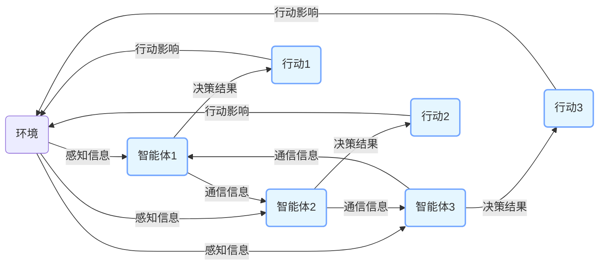

# AI Agent的多智能体协作决策系统

> 关键词：AI Agent、多智能体协作、决策系统、智能算法、分布式计算

> 摘要：本文聚焦于AI Agent的多智能体协作决策系统，深入探讨其核心概念、算法原理、数学模型以及实际应用场景。通过对多智能体协作决策系统的全面剖析，旨在帮助读者理解其工作机制和实现方法。首先介绍该系统的背景，包括目的、预期读者和文档结构等内容；接着阐述核心概念与联系，给出相关原理和架构的示意图与流程图；然后详细讲解核心算法原理，用Python代码进行说明；再介绍数学模型和公式并举例；通过项目实战展示代码案例和解读；分析实际应用场景；推荐相关学习资源、开发工具框架和论文著作；最后总结未来发展趋势与挑战，并提供常见问题解答和参考资料。

## 1. 背景介绍 
### 1.1 目的和范围
多智能体协作决策系统的目的在于利用多个AI Agent的协作能力，共同解决复杂的任务和问题。在现实世界中，许多任务具有高度的复杂性和不确定性，单个智能体往往难以独立完成。通过多智能体的协作，可以充分发挥各个智能体的优势，提高决策的效率和准确性。

本文档的范围涵盖了AI Agent的多智能体协作决策系统的基本概念、算法原理、数学模型、实际应用等方面。旨在为读者提供一个全面的了解，帮助读者掌握多智能体协作决策系统的设计和实现方法。

### 1.2 预期读者
本文预期读者包括计算机科学、人工智能、自动化等领域的研究人员、开发人员和学生。对于对多智能体系统感兴趣，希望深入了解其原理和应用的读者也具有参考价值。

### 1.3 文档结构概述
本文将按照以下结构进行组织：
1. 背景介绍：介绍多智能体协作决策系统的目的、预期读者和文档结构。
2. 核心概念与联系：阐述AI Agent、多智能体协作、决策系统等核心概念，并给出相关的原理和架构示意图与流程图。
3. 核心算法原理 & 具体操作步骤：详细讲解多智能体协作决策系统中常用的算法原理，并用Python代码进行说明。
4. 数学模型和公式 & 详细讲解 & 举例说明：介绍多智能体协作决策系统的数学模型和公式，并通过具体例子进行讲解。
5. 项目实战：代码实际案例和详细解释说明：通过一个实际项目，展示多智能体协作决策系统的代码实现和详细解读。
6. 实际应用场景：分析多智能体协作决策系统在不同领域的实际应用场景。
7. 工具和资源推荐：推荐相关的学习资源、开发工具框架和论文著作。
8. 总结：未来发展趋势与挑战：总结多智能体协作决策系统的未来发展趋势和面临的挑战。
9. 附录：常见问题与解答：提供常见问题的解答。
10. 扩展阅读 & 参考资料：提供扩展阅读和参考资料。

### 1.4 术语表
#### 1.4.1 核心术语定义
- **AI Agent**：具有感知、决策和行动能力的智能实体，可以自主地与环境进行交互。
- **多智能体系统（Multi - Agent System, MAS）**：由多个AI Agent组成的系统，这些智能体之间可以进行协作和通信，共同完成任务。
- **协作决策**：多个智能体通过协作的方式，共同做出决策，以实现系统的整体目标。
- **决策系统**：根据一定的规则和算法，对输入信息进行处理，产生决策结果的系统。

#### 1.4.2 相关概念解释
- **智能体的自主性**：智能体能够独立地感知环境、做出决策和采取行动，不受其他智能体的直接控制。
- **智能体的通信**：智能体之间通过一定的通信协议进行信息交换，以实现协作和协调。
- **智能体的目标**：每个智能体都有自己的目标，这些目标可以是个体目标，也可以是与其他智能体共同的目标。

#### 1.4.3 缩略词列表
- **MAS**：Multi - Agent System（多智能体系统）
- **AI**：Artificial Intelligence（人工智能）

## 2. 核心概念与联系 
### 核心概念原理
#### AI Agent
AI Agent是多智能体协作决策系统的基本组成单元。一个典型的AI Agent通常包含以下几个部分：
1. **感知模块**：用于感知环境中的信息，例如传感器数据、其他智能体的消息等。
2. **决策模块**：根据感知到的信息和自身的目标，做出决策。
3. **行动模块**：根据决策结果，采取相应的行动，例如执行任务、发送消息等。

#### 多智能体协作
多智能体协作是指多个AI Agent通过相互作用和协调，共同完成任务的过程。协作的方式可以分为以下几种：
1. **竞争协作**：智能体之间存在竞争关系，但为了实现共同的目标，需要进行一定的协作。
2. **合作协作**：智能体之间没有竞争关系，共同为了实现一个或多个目标而协作。
3. **协调协作**：智能体之间通过协调各自的行动，避免冲突，提高系统的效率。

#### 决策系统
决策系统是多智能体协作的核心部分，它根据智能体的感知信息和目标，生成决策结果。决策系统可以采用不同的算法和模型，例如博弈论、强化学习、神经网络等。

### 架构的文本示意图
一个简单的多智能体协作决策系统架构可以描述如下：

多个AI Agent分布在不同的位置，每个AI Agent都有自己的感知模块、决策模块和行动模块。智能体之间通过通信网络进行信息交换。决策系统可以是集中式的，也可以是分布式的。在集中式决策系统中，有一个中心控制器负责收集所有智能体的信息，并做出决策；在分布式决策系统中，每个智能体根据自己的信息和与其他智能体的通信，独立地做出决策。

### Mermaid 流程图

这个流程图展示了多智能体协作决策系统的基本工作流程。智能体从环境中感知信息，然后智能体之间进行通信，根据感知和通信信息做出决策，最后采取行动，行动的结果又会影响环境。

## 3. 核心算法原理 & 具体操作步骤 
### 强化学习算法原理
强化学习是多智能体协作决策系统中常用的算法之一。强化学习的基本思想是智能体通过与环境进行交互，不断尝试不同的行动，根据环境给予的奖励来学习最优的行动策略。

#### 马尔可夫决策过程（MDP）
强化学习通常基于马尔可夫决策过程（MDP）进行建模。一个MDP可以用一个五元组 $(S, A, P, R, \gamma)$ 来表示：
- $S$ 是状态空间，表示环境的所有可能状态。
- $A$ 是行动空间，表示智能体可以采取的所有行动。
- $P$ 是状态转移概率函数，表示在状态 $s$ 下采取行动 $a$ 后转移到状态 $s'$ 的概率，即 $P(s'|s, a)$。
- $R$ 是奖励函数，表示在状态 $s$ 下采取行动 $a$ 并转移到状态 $s'$ 后获得的奖励，即 $R(s, a, s')$。
- $\gamma$ 是折扣因子，用于权衡当前奖励和未来奖励，取值范围为 $[0, 1]$。

#### Q - learning 算法
Q - learning 是一种无模型的强化学习算法，用于学习最优的行动策略。Q - learning 的核心是 Q 函数，$Q(s, a)$ 表示在状态 $s$ 下采取行动 $a$ 的价值。Q - learning 算法的更新公式为：

$Q(s, a) \leftarrow Q(s, a) + \alpha [R(s, a, s') + \gamma \max_{a'} Q(s', a') - Q(s, a)]$

其中，$\alpha$ 是学习率，用于控制每次更新的步长。

### Python 代码实现
```python
import numpy as np

# 定义环境参数
states = 5
actions = 2
gamma = 0.9
alpha = 0.1

# 初始化 Q 表
Q = np.zeros((states, actions))

# 定义奖励函数
rewards = np.array([
    [1, 0],
    [0, 2],
    [3, 0],
    [0, 4],
    [5, 0]
])

# 定义状态转移函数（简单示例）
def transition(state, action):
    if action == 0:
        return (state + 1) % states
    else:
        return (state - 1) % states

# Q - learning 算法
num_episodes = 1000
for episode in range(num_episodes):
    state = np.random.randint(0, states)
    done = False
    while not done:
        # 选择行动（epsilon - greedy 策略）
        epsilon = 0.1
        if np.random.uniform(0, 1) < epsilon:
            action = np.random.randint(0, actions)
        else:
            action = np.argmax(Q[state, :])
        
        # 执行行动，获取下一个状态和奖励
        next_state = transition(state, action)
        reward = rewards[state, action]
        
        # 更新 Q 表
        Q[state, action] = Q[state, action] + alpha * (reward + gamma * np.max(Q[next_state, :]) - Q[state, action])
        
        state = next_state
        
        # 判断是否结束
        if state == 4:
            done = True

print("最终的 Q 表：")
print(Q)
```
### 具体操作步骤
1. **初始化**：初始化状态空间、行动空间、Q 表、奖励函数和状态转移函数。
2. **训练**：进行多个回合的训练，每个回合中智能体从随机状态开始，根据 epsilon - greedy 策略选择行动，执行行动后获取下一个状态和奖励，更新 Q 表，直到达到终止状态。
3. **测试**：训练完成后，使用训练好的 Q 表进行测试，智能体根据 Q 表选择最优行动。

## 4. 数学模型和公式 & 详细讲解 & 举例说明 
### 数学模型
#### 博弈论模型
在多智能体协作决策系统中，博弈论可以用于分析智能体之间的策略交互。一个简单的博弈可以用一个三元组 $(N, A, u)$ 来表示：
- $N$ 是智能体的集合，$N = \{1, 2, \cdots, n\}$。
- $A$ 是行动空间的集合，$A = A_1 \times A_2 \times \cdots \times A_n$，其中 $A_i$ 是智能体 $i$ 的行动空间。
- $u$ 是效用函数的集合，$u = (u_1, u_2, \cdots, u_n)$，其中 $u_i(a)$ 表示智能体 $i$ 在行动组合 $a \in A$ 下的效用。

#### 纳什均衡
纳什均衡是博弈论中的一个重要概念，它表示在一个博弈中，每个智能体都选择了最优的策略，使得其他智能体没有动机改变自己的策略。在一个博弈 $(N, A, u)$ 中，行动组合 $a^* \in A$ 是纳什均衡，如果对于任意的 $i \in N$ 和任意的 $a_i \in A_i$，都有：

$u_i(a^*) \geq u_i(a_i, a_{-i}^*)$

其中，$a_{-i}^*$ 表示除智能体 $i$ 之外的其他智能体的行动组合。

### 详细讲解
#### 博弈论模型的应用
博弈论模型可以用于分析多智能体协作中的竞争和合作关系。例如，在一个资源分配问题中，多个智能体竞争有限的资源，每个智能体的行动是选择一个资源分配方案，效用函数可以表示智能体获得的资源量。通过求解纳什均衡，可以找到一个稳定的资源分配方案。

#### 纳什均衡的求解
求解纳什均衡的方法有很多种，例如迭代法、线性规划法等。对于一些简单的博弈，可以通过枚举所有可能的行动组合，比较每个智能体的效用，找到纳什均衡。

### 举例说明
考虑一个简单的二人博弈，智能体 1 和智能体 2 都有两个行动选择：合作（C）和背叛（D）。效用矩阵如下：

|  | C | D |
|---|---|---|
| C | (3, 3) | (0, 5) |
| D | (5, 0) | (1, 1) |

其中，每个单元格中的第一个数字表示智能体 1 的效用，第二个数字表示智能体 2 的效用。

我们可以通过枚举所有可能的行动组合来求解纳什均衡：
- 如果智能体 1 选择 C，智能体 2 选择 C 的效用为 3，选择 D 的效用为 5，所以智能体 2 会选择 D。
- 如果智能体 1 选择 D，智能体 2 选择 C 的效用为 0，选择 D 的效用为 1，所以智能体 2 会选择 D。
- 同理，无论智能体 2 选择什么，智能体 1 都会选择 D。

因此，这个博弈的纳什均衡是 $(D, D)$，效用为 $(1, 1)$。

## 5. 项目实战：代码实际案例和详细解释说明 
### 5.1  开发环境搭建
#### 操作系统
本项目可以在 Windows、Linux 或 macOS 操作系统上进行开发。

#### 编程语言
使用 Python 作为开发语言，建议使用 Python 3.7 及以上版本。

#### 开发工具
可以使用 PyCharm、Jupyter Notebook 等开发工具。

#### 依赖库
本项目需要使用以下依赖库：
- `numpy`：用于数值计算。
- `matplotlib`：用于可视化。

可以使用以下命令安装依赖库：
```sh
pip install numpy matplotlib
```

### 5.2  源代码详细实现和代码解读
#### 项目背景
我们将实现一个简单的多智能体协作觅食问题。有多个智能体在一个二维网格环境中寻找食物，每个智能体可以感知周围的环境信息，并且可以与其他智能体进行通信。智能体的目标是尽可能快地找到所有的食物。

#### 代码实现
```python
import numpy as np
import matplotlib.pyplot as plt
import random

# 定义环境参数
grid_size = 10
num_agents = 3
num_foods = 5

# 初始化环境
grid = np.zeros((grid_size, grid_size))
agent_positions = []
food_positions = []

# 随机放置智能体
for _ in range(num_agents):
    x = random.randint(0, grid_size - 1)
    y = random.randint(0, grid_size - 1)
    agent_positions.append((x, y))
    grid[x, y] = 1

# 随机放置食物
for _ in range(num_foods):
    x = random.randint(0, grid_size - 1)
    y = random.randint(0, grid_size - 1)
    food_positions.append((x, y))
    grid[x, y] = 2

# 定义智能体类
class Agent:
    def __init__(self, position):
        self.position = position
        self.found_food = []
    
    def move(self, action):
        x, y = self.position
        if action == 0:  # 上
            x = max(0, x - 1)
        elif action == 1:  # 下
            x = min(grid_size - 1, x + 1)
        elif action == 2:  # 左
            y = max(0, y - 1)
        elif action == 3:  # 右
            y = min(grid_size - 1, y + 1)
        self.position = (x, y)
    
    def sense(self):
        x, y = self.position
        surroundings = []
        for dx in [-1, 0, 1]:
            for dy in [-1, 0, 1]:
                new_x = x + dx
                new_y = y + dy
                if 0 <= new_x < grid_size and 0 <= new_y < grid_size:
                    surroundings.append(grid[new_x, new_y])
                else:
                    surroundings.append(0)
        return surroundings
    
    def communicate(self, other_agents):
        all_found_food = []
        for agent in other_agents:
            all_found_food.extend(agent.found_food)
        return all_found_food
    
    def update_found_food(self):
        x, y = self.position