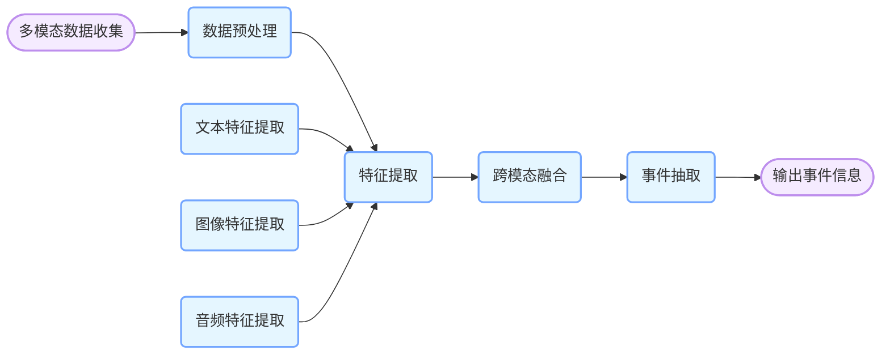

# AI Agent的多模态事件抽取技术

> 关键词：AI Agent、多模态事件抽取、自然语言处理、计算机视觉、跨模态融合

> 摘要：本文围绕AI Agent的多模态事件抽取技术展开深入探讨。首先介绍了该技术的背景，包括目的、预期读者、文档结构和相关术语。接着阐述了核心概念与联系，展示了其原理和架构，并通过Mermaid流程图进行可视化。详细讲解了核心算法原理，使用Python代码进行示例。给出了相关数学模型和公式，并举例说明。通过项目实战，从开发环境搭建到源代码实现与解读进行了全面介绍。探讨了该技术的实际应用场景，推荐了学习资源、开发工具框架和相关论文著作。最后总结了未来发展趋势与挑战，还提供了常见问题解答和扩展阅读参考资料，旨在为读者全面呈现AI Agent多模态事件抽取技术的全貌。

## 1. 背景介绍 
### 1.1 目的和范围
多模态数据在当今信息时代无处不在，包括文本、图像、视频、音频等多种形式。传统的事件抽取技术往往仅针对单一模态的数据进行处理，然而，现实世界中的事件通常以多模态的形式呈现，单一模态的信息可能不完整或存在偏差。AI Agent的多模态事件抽取技术旨在整合多种模态的数据，更全面、准确地抽取事件信息。

本技术的范围涵盖了从多模态数据的收集、预处理，到特征提取、跨模态融合，最终实现事件抽取的整个流程。涉及自然语言处理、计算机视觉、音频处理等多个领域的知识和技术。

### 1.2 预期读者
本文的预期读者包括从事自然语言处理、计算机视觉、人工智能等相关领域的研究人员和开发者，希望了解多模态数据处理和事件抽取技术的学生，以及对AI Agent在实际应用中如何处理多模态信息感兴趣的行业人士。

### 1.3 文档结构概述
本文将按照以下结构进行阐述：首先介绍核心概念与联系，包括多模态事件抽取的原理和架构，并通过流程图展示；接着详细讲解核心算法原理，使用Python代码进行示例；给出相关数学模型和公式，并举例说明；通过项目实战，介绍开发环境搭建、源代码实现与解读；探讨该技术的实际应用场景；推荐学习资源、开发工具框架和相关论文著作；最后总结未来发展趋势与挑战，提供常见问题解答和扩展阅读参考资料。

### 1.4 术语表
#### 1.4.1 核心术语定义
- **AI Agent**：人工智能代理，是一种能够感知环境、进行决策并采取行动以实现特定目标的智能实体。
- **多模态事件抽取**：从多种模态的数据（如文本、图像、音频等）中提取与事件相关的信息，包括事件的主体、客体、时间、地点等。
- **跨模态融合**：将不同模态的数据特征进行整合，以获得更全面、准确的信息表示。

#### 1.4.2 相关概念解释
- **自然语言处理（NLP）**：研究如何让计算机理解和处理人类语言的技术，在多模态事件抽取中用于处理文本数据。
- **计算机视觉（CV）**：研究如何让计算机理解和分析图像和视频的技术，在多模态事件抽取中用于处理视觉数据。
- **特征提取**：从原始数据中提取出具有代表性的特征，以便后续的处理和分析。

#### 1.4.3 缩略词列表
- **NLP**：Natural Language Processing
- **CV**：Computer Vision
- **CNN**：Convolutional Neural Network
- **RNN**：Recurrent Neural Network
- **LSTM**：Long Short-Term Memory

## 2. 核心概念与联系 
### 核心概念原理
AI Agent的多模态事件抽取技术主要基于跨模态融合的思想。不同模态的数据具有不同的特点和信息，例如文本数据能够提供详细的语义信息，图像数据能够直观地展示场景和物体。通过将不同模态的数据特征进行融合，可以充分利用各模态的优势，更准确地抽取事件信息。

其基本原理可以分为以下几个步骤：
1. **多模态数据收集**：收集来自不同来源的多模态数据，如新闻文章、社交媒体图片、监控视频等。
2. **数据预处理**：对收集到的数据进行清洗、标注等预处理操作，以便后续的特征提取。
3. **特征提取**：使用不同的方法从各模态数据中提取特征，例如使用卷积神经网络（CNN）从图像中提取视觉特征，使用循环神经网络（RNN）或长短期记忆网络（LSTM）从文本中提取语义特征。
4. **跨模态融合**：将提取的不同模态的特征进行融合，常用的方法包括早期融合、晚期融合和混合融合等。
5. **事件抽取**：使用融合后的特征进行事件抽取，确定事件的主体、客体、时间、地点等信息。

### 架构示意图
以下是AI Agent多模态事件抽取技术的架构示意图：



该架构图展示了多模态事件抽取的整个流程，从数据收集开始，经过预处理、特征提取、跨模态融合，最终实现事件抽取并输出结果。其中，特征提取部分分别针对文本、图像和音频等不同模态的数据进行处理。

## 3. 核心算法原理 & 具体操作步骤 
### 核心算法原理
在多模态事件抽取中，特征提取和跨模态融合是关键步骤。下面我们将详细介绍这些步骤的算法原理，并使用Python代码进行示例。

#### 特征提取
- **文本特征提取**：可以使用预训练的语言模型，如BERT（Bidirectional Encoder Representations from Transformers）来提取文本的语义特征。BERT是一种基于Transformer架构的双向编码器，能够学习到文本的上下文信息。

```python
import torch
from transformers import BertTokenizer, BertModel

# 加载预训练的BERT模型和分词器
tokenizer = BertTokenizer.from_pretrained('bert-base-uncased')
model = BertModel.from_pretrained('bert-base-uncased')

# 示例文本
text = "The quick brown fox jumps over the lazy dog."

# 对文本进行分词
inputs = tokenizer(text, return_tensors='pt')

# 获取BERT模型的输出
outputs = model(**inputs)

# 获取最后一层的隐藏状态
last_hidden_states = outputs.last_hidden_state

print("文本特征形状:", last_hidden_states.shape)
```

- **图像特征提取**：可以使用预训练的卷积神经网络，如ResNet来提取图像的视觉特征。ResNet是一种深度卷积神经网络，通过引入残差块解决了深度网络训练中的梯度消失问题。

```python
import torch
import torchvision.models as models
from torchvision import transforms
from PIL import Image

# 加载预训练的ResNet模型
resnet = models.resnet18(pretrained=True)
resnet.eval()

# 定义图像预处理步骤
preprocess = transforms.Compose([
    transforms.Resize(256),
    transforms.CenterCrop(224),
    transforms.ToTensor(),
    transforms.Normalize(mean=[0.485, 0.456, 0.406], std=[0.229, 0.224, 0.225])
])

# 加载示例图像
image = Image.open('example.jpg')

# 对图像进行预处理
input_tensor = preprocess(image)
input_batch = input_tensor.unsqueeze(0)

# 获取ResNet模型的输出
with torch.no_grad():
    output = resnet(input_batch)

print("图像特征形状:", output.shape)
```

#### 跨模态融合
跨模态融合的方法有很多种，这里我们介绍一种简单的晚期融合方法，即将不同模态的特征拼接在一起。

```python
import torch

# 假设我们已经得到了文本特征和图像特征
text_features = torch.randn(1, 768)  # 文本特征形状为 (1, 768)
image_features = torch.randn(1, 1000)  # 图像特征形状为 (1, 1000)

# 晚期融合：将文本特征和图像特征拼接在一起
fused_features = torch.cat((text_features, image_features), dim=1)

print("融合后特征形状:", fused_features.shape)
```

### 具体操作步骤
1. **数据收集**：收集多模态数据，包括文本、图像、音频等。
2. **数据预处理**：对文本数据进行清洗、分词等操作，对图像数据进行缩放、裁剪、归一化等操作，对音频数据进行降噪、特征提取等操作。
3. **特征提取**：使用上述方法分别从文本、图像和音频数据中提取特征。
4. **跨模态融合**：选择合适的融合方法将不同模态的特征进行融合。
5. **事件抽取**：使用融合后的特征进行事件抽取，可以使用机器学习或深度学习模型，如支持向量机（SVM）、循环神经网络（RNN）等。

## 4. 数学模型和公式 & 详细讲解 & 举例说明 
### 文本特征提取的数学模型
在使用BERT进行文本特征提取时，BERT模型可以看作是一个函数 $f_{BERT}(x)$，其中 $x$ 是输入的文本序列，$f_{BERT}(x)$ 是输出的文本特征。

BERT模型的输入是一个词元序列 $x = [x_1, x_2, \cdots, x_n]$，经过分词和嵌入层处理后，得到词元嵌入向量 $e = [e_1, e_2, \cdots, e_n]$。然后，这些嵌入向量经过多层Transformer编码器的处理，最终得到每个词元的隐藏状态 $h = [h_1, h_2, \cdots, h_n]$。

具体来说，第 $l$ 层Transformer编码器的输出 $h^l$ 可以通过以下公式计算：

$$
h^l = \text{LayerNorm}(h^{l - 1} + \text{MultiHeadAttention}(h^{l - 1}))
$$

$$
h^l = \text{LayerNorm}(h^l + \text{FeedForward}(h^l))
$$

其中，$\text{MultiHeadAttention}$ 是多头注意力机制，$\text{FeedForward}$ 是前馈神经网络，$\text{LayerNorm}$ 是层归一化操作。

### 图像特征提取的数学模型
在使用ResNet进行图像特征提取时，ResNet模型可以看作是一个函数 $f_{ResNet}(I)$，其中 $I$ 是输入的图像，$f_{ResNet}(I)$ 是输出的图像特征。

ResNet的核心是残差块，残差块的输出可以通过以下公式计算：

$$
y = x + F(x)
$$

其中，$x$ 是输入的特征图，$F(x)$ 是残差函数，通常由卷积层、批归一化层和激活函数组成。

### 跨模态融合的数学模型
在晚期融合中，假设我们有文本特征 $x_{text}$ 和图像特征 $x_{image}$，融合后的特征 $x_{fused}$ 可以通过以下公式计算：

$$
x_{fused} = [x_{text}; x_{image}]
$$

其中，$[;]$ 表示向量拼接操作。

### 举例说明
假设我们有一个新闻文章和一张相关的图片，新闻文章的文本为 “A man is riding a bike in the park.”，图片展示了一个男人在公园里骑自行车的场景。

我们使用BERT提取文本特征，得到文本特征向量 $x_{text}$，使用ResNet提取图像特征，得到图像特征向量 $x_{image}$。然后，我们将这两个特征向量拼接在一起，得到融合后的特征向量 $x_{fused}$。最后，我们使用一个分类器对 $x_{fused}$ 进行分类，判断事件的类型，如 “骑自行车”。

## 5. 项目实战：代码实际案例和详细解释说明 
### 5.1  开发环境搭建
#### 安装Python
首先，确保你已经安装了Python 3.x版本。可以从Python官方网站（https://www.python.org/downloads/）下载并安装。

#### 安装必要的库
使用pip命令安装以下必要的库：

```bash
pip install torch torchvision transformers pillow
```

### 5.2  源代码详细实现和代码解读
以下是一个完整的多模态事件抽取项目的源代码示例：

```python
import torch
from transformers import BertTokenizer, BertModel
import torchvision.models as models
from torchvision import transforms
from PIL import Image

# 文本特征提取函数
def extract_text_features(text):
    # 加载预训练的BERT模型和分词器
    tokenizer = BertTokenizer.from_pretrained('bert-base-uncased')
    model = BertModel.from_pretrained('bert-base-uncased')
    
    # 对文本进行分词
    inputs = tokenizer(text, return_tensors='pt')
    
    # 获取BERT模型的输出
    outputs = model(**inputs)
    
    # 获取最后一层的隐藏状态
    last_hidden_states = outputs.last_hidden_state
    
    # 取[CLS]标记的特征作为文本的整体特征
    text_features = last_hidden_states[:, 0, :]
    
    return text_features

# 图像特征提取函数
def extract_image_features(image_path):
    # 加载预训练的ResNet模型
    resnet = models.resnet18(pretrained=True)
    resnet.eval()
    
    # 定义图像预处理步骤
    preprocess = transforms.Compose([
        transforms.Resize(256),
        transforms.CenterCrop(224),
        transforms.ToTensor(),
        transforms.Normalize(mean=[0.485, 0.456, 0.406], std=[0.229, 0.224, 0.225])
    ])
    
    # 加载示例图像
    image = Image.open(image_path)
    
    # 对图像进行预处理
    input_tensor = preprocess(image)
    input_batch = input_tensor.unsqueeze(0)
    
    # 获取ResNet模型的输出
    with torch.no_grad():
        output = resnet(input_batch)
    
    return output

# 跨模态融合函数
def fuse_features(text_features, image_features):
    # 晚期融合：将文本特征和图像特征拼接在一起
    fused_features = torch.cat((text_features, image_features), dim=1)
    
    return fused_features

# 示例文本和图像路径
text = "A man is riding a bike in the park."
image_path = "example.jpg"

# 提取文本特征
text_features = extract_text_features(text)

# 提取图像特征
image_features = extract_image_features(image_path)

# 跨模态融合
fused_features = fuse_features(text_features, image_features)

print("融合后特征形状:", fused_features.shape)
```

### 5.3  代码解读与分析
- **文本特征提取函数 `extract_text_features`**：该函数使用BERT模型提取文本的特征。首先，加载预训练的BERT模型和分词器，然后对输入的文本进行分词，将分词后的结果输入到BERT模型中，获取最后一层的隐藏状态。最后，取 `[CLS]` 标记的特征作为文本的整体特征。
- **图像特征提取函数 `extract_image_features`**：该函数使用ResNet模型提取图像的特征。首先，加载预训练的ResNet模型，然后定义图像预处理步骤，对输入的图像进行预处理。将预处理后的图像输入到ResNet模型中，获取模型的输出作为图像的特征。
- **跨模态融合函数 `fuse_features`**：该函数将文本特征和图像特征进行晚期融合，即将两个特征向量拼接在一起。
- **主程序**：定义示例文本和图像路径，调用文本特征提取函数和图像特征提取函数分别提取文本和图像的特征，然后调用跨模态融合函数将两个特征进行融合，最后打印融合后特征的形状。

## 6. 实际应用场景 
### 新闻事件监测
在新闻领域，多模态事件抽取技术可以用于实时监测新闻事件。通过收集新闻文章、图片和视频等多模态数据，使用AI Agent进行事件抽取，可以更全面、准确地了解新闻事件的发生、发展和影响。例如，在体育赛事报道中，结合文字描述和现场图片、视频，可以更生动地呈现比赛的情况。

### 社交媒体分析
社交媒体上包含了大量的多模态数据，如用户发布的文本、图片和视频等。通过多模态事件抽取技术，可以分析用户在社交媒体上讨论的热点事件，了解用户的情感倾向和行为模式。例如，在突发事件发生时，分析社交媒体上的多模态数据可以及时了解公众的反应和需求。

### 智能安防监控
在智能安防领域，多模态事件抽取技术可以用于监控视频和传感器数据的分析。通过结合视频图像和音频信息，AI Agent可以更准确地识别异常事件，如入侵、盗窃等，并及时发出警报。例如，在公共场所安装摄像头和麦克风，使用多模态事件抽取技术可以实时监测人员的行为和声音，提高安防水平。

### 医疗诊断辅助
在医疗领域，多模态事件抽取技术可以用于辅助医生进行诊断。通过收集患者的病历文本、医学影像（如X光、CT等）和生命体征数据等多模态信息，使用AI Agent进行事件抽取和分析，可以更全面地了解患者的病情，为医生提供更准确的诊断建议。例如，结合病历文本和医学影像可以更准确地诊断疾病的类型和严重程度。

## 7. 工具和资源推荐
### 7.1 学习资源推荐
#### 7.1.1 书籍推荐
- 《深度学习》（Deep Learning）：由Ian Goodfellow、Yoshua Bengio和Aaron Courville所著，是深度学习领域的经典教材，涵盖了神经网络、卷积神经网络、循环神经网络等重要内容。
- 《自然语言处理入门》：由何晗所著，适合初学者学习自然语言处理的基础知识和技术，包括分词、词性标注、命名实体识别等。
- 《计算机视觉：算法与应用》（Computer Vision: Algorithms and Applications）：由Richard Szeliski所著，系统地介绍了计算机视觉的基本算法和应用，包括图像滤波、特征提取、目标检测等。

#### 7.1.2 在线课程
- Coursera上的“深度学习专项课程”（Deep Learning Specialization）：由Andrew Ng教授授课，包括深度学习基础、卷积神经网络、循环神经网络等课程，是学习深度学习的优质在线课程。
- edX上的“自然语言处理”（Natural Language Processing）：由哥伦比亚大学的教授授课，涵盖了自然语言处理的各个方面，包括词法分析、句法分析、语义理解等。
- Udemy上的“计算机视觉实战课程”（Computer Vision A-Z™: Hands-On Computer Vision with OpenCV & Deep Learning）：通过实际项目介绍计算机视觉的应用，包括目标检测、图像分类、人脸识别等。

#### 7.1.3 技术博客和网站
- arXiv（https://arxiv.org/）：一个开放获取的学术文献库，包含了大量的计算机科学、人工智能等领域的最新研究成果。
- Medium（https://medium.com/）：一个技术博客平台，有很多关于人工智能、机器学习、自然语言处理等领域的优质文章。
- 机器之心（https://www.alignmentnews.com/）：专注于人工智能领域的科技媒体，提供最新的技术资讯、研究成果和行业动态。

### 7.2 开发工具框架推荐
#### 7.2.1 IDE和编辑器
- PyCharm：一款专门为Python开发设计的集成开发环境（IDE），具有代码编辑、调试、版本控制等功能，适合专业的Python开发者使用。
- Jupyter Notebook：一个交互式的开发环境，支持Python、R等多种编程语言，适合数据科学家和研究人员进行数据分析和模型实验。
- Visual Studio Code：一款轻量级的代码编辑器，支持多种编程语言和插件扩展，具有丰富的代码编辑和调试功能。

#### 7.2.2 调试和性能分析工具
- PyTorch Profiler：PyTorch提供的性能分析工具，可以帮助开发者分析模型的运行时间、内存使用等情况，优化模型的性能。
- TensorBoard：TensorFlow提供的可视化工具，可以用于可视化模型的训练过程、损失曲线、准确率等指标，帮助开发者监控模型的训练情况。
- cProfile：Python标准库中的性能分析工具，可以分析Python程序的运行时间和函数调用情况，帮助开发者找出程序中的性能瓶颈。

#### 7.2.3 相关框架和库
- PyTorch：一个开源的深度学习框架，具有动态图机制，易于使用和调试，广泛应用于自然语言处理、计算机视觉等领域。
- TensorFlow：一个开源的深度学习框架，具有强大的分布式训练和部署能力，广泛应用于工业界和学术界。
- Hugging Face Transformers：一个用于自然语言处理的开源库，提供了大量的预训练模型，如BERT、GPT等，方便开发者进行文本处理和模型训练。

### 7.3 相关论文著作推荐
#### 7.3.1 经典论文
- “Attention Is All You Need”：提出了Transformer架构，是自然语言处理领域的重要突破，为后续的预训练模型（如BERT、GPT）奠定了基础。
- “Deep Residual Learning for Image Recognition”：提出了ResNet架构，通过引入残差块解决了深度网络训练中的梯度消失问题，在计算机视觉领域取得了巨大成功。
- “Convolutional Neural Networks for Sentence Classification”：将卷积神经网络应用于文本分类任务，为自然语言处理中的文本分类提供了新的思路。

#### 7.3.2 最新研究成果
- 关注arXiv上关于多模态事件抽取、跨模态融合等领域的最新论文，了解该领域的研究动态和前沿技术。
- 参加相关的学术会议，如ACL（Association for Computational Linguistics）、CVPR（IEEE Conference on Computer Vision and Pattern Recognition）等，获取最新的研究成果和学术交流机会。

#### 7.3.3 应用案例分析
- 研究一些实际应用案例，如新闻事件监测、社交媒体分析等领域的多模态事件抽取应用，了解该技术在实际场景中的应用效果和挑战。
- 参考一些开源项目，如多模态情感分析、多模态目标检测等项目，学习他人的代码实现和经验。

## 8. 总结：未来发展趋势与挑战
### 未来发展趋势
- **更强大的预训练模型**：随着计算资源的不断增加和算法的不断改进，未来将会出现更强大的预训练模型，能够更好地处理多模态数据，提高事件抽取的准确性和效率。
- **跨模态知识图谱的构建**：将多模态事件抽取的结果与知识图谱相结合，构建跨模态知识图谱，可以更全面、准确地表示现实世界的知识，为智能决策、问答系统等应用提供支持。
- **多模态交互技术的发展**：随着虚拟现实（VR）、增强现实（AR）等技术的发展，多模态交互将变得更加普遍。AI Agent的多模态事件抽取技术可以用于实现更加自然、智能的人机交互，提高用户体验。

### 挑战
- **数据标注困难**：多模态数据的标注需要专业的知识和大量的人力物力，标注的质量和一致性也会影响事件抽取的效果。因此，如何高效、准确地标注多模态数据是一个亟待解决的问题。
- **跨模态融合的难题**：不同模态的数据具有不同的特点和分布，如何有效地进行跨模态融合，充分利用各模态的优势，仍然是一个挑战。目前的跨模态融合方法还存在一定的局限性，需要进一步研究和改进。
- **模型的可解释性**：深度学习模型在多模态事件抽取中取得了很好的效果，但这些模型往往是黑盒模型，缺乏可解释性。在一些对解释性要求较高的应用场景中，如医疗诊断、法律决策等，模型的可解释性是一个重要的问题。

## 9. 附录：常见问题与解答
### 问题1：多模态事件抽取与单模态事件抽取有什么区别？
多模态事件抽取是从多种模态的数据（如文本、图像、音频等）中提取事件信息，而单模态事件抽取只从单一模态的数据（如文本）中提取事件信息。多模态事件抽取可以利用不同模态数据的互补性，更全面、准确地抽取事件信息，而单模态事件抽取可能会因为信息不完整而导致抽取结果不准确。

### 问题2：如何选择合适的跨模态融合方法？
选择合适的跨模态融合方法需要考虑多个因素，如数据的特点、任务的需求、模型的复杂度等。早期融合方法简单直接，但可能会丢失一些模态的信息；晚期融合方法可以保留各模态的信息，但可能会增加模型的复杂度；混合融合方法结合了早期融合和晚期融合的优点，但实现起来相对复杂。在实际应用中，可以根据具体情况选择合适的融合方法，并通过实验进行比较和优化。

### 问题3：多模态事件抽取技术对硬件有什么要求？
多模态事件抽取技术通常需要处理大量的数据和复杂的模型，因此对硬件有一定的要求。一般来说，需要配备高性能的CPU和GPU，以提高数据处理和模型训练的速度。此外，还需要足够的内存和存储空间来存储数据和模型。

### 问题4：如何评估多模态事件抽取模型的性能？
评估多模态事件抽取模型的性能可以使用多种指标，如准确率、召回率、F1值等。准确率表示模型正确抽取的事件数量占总抽取事件数量的比例，召回率表示模型正确抽取的事件数量占实际事件数量的比例，F1值是准确率和召回率的调和平均数。此外，还可以使用人工评估的方法，邀请专业人员对模型的抽取结果进行评估，以更全面地了解模型的性能。

## 10. 扩展阅读 & 参考资料
### 扩展阅读
- 《多模态机器学习：基础与应用》：深入介绍了多模态机器学习的理论和方法，包括多模态数据的表示、融合和学习等方面。
- 《人工智能：一种现代的方法》：全面介绍了人工智能的各个领域，包括自然语言处理、计算机视觉、机器学习等，是学习人工智能的经典教材。

### 参考资料
- 相关学术论文：如“Multimodal Event Extraction with Graph Convolutional Networks”、“Joint Multimodal Event Detection and Argument Extraction”等。
- 开源项目：如Hugging Face Transformers、PyTorch、TensorFlow等开源项目的官方文档和代码示例。

作者：AI天才研究院/AI Genius Institute & 禅与计算机程序设计艺术 /Zen And The Art of Computer Programming