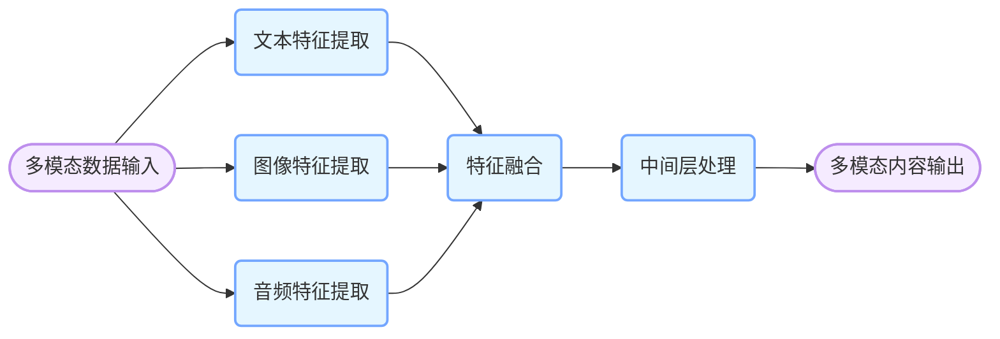

# AI Agent的多模态内容理解与生成

> 关键词：AI Agent、多模态、内容理解、内容生成、深度学习

> 摘要：本文围绕AI Agent的多模态内容理解与生成展开深入探讨。首先介绍了相关背景，包括目的范围、预期读者等。接着阐述了核心概念与联系，详细讲解了核心算法原理和具体操作步骤，并结合Python代码进行说明。同时给出了数学模型和公式，通过实际案例进行解释。还探讨了实际应用场景，推荐了学习资源、开发工具框架以及相关论文著作。最后总结了未来发展趋势与挑战，提供了常见问题解答和扩展阅读参考资料，旨在为读者全面呈现AI Agent多模态内容理解与生成的技术全貌。

## 1. 背景介绍 
### 1.1 目的和范围
随着人工智能技术的飞速发展，单一模态的数据处理已经难以满足复杂场景的需求。AI Agent的多模态内容理解与生成旨在使智能体能够同时处理和融合多种不同类型的数据，如文本、图像、音频、视频等，从而实现更自然、更智能的交互。本文章的范围涵盖了多模态内容理解与生成的基本概念、核心算法、数学模型、实际应用以及相关工具和资源，旨在为读者提供一个全面且深入的技术视角。

### 1.2 预期读者
本文预期读者包括人工智能领域的研究人员、开发者、学生，以及对多模态技术感兴趣的爱好者。对于专业人士，文章提供了深入的技术分析和最新的研究进展；对于初学者，文章从基础概念出发，逐步引导读者理解多模态内容理解与生成的核心要点。

### 1.3 文档结构概述
本文首先介绍背景信息，为读者搭建基础认知框架。接着阐述核心概念与联系，帮助读者理解多模态处理的基本原理。然后详细讲解核心算法原理和具体操作步骤，通过Python代码进行示例。之后给出数学模型和公式，并举例说明其应用。再通过项目实战展示代码实现和详细解读。随后探讨实际应用场景，为技术的落地提供思路。接着推荐相关的工具和资源，方便读者进一步学习和实践。最后总结未来发展趋势与挑战，提供常见问题解答和扩展阅读参考资料。

### 1.4 术语表
#### 1.4.1 核心术语定义
- **AI Agent**：人工智能体，是一种能够感知环境、进行决策并采取行动的智能实体。
- **多模态**：指同时使用多种不同类型的数据模态，如文本、图像、音频、视频等。
- **内容理解**：指AI Agent对输入的多模态数据进行分析和解读，提取其中有意义的信息。
- **内容生成**：指AI Agent根据理解的信息，生成新的多模态内容，如文本描述、图像合成等。

#### 1.4.2 相关概念解释
- **特征提取**：从多模态数据中提取具有代表性的特征，以便后续的处理和分析。
- **特征融合**：将不同模态的特征进行整合，以获得更全面、更丰富的信息。
- **注意力机制**：一种在处理多模态数据时，能够自动关注重要部分的机制，提高处理效率和准确性。

#### 1.4.3 缩略词列表
- **CNN**：Convolutional Neural Network，卷积神经网络
- **RNN**：Recurrent Neural Network，循环神经网络
- **Transformer**：一种基于注意力机制的神经网络架构
- **GAN**：Generative Adversarial Network，生成对抗网络

## 2. 核心概念与联系 

### 核心概念原理
多模态内容理解与生成的核心在于如何有效地处理和融合不同模态的数据。不同模态的数据具有各自的特点和表示方式，例如文本数据通常以词向量的形式表示，图像数据以像素矩阵表示，音频数据以波形信号表示。

为了实现多模态内容理解，首先需要对每种模态的数据进行特征提取。对于文本数据，可以使用词嵌入技术将单词转换为向量表示，然后通过循环神经网络（RNN）或Transformer等模型进行序列处理。对于图像数据，卷积神经网络（CNN）是常用的特征提取工具，它能够自动提取图像中的特征。对于音频数据，可以使用梅尔频谱等特征表示，再通过合适的神经网络进行处理。

特征融合是多模态处理的关键步骤。常见的融合方法包括早期融合、晚期融合和混合融合。早期融合是在特征提取之前将不同模态的数据进行拼接，然后一起进行特征提取。晚期融合是先分别对不同模态的数据进行特征提取，然后在决策层将提取的特征进行融合。混合融合则结合了早期融合和晚期融合的优点。

在内容生成方面，生成对抗网络（GAN）和变分自编码器（VAE）等模型被广泛应用。GAN由生成器和判别器组成，生成器负责生成新的内容，判别器负责判断生成的内容是否真实。通过不断的对抗训练，生成器能够生成越来越逼真的内容。

### 架构的文本示意图
```plaintext
输入层：多模态数据（文本、图像、音频等）
|
特征提取层：
    - 文本特征提取：词嵌入、RNN/Transformer
    - 图像特征提取：CNN
    - 音频特征提取：梅尔频谱 + 神经网络
|
特征融合层：早期融合、晚期融合、混合融合
|
中间层：神经网络（如全连接层）
|
输出层：生成的多模态内容（文本描述、图像合成等）
```

### Mermaid流程图


## 3. 核心算法原理 & 具体操作步骤 

### 特征提取算法
#### 文本特征提取（使用Transformer）
Transformer是一种基于注意力机制的神经网络架构，在自然语言处理任务中取得了很好的效果。以下是使用Python和Hugging Face的Transformers库进行文本特征提取的示例代码：
```python
from transformers import AutoTokenizer, AutoModel
import torch

# 加载预训练的模型和分词器
tokenizer = AutoTokenizer.from_pretrained('bert-base-uncased')
model = AutoModel.from_pretrained('bert-base-uncased')

# 输入文本
text = "This is an example sentence."

# 对文本进行分词
inputs = tokenizer(text, return_tensors='pt')

# 通过模型获取特征
with torch.no_grad():
    outputs = model(**inputs)

# 提取特征
last_hidden_states = outputs.last_hidden_state
```
#### 图像特征提取（使用ResNet）
ResNet是一种深度卷积神经网络，在图像分类和特征提取任务中表现出色。以下是使用Python和PyTorch进行图像特征提取的示例代码：
```python
import torch
import torchvision.models as models
from torchvision import transforms
from PIL import Image

# 加载预训练的ResNet模型
resnet = models.resnet18(pretrained=True)
resnet.eval()

# 图像预处理
preprocess = transforms.Compose([
    transforms.Resize(256),
    transforms.CenterCrop(224),
    transforms.ToTensor(),
    transforms.Normalize(mean=[0.485, 0.456, 0.406], std=[0.229, 0.224, 0.225])
])

# 加载图像
image = Image.open('example.jpg')
image = preprocess(image).unsqueeze(0)

# 通过模型获取特征
with torch.no_grad():
    features = resnet(image)
```

### 特征融合算法
#### 晚期融合示例
晚期融合是先分别对不同模态的数据进行特征提取，然后在决策层将提取的特征进行融合。以下是一个简单的晚期融合示例代码：
```python
import torch

# 假设已经获取了文本特征和图像特征
text_features = torch.randn(1, 768)
image_features = torch.randn(1, 512)

# 特征拼接
combined_features = torch.cat((text_features, image_features), dim=1)
```

### 内容生成算法（使用GAN）
以下是一个简单的GAN示例代码，用于生成手写数字图像：
```python
import torch
import torch.nn as nn
import torch.optim as optim
import torchvision
import torchvision.datasets as datasets
import torchvision.transforms as transforms
from torch.utils.data import DataLoader

# 定义生成器
class Generator(nn.Module):
    def __init__(self, z_dim=100, img_dim=784):
        super(Generator, self).__init__()
        self.gen = nn.Sequential(
            nn.Linear(z_dim, 256),
            nn.LeakyReLU(0.1),
            nn.Linear(256, img_dim),
            nn.Tanh()
        )

    def forward(self, x):
        return self.gen(x)

# 定义判别器
class Discriminator(nn.Module):
    def __init__(self, img_dim=784):
        super(Discriminator, self).__init__()
        self.disc = nn.Sequential(
            nn.Linear(img_dim, 128),
            nn.LeakyReLU(0.1),
            nn.Linear(128, 1),
            nn.Sigmoid()
        )

    def forward(self, x):
        return self.disc(x)

# 超参数设置
device = torch.device("cuda" if torch.cuda.is_available() else "cpu")
lr = 3e-4
z_dim = 100
img_dim = 28 * 28
batch_size = 32
num_epochs = 50

# 加载数据集
transform = transforms.Compose([
    transforms.ToTensor(),
    transforms.Normalize((0.5,), (0.5,))
])
dataset = datasets.MNIST(root='./data', train=True, transform=transform, download=True)
dataloader = DataLoader(dataset, batch_size=batch_size, shuffle=True)

# 初始化生成器和判别器
gen = Generator(z_dim, img_dim).to(device)
disc = Discriminator(img_dim).to(device)

# 定义优化器和损失函数
opt_gen = optim.Adam(gen.parameters(), lr=lr)
opt_disc = optim.Adam(disc.parameters(), lr=lr)
criterion = nn.BCELoss()

# 训练循环
for epoch in range(num_epochs):
    for batch_idx, (real, _) in enumerate(dataloader):
        real = real.view(-1, 784).to(device)
        batch_size = real.shape[0]

        ### 训练判别器
        noise = torch.randn(batch_size, z_dim).to(device)
        fake = gen(noise)
        disc_real = disc(real).view(-1)
        lossD_real = criterion(disc_real, torch.ones_like(disc_real))
        disc_fake = disc(fake.detach()).view(-1)
        lossD_fake = criterion(disc_fake, torch.zeros_like(disc_fake))
        lossD = (lossD_real + lossD_fake) / 2
        disc.zero_grad()
        lossD.backward()
        opt_disc.step()

        ### 训练生成器
        output = disc(fake).view(-1)
        lossG = criterion(output, torch.ones_like(output))
        gen.zero_grad()
        lossG.backward()
        opt_gen.step()

    print(f"Epoch [{epoch + 1}/{num_epochs}] Loss D: {lossD.item():.4f}, Loss G: {lossG.item():.4f}")
```

## 4. 数学模型和公式 & 详细讲解 & 举例说明 

### 特征提取的数学模型
#### 文本特征提取（Transformer）
Transformer的核心是多头注意力机制。多头注意力机制的计算公式如下：
$$
\text{MultiHead}(Q, K, V) = \text{Concat}(\text{head}_1, \cdots, \text{head}_h)W^O
$$
其中，
$$
\text{head}_i = \text{Attention}(QW_i^Q, KW_i^K, VW_i^V)
$$
$$
\text{Attention}(Q, K, V) = \text{softmax}(\frac{QK^T}{\sqrt{d_k}})V
$$
这里，$Q$、$K$、$V$ 分别是查询、键、值矩阵，$W_i^Q$、$W_i^K$、$W_i^V$ 是可学习的权重矩阵，$d_k$ 是键向量的维度。

例如，假设输入的文本序列长度为 $n$，词向量维度为 $d$，则 $Q$、$K$、$V$ 的维度分别为 $n \times d$。通过多头注意力机制，可以捕获不同位置之间的依赖关系。

#### 图像特征提取（CNN）
卷积神经网络中的卷积层可以用以下公式表示：
$$
y_{i,j}^l = \sum_{m=0}^{M-1} \sum_{n=0}^{N-1} x_{i+m,j+n}^{l-1} w_{m,n}^l + b^l
$$
其中，$y_{i,j}^l$ 是第 $l$ 层卷积层在位置 $(i, j)$ 的输出，$x_{i+m,j+n}^{l-1}$ 是第 $l - 1$ 层的输入，$w_{m,n}^l$ 是卷积核的权重，$b^l$ 是偏置项，$M$ 和 $N$ 是卷积核的大小。

例如，对于一个 $3 \times 3$ 的卷积核，$M = N = 3$。通过卷积操作，可以提取图像中的局部特征。

### 特征融合的数学模型
#### 晚期融合
晚期融合通常是将不同模态的特征进行拼接。假设文本特征向量为 $\mathbf{x}_t \in \mathbb{R}^{d_t}$，图像特征向量为 $\mathbf{x}_i \in \mathbb{R}^{d_i}$，则融合后的特征向量为：
$$
\mathbf{x}_{fusion} = [\mathbf{x}_t; \mathbf{x}_i] \in \mathbb{R}^{d_t + d_i}
$$
例如，若 $d_t = 768$，$d_i = 512$，则融合后的特征向量维度为 $768 + 512 = 1280$。

### 内容生成的数学模型（GAN）
GAN的目标是通过对抗训练来学习数据的分布。生成器 $G$ 试图生成逼真的样本，判别器 $D$ 试图区分真实样本和生成样本。GAN的损失函数可以表示为：
$$
\min_G \max_D V(D, G) = \mathbb{E}_{\mathbf{x} \sim p_{data}(\mathbf{x})}[\log D(\mathbf{x})] + \mathbb{E}_{\mathbf{z} \sim p_{\mathbf{z}}(\mathbf{z})}[\log(1 - D(G(\mathbf{z})))]
$$
其中，$p_{data}(\mathbf{x})$ 是真实数据的分布，$p_{\mathbf{z}}(\mathbf{z})$ 是噪声的分布。

在训练过程中，判别器的目标是最大化 $V(D, G)$，生成器的目标是最小化 $V(D, G)$。通过不断的对抗训练，生成器能够生成越来越逼真的样本。

## 5. 项目实战：代码实际案例和详细解释说明 

### 5.1  开发环境搭建
#### 安装Python
首先需要安装Python，建议使用Python 3.7及以上版本。可以从Python官方网站（https://www.python.org/downloads/）下载并安装。

#### 安装深度学习框架
本项目使用PyTorch作为深度学习框架。可以根据自己的CUDA版本和操作系统，从PyTorch官方网站（https://pytorch.org/get-started/locally/）选择合适的安装命令进行安装。例如，对于CPU版本的PyTorch，可以使用以下命令：
```bash
pip install torch torchvision torchaudio
```

#### 安装其他依赖库
还需要安装一些其他的依赖库，如Hugging Face的Transformers库、torchvision等。可以使用以下命令进行安装：
```bash
pip install transformers
```

### 5.2  源代码详细实现和代码解读
#### 项目概述
本项目的目标是实现一个简单的多模态问答系统，结合文本和图像信息进行问答。具体步骤包括文本特征提取、图像特征提取、特征融合和问答模型训练。

#### 代码实现
```python
import torch
import torch.nn as nn
import torch.optim as optim
from transformers import AutoTokenizer, AutoModel
import torchvision.models as models
from torchvision import transforms
from PIL import Image

# 文本特征提取
class TextFeatureExtractor(nn.Module):
    def __init__(self):
        super(TextFeatureExtractor, self).__init__()
        self.tokenizer = AutoTokenizer.from_pretrained('bert-base-uncased')
        self.model = AutoModel.from_pretrained('bert-base-uncased')

    def forward(self, text):
        inputs = self.tokenizer(text, return_tensors='pt')
        with torch.no_grad():
            outputs = self.model(**inputs)
        return outputs.last_hidden_state.mean(dim=1)

# 图像特征提取
class ImageFeatureExtractor(nn.Module):
    def __init__(self):
        super(ImageFeatureExtractor, self).__init__()
        self.resnet = models.resnet18(pretrained=True)
        self.resnet.eval()
        self.preprocess = transforms.Compose([
            transforms.Resize(256),
            transforms.CenterCrop(224),
            transforms.ToTensor(),
            transforms.Normalize(mean=[0.485, 0.456, 0.406], std=[0.229, 0.224, 0.225])
        ])

    def forward(self, image_path):
        image = Image.open(image_path)
        image = self.preprocess(image).unsqueeze(0)
        with torch.no_grad():
            features = self.resnet(image)
        return features

# 特征融合和问答模型
class MultiModalQA(nn.Module):
    def __init__(self, text_dim, image_dim, hidden_dim, output_dim):
        super(MultiModalQA, self).__init__()
        self.fc1 = nn.Linear(text_dim + image_dim, hidden_dim)
        self.relu = nn.ReLU()
        self.fc2 = nn.Linear(hidden_dim, output_dim)

    def forward(self, text_features, image_features):
        combined_features = torch.cat((text_features, image_features), dim=1)
        x = self.fc1(combined_features)
        x = self.relu(x)
        x = self.fc2(x)
        return x

# 初始化模型
text_extractor = TextFeatureExtractor()
image_extractor = ImageFeatureExtractor()
qa_model = MultiModalQA(text_dim=768, image_dim=1000, hidden_dim=512, output_dim=10)

# 定义优化器和损失函数
optimizer = optim.Adam(qa_model.parameters(), lr=0.001)
criterion = nn.CrossEntropyLoss()

# 示例训练数据
text = "What is in the image?"
image_path = "example.jpg"
labels = torch.randint(0, 10, (1,))

# 特征提取
text_features = text_extractor(text)
image_features = image_extractor(image_path)

# 前向传播
outputs = qa_model(text_features, image_features)

# 计算损失
loss = criterion(outputs, labels)

# 反向传播和优化
optimizer.zero_grad()
loss.backward()
optimizer.step()

print(f"Loss: {loss.item()}")
```

### 5.3  代码解读与分析
#### 文本特征提取
`TextFeatureExtractor` 类使用了预训练的BERT模型进行文本特征提取。通过 `AutoTokenizer` 对输入文本进行分词，然后将分词后的输入传递给 `AutoModel` 进行特征提取。最后，取最后一层隐藏状态的均值作为文本特征。

#### 图像特征提取
`ImageFeatureExtractor` 类使用了预训练的ResNet18模型进行图像特征提取。首先对输入图像进行预处理，然后将预处理后的图像传递给ResNet18模型进行特征提取。

#### 特征融合和问答模型
`MultiModalQA` 类将文本特征和图像特征进行拼接，然后通过两个全连接层进行特征融合和问答预测。第一个全连接层将拼接后的特征映射到隐藏层，第二个全连接层将隐藏层的输出映射到输出层。

#### 训练过程
在训练过程中，首先提取文本特征和图像特征，然后将它们输入到问答模型中进行前向传播。计算输出和标签之间的损失，然后进行反向传播和优化。

## 6. 实际应用场景 
### 智能客服
多模态的智能客服系统可以同时处理用户的文本提问和上传的图片、视频等信息。例如，用户在咨询商品问题时，可以上传商品的图片，客服系统可以结合图片和文本信息进行更准确的回答。

### 自动驾驶
在自动驾驶领域，多模态技术可以融合摄像头、雷达、激光雷达等多种传感器的数据。通过对图像、点云等多模态数据的理解，自动驾驶系统可以更准确地感知周围环境，做出更安全的决策。

### 虚拟现实和增强现实
在虚拟现实（VR）和增强现实（AR）应用中，多模态内容理解与生成可以提供更沉浸式的体验。例如，在VR游戏中，系统可以根据玩家的语音指令和手势动作，生成相应的场景和交互效果。

### 医疗诊断
医疗领域可以利用多模态技术融合医学影像（如X光、CT、MRI等）和病历文本信息。医生可以通过多模态分析系统更全面地了解患者的病情，提高诊断的准确性。

## 7. 工具和资源推荐
### 7.1 学习资源推荐
#### 7.1.1 书籍推荐
- 《深度学习》（Deep Learning）：由Ian Goodfellow、Yoshua Bengio和Aaron Courville撰写，是深度学习领域的经典教材，涵盖了神经网络、卷积神经网络、循环神经网络等内容。
- 《动手学深度学习》（Dive into Deep Learning）：由 Aston Zhang、Zack C. Lipton、Mu Li和Alexander J. Smola撰写，提供了丰富的代码示例和实践项目，适合初学者快速上手。

#### 7.1.2 在线课程
- Coursera上的“深度学习专项课程”（Deep Learning Specialization）：由Andrew Ng教授讲授，包括神经网络、卷积神经网络、循环神经网络等多个课程，内容全面且深入。
- edX上的“使用Python进行数据科学”（Data Science with Python）：涵盖了Python编程、机器学习、深度学习等内容，适合有一定编程基础的学习者。

#### 7.1.3 技术博客和网站
- arXiv：一个预印本平台，提供了大量最新的学术论文，涵盖了人工智能、机器学习、计算机视觉等多个领域。
- Medium：一个技术博客平台，有许多人工智能领域的专家和爱好者分享他们的研究成果和实践经验。

### 7.2 开发工具框架推荐
#### 7.2.1 IDE和编辑器
- PyCharm：一款专业的Python集成开发环境，提供了代码编辑、调试、版本控制等功能，适合Python开发。
- Jupyter Notebook：一个交互式的开发环境，支持Python、R等多种编程语言，方便进行数据分析和模型实验。

#### 7.2.2 调试和性能分析工具
- TensorBoard：TensorFlow的可视化工具，可以用于可视化模型的训练过程、损失曲线、网络结构等。
- PyTorch Profiler：PyTorch的性能分析工具，可以帮助开发者找出代码中的性能瓶颈。

#### 7.2.3 相关框架和库
- Hugging Face Transformers：一个用于自然语言处理的开源库，提供了大量预训练的模型和工具，方便进行文本特征提取、文本生成等任务。
- OpenCV：一个计算机视觉库，提供了丰富的图像处理和计算机视觉算法，如图像滤波、特征提取、目标检测等。

### 7.3 相关论文著作推荐
#### 7.3.1 经典论文
- “Attention Is All You Need”：提出了Transformer架构，是自然语言处理领域的重要突破。
- “Generative Adversarial Nets”：首次提出了生成对抗网络（GAN）的概念，开启了生成模型的新时代。

#### 7.3.2 最新研究成果
- 关注顶会论文，如NeurIPS、ICML、CVPR等，这些会议收录了人工智能领域的最新研究成果。

#### 7.3.3 应用案例分析
- 可以在ACM Digital Library、IEEE Xplore等数据库中查找多模态技术在不同领域的应用案例分析。

## 8. 总结：未来发展趋势与挑战
### 未来发展趋势
#### 更强大的多模态融合方法
未来将不断探索更有效的多模态融合方法，以更好地整合不同模态的数据信息。例如，结合注意力机制和图神经网络的多模态融合方法可能会成为研究热点。

#### 跨模态迁移学习
跨模态迁移学习可以将一个模态的知识迁移到另一个模态，提高模型的泛化能力和学习效率。未来，跨模态迁移学习将在更多领域得到应用。

#### 多模态交互的普及
随着智能设备的不断发展，多模态交互将变得更加普及。例如，人们可以通过语音、手势、表情等多种方式与智能设备进行交互，提供更加自然和便捷的体验。

### 挑战
#### 数据标注和获取
多模态数据的标注和获取是一个挑战。不同模态的数据需要不同的标注方法，而且标注成本较高。此外，获取大规模的多模态数据也比较困难。

#### 计算资源需求
多模态处理需要大量的计算资源，尤其是在处理大规模数据和复杂模型时。如何在有限的计算资源下提高多模态处理的效率是一个亟待解决的问题。

#### 模型解释性
多模态模型通常比较复杂，缺乏良好的解释性。在一些关键领域，如医疗、金融等，模型的解释性至关重要。因此，如何提高多模态模型的解释性是一个重要的研究方向。

## 9. 附录：常见问题与解答
### 多模态数据的特征融合有哪些常见方法？
常见的特征融合方法包括早期融合、晚期融合和混合融合。早期融合是在特征提取之前将不同模态的数据进行拼接，然后一起进行特征提取。晚期融合是先分别对不同模态的数据进行特征提取，然后在决策层将提取的特征进行融合。混合融合则结合了早期融合和晚期融合的优点。

### 如何选择合适的深度学习框架进行多模态处理？
选择深度学习框架时，需要考虑以下因素：
- 社区支持：选择有活跃社区支持的框架，这样可以更容易获取帮助和资源。
- 模型库：选择提供丰富预训练模型的框架，方便快速开发。
- 性能：考虑框架的计算性能和内存使用情况。
- 易用性：选择易于使用和学习的框架。

### 多模态内容生成的评估指标有哪些？
常见的评估指标包括：
- 视觉质量评估指标：如PSNR、SSIM等，用于评估生成图像的质量。
- 文本质量评估指标：如BLEU、ROUGE等，用于评估生成文本的质量。
- 语义一致性评估指标：用于评估生成内容与输入信息的语义一致性。

## 10. 扩展阅读 & 参考资料
### 扩展阅读
- 《人工智能：一种现代的方法》（Artificial Intelligence: A Modern Approach）：全面介绍了人工智能的各个领域，包括多模态处理。
- 《计算机视觉：算法与应用》（Computer Vision: Algorithms and Applications）：详细介绍了计算机视觉的算法和应用，对多模态处理中的图像部分有深入讲解。

### 参考资料
- Hugging Face官方文档：https://huggingface.co/docs
- PyTorch官方文档：https://pytorch.org/docs/stable/index.html
- OpenCV官方文档：https://docs.opencv.org/

作者：AI天才研究院/AI Genius Institute & 禅与计算机程序设计艺术 /Zen And The Art of Computer Programming