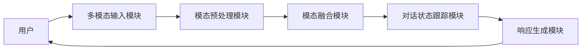

# AI Agent的多模态对话状态跟踪

> 关键词：AI Agent、多模态、对话状态跟踪、自然语言处理、计算机视觉、语音处理

> 摘要：本文围绕AI Agent的多模态对话状态跟踪展开深入探讨。多模态对话状态跟踪是实现智能、自然且高效人机交互的关键技术，它综合考虑文本、语音、图像等多种模态信息来准确把握对话状态。文章首先介绍了该领域的背景知识，包括目的、预期读者、文档结构和相关术语。接着阐述了核心概念与联系，通过文本示意图和Mermaid流程图展示其架构。详细讲解了核心算法原理，并使用Python源代码进行说明，同时给出了相关数学模型和公式。通过项目实战，展示了开发环境搭建、源代码实现及解读。还探讨了实际应用场景，推荐了学习资源、开发工具框架和相关论文著作。最后总结了未来发展趋势与挑战，提供了常见问题解答和扩展阅读参考资料，旨在为该领域的研究和实践提供全面而深入的指导。

## 1. 背景介绍 
### 1.1 目的和范围
在当今数字化时代，人机交互的需求日益增长且愈发复杂。传统的基于单模态（如仅文本）的对话系统已难以满足用户对于自然、高效交互的期望。多模态对话状态跟踪作为AI Agent技术的重要组成部分，其目的在于整合文本、语音、图像等多种模态的信息，更全面、准确地理解用户意图和对话状态，从而实现更加智能、自然和人性化的人机对话。

本文章的范围涵盖多模态对话状态跟踪的基本概念、核心算法、数学模型、实际应用案例等多个方面。从理论基础的讲解到实际项目的开发，旨在为读者提供一个全面而深入的学习和研究多模态对话状态跟踪的指南。

### 1.2 预期读者
本文预期读者包括但不限于以下几类人群：
- **科研人员**：对人工智能、自然语言处理、计算机视觉等领域的前沿技术感兴趣，希望深入研究多模态对话状态跟踪的理论和算法。
- **开发者**：从事AI Agent、对话系统开发的专业人员，希望借鉴本文的实践经验和技术方法，提升对话系统的性能和用户体验。
- **学生**：计算机科学、人工智能等相关专业的学生，希望通过本文了解多模态对话状态跟踪的基本概念和技术，为未来的学习和研究打下基础。

### 1.3 文档结构概述
本文将按照以下结构进行组织：
- **核心概念与联系**：介绍多模态对话状态跟踪的基本概念，包括多模态信息、对话状态等，并通过文本示意图和Mermaid流程图展示其架构和各部分之间的联系。
- **核心算法原理 & 具体操作步骤**：详细讲解多模态对话状态跟踪的核心算法，使用Python源代码进行说明，并给出具体的操作步骤。
- **数学模型和公式 & 详细讲解 & 举例说明**：介绍多模态对话状态跟踪的数学模型和相关公式，并通过具体的例子进行详细讲解。
- **项目实战：代码实际案例和详细解释说明**：通过一个实际的项目案例，展示多模态对话状态跟踪的开发过程，包括开发环境搭建、源代码实现和代码解读。
- **实际应用场景**：探讨多模态对话状态跟踪在不同领域的实际应用场景，如智能客服、智能家居、智能车载等。
- **工具和资源推荐**：推荐学习多模态对话状态跟踪的相关书籍、在线课程、技术博客和网站，以及开发工具框架和相关论文著作。
- **总结：未来发展趋势与挑战**：总结多模态对话状态跟踪的发展现状，分析未来的发展趋势和面临的挑战。
- **附录：常见问题与解答**：提供多模态对话状态跟踪相关的常见问题及解答。
- **扩展阅读 & 参考资料**：提供进一步学习和研究多模态对话状态跟踪的扩展阅读材料和参考资料。

### 1.4 术语表
#### 1.4.1 核心术语定义
- **AI Agent**：人工智能代理，是一种能够感知环境、进行决策并采取行动的智能实体。
- **多模态**：指的是包含多种不同类型信息的模式，如文本、语音、图像、手势等。
- **对话状态跟踪**：在对话过程中，不断地对当前对话的状态进行更新和维护，以便更好地理解用户意图和生成合适的响应。
- **模态融合**：将不同模态的信息进行整合，以获得更全面、准确的信息表示。

#### 1.4.2 相关概念解释
- **自然语言处理（NLP）**：研究如何让计算机理解和处理人类语言的技术，是多模态对话状态跟踪中处理文本信息的重要手段。
- **计算机视觉（CV）**：研究如何让计算机理解和处理图像和视频信息的技术，在多模态对话状态跟踪中可用于处理视觉信息。
- **语音处理**：研究如何让计算机理解和处理语音信息的技术，在多模态对话状态跟踪中可用于处理语音信息。

#### 1.4.3 缩略词列表
- **NLP**：Natural Language Processing（自然语言处理）
- **CV**：Computer Vision（计算机视觉）
- **ASR**：Automatic Speech Recognition（自动语音识别）
- **TTS**：Text-to-Speech（文本转语音）

## 2. 核心概念与联系 

### 多模态对话状态跟踪的基本概念
多模态对话状态跟踪旨在综合利用文本、语音、图像等多种模态的信息，对对话的状态进行准确的跟踪和更新。在传统的单模态对话系统中，通常只考虑文本信息，而忽略了语音的语调、语速、情感等信息以及图像所传达的视觉信息。多模态对话状态跟踪通过融合多种模态的信息，可以更全面地理解用户的意图和情感，从而提供更加智能、自然的对话服务。

### 核心概念原理和架构的文本示意图
多模态对话状态跟踪系统主要由以下几个部分组成：
- **多模态输入模块**：负责接收来自用户的多种模态信息，如文本、语音、图像等。
- **模态预处理模块**：对不同模态的信息进行预处理，如文本的分词、词性标注，语音的特征提取，图像的目标检测等。
- **模态融合模块**：将预处理后的不同模态信息进行融合，以获得更全面、准确的信息表示。
- **对话状态跟踪模块**：根据融合后的信息，对对话的状态进行跟踪和更新。
- **响应生成模块**：根据当前的对话状态，生成合适的响应。

以下是文本示意图：

```plaintext
用户  --->  多模态输入模块  --->  模态预处理模块  --->  模态融合模块  --->  对话状态跟踪模块  --->  响应生成模块  --->  用户
```

### Mermaid流程图


## 3. 核心算法原理 & 具体操作步骤 

### 核心算法原理
多模态对话状态跟踪的核心算法主要包括模态融合算法和对话状态更新算法。

#### 模态融合算法
模态融合算法的目的是将不同模态的信息进行整合，以获得更全面、准确的信息表示。常见的模态融合方法包括早期融合、晚期融合和混合融合。

- **早期融合**：在特征提取阶段将不同模态的信息进行融合，然后再进行后续的处理。
- **晚期融合**：在各个模态分别进行处理后，再将处理结果进行融合。
- **混合融合**：结合了早期融合和晚期融合的优点，在不同阶段进行部分融合。

#### 对话状态更新算法
对话状态更新算法的目的是根据当前的对话信息和历史对话状态，更新对话的状态。常见的对话状态更新算法包括基于规则的方法、基于机器学习的方法和基于深度学习的方法。

### Python源代码详细阐述
以下是一个简单的多模态对话状态跟踪的Python示例代码：

```python
import numpy as np

# 模拟多模态输入信息
text_input = "我想去看电影"
speech_features = np.random.rand(10)  # 模拟语音特征
image_features = np.random.rand(20)  # 模拟图像特征

# 模态预处理
def preprocess_text(text):
    # 简单的分词处理
    return text.split()

def preprocess_speech(speech_features):
    # 简单的归一化处理
    return speech_features / np.linalg.norm(speech_features)

def preprocess_image(image_features):
    # 简单的归一化处理
    return image_features / np.linalg.norm(image_features)

preprocessed_text = preprocess_text(text_input)
preprocessed_speech = preprocess_speech(speech_features)
preprocessed_image = preprocess_image(image_features)

# 模态融合（晚期融合）
def late_fusion(text_features, speech_features, image_features):
    # 简单的拼接融合
    return np.concatenate((np.array(text_features), speech_features, image_features))

fused_features = late_fusion(preprocessed_text, preprocessed_speech, preprocessed_image)

# 对话状态跟踪（简单示例）
class DialogueStateTracker:
    def __init__(self):
        self.state = {}

    def update_state(self, fused_features):
        # 简单的状态更新逻辑
        self.state['last_fused_features'] = fused_features
        return self.state

tracker = DialogueStateTracker()
current_state = tracker.update_state(fused_features)

print("Current dialogue state:", current_state)
```

### 具体操作步骤
1. **多模态输入**：接收用户的文本、语音、图像等多种模态信息。
2. **模态预处理**：对不同模态的信息进行预处理，如分词、特征提取、归一化等。
3. **模态融合**：选择合适的模态融合方法，将预处理后的不同模态信息进行融合。
4. **对话状态更新**：根据融合后的信息，使用对话状态更新算法更新对话的状态。
5. **响应生成**：根据当前的对话状态，生成合适的响应并返回给用户。

## 4. 数学模型和公式 & 详细讲解 & 举例说明 

### 模态融合的数学模型
#### 早期融合
早期融合通常是将不同模态的原始特征进行拼接。假设我们有两种模态的特征向量 $\mathbf{x}_1 \in \mathbb{R}^{d_1}$ 和 $\mathbf{x}_2 \in \mathbb{R}^{d_2}$，早期融合后的特征向量 $\mathbf{x}_{early}$ 可以表示为：

$$\mathbf{x}_{early} = \begin{bmatrix} \mathbf{x}_1 \\ \mathbf{x}_2 \end{bmatrix} \in \mathbb{R}^{d_1 + d_2}$$

#### 晚期融合
晚期融合通常是将不同模态的处理结果进行加权求和。假设我们有两种模态的处理结果 $\mathbf{y}_1 \in \mathbb{R}^{k}$ 和 $\mathbf{y}_2 \in \mathbb{R}^{k}$，晚期融合后的结果 $\mathbf{y}_{late}$ 可以表示为：

$$\mathbf{y}_{late} = \alpha \mathbf{y}_1 + (1 - \alpha) \mathbf{y}_2$$

其中 $\alpha \in [0, 1]$ 是权重系数。

### 对话状态更新的数学模型
#### 基于概率的方法
基于概率的方法通常使用贝叶斯定理来更新对话状态。假设 $S_t$ 表示时刻 $t$ 的对话状态，$O_t$ 表示时刻 $t$ 的观测信息（如融合后的特征向量），则根据贝叶斯定理，对话状态的后验概率可以表示为：

$$P(S_t | O_{1:t}) = \frac{P(O_t | S_t) P(S_t | O_{1:t-1})}{\sum_{S_t'} P(O_t | S_t') P(S_t' | O_{1:t-1})}$$

其中 $P(O_t | S_t)$ 是观测似然，$P(S_t | O_{1:t-1})$ 是先验概率。

### 举例说明
假设我们有一个简单的对话场景，用户的文本输入是“我想吃披萨”，语音特征向量 $\mathbf{x}_1 = [0.1, 0.2, 0.3]$，图像特征向量 $\mathbf{x}_2 = [0.4, 0.5, 0.6]$。

#### 早期融合
早期融合后的特征向量为：

$$\mathbf{x}_{early} = \begin{bmatrix} 0.1 \\ 0.2 \\ 0.3 \\ 0.4 \\ 0.5 \\ 0.6 \end{bmatrix}$$

#### 晚期融合
假设我们已经对语音和图像特征进行了处理，得到处理结果 $\mathbf{y}_1 = [0.7, 0.8]$ 和 $\mathbf{y}_2 = [0.9, 1.0]$，权重系数 $\alpha = 0.6$，则晚期融合后的结果为：

$$\mathbf{y}_{late} = 0.6 \times [0.7, 0.8] + (1 - 0.6) \times [0.9, 1.0] = [0.78, 0.88]$$

## 5. 项目实战：代码实际案例和详细解释说明 

### 5.1  开发环境搭建
#### 硬件环境
- 一台性能较好的计算机，建议配备至少8GB内存和独立显卡（用于加速深度学习模型的训练和推理）。

#### 软件环境
- **操作系统**：Windows、Linux或macOS均可。
- **Python环境**：建议使用Python 3.7及以上版本。
- **深度学习框架**：可以选择PyTorch或TensorFlow。
- **相关库**：安装numpy、pandas、scikit-learn等常用数据处理和机器学习库，以及transformers、torchvision等深度学习相关库。

以下是安装相关库的示例命令（使用pip）：

```bash
pip install numpy pandas scikit-learn transformers torchvision
```

### 5.2  源代码详细实现和代码解读
#### 项目概述
我们将实现一个简单的多模态对话状态跟踪系统，该系统可以处理文本和语音信息，通过模态融合和对话状态更新来跟踪对话状态。

#### 代码实现
```python
import torch
import torch.nn as nn
from transformers import AutoTokenizer, AutoModel

# 定义模态预处理模块
class ModalityPreprocessor:
    def __init__(self):
        self.text_tokenizer = AutoTokenizer.from_pretrained('bert-base-uncased')
        self.text_model = AutoModel.from_pretrained('bert-base-uncased')

    def preprocess_text(self, text):
        inputs = self.text_tokenizer(text, return_tensors='pt')
        outputs = self.text_model(**inputs)
        text_features = outputs.last_hidden_state.mean(dim=1).squeeze()
        return text_features

    def preprocess_speech(self, speech_features):
        # 简单的归一化处理
        return speech_features / torch.norm(speech_features)

# 定义模态融合模块（晚期融合）
class ModalityFuser(nn.Module):
    def __init__(self, text_dim, speech_dim, fusion_dim):
        super(ModalityFuser, self).__init__()
        self.fc_text = nn.Linear(text_dim, fusion_dim)
        self.fc_speech = nn.Linear(speech_dim, fusion_dim)

    def forward(self, text_features, speech_features):
        text_proj = self.fc_text(text_features)
        speech_proj = self.fc_speech(speech_features)
        fused_features = text_proj + speech_proj
        return fused_features

# 定义对话状态跟踪模块
class DialogueStateTracker(nn.Module):
    def __init__(self, input_dim, state_dim):
        super(DialogueStateTracker, self).__init__()
        self.fc = nn.Linear(input_dim, state_dim)
        self.state = torch.zeros(state_dim)

    def forward(self, fused_features):
        new_state = self.fc(fused_features)
        self.state = new_state
        return self.state

# 主函数
def main():
    # 模拟输入
    text_input = "我想去旅游"
    speech_features = torch.rand(10)

    # 模态预处理
    preprocessor = ModalityPreprocessor()
    text_features = preprocessor.preprocess_text(text_input)
    speech_features = preprocessor.preprocess_speech(speech_features)

    # 模态融合
    text_dim = text_features.shape[0]
    speech_dim = speech_features.shape[0]
    fusion_dim = 50
    fuser = ModalityFuser(text_dim, speech_dim, fusion_dim)
    fused_features = fuser(text_features, speech_features)

    # 对话状态跟踪
    input_dim = fusion_dim
    state_dim = 30
    tracker = DialogueStateTracker(input_dim, state_dim)
    current_state = tracker(fused_features)

    print("Current dialogue state:", current_state)

if __name__ == "__main__":
    main()
```

#### 代码解读
1. **模态预处理模块**：使用预训练的BERT模型对文本进行编码，提取文本特征；对语音特征进行简单的归一化处理。
2. **模态融合模块**：使用全连接层将文本和语音特征投影到相同的维度，然后将它们相加得到融合后的特征。
3. **对话状态跟踪模块**：使用全连接层将融合后的特征映射到对话状态空间，更新对话状态。
4. **主函数**：模拟输入，依次调用模态预处理、模态融合和对话状态跟踪模块，输出当前的对话状态。

### 5.3  代码解读与分析
#### 优点
- **模块化设计**：将不同的功能模块（模态预处理、模态融合、对话