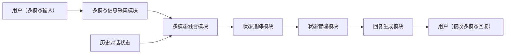

# AI Agent的多模态对话状态追踪与管理

> 关键词：AI Agent、多模态对话、状态追踪、状态管理、对话系统

> 摘要：本文聚焦于AI Agent的多模态对话状态追踪与管理，深入探讨了其核心概念、算法原理、数学模型，并通过实际项目案例展示了具体实现过程。首先介绍了该领域的背景知识，包括目的范围、预期读者等内容。接着详细阐述了核心概念及其联系，给出了原理和架构的文本示意图与Mermaid流程图。然后用Python代码阐述核心算法原理和操作步骤，通过数学公式进一步解释其理论基础。项目实战部分展示了开发环境搭建、源代码实现与解读。此外，还介绍了实际应用场景、推荐了相关工具和资源，最后对未来发展趋势与挑战进行了总结，并提供了常见问题解答和扩展阅读资料，旨在为相关研究和开发者提供全面的技术参考。

## 1. 背景介绍 
### 1.1 目的和范围
在当今的人工智能领域，对话系统已经成为了人与计算机交互的重要方式。传统的对话系统主要基于文本输入输出，然而，随着技术的发展，多模态交互（如语音、图像、手势等）逐渐成为趋势。AI Agent的多模态对话状态追踪与管理旨在实现对多模态对话过程中各种信息的有效捕捉、分析和处理，确保对话的连贯性、准确性和智能性。

本文章的范围涵盖了多模态对话状态追踪与管理的基本概念、核心算法、数学模型、实际应用以及相关工具和资源等方面。通过对这些内容的深入探讨，帮助读者全面了解该领域的技术原理和实现方法。

### 1.2 预期读者
本文的预期读者包括人工智能领域的研究人员、开发者、软件工程师以及对多模态对话系统感兴趣的技术爱好者。对于研究人员，本文可以为其提供新的研究思路和方向；对于开发者和软件工程师，文章中的算法原理和项目实战部分可以作为实际开发的参考；而对于技术爱好者，通过阅读本文可以对AI Agent的多模态对话状态追踪与管理有一个初步的了解。

### 1.3 文档结构概述
本文将按照以下结构进行组织：
- 核心概念与联系：介绍多模态对话、状态追踪和状态管理的基本概念，以及它们之间的联系，并给出相应的文本示意图和Mermaid流程图。
- 核心算法原理 & 具体操作步骤：详细讲解用于多模态对话状态追踪与管理的核心算法，并用Python代码进行具体实现。
- 数学模型和公式 & 详细讲解 & 举例说明：运用数学模型和公式对算法原理进行进一步解释，并通过具体例子加深理解。
- 项目实战：通过一个实际的项目案例，展示多模态对话状态追踪与管理的开发过程，包括开发环境搭建、源代码实现和代码解读。
- 实际应用场景：介绍多模态对话状态追踪与管理在不同领域的实际应用。
- 工具和资源推荐：推荐相关的学习资源、开发工具框架和论文著作。
- 总结：未来发展趋势与挑战：对该领域的未来发展趋势进行展望，并分析可能面临的挑战。
- 附录：常见问题与解答：解答读者在阅读过程中可能遇到的常见问题。
- 扩展阅读 & 参考资料：提供相关的扩展阅读材料和参考资料，方便读者进一步深入学习。

### 1.4 术语表
#### 1.4.1 核心术语定义
- **AI Agent**：人工智能代理，是一种能够感知环境、进行决策并采取行动以实现特定目标的智能实体。
- **多模态对话**：指在对话过程中综合使用多种模态的信息，如文本、语音、图像、手势等，以实现更加自然和丰富的交互。
- **对话状态**：表示对话在某一时刻的状态信息，包括用户的意图、历史对话记录、当前话题等。
- **状态追踪**：实时监测和更新对话状态，以反映对话的动态变化。
- **状态管理**：对对话状态进行有效的组织、存储和处理，确保对话的连贯性和智能性。

#### 1.4.2 相关概念解释
- **模态融合**：将不同模态的信息进行整合，以获取更全面和准确的信息。例如，将语音和图像信息融合，以更好地理解用户的意图。
- **对话策略**：根据对话状态和目标，选择合适的回复和行动，以引导对话的进行。
- **上下文感知**：在对话过程中，考虑历史对话信息和当前环境信息，以更好地理解用户的意图和提供更准确的回复。

#### 1.4.3 缩略词列表
- **NLP**：Natural Language Processing，自然语言处理
- **ASR**：Automatic Speech Recognition，自动语音识别
- **TTS**：Text-to-Speech，文本转语音
- **CNN**：Convolutional Neural Network，卷积神经网络
- **RNN**：Recurrent Neural Network，循环神经网络

## 2. 核心概念与联系 

### 核心概念原理
#### 多模态对话
多模态对话的核心在于综合利用多种模态的信息来进行交互。不同的模态可以提供互补的信息，从而提高对话的准确性和自然度。例如，在一个智能客服系统中，用户可以通过语音描述问题，同时上传相关的图片，系统可以结合语音和图像信息更好地理解用户的需求。

#### 状态追踪
状态追踪是指在对话过程中，实时记录和更新对话的状态信息。对话状态可以包括用户的意图、历史对话记录、当前话题等。通过状态追踪，系统可以了解对话的上下文，从而更好地理解用户的新输入，并做出合适的回复。

#### 状态管理
状态管理是对对话状态进行有效的组织、存储和处理。它涉及到状态的初始化、更新、保存和恢复等操作。良好的状态管理可以确保对话的连贯性和智能性，避免出现对话中断或回复不相关的问题。

### 架构的文本示意图
```plaintext
用户（多模态输入）
|
| 多模态信息采集模块
|
V
多模态融合模块
|
| 结合历史对话状态
|
V
状态追踪模块
|
| 更新对话状态
|
V
状态管理模块
|
| 根据状态选择对话策略
|
V
回复生成模块
|
| 生成多模态回复
|
V
用户（接收多模态回复）
```

### Mermaid流程图


## 3. 核心算法原理 & 具体操作步骤 

### 算法原理
多模态对话状态追踪与管理的核心算法通常涉及到以下几个方面：
- **多模态信息融合**：将不同模态的信息进行整合，常用的方法有特征拼接、注意力机制等。
- **状态表示**：将对话状态用合适的向量或矩阵表示，以便于后续的处理和计算。
- **状态更新**：根据新的输入信息，更新对话状态。
- **对话策略选择**：根据当前对话状态，选择合适的回复和行动。

### 具体操作步骤
以下是一个基于Python的简单示例，演示了多模态对话状态追踪与管理的基本操作步骤。

```python
# 定义对话状态类
class DialogueState:
    def __init__(self):
        # 初始化对话状态
        self.user_intent = None
        self.history = []

    def update_state(self, user_input, intent):
        # 更新对话状态
        self.user_intent = intent
        self.history.append(user_input)
        return self

# 定义多模态信息融合函数
def multimodal_fusion(text_input, image_input):
    # 简单的信息融合，这里只是将文本和图像信息拼接
    fused_info = f"Text: {text_input}, Image: {image_input}"
    return fused_info

# 定义意图识别函数
def intent_recognition(fused_info):
    # 简单的意图识别，这里只是示例，实际应用中需要更复杂的模型
    if "help" in fused_info.lower():
        return "help_request"
    else:
        return "other"

# 定义对话策略函数
def dialogue_strategy(state):
    if state.user_intent == "help_request":
        return "I'm here to help you!"
    else:
        return "Please clarify your request."

# 模拟多模态对话过程
text_input = "I need some help"
image_input = "image1.jpg"

# 多模态信息融合
fused_info = multimodal_fusion(text_input, image_input)

# 初始化对话状态
state = DialogueState()

# 意图识别
intent = intent_recognition(fused_info)

# 更新对话状态
state = state.update_state(fused_info, intent)

# 选择对话策略
response = dialogue_strategy(state)

print("User input (fused):", fused_info)
print("Dialogue state:", state.__dict__)
print("Response:", response)
```

### 代码解释
- `DialogueState` 类：用于表示对话状态，包含用户意图和历史对话记录。
- `multimodal_fusion` 函数：将文本和图像信息进行融合，这里只是简单的拼接。
- `intent_recognition` 函数：根据融合后的信息识别用户意图。
- `dialogue_strategy` 函数：根据当前对话状态选择合适的回复。
- 模拟多模态对话过程：首先进行多模态信息融合，然后初始化对话状态，识别用户意图，更新对话状态，最后选择对话策略并输出回复。

## 4. 数学模型和公式 & 详细讲解 & 举例说明 

### 多模态信息融合
在多模态信息融合中，常用的方法是将不同模态的特征进行拼接。假设我们有文本特征向量 $\mathbf{x}_t \in \mathbb{R}^{d_t}$ 和图像特征向量 $\mathbf{x}_i \in \mathbb{R}^{d_i}$，融合后的特征向量 $\mathbf{x}_f$ 可以表示为：

$$
\mathbf{x}_f = [\mathbf{x}_t; \mathbf{x}_i] \in \mathbb{R}^{d_t + d_i}
$$

其中 $[\cdot; \cdot]$ 表示向量拼接操作。

例如，假设 $\mathbf{x}_t = [0.1, 0.2, 0.3]$ 和 $\mathbf{x}_i = [0.4, 0.5]$，则融合后的特征向量为 $\mathbf{x}_f = [0.1, 0.2, 0.3, 0.4, 0.5]$。

### 状态表示
对话状态可以用一个向量 $\mathbf{s} \in \mathbb{R}^d$ 表示，其中 $d$ 是状态向量的维度。状态向量可以包含用户意图、历史对话信息等。例如，我们可以将用户意图用一个独热编码向量表示，历史对话信息用一个词嵌入向量的平均值表示，然后将它们拼接起来得到状态向量。

假设用户意图有 $n$ 种可能，用户意图的独热编码向量为 $\mathbf{y} \in \mathbb{R}^n$，历史对话信息的词嵌入向量的平均值为 $\mathbf{h} \in \mathbb{R}^{d_h}$，则状态向量 $\mathbf{s}$ 可以表示为：

$$
\mathbf{s} = [\mathbf{y}; \mathbf{h}] \in \mathbb{R}^{n + d_h}
$$

### 状态更新
状态更新可以用一个函数 $f(\mathbf{s}, \mathbf{x})$ 表示，其中 $\mathbf{s}$ 是当前对话状态，$\mathbf{x}$ 是新的输入信息。状态更新函数可以根据具体的算法和任务进行设计。例如，在一个简单的对话系统中，状态更新函数可以只是将新的输入信息添加到历史对话记录中。

假设当前对话状态为 $\mathbf{s}_t$，新的输入信息为 $\mathbf{x}_{t+1}$，更新后的对话状态为 $\mathbf{s}_{t+1}$，则状态更新可以表示为：

$$
\mathbf{s}_{t+1} = f(\mathbf{s}_t, \mathbf{x}_{t+1})
$$

### 对话策略选择
对话策略选择可以用一个函数 $g(\mathbf{s})$ 表示，其中 $\mathbf{s}$ 是当前对话状态。对话策略函数可以根据当前对话状态选择合适的回复和行动。例如，在一个智能客服系统中，对话策略函数可以根据用户的意图和历史对话记录选择合适的回复模板。

假设当前对话状态为 $\mathbf{s}$，选择的回复为 $\mathbf{r}$，则对话策略选择可以表示为：

$$
\mathbf{r} = g(\mathbf{s})
$$

## 5. 项目实战：代码实际案例和详细解释说明 

### 5.1  开发环境搭建
#### 硬件环境
- 计算机：建议使用具有较高性能的计算机，如配备Intel Core i7及以上处理器、16GB及以上内存的台式机或笔记本电脑。
- 存储设备：至少需要500GB的硬盘空间，用于存储开发所需的软件和数据。

#### 软件环境
- 操作系统：推荐使用Linux（如Ubuntu 18.04及以上版本）或Windows 10操作系统。
- Python环境：安装Python 3.7及以上版本，可以使用Anaconda进行Python环境的管理。
- 开发工具：推荐使用PyCharm作为集成开发环境（IDE），也可以使用VS Code等编辑器。

#### 依赖库安装
在命令行中使用以下命令安装所需的依赖库：
```bash
pip install numpy pandas torch transformers SpeechRecognition Pillow
```

### 5.2  源代码详细实现和代码解读
以下是一个完整的多模态对话状态追踪与管理的项目示例，包含语音输入、图像输入和文本回复。

```python
import speech_recognition as sr
from PIL import Image
import torch
from transformers import AutoTokenizer, AutoModel
import numpy as np

# 定义对话状态类
class DialogueState:
    def __init__(self):
        self.user_intent = None
        self.history = []

    def update_state(self, user_input, intent):
        self.user_intent = intent
        self.history.append(user_input)
        return self

# 多模态信息融合函数
def multimodal_fusion(text_input, image_features):
    # 简单的拼接
    fused_info = np.concatenate((text_input, image_features))
    return fused_info

# 意图识别函数
def intent_recognition(fused_info, model, tokenizer):
    input_text = " ".join(map(str, fused_info))
    inputs = tokenizer(input_text, return_tensors='pt')
    outputs = model(**inputs)
    logits = outputs.logits
    predicted_intent = torch.argmax(logits, dim=1).item()
    return predicted_intent

# 对话策略函数
def dialogue_strategy(state):
    if state.user_intent == 0:
        return "You seem to be asking for general information."
    elif state.user_intent == 1:
        return "You might need some technical support."
    else:
        return "I'm not sure about your request. Please clarify."

# 语音输入函数
def get_voice_input():
    r = sr.Recognizer()
    with sr.Microphone() as source:
        print("Listening...")
        audio = r.listen(source)
    try:
        text = r.recognize_google(audio)
        return text
    except sr.UnknownValueError:
        print("Could not understand audio")
        return None
    except sr.RequestError as e:
        print(f"Error; {e}")
        return None

# 图像特征提取函数
def extract_image_features(image_path, model):
    image = Image.open(image_path).convert('RGB')
    image = image.resize((224, 224))
    image = np.array(image).astype(np.float32) / 255.0
    image = np.transpose(image, (2, 0, 1))
    image = torch.tensor(image).unsqueeze(0)
    with torch.no_grad():
        features = model(image).squeeze().numpy()
    return features

# 主函数
def main():
    # 初始化对话状态
    state = DialogueState()

    # 加载意图识别模型和分词器
    tokenizer = AutoTokenizer.from_pretrained('bert-base-uncased')
    model = AutoModel.from_pretrained('bert-base-uncased')

    # 加载图像特征提取模型
    image_model = torch.hub.load('pytorch/vision:v0.10.0', 'resnet18', pretrained=True)
    image_model.eval()

    # 获取语音输入
    voice_input = get_voice_input()
    if voice_input is None:
        return

    # 获取图像输入
    image_path = 'test_image.jpg'
    image_features = extract_image_features(image_path, image_model)

    # 文本特征提取
    text_input = tokenizer(voice_input, return_tensors='pt')
    text_features = model(**text_input).pooler_output.squeeze().detach().numpy()

    # 多模态信息融合
    fused_info = multimodal_fusion(text_features, image_features)

    # 意图识别
    intent = intent_recognition(fused_info, model, tokenizer)

    # 更新对话状态
    state = state.update_state(fused_info, intent)

    # 选择对话策略
    response = dialogue_strategy(state)

    print("User voice input:", voice_input)
    print("Dialogue state:", state.__dict__)
    print("Response:", response)

if __name__ == "__main__":
    main()
```

### 5.3  代码解读与分析
- **对话状态类 `DialogueState`**：用于存储和管理对话状态，包括用户意图和历史对话记录。
- **多模态信息融合函数 `multimodal_fusion`**：将文本特征和图像特征进行拼接，得到融合后的特征信息。
- **意图识别函数 `intent_recognition`**：使用预训练的BERT模型对融合后的信息进行意图识别。
- **对话策略函数 `dialogue_strategy`**：根据用户意图选择合适的回复。
- **语音输入函数 `get_voice_input`**：使用 `SpeechRecognition` 库获取用户的语音输入，并将其转换为文本。
- **图像特征提取函数 `extract_image_features`**：使用预训练的ResNet18模型提取图像的特征。
- **主函数 `main`**：整个对话系统的入口，依次完成语音输入、图像输入、特征提取、信息融合、意图识别、状态更新和回复生成等操作。

## 6. 实际应用场景 
### 智能客服系统
在智能客服系统中，多模态对话状态追踪与管理可以帮助客服人员更好地理解用户的需求。用户可以通过语音、文字和图片等多种方式描述问题，系统可以实时追踪对话状态，记录用户的历史问题和解决方案，从而提供更加准确和个性化的服务。

### 智能家居控制
在智能家居系统中，用户可以通过语音指令、手势控制等多种方式与智能设备进行交互。多模态对话状态追踪与管理可以确保系统准确理解用户的意图，实现对智能家居设备的有效控制。例如，用户可以说“打开客厅的灯”，同时用手势指定具体的灯具，系统可以根据多模态信息进行状态追踪和管理，准确执行用户的指令。

### 智能教育辅助
在智能教育辅助系统中，多模态对话状态追踪与管理可以提供更加个性化的学习体验。学生可以通过语音提问、上传作业图片等方式与系统进行交互，系统可以根据学生的问题和历史学习记录，实时调整教学策略，提供针对性的学习建议。

### 虚拟现实和增强现实应用
在虚拟现实（VR）和增强现实（AR）应用中，多模态对话状态追踪与管理可以增强用户与虚拟环境的交互体验。用户可以通过语音、手势和表情等多种方式与虚拟角色进行对话，系统可以实时追踪对话状态，根据用户的反馈调整虚拟场景和角色的行为。

## 7. 工具和资源推荐
### 7.1 学习资源推荐
#### 7.1.1 书籍推荐
- 《自然语言处理入门》：这本书详细介绍了自然语言处理的基本概念、算法和应用，对于理解多模态对话中的文本处理部分非常有帮助。
- 《深度学习》：深度学习是多模态对话系统中的重要技术，这本书全面介绍了深度学习的理论和实践，适合有一定编程基础的读者。
- 《人工智能：一种现代的方法》：这是一本经典的人工智能教材，涵盖了人工智能的各个领域，包括多模态对话系统的相关知识。

#### 7.1.2 在线课程
- Coursera上的“Natural Language Processing Specialization”：由顶尖高校的教授授课，系统地介绍了自然语言处理的各个方面，包括对话系统的设计和实现。
- edX上的“Deep Learning Specialization”：该课程深入讲解了深度学习的原理和应用，对于多模态对话系统中的模型训练和优化有很大的帮助。
- 哔哩哔哩上的一些人工智能相关课程：有很多优质的免费课程，适合初学者快速入门。

#### 7.1.3 技术博客和网站
- Medium：上面有很多关于人工智能和多模态对话系统的技术文章，作者来自世界各地的研究人员和开发者。
- arXiv：一个预印本数据库，提供了最新的人工智能研究论文，可以及时了解该领域的最新进展。
- Towards Data Science：专注于数据科学和人工智能领域的博客，有很多实用的技术教程和案例分析。

### 7.2 开发工具框架推荐
#### 7.2.1 IDE和编辑器
- PyCharm：一款功能强大的Python集成开发环境，提供了代码编辑、调试、版本控制等一系列功能，适合开发大型的多模态对话系统。
- VS Code：轻量级的代码编辑器，支持多种编程语言和插件扩展，对于快速开发和调试多模态对话系统非常方便。

#### 7.2.2 调试和性能分析工具
- TensorBoard：TensorFlow提供的可视化工具，可以用于监控模型的训练过程、分析模型的性能和查看模型的结构。
- Py-Spy：一个用于Python代码性能分析的工具，可以帮助开发者找出代码中的性能瓶颈。

#### 7.2.3 相关框架和库
- TensorFlow：一个开源的机器学习框架，提供了丰富的工具和函数，用于构建和训练多模态对话系统中的模型。
- PyTorch：另一个流行的深度学习框架，具有简洁的API和动态图机制，适合快速开发和实验。
- Hugging Face Transformers：一个用于自然语言处理的库，提供了大量的预训练模型和工具，方便开发者进行文本处理和意图识别。

### 7.3 相关论文著作推荐
#### 7.3.1 经典论文
- "Attention Is All You Need"：介绍了Transformer模型，该模型在自然语言处理领域取得了巨大的成功，也被广泛应用于多模态对话系统中。
- "Sequence to Sequence Learning with Neural Networks"：提出了序列到序列（Seq2Seq）模型，为对话系统的发展奠定了基础。

#### 7.3.2 最新研究成果
- 可以通过arXiv和各大人工智能学术会议（如ACL、NeurIPS等）的官方网站，查找关于多模态对话状态追踪与管理的最新研究论文。

#### 7.3.3 应用案例分析
- 一些知名科技公司（如Google、Microsoft等）的技术博客和研究报告中，会分享他们在多模态对话系统方面的应用案例和实践经验，可以从中学习到实际项目中的开发思路和技巧。

## 8. 总结：未来发展趋势与挑战
### 未来发展趋势
- **更加自然和智能的交互**：未来的多模态对话系统将更加注重用户体验，实现更加自然和智能的交互。例如，系统可以根据用户的语气、表情和肢体语言等信息，更好地理解用户的情感和意图，提供更加个性化的回复。
- **跨模态融合的深入研究**：目前的多模态对话系统主要是简单的信息拼接，未来将深入研究跨模态融合的方法，挖掘不同模态之间的内在联系，提高多模态信息的利用效率。
- **与其他技术的融合**：多模态对话系统将与虚拟现实、增强现实、物联网等技术进行融合，创造出更加丰富和多样化的应用场景。例如，在虚拟现实环境中，用户可以通过多模态对话与虚拟角色进行更加自然的交互。

### 挑战
- **多模态信息的处理和融合**：不同模态的信息具有不同的特点和格式，如何有效地处理和融合这些信息是一个挑战。例如，语音信息和图像信息的特征提取方法不同，需要研究更加有效的融合策略。
- **对话状态的表示和更新**：对话状态的表示和更新是多模态对话系统中的关键问题。如何用简洁而有效的方式表示对话状态，以及如何根据新的输入信息准确地更新对话状态，仍然需要进一步的研究。
- **数据的获取和标注**：多模态对话系统需要大量的标注数据来进行训练，然而，多模态数据的获取和标注成本较高，如何有效地获取和标注多模态数据是一个挑战。

## 9. 附录：常见问题与解答
### 多模态对话系统的性能受哪些因素影响？
多模态对话系统的性能受多种因素影响，包括多模态信息的质量、融合方法的有效性、意图识别模型的准确性、对话策略的合理性等。此外，数据的规模和质量也会对系统的性能产生重要影响。

### 如何提高多模态对话系统的鲁棒性？
可以通过以下方法提高多模态对话系统的鲁棒性：
- 增加训练数据的多样性，包括不同模态、不同场景和不同用户的对话数据。
- 采用集成学习的方法，结合多个模型的预测结果，提高系统的稳定性。
- 引入错误处理机制，当系统遇到异常输入时，能够做出合理的响应。

### 多模态对话系统的开发成本高吗？
多模态对话系统的开发成本相对较高，主要体现在以下几个方面：
- 数据获取和标注：需要获取大量的多模态数据，并进行标注，这需要耗费大量的时间和人力。
- 计算资源：训练多模态对话系统中的模型需要大量的计算资源，如GPU等。
- 技术难度：多模态对话系统涉及到多个领域的技术，如自然语言处理、计算机视觉、语音识别等，开发人员需要具备较高的技术水平。

## 10. 扩展阅读 & 参考资料
### 扩展阅读
- 《多模态机器学习：基础与应用》：深入介绍了多模态机器学习的理论和方法，对于理解多模态对话系统中的多模态信息处理有很大的帮助。
- 《对话系统技术原理与应用》：全面介绍了对话系统的技术原理和应用案例，适合进一步深入学习多模态对话系统。

### 参考资料
- 相关的学术论文和研究报告，如ACM Transactions on Intelligent Systems and Technology、IEEE Transactions on Pattern Analysis and Machine Intelligence等期刊上的文章。
- 各大开源项目的文档和代码，如TensorFlow、PyTorch、Hugging Face Transformers等。

作者：AI天才研究院/AI Genius Institute & 禅与计算机程序设计艺术 /Zen And The Art of Computer Programming